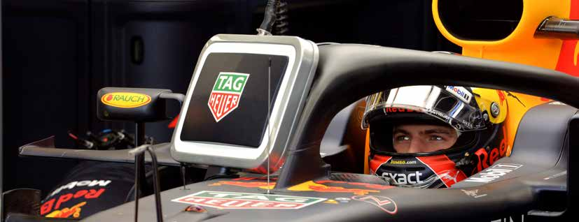

Official A4 Media Kit Cover Width 210mm x Depth 297mm (3mm bleed)

DE MONACO

MONTE CARLO 24 -27 MAY

The F1 logos, F1, FORMULA 1, FIA FORMULA ONE WORLD CHAMPIONSHIP, GRAND PRIX DE MONACO and related marks are trade marks of Formula One Licensing BV, a Formula 1 company. All rights reserved. OFFICIAL MEDIA KIT 1

76e GRAND PRIX

DE MONACO

24-27 MAI 2018

comptant pour le Championnat

du Monde de Formule 1 de la FIA 2018

Organisé par l’Automobile Club de Monaco

Sous le Haut Patronage de

LEURS ALTESSES SERENISSIMES LE PRINCE

ET LA PRINCESSE DE MONACO

Avec le concours du Gouvernement Princier, de la Municipalité, et la participation de la Société des Bains de Mer

2

SOMMAIRE

L'histoire de l’Automobile Club de Monaco ............................................................................................... 4

76e Grand Prix Automobile de Monaco 2018

Programme ....................................................................................................................................................... 8

Horaires d’ouverture Centres Accréditation et Media Navettes Media ................................................................................................................................................ 9

Plan ...................................................................................................................................................................... 10

Informations diverses .................................................................................................................................... 11

Conférences de Presse ................................................................................................................................... 14

Zones interdites ............................................................................................................................................... 15

Equipements et moyens ................................................................................................................................ 17

Barême des vitesses ...................................................................................................................................... 19

Le Circuit ............................................................................................................................................................. 20

Les nouveaux stands “High Tech” .............................................................................................................. 21

Procédure Podium ........................................................................................................................................... 24

75e Grand Prix Automobile de Monaco 2017 ........................................................................................ 25

Championnat du Monde de F1 2017 - Les classements .................................................................. 29

76e Grand Prix Automobile de Monaco 2018

Liste des engagés ............................................................................................................................................ 30

Les casques ....................................................................................................................................................... 31

Répartition des garages dans la zone des stands ................................................................................ 32

Ecuries et Pilotes ............................................................................................................................................. 34

Championnat du Monde de F1 2018

Nouveautés techniques ................................................................................................................................. 44

Les précédents Grands Prix .......................................................................................................................... 46

Classements ...................................................................................................................................................... 51

Calendrier de la saison ................................................................................................................................... 52

Grand Prix Automobile de Monaco : 1929-2017

Palmarès ............................................................................................................................................................ 53

Records ................................................................................................................................................................ 56

1950-2017 - Les Vainqueurs du Championnat du Monde de F1 ................................................... 57

La Principauté de Monaco ............................................................................................................................ 59

Informations diverses .................................................................................................................................... 60

Photos : archives ACM - Jean-Marc FOLLETÉ - Michael ALESI - Jean-François GALERON

3

L'HISTOIRE DE L’AUTOMOBILE CLUB DE MONACO

La petite histoire retiendra que le club a été créé très exactement le 26 août 1890. Dénommé “Sport Vélocipédique de la Principauté (SVP) ”, il est né de la volonté de 21 passionnés, amoureux de la bicyclette. Il deviendra, en l’espace d’une semaine le “Sport Vélocipédique Monégasque (SVM) ”.

Une appellation d’origine qui évoluera vingt-sept années plus tard, le 28 août 1907, pour devenir le “Sport Automobile et Vélocipédique de Monaco (SAVM) ” à l’initiative du Président Henri Tairraz, en raison de l’avancée technologique des véhicules à moteur.

Le 31 octobre 1909, Alexandre Noghès devient Président du SAVM. Ce fut le début d’une grande aventure automobile. Sitôt élu, il propose un projet d’épreuve sportive qui verra finalement le jour deux ans plus tard, sous l’impulsion de son fils Antony, avec l’organisation du 1er Rallye Automobile Monaco disputé entre le 21 et le 29 janvier 1911.

Paris, Berlin, Bruxelles, Boulogne-sur-Mer, Vienne et Genève en furent les villes de départ. A la moyenne de 13,800 km/h, l’aviateur Henri Rougier, parti de Paris au volant d’une Turcat-Mery 25HP, triompha devant vingt-deux autres concurrents.

Fort de ce succès et pour ancrer dans l’esprit de ses membres que l’avenir de leur Association reposait désormais davantage sur quatre roues propulsées par un moteur à explosion plutôt que sur deux roues entrainées par la force des mollets, il fit éditer un annuaire dans lequel figuraient les noms et adresses des membres, des itinéraires d’excursions pour automobiles. La détermination des responsables du Sport Automobile et Vélocipédique de Monaco était évidente : ils commençaient à écrire l’avenir. La première guerre mondiale fut dévastatrice et le Sport Automobile mis en sommeil. En 1918, la Principauté pleure ses défunts, dont plusieurs dizaines faisaient partie de l’Association. Durant ces quatre années de conflits et on le comprend aisément, la SAVM n’a organisé ni manifestation sportive ni sortie amicale.

A force de persévérance, le président Noghès se remet à l’ouvrage et dévoile, au mois de janvier, que la 1ère semaine automobile – initiée en Juin 1914 - se disputera du 8 au 15 mars 1921. Cette dernière, dotée de 35.000 francs de prix, comporte différentes épreuves pour automobiles et motos, une exposition et un concours d’élégance. Résultat d’une perspicacité qui ne s’était jamais démentie, cette nouvelle manifestation confirma, à l’heureuse satisfaction de tous, que le président Noghès et son équipe étaient dans le vrai, quant à l’évolution du club et de son adéquation avec l’automobile.

Le 29 Mars 1925, dans la matinée, lors d’une assemblée générale extraordinaire réunissant cinquante-cinq membres du SAVM, le Président Alexandre Noghès déclara “qu’en raison de l’importance prise par la Société, il est obligatoire d’en changer le titre, et de la dénommer Automobile Club de Monaco ” en faisant remarquer que “le sport à bicyclette tend à devenir rare et l’automobile grandissante ”. La proposition fut donc mise au vote secret et approuvée par 49 voix pour, 5 voix contre et une abstention. En devenant ACM, l’Association entrait dans une grande et forte famille dont chaque membre incarnait l’aventure automobile à l’échelle d’un Etat. Encore fallait-il, pour que sa réussite fût totale, qu’elle soit admise au sein de l’Association Internationale des Automobiles Clubs Reconnus (AIACR), origine de l’actuelle Fédération Internationale de l’Automobile (FIA).

4

Antony Noghès, en qualité de Commissaire Général, fut chargé d’aller à Paris présenter la candidature de l’Automobile Club de Monaco. Il en revint malheureusement dépité, ces Messieurs de l’AIACR ayant considéré que le Club organisait bien des épreuves sportives mais que celles-ci ne se déroulaient pas pour autant sur le territoire Monégasque. A trente-cinq ans, Antony Noghès, blessé dans son amour propre, venait, avec toute la fougue de la jeunesse, de se lancer à lui-même un fantastique défi : créer une épreuve automobile sur le territoire national, c’est-à-dire, en ville.

Mais cette idée d’un circuit de vitesse dans la ville n’était-elle pas irréalisable ? Il y avait bien cette marche à escalader entre le Quai des États-Unis et le Quai Albert 1er, puis une autre marche à descendre du côté des Gazomètres. Il y avait aussi les pavés et les rails du tramway entre la Condamine et le Casino. Antony Noghès pesa le pour et le contre pendant deux ans. Il choisit enfin de confier son projet aux seules personnes dont il savait qu’il obtiendrait un avis pertinent et objectif : Louis Chiron au plan sportif et Jacques Taffe au plan technique.

Puis il fallut surtout convaincre la Société des Bains de Mer de participer et d’assurer le financement de cette épreuve. Son administrateur, Mr René LEON perçut tout l’intérêt de cette épreuve et libéra les fonds nécessaires.

Aucun pays au monde n’aura un tel circuit ! L’annonce officielle de l’organisation du Grand Prix fut triomphalement accueillie en Principauté de Monaco. Cela eut un retentissement tel, que le 18 octobre 1928, on pouvait lire dans la Gazette de Monaco : «Nous sommes heureux d’apprendre que l’Association Internationale des Automobiles Clubs Reconnus a admis l’ACM comme club national, ce qui porte à trente-quatre le nombre de pays représentés ”.

Six mois plus tard, le Dimanche 14 Avril 1929, sous un soleil printanier, S.A.S. Le Prince Pierre de Monaco, grand-père de S.A.S. le Prince Albert II, ouvrait le circuit du 1er Grand Prix de Monaco au volant d’une automobile de la marque VOISIN. A 13 h 30, 16 coureurs, représentant 7 pays et 6 marques automobiles prirent le départ d’un Grand Prix, disputé sur un circuit dont le tracé n’a pratiquement pas changé jusqu’à ce jour. 3 heures 56 minutes et 11 secondes plus tard, les 100 tours de course accomplis à 80,194 km/h de moyenne, S.A.S. le Prince Louis II, Souverain de Monaco, remettait la coupe au vainqueur, l’anglais William GROVER dit “Williams ” pilote d’une BUGATTI 35 B de 2,3 litres à compresseur.

Le succès de la course disputée dans les rues de la Principauté fut tel , que du jour au lendemain, les structures d’accueil et de fonctionnement du club s’en trouvèrent bouleversées. Il fallut s’agrandir, car le nombre des membres évolua très vite : 712 en 1929 ; 841 en 1930 ; 910 en 1931 dont “41 dames ”… on était déjà bien loin des 21 copains du Sport Vélocipédique de la Principauté !

Le 8 novembre 1940, alors que la 2e guerre mondiale connait ses premiers combats, Alexandre Noghès démissionne après 31 ans de présidence, considérant à juste titre avoir pleinement accompli sa mission. Le 17 novembre, son fils Antony fut élu à la succession de son père. Bien entendu les voitures ayant été réquisitionnées, on ressortit les bicyclettes ! Alexandre Noghès décèdera le 25 février 1944 à l’âge de 79 ans.

Après presque dix années de difficultés liées au conflit et à ses suites, c’est le 16 mai 1948 que les rues de la Principauté retentirent à nouveau du bruit presque oublié des moteurs de monoplaces.

Le cours des évènements était relancé et le Championnat du Monde de Formule 1 fut créé, deux ans plus tard, en 1950. Le 21 mai, consacre un pilote Argentin en Principauté ; Juan-Manuel Fangio, victorieux du 11e Grand Prix de Monaco.

5

Le 14 avril 1953, le président Antony Noghès met un terme à sa collaboration intensive avec le club. Alexandre AUTTIER lui succède en 1954.

Cinq années plus tard, l’ACM se dote d’un nouveau local. Depuis 1890, l’emplacement du siège a migré du café de la Méditerranée sur le boulevard de la Condamine (actuel Boulevard Albert 1er) au Café du Siècle, à l’angle de la Place d’Armes et de l’Avenue de la Gare (actuelle Avenue Prince Pierre), puis en 1907, au numéro 5 de la même avenue, en 1923, au rez-de-chaussée du numéro 1 de la rue Suffren-Reymond, et en 1931, au numéro 45 de la rue Grimaldi.

Le 15 avril 1958, LL.AA.SS. Le Prince Souverain et la Princesse Grâce de Monaco daignèrent honorer de Leur présence l’inauguration du nouveau siège et signer le livre d’or. C’était au numéro 23 du Boulevard Albert 1er, siège actuel du club.

Depuis le 7 mars 1972, l’équipe actuelle s’emploie, au quotidien, à réécrire l’histoire, tout en imaginant l’avenir. L’un des premiers actes, fut la création d’un Corps de Commissaires de Route et de Piste. Le professionnalisme dont devaient faire preuve les membres volontaires pour exercer bénévolement au cours du Rallye et du Grand Prix des fonctions de contrôle et de sécurité, exigeait une instruction spécifique, sanctionnée par une licence internationalement reconnue, et chaque année, remise en cause. Cette petite armée de quelques 700 hommes est parfaitement organisée et hiérarchisée. Elle est aussi universellement saluée pour son efficacité.

En 1984, les murs de l’ACM s’étendirent avec l’acquisition, Boulevard Albert 1er de l’ancien garage Rambaldi, puis avec la location des locaux de l’imprimerie Rosso.

Côté rue Grimaldi, ce fut l’achat de la Galerie Park Palace, la location des trois commerces qui la jouxtent, et enfin l’adjonction des locaux de la SAMIPA à l’ensemble des surfaces occupées. Ainsi, entre 1972 et 2015, les surfaces occupées ou acquises ont été multipliées par cinq.

Cela a permis de créer les structures d’un Restaurant, d’un Bar, de Salons privés pour les membres, d’une Boutique, d’une Agence de Publicité “ACM Sport et Marketing”, d’un centre de location pour les épreuves et de plusieurs locaux techniques loués en sus à la Maison de France.

Autant d’agrandissements que nécessaires pour assurer un quotidien et une fonctionnalité de tous les instants entre le Boulevard Albert 1er et la Rue Grimaldi, le tout, au bénéfice de la gestion des épreuves automobiles et des services réservés aux membres.

La longue et belle histoire du Club, avec ses rires et ses larmes, doit beaucoup aux bénévoles, aux permanents et aux membres qui ont su partager à travers les époques, des valeurs humaines communes, ainsi qu’à leur inébranlable fidélité aux Institutions de la Principauté et la volonté d’être, techniquement et sportivement, les meilleurs dans une compétition mondiale où l’amateurisme n’a plus sa place.

Aujourd’hui encore, les épreuves de l’Automobile Club de Monaco sont organisées dans le plus grand respect de la tradition et de l’innovation, avec toujours, ce brin d’audace qui caractérisait ses créateurs et pionniers des siècles derniers…

6

Grand Prix de Monaco de Formule 1 Le ‘Grand Prix de Monaco F1’ est considéré comme l’une des plus prestigieuses courses automobiles au monde, tout aussi reconnu que les 500 miles d’Indianapolis que les 24 Heures du Mans ou que le Rallye Monte-Carlo, “ le Monté ”.

Depuis sa création en 1929, pilotes et équipes ont toujours savouré le défi de conduire sur un circuit étroit dans les rues de la Principauté de Monaco, avec ses nombreux changements de relief, ses virages serrés et son célèbre tunnel. Il s’agit certainement d’un des circuits les plus exigeants du calendrier du Championnat du Monde de Formule 1, celui que les pilotes et équipes veulent gagner !

Le programme de la course est inhabituel, les 2 premières séances d’essais se déroulent en effet le jeudi et le circuit est ouvert au public le vendredi après-midi et chaque soir. Le Grand Prix de Monaco attire un total de 200 000 passionnés pendant le week-end. Il est considéré par les fans comme l’un des moments les plus grisants du calendrier sportif international de Formule Un.

Maintenir et développer l’ensemble de ces épreuves suppose un travail constant pour améliorer, parfois modifier “l’existant ”.

Ainsi, après de substantielles modifications, comme la nouvelle zone des stands, la Chicane Port, le tracé continue à faire l’objet d’études en vue de renforcer la sécurité du circuit et la fiabilité de la course.

LES PRESIDENTS DE L’ACM

1890 : Théodore MULLER 1891 : Frédéric BONNAUD 1892 : Victorien ROQUES 1893 : Ange MONTALDI 1894 : Docteur UEIRARD 1895 : M. ETAINTURIER 1896 / 1899 : Paul GALLERAND 1900 / 1902 : Henri ROUSTAN 1903 : P. GALLAND 1904 - 1909 : Henri TAIRRAZ 1909 - 1940 : Alexandre NOGHES 1940 - 1953 : Antony NOGHES 1954 - 1960 : Alexandre AUTTIER 1961 - 1964 : Joseph FISSORE 1965 - 1968 : Docteur Etienne BOERI 1970 - 1972 (Rallye) : Joseph FISSORE Depuis le Grand Prix 1972 : Me Michel BOERI

7

PROGRAMME

JEUDI 24.05

06:00 Fermeture du circuit

08:00 - 08:45 Formule Renault Séance d’essais

09:15 - 10:00 Formule 2 Séance d’essais

11:00 - 12:30 Formule 1 1ère Séance d’essais

13:20 - 13:36 Formule 2 Essais qualificatifs (Groupe A)

13:44 - 14:00 Formule 2 Essais qualificatifs (Groupe B)

15:00 - 16:30 Formule 1 2e Séance d’essais

17:15 - 18:00 Porsche Supercup Séance d’essais

19:30 Ouverture du circuit

VENDREDI 25.05

06:00 Fermeture du circuit

07:55 - 08:25 Formule Renault Essais qualificatifs + Départ (Série A)

08:33 - 09:03 Formule Renault Essais qualificatifs + Départ (Série B)

10:00 - 10:30 Porsche Supercup Essais qualificatifs

11:30 - 12:35 Formule 2 Course 1 (42 tours ou 60mn max.) 13:00 - 13:30 Renault Celebration laps

14:30 Ouverture du circuit

SAMEDI 26.05

08:00 Fermeture du circuit

10:00 - 10:30 Formule Renault Course 1 (25 mn + 1 tour) 12:00 - 13:00 Formule 1 3e Séance d’essais

15:00 - 16:00 Formule 1 Essais qualificatifs (Q1-Q2-Q3)

17:20 - 18:10 Formule 2 Course 2 (30 tours ou 45mn max.) 19:30 Ouverture du circuit

DIMANCHE 27.05

08:00 Fermeture du circuit

10:30 - 11:05 Porsche Supercup Course (16 tours ou 30mn max.)

12:00 - 12:30 Formule Renault Course 2 (25 mn + 1 tour) 13:40 Formule 1 Parade des pilotes

14:40 - 14:50 Formule 1 Mise en place sur la grille de départ

14:56 Formule 1 Hymne national

15:10 Formule 1 76e Grand Prix de Monaco (78 tours ou 120mn max.) 20:30 Ouverture du circuit

N.B : La fermeture de la route de la piscine s’effectuera tous les matins 2h00 plus tôt.

8

HORAIRES D’OUVERTURE DU CENTRE D’ACCREDITATION

Mercredi 23 mai 2018 de 08h00 à 19h00

Jeudi 24 mai 2018 de 08h00 à 18h00

Vendredi 25 mai 2018 de 08h00 à 13h00

Samedi 26 mai 2018 de 08h00 à 12h00

Dimanche 27 mai 2018 de 08h00 à 11h00

HORAIRES D’OUVERTURE DU CENTRE MEDIA

Mardi 22 mai 2018 de 14h00 à 19h00 (Permanents uniquement)

Mercredi 23 mai 2018 de 08h00 à 22h00

Jeudi 24 mai 2018 de 07h00 à 22h00

Vendredi 25 mai 2018 de 08h00 à 22h00

Samedi 26 mai 2018 de 07h00 à 23h00

Dimanche 27 mai 2018 de 07h00 - jusqu’au départ du dernier journaliste

NAVETTES MEDIA

|  | ACCRÉDITATIONS Départ toutes les 10 minutes | PECHEURS Départ toutes les 10 minutes | CENTRE MEDIA Départ à la demande Ave de la Quarantaine Parking des Pêcheurs |
| --- | --- | --- | --- |
| Mercredi 23 Mai | 8h00 - 19h00 | 7h50 - 20h00 | 18h00 - 22h15 |
| Jeudi 24 Mai | 8h00 - 18h00 | 6h50 - 16h00 | 16h00 - 22h15 |
| Vendredi 25 Mai | 8h00 - 13h00 | 7h50 - 13h00 | 13h00 - 22h15 |
| Samedi 26 Mai | 8h00 - 12h00 | 6h50 - 12h00 | 12h00 - 23h15 |
| Dimanche 27 Mai | 8h00 - 11h00 | 6h50 - 11h00 | 12h00 - Minuit |

9

O T T O V R A L

U D

D R NO N C IADE A N A V 'L E L E U D E O

REM E N YU UN E E V A SED NIM S E T H E LLIEO D' I T A LI B E C A R G DRAV C D R DESCENTE MOULINS G SNIDRAJ OTTOVRAL A BOUL E V E DES SELAZE NU OR G .E RUE L U UD DES ORCHIDEES O E IDM B S S LU E N G E AR MO ATE C IRF CHEMIN DE LA NOIX R N I G S NILUOM B R ECALP SE P D E DNARG NUDREV ED E ED U

N A V E N U E D U C A R NI E R A V E N U E D U M A R E C H A L 8102 IAM 72-42 F O C H E R U E J U UL E S FE N R R Y E V A PLACE RAYNAL RB U L E E U ANC Q ILB U P E R A L C N A L E D A R D B LEGA V P ELLUAG ED LARENEG UD EUNEVA E E L L L TM I U M RUE O DU MARC HE A UD B C EUR .V ED EN R E A G L A . U L I C A N E D S CL R E E EZNI'L R C D R A B O V UL E E C N A P L A E R D E F C A E L D P D B E R AV. E L L IA MERC NT ERUAL L P R O A H T C St CHARLES tS T .SS P .VA E A EUNEVA A R P EIRRAB ED .SSAP SELRAHC ENNEICNA tS .CS .VA 'L A E NARG EIRETOP .F S .C N N S IC I E SED DRA V M E O L U E L U DEM O .S B Y S S EN A E O P ICNARF N .CSE G O SR emsiruoT ud noitceriD ER SED O A A N U E T O T D Q SRUE L LF T IV S L S A E I N H M T 661 661 29 773+ .léT IL I C W R RUHC O O B AL S R E V D E SN . .SS N R I R E A A T D A E N N P A J ARG A R R ED G S I R tS E E O D R L I N E U E N P N G E V O A L R N L E T EUNEVA I I U C U L R LE TÔ HTÉ S U U E D N E LO D P O R O D M E E U B P V NE V A A EIRELAG D E III SELRAHC R UR B A V SNIDRAJ SNIDRAJ E SIANOPAJ P ONISAC L UD ECALP É FA U C S O IR A P E D B C E GIS A R IV ONISAC UD O N A C N U S P TN O M R IA F LE O TO N H IS A C E G A R IV R E IT R O P U D E G A R IV T E N E S S A L E N N U T E É R T N E OLRAC-ETNOM Accès INFORMATIONS CENTRE Lieu DELEGUES : 4, : Depuis à en Quai MEDIA pied voiture MEDIA Antoine la : par avenue gare : avenue rue avenue FIA 1er, de de de DIVERSES Monaco 1er la la de Prince étage Colle, Quarantaine. la Quarantaine. Place Pierre, d’Armes, Place d’Armes, avenue avenue du Port, du Port,

L A N G E VI LIELOSUAEB - E C A L P T I D E R C U D SIANNOYL S I R I S LEHCI E D EU R P S E D S E E L L A STRA-XUAEB LE S IR M neercs tnaiG Responsable Adjoint : Pierre de GUYONNET-DUPERAT la communication et Délégué Media pour la F1 : Matteo BONCIANI

U R E S S E F O R P U D EU N EVA C A R L P M U V D I E L A I E N T E U R T E OCANOM ED ELIBOMOTUA RUE DES GERANIUMS E GA .CSE SSAP RC U LE O H LE E HCI C M tS S A I M tS V . S S E R D O S R U E E S I S DA R A U P E t A R U e E S D V E U D L E A U U R RI E E R C SET TE N L OIV E U A C V E E N UE I D S E G L ASSAP t U E A DOD M B IC E H R E C L E S A A L IL S E D E U U R P RI N E C S E S IMPASSE A M t V S E E U N DE LA FONTAINE D E S U I S S E A T S O C AVENUE E A L C I A L HENRY EGRES V A EELLA VELIHGAID E ED NUE P DUNANT ESSEC DE E G A ERAUQS TI L SED M SIAHCRAMUAEB .VANIRP ' R H E LE TÔ HR E G A TIM E H TÔ H EUNEV A P E D A L E N N U T E IT R O S / tnaég narcE selleressaP EQUIPE Président National Adjoint Accréditations : Alexandre MEDIA Press de la : Officer Commission Eddy BRUNEAU GALLO : Richard Média assisté MICOUD : Michel de Céline DOTTA LUBERT

AVE N U E D E R U E D E A L RE BELLEV L L UE I V E RESPI U R O Q O E R V A R D ED E UN E V A BO U LE VA R D EGASSAP ETROP EGUOR D E 1F Responsable du Centre Média : Richard MICOUD assisté de Laurie AUGE et Majdi HAJJAR L E

XIRP R UE R UE BEL B O U SUISSE A V E N U CO S TA E N A N O IT E kcoddaP Avec Alain la d’AYRAL participation DE SERIGNAC, de : Marc BERGHMANS, Alain BERNARDI, Armand BONIFACI,

DNARG ARIERIEP AL ED .CSE BOULEVARD FCNS 10 06 01 39 DE SETAMUA EO . G C E T S S E ED A V E N U .CSE E ATSOC AL ED D E L A Z1 N O C IH C ED TROP OCANOM A ID E M A T ID E R C C A R T N E C FCNS Anne Bernard HALIN, LATOUR, Jérôme Fabrice HALIN, LESNE, Aldo Christian COLETTI, François MANE, Richard GIANNETTINI, MULLER, Jean Stéphane ITURRALDE, MULLER,

AVENUE D' e67 ALSAC E P eraG 773+ .léT GV A R IV É D -E ECALP ETOVED A 1 ER G A R IH C SRUE H eraG Yann-Antony NOGHES, Alain SACCO et Flavio VITALI.

ITTE H N IU G R U O E B EN E OM T T SE E D R D U B O SESREVID SNOITAMROFNI V EDNABAL R UE M E ALB O E US Q ESCALIER I UET B MALBOUSQUET U RU IMP ITTEHGENOM ITTEHGENOM R T . DE S D A D CARRIERES U L R E CH A D EM ÉRO NI V ERAUQS E KCRAMAL L N U N ID O O R J H A B E U R E U Q IG LE B P EXOTIQ E D ESC. J O O R I D GABRIEL S S R O U A B ARNOUX E E V III E P P L H U EIBRUT O AL ED - B NIMEHC FRA U R çN II I R O E E I I S N E IA ETOVE IN R IA O D R T D .C R A V E L N U O ED D B R EETNOM S E e EtS A ANAYAR V UD AL O V NI . T CT SE E T ER S L T E E A IL T G S E R U E A L U O L U I S U L U .P G E R M T U I SAC O S A A E IL V G B E A E R U G A U E A L L E R T S E R E B D EUR ID E L A M etS IR G R R E R U U MCA euqituoB R E E P I s E P se N R A I E U 1K T N E I C S E T S D O E N I U I à B R N F I L R F R O E R P T A 6K L U E T I F N E T R M E A E U RI R A S . T ERÈICNIRP B R R E A L S TRAPÉD E O R 1 O Y E G N N IV M C St O E e T N S N U E E R D I D Z R U L R S IU O L A N G E U N P N D EGOL E E S E A E S R L E I B SS P E U U ER R R U U R DE I U N U R R L R O G E EN E C UA E L SDNATS A S RRO I P M N R BE I D N R R E T C U ECALP Y E E U R S SEMRA'D S R E A D E V C IN A M R A E AZ O IL O L LI V ZAR L L N O E E U RE N RT OB U E E U U DE R E S P A 2X r ç e1 D ORE U TREBLA S EE GH AG RO IVN PORT 1X T S .A 05 IAUQ E D E GS AA RR IV AI S V E S S A C A L CI E R QUAI ANTOINE M E A DI V 1 E E A N R U C E E D N E T L R A E Q U A R A N T AI N E PE C SE G N IK R A P D M U S E EP N IMEHC A ID E M P O C E A N O G R A HI Q U E GNIKRAP SRUEHCEP SED PARKING Parking INFORMATIONS - - - - * -TV1 de Saisie essais ainsi Transmission Sur Sur gauche : 25 39 Retransmission que informatique des et récepteurs récepteurs des MEDIA de à Pêcheurs droite la courses immédiate zone MEDIA TV TV - en des TV2 - installés installés en Avenue Direction stands. : provenance de Chronométrage cette de au sur Course la information Centre les Quarantaine des 39 de - Média 22 positions TV3 tout postes : en Chronométrage (TV message français (Navettes de n°1). de commentateurs Commissaires concernant et toutes en - TV4 anglais. les : Signal le répartis 10 Radio-TV. déroulement minutes) international sur le circuit, des N LN E 00 A V PRI A ELLIEIVTNOF 50

O T T O S E R E R F S E V O IB ELLOC AL RR UO EC HDE UR gnikraP II siuoL edatS tropiléH 29 773+ P O T E U ITA ED noitceriD .léT ELLIEIVTNOF

O T T O R O T C E U E T E V O R N AS SE RB R LP EUR P ED

10 E H C INROC NIMEHC ENNEYOM SERIOVÉR SED T O C R E H E U N E VA H E U N E VA N ID R E X O A TI Q J U D DRAVELUOB E U Q IG LEB E IT D AL P D EU R C E U N E R A V A E V U E R I L T U HPE A SO J EU R O L B P EUR III R E IN IA R C H A R L E S III CMN E N T RREI ECIL CF OO M E AL LE T VI TROP 11 A L D E D A R D E T U O R L E V V A R U E O L B U O B H SEFLEU U R H T E II ELLEIVTNOF DES G A S S EREIRRUOF 8A P UI AVENUE

- EHCINRO C P A S T E U R AV E N U E ESC. DES SALINES III S E L R P D E L O SERUGIL SED EUNEVA ENNEYOM A A U E CIMETIERE MONACO H C EIRTSUDNI'L S T N D SREV E V A DE ECIN R A V LENNUT SREV E L ED U EUR O B

CONSIGNES

Des casiers équipés de verrou sont à la disposition des journalistes et des photographes, aux

mêmes horaires que ceux du Média Centre.

TRIBUNE PHOTOGRAPHES PODIUM

Elle est installée au niveau de la ligne de départ-arrivée, entre la piste et la zone des stands. Les photographes accrédités permanents avec une veste FIA ou une chasuble course par course. Pieds et trépieds interdits.

NB : La zone d’attente est située au pied du bâtiment de la Direction Course. Les commissaires et membres de la sécurité sont en charge de faire accéder les photographes depuis la passerelle d’entrée des stands jusqu’à cette zone d’attente (15 minutes avant la fin de chaque course), puis de leur faire traverser la Pitlane face à la Tribune Photographe (3 tours avant la fin de chaque course).

TOUR PHOTOGRAPHES

Elle est installée du côté gauche du virage Sainte-Dévote, accès par le passage souterrain. Les photographes accrédités permanents avec une veste FIA ou une chasuble course par course seront autorisés à y accéder. Pieds et trépieds interdits.

SERVICE D’AIDE AUX PHOTOGRAPHES

Un service d’assistance sera assuré au profit des photographes. Celui-ci sera implanté dans la zone photographes du Centre Média.

COMMUNIQUÉ

Par mesure de sécurité, la zone des stands et la piste seront évacuées 15 minutes avant chaque séance d’essais et chaque course. Seuls les médias équipés avec une chasuble pourront demeurer en bord de piste; cela concerne non seulement la Formule 1 mais également les courses annexes.

12 13

CONFÉRENCES DE PRESSE

CHAMPIONNAT DU MONDE DE FORMULE UN

Mercredi 23 Mai 2018 - 15h00

Conférence de Presse avec un maximum de 6 pilotes, choisis par le Responsable de la Communication et Délégué Media pour la F1, dans la Salle de Conférence de Presse du Média Centre.

Jeudi 24 Mai 2018 - 13h00

Conférence de Presse pour un maximum de 6 personnalités des écuries, choisies par le Responsable de la Communication et Délégué Media pour la F1, dans la Salle de Conférence de Presse du Média Centre.

Samedi 26 Mai 2018 - à l’issue de la séance d’essais qualificatifs

a) Interviews TV unilatérales des trois premiers pilotes de la séance d’essais qualificatifs, depuis l’entrée de la Pitlane

b) Conférence de Presse des trois premiers pilotes de la séance d’essais qualificatifs, dans la Salle de Conférence de Presse du Média Centre.

Dimanche 27 Mai 2018 - à l’issue de la cérémonie de remise des prix

a) Interviews TV unilatérales avec les trois pilotes en tête à l’issue de la course, au pied du podium.

b) Conférence de Presse de fin de course avec les trois premiers pilotes classés, dans la Salle de Conférence de Presse du Média Centre.

CHAMPIONNAT FIA DE FORMULE 2

Jeudi 24 Mai 2018 - 14h20

Conférence de Presse des trois premiers pilotes de la séance d’essais qualificatifs, dans la Salle de Conférence de Presse du Média Centre.

Vendredi 25 Mai 2018 - 13h00

Conférence de Presse de fin de course 1 avec les trois premiers pilotes classés, dans la Salle de Conférence de Presse du Média Centre.

Samedi 26 Mai 2018 - 18h30

Conférence de Presse de fin de course 2 avec les trois premiers pilotes classés, dans la Salle de Conférence de Presse du Média Centre.

* * * * *

Nous rappelons que durant les conférences de presse, les équipes de télévision et les cameras TV ne sont pas admises dans le Centre Média sauf si elles y ont été autorisées expressément par le Directeur de la Communication de la FIA pour la F1.

14

ZONES INTERDITES REITROP

UD LENNUT A Monaco, les Commissaires-Chefs de Poste sont libres d’accepter ou de refuser la présence EGARIV 8 EÉRTNE de quelque personne que ce soit dans la zone où se tiennent leurs commissaires. SETIDRETNI UAEBARIM LETÔH De plus, la sécurité nous impose de définir des zones interdites ou à circulation réglementée. ERIOTAPPAHCE Dans ces dernières, il n’est possible de séjourner un bref instant qu’avec l’accord du 7 SERIASSIMMOC TNEMETCIRTS Commissaire Chef de Poste. 5 ELOPORTEM LETÔH 6 Ces zones sont repérables sur le plan du circuit figurant en annexe et sont clairement 8102 SELLERESSAP EGARIV ONISAC TNOMRIAF OLRACETNOM indiquées sur le circuit par une signalétique spécifique. SETSOP IAM NUS tenessaM SENOZ SIRAP SRUESNECSA lennut 72-42 ED ONISAC erauqS ATTENTION ÉFAC 5 ertne 9 te 4 - TENESSAM 5 tours avant l’arrivée de la FIA Formula 2, le samedi, et 5 tours avant l’arrivée du Grand OCANOM Prix F1, le dimanche, certaines portes de circulation seront fermées. ED LETÔH SIRAP 3 EGARIV Ces portes sont identifiables par des affichettes qui y sont apposées indiquant clairement LENNUT cette procédure. EGATIMREH ED LETÔH EITROS En conséquence, il appartient à chaque journaliste désirant circuler entre la piste, les stands ELIBOMOTUA et le Média Centre de prendre ses précautions.

ERIOTAPPAHCE

ednetsO’D 01 ydenneK SRUESNECSA 2 XIRP .vA FJ ertne .vA SEHPARGOTOHP te ENACIHC N DNARG P O IT E 11 A ID A T ID R T E N RUOT M E R E C C e67 C A NORIHC 1 EGARIV 21 SIUOL E S N R AI U

| 1A 2018 21C 1B 12B 21B 12A 21A 2A 2B 13A 20B 13B 11B 4A 5 14 11C 11A 20b 15B 2C 4B 7 20A 16 2D 3C 8 15A 10 8B 6bis 22 9D 6 3A 3B 9A 19A 19B 17 9C 9B 18 ® | 2018 |
| --- | --- |
| ® |  |

ETOVED-ETS 31 NOITCERID ESRUOC ESSACSAR E N T R E Q U A R A N T G N IK R E A H P C E P S E C A D A L EGARIV 12 AL E DI D E TRAPÉD 41 51 ED M U E EGARIV E N V SDNATS A LARÉNÉG SEHPARGOTOHP 61 ELLERESSAP 71 81 SETIDRETNI 22 SÈCCA 02 RUOT OLINE

C A R E G I A S EGARIV SEHGON.A 91 E L O E U R

SENOZ ELGNAL E U U R E PRIN C U E E S S D E IN M A IL Z Z AR RRE U T E E D U E R S A ç A O V R E E N S U E DU PORT R R

15 16

650 620 120 EQUIPEMENTS ET MOYENS Commissaires Contrôleurs

Pompiers professionnels 2 véhicules de désincarcération 3km337 et d’extraction 42 postes d’interventions 84 Sécurité Circuit 5 véhicules d’intervention rapide Longueur du circuit 2 postes d’interventions réduits 22 Sécurité Paddock incendie 290km/h 26 Sécurité Stands

Vitesse de pointe

260,286km 19 de distance / 78 tours Virages 1’12”178 8 à gauche 11 à droite Record Kimi RAIKKONEN (2017) VIM VIM (Ferrari)

VIM Extraction

Extraction ÉQUIPEMENT MÉDICAL PISTE ÉQUIPEMENT MÉDICAL PUBLIC

1 Postes Médical Avancé (P.M.A.) 5 Médecins

1 Centre Médical 5 Médecins CRM 1 Structure hospitalière 6 Infirmières

29 Médecins-réanimateurs 12 Infirmières CRM

8 Médecins 210 Secouristes 1100 tonnes de tribunes 1420 22 Infirmières 15 ambulances Pneus de protection 10 18 Secouristes 49 Grues 3 véhicules d’intervention médicalisés (VIM) 2 véhicules d’intervention pour la désincarcération et Caméras de surveillance 21 km de rails de sécurité Virage Sainte Dévote l’extraction 15 fixes Haut avenue d’Ostende Square Massenet 1 hélicoptère 34 motorisées 800

880 m de barrières Tecpro® Extincteurs A v e n u e d e s S p é l u g u e s 36 valises de réanimation cardio-vasculaire 256 Ec h a p p a t o ir e v ir a g e M irabeau et respiratoire 1 tous les 15 mètres Virage Sun Casino Sortie Tunnel 30 matelas à depression Postes émetteurs/récepteurs 20 000 m2 de grillage 12 Sortie échappatoire Chicane 6 appareils de contention K.E.D. 10 Réseaux radio Sortie “S” Piscine Dépanneuses Rue Suffren Reymond 8 ambulances

17 18

                                           

                                              

                                                        

                                                      €    ‚

BARÊME DES VITESSES

           sur le circuit de Monaco (3km337)                   

   

 

                                       

                                                                                            

                  1’50’’ 109,309 km/h     1’51’’ 108,324 km/h           1’52’’ 107,357 km/h                1’53’’ 106,407 km/h 1’54’’ 105,473 km/h         1’55’’ 104,556 km/h       1’56’’ 103,655 km/h

                1’57’’ 102,769 km/h 1’58’’ 101,898 km/h               1’59’’ 101,042 km/h 2’00’’ 100,200 km/h

|  |  |  |  |  |  | 2’01’’  „   „2ƒ’02’’ | 99,371 km/h  ƒ 9 8ƒ,557 km/h “„…„Ž  |  |
| --- | --- | --- | --- | --- | --- | --- | --- | --- |
| 1’12 1’ 13 | ’’  ’’  | ˆ  1‰6„…6†,999 km/h    164,712 km/h |    ƒ     ƒ  1’32’’ | 130,695 | km/h | 2’03’’   Š ƒ’ | 97,75   ‹„    | 6 km/h    Ž   Ž |
| 1’14 1’15 |  ’’ ’’     |        ƒ1 6  2 ,486 km/h   Š              160,320 km/h |  „  1’33’’   ‡ 1’34’’  „  | 12 9 , 2ƒ9  0   127,914 | km/h km/h |  |   9 6,96 96,19   …  ŠŠ |  |
|  |  |  |  | 12 6 , 5ƒ6  8   125,250 km/h 123,958 km/h 122,693 km/h 121,545 km/h 120,240 km/h 119,049 km/h 117,882 km/h 116,737 km/h 115,615 km/h 114,514 km/h 113,433 km/h 112,373 km/h 111,333 km/h 110,311 km/h | km/h |  |   9 5Ž,42 |  |

 ‡ ‹    

   

19

LE CIRCUIT

Le circuit en lui-même n’a pas subi de transformations majeures, jusqu’en 1952 où des aménagements sont apportés au virage Sainte Dévote. Il faut attendre 1973 pour que le tracé subisse à nouveau un changement. Il est allongé de 135 m par l’adjonction d’une piste tout le long du port, piste qui épouse le tracé de la nouvelle piscine et se termine en épingle autour du restaurant “La Rascasse ”. Comme la distance au tour est augmentée, on limite le Grand Prix à 78 tours.

En 1976, deux chicanes supplémentaires, l’une à Sainte Dévote, l’autre à la sortie de l’épingle de la Rascasse sont ajoutées, puis en 1986 on procède à l’élargissement localisé de l’entrée du quai des Etats Unis au pied de la descente du Boulevard Louis II permettant la création d’une nouvelle chicane. En 1997, le premier “S ” de la Piscine est redessiné et porte le nom de virage “Louis Chiron ”.

Entre les Grands Prix 2002 et 2003, réalisation d’un terre-plein d’environ 5 000 m² par la création d’un mur de quai de 150 m de long déporté par rapport à l’ancien alignement d’une trentaine de mètres. Ce mur de quai a été réalisé par l’empilement de près de 400 blocs de béton de 10 tonnes chacun. Il sert également de mur de soutènement aux 25 000 m3 de remblais calibrés qui ont été mis en œuvre pour le remplissage du terre-plein permettant ainsi de créer une nouvelle plate-forme d’environ 5 000 m² à 1,20 m au–dessus du niveau de la mer. Dans le corps de ce terre-plein, près de 3 km de tranchées ont été exécutées pour l’installation des réseaux divers. Ces réseaux permettent la desserte de cette surface en électricité, téléphonie, télévision, eau potable ainsi que son assainissement tant en période de Grand Prix que pour de futures manifestations. En surface de cette plate-forme, ont été exécutés :

- le nouveau tronçon de piste du circuit de Formule 1; il consiste en une translation de l’ancien tracé d’une dizaine de mètres vers le port

- 36 supports béton qui ont permis dès le Grand Prix 2004 le montage de structures métalliques qui accueillent des loges situées à 13 m du sol au-dessus des trois nouvelles tribunes-gradins surplombant ainsi la nouvelle zone des stands.

En 2009, agencement d’une nouvelle loge princière.

En 2012, l’accès à la piste en sortie de la Pit Lane est agrandi et passe de 10 à 20m grâce à la suppression d’une jardinière, permettant une réinsertion beaucoup plus rapide des voitures sur la piste. Après étude au laser par une société spécialisée, la route depuis la sortie du tunnel jusqu’à la chicane, a été rabotée jusqu’à 20cm à certains endroits pour supprimer la bosse, mais également de supprimer les changements de devers. Le point d’impact de la chicane a été reculé de 14,6m. Le revêtement au sol de l’échappatoire de la chicane et du virage du Mirabeau a été réalisé avec un revêtement abrasif de freinage du type du circuit HTTP Paul Ricard. Les protections stands ont été entièrement rénovées par la suppression des vitres remplacées par des grilles métalliques de sécurité. Les amortisseurs pneumatiques qui auparavant équipaient le virage St Dévote et l’entrée droite des “S ” de la piscine ont été remplacés par des barrières TecPro de nouvelle génération.

En 2013, création d’un chanfrein à l’intérieur du virage Mirabeau Supérieur. Remplacement des protections pneumatiques par des blocs “Tecpro ” dans le virage ainsi que dans l’échappatoire du Mirabeau Supérieur.

En 2014, un nouveau mur des stands a été construit. Il se compose de 90 blocs d’acier remplis de béton, d’un poids unitaire de 2,7 tonnes. Une porte d’accès, dédié essentiellement aux personnes qui doivent se rendre sur la grille de départ, a été créée le long du mur des stands, au milieu de la voie des stands. Pour assurer un meilleur point de vue général pour tous, la passerelle située au niveau du “Plongeur ”, en face de la piscine, a été supprimée. Un nouveau système d’extinction par mousse a été mis en place le long des 2/3 du tunnel. Un trottoir, à l’extérieur de la piste, a été réalisé entre le nouveau Yacht Club et la chicane. Un rail intérieur, côté mer, remplace désormais l’ancien muret en face du virage du bureau de tabac.

20

Depuis 2015, une modification a été apportée au niveau du virage bureau de tabac (plus refermé en entrée), car la piste entière au niveau de la Darse Nord a été décalée de 2m70 vers la mer. La distance totale est désormais de 3,337 kilomètres.

A partir de 2016, un changement d’éclairage du tunnel a été effectué pour atténuer l’effet de trou noir à l’entrée de celui-ci et l’effet d éblouissement à la sortie. Un élargissement de piste de 30 cm a été apporté au niveau de la chaussée entre le virage Sainte Dévote et l’Avenue de la Costa. Mais la grande nouveauté de 2016 reste toutefois le nouveau bâtiment de la Direction Course.

En 2017, l’Automobile Club de Monaco montre une nouvelle fois l’esprit novateur dont il fait preuve en matière de constructions modulaires et de structures modernes, avec la nouvelle loge princière...

2018 : DES NOUVEAUX STANDS “HIGH TECH”

Après la Direction Course réalisée il y a deux ans et la nouvelle Loge Princière en 2017, il était primordial de conserver une cohérence de style et un aspect visuel harmonieux sur l'ensemble du site. C’est dans cet esprit qu’a été retenu le parti pris architectural de ces structures.

Avec ces nouveaux stands, l’Automobile Club de Monaco prouve son engagement pour le futur, dans sa volonté sans cesse renouvelée d’aller de l’avant et de moderniser le circuit. Après près de quinze ans de bons et loyaux services, il est devenu nécessaire de réfléchir à la mise en place de nouvelles installations. Ces dernières années, l’univers de la Formule 1 a multiplié les circuits permanents et a effectivement connu de nombreuses évolutions technologiques. C’est donc en parfaite concertation avec les écuries et grâce à l’expérience accumulée depuis 2004, que ces nouveaux stands ont été conçus et réalisés.

21

Tout d’abord, afin de gagner de l’espace, l’architecture a été modifiée avec l'intégration d'un deuxième étage. Cet agrandissement d’un tiers de la surface, devait toutefois s’accommoder avec un impératif fondamental propre à un circuit urbain et temporaire : la rapidité de montage et de démontage. C’est ainsi que le cahier des charges a imposé au fabricant un délai inférieur à un jour pour le montage et le démontage de chaque stand. Il y en a 12, deux semaines suffiront.

Chaque stand, d’une surface totale de 450m2, comprend donc trois étages de 150m2 chacun :

• Le niveau 0 est réservé à la mécanique;

• Au 1er seront répartis les salles de mesures informatiques, les consoles de pistes, les salles de réunions, les bureaux des ingénieurs,…

• Le second étage est dédié au repos des pilotes et à l’accueil des sponsors et des invités V.I.P. Il offre une vue époustouflante sur la partie basse du circuit et sur la zone des stands.

A l'avant, côté “pit-lane», deux colonnes de verres miroirs inclinées ont été réalisées. Ces dernières bordent l’ensemble de la façade, composées de baies verticales intégrant, au second niveau, un balcon panoramique. Ce balcon est surmonté d'une toiture de protection représentant un aileron arrière de Formule 1.

Comme en 2004, les F1 historiques ont été les premières à profiter de ces nouveaux stands, à l’occasion du 11e Grand Prix Historique, les 11, 12 et 13 mai derniers… Ils accueillent du 24 au 27 mai 2018 les monoplaces du Championnat du Monde FIA de Formule 1.

QUELQUES CHIFFRES

> Nombre de modules réalisés ....................................................................................... 120

> Heures de travail en fabrication .............................................................................. 21000

> Temps de montage sur le circuit ............................................................................. 14 Jours

> Surface au sol ....................................................................................................................................... 18000 m2

> Poids de l'aileron en toiture ........................................................................................... Moins de 3 tonnes

> Poids de la charpente acier de base ................................................................... 18 tonnes

> Poids total des structures acier ............................................................................... 400 tonnes

> Longueur cumulée des poutres, poteaux, longerons................. 30 km

> Nombre de rivets sur ailerons toiture ............................................................. 48000

> Longueurs des chemins de câbles électriques .................................. 6,3 km

> Nombre d'appareils d'éclairage ................................................................................ 1488

> Nombre de connecteurs électriques ................................................................... 1220

> Volume d'exploitation admissible (Stockage, ateliers) ............ plus de 10000m³

22

PORT DE MONACO - CONSTRUCTION DU CIRCUIT EN 5 ÉTAPES

DIMANCHE 25 MARS 2018 - 8:30 / MONACO - ÉTAPE 1 DIMANCHE 8 AVRIL 2018 - 9:30 / MONACO - ÉTAPE 2 MELBOURNE, GRAND PRIX D'AUSTRALIE BAHREIN, GRAND PRIX DE BAHREIN

DIMANCHE 15 AVRIL 2018 - 20:00 / MONACO - ÉTAPE 3 DIMANCHE 29 AVRIL 2018 - 15:30 / MONACO - ÉTAPE 4 SHANGAI, GRAND PRIX DE CHINE BAKOU, GRAND PRIX D'AZERBAIDJAN

DIMANCHE 13 MAI 2018 - 14:00 / MONACO - ÉTAPE 5 / BARCELONE, GRAND PRIX D’ESPAGNE

23

PROCEDURE PODIUM A MONACO

Un tour après le franchissement de la ligne d’arrivée, le vainqueur, le deuxième et le troisième de l’épreuve s’arrêtent au pied de la Loge Princière.

Interviews des trois meilleurs pilotes classés au profit du public depuis le bord de piste devant la Loge Princière.

Dès que le constructeur de la voiture gagnante les rejoint, ils accèdent à la Loge Princière.

Exécution des hymnes nationaux dans l’ordre, celui du pilote vainqueur, celui du constructeur vainqueur. Au cas où l’hymne national serait le même pour le pilote et pour le constructeur, il ne sera joué qu’une seule fois.

S.A.S. le Prince de Monaco remet son trophée au pilote vainqueur. Puis dans l’ordre, le constructeur vainqueur, le pilote classé deuxième et le pilote classé troisième recevront leurs trophées - Champagne.

Immédiatement après, les trois pilotes seront amenés en voiture au Média Centre Quai Antoine 1er - où se déroulera la conférence de presse d’après Grand Prix.

24

75e GRAND PRIX DE MONACO 2017

SÉANCES D’ESSAIS First Practice Session Classification

1ère Séance d’Essais Libres

POS NO DRIVER NAT ENTRANT TIME LAPS GAP KPH TIME OF DAY 1 44 L. HAMILTON GBR Mercedes AMG Petronas F1 Team 1:13.425 40 163.611 10:48:37 2 5 S. VETTEL GER Scuderia Ferrari 1:13.621 34 0.196 163.176 10:58:15 0.150 3 33 M. VERSTAPPEN NED Red Bull Racing 1:13.771 32 0.346 162.844 11:21:27 0.020 4 77 V. BOTTAS FIN Mercedes AMG Petronas F1 Team 1:13.791 40 0.366 162.800 10:49:22 0.063 5 3 D. RICCIARDO AUS Red Bull Racing 1:13.854 45 0.429 162.661 11:03:02 0.257 6 26 D. KVYAT RUS Scuderia Toro Rosso 1:14.111 42 0.686 162.097 11:14:15 0.053 7 7 K. RAIKKONEN FIN Scuderia Ferrari 1:14.164 37 0.739 161.981 11:06:35 0.037 8 11 S. PEREZ MEX Sahara Force India F1 Team 1:14.201 32 0.776 161.900 11:02:20 0.132 9 55 C. SAINZ ESP Scuderia Toro Rosso 1:14.333 39 0.908 161.613 11:08:52 0.092 10 31 E. OCON FRA Sahara Force India F1 Team 1:14.425 39 1.000 161.413 11:06:53 0.192 11 19 F. MASSA BRA Williams Martini Racing 1:14.617 37 1.192 160.998 10:45:00 0.196 12 2 S. VANDOORNE BEL McLaren Honda 1:14.813 38 1.388 160.576 11:15:43 0.057 13 20 K. MAGNUSSEN DEN Haas F1 Team 1:14.870 34 1.445 160.454 10:51:46 0.084 14 22 J. BUTTON GBR McLaren Honda 1:14.954 35 1.529 160.274 11:16:34 0.367 15 8 R. GROSJEAN FRA Haas F1 Team 1:15.321 33 1.896 159.493 10:49:31 0.274 16 18 L. STROLL CAN Williams Martini Racing 1:15.595 44 2.170 158.915 10:56:41 0.354 17 30 J. PALMER GBR Renault Sport F1 Team 1:15.949 42 2.524 158.174 11:05:25 0.309 18 94 P. WEHRLEIN GER Sauber F1 Team 1:16.258 33 2.833 157.533 11:00:35 19 27 N. HULKENBERG GER Renault Sport F1 Team 3 20 9 M. ERICSSON SWE Sauber F1 Team 3 Second Practice Session Classification

2e Séance d’Essais Libres

| POS NO DRIVER NAT ENTRANT TIME LAPS GAP KPH TIME OF DAY 1 5 S. VETTEL GER Scuderia Ferrari 1:12.720 38 165.198 14:51:42 2 3 D. RICCIARDO AUS Red Bull Racing 1:13.207 35 0.487 164.099 14:51:50 0.076 3 7 K. RAIKKONEN FIN Scuderia Ferrari 1:13.283 46 0.563 163.928 14:43:02 0.048 4 26 D. KVYAT RUS Scuderia Toro Rosso 1:13.331 41 0.611 163.821 14:15:09 0.069 5 55 C. SAINZ ESP Scuderia Toro Rosso 1:13.400 43 0.680 163.667 14:40:42 0.086 6 33 M. VERSTAPPEN NED Red Bull Racing 1:13.486 36 0.766 163.476 14:20:47 0.313 7 11 S. PEREZ MEX Sahara Force India F1 Team 1:13.799 45 1.079 162.782 14:34:16 0.074 me8keepe4r4: L. HAMILTON GBR Mercedes AMG Petronas F1 Team 1:13.873 31 1.153 162.619 14:42:49 0.017 9 20 K. MAGNUSSEN DEN Haas F1 Team 1:13.890 46 1.170 162.582 14:45:13 0.012 10 77 V. BOTTAS FORMFUINLA M1e rcGedResA AMNGD Pe tPronRasI XF1 TDeaEm MONA1C:13O.9 02201379 - M1o.1n8t2e-Carlo 162.555 14:44:01 0.044 N1 o 1 p a r t o f th 2 e s e S re. s Vu l tAs / d Na tD a mO a Oy b Re rNe p E r o d u ce d , s t oB rE e dL in a r e Mt ri ec vL a a l r se y n s t eH m o no dr ta ra n sm it te d in a n y fo r m o r b y a n y m e 1a n :s 1 e 3l e . c9t r 4 o n6 ic , m 4e c2 h a n ic a l, 1 p h. 2o t2o c6 o p y i n g0 , r.u e0b c l3o r5 d in g , b r1o a6 d2 c a. s4 t i5n g9 o r o th e r1 w 4 is:e51:03 w i t h o u t p r i o r p e r m is s i o n o f t h e c o p y ri g h t h o ld e r e x c e p t f o r r e p r o d u c t i o n i n l o c a l/ n a tio n al/ in te r n a ti on a l d ai l y p r e s s a n d r e g u l a r p r i n t e d p u b li ca t io n s o n sa le to t h e p ic w it h in 9 0 d a y s o f th e e v e n t t o w1h2ich the 2re2sultJs/d. aBta UreTlatTe OanNd provided that the cGopByRright symMbcoLl aarpepne aHrso tnodgaether with the address shown below.1:13.981 37 1.261 162.382 14:51:54 he F1 FORMULA 1 logo, F1 logo, F1 FIA FORMULA 1 WORLD CHAMPIONSHIP logo, FORMULA 1, FORMULA ONE, F1, FIA FORMULA ONE WORLD CH0A.0M2PI2ONSHIP, GRAND PRIX and ©1 e l 2 a 30 te 1 d 7 m Fo a 1 r r k 9m s u a l r aF e O . t r n a Me d e AW m oS a rl r Sd k s AC o h f a F m o p rm io u n la s h O ip ne L L td ic , e 6 nB s PRi r n iAg n c B e V s , G a Wa F t o eilr ,lm iLau oml n as d O oMn n ea, rS gtriWnoui7 pR 1 caQ ocJ mi,n p Ega n n g y l . and. 1:14.003 46 1.283 0.019 162.333 14:47:18 14 8 R. GROSJEAN FRA Haas F1 Team 1:14.022 44 1.302 162.292 14:42:30 0.071 15 31 E. OCON FRA Sahara Force India F1 Team 1:14.093 47 1.373 162.136 14:46:10 0.381 16 18 L. STROLL CAN Williams Martini Racing 1:14.474 27 1.754 161.307 14:31:08 0.396 17 27 N. HULKENBERG GER Renault Sport F1 Team 1:14.870 41 2.150 160.454 15:02:54 0.746 18 30 J. PALMER GBR Renault Sport F1 Team 1:15.616 8 2.896 158.871 14:10:09 0.075 19 9 M. ERICSSON SWE Sauber F1 Team 1:15.691 32 2.971 158.713 14:48:13 0.004 20 94 P. WEHRLEIN GER Sauber F1 Team 1:15.695 37 2.975 158.705 14:52:44 |  |  |
| --- | --- | --- |
| 11 |  |  |
| No part of these results/data may be reproduced, stored in a retrieval system or transmitted in any form or by any means electronic, mechanical, photoc without prior permission of the copyright holder except for reproduction in local/national/international daily press and regular printed publications on sale | o p y i n g0 , r.u e0b c l3o r5 d i to t h e p ic w | ng, broadcasting or otherwise ithin 90 days of the event to |
| w1h2ich the 2re2sultJs/d. aBta UreTlatTe OanNd provided that the cGopByRright symMbcoLl aarpepne aHrso tnodgaether with the address shown below.1:13.981 37 1.26 he F1 FORMULA 1 logo, F1 logo, F1 FIA FORMULA 1 WORLD CHAMPIONSHIP logo, FORMULA 1, FORMULA ONE, F1, FIA FORMULA ONE WO |  |  |
| ©1 e l 2 a 30 te 1 d 7 m Fo a 1 r r k 9m s u a l r aF e O . t r n a Me d e AW m oS a rl r Sd k s AC o h f a F m o p rm io u n la s h O ip ne L L td ic , e 6 nB s PRi r n iAg n c B e V s , G a Wa F t o eilr ,lm iLau oml n as d O oMn n ea, rS gtriWnoui7 pR 1 caQ ocJ mi,n p Ega n n g y l . and. 1:14.003 46 1.28 14 8 R. GROSJEAN FRA Haas F1 Team 1:14.022 44 1.30 15 31 E. OCON FRA Sahara Force India F1 Team 1:14.093 47 1.37 16 18 L. STROLL CAN Williams Martini Racing 1:14.474 27 1.75 17 27 N. HULKENBERG GER Renault Sport F1 Team 1:14.870 41 2.15 18 30 J. PALMER GBR Renault Sport F1 Team 1:15.616 8 2.89 19 9 M. ERICSSON SWE Sauber F1 Team 1:15.691 32 2.97 20 94 P. WEHRLEIN GER Sauber F1 Team 1:15.695 37 2.97 |  |  |
| 20 |  |  |

| K. MAGNUSSE |  |  |  |  |  |  |  |  |
| --- | --- | --- | --- | --- | --- | --- | --- | --- |
| V. BOTTA | FORM | FUIN | LA | M1e rcGedResA AMNGD Pe tPronRasI XF1 TD | eaEm MON | A1C:13O.9 02201 | 379 - M1o.1n8t | 0.012 2e-Carlo |

25

Timekeeper:

FORMULA 1 GRAND PRIX DE MONACO 2017 - Monte-Carlo

No part of these results/data may be reproduced, stored in a retrieval system or transmitted in any form or by any means electronic, mechanical, photocopying, recording, broadcasting or otherwise without prior permission of the copyright holder except for reproduction in local/national/international daily press and regular printed publications on sale to the public within 90 days of the event to which the results/data relate and provided that the copyright symbol appears together with the address shown below. The F1 FORMULA 1 logo, F1 logo, F1 FIA FORMULA 1 WORLD CHAMPIONSHIP logo, FORMULA 1, FORMULA ONE, F1, FIA FORMULA ONE WORLD CHAMPIONSHIP, GRAND PRIX and related marks are trade marks of Formula One Licensing BV, a Formula One group company. © 2017 Formula One World Championship Ltd, 6 Princes Gate, London, SW7 1QJ, England.

75e GRAND PRIX DE MONACO 2017

SÉANCES D’ESSAIS Third Practice Session Classification

3e Séance d’Essais Libres

POS NO DRIVER NAT ENTRANT TIME LAPS GAP KPH TIME OF DAY 1 5 S. VETTEL GER Scuderia Ferrari 1:12.395 23 165.939 11:42:37 2 7 K. RAIKKONEN FIN Scuderia Ferrari 1:12.740 26 0.345 165.152 11:45:07 0.090 3 77 V. BOTTAS FIN Mercedes AMG Petronas F1 Team 1:12.830 29 0.435 164.948 11:46:52 0.110 4 33 M. VERSTAPPEN NED Red Bull Racing 1:12.940 27 0.545 164.699 11:32:52 0.290 5 44 L. HAMILTON GBR Mercedes AMG Petronas F1 Team 1:13.230 27 0.835 164.047 11:19:37 0.162 6 3 D. RICCIARDO AUS Red Bull Racing 1:13.392 24 0.997 163.685 11:33:01 0.008 7 55 C. SAINZ ESP Scuderia Toro Rosso 1:13.400 27 1.005 163.667 12:00:00 0.163 8 26 D. KVYAT RUS Scuderia Toro Rosso 1:13.563 23 1.168 163.304 11:24:37 0.033 9 20 K. MAGNUSSEN DEN Haas F1 Team 1:13.596 21 1.201 163.231 11:50:55 0.209 10 2 S. VANDOORNE BEL McLaren Honda 1:13.805 21 1.410 162.769 11:26:28 0.131 11 11 S. PEREZ MEX Sahara Force India F1 Team 1:13.936 23 1.541 162.481 12:00:07 0.040 12 22 J. BUTTON GBR McLaren Honda 1:13.976 26 1.581 162.393 11:48:28 0.096 13 31 E. OCON FRA Sahara Force India F1 Team 1:14.072 21 1.677 162.182 11:21:53 0.000 14 19 F. MASSA BRA Williams Martini Racing 1:14.072 28 1.677 162.182 11:58:54 0.211 15 27 N. HULKENBERG GER Renault Sport F1 Team 1:14.283 24 1.888 161.722 11:58:16 0.264 16 8 R. GROSJEAN FRA Haas F1 Team 1:14.547 23 2.152 161.149 11:25:00 0.128 17 18 L. STROLL CAN Williams Martini Racing 1:14.675 35 2.280 160.873 11:51:18 0.489 18 30 J. PALMER GBR Renault Sport F1 Team 1:15.164 25 2.769 159.826 11:38:25 0.127 19 94 P. WEHRLEIN GER Sauber F1 Team 1:15.291 29 2.896 159.556 11:59:41 Doc0 .53722 Time 18:25 20 9 M. ERICSSON SWE Sauber F1 Team 1:15.863 26 3.468 158.353 11:59:38 Qualifying Session Official Classification

Essais Qualificatifs

POS NO NAME ENTRANT Q1 LAPS PERCENT TIME OF DAY Q2 LAPS TIME OF DAY Q3 LAPS TIME OF DAY 1 7 K. RAIKKONEN Scuderia Ferrari 1:13.117 8 100.053 14:09:12 1:12.231 7 14:35:00 1:12.178 8 14:58:39 2 5 S. VETTEL Scuderia Ferrari 1:13.090 8 100.016 14:09:23 1:12.449 7 14:36:52 1:12.221 8 15:00:14 3 77 V. BOTTAS Mercedes AMG Petronas F1 Team 1:13.325 10 100.337 14:12:33 1:12.901 10 14:30:17 1:12.223 10 15:00:29 4 33 M. VERSTAPPEN Red Bull Racing 1:13.078 8 100.000 14:09:17 1:12.697 9 14:38:58 1:12.496 7 15:00:35 5 3 D. RICCIARDO Red Bull Racing 1:13.219 6 100.192 14:08:14 1:13.011 9 14:30:12 1:12.998 6 14:51:43 6 55 C. SAINZ Scuderia Toro Rosso 1:13.526 9 100.613 14:14:45 1:13.397 11 14:39:13 1:13.162 10 15:00:10 7 11 S. PEREZ Sahara Force India F1 Team 1:13.530 6 100.618 14:07:42 1:13.430 9 14:39:30 1:13.329 8 15:01:01 8 8 R. GROSJEAN Haas F1 Team 1:13.786 13 100.968 14:19:00 1:13.203 10 14:35:25 1:13.349 6 14:57:00 Timekeeper: 9 22 J. BUTTON McLaren Honda 1:13.723 12 100.882 14:16:29 1:13.453 9 14:32:34 1:13.613 6 15:00:40 10 2 S. VANDOORNE McLaren Honda 1:13.476 11 100.544 14:16:21 1:13.249 9 14:32:12 FORMULA 1 GRAND PRIX DE MONACO 2017 - Monte-Carlo 11 26 D. KVYAT Scuderia Toro Rosso 1:13.899 10 101.123 14:08:05 9 14:31:59 N1i o2th p e r w ise w o e n t to which T1h3e and related ©1 15 19 F. MASSA Williams Martini Racing 1:13.796 14 100.982 14:14:17 1:20.529 6 14:38:56 16 31 E. OCON Sahara Force India F1 Team 1:14.101 7 101.399 14:14:59 17 30 J. PALMER Renault Sport F1 Team 1:14.696 11 102.214 14:18:08 18 18 L. STROLL Williams Martini Racing 1:14.893 7 102.483 14:08:56 19 94 P. WEHRLEIN Sauber F1 Team 1:15.159 11 102.847 14:14:52 20 9 M. ERICSSON Sauber F1 Team 1:15.276 11 103.007 14:14:50 POLE POSITION LAP 7 K. RAIKKONEN Scuderia Ferrari 1:12.178 166.438 KPH FASTEST LAP OVERALL 7 K. RAIKKONEN Scuderia Ferrari 1:12.178 166.438 KPH

| 2u r t7t p o r f i No th r . e p s He e r Um re iLs s s u Ki l o t E s n / d No a fB t t a hE e m Rc a o y Gp b y e r | i g re hRp t r heo ond ld uae cue rl td e S, x s cpt e oop rrt et f dFo r i1n r eTa p er r eao tmd ri u e c v t a io l n s y in s t l e o m ca | o l/ r n 1t a r:a ti1o n n s3m a.l7/ it in t8e te d7r n in a a t1i n o | 2n y a fo l 1r d m a0i l0o y r . p b9r y e7 s a0s n y a n | m d1e 4r a e:n g1s u 8l e a l r:e 3p ct r1r in | onic, ted | p m 1u e b: c l1i h c3a a t n .io i 6 c n a 2s l, 8 o p n h o s9a to l | e c o t1o p y4t i h n:e g3 , p0 r u e:b c0l o ic1r d w in it g h | , broadcasting or ot in 90 days of the ev |
| --- | --- | --- | --- | --- | --- | --- | --- | --- |
| the results/data relate and provided that the copyright symbol appears together with the address shown belo |  |  |  |  |  |  |  |  |
| 210 FOKR.M MULAAG 1 NloUgoS, FS1E loNgo, d marks are trade marks of Fo | F1 FHIaAa FsO FR1M TUeLaAm 1 WORLD CHAMPION rmula One Licensing BV, a Formula One | SH1I:P1 l3og.5o,3 F1ORM1 group company. | U1LA1 10, F0O.6R1M9ULA | 1 O4N:E1,1 F:14, F2I | A FO | 1RM:1U3LA.9 O5N9E W9O | RL1D4 C:3H8AM:4P1ION |  |
| 474 FoLrm. uHlaA OMnIeL WToOrlNd Cham | pioMnsehricpe Ldteds, 6A PMrGin cPeest rGoantaes, LFo1n dToena, | mSW17: 11Q3J.6, E4n0glan |  | 14:11:34 |  |  |  |  |

26

Tim Mayer Jose Abed Derek Warw ick Eric Barrabino The Stew ards

Timekeeper:

FORMULA 1 GRAND PRIX DE MONACO 2017 - Monte-Carlo

No part of these results/data may be reproduced, stored in a retrieval system or transmitted in any form or by any means electronic, mechanical, photocopying, recording, broadcasting or otherwise without prior permission of the copyright holder except for reproduction in local/national/international daily press and regular printed publications on sale to the public within 90 days of the event to which the results/data relate and provided that the copyright symbol appears together with the address shown below. The F1 FORMULA 1 logo, F1 logo, F1 FIA FORMULA 1 WORLD CHAMPIONSHIP logo, FORMULA 1, FORMULA ONE, F1, FIA FORMULA ONE WORLD CHAMPIONSHIP, GRAND PRIX and related marks are trade marks of Formula One Licensing BV, a Formula One group company. © 2017 Formula One World Championship Ltd, 6 Princes Gate, London, SW7 1QJ, England.

75e GRAND PRIX DE MONACO 2017 Doc 39 Time 13:00 LA GRILLE DE DÉPART Official Starting Grid

POLE POSITION

7 K. RAIKKONEN 1 1:12.178 Scuderia Ferrari 2 5 S. VETTEL 1:12.221 Scuderia Ferrari 77 V. BOTTAS 3 1:12.223 Mercedes AMG Petronas F1 Team 4 33 M. VERSTAPPEN 1:12.496 Red Bull Racing 3 D. RICCIARDO 5 1:12.998 Red Bull Racing 6 55 C. SAINZ 1:13.162 Scuderia Toro Rosso 11 S. PEREZ 7 1:13.329 Sahara Force India F1 Team 8 8 R. GROSJEAN 1:13.349 Haas F1 Team 26 D. KVYAT 9 1:13.516 Scuderia Toro Rosso 10 27 N. HULKENBERG 1:13.628 Renault Sport F1 Team 20 K. MAGNUSSEN 11 1:13.959 Haas F1 Team 12 2 S. VANDOORNE * McLaren Honda 44 L. HAMILTON 13 1:14.106 Mercedes AMG Petronas F1 Team 14 19 F. MASSA 1:20.529 Williams Martini Racing 31 E. OCON 15 1:14.101 Sahara Force India F1 Team 16 30 J. PALMER 1:14.696 Renault Sport F1 Team 18 L. STROLL 17 1:14.893 Williams Martini Racing 18 94 P. WEHRLEIN 1:15.159 Sauber F1 Team 9 M. ERICSSON * 19 1:15.276 Sauber F1 Team

DRIVERS REQUIRED TO START FROM THE PIT LANE 22 J. BUTTON * 1:13.613 McLaren Honda

* PENALTIES Car 2 - 3 place grid penalty - Causing a collision - Stewards' document no. 45 (2017 Spanish Grand Prix) Car 22 - 15 place grid penalty - Additional power unit elements have been used - Stewards' document no. 22 Car 9 - 5 place grid penalty - Replacement Gearbox - Stewards' document no. 36 Car 22 - Required to start from the Pit Lane - Car modified whilst under Parc Fermé conditions - Stewards' document no. 37

Tim Mayer J ose Abed Derek Warw ic k Eric Barrabino

The St ew ards

| No part of | these results/data m | ay be | reproduced, stored in a retrieval system or transmitted in any form or by any means electronic, mechanical, photocopying, recording, broadcasting or otherwise |
| --- | --- | --- | --- |
| without pr which the | ior permission of the results/data relate an | copyr d pro |  |
| The F1 F | ORMULA 1 logo, F1 l | ogo, F | 1 FIA FORMULA 1 WORLD CHAMPIONSHIP logo, FORMULA 1, FORMULA ONE, F1, FIA FORMULA ONE WORLD CHAMPIONSHIP, GRAND PRIX |
| related m | arks are trade marks | of For | mula One Licensing BV, a Formula One group compan |
| © 2017 F | ormula One World C | hampionship Ltd, 6 Princes Gate, London, SW7 1QJ, England. |  |

27

|  | 18:2 |
| --- | --- |
| POS NO DRIVER NAT ENTRANT LAPS TIME GAP KPH BE 1 5 S. VETTEL GER Scuderia Ferrari 78 1:44:44.340 149.105 1:15. 2 7 K. RAIKKONEN FIN Scuderia Ferrari 78 1:44:47.485 3.145 149.030 1:15. 0.600 3 3 D. RICCIARDO AUS Red Bull Racing 78 1:44:48.085 3.745 149.016 1:15. 1.772 4 77 V. BOTTAS FIN Mercedes AMG Petronas F1 Team 78 1:44:49.857 5.517 148.974 1:16. 0.682 5 33 M. VERSTAPPEN NED Red Bull Racing 78 1:44:50.539 6.199 148.958 1:16. 5.839 6 55 C. SAINZ ESP Scuderia Toro Rosso 78 1:44:56.378 12.038 148.820 1:16. 3.763 7 44 L. HAMILTON GBR Mercedes AMG Petronas F1 Team 78 1:45:00.141 15.801 148.731 1:15. 2.349 8 8 R. GROSJEAN FRA Haas F1 Team 78 1:45:02.490 18.150 148.676 1:17. 1.295 9 19 F. MASSA BRA Williams Martini Racing 78 1:45:03.785 19.445 148.645 1:16. 1.998 10 20 K. MAGNUSSEN DEN Haas F1 Team 78 1:45:05.783 21.443 148.598 1:16. 1.294 11 30 J. PALMER GBR Renault Sport F1 Team 78 1:45:07.077 22.737 148.567 1:16. 0.988 12 31 E. OCON FRA Sahara Force India F1 Team 78 1:45:08.065 23.725 148.544 1:16. 25.364 13 11 S. PEREZ * MEX Sahara Force India F1 Team 78 1:45:33.429 49.089 147.949 1:14. 14 26 D. KVYAT RUS Scuderia Toro Rosso 71 1:35:56.482 DNF 148.169 1:16. 15 18 L. STROLL CAN Williams Martini Racing 71 1:36:22.014 DNF 147.515 1:16. NOT CLASSIFIED 2 S. VANDOORNE BEL McLaren Honda 66 1:29:11.317 DNF 148.163 1:16. 9 M. ERICSSON SWE Sauber F1 Team 63 1:25:09.966 DNF 148.108 1:16. 22 J. BUTTON GBR McLaren Honda 57 1:15:53.814 DNF 150.368 1:16. 94 P. WEHRLEIN * GER Sauber F1 Team 57 1:15:56.744 DNF 150.272 1:18. 27 N. HULKENBERG GER Renault Sport F1 Team 15 19:50.068 DNF 151.418 1:17. FASTEST LAP 11 S. PEREZ MEX Sahara Force India F1 Team 1:14.820 on lap 76 160.561 | ST LAP 238 38 527 39 756 51 439 22 329 56 649 39 825 54 095 45 543 50 313 44 614 55 482 52 820 76 539 43 075 71 665 45 829 39 912 47 034 25 885 13 |

* PENALTIES Car 94 - 5 second time penalty - Unsafe release - Stewards' document no. 41 Car 11 - 10 second time penalty - Causing a collision - Stewards' document no. 50

Tim Mayer J ose Abed Derek Warw ic k Eric Barrabino

The St ew ards

Timekeeper:

FORMULA 1 GRAND PRIX DE MONACO 2017 - Monte-Carlo

|  | No part of these results/data may be reproduced, stored in a retrieval system or transmitted in any form or by any means electronic, mechanical, photocopying, recording, broadcasting or other |  |  |  | wise |
| --- | --- | --- | --- | --- | --- |
| without prior pe which the resul The F1 FORM related marks a © 2017 Formu | without prior pe | rmission of the copyright holder except for reproduction in local/national/international daily press and regular printed publications on sale to the public within 90 days of the event |  |  | to |
|  | which the resul The F1 FORM elated marks a | ts/data relate and provided that the copyright symbol appears together with the address shown below ULA 1 logo, F1 logo, F1 FIA FORMULA 1 WORLD CHAMPIONSHIP logo, FORMULA 1, FORMULA ONE, F1, FIA FORMULA ONE WORLD CHAMPIONSHIP, GRAND PRIX an re trade marks of Formula One Licensing BV, a Formula One group company. |  | . |  |
|  | © 2017 Formu | la On | e World Championship Ltd, 6 Princes Gate, London, SW7 1QJ, Engla |  |  |

28

CHAMPIONNAT DU MONDE DE FORMULE UN 2017

CLASSEMENTS

PILOTES

| Pos. | Pilotes | Nat. | Ecuries | Points |
| --- | --- | --- | --- | --- |
|  | LEWIS HAMILTON | GBR | MERCEDES |  |
|  | SEBASTIAN VETTEL | GER | FERRARI |  |
|  | VALTTERI BOTTAS | FIN | MERCEDES |  |
|  | KIMI RÄIKKÖNEN | FIN | FERRARI |  |
|  | DANIEL RICCIARDO | AUS | RED BULL RACING TAG HEUER |  |
|  | MAX VERSTAPPEN | NED | RED BULL RACING TAG HEUER |  |
|  | SERGIO PEREZ | MEX | FORCE INDIA MERCEDES |  |
|  | ESTEBAN OCON | FRA | FORCE INDIA MERCEDES |  |
|  | CARLOS SAINZ | ESP | RENAULT |  |
|  | NICO HULKENBERG | GER | RENAULT |  |
|  | FELIPE MASSA | BRA | WILLIAMS MERCEDES |  |
|  | LANCE STROLL | CAN | WILLIAMS MERCEDES |  |
|  | ROMAIN GROSJEAN | FRA | HAAS FERRARI |  |
|  | KEVIN MAGNUSSEN | DEN | HAAS FERRARI |  |
|  | FERNANDO ALONSO | ESP | MCLAREN HONDA |  |
|  | STOFFEL VANDOORNE | BEL | MCLAREN HONDA |  |
|  | JOLYON PALMER | GBR | RENAULT |  |
|  | PASCAL WEHRLEIN | GER | SAUBER FERRARI |  |
|  | DANIIL KVYAT | RUS | TORO ROSSO |  |
|  | MARCUS ERICSSON | SWE | SAUBER FERRARI |  |
|  | PIERRE GASLY | FRA | TORO ROSSO |  |
|  | ANTONIO GIOVINAZZI | ITA | SAUBER FERRARI |  |

23 BRENDON HARTLEY NZL TORO ROSSO 0

CONSTRUCTEURS

Pos. Ecuries Points

1 MERCEDES 668

2 FERRARI 522

3 RED BULL RACING TAG HEUER 368

4 FORCE INDIA MERCEDES 187

5 WILLIAMS MERCEDES 83

6 RENAULT 57

7 TORO ROSSO 53

8 HAAS FERRARI 47

9 MCLAREN HONDA 30

10 SAUBER FERRARI 5

29

76e GRAND PRIX AUTOMOBILE DE MONACO F1 2018

LISTE DES ENGAGÉS

N° Pilote Nat. Ecurie Chassis / Moteur

44 Lewis HAMILTON GBR MERCEDES AMG MERCEDES F1 W09 77 Valtteri BOTTAS FIN PETRONAS MOTORSPORT MERCEDES

5 Sebastian VETTEL DEU FERRARI SF71H SCUDERIA FERRARI 7 Kimi RÄIKKÖNEN FIN FERRARI

3 Daniel RICCIARDO AUS ASTON MARTIN ASTON MARTIN RED BULL RB14 33 Max VERSTAPPEN HOL RED BULL RACING TAG HEUER

27 Nico HÜLKENBERG DEU RENAULT SPORT RENAULT R18 55 Carlos SAINZ Jr ESP FORMULA ONE TEAM RENAULT

14 Fernando ALONSO ESP McLAREN MCL33 McLAREN F1 TEAM 2 Stoffel VANDOORNE BEL RENAULT

8 Romain GROSJEAN FRA HAAS VF-18 HAAS F1 TEAM 20 Kevin MAGNUSSEN DNK FERRARI

11 Sergio PÉREZ MEX SAHARA FORCE INDIA FORCE INDIA VJM11 31 Esteban OCON FRA F1 TEAM MERCEDES

10 Pierre GASLY FRA RED BULL TORO ROSSO STR13 28 Brendon HARTLEY NZL TORO ROSSO HONDA HONDA

9 Marcus ERICSSON SWE ALFA ROMEO SAUBER C37 16 Charles LECLERC MCO SAUBER F1 TEAM FERRARI

18 Lance STROLL CAN WILLIAMS WILLIAMS FW41 35 Sergey SIROTKIN RUS MARTINI RACING MERCEDES

30

SAISON 2018 DE FORMULE 1 / LES CASQUES

MERCEDES AMG PETRONAS MOTORSPORT HAAS F1 TEAM

Lewis Romain

44 HAMILTON GBR 8 GROSJEAN FRA

Valtteri Kevin

77 BOTTAS FIN 20 MAGNUSSEN DNK

SCUDERIA FERRARI SAHARA FORCE INDIA F1 TEAM

Sebastian Sergio

5 VETTEL DEU 11 PÉREZ MEX

Kimi Esteban

7 RÄIKKÖNEN FIN 31 OCON FRA

ASTON MARTIN RED BULL RACING RED BULL TORO ROSSO HONDA

Daniel Pierre

3 RICCIARDO AUS 10 GASLY FRA

Max Brendon

33 VERSTAPPEN HOL 28 HARTLEY NZL

RENAULT SPORT FORMULA ONE TEAM ALFA ROMEO SAUBER F1 TEAM

Nico Marcus

27 HÜLKENBERG DEU 9 ERICSSON SWE

Carlos Charles

55 SAINZ Jr ESP 16 LECLERC MCO

McLAREN F1 TEAM WILLIAMS MARTINI RACING

Fernando Lance

14 ALONSO ESP 18 STROLL CAN

Stoffel Sergey

2 VANDOORNE BEL 35 SIROTKIN RUS

31

RÉPARTITION DES GARAGES DANS LA PITLANE

32 33

MERCEDES AMG PETRONAS MOTORSPORT

mercedes-amg-f1.com Début France 1954

173* Grands Prix disputés* 1954 et 1955 inclus

78 Victoires

162 Podiums

90 Pole positions

57 Meilleurs tours

4 Titres Constructeur 2014, 2015, 2016, 2017

#44 Britannique

LEWIS HAMILTON 07.01.85

Stevenage, Royaume-Uni Tenant du titre et quadruple Champion du Monde (comme Prost Début en F1 Australie 2007 et Vettel). Atteindre les cinq titres Champion du Monde de Juan Manuel Fangio pour rentrer 2008, 2014, 2015, 2017 définitivement dans la légende de la Formule 1 est envisageable... à 213 GP disputés condition que Vettel ne le fasse pas 64 Victoires avant lui ! 121 Podiums

74 Pole positions

38 Meilleurs tours

#77 Finlandais

VALTTERI BOTTAS 28.08.89

Nastola, Finlande Très rapide, capable de signer des poles et de gagner, le Finlandais Début en F1 Australie 2013 doit faire preuve de constance Meilleur classement au plus haut niveau. Il est cette 3e en 2017 année dans l’obligation de se battre régulièrement pour la victoire ou au 102 GP disputés moins d’engranger de gros points 3 Victoires pour Mercedes, en s’intercalant 25 Podiums si possible entre Hamilton et ses adversaires directs. 4 Pole positions

5 Meilleurs tours

34

SCUDERIA FERRARI

formula1ferrari.com Début Monaco 1950

954 Grands Prix disputés

231 Victoires

732 Podiums

216 Pole positions

244 Meilleurs tours

16 Titres Constructeur 1961, 1964, 1975, 1976, 1977, 1979, 1982, 1983, 1999, 2000, 2001, 2002, 2003, 2004, 2007, 2008

#5 Allemand

SEBASTIAN VETTEL 03.07.87

Heppenheim, Allemagne Quadruple champion du monde, toujours affamé de victoires et de Début en F1 USA 2007 titres après quatre saisons chez Champion du Monde Ferrari, Vettel a tous les atouts 2010, 2011, 2012, 2013 en main pour égaler Fangio, dans un modèle 2018 aussi fiable que 203 GP disputés compétitif. 49 Victoires

101 Podiums

53 Pole positions

33 Meilleurs tours

#7 Finlandais

KIMI RAÏKKÖNEN 17.10.79

Espoo, Finlande Sacré en 2007 avec Ferrari, 4e du championnat 2017, Iceman a Début en F1 Australie 2001 fait une bonne saison malgré une Champion du Monde 2007 malchance tenace. Souvent dans l’ombre de son coéquipier, il n’a plus 276 GP disputés gagné en F1 depuis 2013 mais 20 Victoires il a tout pour briller à nouveau. A Monaco, dans la foulée de sa 2e 94 Podiums place de 2017 ? 17 Pole positions

45 Meilleurs tours

35

ASTON MARTIN RED BULL RACING

redbullracing.com Début Australie 2005

249 Grands Prix disputés

56 Victoires

150 Podiums

58 Pole positions

57 Meilleurs tours

4 Titres Constructeur 2010, 2011, 2012, 2013

#3 Australien

DANIEL RICCIARDO 01.07.89

Perth, Australie 2017 a été une année noire (6 abandons) pour l’Australien, qui Début en F1 Grande-Bretagne 2011 est en fin de contrat chez Red Meilleur classement Bull. Il n’a pas d’autre choix que de 3e (2014, 2016) marquer un maximum de points pour conserver son baquet... ou 134 GP disputés trouver refuge dans une écurie de 6 Victoires pointe. Troisième l’an dernier en 28 Podiums Principauté, il est toujours aussi rapide. La preuve, il a remporté en 1 Pole positions Chine son 6e GP de F1. 12 Meilleurs tours

#33 Néerlandais

MAX VERSTAPPEN 30.09.97

Hasselt, Belgique Après une saison 2017 en dents de scie (4 podiums, dont 2 victoires Début en F1 Australie 2015 en Malaisie et au Mexique), Meilleur classement Verstappen doit apprendre à 5e en 2016 canaliser sa fougue, à “ se calmer”, comme le lui conseillent certains de 65 GP disputés ses rivaux. Il devra être plus régulier 3 Victoires pour viser le titre pilotes. Il en a le 12 Podiums talent, c’est évident. - Pole positions

2 Meilleurs tours

35

RENAULT SPORT FORMULA ONE TEAM

renaultsport.com Début Gde-Bretagne 1977

346 Grands Prix disputés

35 Victoires

100 Podiums

51 Pole positions

31 Meilleurs tours

2 Titres Constructeur 2005, 2006

#27 Allemand

NICO HÜLKENBERG 19.08.87

Emmerich, Allemagne Nico a terminé 10e du championnat 2017, il sait marquer des points Début en F1 Bahrein 2010 (43 sur les 57 de Renault en 2017). Meilleur classement Et l’Allemand a encore scoré lors 9e (2014, 2016) des trois premiers Grands Prix de la saison 2018. Renault compte 140 GP disputés plus que jamais sur lui pour grimper - Victoires dans le Top 5 des écuries. - Podiums

1 Pole positions

2 Meilleurs tours

#55 Espagnol

CARLOS SAINZ Jr 01.09.94

Madrid, Espagne Prêté pour 2018 par Red Bull Racing, Carlos Sainz, après trois Début en F1 Australie 2015 saisons de F1, doit signer de Meilleur classement très bons résultats et battre un 9e en 2017 coéquipier coriace et expérimenté. Fils d’un double champion du 65 GP disputés monde des rallyes, il en a les - Victoires moyens.. - Podiums

- Pole positions

- Meilleurs tours

37

McLAREN F1 TEAM

mclaren.com

Début Monaco 1966

826 Grands Prix disputés

182 Victoires

485 Podiums

155 Pole positions

155 Meilleurs tours

8 Titres Constructeur 1974, 1984, 1985, 1988, 1989, 1990, 1991, 1998

#14 Espagnol

FERNANDO ALONSO 29.07.81

Oviedo, Espagne L’un des pilotes les plus expérimentés du plateau. Double Début en F1 Australie 2001 champion du monde (2005-2006), Champion du Monde 2005, 2006 mais lors des trois dernières saisons chez McLaren il n’a pu 295 GP disputés terminer que 15 fois dans les 32 Victoires points (en 56 GP). Toujours dans le coup en pilotage pur, il souhaite 97 Podiums retrouver bientôt l’ivresse du 22 Pole positions podium. 23 Meilleurs tours

#2 Belge

STOFFEL VANDOORNE 26.03.92

Kortrijk, Belgique En 2017, le Belge n’est entré que trois fois dans les points, Début en F1 Bahrein 2016 abandonnant cinq fois. En 2018, Meilleur classement Stoffel est déjà arrivé trois fois dans 16e en 2017 le Top 10, sur les quatre premiers Grand Prix ! On devrait voir bientôt 25 GP disputés son vrai niveau, pour peu que sa - Victoires voiture se montre plus fiable et plus - Podiums performante. - Pole positions

- Meilleurs tours

38

HAAS F1 TEAM

haasf1team.com Début Australie 2016

46 Grands Prix disputés

- Victoires

- Podiums

- Pole positions

- Meilleurs tours

47 Points en 2017

#8 Français

ROMAIN GROSJEAN 17.04.86

Genève, Suisse Le Franco-Suisse a plus de 120 GP derrière lui et la victoire lui échappe Début en F1 Europe 2009 toujours. Ses dix podiums datent Meilleur classement de l’époque Lotus, mais avec Haas 7e en 2013 il n’a pu finir que huit courses dans les points l’an dernier. Avec 127 GP disputés une monoplace supposée plus - Victoires performante, il va devoir se montrer 10 Podiums plus régulier et surclasser son bouillant coéquipier. - Pole positions

1 Meilleurs tours

#20 Danois

KEVIN MAGNUSSEN 05.10.92

Roskilde, Danemark Pour sa deuxième saison avec Haas, le Danois va devoir faire Début en F1 Australie 2014 mieux qu’en 2017 (5 fois dans les Meilleur classement points et 5 abandons). Son sens de 11e en 2014 la bagarre en piste et son caractère bien trempé lui valent certaines 65 GP disputés critiques, il doit donc transformer - Victoires son agressivité en points. 1 Podiums

- Pole positions

- Meilleurs tours

39

SAHARA FORCE INDIA F1 TEAM

forceindiaf1.com Début Australie 2008

196 Grands Prix disputés

- Victoires

6 Podiums

1 Pole positions

5 Meilleurs tours

187 Points en 2017

#11 Méxicain

SERGIO PEREZ 26.01.90

Guadalajara, Méxique Le pilote mexicain est dans sa 8e saison de Formule 1. En 2018, Début en F1 Australie 2011 Pérez devra d’abord tenter de Meilleur classement battre son jeune et talentueux 7e (2016, 2017) coéquipier Esteban Ocon qui lui a donné une belle réplique la saison 139 GP disputés dernière. - Victoires

8 Podiums

- Pole positions

4 Meilleurs tours

#31 Français

ESTEBAN OCON 17.09.96

Evreux, France Le Français, couvé par Mercedes, s’est affirmé chez Force India en Début en F1 Belgique 2016 2017 en démontrant son niveau, Meilleur classement Il termine 18 fois dans les points 8e en 2017 contre 17 pour Pérez. En 2018, il devra confirmer, Perez est prévenu. 34 GP disputés

- Victoires

- Podiums

- Pole positions

- Meilleurs tours

40

RED BULL TORO ROSSO HONDA

scuderiatororosso.redbull.com

Début Bahrein 2006

231 Grands Prix disputés

1 Victoires

1 Podiums

1 Pole positions

1 Meilleurs tours

53 Points en 2017

#10 Français PIERRE GASLY 07.02.96

Pierre va devoir prouver sa valeur Rouen, France

à Red Bull. Arrivé à la fin de saison Début en F1 Malaisie 2017 2017, le champion GP2 2016 (et Meilleur classement vice-champion 2017 de Super 21een 2017 Formula, au Japon) a clairement l’objectif de marquer le plus de 10 GP disputés points possible tout en étant - Victoires régulier. Sa performance à Bahreïn (4e) est prometteuse. - Podiums

- Pole positions

- Meilleurs tours

#28 Neo-Zélandais

BRENDON HARTLEY 10.11.89

Palmerston North, NZ Couvé par Red Bull, il débute en F1 en 2008 au volant d’une Toro Début en F1 USA 2017 Rosso lors d’essais privés qui se Meilleur classement révèleront sans suite. Il rebondit 23e en 2017 chez Porsche en endurance, remporte deux fois le WEC et 9 GP disputés une fois les 24 Heures du Mans. - Victoires Son rappel chez Toro Rosso, en - Podiums fin de saison 2017, aux côtés du fougueux Gasly, lui met forcément - Pole positions une pression supplémentaire. - Meilleurs tours

41

ALFA ROMEO SAUBER F1 TEAM

sauberf1team.com Début Afrique du Sud 1993

357 Grands Prix disputés

- Victoires

10 Podiums

- Pole positions

3 Meilleurs tours

5 Points en 2017

#9 Suèdois

MARCUS ERICSSON 02.09.90

Kumla, Suède Cette année, pour sa 5e saison en F1, avec une monoplace qui Début en F1 Australie 2014 devrait être plus compétitive et Meilleur classement un coéquipier débutant, Ericsson 18een 2015 n’aura pas d’excuse pour ne pas être devant. 62 GP disputés

- Victoires

- Podiums

- Pole positions

- Meilleurs tours

#16 Monégasque

CHARLES LECLERC 16.10.97

Monaco A 20 ans, Leclerc arrive en F1 auréolé de deux titres d’affilée : Début en F1 Australie 2018 GP3 en 2016, F2 en 2017. Couvé Meilleur classement par Ferrari qui voit en lui un futur 6e à Baku 2018 grand de la F1, le Monégasque va devoir être fiable et surtout 5 GP disputés “apprendre à ne pas gagner”. Il sera - Victoires sous le feu des projecteurs pour - Podiums son Grand Prix national, avec une pression supplémentaire. Surtout - Pole positions après sa 6e place de Bakou. - Meilleurs tours

42

WILLIAMS MARTINI RACING

williamsf1.com Début Espagne 1977

707 Grands Prix disputés

114 Victoires

312 Podiums

128 Pole positions

133 Meilleurs tours

9 Titres Constructeur 1980, 1981, 1986, 1987, 1992, 1993, 1994, 1996, 1997

#18 Canadien

LANCE STROLL 29.10.98

Montréal, Canada Ancien membre de la Ferrari Driver Academy, dans laquelle il avait été Début en F1 Australie 2017 recruté à l’âge de 9 ans, le Canadien Meilleur classement a été Champion d’Italie de F4 en 12e en 2017 2014 et Champion d’Europe de F3 en 2016. En 2017, il a signé un 25 GP disputés podium à Bakou et fait presque - Victoires jeu égal avec son expérimenté 1 Podiums coéquipier Felipe Massa (40 points contre 43). En 2018, il devra - Pole positions confirmer et ne pas se contenter de - Meilleurs tours battre son débutant de coéquipier.

#35 Russe SERGEY SIROTKIN 27.08.95

Titulaire dans une écurie de milieu Moscou, Russie

de tableau dans laquelle on attend Début en F1 Australie 2018 beaucoup de lui, il est un peu sous 5 GP disputés pression. Son coéquipier, à peine plus expérimenté que lui, ne sera - Victoires pas d’une grande aide dans ses - Podiums choix techniques ou tactiques. Heureusement chez Williams, on - Pole positions peut compter sur un metteur au - Meilleurs tours point aussi brillant qu’expérimenté : Robert Kubica.

43

CHAMPIONNAT DU MONDE DE FORMULE UN 2018

LES NOUVEAUTÉS TECHNIQUES

HALO

Cet arceau de sécurité est placé à l’avant du cockpit pour protéger la tête des pilotes en cas d’accident ou de débris projetés dans les airs par une autre monoplace. Fabriquée en titane, cette structure en forme de T est conçue pour résister pendant cinq secondes au poids d’un autobus à impériale. Elle ne pèse que neuf kilos mais il faut y ajouter six kilos de plus pour ses fixations sur le cockpit. Tous les halos ne sont pas identiques car trois fabricants ont été choisis, en Italie, en Allemagne et en Grande-Bretagne, et ils coûtent plus de 15.000€ pièce. Le délai maximum pour sortir du cockpit a été augmenté, passant de deux à sept secondes.

TROIS MOTEURS

Cette saison, chaque pilote est limité à un maximum de trois exemplaires de chaque composant du moteur, au lieu de quatre l’an dernier. Et cela malgré le fait qu’il y aura un Grand Prix de plus. Il doit donc se contenter de trois moteurs thermiques, trois turbos, trois moteurs électriques pour la récupération de la chaleur du turbo (MGU-H), trois pour récupérer l’énergie du freinage (MGU-K), mais deux batteries et deux boîtiers de contrôle électroniques, le tout pour 21 courses. Pour améliorer la fiabilité de ces composants, certaines écuries peuvent choisir de réduire la puissance.

AILERONS DE REQUIN ET “T-WINGS” INTERDITS

Les longs capots moteur en forme d’aileron de requin ont été interdits, tout comme les petits ailerons “T-wings” et autres “sièges à singes” installés l’an dernier, derrière l’aileron de requin. Ces appendices aérodynamiques multiples, désormais bannis, exploitaient une faille du règlement pour améliorer le fonctionnement de l’aileron arrière principal en dirigeant plus précisément les flux d’air dans sa direction, avec parfois une esthétique douteuse.

44

SEPT TYPES DE PNEUS La gamme de pneus Pirelli a été élargie, de cinq à sept types de gomme : un nouveau pneu “hyper- tendre”, dont les flancs portent une marque rose, est désormais proposé, ainsi qu’un pneu “super-dur”, à bande latérale orange, qui ne sera peut-être jamais utilisé. L’an dernier, une grande partie de la gamme était considérée comme trop dure, donc tous les pneus de la gamme 2018 sont un peu plus tendres. Le pneu à flancs bleus est le pneu dur principal.

HARO SUR L’HUILE BRÛLÉE Pour éviter que certaines écuries injectent des vapeurs d’huile de qualité supérieure dans la prise d’air moteur, pour favoriser la combustion, la FIA a interdit tout dispositif permettant de le faire. Les équipes doivent fournir en permanence, grâce à des capteurs spécifiques, plus précis, la quantité d’huile embarquée et consommée, ainsi que la pression d’huile.

SYSTÈME HYBRIDE Le poids et le volume de certains composants électriques des systèmes hybrides ont été standardisés et la FIA va surveiller la température de l’air au niveau du moteur pour garantir qu’elle reste supérieure à 10°C.

PÉNALITÉS SUR LA GRILLE Elles ont aussi été simplifiées : tout pilote pénalisé de plus de 15 places pour avoir dépassé son quota de composants moteur prendra le départ en fond de grille, en tenant compte de l’ordre dans lequel ces éléments ont été utilisés par les équipes.

DÉPARTS ANTICIPÉS La surveillance des départs a été améliorée grâce à l’ajout d’un programme spécifique sur les transpondeurs (boîtiers électroniques) des monoplaces. Une pénalité de 10 secondes, avec passage obligatoire par les stands, sera infligée pour tout départ anticipé.

ANGLE DES SUSPENSIONS La FIA souhaite empêcher les écuries d’utiliser l’angle de braquage de la direction pour gagner un avantage aérodynamique en utilisant des systèmes de suspension avant modifiés. Le changement de la hauteur de caisse, avec direction bloquée, ne pourra pas dépasser 5 mm.

DÉPART ARRÊTÉ APRÈS SAFETY CAR Un nouveau départ arrêté sera donné après chaque sortie du Safety Car provoquée par un drapeau rouge, sauf si les conditions de course n’y sont pas favorables.

21 GRANDS PRIX AU CALENDRIER Grâce au retour du Grand Prix de France sur le Circuit Paul Ricard et du GP d’Allemagne à Hockenheim, et malgré la disparition du GP de Malaisie, la saison 2018 sera composée de 21 courses. Et le GP de France ouvrira une série de trois courses en 15 jours, entre fin juin et début juillet, qui continuera en Autriche et se terminera à Silverstone. Une première depuis 1950 !

PARITÉ DES MOTEURS La FIA a publié une directive technique rappelant aux motoristes qu’ils doivent fournir des moteurs dont les spécifications techniques sont identiques à leur équipe d’usine et à leurs écuries clientes. Cela comprend aussi les logiciels informatiques, le carburant et les lubrifiants, quand le fournisseur est le même.

45

CHAMPIONNAT DU MONDE DE FORMULE UN 2018

LES PRÉCÉDENTS GRANDS PRIX

ROLEX AUSTRALIAN

GRAND PRIX

25.03.2018 A la Une ALBERT PARK CIRCUIT • Hamilton en “mode fête”; MELBOURNE • Peu de dépassements, donc débat sur des changements de tracé à envisager; Qualifications • Haas accusé d’avoir construit un clone de Ferrari; 1/ Lewis Hamilton (Mercedes) • Toto Wolff prévient : Ferrari risque vraiment de 2/ Kimi Räikkönen (Ferrari) quitter la F1. 3/ Sebastian Vettel (Ferrari)

Petites phrases Course • Räikkönen : “je n’ai plus de tableau de bord, ça ne 1/ Sebastian Vettel (Ferrari) doit pas être trop difficile de l’allumer”. Plus tard : 2/ Lewis Hamilton (Mercedes) “OK, je n’ai encore plus de tableau de bord”.. 3/ Kimi Räikkönen (Ferrari) • Ingénieur à Alonso (13e tour): “Fernando, Verstappen est parti en tête-à-queue. C’est lui qui est devant Meilleur tour Sainz”. Alonso : “OK, parle plus fort, parce que la Daniel Ricciardo (Red Bull-Renault) course va être longue et tu perds déjà de l’énergie”. Ingénieur : “Et mon gars, je fais la course avec toi, j’ai Pilote du jour de l’énergie. Allez, on y va”. Sebastian Vettel (Ferrari) • H amilton (28e tour): “Qu’est-ce qui s’est passé, les gars, pourquoi vous ne m’avez pas dit que Vettel L'écurie du jour était dans les stands ? Mais qu’est-ce qui s’est Ferrari surprend encore Mercedes passé, les gars?”. • Ingénieur à Ricciardo (45e tour): “Réfléchis comment Up and Down tu veux gérer la dernière partie de la course? Tu veux • 7e pole d’Hamilton en Australie mais un attaquer à chaque tour ou te détendre un peu et gros problème de stratégie de course; repartir à l’attaque après”. Ricciardo : “Je ne veux pas • 100e podium de Vettel et 2e victoire le laisser respirer!” consécutive de Ferrari en Australie; • Sainz (49e tour): Ouais, j’ai mal au ventre, beaucoup • Gros accident en qualifications pour de nausées à cause de l’eau. Bottas; • Alonso: “Bien joué les gars, je suis très fier de vous. • Räikkönen 3e; C’était un hiver très long, on vient de vivre des • Haas, en grande forme, perd des roues; saisons très longues, mais maintenant on peut se • Force India et Williams en retrait. battre, on peut vraiment se battre”.

46

CHAMPIONNAT DU MONDE DE FORMULE UN 2018

LES PRÉCÉDENTS GRANDS PRIX

GULF AIR BAHRAIN

GRAND PRIX

08.04.2018 A la Une BAHRAIN INTERNATIONAL CIRCUIT • Liberty présente son projet 2021 aux écuries ; peu SAKHIR de détails annoncés; • Hamilton très critique envers Verstappen après leur Qualifications accrochage au premier virage; 1/ Sebastian Vettel (Ferrari) • Jambe cassée pour un mécanicien Ferrari après un 2/ Kimi Räikkönen (Ferrari) arrêt au stand raté; 3/ Valtteri Bottas (Mercedes) • Hamilton pénalisé pour changement de boîte de vitesses. Course 1/ Sebastian Vettel (Ferrari) Petites phrases 2/ Valtteri Bottas (Mercedes) • Leclerc après son accident en Q1 : “Je suis stupide, 3/ Lewis Hamilton (Mercedes) tellement stupide. C’est ma faute.” • Ingénieur à Vettel : “Oui, P1, Pole Position, c’était un Meilleur tour tour de lion, de lion”. Sebastian Vettel (Ferrari) • Hamilton sur l’accrochage avec Verstappen : “On s’est rentrés dedans avec Max et on aurait pu Pilote du jour l’éviter. Il faut qu’il y ait un peu de respect entre les Gasly, dans le coup pendant tout le week- pilotes. Ce n’était pas une manœuvre respectueuse, end et c’était même une manœuvre idiote de sa part, car il n’a pas fini la course”. L'écurie du jour • Verstappen : “A mon avis, il y avait assez de place Les deux McLaren dans les points, 3e des pour tous les deux, dans ce virage”. Constructeurs • Hamilton : “Vous ne m’aidez pas beaucoup les gars. Je ne sais vraiment pas ce qui se passe”. Up and Down • Vettel : “A dix tours de la fin, j’ai dit à la radio que tout • Vettel gagne encore à Bahreïn; était sous contrôle, mais c’était un gros mensonge, je • Bottas attaque en fin de course; ne contrôlais rien du tout. Quand ils m’ont dit à quel • Hamilton pénalisé et 3e; rythme roulait Valtteri, j’ai vraiment pensé que je ne • Ferrari rate un autre podium suite à un pourrais pas lui résister”. arrêt au stand complètement raté; • Vettel sous le drapeau à damier : “Wooohooo, • 8 écuries marquent des points, dont wooohooo. Ces pneus étaient fichus, depuis dix tours. Toro Rosso et Sauber; Est-ce que Bottas aurait dû essayer de le doubler en • Pénalités pour Pérez et Hartley; fin de course ?” • Williams déçoit encore. • Ricciardo, après coup : “Je suis sûr à 100% que j'aurais tenté un dépassement”.

47

CHAMPIONNAT DU MONDE DE FORMULE UN 2018

LES PRÉCÉDENTS GRANDS PRIX

HEINEKEN CHINESE

GRAND PRIX

15.04.2018 A la Une SHANGAI INTERNATIONAL CIRCUIT • Le timing des neutralisations provoque des critiques; • Haas repousse les accusations de clonage; Qualifications • Un plafond budgétaire pour mettre fin à la F1 à deux 1/ Sebastian Vettel (Ferrari) vitesses; 2/ Kimi Räikkönen (Ferrari) • Plus de carburant pour attaquer plus longtemps; 3/ Valtteri Bottas (Mercedes) • John Booth quitte Toro Rosso; • Rosberg développe ses activités en sport auto. Course 1/ Daniel Ricciardo (Red Bull) Petites phrases 2/ Valtteri Bottas (Mercedes) • Pérez après sa 8e place en qualifications : “Oh ho ho, 3/ Kimi Räikkönen (Ferrari) c’était magique, mon gars”. • Vettel après sa pole : “Merci les gars, super auto, Meilleur tour super Rouges. C’était une super qualif, dans une Daniel Ricciardo (Red Bull-Renault) super voiture, je me suis vraiment fait plaisir. Quelle voiture incroyable”. Pilote du jour • Hamilton : “les pneus avant sont super froids. Dis- Ricciardo vainqueur en partant 6e sur la moi. Pourquoi on ne s’est pas arrêté pour changer de grille pneus ?” Ingénieur : “parce que si on l’avait fait, ils te seraient passé devant”. L'écurie du jour • Vettel après son accrochage avec Verstappen Red Bull, très bon changement de moteur : “Dans cette situation, il faut qu’il change de et travail au stand comportement, sinon ça arrivera à nouveau. Je lui ai laissé de la place. Je n’avais pas prévu de lui résister Up and Down mais il a bloqué ses roues et c’est pour ça qu’il m’a • Vettel chipe la pole à Räikkonen; touché. Je ne suis pas content car j’avais la voiture • Ferrari, Mercedes et Red Bull se pour gagner”. succèdent en tête d’un GP palpitant; • Verstappen : “Il (Vettel) a bloqué ses roues puis il a • Red Bull fait deux doubles arrêts au tourné brutalement”. stand; • Ingénieur à Ricciardo après sa victoire : “des • Une stratégie pneus gagnante pour Red dépassements cliniques, de tueurs, ça faisait peur. Bull; Super boulot, totalement brillant, mec”. Ricciardo : • Toro Rosso provoque accrochage et “Je suis sans voix, quel retournement de situation. neutralisation; J’ai l’habitude de gagner des courses qui ne sont pas • Verstappen encore en guerre. ennuyeuses”.

48

CHAMPIONNAT DU MONDE DE FORMULE UN 2018

LES PRÉCÉDENTS GRANDS PRIX

AZERBAIJAN

GRAND PRIX

29.04.2018 A la Une BAKU CITY CIRCUIT • Gasly s’est fait très peur; • La Commission F1 vote des changements pour favoriser les dépassements; Qualification • Les projets de nouveaux Grands Prix au Danemark 1/ Sebastian Vettel (Ferrari) et au Vietnam prennent forme; 2/ Lewis Hamilton (Mercedes) • Red Bull commence à négocier avec Honda; 3/ Valtteri Bottas (Mercedes) • Problèmes de DRS; • Les pilotes Red Bull vont devoir s’excuser à l’usine. Course 1/ Lewis Hamilton (Mercedes) Petites phrases 2/ Kimi Raïkkonen (Ferrari) • Vandoorne (aux essais libres) : “Cette voiture sent 3/ Sergio Pérez (Force India) mauvais”. • Stroll : “Je ne vois pas où je vais”. • Gasly : “C’était probablement le moment le plus Meilleur tour effrayant de ma carrière ! J’étais sûr que j’allais taper Valtteri Bottas (Mercedes) dans Brendon parce que c’est la portion du circuit où on roule à 320 km/h”. Pilote du jour • Ricciardo (en qualifications) : “J’ai touché le mur au Bottas, une victoire méritée, et Leclerc, virage 15. Je ne reprendrai plus ces pneus”. ses premiers points • Alonso (1er tour) : “Il m’a fermé la porte, on était l’un à côté de l’autre”. L'écurie du jour • Ocon : “la Ferrari m’a vraiment jeté contre le mur”. Mercedes renverse Ferrari Räikkönen : “Il m’a juste tourné dedans”. • Verstappen derrière Hamilton : “Je suis coincé maintenant”. Up and Down • Hamilton après sa victoire : “Je ne trouve pas que ce • 2e podium de Pérez à Bakou; soit juste, je ne me sens pas soulagé. Si mon niveau • Renault compétitif, rattrape son retard; habituel, c’est de rentrer des eagles et des birdies, • Stratégie synonyme de points pour on peut dire qu’aujourd’hui je faisais des pars et des Vandoorne; bogeys”. • Raikkonen sort Ocon; • Horner sur les pilotes Red Bull : “Le plus important, • Les Red Bull s’accrochent; c’est qu’ils reconnaissent tous les deux que ce qui • Magnussen pénalisé; s’est passé est inacceptable. Ils doivent rentrer à la • Deux neutralisations par la voiture de niche”. • Lauda : “Si j’étais dans l’équipe Red Bull, je rentrerais sécurité. chez moi pour pleurer”.

49

CHAMPIONNAT DU MONDE DE FORMULE UN 2018

LES PRÉCÉDENTS GRANDS PRIX

GRAN PREMIO DE

ESPAÑA EMIRATES

13.05.2018 A la Une CATALUNYA CIRCUIT - BARCELONA • Liberty lance de nouvelles initiatives pour les fans; • Miami se rapproche d’un GP; Qualifications • Bottas reçoit le Trophée Bandini; 1/ Lewis Hamilton (Mercedes) • Encore un accrochage et il y aura des consignes 2/ Valtteri Bottas (Mercedes) d’équipe, prévient Marko (Red Bull); 3/ Sebastian Vettel (Ferrari) • Alonso a gagné en WEC avec Toyota; • Marchionne éloigne la menace d’un retrait de Ferrari; Course • J örg Zander, le directeur technique de Sauber, s’en va; 1/ Lewis Hamilton (Mercedes) • Les dérives du halo Ferrari interdites; 2/ Valtteri Bottas (Mercedes) • Pirelli change de pneus. 3/ Max Verstappen (Red Bull) Petites phrases • Hartley après sa sortie de piste aux EL1 : “Est-ce Meilleur tour qu’il y a des dégâts? Je ne pense pas mais j’ai embar- Daniel Ricciardo (Red Bull) qué beaucoup de cailloux”. • Kubica après sa participation aux EL1 : “Je ne peux Pilote du jour pas dire que je me suis amusé”. Lewis Hamilton • Alonso : “Je pense que si j’arrive à gagner six places au premier tour, je serai content” L'écurie du jour • Ricciardo : “Je vais briller comme un diamant”. Premier doublé de Mercedes cette saison • Vettel sur son 2e arrêt au stand (pour changer de pneus) : “Mes pneus s’usaient trop vite, je n’arrivais pas à les faire durer assez longtemps, donc il était Up and Down évident que je devais repasser”. • Mercedes, intouchable, réussit son • Romain Grosjean : “Je voulais absolument éviter de premier doublé de 2018; toucher mon coéquipier, mais Kevin (Magnussen) a • Verstappen 3e malgré un aileron abîmé; fait un petit écart”. • Magnussen tout seul à la 6e place; • Leclerc après avoir encore marqué un point : “C’est • Les Espagnols dans les points à une super sensation de pouvoir finir encore dans les domicile; points. Nous avons fait des progrès considérables • Leclerc marque encore; depuis le début de la saison, et toute l’équipe a hâte • Grosjean pénalisé pour le carambolage de continuer à travailler dur dans cette direction”. du 1er tour; • Hamilton : “J’étais surpris que personne n’arrive • Vettel perd la 3e place; à suivre mon rythme en course. J’ai trouvé une synergie avec la voiture, quelque chose que je • Six abandons. n’avais jamais ressenti auparavant”.

50

CHAMPIONNAT DU MONDE DE FORMULE UN 2018

CLASSEMENTS

Pilotes stP SUA NRB NHC EZA PSE NOM

Lewis Hamilton 95 18 15 12 25 25

Sebastian Vettel 78 25 25 4 12 12

Valtteri Bottas 58 4 18 18 - 18

Kimi Raïkkonen 48 15 - 15 18 -

Daniel Ricciardo 47 12 - 25 - 10

Max Verstappen 33 8 - 10 - 15

Fernando Alonso 32 10 6 6 6 4

Nico Hülkenberg 22 6 8 8 - -

Carlos Sainz Jr 19 1 - 2 10 6

Kevin Magnussen 19 - 10 1 - 8

Sergio Perez 17 - - - 15 2

Pierre Gasly 12 - 12 - - -

Charles Leclerc 9 - - - 8 1

Stoffel Vandoorne 8 2 4 - 2 -

Lance Stroll 4 - - - 4 -

Marcus Ericsson 2 - 2 - - -

Brendon Hartley 1 - - - 1 -

Esteban Ocon 1 - 1 - - -

Romain Grosjean 0 - - - - -

Sergey Sirotkin 0 - - - - -

Constructeurs stP SUA NRB NHC EZA PSE NOM

Mercedes 153 22 33 30 25 43

Ferrari 126 40 25 19 30 12

Red Bull 80 20 0 35 0 25

Renault 41 7 8 10 10 6

McLaren 40 12 10 6 8 4

Haas 19 0 10 1 0 8

Force India 18 0 1 0 15 2

Toro Rosso 13 0 12 0 1 0

Sauber 11 0 2 0 8 1

Williams 4 0 0 0 4 0

51

CHAMPIONNAT DU MONDE DE FORMULE UN 2018

CALENDRIER

10.06 Canada, Montréal, Circuit Gilles-Villeneuve 4,361 km - 70 tours / laps

24.06 France, Le Castellet, Circuit Paul Ricard 5,842 km - 52 tours / laps

01.07 Autriche, Spielberg, Red Bull Ring 4,318 km - 71 tours / laps

08.07 Grande-Bretagne, Silverstone Circuit 5,891 km - 52 tours / laps

22.07 Allemagne, Hockenheim, Hockenheimring 4,574 km - 67 tours / laps

29.07 Hongrie, Budapest, Hungaroring 4,381 km - 70 tours / laps

26.08 Belgique, Circuit de Spa-Francorchamps 7,004 km - 44 tours / laps

02.09 Italie, Monza, Autodroma Nazionale Monza 5,793 km - 53 tours / laps

16.09 Singapour, Marina Bay Street Circuit 5,065 km - 61 tours / laps

30.09 Russie, Sochi, Sochi Autodrom 5,848 km - 53 tours / laps

07.10 Japon, Suzuka International Racing Course 5,807 km - 53 tours / laps

21.10 Etats-Unis, Austin, Circuit of the Americas 5,513 km - 56 tours / laps

28.10 Mexique, Mexico, Autod. Hermanos Rodriguez 4,304 km - 71 tours / laps

11.11 Brésil, Sao Paulo, Autodromo Jose Carlos Pace 4,309 km - 71 tours / laps

25.11 Abu Dhabi, UAE, Yas Marina Circuit 5,554 km - 55 tours / laps

52

GRAND PRIX AUTOMOBILE DE MONACO

1929-2017 - PALMARÈS

| ANNÉE | TOURS | DISTANCE KM | PARTANTS | CLASSÉS | VAINQUEUR | MARQUE & TYPES | TEMPS & VITESSE en KM/H |
| --- | --- | --- | --- | --- | --- | --- | --- |
| 1929 | 100 | 318,000 | 16 | 09 | ‘’Williams’’ | Bugatti 35 B | 3h56’11”0 80,194 |
| 1930 | 100 | 318,000 | 17 | 06 | René DREYFUS | Bugatti 35 B | 3h41’02”6 86,317 |
| 1931 | 100 | 318,000 | 23 | 09 | Louis CHIRON | Bugatti 51 | 3h39’09”2 87,062 |
| 1932 | 100 | 318,000 | 17 | 10 | Tazio NUVOLARl | Alfa Roméo “Monza” | 3h32’25”2 89,822 |
| 1933 | 100 | 318,000 | 18 | 08 | Achille VARZl | Bugatti 51 | 3h27’49”4 91,808 |
| 1934 | 100 | 318,000 | 15 | 10 | Guy MOLL | Alfa Roméo “B” P3 | 3h31’31”4 90,202 |
| 1935 | 100 | 318,000 | 15 | 08 | Luigi FAGIOLl | Mercedes-Benz W 25 | 3h23’49”8 93,607 |
| 1936 | 100 | 318,000 | 18 | 09 | Rudi CARACCIOLA | Mercedes-Benz W 25 | 3h49’20”4 83,195 |
| 1937 | 100 | 318,000 | 15 | 09 | Manfred Von BRAUCHITSCH | Mercedes-Benz W 125 | 3h07’23”9 101,815 |
| 1948 | 100 | 318,000 | 19 | 08 | Guiseppe (‘’Nino’)’ FARINA | Maserati 4 CLT | 3h18’26”9 96,145 |
| 1950 | 100 | 318,000 | 19 | 07 | Juan Manuel FANGIO | Alfa Roméo “158” | 3h13’18”7 98,700 |
| 1952 | 100 | 314,5000 | 18 | 08 | Vittorio MARZOTTO | Ferrari 225 S | 3h21’28”7 93,660 |
| 1955 | 100 | 314,5000 | 20 | 09 | Maurice TRINTIGNANT | Ferrari “625” | 2h58’09”7 105,914 |
| 1956 | 100 | 314,5000 | 14 | 08 | Stirling MOSS | Maserati 250 F | 3h00’32”9 104,514 |
| 1957 | 100 | 314,5000 | 16 | 06 | Juan Manuel FANGIO | Maserati 250 F | 3h10’12”8 104,160 |
| 1958 | 100 | 314,5000 | 16 | 06 | Maurice TRINTIGNANT | Cooper Climax T45 | 2h52’27”9 109,413 |
| 1959 | 100 | 314,5000 | 16 | 06 | Jack BRABHAM | Cooper Climax T51 | 2h55’51”3 107,361 |
| 1960 | 100 | 314,5000 | 16 | 09 | Stirling MOSS | Lotus Climax 18 | 2h53’45”5 108,599 |
| 1961 | 100 | 314,5000 | 16 | 13 | Stirling MOSS | Lotus Climax 18 | 2h45’50”1 113,787 |
| 1962 | 100 | 314,5000 | 16 | 08 | Bruce Mc LAREN | Cooper Climax T60 | 2h46’29”7 113,396 |
| 1963 | 100 | 314,5000 | 15 | 09 | Graham HILL | BRM P57 | 2h41’45”7 116,555 |
| 1964 | 100 | 314,5000 | 16 | 10 | Graham HILL | BRM P261 | 2h41’19”5 116,910 |
| 1965 | 100 | 314,5000 | 16 | 10 | Graham HILL | BRM P261 | 2h37’39”6 119,637 |
| 1966 | 100 | 314,5000 | 16 | 04 | Jackie STEWART | BRM P261 | 2h33’10”5 123,139 |
| 1967 | 100 | 314,5000 | 16 | 06 | Dennis HULME | Brabbham Repco BT 20 | 2h34’34”3 122,143 |
| 1968 | 80 | 251,6000 | 16 | 05 | Graham HILL | Lotus Cosworth 49 | 2h00’32”3 125,238 |
| 1969 | 80 | 251,6000 | 16 | 07 | Graham HILL | Lotus Cosworth 49 B | 1h56’59”4 129,036 |

53

| ANNÉE | TOURS | DISTANCE KM | PARTANTS | CLASSÉS | VAINQUEUR | MARQUE & TYPES | TEMPS & VITESSE en KM/H |
| --- | --- | --- | --- | --- | --- | --- | --- |
| 1970 | 80 | 251,6000 | 16 | 08 | Jochen RINDT | Lotus Cosworth 49 C | 1h54’36”6 131,176 |
| 1971 | 80 | 251,6000 | 18 | 10 | Jackie STEWART | Tyrrell Cosworth 003 | 1h52’21”3 134,359 |
| 1972 | 80 | 251,6000 | 25 | 17 | Jean-Pierre BELTOISE | BRM P160 D | 2h26’54”7 102,754 |
| 1973 | 78 | 255,684 | 25 | 11 | Jackie STEWART | Tyrrell Cosworth 006 | 1h57’44”3 130,297 |
| 1974 | 78 | 255,684 | 25 | 09 | Ronnie PETERSON | Lotus Cosworth 72 | 1h58’03”7 129,409 |
| 1975 | 75 | 245,850 | 18 | 09 | Niki LAUDA | Ferrari 312 T | 2h01’21”31 121,552 |
| 1976 | 78 | 258,336 | 20 | 14 | Niki LAUDA | Ferrari 312 T2 | 1h59’51”47 129,321 |
| 1977 | 76 | 251,712 | 20 | 12 | Jody SCHECKTER | Wolf Cosworth WR1 | 1h57’52”77 128,119 |
| 1978 | 75 | 248,400 | 20 | 11 | Patrick DEPAILLER | Tyrrell Cosworth 008 | 1h55’14”66 129,325 |
| 1979 | 76 | 251,712 | 20 | 6 | Jody SCHECKTER | Ferrari 312 T4 | 1h55’22”48 130,901 |
| 1980 | 76 | 251,712 | 20 | 8 | Carlos REUTEMANN | Williams Ford FW07B | 1h55’34”365 130,677 |
| 1981 | 76 | 251,712 | 20 | 7 | Gilles VILLENEUVE | Ferrari 126C | 1h54’23”38 131,976 |
| 1982 | 76 | 251,712 | 20 | 9 | Ricardo PATRESE | Brabham Ford GT49D | 1h54’11”259 132,300 |
| 1983 | 75 | 248,400 | 20 | 7 | Keke ROSBERG | Williams Ford FW08D | 1h56’38”121 129,585 |
| 1984 | 31 | 106,672 | 20 | 9 | Alain PROST | McLaren Tag MP4/2 | 1h01’07”740 100,775 |
| 1985 | 78 | 258,336 | 20 | 11 | Alain PROST | McLaren Tag MP4/2B | 1h51’58”034 138,434 |
| 1986 | 78 | 259,5840 | 20 | 12 | Alain PROST | McLaren Tag MP4/2C | 1h55’41”060 134,634 |
| 1987 | 78 | 259,5840 | 24 | 13 | Ayrton SENNA | Lotus Honda 99T | 1h57’54”085 132,102 |
| 1988 | 78 | 259,5840 | 26 | 21 | Alain PROST | McLaren Honda MP4/4 | 1h57’17”077 132,797 |
| 1989 | 77 | 259,5840 | 26 | 15 | Ayrton SENNA | McLaren Honda MP4/5 | 1h53’33”251 135,401 |
| 1990 | 78 | 259,5840 | 25 | 15 | Ayrton SENNA | McLaren Honda MP4/5B | 1h52’46”982 138,097 |
| 1991 | 78 | 259,5840 | 25 | 15 | Ayrton SENNA | McLaren Honda MP4/6 | 1h53’02”334 137,785 |
| 1992 | 78 | 259,5840 | 26 | 12 | Ayrton SENNA | McLaren Honda MP4/6B | 1h50’59”372 140,329 |
| 1993 | 78 | 259,5840 | 26 | 14 | Ayrton SENNA | McLaren Ford MP4/8 | 1h52’10’’947 138,837 |
| 1994 | 78 | 259,5840 | 24 | 11 | Michael SCHUMACHER | Benetton Ford B194 | 1h49’55’’372 141.690 |
| 1995 | 78 | 259,5840 | 26 | 10 | Michael SCHUMACHER | Benetton Renault B195 | 1h53’11’’258 137.603 |
| 1996 | 75 | 249.6000 | 22 | 7 | Olivier PANIS | Ligier Mugen Honda JS43 | 2h00’45’’629 124.011 |
| 1997 | 62 | 208.6920 | 22 | 10 | Michael SCHUMACHER | Ferrari F310B | 2h00’05’’654 104.264 |
| 1998 | 78 | 262.6260 | 21 | 12 | Mika HAKKINEN | McLaren Mercedes Mp4/13 | 1h51’23’’595 141.458 |
| 1999 | 78 | 262.6260 | 22 | 9 | Michael SCHUMACHER | Ferrari F393 | 1h49’31’’812 143.864 |

54

| ANNÉE | TOURS | DISTANCE KM | PARTANTS | CLASSÉS | VAINQUEUR | MARQUE & TYPES | TEMPS & VITESSE en KM/H |
| --- | --- | --- | --- | --- | --- | --- | --- |
| 2000 | 78 | 262.6260 | 22 | 10 | David COULTHARD | McLaren Mercedes MP4/15 | 1h49’28’’213 144.072 |
| 2001 | 78 | 262.860 | 22 | 10 | Michael SCHUMACHER | Ferrari F2001 | 1h47’22’’561 146.881 |
| 2002 | 78 | 262.860 | 22 | 12 | David COULTHARD | McLaren Mercedes MP4/17 | 1h45’39’’055 149.280 |
| 2003 | 78 | 260.520 | 20 | 13 J | uan Pablo MONTOYA | BMW Williams FW25 | 1h42’19’’010 152.772 |
| 2004 | 78 | 257.180 | 20 | 10 J | arno TRULLI | Renault R24 | 1h45’46’’601 145,880 |
| 2005 | 78 | 257.180 | 18 | 14 | Kimi RAIKKONEN | West McLaren Mercedes | 1h45’15’’556 148,501 |
| 2006 | 78 | 260.520 | 22 | 17 | Fernando ALONSO | Renault R26 | 1h43’43’’116 150,707 |
| 2007 | 78 | 155.551 | 22 | 19 | Fernando ALONSO | McLaren Mercedes MP4/22 | 1h40’29’’329 155.551 |
| 2008 | 76 | 253.840 | 20 | 14 | Lewis HAMILTON | McLaren Mercedes 108T | 2h00’42’’742 126.170 |
| 2009 | 78 | 260.520 | 20 | 15 J | enson BUTTON | Brawn GP Formula 1 Team | 1h40’44’’282 155.166 |
| 2010 | 78 | 260.520 | 24 | 15 | Mark WEBBER | Red Bull Renault | 1h50’13’’355 141.814 |
| 2011 | 78 | 260.520 | 23 | 18 | Sebastian VETTEL | Red Bull Racing | 2h09‘38‘‘373 120.574 |
| 2012 | 78 | 260.520 | 24 | 16 | Mark WEBBER | Red Bull Racing | 1h46‘06‘‘557 147.312 |
| 2013 | 78 | 260.520 | 22 | 16 | Nico ROSBERG | Mercedes AMG Petronas | 2h17‘52‘‘056 113.378 |
| 2014 | 78 | 260.520 | 22 | 14 | Nico ROSBERG | Mercedes AMG Petronas | 1h49‘27‘‘661 142.801 |
| 2015 | 78 | 260.286 | 20 | 17 | Nico ROSBERG | Mercedes AMG Petronas | 1h49‘18‘‘420 142.874 |
| 2016 | 78 | 260.52 | 22 | 15 | Lewis HAMILTON | Mercedes AMG Petronas | 1h59‘29‘‘133 130.703 |
| 2017 | 78 | 260.52 | 20 | 15 | Sebastian VETTEL | Ferrari | 1h44‘44‘‘340 149.105 |

55

GRAND PRIX AUTOMOBILE DE MONACO

RECORDS

VICTOIRES 6 pour Ayrton SENNA 1987-89-90-91-92-93 5 pour Graham HILL 1963-64-65-68-69 5 pour Michael SCHUMACHER 1994-95-97-99-01 4 pour Alain PROST 1984-85-86-88 3 pour Stirling MOSS 1956-60-61 3 pour Jackie STEWART 1966-71-73 3 pour Nico ROSBERG 2013-14-15 2 pour Jean-Manuel FANGIO 1950-57 2 pour Maurice TRINTIGNANT 1955-58 2 pour Niki LAUDA 1975-76 2 pour Jody SCHEKTER 1977-79 2 pour David COULTHARD 2000-02 2 pour Fernando ALONSO 2006-07 2 pour Mark WEBBER 2010-12 2 pour Lewis HAMILTON 2008-16 2 pour Sebastian VETTEL 2011-17

RECORDS DU TOUR EN COURSE - 1929 “WILLIAMS ” : 84,800 km/h - 1930 René DREYFUS : 90,141 km/h - 1937 CARACIOLA : 107,492 km/h - 1955 J.M. FANGIO : 110,568 km/h - 1964 Graham HILL : 120,575 km/h - Avant la nouvelle chicane : Michele ALBORETO / Ferrari : 144,264 km/h, 1’22”637 en 1985 - Depuis la nouvelle chicane : Michael SCHUMACHER / Benetton Ford : 147,772 km/h, 1’21’’076 en 1994 - Record actuel nouveau circuit : Michael SCHUMACHER / Scuderia Ferrari Marlboro : 161.528 km/h, 1’14’’439 en 2004

RECORD TOTAL POUR LA COURSE - Avant la nouvelle chicane : Alain PROST / 138,434 km/h - 1h51’58” pour 78 tours en 1985 - Depuis la nouvelle chicane : Michael SCHUMACHER / 141,690 km/h - 1h 49’55’’372 pour 78 tours en 1994 - Record actuel sur le nouveau circuit : Fernando ALONSO / 155,551 km/h - 1h40’29’’329 pour 78 tours en 2007

RECORD DE LA PISTE Kimi RAIKKONEN - 1’12’’178 - Ferrari en 2017

POLE POSITIONS - 1933 Achille VARZI : 2’02 - 1937 CARACCIOLA : 1’47’’5 - 1972 FITTIPALDI : 1’21’’4 - 1974 Niki LAUDA : 1’26’’3 - 1980 Didier PIRONI : 1’24’’813 - 1985 Ayrton SENNA : 1’20’’450 Avant la nouvelle chicane - 1994 Michael SCHUMACHER : 1’18’’560 Depuis la nouvelle chicane - 2011 Sebastian VETTEL 1’13’’556 Réaménagement de la darse sud

56

VAINQUEURS DU CHAMPIONNAT DU MONDE DE FORMULE 1

| ANNÉE | CONSTRUCTEUR/MOTEUR | PILOTE | VOITURE | VICTOIRES | POLE POSITIONS | TOURS RAPIDES |
| --- | --- | --- | --- | --- | --- | --- |
| 1950 | Alfa Romeo | G.FARINA (I) | Alfa Romeo | 3 | 2 | 3 |
| 1951 | Alfa Romeo | J.M. FANGIO (ARG) | Alfa Romeo | 3 | 4 | 5 |
| 1952 | Ferrari | A. ASCARI (I) | Ferrari | 6 | 5 | 6 |
| 1953 | Ferrari | A. ASCARI (I) | Ferrari | 5 | 6 | 4 |
| 1954 | Mercedes /Maserati | J.M FANGIO (ARG) | Mercedes | 6 | 5 | 3 |
| 1955 | Mercedes | J.M FANGIO (ARG) | Mercedes | 4 | 3 | 3 |
| 1956 | Ferrari | J.M FANGIO (ARG) | Ferrari | 3 | 5 | 4 |
| 1957 | Maserati | J.M FANGIO (ARG) | Maserati | 4 | 4 | 2 |
| 1958 | Vanwall /Vanwall | M. HAWTHORN (GBR) | Ferrari | 1 | 4 | 5 |
| 1959 | Cooper /Climax | J. BRABHAM (AUS) | Cooper Climax | 2 | 1 | 1 |
| 1960 | Cooper /Climax | J. BRABHAM (AUS) | Cooper Climax | 5 | 3 | 3 |
| 1961 | Ferrari /Ferrari | P. HILL (USA) | Ferrari | 2 | 5 | 2 |
| 1962 | Brm /Brm | G. HILL (GBR) | BRM | 4 | 1 | 3 |
| 1963 | Lotus /Climax | J. CLARK (GBR) | Lotus | 7 | 7 | 6 |
| 1964 | Ferrari /Ferrari | J. SURTEES (GBR) | Ferrari | 2 | 2 | 2 |
| 1965 | Lotus /Climax | J. CLARK (GBR) | Lotus | 6 | 6 | 6 |
| 1966 | Brabham /Repco | J. BRABHAM (AUS) | Brabham | 4 | 3 | 1 |
| 1967 | Brabham /Repco | D. HULME (NZ) | Brabham | 2 | - | 2 |
| 1968 | Lotus /Ford | G. HILL (GBR) | Lotus | 3 | 2 | - |
| 1969 | Matra /Ford | J. STEWART (GBR) | Matra | 6 | 2 | 5 |
| 1970 | Lotus /Ford | J. RINDT (AUT) | Lotus | 5 | 3 | 1 |
| 1971 | Tyrrell /Ford | J. STEWART (GBR) | Tyrrell | 6 | 6 | 3 |
| 1972 | Lotus /Ford | E. FITTIPALDI (BRA) | Lotus | 5 | 3 | - |
| 1973 | Tyrrell /Ford | J. STEWART (GBR) | Tyrrell | 5 | 3 | 1 |
| 1974 | McLaren /Ford | E. FITTIPALDI (BRA) | McLaren | 3 | 2 | - |
| 1975 | Ferrari /Ferrari | N. LAUDA (AUT) | Ferrari | 5 | 9 | 2 |
| 1976 | McLaren / Ford | J. HUNT (GBR) | McLaren | 6 | 8 | 2 |
| 1977 | Ferrari /Ferrari | N. LAUDA (AUT) | Ferrari | 3 | 2 | 3 |
| 1978 | Lotus /Ford | M. ANDRETTI (USA) | Lotus | 6 | 8 | 3 |
| 1979 | Ferrari /Ferrari | J. SCHECKTER (SA) | Ferrari | 3 | 1 | 1 |
| 1980 | Williams /Ford | A. JONES (AUS) | Williams | 5 | 3 | 5 |
| 1981 | Brabham /Ford | N. PIQUET (BRA) | Brabham | 3 | 4 | 1 |
| 1982 | Williams /Ford | K. ROSBERG (FIN) | Williams | 1 | 1 | - |

57

| Année | Constructeur/Moteur | Pilote | Voiture | Victoires | Pole Positions | Tours rapides |
| --- | --- | --- | --- | --- | --- | --- |
| 1983 | Brabham /BMW | N. PIQUET (BRA) | Brabham | 3 | 1 | 4 |
| 1984 | McLaren /Tag Porsche | N. LAUDA (AUT) | McLaren | 5 | - | 5 |
| 1985 | McLaren /Tag Porsche | A. PROST (F) | McLaren | 5 | 2 | 5 |
| 1986 | McLaren /Tag Porsche | A. PROST (F) | McLaren | 4 | 1 | 2 |
| 1987 | Williams /Honda | N. PIQUET (BRA) | Williams | 3 | 4 | 4 |
| 1988 | McLaren /Honda | A. SENNA (BRA) | McLaren | 8 | 13 | 3 |
| 1989 | McLaren /Honda | A. PROST (F) | McLaren | 4 | 2 | 5 |
| 1990 | McLaren /Honda | A. SENNA (BRA) | McLaren | 6 | 10 | 2 |
| 1991 | McLaren /Honda | A. SENNA (BRA) | McLaren | 7 | 8 | 2 |
| 1992 | Williams /Renault | N. MANSELL (GBR) | Williams | 9 | 14 | 8 |
| 1993 | Williams /Renault | A. PROST (F) | Williams | 7 | 13 | 6 |
| 1994 | Benetton /Ford | M. SCHUMACHER (G) | Benetton | 8 | 6 | 8 |
| 1995 | Benetton /Renault | M. SCHUMACHER (G) | Benetton | 9 | 4 | 8 |
| 1996 | Williams /Renault | D. HILL (GBR) | Williams | 8 | 9 | 5 |
| 1997 | Williams /Renault | J.VILLENEUVE (CDN) | Williams | 7 | 10 | 3 |
| 1998 | McLaren /Mercedes | M.HAKKINEN (FIN) | McLaren | 8 | 9 | 6 |
| 1999 | McLaren /Mercedes | M.HAKKINEN (FIN) | McLaren | 5 | 9 | 7 |
| 2000 | Ferrari | M.SCHUMACHER (G) | Ferrari | 9 | 9 | 2 |
| 2001 | Ferrari | M.SCHUMACHER (G) | Ferrari | 9 | 11 | 3 |
| 2002 | Ferrari | M.SCHUMACHER (G) | Ferrari | 11 | 7 | 7 |
| 2003 | Ferrari | M.SCHUMACHER (G) | Ferrari | 6 | 5 | 5 |
| 2004 | Ferrari | M.SCHUMACHER (G) | Ferrari | 13 | 8 | 10 |
| 2005 | Renault | F.ALONSO (E) | Renault | 7 | 8 | 4 |
| 2006 | Renault | F.ALONSO (E) | Renault | 7 | 6 | 5 |
| 2007 | Ferrari | K.RAIKKONEN (FIN) | Ferrari | 6 | 3 | 6 |
| 2008 | McLaren /Mercedes | L.HAMILTON (GBR) | McLaren | 9 | 13 | 3 |
| 2009 | Brawn GP | J.BUTTON (GBR) | Brawn | 6 | 4 | 3 |
| 2010 | Red Bull Racing | S.VETTEL (GER) | Red Bull | 5 | 10 | 3 |
| 2011 | Red Bull Racing | S.VETTEL (GER) | Red Bull | 11 | 15 | 3 |
| 2012 | Red Bull Racing | S.VETTEL (GER) | Red Bull | 5 | 5 | 2 |
| 2013 | Red Bull Racing | S.VETTEL (GER) | Red Bull | 13 | 9 | 7 |
| 2014 | Mercedes AMG | L. HAMILTON (GBR) | Mercedes | 11 | 7 | 7 |
| 2015 | Mercedes AMG | L. HAMILTON (GBR) | Mercedes | 10 | 11 | 8 |
| 2016 | Mercedes AMG | N. ROSBERG (GER) | Mercedes | 9 | 8 | 6 |
| 2017 | Mercedes AMG | L. HAMILTON (GBR) | Mercedes | 9 | 11 | 7 |

58

LA PRINCIPAUTÉ DE MONACO

Etat indépendant et souverain, la Principauté de Monaco confronte ses frontières terrestres avec le territoire de plusieurs communes du département des Alpes-Maritimes : d’ouest en est, Cap d’Ail, La Turbie, Beausoleil et Roquebrune-Cap-Martin et possède une façade sur la Méditerranée.

La population de la Principauté est d’environ 36.000 habitants dont 8000 nationaux.

Sa superficie est de 195 hectares, dont près de 40 ont été gagnés sur la mer au cours des 20 dernières années.

Elle s’étend sur une étroite bande côtière s’élevant parfois presque à la verticale et culminant à 163 mètres.

Sa largeur varie de 1050 mètres à seulement 350 mètres. Elle longe la mer sur 4100 mètres.

La Principauté ne forme qu’une seule commune, Monaco, dont les limites se confondent avec celles de l’Etat.

Elle se divise en cinq quartiers :

• Monaco-Ville sur le Rocher, la vieille cité fortifiée avec le Palais Princier, les remparts, les jardins, la Cathédrale et le Musée Océanographique;

• La Condamine, le quartier du Port;

• Monte-Carlo, fondé en 1866, sous le règne du Prince Charles III qui lui donna son nom, avec son casino de renommée mondiale, ses grands hôtels et ses espaces de loisirs, de réalisation récente : la plage du Larvotto, le Monte-Carlo Sporting Club, les jardins des Boulingrins;

• Fontvieille, une grande réalisation technique avec l’enrochement, sur des fonds de 40 mètres, d’un terre-plein de 22 hectares supportant un complexe urbain, touristique et sportif jouxtant un port de plaisance et une zone industrielle non polluante;

• Moneghetti, les Révoires et le Jardin Exotique (à l’ouest frontière avec Cap-d’ Ail).

Doux l’hiver et chaud sans excès l’été. La température moyenne de l’année est de 16°,31 et la Principauté bénéficie d’un ensoleillement exceptionnel.

59

INFORMATIONS DIVERSES

| Aéroport de Nice | Standard | 0820 423 333 |
| --- | --- | --- |
| Navettes Hélicoptères | Héli Air Monaco Fontvieille | 92.05.00.50 |
| Taxi |  | 0820.209.898 |
| Gare SNCF Vallon Sainte Dévote | Informations et réservations | 36.35 www.sncf.fr |
| Location de voiture sans chauffeur | ADA Avis Elite Rent a Car Europcar First GT Location GT Rental Hertz MC ECO Rental Roadster’z Monaco | 93.50.18.18 93.30.17.53 97.77.33.11 93 50 74 95 93 50 62 10 97 70 54 53 93.50.79.60 06 80 86 54 09 98 80 01 10 |
| Hôpital de Monaco | Centre Hospitalier Princesse Grace URGENCES | 97.98.99.00 |
| Ambulance et Sapeurs-Pompiers | URGENCES | 93.30.19.45 ou 18 |
| Docteur, Pharmacies & Infirmières | URGENCES | 141 |
| Police | Rue Suffren Reymond POLICE SECOURS Objets trouvés | 93.15.30.15 17 93.15.30.18 |
| Office du Tourisme de Monaco | 2a, bld des Moulins | 92.16.61.66 |
| Radio Monte-Carlo | 10, Quai Antoine 1er | 97.70.17.01 |
| Télé Monte-Carlo | 6, Quai Antoine 1er | 93.15.14.15 |

60

AGENCES DE VOYAGES

| AEROMAR Voyages | 23, rue Terrazzani | 97.70.67.80 |
| --- | --- | --- |
| Cruise’n Fly | 44, rue Grimaldi | 97.70.25.60 |
| Havas Tourisme | 6, bld des Moulins | 93.25.73.73 |
| Heli Air Voyages | 11, bld du Jardin Exotique | 97.70.80.20 |
| Jet Travel | 20, avenue de Fontvieille | 97.70.08.00 |
| Mercury Travel Agency | 1, av Princesse Alice | 92.16.52.60 |
| Monaco Voyages | 15 bld Princesse Charlotte 17 avenue de l’Annonciade | 97.97.82.50 97.97.82.70 |
| Monaco Top Voyages | 10, avenue Princesse Grace | 97.97.79.90 |

BUREAUX DE POSTE

| Bureau de Poste principal | Palais de la Scala, Monte-Carlo | 9797.2525 |
| --- | --- | --- |
| Monaco Condamine BP | 17, rue Grimaldi | 9999.8039 |
| Monaco Fontvieille | 3 Place du Campanin | 9999.8030 |
| Monte-Carlo | 35, avenue Princesse Grace | 9999.8036 |
| Monte-Carlo | 1, avenue Henri Dunant | 9999.8080 |
| Monte-Carlo Moulins | Place des Moulins | 9999.8026 |

BUREAUX DE CHANGE

| Compagnie Monégasque de Change | Parking des Pêcheurs | 9325.0250 |
| --- | --- | --- |
| Monafinances | 17, Avenue des Spélugues | 9350.0680 |

DISTRIBUTEURS DE BILLETS

| Crédit Foncier de Monaco | 11, bld Albert 1er |
| --- | --- |
| Société Générale | 17, bld Albert 1er |
| Crédit Mutuel | 8, rue Grimaldi |
| Centre Commercial de Fontvieille | 23, ave Prince Héréditaire Albert |

PARKINGS

| Standard | 93.30.19.21 |
| --- | --- |
| Parking des Boulingrins | Place du Casino |
| Parking de la Costa | Avenue de la Costa |
| Parking des Pêcheurs | Avenue de la Quarantaine |
| Parking du Stade Louis II | Avenue des Castellans |
| Parking St Nicolas | Avenue des Guelfes |
| Parking du Port de Fontvieille | Quai Jean-Charles Ray |
| Parking du Square Gastaud | Rue Suffren Reymond |
| Parking de la nouvelle digue | Avenue de la Quarantaine |

61

HOTELS DE LA PRINCIPAUTÉ DE MONACO

| Hôtel de Paris | Place du Casino | 98.06.25.25 |
| --- | --- | --- |
| Hôtel Hermitage | Square Beaumarchais | 98.06.25.25 |
| Fairmont Hotel Monte-Carlo | 12, ave des Spélugues | 93.50.65.00 |
| Hôtel Métropole Palace Monte-Carlo | 4, ave de la Madone | 93.15.15.15 |
| Hôtel Port Palace Monaco | 7, ave Président J.F Kennedy | 97.97.90.00 |
| Monte-Carlo Bay Hotel & Resort | Ave Princesse Grace | 98.06.25.25 |
| Monte-Carlo Beach Hotel | Ave Princesse Grace 06190 Roquebrune Cap-Martin | 98.06.25.25 |
| Le Méridien Beach Plaza | 22, ave Princesse Grace | 93.30.98.80 |
| Hôtel Columbus | 23, ave des Papalins | 92.05.90.00 |
| Novotel Monte-Carlo | 16, bd Princesse Charlotte | 99.99.83.00 |
| Hôtel Miramar | 1, ave President J.F Kennedy | 93.30.86.48 |
| Hôtel de France | 6, rue de la Turbie | 93.30.24.64 |
| Hôtel Le Versailles | 4, ave Prince Pierre | 93.50.79.34 |

TÉLÉPHONES

Appels au départ de tout pays vers un correspondant de Monaco :

• composer le préfixe d’accès à l’international, puis après la tonalité le code “377” suivi des 8 chiffres du numéro de votre correspondant.

Appels au départ de Monaco vers un correspondant en France :

• composer le “00 33”, plus indicatif de la région, puis le numéro de votre correspondant

Appels au départ de Monaco vers l’étranger : • composer le “00” + indicatif du pays + indicatif de la ville, puis le numéro de votre correspondant

62
