CONTENTS PART 1 GENERAL INFORMATION Contents 1-2 Sochi Autodrom Specifics 3-5 Media Locations Map 6 Timetable 7-10

PART 2 MEDIA SERVICES Key Persons: Circuit / FIA / Media Centre 11 Opening Hours of Accreditation Centre and Media Centre 12 Press Room / Photographers’Area 13 Shuttles: Routes and Timetable 14 Press Conferences 15

PART 3 2018 FIA FORMULA ONE WORLD CHAMPIONSHIP General Information 16 Changes in the Regulations for 2018 17 Calendar 18 2018 Russian Grand Prix Entry List 19 Circuit Characteristics & Results — Australian Grand Prix 20-21 Circuit Characteristics & Results — Bahrain Grand Prix 22-23 Circuit Characteristics & Results — Chinese Grand Prix 24-25 Circuit Characteristics & Results — Azerbaijan Grand Prix 26-27 Circuit Characteristics & Results — Spanish Grand Prix 28-29 Circuit Characteristics & Results — Monaco Grand Prix 30-31 Circuit Characteristics & Results — Canadian Grand Prix 32-33 Circuit Characteristics & Results — French Grand Prix 34-35 Circuit Characteristics & Results — Austrian Grand Prix 36-37 Circuit Characteristics & Results — British Grand Prix 38-39 Circuit Characteristics & Results — German Grand Prix 40-41 Circuit Characteristics & Results — Hungarian Grand Prix 42-43 Circuit Characteristics & Results — Belgian Grand Prix 44-45 Circuit Characteristics & Results — Italian Grand Prix 46-47 Circuit Characteristics & Results — Singapore Grand Prix 48-49 Circuit Characteristics — Russian Grand Prix 50 Circuit Characteristics — Japanese Grand Prix 51 Circuit Characteristics — US Grand Prix 52 Circuit Characteristics — Mexican Grand Prix 53 Circuit Characteristics — Brazilian Grand Prix 54 Circuit Characteristics — Abu Dhabi Grand Prix 55

PART 4 2018 FIA FORMULA ONE WORLD CHAMPIONSHIP STATISTICS Driver and Constructor Standings, Winners / Poles / Fastest Laps 56-60

1

CONTENTS PART 5 2018 FIA FORMULA ONE CHAMPIONSHIP TEAMS & DRIVERS Teams and Drivers. Figures and Statistics 61-62 Mercedes AMG Petronas Motorsport 63 Scuderia Ferrari 64 Aston Martin Red Bull Racing 65 Racing Point Force India F1 Team 66 Williams Martini Racing 67 Renault Sport Formula One Team 68 Red Bull Toro Rosso Honda 69 Haas F1 Team 70 McLaren F1 Team 71 Alfa Romeo Sauber F1 Team 72

PART 6 HISTORY - FACTS & FIGURES Drivers’ World Championship 1950– 2017 73-74 Constructors’ World Championship 1958 – 2017 75-76 Driver and Constructor Records 77-78 Russian Grand Prix Results. Drivers, Constructors, 79-80 Winners/Poles/Fastest Laps

PART 7 SUPPORT RACES General Information 81-82 2018 Formula 2. Calendar 83 2018 Formula 2. Entry List 84 2018 Formula 2. Driver and Constructor Standings 85-86 2018 Formula 2. Winners/Poles/Fastest Laps 87 2018 GP3. Calendar 88 2018 GP3. Entry List 89 2018 GP3. Driver and Constructor Standings 90-91 2018 GP3. Winners / Poles / Fastest Laps 92

PART 8 ENTERTAINMENT PROGRAMME Concerts, Festival of Thrill and Engines, Air Display, Entertainment for 93-95 Children and Adults in the Olympic Park, F1 FanZone, Drivers’ Autograph Sessions

PART 9 SOCHI TRAVEL GUIDE How to Get to the Venue 96-100 Sochi. Facts. Sights 101-102 Restaurants and Cafes 103-104 Shopping and Currency 105 Car Rental and Taxi 106 Stations, Airport, Airlines 107 Emergency Services 108

2

GENERAL INFORMATION

SOCHI AUTODROM SPECIFICS

UNIQUE FEATURES

• Sochi Autodrom is the first and only circuit in Russia hosting the Formula 1 Russian Grand Prix. • This is the most modern circuit for international motorsport competitions in Europe. • Sochi Autodrom is the only Russian circuit that operates all year-round. • Sochi Autodrom is integrated into the Olympic Park. • External infrastructure of the Olympic Park and Sochi Autodrom includes a wide range of modern hotels of various categories and a convenient transport network around the airport with numerous railway and road connections. • Sochi Autodrom is one of the few Formula 1 circuits to have permanent team buildings located opposite team garages. This allows teams to operate without their motorhomes, thereby simplifying logistics considerably. • Sochi Autodrom race control building has the first video control system with Real- Time Full HD technology in the world, consisting of 56 screens. The video surveillance system is based on 45 Speed Dome trackside cameras. • In the run-up to the FORMULA 1 2018 VTB RUSSIAN GRAND PRIX the Sochi Autodrom track surface was improved: in two sections of the start-finish straight, in Turn 8 and at the pit lane entry between Turns 17 and 18. Also the kerbs in Turn 1 were replaced.

3

SOCHI AUTODROM SPECIFICS

INFRASTRUCTURE

Main Characteristics Circuit Length: 5,848 m Circuit Width: 13 to 15 m Number of Turns: 12 right and 6 left (18 in total). Circuit Direction: clockwise Altitude: 21.4 to 23.3 m Turn 3 where Formula 1 cars reach over 300 km/h is adverse-cambered. Speed record for a Formula 1 car at the Russian Grand Prix: 343.1 km/h – Kimi Raikkonen (race, 2015) Best lap set by a Formula 1 car at the Russian Grand Prix: 1:33.194 - Sebastian Vettel (Q3, 2017), average speed - 225.902 km/h DRS zones: 2 Venue total area: 38.5 ha. Race Control It contains the Race Control, the Race Director’s office, offices of the Formula One Management (FOM) and Fédération Internationale de l'Automobile (FIA) (during the Formula 1 Russian Grand Prix), the timing room, engineering communications, which are required to organise and control the competitions. Team Buildings 16 buildings for the members of the teams. The hospitality area and technical rooms are located on the ground floor. On the first floor, there are offices, drivers’ rooms and a terrace. Pit Building Comprises 33 team garages (width - 6.80 m, length - 17.65 m), the FIA and FOM garages, as well as VIP suites with outside seating (F1 Paddock Club). Media Centre The centre for accredited media representatives, includes a press room (168 (located in the pit seats), a photographers’ room (168 seats), a TV and radio hosts’ room (104 seats), building) a press conference room (80 seats), a unilateral studio, and a telecommunications centre. Medical Centre Located at the circuit, has a fully equipped ICU and two small surgery rooms, a burn treating shower, an X-ray room with digital X-ray, as well as a treatment room. Helicopter Pad Area (30x30 m) intended for the landing/take-off of aircrafts providing emergency resuscitation and transportation of victims. Main A six-storey, 400 metre building; the angle of the Main Grandstand provides an Grandstand unlimited view of the track racing line.

4

SOCHI AUTODROM SPECIFICS

OPERATIONS:

Sports and Since Sochi Autodrom opened in September 2014, the circuit has hosted many Motorsport competitions. Apart from the Formula 1 Grand Prix, the circuit hosts international, Competitions national and regional racing competitions every year. The circuit has also been a venue for triathlons, cycling races, runs and fitness days.

Commercial Services The professional team of Sochi Autodrom also holds regular events to promote motorsport in Russia. Apart from official competitions, the circuit hosts tours for those who want to get to know the world of Formula 1 better and have a behind- the-scenes look at a motorsport venue: a race control tower, a paddock and team garages. Race taxi and master classes in a car with an instructor, track days and test drives are also popular among the guests and residents of Sochi. Amateur motorsport is one of the key aspects of the development of the culture of technical sports, which is why the Sochi Autodrom team has the best instructors and extreme driving experts. Furthermore, Sochi Autodrom is an excellent venue for commercial and corporate events. Sochi Autodrom offers various sponsorship packages and attractive advertising space to potential partners.

5

GENERAL INFORMATION

MEDIA LOCATIONS MAP

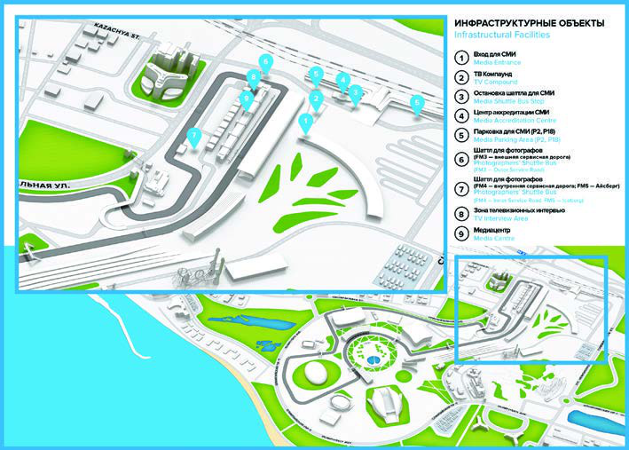

6

FORMULA 1 2018 VTB RUSSIAN GRAND PRIX TIMETABLE THURSDAY 11:00 11:30 PROMOTER PRESS CONFERENCE SECURITY BRIEFING ACTIVITY ROOM 11:00 13:00 PROMOTER PIT LANE PIT LANE WALK FOR FOUR DAY ACTIVITY TICKET HOLDERS ONLY 11:00 17:00 FIA FIA GARAGE INITIAL SCRUTINEEERING

13:00 14:00 FORMULA 1 DRIVERS’ BRIEFING TEAM MANAGERS’ MEETING ROOM 13:00 15:00 FORMULA 1 TRACK TRACK CLOSED FIA / F1 SYSTEMS CHECKS 13:45 14:00 FIA TRACK TRACK INSPECTION, TRACK COMPLETELY CLEAR HIGH SPEED TRACK TEST - FIA 14:00 15:00 FIA TRACK SAFETY & MEDICAL CARS

PRESS CONFERENCE 15:00 16:00 FORMULA 1 PRESS CONFERENCE ROOM PROMOTER PIT LANE WALK FOR FOUR DAY 15:00 17:00 PIT LANE ACTIVITY TICKET HOLDERS ONLY 15:50 17:45 FORMULA 1 OLYMPIC PARK DRIVERS’ AUTOGRAPH SESSION 17:00 17:30 FORMULA 2 DRIVERS’ BRIEFING TEAM MANAGERS’ & DRIVERS’ ROOM MEETING DRIVERS’ BRIEFING TEAM MANAGERS’ & DRIVERS’ 17:30 18:00 GP3 ROOM MEETING F1 EXPERIENCE - TRUCK TOUR 17:30 18:30 FORMULA 1 TRACK/PIT LANE /PIT LANE WALK (F1 EXPERIENCE GUESTS ONLY)

7

FORMULA 1 2018 VTB RUSSIAN GRAND PRIX TIMETABLE FRIDAY 08:50 09:00 FIA TRACK MEDICAL INSPECTION

09:00 09:15 FIA TRACK TRACK INSPECTION & SAFETY CAR TEST 09:30 10:15¹ GP3 TRACK PRACTICE SESSION

10:30 10:40 FIA TRACK TRACK INSPECTION

11:00 12:30¹ FORMULA 1 TRACK FIRST PRACTICE SESSION 13:00 13:45¹ FORMULA 2 TRACK PRACTICE SESSION

13:00 14:00 FORMULA 1 PRESS CONFERENCE PRESS CONFERENCE ROOM 13:50 14:20 PADDOCK CLUB PIT LANE PADDOCK CLUB PIT LANE WALK 13:50 14:20 PADDOCK CLUB TRACK PADDOCK CLUB TRUCK TOUR 14:30 14:40 FIA TRACK TRACK INSPECTION

15:00 16:30¹ FORMULA 1 TRACK SECOND PRACTICE SESSION 16:55 17:25 FORMULA 2 TRACK QUALIFYING SESSION

17:50 18:20 GP3 TRACK QUALIFYING SESSION

18:00 19:00 FORMULA 1 DRIVERS’ BRIEFING DRIVERS’ MEETING ROOM 18:30 19:00 FORMULA 2 PRESS CONFERENCE PRESS CONFERENCE ROOM 18:30 19:00 PADDOCK CLUB TRACK PADDOCK CLUB TRUCK TOUR 21:00 22:00 PROMOTER ACTIVITY TRACK LUKOIL RUN THE TRACK

8

FORMULA 1 2018 VTB RUSSIAN GRAND PRIX TIMETABLE SATURDAY 09:00 09:30 FORMULA 1 PIT LANE TEAM PIT STOP PRACTICE 09:00 09:45 PADDOCK CLUB PIT LANE PADDOCK CLUB PIT LANE WALK 09:10 09:20 FIA TRACK MEDICAL INSPECTION

TRACK INSPECTION & 09:20 09:35 FIA TRACK SAFETY CAR TEST 10:00 10:05 GP3 TRACK PIT LANE OPEN

10:15* 11:00² GP3 TRACK FIRST RACE (20 LAPS OR 40 MINUTES) 11:30 11:40 FIA TRACK TRACK INSPECTION

12:00 13:00¹ FORMULA 1 TRACK THIRD PRACTICE SESSION 13:20 13:50 FORMULA 2 TRACK DRIVERS’ PARADE

13:20 13:50 PADDOCK CLUB TRACK PADDOCK CLUB TRUCK TOUR 13:20 14:15 PADDOCK CLUB PIT LANE PADDOCK CLUB PIT LANE WALK 14:30 14:40 FIA TRACK TRACK INSPECTION

15:00 16:00 FORMULA 1 TRACK QUALIFYING SESSION

PRESS 16:00 17:00 FORMULA 1 CONFERENCE PRESS CONFERENCE ROOM 16:30 16:35 FORMULA 2 PIT LANE PIT LANE OPEN

16:45* 17:50² FORMULA 2 TRACK FIRST RACE (28 LAPS OR 60 MINUTES) 18:00 18:30 PADDOCK CLUB TRACK PADDOCK CLUB TRUCK TOUR 18:05 18:35 FORMULA 2 PRESS PRESS CONFERENCE CONFERENCE ROOM 18:15 19:00 PROMOTER ACTIVITY PIT LANE MARSHAL PIT LANE WALK

9

FORMULA 1 2018 VTB RUSSIAN GRAND PRIX TIMETABLE SUNDAY 09:00 09:15 FIA TRACK MEDICAL INSPECTION 09:15 09:30 FIA TRACK TRACK INSPECTION & TRACK TEST 09:50 09:55 GP3 PIT LANE PIT LANE OPEN

10:05* 10:40² GP3 TRACK SECOND RACE (15 LAPS OR 30 MINUTES) 11:05 11:10 FORMULA 2 PIT LANE PIT LANE OPEN

11:20* 12:10² FORMULA 2 TRACK SECOND RACE (21 LAPS OR 45 MINUTES) 12:20 13:00 PADDOCK CLUB PIT LANE PADDOCK CLUB PIT LANE WALK 12:25 12:55 PADDOCK CLUB TRACK PADDOCK CLUB TRUCK TOUR 12:25 12:55 PRESS CONFERENCE FORMULA 2 PRESS CONFERENCE ROOM 12:30 13:00 FORMULA 1 TRACK DRIVERS’ TRACK PARADE 12:45 13:15 PROMOTER TRACK STARTING GRID ACTIVITY PRESENTATION 13:00 13:10 FIA TRACK MEDICAL INSPECTION 13:10 13:20 FIA TRACK TRACK INSPECTION

13:30 13:40 FORMULA 1 PIT LANE PIT LANE OPEN

13:54 13:56 FORMULA 1 TRACK NATIONAL ANTHEM

13:57 13:59 PROMOTER AIR DISPLAY AEROBATIC FLY PAST ACTIVITY 14:10* 16:10² FORMULA 1 TRACK GRAND PRIX (53 LAPS OR 120 MINUTES) * These times refer to the start of the formation lap ¹ Fixed End Session ² Approximate Finishing time PLEASE NOTE THAT THE TIMES OF THE SESSIONS ARE SUBJECT TO CHANGE

10

MEDIA SERVICES

RESPONSIBLE PERSONS

CIRCUIT

Promoter ANO “ROSGONKI” 26 Triumphalnaya Street, Adler District, Sochi 354340, Krasnodar Region, Russian Federation Email: info@rosgonki.ru Website: www.sochiautodrom.ru Clerk of the Course Kirill Sluchevskiy F1/ASN Steward Vasiliy Skryl

FIA

Race Director, Starter and Safety Delegate Charlie Whiting Medical Delegate Alain Chantegret, Ian Roberts Technical Delegate Jo Bauer FIA F1 Head of Communications & Media Delegate Matteo Bonciani Stewards Garry Connelly, Dennis Dean, Emanuele Pirro

MEDIA CENTRE Media Communications Tatyana Rivnaya - rivnaya@rosgonki.ru

National Press Accreditation Tatyana Rivnaya - rivnaya@rosgonki.ru

FIA F1 Head of Communications & Media Matteo Bonciani - Delegate mbonciani@fia.com

FIA F1 Deputy Media Delegate Pierre Guyonnet-Duperat – pguyonnet@fia.com

11

MEDIA SERVICES

ACCREDITATION AND MEDIA SERVICES

ACCREDITATION

Location The Media Accreditation Centre is located near the Imeretinskiy Kurort railway stop/Olympic Park railway station, within a walking distance from the entrance to the circuit. Opening Hours Wednesday, 26 September 11:00 - 18:00 Thursday, 27 September 08:00 - 18:00 Friday, 28 September 08:00 - 16:00 Saturday, 29 September 08:00 - 12:00 Sunday, 30 September 08:00 - 12:00

MEDIA CENTRE

Location The Media Centre is located on the first floor of the pit building. Opening Hours Wednesday, 26 12:00 - 20:00 September Thursday, 27 09:00 - 22:00 September Friday, 28 September 07:00 - 23:00 Saturday, 29 07:00 - 23:00 September

Sunday, 30 September 07:00 until the last journalist/photographer leaves

12

MEDIA SERVICES

EQUIPMENT

Telecommunications • 1 printer Centre • 8 public telephones • Private telephones available upon request • 8 Internet workstations (free of charge)

Press Room • 168 seats • 40 TV and technical screens • 168 lockers (Please see the Media Centre reception to take a key to a locker. Deposit is required to get the key).

Photographer's Area • 168 seats • 40 TV and technical screens • 168 lockers (Please see the photographers’ reception to take a key to a locker. Deposit is required to get the key). • Technical Support Photography equipment cleaning and repair services will be available. Please contact technical specialist if you need any assistance.

TV and Radio Area • 24 TV and technical screens • 104 seats • 104 lockers (Please see the Media Centre reception to take a key to a locker. Deposit is required to get the key).

TV/Radio • 29 soundproof TV and radio commentary booths • 24 single and 5 double booths

13

MEDIA SERVICES

SHUTTLES

PHOTOGRAPHERS’ SHUTTLES

Route Shuttle buses will be available during all the FORMULA 1 2018 VTB RUSSIAN GRAND PRIX, including the practice and qualifying sessions, as well as all the support races sessions.

Opening Hours Please see the Media Centre reception for the photographers’ shuttle bus timetable.

Photo Positions Please contact the Media Centre reception or the information desk in the photographers’ area for the location of photo positions.

Crossing the Track Crossing the track is not allowed starting 30 minutes before each practice session and 60 minutes before the Grand Prix race.

MEDIA SHUTTLES

|  |  | FM2 and FM8 Media Hotels - Circuit |  | FM3 Outer Service Road (loop route) | FM4 Inner Service Road (loop route) |  | FM5 Paddock - Iceberg Ice Palace (upon request) |
| --- | --- | --- | --- | --- | --- | --- | --- |
|  | Wednesday, 26 September | 10:45 - 20:30 |  | - | - | - | - |
|  | Thursday, 27 September | 07:45 - 22:30 |  | Upon request | - | - |  |
|  | Friday, 28 September | 06:45 - 23:30 |  | 08:45 - 18:45 | 08:45 - 18:45 | 08:45 - 18:45 |  |
|  | Saturday, 29 September | 06:45 - 23:30 |  | 09:00 - 18:45 | 09:00 - 18:45 | 09:00 - 18:45 |  |
| Sunday, 30 September | Sunday, 30 September |  | 06:45 – 00:00 (after that - upon request) | 08:45 - 18:00 | 08:45 - 18:00 | 08:45 - 18:00 |  |

The shuttle buses will leave every 15 minutes.

14

MEDIA SERVICES

PRESS CONFERENCES

FORMULA 1

Thursday, 15:00, Press Conference Room: Drivers’ Press Conference, the participants are chosen by the FIA F1 Head of Communications & Media Delegate. Friday, 13:00, Press Conference Room: Team Representatives’ Press Conference, the participants are chosen by the FIA F1 Head of Communications & Media Delegate. Saturday, after the Qualifying Session: Post-Qualifying Press Conference with the top three drivers of the qualifying session. Saturday, after the Press Conference, TV interviews: TV interviews with the top three drivers of the qualifying session (broadcast at the Media Centre). Sunday, after the podium ceremony: Press Conference with the top three drivers of the race. Sunday, after the Press Conference, TV interviews: TV interviews with the top three drivers of the race (broadcast at the Media Centre).

FORMULA 2

Friday, 18:30, Press Conference Room: Post-Qualifying Press Conference with the top three drivers of the qualifying session. Saturday, 18:05, Press Conference Room: Post-Qualifying Press Conference with the top three drivers of the first race. Sunday, 12:25, Press Conference Room: Post-Qualifying Press Conference with the top three drivers of the second race.

Note: Photographers are kindly requested to use the designated platform located in the Press Conference Room.

15

2018 FIA FORMULA ONE WORLD CHAMPIONSHIP

FORMULA 1

The FIA Formula One World Championship is the most prestigious and popular racing series on the planet. It dates back to 1950 and is currently having its 69th season.

In 2018, there are 10 teams competing in the FIA Formula One World Championship with two cars each. According to the regulations, each team must independently develop its chassis, while the engines can be supplied by a third-party manufacturer.

The monocoque is made of carbon fiber and composite materials and is designed to withstand maximum loads while having minimum weight. Engine: turbocharged 1.6-litre V6. Energy recovery systems are used. Total power of the power unit exceeds 950hp. Minimum weight of a car without fuel is 733kg.

The FIA Formula One World Championship is held every year and consists of separate rounds, having the status of a Grand Prix (the 2018 season comprises 21 rounds, the Russian Grand Prix is Round 16). At the end of every year two winners are determined: one for drivers, and the other for constructors.

The driver who scores the most points in the season becomes the world champion, and the best team becomes the constructors’ world champion. The current world champion is Lewis Hamilton, and the constructors' title last year went to the Mercedes team.

Race Weekend Format

Each of the 21 rounds of the 2018 FIA Formula One World Championship consists of three days. A race weekend starts on Friday with two 1.5-hour practice sessions (at the Grand Prix de Monaco they take place on Thursday). One more 1-hour practice session takes place on Saturday followed by a qualifying session.

Saturday’s qualifying consisting of three elimination segments determines the starting grid for Sunday’s race. At the end of Q1 which lasts for 18 minutes the five slowest drivers are eliminated from qualifying and the rest advance to Q2 (it lasts for 15 minutes), at the end of which the ten fastest drivers get a chance to fight for pole position in the final segment (12 minutes).

A race takes place on Sunday. Its distance is at least 305km (the only exception is the Grand Prix de Monaco) and duration does not exceed two hours. The top ten finishers score points, according to the following scale: 25-18-15-12-10-8-6-4-2-1.

Formula 1 website: www.formula1.com

16

2018 FIA FORMULA ONE WORLD CHAMPIONSHIP

CHANGES IN THE REGULATIONS FOR 2018

After the significant changes of 2017, this year the regulations have changed very little - the regulations have stayed basically the same, however, there still are some changes.

Introduction of Halo: mandatory use of the additional head protection device. The Halo has been developed for open cockpit cars and is mandatory in Formula 1 in 2018. The Halo is an external mechanical structure with three bodywork fixing points located around the driver’s head.

Aerodynamics: additional T-wings in the vertical plane in front of the rear wing are banned. Vertical planes - shark fins - are outlawed, now this element must have a dropping down outline, i.e. its top plane can no longer be horizontal.

Car weight: the minimum weight has increased by 6kg and reached 734kg to make up for the Halo. However, given that the design weight of the protection is 14kg, this change left engineers significantly less space to use ballast to improve the car weight distribution.

Power units: it is allowed to use not more than three internal combustion engines, three MGU-Hs, three turbocharges, two energy stores, two MGU-Ks, and two CPUs in each car during the entire 21 Grand Prix season. The first time a driver uses an additional element over and above the prescribed limits, a ten-place grid penalty will be given. If he then uses other additional elements a five-place penalty (or penalties) is imposed.

Tyres: Pirelli has developed seven slick tyre compounds. The hardness has been reduced by a step - the compounds having the same names that they had in 2017 have become softer. Two new compounds have been added - SuperHard, the hardest one, and HyperSoft, the softest one. In case of bad weather, the teams will receive intermediate and wet tyres - the tyres have been refined and should remove water from the contact patch even more efficiently.

Oil: to limit the use of motor oil as fuel to increase power, each team must provide the FIA with control samples of their oils and their specifications in advance. Before a Grand Prix weekend, each team must inform the FIA about what particular oil out of the samples provided it will be using during this Grand Prix. Information about the oil pressure must be available to the FIA at all times. Oil consumption must not exceed 0.6 litres of oil per 100km.

Penalties: this year the grid penalties are used differently. Any driver who earns a grid penalty of 15 places or more will have to start from the back of the grid. If more than one driver receives such a penalty they will be arranged at the back of the grid in the order in which they received the penalties.

17

2018 FIA FORMULA ONE WORLD CHAMPIONSHIP

CALENDAR 23-25 March FORMULA 1 2018 ROLEX AUSTRALIAN GRAND PRIX Melbourne

6-8 April FORMULA 1 2018 GULF AIR BAHRAIN GRAND PRIX Sakhir

13-15 April FORMULA 1 2018 HEINEKEN CHINESE GRAND PRIX Shanghai

27-29 April FORMULA 1 2018 AZERBAIJAN GRAND PRIX Baku

11-13 May FORMULA 1 GRAN PREMIO DE ESPAÑA EMIRATES 2018 Barcelona

24-27 May FORMULA 1 GRAND PRIX DE MONACO 2018 Monte Carlo

8-10 June FORMULA 1 GRAND PRIX HEINEKEN DU CANADA 2018 Montreal

22-24 June FORMULA 1 PIRELLI GRAND PRIX DE FRANCE 2018 Le Castellet

FORMULA 1 EYETIME GROSSER PREIS VON ÖSTERREICH 29 June - 1 July Spielberg 2018

5-8 July FORMULA 1 2018 ROLEX BRITISH GRAND PRIX Silverstone

| 20-22 July |  |  | FORMULA 1 EMIRATES GROSSER PREIS VON DEUTSCHLAND 2018 | Hockenheim |  |  |
| --- | --- | --- | --- | --- | --- | --- |
| 2 | 7-29 July |  | FORMULA 1 ROLEX MAGYAR NAGYDÍJ 2018 |  | Budapest |  |
| 2 | 4-26 August |  | FORMULA 1 2018 JOHNNIE WALKER BELGIAN GRAND PRIX |  |  | Spa-Francorchamps |
| 3 S | 1 August - 2 eptember | FORMULA 1 GRAN PREMIO HEINEKEN D'ITALIA 2018 |  | Monza |  |  |
| 14-16 September |  |  | FORMULA 1 2018 SINGAPORE AIRLINES SINGAPORE GRAND PRIX | Singapore |  |  |
| 2 | 8-30 September |  | FORMULA 1 2018 VTB RUSSIAN GRAND PRIX |  | Sochi |  |
| 5- | 7 October |  | FORMULA 1 2018 HONDA JAPANESE GRAND PRIX |  | Suzuka |  |
| 1 | 9-21 October |  | FORMULA 1 PIRELLI 2018 UNITED STATES GRAND PRIX |  | Austin |  |
| 2 | 6-28 October |  | FORMULA 1 GRAN PREMIO DE MÉXICO 2018 |  | Mexico City |  |
| 9-11 November |  |  | FORMULA 1 GRANDE PRÊMIO HEINEKEN DO BRASIL 2018 | Sao Paulo |  |  |
| 23-25 November |  |  | FORMULA 1 2018 ETIHAD AIRWAYS ABU DHABI GRAND PRIX | Yas Marina |  |  |

18

2018 FIA FORMULA ONE WORLD CHAMPIONSHIP

2018 RUSSIAN GRAND PRIX ENTRY LIST

| 44 | Lewis Hamilton | Great Britain | Mercedes AMG Petronas Motorsport | Mercedes AMG Petronas Motorsport |
| --- | --- | --- | --- | --- |
| 77 | Valtteri Bottas | Finland |  | Mercedes AMG Petronas Motorsport |
| 5 | Sebastian Vettel | Germany |  | Scuderia Ferrari |
| 7 | Kimi Raikkonen | Finland |  | Scuderia Ferrari |
| 3 | Daniel Ricciardo | Australia |  | Aston Martin Red Bull Racing |
| 33 | Max Verstappen | Netherlands |  | Aston Martin Red Bull Racing |

11 Sergio Perez* Mexico Racing Point Force India F1 Team

31 Esteban Ocon France Racing Point Force India F1 Team

| 18 | Lance Stroll | Canada | Williams Martini Racing |
| --- | --- | --- | --- |
| 35 | Sergey Sirotkin | Russia | Williams Martini Racing |
| 27 | Nico Hulkenberg | Germany | Renault Sport Formula One Team |
| 55 | Carlos Sainz** | Spain | Renault Sport Formula One Team |
| 10 | Pierre Gasly | France | Red Bull Toro Rosso Honda |
| 28 | Brendon Hartley | New Zealand | Red Bull Toro Rosso Honda |

8 Romain Grosjean France Haas F1 Team

20 Kevin Magnussen Denmark Haas F1 Team

| 14 | Fernando Alonso | Spain | McLaren F1 Team |
| --- | --- | --- | --- |
| 2 | Stoffell Vandoorne | Belgium | McLaren F1 Team |

9 Marcus Ericsson Sweden Alfa Romeo Sauber F1 Team

16 Charles Leclerc Monaco Alfa Romeo Sauber F1 Team * - Nicholas Latifi (Canada) will replace Perez for the first practice session. ** - Artem Markelov (Russia) will replace Sainz for the first practice session.

19

FORMULA1 2018 ROLEX AUSTRALIAN GRAND PRIX

MELBOURNE

Date 23 – 25 March Race Distance 307.574km Circuit Length 5.303km Number of Laps 58

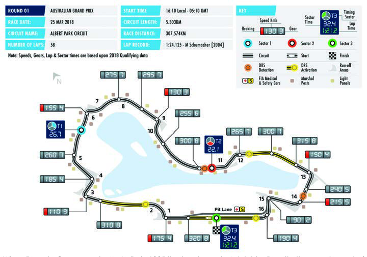

When Formula One came to Australia in 1985 it set up home in Adelaide. Despite the popular end of season slot for the Adelaide race, pressure was growing from the Melbourne motor sport community, who wanted to have F1 race in the city. In 1992, the authorities of the State of Victoria managed to reach an agreement with Formula One, but the contract with Adelaide did not expire until 1995, so Melbourne had plenty of time to prepare. A track was developed in Melbourne's beautiful Albert Park, part of it using closed-off public roads. In 1996 the city held the first round of the world championship. Since then the race has become very popular with drivers and fans alike, and the party atmosphere of Melbourne keeps them coming back year after year.

20

FORMULA 1 2018 ROLEX AUSTRALIAN GRAND PRIX

RESULTS

Starting Position Driver Team Time Position

1 Sebastian Vettel Scuderia Ferrari 1:29:33.283 3

| 2 | Lewis Hamilton | Mercedes AMG Petronas Motorsport | +5.036 | 1 |
| --- | --- | --- | --- | --- |
| 3 | Kimi Raikkonen | Scuderia Ferrari | +6.309 | 2 |
| 4 | Daniel Ricciardo | Aston Martin Red Bull Racing | +7.069 | 8 |
| 5 | Fernando Alonso | McLaren F1 Team | +27.886 | 10 |
| 6 | Max Verstappen | Aston Martin Red Bull Racing | +28.945 | 4 |
| 7 | Nico Hulkenberg | Renault Sport Formula One Team | +32.671 | 7 |
| 8 | Valtteri Bottas | Mercedes AMG Petronas Motorsport | +34.339 | 15 |
| 9 | Stoffel Vandoorne | McLaren F1 Team | +34.921 | 11 |
| 10 | Carlos Sainz | Renault Sport Formula One Team | +45.722 | 9 |

11 Sergio Perez Sahara Force India F1 Team +46.817 12

| 12 | Esteban Ocon | Sahara Force India F1 Team | +60.278 | 14 |
| --- | --- | --- | --- | --- |
| 13 | Charles Leclerc | Alfa Romeo Sauber F1 Team | +75.759 | 18 |
| 14 | Lance Stroll | Williams Martini Racing | +78.288 | 13 |

15 Brendon Hartley Red Bull Toro Rosso Honda +1 lap 16 NC Romain Grosjean Haas F1 Team DNF 6 NC Kevin Magnussen Haas F1 Team DNF 5

| NC | Pierre Gasly | Red Bull Toro Rosso Honda | DNF | 20 |
| --- | --- | --- | --- | --- |
| NC | Marcus Ericsson | Alfa Romeo Sauber F1 Team | DNF | 17 |
| NC | Sergey Sirotkin | Williams Martini Racing | DNF | 19 |

Pole Position Lewis Hamilton 1:21.164 Fastest Lap Daniel Ricciardo 1:25.945 (Lap 54)

Race Leader Lewis Hamilton Lap 1-18 Sebastian Vettel Lap 19-58

21

FORMULA 1 2018 GULF AIR BAHRAIN GRAND PRIX

SAKHIR

Date 06 – 08 April Race Distance 308.238km Circuit Length 5.412km Number of Laps 57

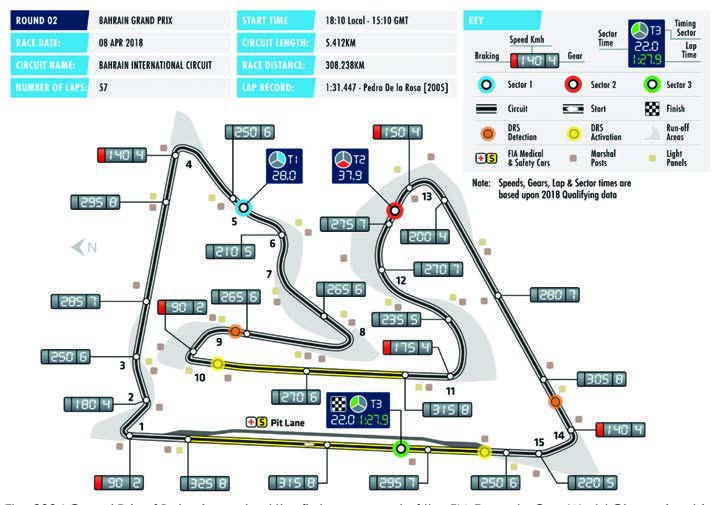

The 2004 Grand Prix of Bahrain marked the first ever round of the FIA Formula One World Championship to be held in the Middle East and the official culmination of a multi-million dollar project started back in September 2002 when the Kingdom of Bahrain signed a long-term deal to host the event. Located 30 km south-west of the island's capital, Manama, the Hermann Tilke designed circuit contains no less than five track layouts. Construction began in November 2002 and in the months prior to its March 2004 completion, work was going on around the clock. The grandstands provide spectators with the views of the cars heading into the external desert area, before coming back into the oasis-styled infield. A unique feature of the circuit is that its width varies at the end of the different straights. This allows for diverse racing lines, and the 15-corner design provides at least three genuine overtaking opportunities.

22

FORMULA 1 2018 GULF AIR BAHRAIN GRAND PRIX

RESULTS

Starting Position Driver Team Time Position

1 Sebastian Vettel Scuderia Ferrari 1:32:01.940 1

| 2 | Valtteri Bottas | Mercedes AMG Petronas Motorsport | +0.699 | 3 |
| --- | --- | --- | --- | --- |
| 3 | Lewis Hamilton | Mercedes AMG Petronas Motorsport | +6.512 | 9 |
| 4 | Pierre Gasly | Red Bull Toro Rosso Honda | +62.234 | 5 |

5 Kevin Magnussen Haas F1 Team +75.046 6

| 6 | Nico Hulkenberg | Renault Sport Formula One Team | +99.024 | 7 |
| --- | --- | --- | --- | --- |
| 7 | Fernando Alonso | McLaren F1 Team | +1 lap | 13 |
| 8 | Stoffel Vandoorne | McLaren F1 Team | +1 lap | 14 |
| 9 | Marcus Ericsson | Alfa Romeo Sauber F1 Team | +1 lap | 17 |
| 10 | Esteban Ocon | Sahara Force India F1 Team | +1 lap | 8 |
| 11 | Carlos Sainz | Renault Sport Formula One Team | +1 lap | 10 |
| 12 | Charles Leclerc | Alfa Romeo Sauber F1 Team | +1 lap | 19 |
| 13 | Romain Grosjean | Haas F1 Team | +1 lap | 16 |
| 14 | Lance Stroll | Williams Martini Racing | +1 lap | 20 |
| 15 | Sergey Sirotkin | Williams Martini Racing | +1 lap | 18 |
| 16 | Sergio Perez | Sahara Force India F1 Team | +1 lap | 12 |
| 17 | Brendon Hartley | Red Bull Toro Rosso Honda | +1 lap | 11 |
| NC | Kimi Raikkonen | Scuderia Ferrari | DNF | 2 |
| NC | Max Verstappen | Aston Martin Red Bull Racing | DNF | 15 |
| NC | Daniel Ricciardo | Aston Martin Red Bull Racing | DNF | 4 |

Pole Position Sebastian Vettel 1:27.958 Fastest Lap Valtteri Bottas 1:33.740 (Lap 22)

Race Leader Sebastian Vettel Lap 1-17 Valtteri Bottas Lap 18-20 Lewis Hamilton Lap 21-25 Sebastian Vettel Lap 26-57

23

FORMULA 1 2018 HEINEKEN CHINESE GRAND PRIX

SHANGHAI

Date 13 – 15 April Race Distance 305.066km Circuit Length 5.451km Number of Laps 56

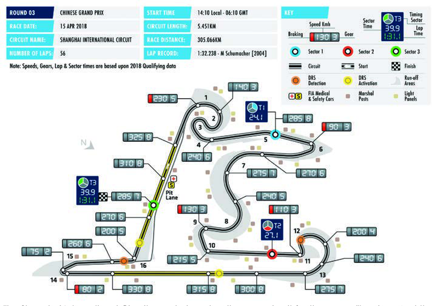

The Shanghai International Circuit was designed as the race circuit for the new millennium. And the modern track, with its stunning architecture, has achieved its goal of becoming China's gateway to the world of Formula One racing since it debuted on the calendar in 2004. The circuit, designed by architects Hermann Tilke and Peter Wahl, is shaped like the Chinese character 'shang', which stands for 'high' or 'above'. Other symbols represented in the architecture originate from Chinese history, such as the team buildings arranged like pavilions in a lake to resemble the ancient Yuyan-Garden in Shanghai. Not only is the course remarkable for its change of acceleration and deceleration within different winding turns, making high demands on the driver as well as the car, but also for its high-speed straights. These offer crucial overtaking opportunities and give an intense and exciting motorsport experience to the spectators.

24

FORMULA 1 2018 HEINEKEN CHINESE GRAND PRIX

RESULTS

| Position |  | Driver |  | Team |  |  | Time |  | Starting Position |
| --- | --- | --- | --- | --- | --- | --- | --- | --- | --- |
|  | 1 |  | Daniel Ricciardo |  | Aston Martin Red Bull Racing |  |  | 1:35:36.380 | 6 |
|  | 2 |  | Valtteri Bottas |  | Mercedes AMG Petronas Motorsport |  |  | +8.894 | 3 |
|  | 3 |  | Kimi Raikkonen |  | Scuderia Ferrari |  |  | +9.637 | 2 |
|  | 4 |  | Lewis Hamilton |  | Mercedes AMG Petronas Motorsport |  |  | +16.985 | 4 |
|  | 5 |  | Max Verstappen |  | Aston Martin Red Bull Racing |  |  | +20.436 | 5 |
|  | 6 |  | Nico Hulkenberg |  | Renault Sport Formula One Team |  |  | +21.052 | 7 |
|  | 7 |  | Fernando Alonso |  | McLaren F1 Team |  |  | +30.639 | 13 |
|  | 8 |  | Sebastian Vettel |  | Scuderia Ferrari |  |  | +35.286 | 1 |
|  | 9 |  | Carlos Sainz |  | Renault Sport Formula One Team |  |  | +35.763 | 9 |
|  | 10 |  | Kevin Magnussen |  | Haas F1 Team |  |  | +39.594 | 11 |
|  | 11 |  | Esteban Ocon |  | Sahara Force India F1 Team |  |  | +44.050 | 12 |
|  | 12 |  | Sergio Perez |  | Sahara Force India F1 Team |  |  | +44.725 | 8 |
|  | 13 |  | Stoffel Vandoorne |  | McLaren F1 Team |  |  | +49.373 | 14 |
|  | 14 |  | Lance Stroll |  | Williams Martini Racing |  |  | +55.490 | 18 |
|  | 15 |  | Sergey Sirotkin |  | Williams Martini Racing |  |  | +58.241 | 16 |
|  | 16 |  | Marcus Ericsson |  | Alfa Romeo Sauber F1 Team |  |  | +62.604 | 20 |
|  | 17 |  | Romain Grosjean |  | Haas F1 Team |  |  | +65.296 | 10 |
|  | 18 |  | Pierre Gasly |  | Red Bull Toro Rosso Honda |  |  | +66.330 | 17 |
|  | 19 |  | Charles Leclerc |  | Alfa Romeo Sauber F1 Team |  |  | +82.575 | 19 |
|  | 20 |  | Brendon Hartley |  | Red Bull Toro Rosso Honda | +5 laps (DNF) |  |  | 15 |

Pole Position Sebastian Vettel 1:31.095 Fastest Lap Daniel Ricciardo 1:35.785 (Lap 55)

Race Leader Sebastian Vettel Lap 1-20 Kimi Raikkonen Lap 21-26 Valtteri Bottas Lap 27-44 Daniel Ricciardo Lap 45-56

25

FORMULA 1 2018 AZERBAIJAN GRAND PRIX

BAKU

Date 27 – 29 April Race Distance 306.049km Circuit Length 6.003km Number of Laps 51

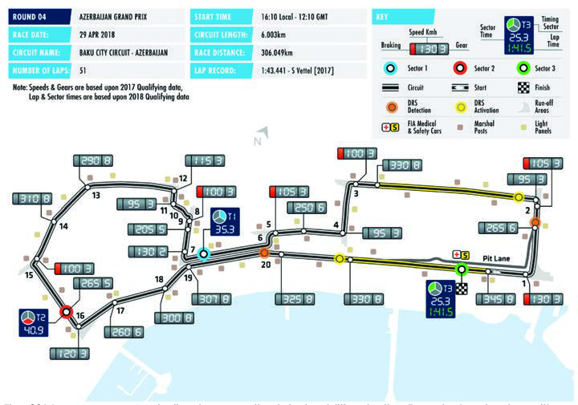

The 2016 season saw Azerbaijan become the latest addition to the Formula 1 calendar, with capital city Baku playing host to the fastest street circuit in F1 racing, on a layout designed by renowned track architect Hermann Tilke. Tilke's design married technical sectors with extreme straights to create a stunning circuit that also thrives on Baku's very attractive urban atmosphere and its great combination of history and 21st century style. The historic city centre, the beautiful seaside promenade and the impressive government house all combine to provide the perfect backdrop for the spectacular track. The extremely narrow uphill section at the old town wall rewards pinpoint accuracy and courage, while the 2.2 kilometres along the promenade sees the cars running flat out at very high top speeds.

26

FORMULA 1 2018 AZERBAIJAN GRAND PRIX

RESULTS

| Position |  | Driver |  | Team |  | Time |  | Starting Position |
| --- | --- | --- | --- | --- | --- | --- | --- | --- |
|  | 1 |  | Lewis Hamilton |  | Mercedes AMG Petronas Motorsport |  | 1:43:44.291 | 2 |
|  | 2 |  | Kimi Raikkonen |  | Scuderia Ferrari |  | +2.460 | 6 |
|  | 3 |  | Sergio Perez |  | Sahara Force India F1 Team |  | +4.024 | 8 |
|  | 4 |  | Sebastian Vettel |  | Scuderia Ferrari |  | +5.329 | 1 |
|  | 5 |  | Carlos Sainz |  | Renault Sport Formula One Team |  | +7.515 | 9 |
|  | 6 |  | Charles Leclerc |  | Alfa Romeo Sauber F1 Team |  | +9.158 | 13 |
|  | 7 |  | Fernando Alonso |  | McLaren F1 Team |  | +10.931 | 12 |
|  | 8 |  | Lance Stroll |  | Williams Martini Racing |  | +12.546 | 10 |
|  | 9 |  | Stoffel Vandoorne |  | McLaren F1 Team |  | +14.152 | 16 |
|  | 10 |  | Brendon Hartley |  | Red Bull Toro Rosso Honda |  | +18.030 | 19 |
|  | 11 |  | Marcus Ericsson |  | Alfa Romeo Sauber F1 Team |  | +18.512 | 18 |
|  | 12 |  | Pierre Gasly |  | Red Bull Toro Rosso Honda |  | +24.720 | 17 |
|  | 13 |  | Kevin Magnussen |  | Haas F1 Team |  | +40.663 | 15 |
|  | 14 |  | Valtteri Bottas |  | Mercedes AMG Petronas Motorsport | +3 laps (DNF) |  | 3 |
|  | NC |  | Romain Grosjean |  | Haas F1 Team |  | DNF | 20 |
|  | NC |  | Max Verstappen |  | Aston Martin Red Bull Racing |  | DNF | 5 |
|  | NC |  | Daniel Ricciardo |  | Aston Martin Red Bull Racing |  | DNF | 4 |
|  | NC |  | Nico Hulkenberg |  | Renault Sport Formula One Team |  | DNF | 14 |
|  | NC |  | Esteban Ocon |  | Sahara Force India F1 Team |  | DNF | 7 |
|  | NC |  | Sergey Sirotkin |  | Williams Martini Racing |  | DNF | 11 |

Pole Position Sebastian Vettel 1:41.498 Fastest Lap Valtteri Bottas 1:45.149 (Lap 37)

Race Leader Sebastian Vettel Lap 1-30 Valtteri Bottas Lap 31-48 Lewis Hamilton Lap 49-51

27

FORMULA 1 GRAN PREMIO DE ESPAÑA EMIRATES 2018

BARCELONA

Date 11 – 13 May Race Distance 307.104km Circuit Length 4.655km Number of Laps 66

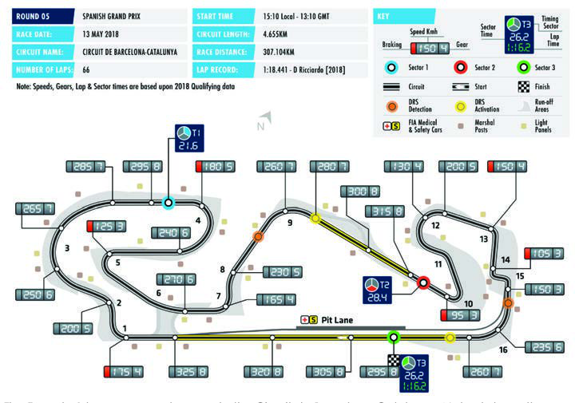

The Formula 1 teams are no strangers to the Circuit de Barcelona-Catalunya. Not only have they raced there every year since 1991, they also conduct extensive testing at the venue. Familiarity does not, however, lessen the challenge for car or driver. The mix of high- and low-speed corners, plus its abrasive and rather bumpy track surface, makes for a physically and mechanically taxing race. Tyre wear is particularly high and the varying winds that cut across the circuit mean an optimum set-up can be hard to find. For spectators Turn 1 (also known as Elf corner) is among the best places to watch, as it is one of the track's few overtaking opportunities. For the drivers it is the final two turns, known collectively as New Holland, which provide one of the biggest challenges of the season. A fast exit is essential in order to maximise speed down the start-finish straight into Elf.

28

FORMULA 1 GRAN PREMIO DE ESPAÑA EMIRATES 2018

RESULTS

| Position |  | Driver |  | Team |  | Time |  | Starting Position |
| --- | --- | --- | --- | --- | --- | --- | --- | --- |
|  | 1 |  | Lewis Hamilton |  | Mercedes AMG Petronas Motorsport |  | 1:35:29.972 | 1 |
|  | 2 |  | Valtteri Bottas |  | Mercedes AMG Petronas Motorsport |  | +20.593 | 2 |
|  | 3 |  | Max Verstappen |  | Aston Martin Red Bull Racing |  | +26.873 | 5 |
|  | 4 |  | Sebastian Vettel |  | Scuderia Ferrari |  | +27.584 | 3 |
|  | 5 |  | Daniel Ricciardo |  | Aston Martin Red Bull Racing |  | +50.058 | 6 |
|  | 6 |  | Kevin Magnussen |  | Haas F1 Team |  | +1 lap | 7 |
|  | 7 |  | Carlos Sainz |  | Renault Sport Formula One Team |  | +1 lap | 9 |
|  | 8 |  | Fernando Alonso |  | McLaren F1 Team |  | +1 lap | 8 |
|  | 9 |  | Sergio Perez |  | Sahara Force India F1 Team |  | +2 laps | 15 |
|  | 10 |  | Charles Leclerc |  | Alfa Romeo Sauber F1 Team |  | +2 laps | 14 |
|  | 11 |  | Lance Stroll |  | Williams Martini Racing |  | +2 laps | 18 |
|  | 12 |  | Brendon Hartley |  | Red Bull Toro Rosso Honda |  | +2 laps | 20 |
|  | 13 |  | Marcus Ericsson |  | Alfa Romeo Sauber F1 Team |  | +2 laps | 17 |
|  | 14 |  | Sergey Sirotkin |  | Williams Martini Racing |  | +3 laps | 19 |
|  | NC |  | Stoffel Vandoorne |  | McLaren F1 Team |  | DNF | 11 |
|  | NC |  | Esteban Ocon |  | Sahara Force India F1 Team |  | DNF | 13 |
|  | NC |  | Kimi Raikkonen |  | Scuderia Ferrari |  | DNF | 4 |
|  | NC |  | Romain Grosjean |  | Haas F1 Team |  | DNF | 10 |
|  | NC |  | Pierre Gasly |  | Red Bull Toro Rosso Honda |  | DNF | 12 |
|  | NC |  | Nico Hulkenberg |  | Renault Sport Formula One Team |  | DNF | 16 |

Pole Position Lewis Hamilton 1:16.173 Fastest Lap Daniel Ricciardo 1:18.441 (Lap 61)

Race Leader Lewis Hamilton Lap 1-25 Max Verstappen Lap 26-33 Lewis Hamilton Lap 34-66

29

FORMULA 1 GRAND PRIX DE MONACO 2018

MONTE CARLO

Date 24 – 27 May Race Distance 260.286km Circuit Length 3.337km Number of Laps 78

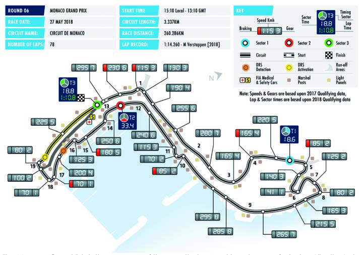

The Monaco Grand Prix is the one race of the year that every driver dreams of winning. Like the Indy 500 or Le Mans, it stands alone. A combination of precision driving, technical excellence and sheer bravery is required to win in Monte Carlo, facets which highlight the differences between the great and the good in Formula 1. The barrier-lined circuit leaves no margin for error, demanding more concentration that any other Formula One track. Cars run with maximum downforce and brakes are worked hard. Overtaking is next to impossible so qualifying in Monaco is more critical than at any other Grand Prix. The Portier corner is key to achieving a good lap time. It is preceded by the Loews hairpin, the slowest corner in Formula 1, and followed by the tunnel, one of the few flat-out sections of the track. The race has been a regular fixture of the world championship since 1955, but in that time the circuit has changed remarkably little.

30

FORMULA 1 GRAND PRIX DE MONACO 2018

RESULTS

| Position |  | Driver |  | Team |  |  | Time |  | Starting Position |
| --- | --- | --- | --- | --- | --- | --- | --- | --- | --- |
|  | 1 |  | Daniel Ricciardo |  | Aston Martin Red Bull Racing |  |  | 1:42:54.807 | 1 |
|  | 2 |  | Sebastian Vettel |  | Scuderia Ferrari |  |  | +7.336 | 2 |
|  | 3 |  | Lewis Hamilton |  | Mercedes AMG Petronas Motorsport |  |  | +17.013 | 3 |
|  | 4 |  | Kimi Raikkonen |  | Scuderia Ferrari |  |  | +18.127 | 4 |
|  | 5 |  | Valtteri Bottas |  | Mercedes AMG Petronas Motorsport |  |  | +18.822 | 5 |
|  | 6 |  | Esteban Ocon |  | Sahara Force India F1 Team |  |  | +23.667 | 6 |
|  | 7 |  | Pierre Gasly |  | Red Bull Toro Rosso Honda |  |  | +24.331 | 10 |
|  | 8 |  | Nico Hulkenberg |  | Renault Sport Formula One Team |  |  | +24.839 | 11 |
|  | 9 |  | Max Verstappen |  | Aston Martin Red Bull Racing |  |  | +25.317 | 20 |
|  | 10 |  | Carlos Sainz |  | Renault Sport Formula One Team |  |  | +69.013 | 8 |
|  | 11 |  | Marcus Ericsson |  | Alfa Romeo Sauber F1 Team |  |  | +69.864 | 16 |
|  | 12 |  | Sergio Perez |  | Sahara Force India F1 Team |  |  | +70.461 | 9 |
|  | 13 |  | Kevin Magnussen |  | Haas F1 Team |  |  | +74.823 | 19 |
|  | 14 |  | Stoffel Vandoorne |  | McLaren F1 Team |  |  | +1 lap | 12 |
|  | 15 |  | Romain Grosjean |  | Haas F1 Team |  |  | +1 lap | 18 |
|  | 16 |  | Sergey Sirotkin |  | Williams Martini Racing |  |  | +1 lap | 13 |
|  | 17 |  | Lance Stroll |  | Williams Martini Racing |  |  | +2 laps | 17 |
|  | 18 |  | Charles Leclerc |  | Alfa Romeo Sauber F1 Team | +8 laps (DNF) |  |  | 14 |
|  | 19 |  | Brendon Hartley |  | Red Bull Toro Rosso Honda | +8 laps (DNF) |  |  | 15 |
|  | NC |  | Fernando Alonso |  | McLaren F1 Team |  |  | DNF | 7 |

Pole Position Daniel Ricciardo 1:10.810 Fastest Lap Max Verstappen 1:14.260 (Lap 60)

Race Leader Daniel Ricciardo Lap 1-78

31

FORMULA 1 GRAND PRIX HEINEKEN DU CANADA 2018

MONTREAL

Date 08 – 10 June Race Distance 305.270km Circuit Length 4.361km Number of Laps 70

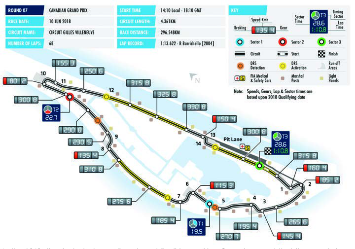

In the 1960s the rivalry between French and English speaking Canada meant that the country's Grand Prix had two homes: Mosport Park one year and Mont-Tremblant the next. By 1970, however, Mont-Tremblant was deemed too dangerous and the race moved full time to Mosport Park. In 1977 the French Canadians decided it was about time they built a race track, but time and money were against them. Their solution was simple and effective. Taking the Ile Notre-Dame, they connected all the island's roads and made a circuit. The island had been the home of the 1967 World Fair (Expo'67) and was full of futuristic looking buildings. It was, everyone agreed, a perfect venue for a Grand Prix. After $2m was spent on upgrading the circuit to Formula One standards, the first race was held there in October 1978. Since then the circuit is believed to be the most exciting one in the Formula 1 calendar due to a big number of accelerations and overtaking opportunities.

32

FORMULA 1 GRAND PRIX HEINEKEN DU CANADA 2018

RESULTS

| Position |  | Driver |  | Team |  | Time |  | Starting Position |
| --- | --- | --- | --- | --- | --- | --- | --- | --- |
|  | 1 |  | Sebastian Vettel |  | Scuderia Ferrari |  | 1:28:31.377 | 1 |
|  | 2 |  | Valtteri Bottas |  | Mercedes AMG Petronas Motorsport |  | +7.376 | 2 |
|  | 3 |  | Max Verstappen |  | Aston Martin Red Bull Racing |  | +8.360 | 3 |
|  | 4 |  | Daniel Ricciardo |  | Aston Martin Red Bull Racing |  | +20.892 | 6 |
|  | 5 |  | Lewis Hamilton |  | Mercedes AMG Petronas Motorsport |  | +21.559 | 4 |
|  | 6 |  | Kimi Raikkonen |  | Scuderia Ferrari |  | +27.184 | 5 |
|  | 7 |  | Nico Hulkenberg |  | Renault Sport Formula One Team |  | +1 lap | 7 |
|  | 8 |  | Carlos Sainz |  | Renault Sport Formula One Team |  | +1 lap | 9 |
|  | 9 |  | Esteban Ocon |  | Sahara Force India F1 Team |  | +1 lap | 8 |
|  | 10 |  | Charles Leclerc |  | Alfa Romeo Sauber F1 Team |  | +1 lap | 13 |
|  | 11 |  | Pierre Gasly |  | Red Bull Toro Rosso Honda |  | +1 lap | 19 |
|  | 12 |  | Romain Grosjean |  | Haas F1 Team |  | +1 lap | 20 |
|  | 13 |  | Kevin Magnussen |  | Haas F1 Team |  | +1 lap | 11 |
|  | 14 |  | Sergio Perez |  | Sahara Force India F1 Team |  | +1 lap | 10 |
|  | 15 |  | Marcus Ericsson |  | Alfa Romeo Sauber F1 Team |  | +2 laps | 18 |
|  | 16 |  | Stoffel Vandoorne |  | McLaren F1 Team |  | +2 laps | 15 |
|  | 17 |  | Sergey Sirotkin |  | Williams Martini Racing |  | +2 laps | 17 |
|  | NC |  | Fernando Alonso |  | McLaren F1 Team |  | DNF | 14 |
|  | NC |  | Brendon Hartley |  | Red Bull Toro Rosso Honda |  | DNF | 12 |
|  | NC |  | Lance Stroll |  | Williams Martini Racing |  | DNF | 16 |

Pole Position Sebastian Vettel 1:10.764 Fastest Lap Max Verstappen 1:13.864 (Lap 65)

Race Leader Sebastian Vettel Lap 1-68

33

FORMULA 1 PIRELLI GRAND PRIX DE FRANCE 2018

LE CASTELLET

Date 22 – 24 June Race Distance 309.690km Circuit Length 5.842km Number of Laps 53

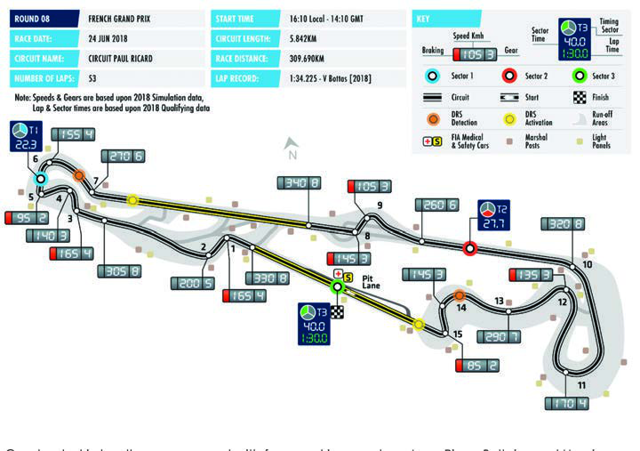

Constructed in less than a year, and with famous drivers such as Jean-Pierre Beltoise and Henri Pescarolo consulted on its layout, the Circuit Paul Ricard – named after its sponsor – opened in April 1970. Next year it staged its maiden F1 race. The last Grand Prix at the venue took place in 1990, by which time it was deemed outdated for F1 purposes. The start of the 21st century saw a rebirth under new ownership, with the transformation of the circuit into the Paul Ricard High Tech Test Track. Used exclusively for testing, its multi-configuration layout proved popular with F1 teams and set new standards in safety, pioneering the use of painted run-off areas instead of traditional gravel traps. It opened its doors to the public again in 2009 after the construction of a new grandstand and since then has hosted several major championships. In 2016 a deal was struck to return the French Grand Prix to the track by the year of 2018.

34

FORMULA 1 PIRELLI GRAND PRIX DE FRANCE 2018

RESULTS

| Position |  | Driver |  | Team |  |  | Time |  | Starting Position |
| --- | --- | --- | --- | --- | --- | --- | --- | --- | --- |
|  | 1 |  | Lewis Hamilton |  | Mercedes AMG Petronas Motorsport |  |  | 1:30:11.385 | 1 |
|  | 2 |  | Max Verstappen |  | Aston Martin Red Bull Racing |  |  | +7.090 | 4 |
|  | 3 |  | Kimi Raikkonen |  | Scuderia Ferrari |  |  | +25.888 | 6 |
|  | 4 |  | Daniel Ricciardo |  | Aston Martin Red Bull Racing |  |  | +34.736 | 5 |
|  | 5 |  | Sebastian Vettel |  | Scuderia Ferrari |  |  | +61.935 | 3 |
|  | 6 |  | Kevin Magnussen |  | Haas F1 Team |  |  | +79.364 | 9 |
|  | 7 |  | Valtteri Bottas |  | Mercedes AMG Petronas Motorsport |  |  | +80.632 | 2 |
|  | 8 |  | Carlos Sainz |  | Renault Sport Formula One Team |  |  | +87.184 | 7 |
|  | 9 |  | Nico Hulkenberg |  | Renault Sport Formula One Team |  |  | +91.989 | 12 |
|  | 10 |  | Charles Leclerc |  | Alfa Romeo Sauber F1 Team |  |  | +93.873 | 8 |
|  | 11 |  | Romain Grosjean |  | Haas F1 Team |  |  | +1 lap | 10 |
|  | 12 |  | Stoffel Vandoorne |  | McLaren F1 Team |  |  | +1 lap | 17 |
|  | 13 |  | Marcus Ericsson |  | Alfa Romeo Sauber F1 Team |  |  | +1 lap | 15 |
|  | 14 |  | Brendon Hartley |  | Red Bull Toro Rosso Honda |  |  | +1 lap | 20 |
|  | 15 |  | Sergey Sirotkin |  | Williams Martini Racing |  |  | +1 lap | 18 |
|  | 16 |  | Fernando Alonso |  | McLaren F1 Team |  | +3 laps (DNF) |  | 16 |
|  | 17 |  | Lance Stroll |  | Williams Martini Racing | +5 laps (DNF) |  |  | 19 |
|  | NC |  | Sergio Perez |  | Sahara Force India F1 Team |  |  | DNF | 13 |
|  | NC |  | Esteban Ocon |  | Sahara Force India F1 Team |  |  | DNF | 11 |
|  | NC |  | Pierre Gasly |  | Red Bull Toro Rosso Honda |  |  | DNF | 14 |

Pole Position Lewis Hamilton 1:30.029 Fastest Lap Valtteri Bottas 1:34.225 (Lap 41)

Race Leader Lewis Hamilton Lap 1-32 Kimi Raikkonen 33 Lewis Hamilton Lap 34-53

35

FORMULA 1 EYETIME GROSSER PREIS VON ÖSTERREICH 2018

SPIELBERG

Date 29 June - 01 July Race Distance 306.452km Circuit Length 4.318km Number of Laps 71

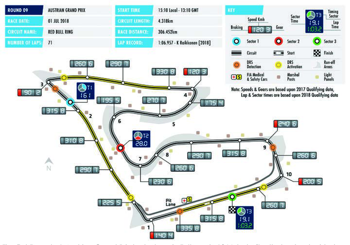

The first Formula 1 Austrian Grand Prix took place in Zeltweg in 1964, but after that series decided not to return to the circuit. Some years later the Osterreichring circuit was built and proved to be one of the fastest tracks in the world. The first Formula One race was held there in 1970. Impressive turns, amazing aesthetics and conditions requiring the drivers’ skills made the Osterreichring popular in F1. After numerous start-line accidents, arguments with local farmers over car parking and a general feeling that the circuit was unsafe, the Austrian Grand Prix at the Osterreichring was finally pulled from the calendar in 1987. The track gradually fell into disrepair until Austrian telecoms company A1 provided the funds to redevelop the circuit. Renamed the A1-Ring, it brought Formula One racing back to Austria in 1997. It would continue to host Grands Prix for the next several years, but it was pulled from the calendar after the season of 2003. Over subsequent years, numerous improvement plans for the circuit stalled until it was eventually redeveloped and re- branded as the Red Bull Ring and reopened in 2011.

36

FORMULA 1 EYETIME GROSSER PREIS VON ÖSTERREICH 2018

RESULTS

| Position |  | Driver |  | Team |  |  | Time |  | Starting Position |
| --- | --- | --- | --- | --- | --- | --- | --- | --- | --- |
|  | 1 |  | Max Verstappen |  | Aston Martin Red Bull Racing |  |  | 1:21:56.024 | 4 |
|  | 2 |  | Kimi Raikkonen |  | Scuderia Ferrari |  |  | +1.504 | 3 |
|  | 3 |  | Sebastian Vettel |  | Scuderia Ferrari |  |  | +3.181 | 6 |
|  | 4 |  | Romain Grosjean |  | Haas F1 Team |  |  | +1 lap | 5 |
|  | 5 |  | Kevin Magnussen |  | Haas F1 Team |  |  | +1 lap | 8 |
|  | 6 |  | Esteban Ocon |  | Sahara Force India F1 Team |  |  | +1 lap | 11 |
|  | 7 |  | Sergio Perez |  | Sahara Force India F1 Team |  |  | +1 lap | 15 |
|  | 8 |  | Fernando Alonso |  | McLaren F1 Team |  |  | +1 lap | PL |
|  | 9 |  | Charles Leclerc |  | Alfa Romeo Sauber F1 Team |  |  | +1 lap | 17 |
|  | 10 |  | Marcus Ericsson |  | Alfa Romeo Sauber F1 Team |  |  | +1 lap | 18 |
|  | 11 |  | Pierre Gasly |  | Red Bull Toro Rosso Honda |  |  | +1 lap | 12 |
|  | 12 |  | Carlos Sainz |  | Renault Sport Formula One Team |  |  | +1 lap | 9 |
|  | 13 |  | Sergey Sirotkin |  | Williams Martini Racing |  |  | +2 laps | 16 |
|  | 14 |  | Lance Stroll |  | Williams Martini Racing |  |  | +2 laps | 13 |
|  | 15 |  | Stoffel Vandoorne |  | McLaren F1 Team | +6 laps (DNF) |  |  | 14 |
|  | NC |  | Lewis Hamilton |  | Mercedes AMG Petronas Motorsport |  |  | DNF | 2 |
|  | NC |  | Brendon Hartley |  | Red Bull Toro Rosso Honda |  |  | DNF | 19 |
|  | NC |  | Daniel Ricciardo |  | Aston Martin Red Bull Racing |  |  | DNF | 7 |
|  | NC |  | Valtteri Bottas |  | Mercedes AMG Petronas Motorsport |  |  | DNF | 1 |
|  | NC |  | Nico Hulkenberg |  | Renault Sport Formula One Team |  |  | DNF | 10 |

Pole Position Valtteri Bottas 1:03.130 Fastest Lap Kimi Raikkonen 1:06.957 (Lap 71)

Race Leader Lewis Hamilton Lap 1-25 Max Verstappen Lap 26-71

37

FORMULA 1 2018 ROLEX BRITISH GRAND PRIX

SILVERSTONE

Date 06 – 08 July Race Distance 306.198km Circuit Length 5.891km Number of Laps 52

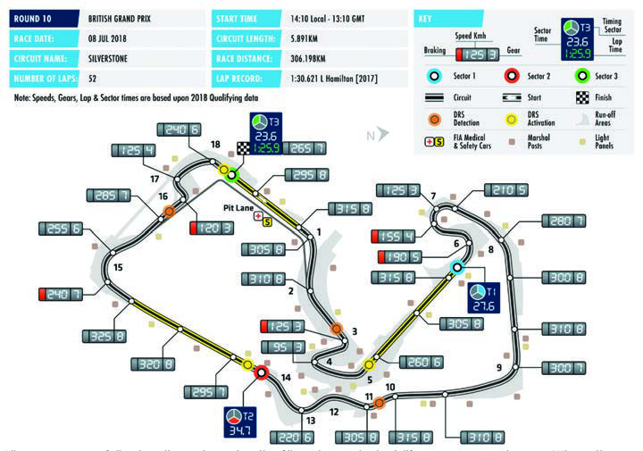

Like so many of England's racing circuits, Silverstone started life as an aerodrome. When the Second World War ended, the outer taxiways and interconnecting runways of Silverstone became adopted by the Royal Automobile Club as the home for the British Grand Prix. When the Formula One World Championship was incepted in 1950, Silverstone held the very first round. From 1955 the British Grand Prix swapped venues between Aintree and Silverstone, but with the advent of the 1960s, Aintree fell out of favour and the race was switched between Silverstone and Brands Hatch, until the latter did not disappear from the calendar. Various upgrades have been made to the track's facilities. In 2010 came another major change designed to provide an even greater driver challenge. The new infield layout juts right at the reworked Abbey bend before heading into the new Arena complex of turns. This takes drivers on to the main straight of Silverstone’s National circuit, before rejoining the previous Grand Prix layout at Brooklands.

38

FORMULA 1 2018 ROLEX BRITISH GRAND PRIX

RESULTS

| Position |  | Driver |  | Team |  |  | Time |  | Starting Position |
| --- | --- | --- | --- | --- | --- | --- | --- | --- | --- |
|  | 1 |  | Sebastian Vettel |  | Scuderia Ferrari |  |  | 1:27:29.784 | 2 |
|  | 2 |  | Lewis Hamilton |  | Mercedes AMG Petronas Motorsport |  |  | +2.264 | 1 |
|  | 3 |  | Kimi Raikkonen |  | Scuderia Ferrari |  |  | +3.652 | 3 |
|  | 4 |  | Valtteri Bottas |  | Mercedes AMG Petronas Motorsport |  |  | +8.883 | 4 |
|  | 5 |  | Daniel Ricciardo |  | Aston Martin Red Bull Racing |  |  | +9.500 | 6 |
|  | 6 |  | Nico Hulkenberg |  | Renault Sport Formula One Team |  |  | +28.220 | 11 |
|  | 7 |  | Esteban Ocon |  | Sahara Force India F1 Team |  |  | +29.930 | 10 |
|  | 8 |  | Fernando Alonso |  | McLaren F1 Team |  |  | +31.115 | 13 |
|  | 9 |  | Kevin Magnussen |  | Haas F1 Team |  |  | +33.188 | 7 |
|  | 10 |  | Sergio Perez |  | Sahara Force India F1 Team |  |  | +34.708 | 12 |
|  | 11 |  | Stoffel Vandoorne |  | McLaren F1 Team |  |  | +35.774 | 17 |
|  | 12 |  | Lance Stroll |  | Williams Martini Racing |  |  | +38.106 | PL |
|  | 13 |  | Pierre Gasly |  | Red Bull Toro Rosso Honda |  |  | +39.129 | 14 |
|  | 14 |  | Sergey Sirotkin |  | Williams Martini Racing |  |  | +48.113 | PL |
|  | 15 |  | Max Verstappen |  | Aston Martin Red Bull Racing | +6 laps (DNF) |  |  | 5 |
|  | NC |  | Romain Grosjean |  | Haas F1 Team |  |  | DNF | 8 |
|  | NC |  | Carlos Sainz |  | Renault Sport Formula One Team |  |  | DNF | 16 |
|  | NC |  | Marcus Ericsson |  | Alfa Romeo Sauber F1 Team |  |  | DNF | 15 |
|  | NC |  | Charles Leclerc |  | Alfa Romeo Sauber F1 Team |  |  | DNF | 9 |
|  | NC |  | Brendon Hartley |  | Red Bull Toro Rosso Honda |  |  | DNF | PL |

Pole Position Lewis Hamilton 1:25.892 Fastest Lap Sebastian Vettel 1:30.696 (Lap 47)

Race Leader Sebastian Vettel Lap 1-20

| Valtteri Bottas | 21 |
| --- | --- |
| Sebastian Vettel | Lap 22-33 |
| Valtteri Bottas | Lap 34-46 |
| Sebastian Vettel | Lap 47-52 |

39

FORMULA 1 EMIRATES GROSSER PREIS VON DEUTSCHLAND 2018

HOCKENHEIM

Date 20 – 22 July Race Distance 306.458km Circuit Length 4.574km Number of Laps 67

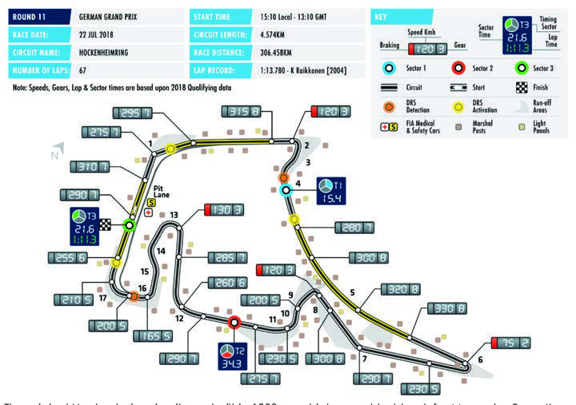

The original Hockenheim circuit was built in 1939 as a high-speed test track for Mercedes-Benz. It was almost eight kilometres long and was formed of two long, curved straights with a long corner at either end. In the post-war years the Nurburgring became the venue for Formula One racing in Germany, with Hockenheim hosting a few smaller events. When a plan to build an autobahn through the circuit was approved, the government supplied Hockenheim with a large sum by way of compensation. This money was used to build a new track in Hockenheim. The first Formula One race was held in 1970. Once the Nurburgring had been modernised, however, the sport returned there. Hockenheim became the home of the German Grand Prix in 1977. In 2002 the long runs through the forest were done away with and the layout of the track was heavily modified. The first race at the new circuit was deemed a great success and the venue has remained a regular feature on the F1 calendar ever since.

40

FORMULA 1 EMIRATES GROSSER PREIS VON DEUTSCHLAND 2018

RESULTS

Starting Position Driver Team Time Position

1 Lewis Hamilton Mercedes AMG Petronas Motorsport 1:32:29.845 14

| 2 | Valtteri Bottas | Mercedes AMG Petronas Motorsport | +4.535 | 2 |
| --- | --- | --- | --- | --- |
| 3 | Kimi Raikkonen | Scuderia Ferrari | +6.732 | 3 |
| 4 | Max Verstappen | Aston Martin Red Bull Racing | +7.654 | 4 |

5 Nico Hulkenberg Renault Sport Formula One Team +26.609 7 6 Romain Grosjean Haas F1 Team +28.871 6 7 Sergio Perez Sahara Force India F1 Team +30.556 10 8 Esteban Ocon Sahara Force India F1 Team +31.750 15 9 Marcus Ericsson Alfa Romeo Sauber F1 Team +32.362 13

| 10 | Brendon Hartley | Red Bull Toro Rosso Honda |  | +34.197 | 16 |
| --- | --- | --- | --- | --- | --- |
| 11 | Kevin Magnussen | Haas F1 Team |  | +34.919 | 5 |
| 12 | Carlos Sainz | Renault Sport Formula One Team |  | +43.069 | 8 |
| 13 | Stoffel Vandoorne | McLaren F1 Team |  | +46.617 | 18 |
| 14 | Pierre Gasly | Red Bull Toro Rosso Honda |  | +1 lap | 20 |
| 15 | Charles Leclerc | Alfa Romeo Sauber F1 Team |  | +1 lap | 9 |
| 16 | Fernando Alonso | McLaren F1 Team | +2 laps (DNF) |  | 11 |

NC Lance Stroll Williams Martini Racing DNF 17 NC Sebastian Vettel Scuderia Ferrari DNF 1 NC Sergey Sirotkin Williams Martini Racing DNF 12 NC Daniel Ricciardo Aston Martin Red Bull Racing DNF 19 Pole Position Sebastian Vettel 1:11.212 Fastest Lap Lewis Hamilton 1:15.545 (Lap 66)

Race Leader Sebastian Vettel Lap 1-25

| Valtteri Bottas | Lap 26-28 |
| --- | --- |
| Kimi Raikkonen | Lap 29-38 |
| Sebastian Vettel | Lap 39-51 |
| Valtteri Bottas | 52 |
| Lewis Hamilton | Lap 53-67 |

41

FORMULA 1 ROLEX MAGYAR NAGYDÍJ 2018

BUDAPEST

Date 27 – 29 July Race Distance 306.630km Circuit Length 4.381km Number of Laps 70

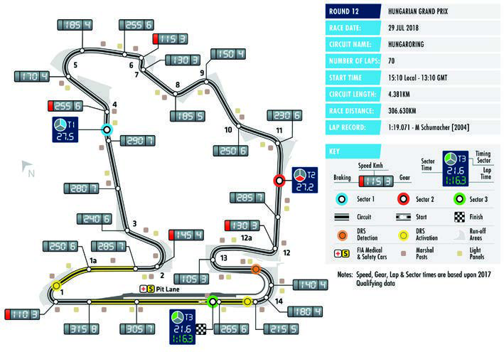

Hungary first hosted a Grand Prix in the 1930s, but following the Second World War and the building of the Iron Curtain it was not until the 1960s that motorsport began to find a place in the country. At the start of the 1980s there was a general wish for a Grand Prix to be held behind the Iron Curtain and negotiations took place with the Soviet Union with a view to a race being held in Moscow. In the summer of 1983 however, the attention of the Formula One decision makers turned away from Moscow and towards Budapest. At first a street race through Budapest was suggested, but in the end the decision was taken to build a brand new circuit in a valley 19 kilometres outside the city. The valley provided natural vantage points for spectators and in 1985 work began on the Hungaroring. The track opened in 1986 and it held its first Formula One event in summer that year. It was a huge success. Although tight and twisty, the circuit has been known to throw up some great races, and it has remained a permanent fixture on the World Championship calendar.

42

FORMULA 1 ROLEX MAGYAR NAGYDÍJ 2018

RESULTS

| Position |  | Driver |  | Team |  | Time |  | Starting Position |
| --- | --- | --- | --- | --- | --- | --- | --- | --- |
|  | 1 |  | Lewis Hamilton |  | Mercedes AMG Petronas Motorsport |  | 1:37:16.427 | 1 |
|  | 2 |  | Sebastian Vettel |  | Scuderia Ferrari |  | +17.123 | 4 |
|  | 3 |  | Kimi Raikkonen |  | Scuderia Ferrari |  | +20.101 | 3 |
|  | 4 |  | Daniel Ricciardo |  | Aston Martin Red Bull Racing |  | +46.419 | 12 |
|  | 5 |  | Valtteri Bottas |  | Mercedes AMG Petronas Motorsport |  | +60.000 | 2 |
|  | 6 |  | Pierre Gasly |  | Red Bull Toro Rosso Honda |  | +73.273 | 6 |
|  | 7 |  | Kevin Magnussen |  | Haas F1 Team |  | +1 lap | 9 |
|  | 8 |  | Fernando Alonso |  | McLaren F1 Team |  | +1 lap | 11 |
|  | 9 |  | Carlos Sainz |  | Renault Sport Formula One Team |  | +1 lap | 5 |
|  | 10 |  | Romain Grosjean |  | Haas F1 Team |  | +1 lap | 10 |
|  | 11 |  | Brendon Hartley |  | Red Bull Toro Rosso Honda |  | +1 lap | 8 |
|  | 12 |  | Nico Hulkenberg |  | Renault Sport Formula One Team |  | +1 lap | 13 |
|  | 13 |  | Esteban Ocon |  | Sahara Force India F1 Team |  | +1 lap | 17 |
|  | 14 |  | Sergio Perez |  | Sahara Force India F1 Team |  | +1 lap | 18 |
|  | 15 |  | Marcus Ericsson |  | Alfa Romeo Sauber F1 Team |  | +2 laps | 14 |
|  | 16 |  | Sergey Sirotkin |  | Williams Martini Racing |  | +2 laps | 19 |
|  | 17 |  | Lance Stroll |  | Williams Martini Racing |  | +2 laps | PL |
|  | NC |  | Stoffel Vandoorne |  | McLaren F1 Team |  | DNF | 15 |
|  | NC |  | Max Verstappen |  | Aston Martin Red Bull Racing |  | DNF | 7 |
|  | NC |  | Charles Leclerc |  | Alfa Romeo Sauber F1 Team |  | DNF | 16 |

Pole Position Lewis Hamilton 1:35.658 Fastest Lap Daniel Ricciardo 1:20.012 (Lap 46)

Race Leader Lewis Hamilton Lap 1-25 Sebastian Vettel Lap 26-39 Lewis Hamilton Lap 40-70

43

FORMULA 1 2018 JOHNNIE WALKER BELGIAN GRAND PRIX

SPA-FRANCORCHAMPS

Date 24 – 26 August Race Distance 308.052km Circuit Length 7.004km Number of Laps 44

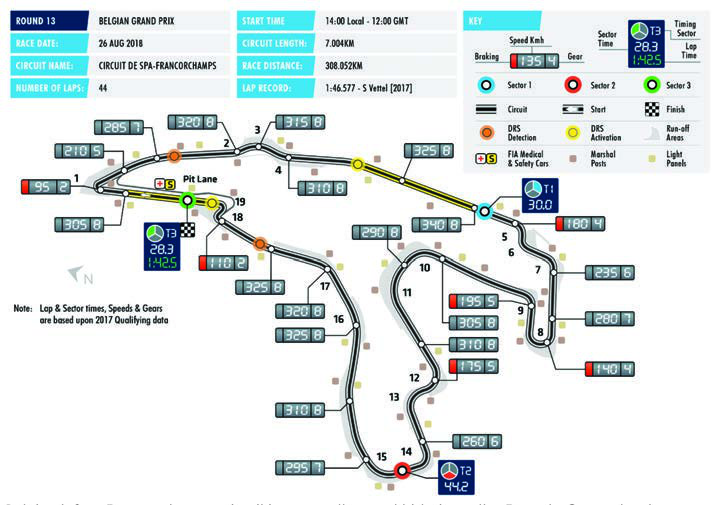

Belgium's Spa-Francorchamps circuit is among the most historic on the Formula One calendar, as it has hosted Grand Prix since 1924. Run on narrow public roads, the original Spa layout was an amazing 14.9 kilometres long and notoriously dangerous. The 'old' circuit staged its final Grand Prix in 1970. Spa did not return to the calendar until 1983 and then in drastically revised form, with lap distance cut twice. Somehow, though, the circuit's magic was retained. Around two thirds of the lap used the original layout and the legendary Eau Rouge corner remained intact. More than twenty years on Spa, with its long straights and challenging fast corners, coupled with its picturesque setting, remains the longest circuit on the calendar. Eau Rouge, with its high speed and sudden elevation change, maintains its reputation as one of Formula One racing's most technically demanding corners.

44

FORMULA 1 2018 JOHNNIE WALKER BELGIAN GRAND PRIX

RESULTS

Starting Position Driver Team Time Position 1 Sebastian Vettel Scuderia Ferrari 1:23.34.476 2

| 2 | Lewis Hamilton | Mercedes AMG Petronas Motorsport | +11.061 | 1 |
| --- | --- | --- | --- | --- |
| 3 | Max Verstappen | Aston Martin Red Bull Racing | +31.372 | 7 |
| 4 | Valtteri Bottas | Mercedes AMG Petronas Motorsport | +68.605 | 17 |

5 Sergio Perez Racing Point Force India F1 Team +71.023 4 6 Esteban Ocon Racing Point Force India F1 Team +79.520 3 7 Romain Grosjean Haas F1 Team +85.953 5 8 Kevin Magnussen Haas F1 Team +87.639 9 9 Pierre Gasly Red Bull Toro Rosso Honda +105.892 10

| 10 | Marcus Ericsson | Alfa Romeo Sauber F1 Team | +1 lap | 13 |
| --- | --- | --- | --- | --- |
| 11 | Carlos Sainz | Renault Sport Formula One Team | +1 lap | 19 |
| 12 | Sergey Sirotkin | Williams Martini Racing | +1 lap | 15 |
| 13 | Lance Stroll | Williams Martini Racing | +1 lap | 16 |
| 14 | Brendon Hartley | Red Bull Toro Rosso Honda | +1 lap | 11 |

15 Stoffel Vandoorne McLaren F1 Team +1 lap 20

| NC | Daniel Ricciardo | Aston Martin Red Bull Racing | DNF | 8 |
| --- | --- | --- | --- | --- |
| NC | Kimi Raikkonen | Scuderia Ferrari | DNF | 6 |
| NC | Charles Leclerc | Alfa Romeo Sauber F1 Team | DNF | 12 |

NC Fernando Alonso McLaren F1 Team DNF 14 NC Nico Hulkenberg Renault Sport Formula One Team DNF 18

Pole Position Lewis Hamilton 1:58.179 Fastest Lap Valtteri Bottas 1:46.286 (Lap 32)

Race Leader Sebastian Vettel Lap 1-44

45

FORMULA 1 GRAN PREMIO HEINEKEN D'ITALIA 2018

MONZA

Date 31 August - 02 Race Distance 306.720km September Circuit Length 5.793km Number of Laps 53

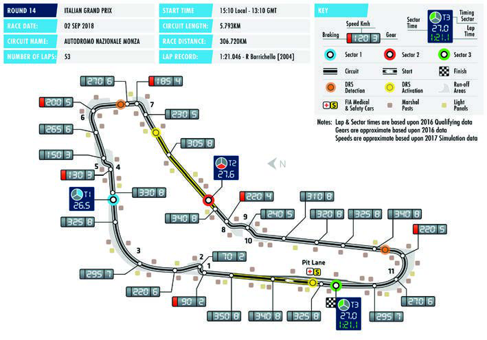

Monza is regarded by many as the embodiment of Formula One racing. Not only is it a fantastic example of a track that combines speed with skill, it also has a heart and soul all of its own. It has seen some of the finest races of all time, but also some of the sport's worst accidents. The names of great drivers and the sounds of engines from years gone by linger in the grand old trees surrounding the track in the royal park. Work began on the circuit in 1922 and was completed in under six months. With a banked oval incorporated into the design of the road racing circuit, the total track length stood at a whopping 10 kilometres. Formula One racing visited the circuit as part of the inaugural season in 1950, and it has remained a permanent fixture on the calendar ever since. For many there is nowhere that encapsulates the sport better than this circuit, that remains the fastest one. The Italians call it 'La Pista Magica', the magic track, a description few would disagree with.

46

FORMULA 1 GRAN PREMIO HEINEKEN D'ITALIA 2018

RESULTS

| Position |  | Driver |  | Team |  | Time |  | Starting Position |
| --- | --- | --- | --- | --- | --- | --- | --- | --- |
|  | 1 |  | Lewis Hamilton |  | Mercedes AMG Petronas Motorsport |  | 1:16.54.484 | 3 |
|  | 2 |  | Kimi Räikkönen |  | Scuderia Ferrari |  | +8.705s | 1 |
|  | 3 |  | Valtteri Bottas |  | Mercedes AMG Petronas Motorsport |  | +14.066s | 4 |
|  | 4 |  | Sebastian Vettel |  | Scuderia Ferrari |  | +16.151s | 2 |

5 Max Verstappen Aston Martin Red Bull Racing +18.208s 5 DQ Romain Grosjean Haas F1 Team +56.320s 6 6 Esteban Ocon Racing Point Force India F1 Team +57.761s 8 7 Sergio Perez Racing Point Force India F1 Team +58.678s 14 8 Carlos Sainz Renault Sport Formula One Team +78.140s 7

| 9 | Lance Stroll | Williams Martini Racing | +1 lap | 10 |
| --- | --- | --- | --- | --- |
| 10 | Sergey Sirotkin | Williams Martini Racing | +1 lap | 12 |
| 11 | Charles Leclerc | Alfa Romeo Sauber F1 Team | +1 lap | 15 |
| 12 | Stoffel Vandoorne | McLaren F1 Team | +1 lap | 17 |
| 13 | Nico Hulkenberg | Renault Sport Formula One Team | +1 lap | 20 |

14 Pierre Gasly Red Bull Toro Rosso Honda +1 lap 9

| 15 | Marcus Ericsson | Alfa Romeo Sauber F1 Team | +1 lap | 18 |
| --- | --- | --- | --- | --- |
| 16 | Kevin Magnussen | Haas F1 Team | +1 lap | 11 |
| NC | Daniel Ricciardo | Aston Martin Red Bull Racing | DNF | 19 |

NC Fernando Alonso McLaren F1 Team DNF 13 NC Brendon Hartley Red Bull Toro Rosso Honda DNF 16

Pole Position Kimi Räikkönen 1:19.119 Fastest Lap Lewis Hamilton 1:22.497 (Lap 30)

Race Leader Kimi Räikkönen Lap 1-19 Lewis Hamilton Lap 20-28 Valtteri Bottas Lap 29-35 Kimi Räikkönen Lap 36-44 Lewis Hamilton Lap 45-53

47

FORMULA 1 2018 SINGAPORE AIRLINES SINGAPORE GRAND PRIX

SINGAPORE

Date 14 – 16 September Race Distance 308.706km Circuit Length 5.063km Number of Laps 61

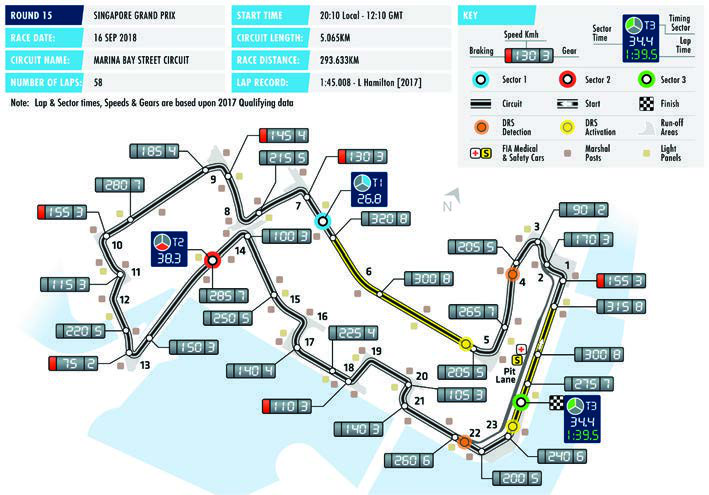

In 2008, Singapore had the honour of hosting the first night-time race in F1 history. The first race held on the street track with the city's famous skyline as its spectacular backdrop proved a huge hit. The Singapore Grand Prix has quickly established itself as one of the standouts on the world championship calendar. Having the race at night allows to broadcast it at a suitable time for the European fans, and the local F1 fans can enjoy the wonderful scenery. The circuit is located in the streets of the Marina Bay district. Powerful lighting systems allow to create the same conditions for the drivers as in the light of day, and the organisers carefully ensure the safety of the drivers and the fans. For Singapore the Grand Prix has already become not just a race, but a real festival.

48

FORMULA 1 2018 SINGAPORE AIRLINES SINGAPORE GRAND PRIX

RESULTS

| Position |  | Driver |  | Team |  | Time |  | Starting Position |
| --- | --- | --- | --- | --- | --- | --- | --- | --- |
|  | 1 |  | Lewis Hamilton |  | Mercedes AMG Petronas Motorsport |  | 1:51.11.611 | 1 |
|  | 2 |  | Max Verstappen |  | Aston Martin Red Bull Racing |  | +8.961 | 2 |
|  | 3 |  | Sebastian Vettel |  | Scuderia Ferrari |  | +39.945 | 3 |
|  | 4 |  | Valtteri Bottas |  | Mercedes AMG Petronas Motorsport |  | +51.930 | 4 |
|  | 5 |  | Kimi Raikkonen |  | Scuderia Ferrari |  | +53.001 | 5 |
|  | 6 |  | Daniel Ricciardo |  | Aston Martin Red Bull Racing |  | +53.982 | 6 |

7 Fernando Alonso McLaren F1 Team +103.011 11

| 8 | Carlos Sainz | Renault Sport Formula One Team | +1 lap | 12 |
| --- | --- | --- | --- | --- |
| 9 | Charles Leclerc | Alfa Romeo Sauber F1 Team | +1 lap | 13 |
| 10 | Nico Hulkenberg | Renault Sport Formula One Team | +1 lap | 10 |
| 11 | Marcus Ericsson | Alfa Romeo Sauber F1 Team | +1 lap | 14 |
| 12 | Stoffel Vandoorne | McLaren F1 Team | +1 lap | 18 |

13 Pierre Gasly Red Bull Toro Rosso Honda +1 lap 15

| 14 | Lance Stroll | Williams Martini Racing | +1 lap | 20 |
| --- | --- | --- | --- | --- |
| 15 | Romain Grosjean | Haas F1 Team | +1 lap | 8 |
| 16 | Sergio Perez | Racing Point Force India F1 Team | +1 lap | 7 |
| 17 | Brendon Hartley | Red Bull Toro Rosso Honda | +1 lap | 17 |
| 18 | Kevin Magnussen | Haas F1 Team | +2 laps | 16 |
| 19 | Sergey Sirotkin | Williams Martini Racing | +2 laps | 19 |
| NC | Esteban Ocon | Racing Point Force India F1 Team | DNF | 9 |

Pole Position Lewis Hamilton 1:36.015 Fastest Lap Kevin Magnussen 1:41.905 (Lap 50)

Race Leader Lewis Hamilton Lap 1-14 Max Verstappen Lap 15-17 Kimi Raikkonen Lap 18-21 Daniel Ricciardo Lap 22-26 Lewis Hamilton Lap 27-61

49

2018 FORMULA 1 VTB RUSSIAN GRAND PRIX

SOCHI

Date 28-30 September Race Distance 309.745km Circuit Length 5.848km Number of Laps 53

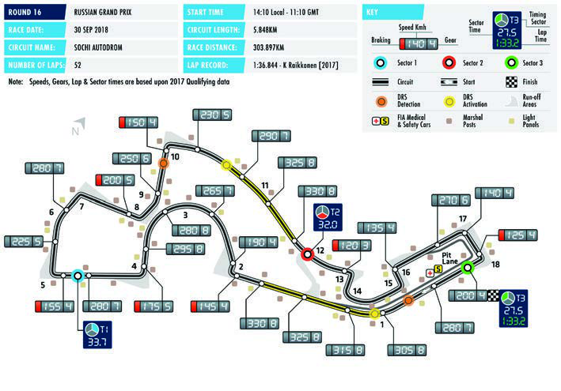

Sochi Autodrom, located on the Black Sea coast is the first purpose-built Formula One facility in Russia. It hosted the inaugural Grand Prix in October 2014, in the same year that the city also staged the Winter Olympics. Sochi's Formula One relationship formally began in October 2010, when an agreement to host a Grand Prix was signed, with the support of the Russian government. Construction of the circuit came under the design supervision of renowned architect Hermann Tilke. The track is integrated into the Olympic Park infrastructure, with facilities located in close vicinity to the Olympic Park railway station and to the roads which connect the Olympic venues with Sochi International Airport. The track width is 13 meters at its narrowest point and 15 meters at the start-finish line. It has 12 right and six left turns and combines both high-speed and technical sections.

50

FORMULA 1 2018 HONDA JAPANESE GRAND PRIX

SUZUKA

Date 05 – 07 October Race Distance 307.471km Circuit Length 5.807km Number of Laps 53

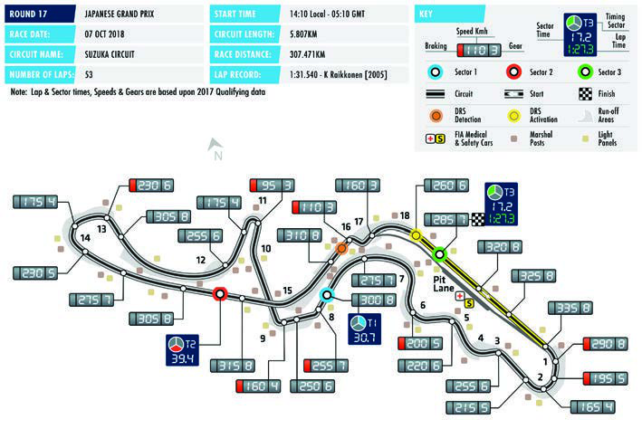

Suzuka is considered one of the best current Formula 1 circuits 1. This track is a big challenge for both the car and the driver. The circuit was built in 1962 by Honda as a testing ground. It was designed by John Hugenholtz. A theme park with a big Ferris Wheel was built around the circuit. Thanks to Honda’s authority and having successfully held a number of other races, Suzuka finally hosted the Japanese Grand Prix in 1987, taking this right away from the Fuji circuit. Since then, it has seen many great fights, including those sealing the fate of the Championship title. In 2007 and 2008, Suzuka gave the right to stage the Japanese Grand Prix to Fuji. Suzuka is one of the favourite circuits for many drivers and has several difficult turns such as 130R or Spoon. It is the only 8-shaped circuit in Formula 1.

51

FORMULA 1 PIRELLI 2018 UNITED STATES GRAND PRIX

AUSTIN

Date 19 – 21 October Race Distance 308.405km Circuit Length 5.513km Number of Laps 56

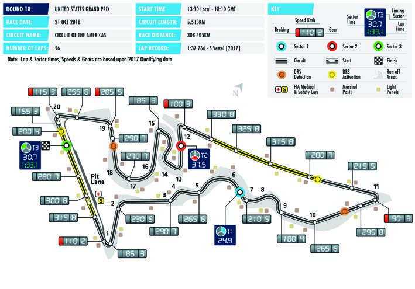

In 2012, Formula 1 came back to the USA for the first time since 2007 and was held on a brand new circuit in the State of Texas. The Austin circuit has become the first one to be built specially for F1, but it can also host any other races. It was designed by Hermann Tilke and American architectural firm HKS. The constriction started in January 2011. The terrain of the area allowed to build a circuit with a 40 m elevation difference. The steep ascent to the hairpin of Turn 1 became the most famous part of the track. Many sections of the Austin circuit layout are similar to the famous turns of other circuits. For example, Turns 3 through 6 ressemble Solverstone’s Maggotts/Becketts combination, while Turns 12 through 15 mimic Hockenheim's stadium section, and Turn 16 is like multiappex Turn 8 in Istanbul. The Austin circuit has become the 10th in the USA to host an F1 race.

52

FORMULA 1 GRAN PREMIO DE MÉXICO 2018

MEXICO CITY

Date 26 – 28 October Race Distance 305.354km Circuit Length 4.304km Number of Laps 71

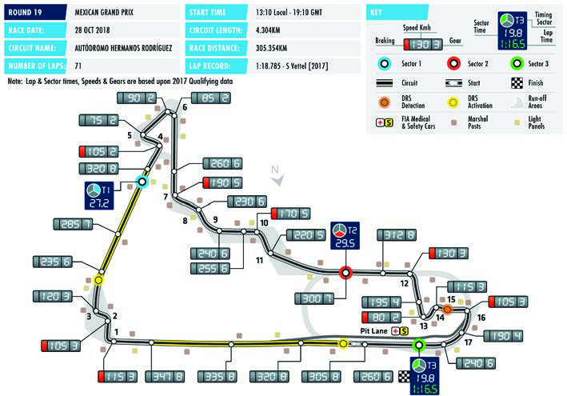

The first Formula 1 Mexican Grand Prix was held at the circuit in the Magdalena Mixhuca park in 1963. The Autodromo Hermanos Rodriguez had been hosting world championship rounds every year, but left the calendar for a long time after the 1970 season to return for just several years from 1986 to 1992. The second comeback of the circuit in Mexico City happened in 2015 after significant reconstruction. Over this time some corners have been modified, including famous last turn Peraltada. The first Mexican Grand Prix in the 21st century was a great success with one of the highlights of the broadcast being the drivers passing between the overcrowded grandstands of a former baseball stadium. One of the features of competitions at the Autodromo Hermanos Rodriguez is the thin air of Mexico City, located at a high altitude. This factor can have a serious impact on the work of power units.

53

FORMULA 1 GRANDE PRÊMIO HEINEKEN DO BRASIL 2018

SAO PAULO

Date 09 – 11 November Race Distance 305.909km Circuit Length 4.309km Number of Laps 71

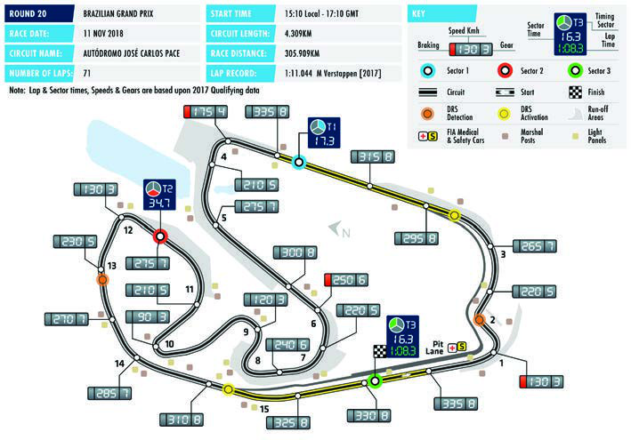

The Sao Paulo district where the Formula 1 circuit was built, was supposed to be a residential area. However, the territory turned out to be unsuitable for a large-scale dwelling construction, so it was decided to built a race track here. The works started in 1938 and finished in May 1940. But the first Formula 1 Brazilian Grand Prix took place only in 1973. However, soon the proximity of slums to the circuit, forced F1 to move the race to Jacarepaguá in Rio de Janeiro. Modified Autódromo José Carlos Pace, more commonly referred to as Interlagos, returned into the calendar in 1990, and has been its integral part ever since. The circuit has seen many remarkable fights. The Sao Paulo venue has determined the world champion as well. The combination of fast straights and slow turns makes it difficult for the drivers to choose the set-up.

54

FORMULA 1 2018 ETIHAD AIRWAYS ABU DHABI GRAND PRIX

YAS MARINA

Date 23 – 25 November Race Distance 305.355km Circuit Length 5.554km Number of Laps 55

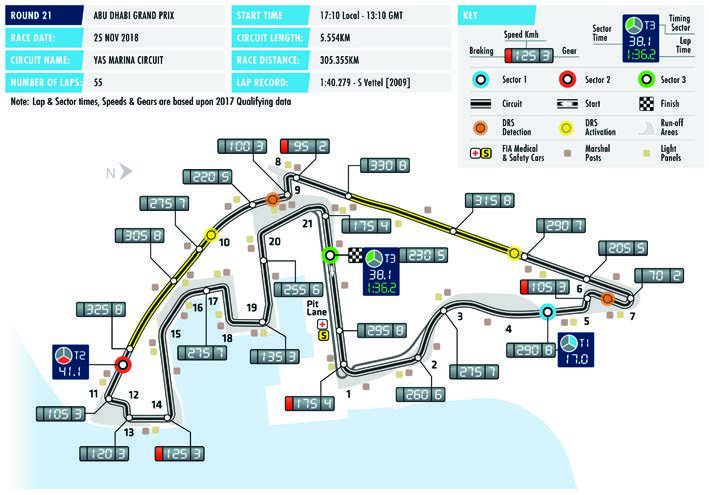

Yas Marina that first hosted a Formula 1 Grand Prix in 2009 is one of Abu Dhabi’s real treasures. Powerful lighting system allowed that race to be the first one to start in the daytime and finish at night. Designed by Hermann Tilke, the venue has a section stretching along the sea embankment which allows it to compete with Monaco and Singapore in terms of scenery. The Abu Dhabi circuit has one of the longest straights in Formula 1. It also offers quite narrow turns and a winding sector common for street circuits. An amazing infrastructure surrounds the circuit. A part of the track goes through one of the coastline hotels, and a part of the pit lane exit is a special tunnel under the track surface. Yas Marina has only covered grandstands. This year it will be the seventh time when the Abu Dhabi Grand Prix is the last one on the F1 calendar.

55

2018 FIA FORMULA ONE WORLD CHAMPIONSHIP

STANDINGS

DRIVERS

| POS |  | DRIVER |  |  |  |  |  |  |  |  |  |
| --- | --- | --- | --- | --- | --- | --- | --- | --- | --- | --- | --- |
|  |  |  |  | AUS | BRN | CHN | AZE | ESP | MON | CAN | FRA |
|  | 1 |  | Lewis Hamilton | 18 | 15 | 12 | 25 | 25 | 15 | 10 | 25 |
|  | 2 |  | Sebastian Vettel | 25 | 25 | 4 | 12 | 12 | 18 | 25 | 10 |
|  | 3 |  | Kimi Räikkönen | 15 |  | 15 | 18 |  | 12 | 8 | 15 |
|  | 4 |  | Valtteri Bottas | 4 | 18 | 18 |  | 18 | 10 | 18 | 6 |

5 Max Verstappen 8 10 15 2 15 18

6 Daniel Ricciardo 12 25 10 25 12 12

7 Nico Hulkenberg 6 8 8 4 6 2

| 8 | Fernando Alonso | 10 | 6 | 6 | 6 | 4 |  |  |  |
| --- | --- | --- | --- | --- | --- | --- | --- | --- | --- |
| 9 | Kevin Magnussen |  | 10 | 1 |  | 8 |  |  | 8 |
| 10 | Sergio Perez |  |  |  | 15 | 2 |  |  |  |
| 11 | Esteban Ocon |  | 1 |  |  |  | 8 | 2 |  |
| 12 | Carlos Sainz | 1 |  | 2 | 10 | 6 | 1 | 4 | 4 |
| 13 | Pierre Gasly |  | 12 |  |  |  | 6 |  |  |
| 14 | Romain Grosjean |  |  |  |  |  |  |  |  |

15 Charles Leclerc 8 1 1 1

16 Stoffel Vandoorne 2 4 2

17 Lance Stroll 4

| 18 | Marcus Ericsson | 2 |  |
| --- | --- | --- | --- |
| 19 | Brendon Hartley |  | 1 |
| 20 | Sergey Sirotkin |  |  |

56

2018 FIA FORMULA ONE WORLD CHAMPIONSHIP

DRIVERS

| POS |  | DRIVER |  |  |  |  |  |  |  |  | TOTAL |  |
| --- | --- | --- | --- | --- | --- | --- | --- | --- | --- | --- | --- | --- |
|  |  |  |  | AUT | GBR | GER | HUN | BEL | ITA | SIN |  |  |
|  | 1 |  | Lewis Hamilton |  | 18 | 25 | 25 | 18 | 25 | 25 |  | 281 |
|  | 2 |  | Sebastian Vettel | 15 | 25 |  | 18 | 25 | 12 | 15 |  | 241 |
|  | 3 |  | Kimi Räikkönen | 18 | 15 | 15 | 15 |  | 18 | 10 |  | 174 |
|  | 4 |  | Valtteri Bottas |  | 12 | 18 | 10 | 12 | 15 | 12 |  | 171 |

5 Max Verstappen 25 12 15 10 18 148

6 Daniel Ricciardo 10 12 8 126

7 Nico Hulkenberg 8 10 1 53

| 8 | Fernando Alonso | 4 | 4 |  | 4 |  |  | 6 | 50 |
| --- | --- | --- | --- | --- | --- | --- | --- | --- | --- |
| 9 | Kevin Magnussen | 10 | 2 |  | 6 | 4 |  |  | 49 |
| 10 | Sergio Perez | 6 | 1 | 6 |  | 10 | 6 |  | 46 |
| 11 | Esteban Ocon | 8 | 6 | 4 |  | 8 | 8 |  | 45 |
| 12 | Carlos Sainz |  |  |  | 2 |  | 4 | 4 | 38 |
| 13 | Pierre Gasly |  |  |  | 8 | 2 |  |  | 28 |
| 14 | Romain Grosjean | 12 |  | 8 | 1 | 6 |  |  | 27 |

15 Charles Leclerc 2 2 15

16 Stoffel Vandoorne 8

17 Lance Stroll 2 6

| 18 | Marcus Ericsson | 1 | 2 | 1 |  | 6 |
| --- | --- | --- | --- | --- | --- | --- |
| 19 | Brendon Hartley |  | 1 |  |  | 2 |
| 20 | Sergey Sirotkin |  |  |  | 1 | 1 |

57

2018 FIA FORMULA ONE WORLD CHAMPIONSHIP

TEAMS

| POS |  | DRIVER |  |  |  |  |  |  |  |  |  |  |  |  |  |  |  |  |  |
| --- | --- | --- | --- | --- | --- | --- | --- | --- | --- | --- | --- | --- | --- | --- | --- | --- | --- | --- | --- |
|  |  |  |  |  | AUS |  | BRN |  | CHN |  | AZE |  | ESP |  | MON |  | CAN |  | FRA |
| 1 |  |  | Mercedes AMG Petronas Motorsport | 22 |  | 33 |  | 30 |  | 25 |  | 43 |  | 25 |  | 28 |  | 31 |  |
|  | 2 |  | Scuderia Ferrari |  | 40 |  | 25 |  | 19 |  | 30 |  | 12 |  | 30 |  | 33 |  | 25 |
| 3 |  |  | Aston Martin Red Bull Racing | 20 |  |  |  | 35 |  |  |  | 25 |  | 27 |  | 27 |  | 30 |  |
| 4 |  |  | Renault Sport Formula One Team | 7 |  | 8 |  | 10 |  | 10 |  | 6 |  | 5 |  | 10 |  | 6 |  |

5 Haas F1 Team 10 1 8 8

6 McLaren F1 Team 12 10 6 8 4 Racing Point Force 7 India F1 Team

| 8 | Red Bull Toro Rosso Honda | 12 | 1 |  | 6 |  |  |
| --- | --- | --- | --- | --- | --- | --- | --- |
| 9 | Alfa Romeo Sauber F1 Team | 2 | 8 | 1 |  | 1 | 1 |
| 10 | Williams Martini Racing |  | 4 |  |  |  |  |

Sahara Force India EX (1) (15) (2) (8) (2) F1 Team

58

2018 FIA FORMULA ONE WORLD CHAMPIONSHIP

TEAMS

| POS |  | DRIVER |  |  |  |  |  |  |  |  |  |  |  |  |  |  |  | TOTAL |  |
| --- | --- | --- | --- | --- | --- | --- | --- | --- | --- | --- | --- | --- | --- | --- | --- | --- | --- | --- | --- |
|  |  |  |  |  | AUT |  | GBR |  | GER |  | HUN |  | BEL |  | ITA |  | SIN |  |  |
| 1 |  |  | Mercedes AMG Petronas Motorsport |  |  | 30 |  | 43 |  | 35 |  | 30 |  | 40 |  | 37 |  | 452 |  |
|  | 2 |  | Scuderia Ferrari |  | 33 |  | 40 |  | 15 |  | 33 |  | 25 |  | 30 |  | 25 |  | 415 |
| 3 |  |  | Aston Martin Red Bull Racing | 25 |  | 10 |  | 12 |  | 12 |  | 15 |  | 10 |  | 26 |  | 274 |  |
| 4 |  |  | Renault Sport Formula One Team |  |  | 8 |  | 10 |  | 2 |  |  |  | 4 |  | 5 |  | 91 |  |

5 Haas F1 Team 22 2 8 7 10 76

6 McLaren F1 Team 4 4 4 6 58 Racing Point Force 7 18 14 32 India F1 Team

| 8 | Red Bull Toro Rosso Honda |  | 1 | 8 | 2 |  |  | 30 |
| --- | --- | --- | --- | --- | --- | --- | --- | --- |
| 9 | Alfa Romeo Sauber F1 Team | 3 | 2 |  | 1 |  | 2 | 21 |
| 10 | Williams Martini Racing |  |  |  |  | 3 |  | 7 |

Sahara Force India EX (14) (7) (10) (59) F1 Team

59

2018 FIA FORMULA ONE WORLD CHAMPIONSHIP

WINNERS, POLES, FASTEST LAPS

GRAND PRIX WINNER POLE FASTEST LAP

AUSTRALIA Sebastian Vettel Lewis Hamilton Daniel Ricciardo

BAHRAIN Sebastian Vettel Sebastian Vettel Valtteri Bottas

CHINA Daniel Ricciardo Sebastian Vettel Daniel Ricciardo

AZERBAIJAN Lewis Hamilton Sebastian Vettel Valtteri Bottas

SPAIN Lewis Hamilton Lewis Hamilton Daniel Ricciardo

MONACO Daniel Ricciardo Daniel Ricciardo Max Verstappen

CANADA Sebastian Vettel Sebastian Vettel Max Verstappen

FRANCE Lewis Hamilton Lewis Hamilton Valtteri Bottas

AUSTRIA Max Verstappen Valtteri Bottas Kimi Räikkönen

GREAT BRITAIN Sebastian Vettel Lewis Hamilton Sebastian Vettel

GERMANY Lewis Hamilton Sebastian Vettel Lewis Hamilton

HUNGARY Lewis Hamilton Lewis Hamilton Daniel Ricciardo

BELGIUM Sebastian Vettel Lewis Hamilton Valtteri Bottas

ITALY Lewis Hamilton Kimi Räikkönen Lewis Hamilton

SINGAPORE Lewis Hamilton Lewis Hamilton Kevin Magnussen

60

2018 FIA FORMULA ONE WORLD CHAMPIONSHIP

DRIVERS. STATISTICS

|  |  |  | Grand Prix |  |  |  |  |  |
| --- | --- | --- | --- | --- | --- | --- | --- | --- |
| Driver | Debut | Titles | starts | Wins | Podiums | Poles | Fastest laps | Pts |

Lewis Hamilton 2007 4 223 69 129 79 40 2891 Valtteri Bottas 2013 0 112 3 28 5 7 887

Sebastian Vettel 2007 4 213 52 108 55 34 2666

Kimi Räikkönen 2001 1 286 20 100 18 46 1739

Daniel Ricciardo 2011 0 144 7 29 2 13 942

Max Verstappen 2015 0 75 4 17 0 4 569

Sergio Perez 2011 0 149 0 8 0 4 513

| Esteban Ocon | 2016 | 0 | 44 | 0 | 0 | 0 | 0 | 132 |
| --- | --- | --- | --- | --- | --- | --- | --- | --- |
| Lance Stroll | 2017 | 0 | 35 | 0 | 1 | 0 | 0 | 46 |
| Sergey Sirotkin | 2018 | 0 | 15 | 0 | 0 | 0 | 0 | 1 |

Nico Hulkenberg 2010 0 150 0 0 1 2 458

Carlos Sainz 2015 0 75 0 0 0 0 156

Pierre Gasly 2017 0 20 0 0 0 0 28

Brendon Hartley 2017 0 19 0 0 0 0 2

Romain Grosjean 2009 0 137 0 10 0 1 371

Kevin Magnussen 2014 0 75 0 1 0 1 130

Fernando Alonso 2001 2 306 32 97 22 23 1899

Stoffel Vandoorne 2016 0 35 0 0 0 0 22

Marcus Ericsson 2014 0 91 0 0 0 0 15

Charles Leclerc 2018 0 15 0 0 0 0 15

61

2018 FIA FORMULA ONE WORLD CHAMPIONSHIP

CONSTRUCTORS. STATISTICS

|  |  |  | Grand Prix |  |  |  |  |  |
| --- | --- | --- | --- | --- | --- | --- | --- | --- |
| Constructor | Debut | Titles | starts | Wins | Podiums | Poles | Fastest laps | Pts |

Mercedes 1954 4 183 83 172 96 62 4170 Ferrari 1950 16 964 234 745 219 246 7597,5

Red Bull 2005 4 259 58 156 59 60 4162,5

Force India 2008 0 206 0 6 1 5 1078

Williams 1975 9 717 114 312 128 133 3560

Renault 1977 2 356 35 100 51 31 1474

Toro Rosso 2006 0 241 1 1 1 1 412

| Haas | 2016 | 0 | 56 | 0 | 0 | 0 | 1 | 152 |
| --- | --- | --- | --- | --- | --- | --- | --- | --- |
| McLaren | 1966 | 8 | 836 | 182 | 485 | 155 | 155 | 5204,5 |
| Sauber | 1993 | 0 | 367 | 0 | 10 | 0 | 3 | 486 |

62

2018 FIA FORMULA ONE WORLD CHAMPIONSHIP TEAMS

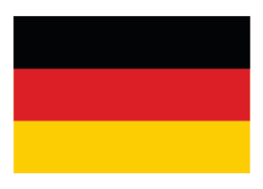

MERCEDES AMG PETRONAS MOTORSPORT

Base Operations Centre Brackley NN13 7BD England Phone +44 (0) 1280 844 000 Fax +44 (0) 1280 844 001 Website www.mercedesamgf1.com

Team Chief Toto Wolff Non-Executive Chairman Niki Lauda Technical Chief James Allison Engine Chief Andy Cowell Director of Digital Engineering Transformation Geoffrey Willis Engineering Director Aldo Costa

Contacts Bradley Lord, tel.:+ 44 (0)7785 68 28 93 Email: blord@mercedesamgf1.com

Chassis Mercedes F1 W09 Power Unit Mercedes

LEWIS VALTTERI HAMILTON 44 BOTTAS 77

Date of Birth 07/01/1985 Date of Birth 28/08/1989 Place of Birth Stevenage, Place of Birth Nastola, Great Britain Finland Residence Monaco Residence Monaco Height 1.74 m Height 1.73 m Weight 66 kg Weight 70 kg Marital Status Single Marital Status Married Race Engineer Peter Bonnington Race Engineer Tony Ross

63

2018 FIA FORMULA ONE WORLD CHAMPIONSHIP TEAMS

SCUDERIA FERRARI

Base Ferrari S.p.A. Via Ascari 55-57 41053 Maranello Italy Phone +39 536 949 111 Fax +39 536 949 049 Website www.ferrari.com

Team Chief Maurizio Arrivabene Technical Chief Mattia Binotto Engine Chief Corrado Lotti

Contacts Alberto Antonini, tel: +39 344 055 66 35 Email: alberto.antonini@ferrari.com

Chassis Ferrari SF71H Power Unit Ferrari

SEBASTIAN KIMI VETTEL 5 RAIKKONEN 7

Date of Birth 03/07/1987 Date of Birth 17/10/1979 Place of Birth Heppenheim, Place of Birth Espoo, Germany Finland Residence Switzerland Residence Switzerland Height 1.76 m Height 1.75 m Weight 62 kg Weight 70 kg Marital Status Married, has two Marital Status Married, has one daughters daughter Race Engineer Riccardo Adami Race Engineer Carlo Santi

64

2018 FIA FORMULA ONE WORLD CHAMPIONSHIP TEAMS

ASTON MARTIN RED BULL RACING

Base Bradburn Drive Tilbrook Milton Keynes MK7 8BJ England Phone +44 (0)1908 279700 Fax +44 (0)1908 279810 Website www.redbullracing.com

Owner Dietrich Mateschitz Team Chief Christian Horner Chief Engineering Officer Rob Marshall Chief Technical Officer Adrian Newey Head of Aerodynamics Dan Fallows

Contacts Victoria Lloyd Email: victoria.lloyd@redbullracing.com

Chassis Red Bull Racing RB14 Power Unit TAG Heuer

DANIEL MAX RICCIARDO 3 VERSTAPPEN 33

Date of Birth 01/07/1989 Date of Birth 30/09/1997 Place of Birth Perth, Place of Birth Hasselt, Australia Belgium Residence Great Britain Residence Monaco Height 1.78 m Height 1.81 m Weight 70 kg Weight 71 kg Marital Status Single Marital Status Single Race Engineer Simon Rennie Race Engineer Gianpiero Lambiase

65

2018 FIA FORMULA ONE WORLD CHAMPIONSHIP TEAMS

RACING POINT FORCE INDIA F1 TEAM

Base Dadford Road Silverstone NN12 8TJ England Phone +44 (0)1327 850 800 Fax +44 (0)1327 857 993 Website www.forceindiaf1.com

Team Chief Otmar Szafnauer Technical Chief Andrew Green Sporting Director Andy Stevenson

Contacts Will Hings, tel.: +44 (0)7734 20 20 20 Email: will.hings@forceindiaf1.com

Chassis Force India VJM11 Power Unit Mercedes

SERGIO ESTEBAN PEREZ 11 OCON 31

Date of Birth 26/01/1990 Date of Birth 17/09/1996 Place of Birth Guadalajara, Place of Birth Évreux, Mexico Normandy Residence Switzerland Residence France Height 1.73 m Height 1.86 m Weight 68 kg Weight 68 kg Marital Status Married, has a Marital Status Single son Race Engineer Bradley Joyce Race Engineer Tim Wright

66

2018 FIA FORMULA ONE WORLD CHAMPIONSHIP TEAMS

WILLIAMS MARTINI RACING

Base Grove, Wantage Oxfordshire OX12 0DQ England Phone +44 (0)1235 777 700 Fax +44 (0)1235 777 960 Website www.williamsf1.com

Team Chief Frank Williams Deputy Team Principal Claire Williams Technical Chief Paddy Lowe Head of Performance Engineering Rob Smedley

Contacts Sophie Ogg, tel: +44 (0)7977 27 57 62 Email: sophie.ogg@williamsf1.com

Chassis Williams FW41 Power Unit Mercedes

LANCE SERGEY STROLL 18 SIROTKIN 35

Date of Birth 29/10/1998 Date of Birth 27/08/1995 Place of Birth Montreal, Place of Birth Moscow, Canada Russia Residence Switzerland Residence Russia Height 1.80 m Height 1.84 m Weight 70 kg Weight 70 kg Marital Status Single Marital Status Single Race Engineers James Urwin and Race Engineers Andrew Luca Baldisserri Murdoch and Paul Williams

67

2018 FIA FORMULA ONE WORLD CHAMPIONSHIP TEAMS

RENAULT SPORT FORMULA ONE TEAM

Base Whiteways Technical Centre Enstone OX74EE England Phone +44 (0) 1608 678 000 Fax +44 (0) 1608 678 609 Website www.renaultsport.com

Managing Director Cyril Abiteboul Chief Technical Officer Bob Bell Chassis Technical Director Nick Chester Engine Technical Director Remi Taffin Sporting Director Alan Permane

Contacts Louis Bordes,Email: louis.bordes@fr.renaultsportracing.com

Chassis Renault RS18 Power Unit Renault

NICO CARLOS HULKENBERG 27 SAINZ 55

Date of Birth 19/08/1987 Date of Birth 01/09/1994 Place of Birth Emmerich am Place of Birth Madrid, Rhein, Germany Spain Residence Switzerland Residence Spain Height 1.84 m Height 1.77 m Weight 74 kg Weight 66 kg Marital Status Single Marital Status Single Race Engineer Mark Slade Race Engineer Karel Loos

68

2018 FIA FORMULA ONE WORLD CHAMPIONSHIP TEAMS

RED BULL TORO ROSSO HONDA

Base Via Boaria, 229 48018 Faenza Italy Phone +39 (0)546 696 111 Fax +39 (0)546 620 998 Website www.tororosso.com

Owner Dietrich Mateschitz Team Chief Franz Tost Technical Chief James Key

Contacts Fabiana Valenti, tel.: +39 335 7113 694 Email: fabiana.valenti@tororosso.com

Chassis Toro Rosso STR13 Power Unit Honda

PIERRE BRENDON GASLY 10 HARTLEY 28

Date of Birth 07/02/1996 Date of Birth 10/11/1989 Place of Birth Rouen, Place of Birth Palmerston North, France New Zealand Residence France Residence Monaco Height 1.77 m Height 1.84 m Weight 70 kg Weight 67 kg Marital Status Single Marital Status Married Race Engineer Mattia Spini Race Engineer Pierre Hamelin

69

2018 FIA FORMULA ONE WORLD CHAMPIONSHIP TEAMS

HAAS F1 TEAM

Base Kannapolis North Carolina USA Phone +1 704-652-4872 Website www.haasf1team.com

Owner Gene Haas Team Chief Guenther Steiner Technical Chief Rob Taylor Head of Aerodynamics Ben Agathangelou

Contacts Stuart Morrison, Email: smorrison@HaasF1Team.com

Chassis Haas VF-18 Power Unit Ferrari

ROMAIN KEVIN GROJEAN 8 MAGNUSSEN 20

Date of Birth 17/04/1986 Date of Birth 05/10/1992 Place of Birth Geneva, Place of Birth Roskilde, Switzerland Denmark Residence Switzerland Residence UAE Height 1.80 m Height 1.74 m Weight 71 kg Weight 68 kg Marital Status Married, has two Marital Status Single sons and one Race Engineer Giliano Salvi daughter Race Engineer Gary Gannon

70

2018 FIA FORMULA ONE WORLD CHAMPIONSHIP TEAMS

MCLAREN F1 TEAM

Base McLaren Technology Centre Chertsey Road Woking Surrey GU21 4YH England Phone +44 (0) 1483 261 900 Fax +44 (0) 1483 261 963 Website www.mclaren.com

CEO Zak Brown Sporting Director Gil de Ferran Chief Operations Officer Jonathan Neale Director of Design and Development Neil Oatley Chief Technical Officer Tim Goss

Contacts Tim Bampton, Email: tim.bampton@mclaren.com

Chassis McLaren MCL33 Power Unit Renault

FERNANDO STOFFEL ALONSO 14 VANDOORNE 2

Date of Birth 29/07/1981 Date of Birth 26/03/1992 Place of Birth Oviedo, Place of Birth Kortrijk, Spain Belgium Residence UAE Residence Belgium Height 1.71 m Height 1.77 m Weight 68 kg Weight 65 kg Marital Status Single Marital Status Single Race Engineer Will Joseph Race Engineer Tom Stallard

71

2018 FIA FORMULA ONE WORLD CHAMPIONSHIP TEAMS

ALFA ROMEO SAUBER F1 TEAM

Base Wildbachstrasse 9 8340 Hinwil Switzerland Phone +41 44 973 9000 Fax +44 44 973 9001 Website www.sauberf1team.com

Team Principal Frédéric Vasseur Chief Designer Eric Gandelin Technical Chief Simone Resta Head of Aerodynamics Jan Monchaux Chief Race Engineer Xevi Pujolar

Contacts Maria Guidotti, Email: maria.guidotti@sauber-motorsport.com

Chassis Sauber C37 Power Unit Ferrari

MARCUS CHARLES ERICSSON 9 LECLERC 16

Date of Birth 02/09/1990 Date of Birth 16/10/1997 Place of Birth Kumla, Place of Birth Monte Carlo, Sweden Monaco Residence Sweden Residence Monaco Height 1.74 m Height 1.79 m Weight 64 kg Weight 69 kg Marital Status Single Marital Status Single Race Engineer Julien Simon- Race Engineer Jörn Becker Chautemps

72

HISTORY: FIGURES / FACTS / STATISTICS

WORLD CHAMPIONS 1983–2017

Year Driver Nat. Team Pts Wins Poles 2017 Lewis Hamilton GBR Mercedes 363 9 11

| 2016 | Nico Rosberg | GER | Mercedes | 385 | 9 | 8 |
| --- | --- | --- | --- | --- | --- | --- |
| 2015 | Lewis Hamilton | GBR | Mercedes | 381 | 10 | 11 |
| 2014 | Lewis Hamilton | GBR | Mercedes | 384 | 11 | 7 |
| 2013 | Sebastian Vettel | GER | Red Bull Renault | 397 | 13 | 9 |
| 2012 | Sebastian Vettel | GER | Red Bull Renault | 281 | 5 | 6 |
| 2011 | Sebastian Vettel | GER | Red Bull Renault | 392 | 11 | 15 |
| 2010 | Sebastian Vettel | GER | Red Bull Renault | 256 | 5 | 10 |
| 2009 | Jenson Button | GBR | Brawn Mercedes | 95 | 6 | 4 |
| 2008 | Lewis Hamilton | GBR | McLaren Mercedes | 98 | 5 | 7 |
| 2007 | Kimi Räikkönen | FIN | Ferrari | 110 | 6 | 3 |
| 2006 | Fernando Alonso | ESP | Renault | 134 | 7 | 6 |
| 2005 | Fernando Alonso | ESP | Renault | 133 | 7 | 6 |
| 2004 | Michael Schumacher | GER | Ferrari | 148 | 13 | 8 |
| 2003 | Michael Schumacher | GER | Ferrari | 93 | 6 | 5 |
| 2002 | Michael Schumacher | GER | Ferrari | 144 | 11 | 7 |
| 2001 | Michael Schumacher | GER | Ferrari | 123 | 9 | 11 |
| 2000 | Michael Schumacher | GER | Ferrari | 108 | 9 | 9 |
| 1999 | Mika Häkkinen | FIN | McLaren Mercedes | 76 | 5 | 11 |
| 1998 | Mika Häkkinen | FIN | McLaren Mercedes | 100 | 8 | 9 |
| 1997 | Jacques Villeneuve | CAN | Williams Renault | 81 | 7 | 10 |
| 1996 | Damon Hill | GBR | Williams Renault | 97 | 8 | 9 |
| 1995 | Michael Schumacher | GER | Benetton Renault | 102 | 9 | 4 |
| 1994 | Michael Schumacher | GER | Benetton Ford | 92 | 8 | 6 |
| 1993 | Alain Prost | FRA | Williams Renault | 99 | 7 | 13 |
| 1992 | Nigel Mansell | GBR | Williams Renault | 108 | 9 | 14 |
| 1991 | Ayrton Senna | BRA | McLaren Honda | 96 | 7 | 8 |
| 1990 | Ayrton Senna | BRA | McLaren Honda | 78 | 6 | 10 |
| 1989 | Alain Prost | FRA | McLaren Honda | 76/81 * | 4 | 2 |
| 1988 | Ayrton Senna | BRA | McLaren Honda | 90/94 * | 8 | 13 |
| 1987 | Nelson Piquet | BRA | Williams Honda | 73/76 * | 3 | 4 |
| 1986 | Alain Prost | FRA | McLaren TAG | 72/74 * | 4 | 1 |
| 1985 | Alain Prost | FRA | McLaren TAG | 73/76 * | 5 | 2 |
| 1984 | Niki Lauda | AUT | McLaren TAG | 72 | 5 | 0 |
| 1983 | Nelson Piquet | BRA | Brabham BMW | 59 | 3 | 1 |

73

WORLD CHAMPIONS 1950–1982

| Year | Driver | Nat. | Team | Pts | Wins | Poles |
| --- | --- | --- | --- | --- | --- | --- |
| 1982 | Keke Rosberg | FIN | Williams Ford | 44 | 1 | 1 |
| 1981 | Nelson Piquet | BRA | Brabham Ford | 50 | 3 | 4 |
| 1980 | Alan Jones | AUS | Williams Ford | 67/71 * | 5 | 3 |
| 1979 | Jody Scheckter | RSA | Ferrari | 51/60 * | 3 | 1 |
| 1978 | Mario Andretti | USA | Lotus Ford | 64 | 6 | 8 |
| 1977 | Niki Lauda | AUT | Ferrari | 72 | 3 | 2 |
| 1976 | James Hunt | GBR | McLaren Ford | 69 | 6 | 8 |
| 1975 | Niki Lauda | AUT | Ferrari | 64,5 | 5 | 9 |
| 1974 | Emerson Fittipaldi | BRA | McLaren Ford | 55 | 3 | 2 |
| 1973 | Jackie Stewart | GBR | Tyrrell Ford | 71 | 5 | 3 |
| 1972 | Emerson Fittipaldi | BRA | Lotus Ford | 61 | 5 | 3 |
| 1971 | Jackie Stewart | GBR | Tyrrell Ford | 62 | 6 | 6 |
| 1970 | Jochen Rindt | AUT | Lotus Ford | 45 | 5 | 3 |
| 1969 | Jackie Stewart | GBR | Matra Ford | 63 | 6 | 2 |
| 1968 | Graham Hill | GBR | Lotus Ford | 48 | 3 | 2 |
| 1967 | Denny Hulme | NZL | Brabham Repco | 51 | 2 | 0 |
| 1966 | Jack Brabham | AUS | Brabham Repco | 42/45 * | 4 | 3 |
| 1965 | Jim Clark | GBR | Lotus Climax | 54 | 6 | 6 |
| 1964 | John Surtees | GBR | Ferrari | 40 | 2 | 2 |
| 1963 | Jim Clark | GBR | Lotus Climax | 54/73 * | 7 | 7 |
| 1962 | Graham Hill | GBR | BRM | 42/52 * | 4 | 1 |
| 1961 | Phil Hill | USA | Ferrari | 34/38 * | 2 | 5 |
| 1960 | Jack Brabham | AUS | Cooper Climax | 43 | 5 | 3 |
| 1959 | Jack Brabham | AUS | Cooper Climax | 31/34 * | 2 | 1 |
| 1958 | Mike Hawthorn | GBR | Ferrari | 42/49 * | 1 | 4 |
| 1957 | Juan Manuel Fangio | ARG | Maserati | 40/46 * | 4 | 4 |
| 1956 | Juan Manuel Fangio | ARG | Ferrari | 30/33 * | 3 | 6 |
| 1955 | Juan Manuel Fangio | ARG | Mercedes | 40/41 * | 4 | 3 |
| 1954 | Juan Manuel Fangio | ARG | Maserati / Mercedes | 42/57,14 * | 6 | 5 |
| 1953 | Alberto Ascari | ITA | Ferrari | 34.5/46,5 * | 5 | 6 |
| 1952 | Alberto Ascari | ITA | Ferrari | 36/53,5 * | 6 | 5 |
| 1951 | Juan Manuel Fangio | ARG | Alfa Romeo | 31/37 * | 3 | 4 |
| 1950 | Giuseppe Farina | ITA | Alfa Romeo | 30 | 3 | 2 |

*championship points/total points. In 1950–1990, only the results of a particular number of races were taken into account.

74

WINNING CONSTRUCTOR 1982–2017

Year Constructor Points Drivers 2017 Mercedes 668 Lewis Hamilton, Valtteri Bottas

|  | 2016 |  | Mercedes |  | 765 | Nico Rosberg, Lewis Hamilton |
| --- | --- | --- | --- | --- | --- | --- |
|  | 2015 |  | Mercedes |  | 703 | Lewis Hamilton, Nico Rosberg |
|  | 2014 |  | Mercedes |  | 701 | Lewis Hamilton, Nico Rosberg |
|  | 2013 |  | Red Bull Renault |  | 596 | Sebastian Vettel, Mark Webber |
|  | 2012 |  | Red Bull Renault |  | 460 | Sebastian Vettel, Mark Webber |
|  | 2011 |  | Red Bull Renault |  | 650 | Sebastian Vettel, Mark Webber |
|  | 2010 |  | Red Bull Renault |  | 498 | Sebastian Vettel, Mark Webber |
|  | 2009 |  | Brawn Mercedes |  | 172 | Jenson Button, Rubens Barrichello |
|  | 2008 |  | Ferrari |  | 172 | Kimi Räikkönen, Felipe Massa |
|  | 2007 |  | Ferrari |  | 204 | Kimi Räikkönen, Felipe Massa |
|  | 2006 |  | Renault |  | 206 | Fernando Alonso, Giancarlo Fisichella |
|  | 2005 |  | Renault |  | 191 | Fernando Alonso, Giancarlo Fisichella |
|  | 2004 |  | Ferrari |  | 262 | Michael Schumacher, Rubens Barrichello |
|  | 2003 |  | Ferrari |  | 158 | Michael Schumacher, Rubens Barrichello |
|  | 2002 |  | Ferrari |  | 221 | Michael Schumacher, Rubens Barrichello |
|  | 2001 |  | Ferrari |  | 179 | Michael Schumacher, Rubens Barrichello |
|  | 2000 |  | Ferrari |  | 170 | Michael Schumacher, Rubens Barrichello |
|  | 1999 |  | Ferrari |  | 128 | Michael Schumacher, Eddie Irvine, Mika Salo |
|  | 1998 |  | McLaren Mercedes |  | 156 | Mika Häkkinen, David Coulthard |
|  | 1997 |  | Williams Renault |  | 123 | Jacques Villeneuve, Heinz-Harald Frentzen |
|  | 1996 |  | Williams Renault |  | 175 | Damon Hill, Jacques Villeneuve |
|  | 1995 |  | Benetton Renault |  | 137 | Michael Schumacher, Johnny Herbert |
| 1994 |  | Williams Renault |  | 118 |  | Ayrton Senna, Damon Hill, David Coulthard, Nigel Mansell |
|  | 1993 |  | Williams Renault |  | 168 | Alain Prost, Damon Hill |
|  | 1992 |  | Williams Renault |  | 164 | Nigel Mansell, Riccardo Patrese |
|  | 1991 |  | McLaren Honda |  | 139 | Ayrton Senna, Gerhard Berger |
|  | 1990 |  | McLaren Honda |  | 121 | Ayrton Senna, Gerhard Berger |
|  | 1989 |  | McLaren Honda |  | 141 | Alain Prost, Ayrton Senna |
|  | 1988 |  | McLaren Honda |  | 199 | Ayrton Senna, Alain Prost |
| 1987 |  | Williams Honda |  | 137 |  | Nelson Piquet, Nigel Mansell, Riccardo Patrese |
|  | 1986 |  | Williams Honda |  | 141 | Nigel Mansell, Nelson Piquet |
|  | 1985 |  | McLaren TAG |  | 90 | Alain Prost, Niki Lauda, John Watson |
|  | 1984 |  | McLaren TAG |  | 143,5 | Niki Lauda, Alain Prost |
|  | 1983 |  | Ferrari |  | 89 | Patrick Tambay, René Arnoux |
| 1982 |  | Ferrari |  | 74 |  | Gilles Villeneuve, Didier Pironi, Patrick Tambay, Mario Andretti |

75

WINNING CONSTRUCTOR 1958–1981

Year Constructor Points Drivers

1981 Williams Ford 95 Alan Jones, Carlos Reutemann 1980 Williams Ford 120 Alan Jones, Carlos Reutemann, Rupert Keegan 1979 Ferrari 113 Jody Scheckter, Gilles Villeneuve

1978 Lotus Ford 86 Mario Andretti, Ronnie Peterson, Jean-Pierre Jarier

1977 Ferrari 95/97 * Niki Lauda, Carlos Reutemann, Gilles Villeneuve

1976 Ferrari 83 Niki Lauda, Clay Regazzoni

1975 Ferrari 72,5 Niki Lauda, Clay Regazzoni

1974 McLaren Ford 73/75 * Emerson Fittipaldi, Denny Hulme, Mike Hailwood

1973 Lotus Ford 92/96 * Emerson Fittipaldi, Ronnie Peterson

1972 Lotus Ford 61 Emerson Fittipaldi, Reine Wisell

1971 Tyrrell Ford 73 Jackie Stewart, François Cevert 1970 Lotus Ford 59 Jochen Rindt, Graham Hill, Emerson Fittipaldi, John Miles 1969 Matra Ford 66 Jackie Stewartjan pier, Jean-Pierre Beltoise 1968 Lotus Ford 62 Graham Hill, Jim Clark, Jacky Oliver, Jo Siffert

1967 Brabham Repco 63/67 * Denny Hulme, Jack Brabham 1966 Brabham Repco 42/49 * Jack Brabham, Denny Hulme 1965 Lotus Climax 54/58 * Jim Clark, Paul Hawkins, Moises Solana, Mike Spence

1964 Ferrari 45/49 * John Surtees, Lorenzo Bandini 1963 Lotus Climax 54/74 * Jim Clark, Trevor Taylor 1962 BRM 42/56 * Graham Hill, Richie Ginther 1961 Ferrari 40/52 * Phil Hill, Wolfgang von Trips, Richie Ginther, Giancarlo Baghetti 1960 Cooper Climax 48/58 * Jack Brabham, Bruce McLaren, Piero Drogo 1959 Cooper Climax 40/53 * Jack Brabham, Stirling Moss, Maurice Trintignant, Bruce McLaren 1958 Vanwall 48/57 * Stirling Moss, Tony Brooks, Stuart Lewis Evans *championship points/total points. In 1958–1978, only the results of a particular number of races and the Grand Prix best car results were taken into account. For this period, those drivers are indicated, who finished with the best result for their constructor at least in one race of the championship. For the 1979-2017 period, all the drivers, who drove for this constructor in the races in the corresponding season, are indicated.

76

DRIVER RECORDS

LEADERS

Titles Wins Points 1 M.Schumacher 7 1 M.Schumacher 91 1 L. Hamilton 2891 2 J.-M. Fangio 5 2 L. Hamilton 69 2 S. Vettel 2666 3 A. Prost 4 3 S. Vettel 52 3 F.Alonso 1899 = S. Vettel 4 4 A. Prost 51 4 K. Räikkönen 1739 = L. Hamilton 4 5 A. Senna 41 5 N. Rosberg 1594,5 6 J. Brabham 3 6 F.Alonso 32 6 M.Schumacher 1566 = J. Stewart 3 7 N. Mansell 31 7 J. Button 1235 = N.Lauda 3 8 J. Stewart 27 8 F.Massa 1167 = N. Piquet 3 9 J.Clark 25 9 M. Webber 1047,5 = A. Senna 3 = N.Lauda 25 10 D. Ricciardo 942

Strats Poles Fastest Laps 1 R. Barrichello 323 1 L. Hamilton 79 1 M.Schumacher 77 2 M.Schumacher 307 2 M.Schumacher 68 2 K. Räikkönen 46 3 J. Button 306 3 A. Senna 65 3 A. Prost 41 = F.Alonso 306 4 S. Vettel 55 4 L. Hamilton 40 5 K. Räikkönen 286 5 J.Clark 33 5 S. Vettel 34 6 F.Massa 269 = A. Prost 33 6 N. Mansell 30 7 R. Patrese 256 7 N. Mansell 32 7 J.Clark 28 8 J. Trulli 252 8 N. Rosberg 30 8 M. Hakkinen 25 9 D. Coulthard 246 9 J.-M. Fangio 29 9 N.Lauda 24

| 10 | G. Fisichella | 229 | 10 | M. Häkkinen | 26 | 10 | N. Piquet | 23 |
| --- | --- | --- | --- | --- | --- | --- | --- | --- |
|  |  |  |  |  |  | = | J.-M. Fangio | 23 |
|  |  |  |  |  |  | = | F.Alonso | 23 |

77

CONSTRUCTOR RECORDS

LEADERS

Titles Wins Points 1 Ferrari 16 1 Ferrari 234 1 Ferrari 7597,5 2 Williams 9 2 McLaren 182 2 McLaren 5204,5 3 McLaren 8 3 Williams 114 3 Mercedes 4170 4 Lotus 7 4 Mercedes 83 4 Red Bull 4162,5 5 Red Bull 4 5 Lotus 81 5 Williams 3560 = Mercedes 4 6 Red Bull 58 6 Lotus 2074 7 Cooper 2 7 Brabham 35 7 Renault 1474 = Brabham 2 = Renault 35 8 Force India 1078 = Renault 2 9 Benetton 27 9 Brabham 864 10 Vanwall 1 10 Tyrrell 23 10 Benetton 851,5 = BRM 1 = Matra 1 = Tyrrell 1

| = | Benetton | 1 |
| --- | --- | --- |
| = | Brawn | 1 |

Starts Poles Fastest Laps 1 Ferrari 964 1 Ferrari 219 1 Ferrari 246 2 McLaren 836 2 McLaren 155 2 McLaren 155 3 Williams 717 3 Williams 128 3 Williams 133 4 Lotus 606 4 Lotus 107 4 Lotus 76 5 Tyrrell 430 5 Mercedes 96 5 Mercedes 62 6 Brabham 394 6 Red Bull 59 6 Red Bull 60 7 Sauber 367 7 Renault 51 7 Brabham 41 8 Renault 356 8 Brabham 39 8 Benetton 36 9 Minardi 340 9 Benetton 15 9 Renault 31 10 Ligier 326 10 Tyrrell 14 10 Tyrrell 20

78

RUSSIAN GRAND PRIX RESULTS. DRIVERS

| DRIVER |  | POINTS |  | FINISH POSITION |  |  |  |
| --- | --- | --- | --- | --- | --- | --- | --- |
|  |  |  |  | 2017 | 2016 | 2015 | 2014 |
|  | Lewis Hamilton |  | 80 | 4 | 2 | 1 | 1 |
|  | Valtteri Bottas |  | 52 | 1 | 4 | 12 | 3 |

Nico Rosberg 43 1 DNF 2

| Sebastian Vettel | 40 | 2 | DNF | 2 | 8 |
| --- | --- | --- | --- | --- | --- |
| Kimi Räikkönen | 36 | 3 | 3 | 8 | 9 |
| Sergio Pérez | 26 | 6 | 9 | 3 | 10 |
| Felipe Massa | 24 | 9 | 5 | 4 | 11 |
| Kevin Magnussen | 16 | 13 | 7 |  | 5 |
| Fernando Alonso | 16 | NC | 6 | 11 | 6 |
| Jenson Button | 15 |  | 10 | 9 | 4 |

Max Verstappen 11 5 DNF 10

| Daniil Kvyat | 10 | 12 | 15 | 5 | 14 |
| --- | --- | --- | --- | --- | --- |
| Felipe Nasr | 8 |  | 16 | 6 |  |
| Daniel Ricciardo | 6 | DNF | 11 | 15 | 7 |
| Pastor Maldonado | 6 |  |  | 7 | 18 |
| Esteban Ocon | 6 | 7 |  |  |  |
| Nico Hulkenberg | 4 | 8 | DNF | DNF | 12 |
| Romain Grosjean | 4 | DNF | 8 | DNF | 17 |
| Carlos Sainz | 1 | 10 | 12 | DNF |  |
| Lance Stroll | 0 | 11 |  |  |  |
| Jolyon Palmer | 0 | DNF | 13 |  |  |
| Jean-Eric Vergne | 0 |  |  |  | 13 |
| Roberto Merhi | 0 |  |  | 13 |  |
| Markus Eriksson | 0 | 15 | 14 | DNF | 19 |
| Stoffel Vandoorne | 0 | 14 |  |  |  |
| Will Stevens | 0 |  |  | 14 |  |
| Esteban Gutierres | 0 |  | 17 |  | 15 |
| Pascal Verlaine | 0 | 16 | 18 |  |  |
| Adrian Sutil | 0 |  |  |  | 16 |
| Rio Haryanto | 0 |  | DNF |  |  |
| Kamui Kobayashi | 0 |  |  |  | DNF |
| Max Chilton | 0 |  |  |  | DNF |

79

RUSSIAN GRAND PRIX RESULTS. CONSTRUCTORS

| CONSTRUCTOR | POINTS | FINISH POSITIONS |  |  |  |
| --- | --- | --- | --- | --- | --- |
|  |  | 2017 | 2016 | 2015 | 2014 |
| Mercedes | 148 | 1 | 1 | 1 | 1 |
|  |  | 4 | 2 | DNF | 2 |
| Ferrari | 80 | 2 | 3 | 2 | 6 |
|  |  | 3 | DNF | 8 | 9 |
| Williams | 51 | 9 | 4 | 4 | 3 |
|  |  | 11 | 5 | 12 | 11 |
| McLaren | 33 | 14 | 6 | 9 | 4 |
|  |  | NC | 10 | 11 | 5 |
| Force India | 32 | 6 | 9 | 3 | 10 |
|  |  | 7 | DNF | DNF | 12 |
| Red Bull | 30 | 5 | 11 | 5 | 7 |
|  |  | DNF | 15 | 15 | 8 |
| Renault | 10 | 8 DNF | 7 13 |  |  |
| Sauber | 8 | 15 | 14 | 6 | 15 |
|  |  | 16 | 16 | DNF | 16 |
| Lotus | 6 |  |  | 7 DNF | 17 18 |
| Haas | 4 | 13 DNF | 8 17 |  |  |
| Toro Rosso | 2 | 10 | 12 | 10 | 13 |
|  |  | 12 | НФ | DNF | 14 |
| Marussia | 0 |  |  | 13 14 | DNF |
| Manor | 0 |  | 18 DNF |  |  |
| Caterham | 0 |  |  |  | 19 DNF |

RUSSIAN GRAND PRIX RESULTS. WINNERS, POLES, FASTEST LAPS

| YEAR | WINNER | POLE | FASTEST LAP |
| --- | --- | --- | --- |
| 2014 | LEWIS HAMILTON | LEWIS HAMILTON | VALTTERI BOTTAS |
| 2015 | LEWIS HAMILTON | NICO ROSBERG | SEBASTIAN VETTEL |
| 2016 | NICO ROSBERG | NICO ROSBERG | NICO ROSBERG |
| 2017 | VALTTERI BOTTAS | SEBASTIAN VETTEL | KIMI RÄIKKÖNEN |

80

SUPPORT RACES FORMULA 2 Formula 2 is the main single-seater championship for young drivers on the planet, the last step before Formula 1. The history of Formula 2 started at the end of 1940s.

In 2017, the FIA Formula 2 Championship was born from the former GP2 Series, and in its short life has already proven to be the definitive training ground for the world’s most promising drivers as they take the final step before making it to Formula 1 – the ultimate goal for any racing driver.

Last season, the inaugural F2 Champion Charles Leclerc earned a well-deserved step up into F1, joining the Alfa Romeo Sauber F1 Team for 2018 ahead of his move to the world-famous Scuderia Ferrari for next year. His ascent through the ranks is testament to the quality of competition within Formula 2.

F2 offers a platform for 20 drivers to impress on a world stage as they race on circuits throughout Europe and the Middle East. Current driver Lando Norris has already been confirmed as a McLaren F1 Team driver for 2019 and, with a number of other young charges linked to Formula 1 teams through development programmes, F2 will continue to supply next-generation superstars to F1.

10 teams are competing in the current Formula 2 championship season, each one is represented by two cars. All the competitors use the same cars. The Dallara F2 2018 chassis with a carbon monocoque meets all the new Formula 1 safety requirements, including the Halo. The power unit is a Mecachrome turbo charged 3.4L V6 having up to 620 hp. Pirelli continue to supply their P Zero tyres, which promote fantastic racing action and the tyre management skills drivers need to continue their progress through the world of motorsport.

Formula 2 participants of the season 2018 include Russian driver Artem Markelov and Russian team RUSSIAN TIME.

Race weekend format On Friday there are a 45-minute practice session and a 30-minute qualifying session. It determines the starting grid for Saturday’s race which lasts for 170 km or 60 minutes.

During the Saturday race each driver must make one compulsory pit-stop. After the race, the first ten finishers score points, according to the following scale: 25-18-15-12-10-8-6-4-2-1. The pole seater gets 4 points, and the fastest lap gives 2 points.

Sprint Race is run over 120km or 45 minutes on Sunday. The grid is determined by the finishing order of the Saturday race: the top 8 positions are reversed, that means the driver, who finished eighth on Saturday, will start from the first position, and the winner – from the eighth position. The top eight Sunday finishers score points as following: 15-12-10-8-6-4-2-1. The driver who sets the fastest lap scores two points.

81

GP3 The GP3 series has been held since 2010 as a training ground for young drivers before Formula 2 and Formula 1. This season is the last season for GP3 in its current form - next year it will be renamed Formula 3.

6 teams are competing in this year’s GP3 Championship that are being represented by 20 cars in total. All the drivers use the same cars. The Dallara GP3/16 chassis with a carbon monocoque is equipped with a Mecachrome 3.4L V6 power unit having 400 hp.

2018 brings the continuation of the third generation GP3 car, which was introduced in 2016. Using the same chassis, engine and Pirelli tyres, the young drivers must showcase their skills both in speed and in managing tyres, providing a strong grounding ahead of their path to F1. The Series races across Europe before the season finale takes place at Yas Marina in Abu Dhabi, making it a global experience and giving the teams and drivers a taste of the pressure to come in the senior categories.

GP3 participants of the season 2018 include Russian driver Nikita Mazepin.

Race weekend format A race weekend consists of one 45-minute practice session and one 30-minute qualifying session on Friday, a first race of 40 minutes on Saturday followed by a 30 minute race on Sunday.

The qualifying session determines the starting grid for Saturday’s race. After the race, the first ten finishers points, according to the following scale: 25-18-15-12-10-8-6-4-2-1.

The pole seater gets 4 points, and the fastest lap during Race 1 gives 2 points.

The starting grid for Sunday’s race is decided by the Saturday result with top 8 being reversed, that means the driver, who finished eighth on Saturday, will start from pole, and the winner – from eighth. In the Sunday race the top eight finishers score points, according to the following scale: 15-12-10-8-6- 4-2-1. The driver who sets the fastest lap scores 2 points.

GP3 races have no compulsory pit-stops.

FORMULA 2 AND GP3 PRESS OFFICE CONTACTS Alexa Quintin Telephone: +33 (0)6 23 900 777 Email: alexa@fiaformula2.com Formula 2 website: www.fiaformula2.com GP3 website: www.gp3series.com

82

2018 FIA FORMULA 2 CHAMPIONSHIP

CALENDAR

06–08 April ROUND 1 Sakhir

27–29 April ROUND 2 Baku

11–13 May ROUND 3 Barcelona

24–26 May ROUND 4 Monte Carlo

22–24 June ROUND 5 Le Castellet

29 June – 01 July ROUND 6 Spielberg

06–08 July ROUND 7 Silverstone

27–29 July ROUND 8 Budapest

24–26 August ROUND 9 Spa-Francorchamps

31 August – 02 September ROUND 10 Monza

| 28–30 September | ROUND 11 | Sochi |
| --- | --- | --- |
| 23-25 November | ROUND 12 | Yas Marina |

83

2018 FIA FORMULA 2 CHAMPIONSHIP

ENTRY LIST

| 1 | Artem Markelov | Russia | Russian Time | Russian Time |
| --- | --- | --- | --- | --- |
| 2 | Tadasuke Makino | Japan |  | Russian Time |
| 3 | Sean Gelael | Indonesia |  | Pertamina Prema Theodore Racing |
| 4 | Nyck de Vries | Netherlands |  | Pertamina Prema Theodore Racing |
| 5 | Alexander Albon | Thailand |  | DAMS |
| 6 | Nicholas Latifi | Canada |  | DAMS |

7 Jack Aitken Great Britain ART Grand Prix

8 George Russell Great Britain ART Grand Prix

| 9 | Dorian Boccolacci | France | MP Motorsport |
| --- | --- | --- | --- |
| 10 | Ralph Boschung | Switzerland | MP Motorsport |
| 11 | Maximilian Günther | Germany | BWT Arden |
| 12 | Nirei Fukuzumi | Japan | BWT Arden |
| 14 | Luca Ghiotto | Italy | Campos Vexatec Racing |
| 15 | Roy Nissany | Israel | Campos Vexatec Racing |

16 Arjun Maini India Trident

17 Alessio Lorandi Italy Trident

| 18 | Sérgio Sette Câmara | Brasil | Carlin |
| --- | --- | --- | --- |
| 19 | Lando Norris | Great Britain | Carlin |

20 Louis Delétraz Switzerland Charouz Racing System

21 Antonio Fuoco Italy Charouz Racing System

84

2018 FIA FORMULA 2 CHAMPIONSHIP

DRIVER STANDINGS

| POS | DRIVER | POINTS |
| --- | --- | --- |
| 1 | George Russell | 219 |
| 2 | Lando Norris | 197 |
| 3 | Alexander Albon | 176 |
| 4 | Artem Markelov | 160 |

5 Nyck de Vries 155

6 Sérgio Sette Câmara 142

7 Antonio Fuoco 112

| 8 | Luca Ghiotto | 94 |
| --- | --- | --- |
| 9 | Nicholas Latifi | 73 |
| 10 | Jack Aitken | 62 |

11 Louis Delétraz 62

| 12 | Tadasuke Makino | 45 |
| --- | --- | --- |
| 13 | Maximilian Günther | 41 |
| 14 | Roberto Merhi | 41 |

15 Sean Gelael 29

16 Arjun Maini 24

17 Ralph Boschung 17

| 18 | Nirei Fukuzumi | 11 |
| --- | --- | --- |
| 19 | Santino Ferrucci | 7 |
| 20 | Dorian Boccolacci | 2 |
| 21 | Roy Nissany | 1 |
| 22 | Alessio Lorandi | 0 |

85

2018 FIA FORMULA 2 CHAMPIONSHIP

TEAM STANDINGS

| POS | TEAM | POINTS |
| --- | --- | --- |
| 1 | Carlin | 339 |
| 2 | ART Grand Prix | 281 |
| 3 | DAMS | 249 |
| 4 | Russian Time | 205 |

5 Pertamina Prema Theodore Racing 184

6 Charouz Racing System 174

7 Campos Vexatec Racing 95

| 8 | MP Motorsport | 60 |
| --- | --- | --- |
| 9 | BWT Arden | 52 |
| 10 | Trident | 31 |

86

2018 FIA FORMULA 2 CHAMPIONSHIP

WINNERS, POLES, FASTEST LAPS

RACE WINNER POLE FASTEST LAP

BAHRAIN 1 Lando Norris Lando Norris Lando Norris

BAHRAIN 2 Artem Markelov Nyck de Vries

AZERBAIJAN 1 Alexander Albon Alexander Albon Antonio Fuoco

AZERBAIJAN 2 George Russell George Russell

SPAIN 1 George Russell Alexander Albon Artem Markelov

SPAIN 2 Jack Aitken George Russell

MONACO 1 Artem Markelov Alexander Albon Artem Markelov

MONACO 2 Antonio Fuoco Nicholas Latifi

FRANCE 1 George Russell George Russell Nyck de Vries

FRANCE 2 Nyck de Vries Nyck de Vries

AUSTRIA 1 George Russell George Russell Artem Markelov

AUSTRIA 2 Artem Markelov Artem Markelov

GREAT BRITAIN 1 Alexander Albon George Russell George Russell

GREAT BRITAIN 2 Maximilian Günther George Russell

HUNGARY 1 Nyck de Vries Sérgio Sette Câmara Nyck de Vries

HUNGARY 2 Alexander Albon Luca Ghiotto

BELGIUM 1 Nyck de Vries Nyck de Vries Nyck de Vries

BELGIUM 2 Nicholas Latifi Nicholas Latifi

ITALY 1 Tadasuke Makino George Russell Artem Markelov

ITALY 2 George Russell Sérgio Sette Câmara

87

2018 GP3 SERIES

CALENDAR

11–13 May ROUND 1 Barcelona

22–24 June ROUND 2 Le Castellet

29 June – 01 July ROUND 3 Spielberg

06–08 July ROUND 4 Silverstone

27–29 July ROUND 5 Budapest

24–26 August ROUND 6 Spa-Francorchamps

31 August – 02 September ROUND 7 Monza

28–30 September ROUND 8 Sochi

23-25 November ROUND 9 Yas Marina

88

2018 GP3 SERIES

ENTRY LIST

| 1 | Callum Ilott | Great Britain | ART Grand Prix | ART Grand Prix |
| --- | --- | --- | --- | --- |
| 2 | Anthoine Hubert | France |  | ART Grand Prix |
| 3 | Nikita Mazepin | Russia |  | ART Grand Prix |
| 4 | Jake Hughes | Great Britain |  | ART Grand Prix |
| 5 | Pedro Piquet | Brasil |  | Trident |
| 6 | Giuliano Alesi | France |  | Trident |
| 7 | Ryan Tveter | USA |  | Trident |
| 8 | David Beckmann | Germany |  | Trident |
| 9 | Tatiana Calderón | Columbia |  | Jenzer Motorsport |
| 10 | Juan Manuel Correa | USA |  | Jenzer Motorsport |
| 11 | Jannes Fittje | Germany |  | Jenzer Motorsport |

14 Gabriel Aubry France Arden International

15 Julien Falchero France Arden International

16 Joey Mawson Australia Arden International

| 18 | Leonardo Pulcini | Italy | Campos Racing |
| --- | --- | --- | --- |
| 19 | Simo Laaksonen | Finland | Campos Racing |
| 20 | Diego Menchaca | Mexico | Campos Racing |
| 22 | Richard Verschoor | Netherlands | MP Motorsport |
| 23 | Devlin DeFrancesco | Canada | MP Motorsport |
| 24 | Niko Kari | Finland | MP Motorsport |

89

2018 GP3 SERIES

DRIVER STANDINGS

| POS | DRIVER | POINTS |
| --- | --- | --- |
| 1 | Anthoine Hubert | 176 |
| 2 | Nikita Mazepin | 147 |
| 3 | Callum Ilott | 147 |
| 4 | Pedro Piquet | 106 |

5 Leonardo Pulcini 101

6 David Beckmann 92

7 Giuliano Alesi 92

| 8 | Jake Hughes | 61 |
| --- | --- | --- |
| 9 | Ryan Tveter | 61 |
| 10 | Dorian Boccolacci | 58 |

11 Alessio Lorandi 42

| 12 | Juan Manuel Correa | 26 |
| --- | --- | --- |
| 13 | Joey Mawson | 22 |
| 14 | Simo Laaksonen | 16 |

15 Tatiana Calderón 6

16 Niko Kari 6

17 Richard Verschoor 6

| 18 | Diego Menchaca | 3 |
| --- | --- | --- |
| 19 | Gabriel Aubrey | 1 |
| 20 | Devlin DeFrancesco | 0 |
| 21 | Julien Falchero | 0 |
| 22 | Jannes Fittje | 0 |
| 23 | Christian Lundgaard | 0 |
| 24 | Will Palmer | 0 |

90

2018 GP3 SERIES

TEAM STANDINGS

| POS | TEAMS | POINTS |
| --- | --- | --- |
| 1 | ART Grand Prix | 513 |
| 2 | Trident | 372 |
| 3 | Campos Racing | 120 |
| 4 | MP Motorsport | 70 |

5 Jenzer Motorsport 44

6 Arden International 23

91

2018 GP3 SERIES

WINNERS, POLES, FASTEST LAPS

RACE WINNER POLE FASTEST LAP

SPAIN 1 Nikita Mazepin Leonardo Pulcini Anthoine Hubert

SPAIN 2 Giuliano Alesi Giuliano Alesi

FRANCE 1 Anthoine Hubert Dorian Boccolacci Anthoine Hubert

FRANCE 2 Callum Ilott Anthoine Hubert

AUSTRIA 1 Callum Ilott Callum Ilott Leonardo Pulcini

AUSTRIA 2 Jake Hughes Leonardo Pulcini

GREAT BRITAIN 1 Anthoine Hubert Anthoine Hubert Callum Ilott

GREAT BRITAIN 2 Pedro Piquet Callum Ilott

HUNGARY 1 Nikita Mazepin Anthoine Hubert Nikita Mazepin

HUNGARY 2 Dorian Boccolacci Dorian Boccolacci

BELGIUM 1 David Beckmann David Beckmann Anthoine Hubert

BELGIUM 2 Nikita Mazepin Nikita Mazepin

ITALY 1 David Beckmann David Beckmann David Beckmann

ITALY 2 Pedro Piquet Nikita Mazepin

92

ENTERTAINMENT PROGRAMME

CONCERTS

Three concerts of popular Russian musical artists will be held in the Olympic Park over the race w eekend.

The Leningrad band will perform at the Bolshoy Ice Dome on 28 September. The concert starts at 21:00.

The Bolshoy Ice Dome has a limited number of seats, but the Russian Grand Prix Sochi Autodrom VIP lounge ticket holders will be able to attend the concert for free. The Grandstand and General Admission ticket holders will be able to enjoy Shnurov’s performance with a 50 percent discount. For them, the tickets to the concert will be from 990 roubles.

The Bi-2 band will light up the Russian Grand Prix on 29 September. On 30 September, last romantic of Russian hip-hop Basta will wrap up the Russian F1 round.

The Bi-2 and Basta concerts will take place in the Central Square of the Olympic Park. For all the Russian Grand Prix ticket holders the admission will be free.

Comedy Club shows featuring Garik Martirosyan, Garik Kharlamov, Timur Batrudinov, Demis Karibidis, Andrey Skorokhodov, and other residents will be held at the Ice Cube Curling Centre on 28-29 September. (A separate ticket must be purchased.)

FESTIVAL OF THRILL AND ENGINES

Huge Festival of Thrill and Engines will take place over the race weekend in the Olympic Park.

Some of the most exciting disciplines of Russian automobile and motorcycle sport, as well as extreme sports will be presented on several sites.

Best Russian team FMX-13 will demonstrate their freestyle motocross skills, and Legend Stunt Team will give a stunt riding performance. The spectators will also be able to attend an exhibition of custom motorcycles by the famous Fine Custom Mechanics workshop.

An extreme show will take place in the skate park - Russian professional athletes will demonstrate spectacular stunts on BMX bicycles, in-line skates and stunt kick scooters.

Radio-controlled off-road cars and formula cars will be presented at the radio models site.

As part of Sochi Drift, the spectators will see performances by the best drifters from Russia, Ukraine and Belarus: Arkadiy Tsaregratsev, Gochi Chivchyan, Nikita Shikov, Aleksey Golovnya and Sergey Sak. The guests of the Russian F1 round will also be able to attend an exhibition of vintage cars in the Central Square of the Olympic Park.

93

AIR DISPLAY

The Swifts aerobatics team will demonstrate their skills to the guests of the Olympic Park at the 2018 R USSIAN GRAND PRIX.

The pilots team led by Lieutenant Colonel Sergey Osyaikin will fly six light frontline fighters MiG-29.

On 28 September, the spectators of the Russian Formula 1 round will see practice flights. During the air show on 29 September, the aerobatics team will demonstrate the most complex solo and group maneuvers: the Nesterov loop, the Slant loop, the Roll, the Tailslide, and others. The Swifts is also expected to perform at the RUSSIAN GRAND PRIX official opening ceremony on 30 September.

ENTERTAINMENT FOR CHILDREN AND ADULTS

The 2018 Russian Grand Prix will be a real family festival. The Children's Town will become a real oasis for children aged two to seven. Here, children under the supervision of experienced teachers and cheerful animators will take part in various master classes, play board and active games, watch cartoons while adults will be watching the race.

In the Art Zone, children and adults will be taught to draw race cars, portraits of drivers and circuits. In the Sport Zone, young fans will take part in team sports competitions. In the Dance Zone, there will be light on their feet animators and singing and dance master classes for children. There will be exciting bicycle, velomobiles and run ride competitions held the Bike Zone in between the F1 sessions.

A unique “Planet Coming Alive” zone has been prepared for the spectators in the Main Grandstand. Here any child or adult can draw an animal, paint it with the help of a 3D printer and a large screen, and then immediately send it to the “Planet Coming Alive”.

In the zone of VR attractions with the help of special glasses guests of the Russian Formula 1 round will immerse themselves into the world of games and virtual reality. There will also be a real Battle of Robots held in a small ring.

In the Olympic Park, the fans will have an opportunity to become part of a velorchestra, where they will be offered to use bicycles instead of musical instruments. Caricaturists, mimes and stilt walkers will put all the guests of Sochi Autodrom in a great mood. The fans will enjoy a drummers’ show and a performance by the Megapolis Brass Band cover band that will perform the greatest hits.

Every guest will have a chance to take part in painting of a race car on a large banner in the graffiti zone, send a postcard with the symbols of the event from the Russian FORMULA 1 round to their family and friends. There will also be VTB and Lukoil sponsors’ activities, Sochi Auto Sport Museum and “World of Illusion and Magic” attractions working in the Olympic Park.

94

F1 FANZONE

The Russian F1 round is a perfect opportunity to learn about ersport for those spectators who are not f amiliar with this growing industry yet. The F1 FanZone with the special Esports Activity zone will be working during the weekend near the Sochi Autodrom Main Grandstand. In the simulator, the guests will get a feel for what it's like to be a real racing driver.

Want to change a wheel of a car in three seconds? The F1 FanZone offers you this opportunity. In the Pit-Stop Challenge zone, fans will get a feel for what it's like to be a mechanic of an F1 team and will be able to compete for the fastest race car wheel changing time.

Also in the F1 FanZone all the spectators will be able to relax in the Heineken Village, take a photo with a giant Emirates helmet and buy F1 merchandise.

DRIVERS’ AUTOGRAPH SESSIONS

Autograph sessions will be held during the whole weekend in the Central Square of the Olympic Park.

FORMULA 1

Thursday, 27 September

16:00 - 16:20 Haas, McLaren 16:20 - 16:40 Renault, Sauber 16:40 - 17:00 Force India 17:00 - 17:20 Mercedes, Ferrari 17:20 - 17:40 Red Bull, Toro Rosso 17:40 - 18:00 Williams 18:00 - 18:20 Sergey Sirotkin (Williams)

GP3 FORMULA 2

Friday, 28 September Saturday, 29 September

Russian Time (RUS) ART Grand Prix (FRA) Pertamina Prema Theodore Racing Trident (ITA) (ITA) Jenzer Motorsport DAMS (FRA) ART Grand Prix (FRA) 14:00 - 14:30 (CHE) 11:15 – 11:45 MP Motosport (NLD) Arden International BWT Arden (GBR) (GBR) Campos Vexatec Racing (ESP) Campos Racing (ESP) Trident (ITA) MP Motorsport (NLD) Carlin (GBR) Charouz Racing System (CZE)

95

SOCHI TRAVEL GUIDE

HOW TO GET TO THE VENUE

Sochi Autodrom is located approximately 30 km from the centre of Sochi, 10 km from the Adler Railway Station, 10 km from the international airport and 50 km from Krasnaya Polyana.

Sochi Autodrom is a part of the Olympic Park, which highlights its unique features. Fascinating Olympic venues with views of the Black sea, surrounded by snowy peaks, create an amazing background for the race. The improved transport system, convenient infrastructure, comfortable hotels and theme parks nearby create an amazing atmosphere for the Formula 1 Grand Prix fans in Sochi.

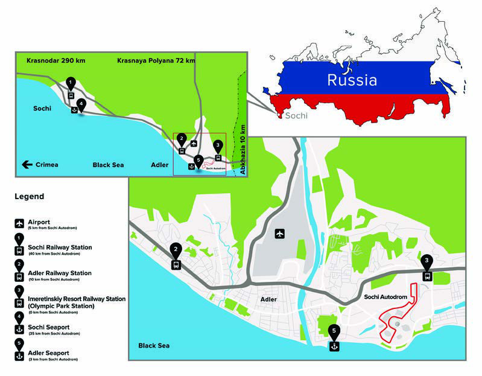

96

SOCHI TRAVEL GUIDE

TRANSPORT SYSTEM

RAILWAY TRANSPORT The easiest and the fastest way to get to Sochi Autodrom is by train. Commuter trains go to the Imeretinskiy Kurort railway stop (Olympic Park Train Station) which is located in front of the venue entrance group.

Over the period from 27 September to 30 September 2018, turnstile lines within Sochi at the Sochi, Matsesta, Khosta, Adler, Imeretinskiy Kurort railway stops will be open, with passengers travelling in commuter trains on a fare basis in accordance with the established rates and the current legislation.

Commuter trains will have the following routes: - Sochi - Airport - Sochi; - Sochi - Imeretinskiy Kurort (Olympic Park) - Sochi; - Sochi - Rosa Khutor - Sochi; - Airport - Rosa Khutor - Airport; - Rosa Khutor - Imeretinskiy Kurort (Olympic Park) - Rosa Khutor; - Airport - Imeretinskiy Kurort (Olympic Park) - Airport (28 and 29 September 2018); - Tuapse – Sochi - Tuapse; - Lazarevskoye - Sochi - Lazarevskoye; - Goryachiy Klyuch - Sochi - Goryachiy Klyuch. For more information about the arrival and departure of trains, please visit http://pass.rzd.ru/.

PUBLIC BUSES

During the FORMULA 1 2018 VTB RUSSIAN GRAND PRIX, 6 public bus routes will be used near the Olympic Park: - Route No. 57 “Adler Railway Station - KITS Nekrasovskoye Bus Stop” - Route No. 57k “Sochi Airport - Sovkhoz Rossiya - Olympic Park Railway Station” - Route No.124с “Sochi Railway Station - Olympic Park Railway Station - KITS Nekrasovskoye Bus Stop - Veseloye Village” - Route No.125с “MoreMoll Shopping Centre - Sochi Railway Station - Adler Railway Station - Sovkhoz Rossiya - Olympic Park Railway Station” - No. 125 “MoreMoll Shopping Centre - Sochi Railway Station - Khosta - Kudepsta - Adler (Shopping Centre Bus Stop) - Veseloye Vilage - Sovkhoz Rossiya” - No. 135/135k “Noviy Vek Shopping Centre - Olympic Park Railway Station - Lenina Street - Sochi Airport - Moldovka Village - Krasnaya Polyana – Esto Sadok Village - Laura Alpine Resort - Rosa Khutor Alpine Resort”.

Urban and suburban public buses No. 57, No. 57k, No. 124c, No. 125, No. 125c and No. 135/135k can be tracked in real time on the website of Sochi’s Department of Transport and Road Administration http://transport.sochi.ru/ and in the mobile app for Android or iOS Sochi.Transport

97

SOCHI TRAVEL GUIDE

During the FORMULA 1 2018 VTB RUSSIAN GRAND PRIX from 27 to 30 September 2018, there will be free shuttles FS1 “Sochi Autodrom – Imeretinskaya Lowland Western Part” and FS2 “Sochi Autodrom – Imeretinskaya Lowland Eastern Part”.

PUBLIC TRANSPORT MAP FOR THE RUSSIAN GRAND PRIX

98

SOCHI TRAVEL GUIDE

HOW TO GET TO THE VENUE

TAXI

The taxi pick-up/drop-off area will be located on the Imeretinskiy Kurort bus platform. Access to taxis will be provided via VPCs subject to being in possession of special permits.

Telephone for booking: 8 988 956 2018 (English speaking operator)

Approximate rates:

Sochi Airport – Sochi Autodrom RUB350-400

Sochi Airport – Krasnaya Polyana RUB1200-1500

Sochi Airport – Adler Railway Station RUB350-450

Sochi Airport – Sochi Railway Station RUB900-1200

Sochi Autodrom – Skypark RUB500-700

Sochi Autodrom – Krasnaya Polyana RUB1500-1600

Sochi Autodrom – Adler Railway Station RUB350-400

Sochi Autodrom – Sochi Railway Station RUB1100-1300

PERSONAL VEHICLES

There will be 4 paid car parks available to the FORMULA 1 2018 VTB RUSSIAN GRAND PRIX guests arriving in their personal vehicles, the access to these will be granted only subject to being in possession of a special permit bought in advance at www.sochiautodrom.ru:

- P6 car park, along Chempionov Street at the juncture with Mezhdunarodnaya Street;

- P7 car park, along Mezhdunarodnaya Street near the Ferris wheel;

- P8 car park, along Olympiyskiy Prospekt opposite the Fisht Stadium;

- P14 car park, near the Shayba Arena.

99

SOCHI TRAVEL GUIDE

ROAD TRAFFIC RESTRICTIONS AROUND SOCHI AUTODROM

Over the period from 07:00 on 27/09/2018 to 23:00 on 30/09/2018, in the following road sections in the area adjacent to the circuit the traffic is to be restricted for those vehicles that do not have relevant access permits, including taxis and public transport, using VPCs:

- in Triumfalnaya Street in front of the permanent VSA; - access to the Imeretinskiy Kurort railway stop from Chempionov Street; - in Triumfalnaya Street in front of the Tulip Inn hotel; - access to the Imeretinskiy Kurort railway stop from Kazachiya Street and Triumfalniy Proezd.

Traffic will be restricted in order to prevent vehicles accessing the operation areas adjacent to the circuit from 07:00 on 27/09/2018 to 23:00 on 30/09/2018, in the following areas:

- exit from Zhurnalistov Street into Triumfalnaya Street; - exit from Starookhotnichiya Street into Triumfalnaya Street; - exit from Perelyotnaya Street into Triumfalnaya Street.

100

SOCHI TRAVEL GUIDE

SOCHI. FACTS

Sochi is the largest resort city in Russia. It stretches along the Black Sea coast about 1,600 km (995 miles) south of Moscow. The Greater Sochi area includes four administrative districts: the Central District of Sochi, Lazarevsky District, Khosta District and Adler District.

Sochi belongs to that tiny part of Russia, which is located in the subtropical climatic zone. This fact makes the city an ideal place to visit all year round.

The Greater Sochi occupies 145 km of the Black Sea coast. Its total territory is 3,500 km². However, the majority of the population lives on a narrow coastal line, while the mountainous area (1,900 km²) mainly belongs to the Sochi National Park and partly to the Caucasian Biosphere Reserve.

Sochi is often unofficially called the Russian “summer capital” or “Black Sea pearl”. Sochi is the biggest and the most visited sea resort in Russia, which attracts more than four million people every year with its picturesque coastline, well-equipped pebble beaches, warm sunny days and lively nightlife. From May to September, the population of Sochi at least doubles. The celebrities and political elite of the country come here for a holiday.

SIGHTS

Sochi Arboretum Tel.: +7(953)109-34-49 Address: 74/1 Kurortniy Prospekt, Sochi

The ticket offices of the park are open from 08:00 to 19:00, 7 days a week, without breaks. The exhibition hall of the Greenhouse is open from 10:00 to 17:00. Lunch break from 12:00 to 13:00. Closed: Monday, Friday.

The flower pavilion between the Main Entrance (Rotunda) and the service entrance is open from 10:00 to 18:00, 7 days a week, without breaks.

Arboretum Admission Tiket for adults: RUB250

Yuzhniye Kultury Arboretum is open from 09:00 to 18:00. Address: 13/3B, Nagorniy Tupik, Adler District, Sochi

Adult Ticket Price: RUB250

101

SOCHI TRAVEL GUIDE

Riviera Park Tel.: 8 (800) 770-07-23 1 Egorova St., Sochi

Opening Hours: 11:00 to 20:00. Admission: free

Akhun Mountain

Observation Deck Opening Hours: 10:00 until nightfall.

Ticket Price Observation Deck (Tower): RUB100 Observation Wheel: RUB250

Skypark AJ Hackett Tel.: 8 800 100 4 207 Krasnoflotskaya St., Kazachiy Brod, Sochi

Opening Hours: 10:00 to 18:45, 7 days a week Skypark Addmission Ticket Price: RUB1,250. The price includes a single entry to Skypark and an unlimited number of walks along the suspension bridge.

Rosa Khutor Resort Tel.: 8 (800) 500-05-55 35 Olimpiyskaya St., Esto Sadok, Sochi

Opening Hours: 09:30 to 23:00, 7 days a week

Cable Car Ride: from RUB850 (for adults).

Sochi Park Amusement Park Tel.: 8 800 100 33 39 21 Olimpiyskiy Prospect, Imeretinskaya Lowland, Adler District, Sochi

Opening Hours: 11:00 to 22:00, 7 days a week

Ticket Price: RUB1,650.

102

SOCHI TRAVEL GUIDE

RESTAURANTS AND CAFES

NIZHNEIMERETINSKAYA BAY (OLYMPIC PARK) AND ADLER

LA LUNA PIZZAFISHT RESTAURANT 1 Tavricheskaya St. 17 Parusnaya St. +7 928 459-22-29 +7 (928) 233-27-22

MARE D’AMORE RESTAURANT THAIPEI RESTAURANT 36 Nizhneimeretinskaya St. 9 Parusnaya St. +7 988 235 70-13 +7 (938) 888-12-36

BAIKAL RES‑TAURANT NIPPON HOUSE 2/а Olympiyskiy Prospekt 26 Kirova St., Adler +7 928 450-20-52 +7 (862) 240-35-26 MAGELLAN RESTAURANT MCDONALDS ADLER 18А Uritskogo St. Bestuzheva St., Adler +7 938 441 11-44 opposite the Mandarin Shopping Centre VYSOTA 56‑42 RESTAURANT KHMELI SUNELI RESTAURANT 50 65 Let Pobedy St. 52 Demokraticheskaya St., Noviy Vek +7 928 445 56-42 Shopping Centre, 3 floor, Adler LA PUNTO G‑ ASTROPUB +7 938 888-88-37 2/1 Mezhdunarodnaya St. +7 988 234-64-44 ROYAL FISH Bestuzheva Alley, opposite the Mandarin PARUS RESTAURANT Shopping Centre, Adler 7 Parusnaya St. +79284589988 +7 (8622) 60 82 36 MANDARIN SHOPPING CENTRE RESTAURANTS O'SULLIVAN'S IRISH PUB AND CAFES 69 65 Let Pobedy St., Sochi 1/1 Bestuzheva St., Adler +7 928 667-73-77 Tel.: +7 862 240 17 24 mandarin-mall.com/cafe

103

SOCHI TRAVEL GUIDE

RESTAURANTS AND CAFES

SOCHI. CENTRAL PART

D.O.M RESTAURANT TRATTORIA FETTUCCINE 1А Nesebrskaya St. 11 Teatralnaya St., Sochi +7 862 220 01-11 +7 862 225-50-25

BARCELON‑ETA RESTAURANT STEAK HOUSE SYNDICATE RESTAURANT 6 Nesebrskaya St. 6 Ordzhonikidze St. +7 862 220 01-11 +7 988 237-00-10

BARAN-RA‑PAN RESTAURANT YAPONA MAMA SUSHI BAR 11 Teatralnaya St. 25 Ordzhonikidze St. +7 862 225 50-25 +7 988 233-41-11

PLAKUCHA‑YA IVA RESTAURANT KOFEMANIA RESTAURANT 3 Voykova St. 1 Voykova St., Seaport Building +7 968 300 55-99 +7 862 241-81-64

FRAU MART‑A KHMELI SUNELI 2 Sovetskaya St. 57 Roz St. +7 (8622) 33 72 72 +7 862 235-51-11

KRASNAYA POLYANA, ESTO SADOK VILLAGE

SOCHI CASINO & RESORT RED FOX RESTAURANT BRUNELLO RESTAURANT 3 Lavandy Embankment 51 Estonskaya St., Esto Sadok +7 862 274 44-44 8 800 444-07-77 ‑

104

SOCHI TRAVEL GUIDE

SHOPPING / CURRENCY

NIZHNEIMERETINSKAYA BAY (OLYMPIC PARK) AND ADLER

Noviy Vek Shopping Centre Mandarin Shopping Centre 52 Demokraticheskaya St., 1/1 Bestuzheva St., Adler District, Sochi Adler District, Sochi www.nv-adler.ru www.mandarin-mall.ru

City Plaza Shopping Centre Kayros 24/7 52 Kirova St., Biggest retail chain. 40 shops, located all Adler District, Sochi around the city. http://www.sochi-cityplaza.ru/

SOCHI. CENTRAL PART

Aleksandria More Moll 28 Transportnaya St., Sochi 22 Moskovskaya St., Centre Popula brands, restaurants and cinema

Melodiya Olimp 16 Kurortniy Prospekt, Centre Transportnaya St., Sochi Shopping Centre Shopping centre, cinema, restaurants

Kayros 24/7 Biggest retail chain. 40 shops, located all around the city.

CURRENCY

Russian rouble (RUB) is the only official currency in Russia. You can exchange currency in banks if you have your passport with you. ATMs are located all around Sochi and Adler. You can pay only by Visa or Mastercard (American Express is not accepted).

105

SOCHI TRAVEL GUIDE

CAR RENTAL / TAXI

CAR RENTAL

Sochi Thrifty Tksochi +7 (8622) 95 93 93 +7 (8622) 62 07 27 www.sochi.thrifty.ru www.tksochi.ru

Naprokat.ru Sixt / ATON / Rentacar Sochi International Airport 1 Aerovokzalniy Pereulok +7 (8622) 96-0020 +7 (8622) 357 100 +7 (8622) 960-331 10:00-22:00 daily 09:00-21:00 daily zakaz@at-on.ru zakaz@naprokat.ru Avis Rossa Sochi International Airport +7 928 848 15 51 1) Zhemchuzhina Hotel (3 Chernomorskaya St.) Sochi@avis-rentacar.ru 2) Adler (18 Bestuzheva St.) Hertz +7 (8622) 955-497 Sochi International Airport +7 918 905 59 77 +7-800-333-9192 info@pocca.ru booking@hertz.ru

TAXI

Vezet Red 8 862 244-44-44 8 918 190 0000

VIP Taxi Argo +7-918-618-08-88, 8 862 261 1111, 8 862 295 6666 +7-964-943-44-64 8 862 233 3800

Yandex Taxi Uber Gett (GetTaxi) Wheely

106

SOCHI TRAVEL GUIDE

STATION/ AIRPORT / AIRLINES

STATION

Sochi Railway Station 56 Gorkogo St., Sochi + 7 862 260 9009 www.pass.rzd.ru

AIROPORT

Sochi International Airport 8 800 333 1991 8 862 240 0088 www.basel.aero

AIRLINES

Aeroflot S7 www.aeroflot.ru www.s7.ru 8 862 264 4511 8 862 264 2064

Utair Rossiya www.utair.ru www.rossiya-airlines.ru 8 862 241 1299 8 862 249 7554

Ural Airlines VIM-Avia www.uralairlines.ru www.vim-avia.com 8 862 240 0088 8 862 240 3334 8 918 907 7902

107

SOCHI TRAVEL GUIDE

EMERGENCY SERVICES

MAIN NUMBERS

From landline phones From mobile phones

SINGLE EMERGENCY SERVICES NUMBER SINGLE EMERGENCY SERVICES NUMBER 112 112

FIRE FIRE 01 101

POLICE POLICE 02 102

AMBULANCE AMBULANCE 03 103

108
