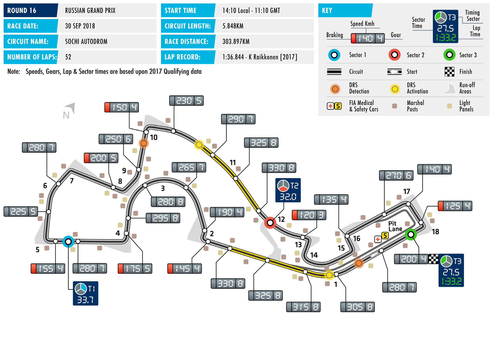
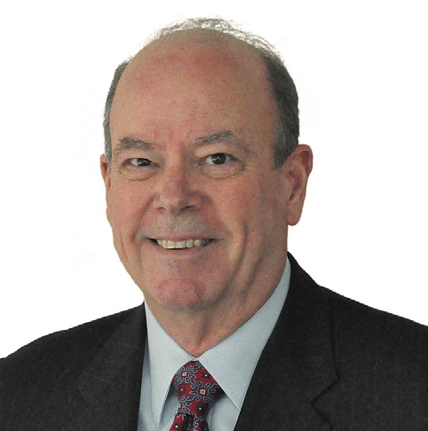

2018 RUSSIAN GRAND PRIX

28 – 30 September 2018

This week, teams and drivers head to the Sochi Autodrom for SOCHI AUTODROM

Round 16 of the 2018 FIA Formula One World Championship: Length of lap: 5.848km the Russian Grand Prix. Lap record: After examining the opposing ends of the speed spectrum in 1:36.844 (Kimi Räikkönen, Ferrari,

Monza and Singapore, Sochi represents something of a return to 2017)

the middle ground for F1. The key characteristic of the circuit is the Start line/finish line offset: 0.199km proliferation of 90°, medium-speed corners. Despite several bumps Total number of race laps: appearing over the last couple of years, Sochi remains a smooth 53 circuit and has relatively flat kerbs. This will encourage teams to Total race distance: run their cars very stiff, potentially raising rear ride-height to help 309.745km

with turn-in. Pitlane speed limits: 60km/h in practice, qualifying, The straights in Sochi are relatively long, which raises questions and the race. regarding downforce levels. More downforce makes the car more

predictable and easier to position accurately in the corners – but at CIRCUIT NOTES the cost of lower speed on the straights. ► The track has been resurfaced on the approach to Turns 1 and 8. A Sochi’s reputation as a circuit with extremely low degradation is section of the pit entry has also underlined in the tyre choices available for the race. As was the been resurfaced. case in Singapore, Pirelli are bringing the soft compound but then DRS ZONES bridge to the ultrasoft and hypersoft. All drivers have strongly

favoured the softest end of the range, choosing between seven ► The first of two DRS zones has its and 10 sets of the ultrasoft. The yellow-banded soft tyre – the detection point 72m after Turn 18. Activation is 95m before Turn hardest compound on offer – has not been popular. Fernando 1. Zone Two’s detection is 72m Alonso is an outlier with three sets; everybody else has either one before T10, with activation 203m or two. after the corner.

Back-to-back victories in Italy and Singapore have lifted Lewis

Hamilton into prime position to retain his Drivers’ title. The

Mercedes driver has a 40-point advantage over Ferrari’s

Sebastian Vettel with six races remaining. Things are tighter in the

Constructors’ Championship battle with Mercedes ahead by only

37 points, and every indication suggests that F1’s two top teams

are very closely matched for the run-in.

FAST FACTS

► This is the fifth FIA Formula One World while leading every lap of the race. It was are the only drivers to score in every race Championship Russian Grand Prix. The the first time Rosberg had achieved a so- and Ericsson is the only one not to score race appeared on the calendar in 2014 called ‘grand chelem’, though he would at any. Fernando Alonso has qualified for and each race has been held at the Sochi do it again seven weeks later in Baku. His each race but retired on the formation Autodrom. is the only such performance recorded in lap last year with an ERS failure. Sochi. ► Mercedes have a clean sweep of victories ► Underlining the reputation of the Russian – albeit with three different drivers. Lewis ► Mercedes have taken half the podium Grand Prix as a one-stop race, only four Hamilton won the race in 2014 and 2015, spots available at this race. In addition from 40 points scorers have done so Nico Rosberg took victory in 2016 and to their four wins, the Brackley-based making two stops, and no two-stopper Valtteri Bottas won last year. team took second place in 2014 with has finished higher than fifth. . Rosberg and 2016 with Hamilton. Ferrari ► Mercedes have taken three of the four have four podiums, with Vettel second in ► Of the four drivers starting their first F1 pole positions in Russia to date. Hamilton 2015 and 2017, and Räikkönen third in race at the Sochi Autodrom this weekend, was on pole for the inaugural event in 2016 and 2017. The two other podiums Sergey Sirotkin is the most familiar with 2014, and Rosberg had back-to-back have both gone to Mercedes-powered the circuit. The Russian has been a test poles in 2015 and 2016. Sebastian Vettel teams: Williams took third place in 2014 driver in Friday practice three times, broke the chain last year, starting from P1 with Bottas, while Force India was third in appearing for Sauber in 2014 and Renault for Ferrari. The race was won from pole 2015 courtesy of Sergio Pérez. Hamilton’s in 2016 and 2017 – albeit failing to set position in 2014 and 2016, from second second place in 2016 came from P10 on a time last year. He has also raced here in 2015 and from third on the grid in the grid – the furthest back from which in GP2, in 2015, finishing fourth in the 2017. a driver finishing on the podium has feature race. Pierre Gasly raced in GP2 in started. 2014 and 2015, finishing second in 2015.

► Ferrari have two of the four fastest laps at Brendon Hartley and Charles Leclerc are this circuit, thanks to Vettel in 2015 and ► Nine of the current field have contested making their Sochi debuts. Kimi Räikkönen last year. Bottas set the every Russian Grand Prix: they are Bottas; fastest lap at the inaugural race, driving Marcus Ericsson; Romain Grosjean; ► In 2014 and 2015, Mercedes secured for Williams, and Rosberg did so in 2016, Hamilton; Nico Hülkenberg; Pérez; the Constructors’ Championship title in as part of a dominant performance that Räikkönen; Daniel Ricciardo and Vettel. Russia. The race subsequently moved to saw him take pole, victory and fastest lap Of these, Hamilton, Räikkönen and Pérez an early-season slot.

RACE STEWARDS BIOGRAPHIES

GARRY CONNELLY

DIRECTOR, GLOBAL INSTITUTE FOR MOTOR SPORT SAFETY; DIRECTOR, AUSTRALIAN INSTITUTE OF MOTOR SPORT SAFETY; F1 STEWARD; FIA WORLD MOTOR SPORT COUNCIL MEMBER

Garry Connelly has been involved in motor sport since the late 1960s. A long- time rally competitor, Connelly was instrumental in bringing the World Rally Championship to Australia in 1988 and served as Chairman of the Organising Committee, Board member and Clerk of Course of Rally Australia until December 2002. He has been an FIA Steward and FIA Observer since 1989, covering the FIA’s World Rally Championship, World Touring Car Championship and Formula One Championship. He is chairmanof the Australian Institute of Motor Sport Safety and director of the Global Institute for Motor Sport Safety and the Australian Road Safety Foundation. He is a member of the FIA World Motor Sport Council.

DENNIS DEAN

FIA WORLD MOTOR SPORT COUNTIL MEMBER; MEMBER, INTERNATIONAL SPORTING CODE REVIEW COMMISSION; F2, FORMULA E STEWARD

Dennis Dean has been involved in motor sport since becoming a scrutineer with the Sports Car Club of America (SCCA) in the late 1970s. He has served at national level as a scrutineer, steward, and race director, including 10 years as either assistant chief steward or chief steward (race director) of the SCCA’s National Championship Runoffs. He has scrutineered at 10 US Formula One races, in Las Vegas, Indianapolis and Austin. He was also vice president of Club Racing and Rally/Solo for SCCA. He currently serves as a member of both the FIA’s International Sporting Code Review Commission..

EMANUELE PIRRO

FORMER FORMULA ONE DRIVER AND FIVE-TIMES LE MANS WINNER. MEMBER OF THE FIA DRIVERS’ COMMISSION

During a motor sport career spanning almost 40 years, Emanuele Pirro has achieved a huge amount of success, most notably in sportscar racing, with five Le Mans wins, victory at the Daytona 24 Hours and two wins at the Sebring 12 Hours. In addition, the Italian driver has won the German and Italian Touring Car championships (the latter twice) and has twice been American Le Mans Series Champion. Pirro, enjoyed a three-season F1 career from 1989 to 1991, firstly with Benetton and then for Scuderia Italia. His debut as an FIA Steward came at the 2010 Abu Dhabi Grand Prix and he has returned regularly since.

2018 FIA Formula One World Championship

DRIVERS’ CHAMPIONSHIP STANDINGS

NAJIABREZA AILARTSUA EROPAGNIS IBAHD YNAMREG YRAGNUH STNIOP NIARHAB OCANOM ADANAC AIRTSUA MUIGLEB ECNARF OCIXEM ANIHC AISSUR NAPAJ LIZARB NIAPS YLATI ASU UBA BG

| 18 2 | 15 3 | 12 4 | 25 1 | 25 1 | 15 3 | 10 5 | 25 1 | NC | 18 2 | 25 1 | 25 1 | 18 2 | 25 1 | 25 1 |
| --- | --- | --- | --- | --- | --- | --- | --- | --- | --- | --- | --- | --- | --- | --- |
| 25 1 | 25 1 | 4 8 | 12 4 | 12 4 | 18 2 | 25 1 | 10 5 | 15 3 | 25 1 | NC | 18 2 | 25 1 | 12 4 | 15 3 |
| 15 3 | NC | 15 3 | 18 2 | NC | 12 4 | 8 6 | 15 3 | 18 2 | 15 3 | 15 3 | 15 3 | NC | 18 2 | 10 5 |
| 4 8 | 18 2 | 18 2 | 14 | 18 2 | 10 5 | 18 2 | 6 7 | NC | 12 4 | 18 2 | 10 5 | 12 4 | 15 3 | 12 4 |
| 8 6 | NC | 10 5 | NC | 15 3 | 2 9 | 15 3 | 18 2 | 25 1 | 15 | 12 4 | NC | 15 3 | 10 5 | 18 2 |
| 12 4 | NC | 25 1 | NC | 10 5 | 25 1 | 12 4 | 12 4 | NC | 10 5 | NC | 12 4 | NC | NC | 8 6 |
| 6 7 | 8 6 | 8 6 | NC | NC | 4 8 | 6 7 | 2 9 | NC | 8 6 | 10 5 | 12 | NC | 13 | 1 10 |
| 10 5 | 6 7 | 6 7 | 6 7 | 4 8 | NC | NC | 16 | 4 8 | 4 8 | 16 | 4 8 | NC | NC | 6 7 |
| NC | 10 5 | 1 10 | 13 | 8 6 | 13 | 13 | 8 6 | 10 5 | 2 9 | 11 | 6 7 | 4 8 | 16 | 18 |
| 11 | 16 | 12 | 15 3 | 2 9 | 12 | 14 | NC | 6 7 | 1 10 | 6 7 | 14 | 10 5 | 6 7 | 16 |
| 12 | 1 10 | 11 | NC | NC | 8 6 | 2 9 | NC | 8 6 | 6 7 | 4 8 | 13 | 8 6 | 8 6 | NC |
| 1 10 | 11 | 2 9 | 10 5 | 6 7 | 1 10 | 4 8 | 4 8 | 12 | NC | 12 | 2 9 | 11 | 4 8 | 4 8 |
| NC | 12 4 | 18 | 12 | NC | 6 7 | 11 | NC | 11 | 13 | 14 | 8 6 | 2 9 | 14 | 13 |
| NC | 13 | 17 | NC | NC | 15 | 12 | 11 | 12 4 | NC | 8 6 | 1 10 | 6 7 | DQ | 15 |
| 13 | 12 | 19 | 8 6 | 1 10 | 18 | 1 10 | 1 10 | 2 9 | NC | 15 | NC | NC | 11 | 2 9 |
| 2 9 | 4 8 | 13 | 2 9 | NC | 14 | 16 | 12 | 15 | 11 | 13 | NC | 15 | 12 | 12 |
| 14 | 14 | 14 | 4 8 | 11 | 17 | NC | 17 | 14 | 12 | NC | 17 | 13 | 2 9 | 14 |
| NC | 2 9 | 16 | 11 | 13 | 11 | 15 | 13 | 1 10 | NC | 2 9 | 15 | 1 10 | 15 | 11 |
| 15 | 17 | 20 | 1 10 | 12 | 19 | NC | 14 | NC | NC | 1 10 | 11 | 14 | NC | 17 |
| NC | 15 | 15 | NC | 14 | 16 | 17 | 15 | 13 | 14 | NC | 16 | 12 | 1 10 | 19 |

1 L. HAMILTON 281

2 S. VETTEL 241

3 K. RÄIKKÖNEN 174

4 V. BOTTAS 171

5 M. VERSTAPPEN 148

6 D. RICCIARDO 126

7 N. HÜLKENBERG 53

8 F. ALONSO 50

9 K. MAGNUSSEN 49

10 S. PÉREZ 46

11 E. OCON 45

12 C. SAINZ 38

13 P. GASLY 28

14 R. GROSJEAN 27

15 C. LECLERC 15

16 S. VANDOORNE 8

17 L. STROLL 6

18 M. ERICSSON 6

B. HARTLEY 2 19

S. SIROTKIN 1 20

2018 FIA Formula One World Championship

CONSTRUCTORS’ CHAMPIONSHIP STANDINGS

NAJIABREZA AILARTSUA EROPAGNIS IBAHD YNAMREG YRAGNUH STNIOP NIARHAB OCANOM ADANAC AIRTSUA MUIGLEB ECNARF OCIXEM ANIHC AISSUR NAPAJ LIZARB NIAPS YLATI ASU UBA BG

| 22 2 8 | 33 2 3 | 30 2 4 | 25 1 13 | 43 1 2 | 25 3 5 | 28 2 5 | 31 1 7 | NC NC | 30 2 4 | 43 1 2 | 35 1 5 | 30 2 4 | 40 1 3 | 37 14 |
| --- | --- | --- | --- | --- | --- | --- | --- | --- | --- | --- | --- | --- | --- | --- |
| 40 1 3 | 25 1 NC | 19 3 8 | 30 2 4 | 12 4 NC | 30 2 4 | 33 1 6 | 25 3 5 | 33 2 3 | 40 1 3 | 15 3 NC | 33 2 3 | 25 1 NC | 30 2 4 | 25 35 |
| 20 4 6 | NC NC | 35 1 5 | NC NC | 25 15 10 | 27 1 9 | 27 3 4 | 30 2 4 | 25 1 NC | 10 5 NC | 12 4 NC | 12 4 NC | 15 3 NC | 10 5 NC | 26 26 |
| 7 7 10 | 8 6 11 | 10 6 9 | 10 5 NC | 6 7 NC | 5 8 10 | 10 7 8 | 6 8 9 | NC NC | 8 6 NC | 10 5 12 | 2 9 12 | 11 NC | 4 8 13 | 5 8 10 |
| NC NC | 10 5 13 | 1 10 17 | 13 NC | 8 6 NC | 13 15 | 12 13 | 8 6 11 | 22 4 5 | 2 9 NC | 8 6 11 | 7 7 10 | 10 7 8 | 16 DQ | 15 18 |
| 12 5 9 | 10 7 8 | 6 7 13 | 8 7 9 | 4 8 NC | 14 NC | 16 NC | 12 16 | 4 8 15 | 4 8 11 | 13 16 | 4 8 NC | 15 NC | 12 NC | 6 7 12 |
|  |  |  |  |  |  |  |  |  |  |  |  | 18 5 6 | 14 6 7 | 16 NC |
| 15 NC | 12 4 17 | 18 20 | 1 10 12 | 12 NC | 6 7 19 | 11 NC | 14 NC | 11 NC | 13 NC | 1 10 14 | 8 6 11 | 2 9 14 | 14 NC | 13 17 |
| 13 NC | 2 9 12 | 16 19 | 8 6 11 | 1 10 13 | 11 18 | 1 10 15 | 1 10 13 | 3 9 10 | NC NC | 2 9 15 | 15 NC | 1 10 NC | 11 15 | 2 9 11 |
| 14 NC | 14 15 | 14 15 | 4 8 NC | 11 14 | 16 17 | 17 NC | 15 17 | 13 14 | 12 14 | NC NC | 16 17 | 12 13 | 3 9 10 | 14 19 |
| 11 12 | 10 16 | 11 12 | 3 NC | 9 NC | 6 12 | 9 14 | NC NC | 6 7 | 7 10 | 7 8 | 13 14 |  |  |  |

1 MERCEDES AMG 452 PETRONAS MOTORSPORT

415 2 SCUDERIA FERRARI

3 ASTON MARTIN 274 RED BULL RACING

RENAULT SPORT 91 4 FORMULA ONE TEAM

76 5 HAAS F1 TEAM

58 6 MCLAREN F1 TEAM

RACING POINT 32 7 FORCE INDIA F1TEAM

RED BULL 30 8 TORO ROSSO HONDA

ALFA ROMEO 21 9 SAUBER F1 TEAM

WILLIAMS MARTINI 7 10 RACING

SAHARA FORCE INDIA 0 EX F1 TEAM

FORMULA ONE TIMETABLE & FIA MEDIA SCHEDULE

THURSDAY

Press conference 1500

FRIDAY

Practice session 1 1100-1230 Press conference 1300

Practice session 2 1500-1630

SATURDAY

Practice session 3 1200-1300 Qualifying 1500-1600 Followed by track interviews, press conference

SUNDAY

Drivers’ Parade 1230 Race 1410 Followed by parc fermé interviews and press conference

ADDITIONAL MEDIA OPPORTUNITIES

QUALIFYING

All drivers eliminated in Q1 or Q2 will be available for media interviews after the end of each session, as will drivers who participated in Q3, but who are not required for the post-qualifying press conference. The TV Pen is located in the paddock, in front of the FIA garages.

RACE

Any driver retiring before the end of the race will be made available at the TV pen interview area. In addition, during the race every team will make available at least one senior spokesperson for interview by officially accredited TV crews. A list of those nominated will be made available in the media centre.

FIA COMMUNICATIONS DEPARTMENT press@fia.com T +33 1 43 12 58 15
