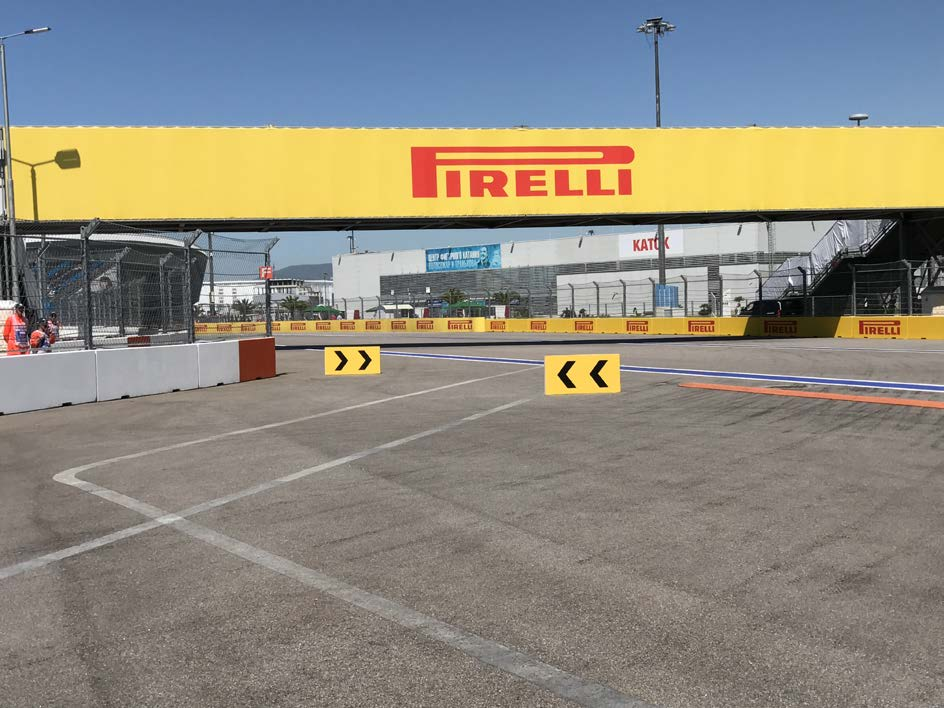
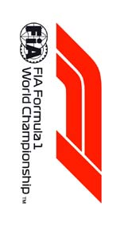
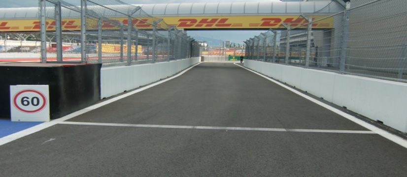
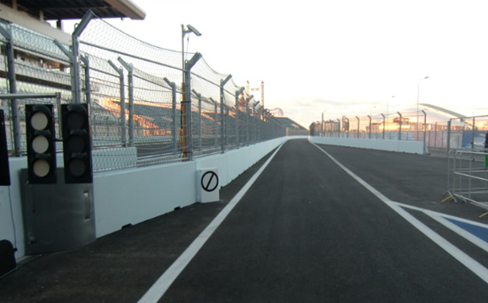

2018 RUSSIAN GRAND PRIX

27 - 30 September 2018

From The FIA Formula One Race Director Document 2

To All Teams, All Officials Date 27 September 2018

Time 09:00

Title Event Notes

Description Event Notes

Enclosed 2018_09_27_RUSSIAN_GP_EVENT_NOTES_v1.pdf

Charlie Whiting

The FIA Formula One Race Director

2018 RUSSIAN GRAND PRIX

27-30 SEPTEMBER 2018

From The FIA Formula One Race Director Document 2

To Formula One Team Managers Date 27 September 2018

Time 09.00

EVENT NOTES

27 SEPTEMBER 2018

1) Matters arising from the Singapore Grand Prix

2) Changes to the circuit

2.1 The track has been resurfaced on the approach to turns 1 and 8 as well as a section in the pit entry.

2.2 Other than the resurfacing only routine maintenance has been carried out.

3) Pit lane map

3.1 Safety Car lines.

3.2 The location of the pit entry and the pit exit.

3.3 Designated garage areas.

3.4 Safety Car position for first lap and rest of race.

3.5 Blue flag marshal at the pit exit.

3.6 Track light panel displaying pit entry status.

4) Pirelli Event Preview

4.1 With reference to Article 24.4(a) of the Sporting Regulations see the attached document provided by the official tyre supplier.

5) Weighing and weighing platform

5.1 Between 11.00 and 13.30 on Thursday, and by prior arrangement with Jo Bauer, the weighing platform will be available for teams to use for private deflection checks.

1/6

5.2 The weighing platform will be available for general checks at the following times, however, no more than 10 team personnel may be present during any visit. Each visit should last no more than 10 minutes unless no other team is waiting in the pit lane :

a) From 13.30 on Thursday until 14.30 on Saturday (between 13.00 and 14.30 each visit will be restricted to five minutes).

b) From when the cars are returned to the teams after qualifying until 19.30 on Saturday.

c) From 10.00 until 14.00 on Sunday.

Any team found to be abusing the time limits set out above, which we will be enforced by FIA security personnel and our own CCTV, will not be permitted to use the weighbridge again during the Event.

5.3 Cars should not be pushed to the weighing platform whilst any support race cars or personnel are in the pit lane.

6) Red zones for photographers in the pit lane during sessions

6.1 See the attached drawing.

7) Practice starts

7.1 Practice starts may only be carried out at the pit exit on the right hand side and, for the avoidance of doubt, this includes any time the pit exit is open for the race.

Drivers must leave adequate room on their left for another driver to pass.

7.3 For reasons of safety and sporting equity, cars may not stop in the fast lane at any time the pit exit is open without a justifiable reason (a practice start is not considered a justifiable reason).

8) Lines and bollards at the pit entry and pit exit

8.1 As set out in Chapter 4, Section 5 of Appendix L, drivers must keep to the right of the solid white line at the pit exit when leaving the pits, no part of any car leaving the pits may cross this line.

8.2 For safety reasons drivers must stay to the right of the bollard at the pit entry.

8.3 The line separating the pit entry from the track (see Chapter 4, Section 4(d) of Appendix L) is considered to be the white line on the left hand edge of the pit entry. A car will be deemed to have crossed this line if all four wheels are to the left of it.

8.4 The dotted white lines across the pit exit and before the pit entry are the track edges.

9) Run-off area around turn 2

9.1 Any driver who fails to negotiate turn 2 by using the track, and who passes completely to the left of the orange kerb element on the apex, must then re-join the track by driving between the two orange polystyrene blocks, drivers are reminded that having left the track they must re-join safely. See the photo on page 7.

10) Stopping on the circuit

10.1 As recovery from the outer service road is very time consuming we suggest that if one of your drivers has to stop on the track he should pull to the inside (his right) if possible.

2/6

11) Observing yellow flags during free practice and qualifying

11.1 Double waved : Any driver passing through a double waved yellow marshalling sector must reduce speed significantly and be prepared to change direction or stop. In order for the stewards to be satisfied that any such driver has complied with these requirements it must be clear that he has not attempted to set a meaningful lap time, for practical purposes this means the driver should abandon the lap (this does not necessarily mean he has to pit as the track could well be clear the following lap).

11.2 Single waved : Drivers should reduce their speed and be prepared to change direction. It must be clear that a driver has reduced speed and, in order for this to be clear, a driver would be expected to have braked earlier and/or discernibly reduced speed in the relevant marshalling sector.

Drivers should not overtake any car in a single waved yellow marshalling sector unless it is clear that a car is slowing with a completely obvious problem, e.g. obvious accident damage or a deflated tyre.

12) Turns 12 and 13

12.1 Any driver intending to create a gap in front of him in order to get a clear lap should not attempt do this around turns 12 or 13. Any driver seen to have done this will be reported to the stewards as being in breach of Article 27.4 (“At no time may a car be driven unnecessarily slowly, erratically or in a manner which could be deemed potentially dangerous to other drivers or any other person").

13) Track light panels

13.1 The FIA track light panels have been installed in the positions shown on the circuit map. In accordance with Appendix H to the ISC the light signals have the same meaning as flag signals.

14) Drivers leaving their pit stop position in the pit lane

14.1 For safety reasons, no car should be driven from its pit stop position at any time unless :

a) It has first been driven into the pit stop position having just entered the pit lane from the track, and ;

b) It is then driven immediately back onto the track from the pit stop position.

15) Fire extinguishers around the circuit

15.1 Indicated by small fluorescent orange boards with a white letter ‘F’, these are attached to the debris fences.

16) Places to remove cars from the track

16.1 Indicated by fluorescent orange panels on the walls or guardrails.

17) Places where drivers may leave the track

17.1 Indicated by fluorescent orange panels on the walls or guardrails, these panels are half the size of those which are used where a car can be removed.

18) Support races

18.1 Teams are asked to keep their barriers no more than three metres from the garages during the support race sessions and races.

3/6

19) In laps and reconnaissance laps

19.1 In order to ensure that cars are not driven unnecessarily slowly on in laps during and after the end of qualifying or during reconnaissance laps when the pit exit is opened for the race, drivers must stay below the maximum time set by the FIA between the Safety Car lines shown on the pit lane map.

We will inform you of the maximum time after the first day of practice.

20) Post qualifying parc fermé

20.1 The cameras should be installed and operated in the same way as 2017.

21) Operational personnel curfew

21.1 Boards warning anyone attempting to enter the paddock that the curfew is in operation will be placed immediately before the entry turnstiles at the appropriate times.

22) Removing cars from the grid

22.1 Through the gates in the pit wall beside grid positions 6 and 18.

23) Car number light panels for the start

23.1 On the driver’s right.

24) Track light panel displaying pit entry status

24.1 The light panel indicated on the pit lane map will display a flashing yellow arrow if cars are required to use the pit lane once the Safety Car has been deployed during the race.

24.2 The light panel indicated on the pit lane map will display a flashing red cross if the pit lane is closed at any point during the race.

25) Lapping during the race

25.1 The ISC requires drivers who are caught by another car about to lap him to allow the faster driver past at the first available opportunity. The F1 Marshalling System has been developed in order to ensure that the point at which a driver is shown blue flags is consistent, rather than trusting the ability of marshals to identify situations that require blue flags.

As it was at the end of last season the system will be set to give a pre-warning when the faster car is within 3.0s of the car about to be lapped, this should be used by the team of the slower car to warn their driver he is soon going to be lapped and that allowing the faster car through should be considered a priority. When the faster car is within 1.2s of the car about to be lapped blue flags will be shown to the slower car (in addition to blue light panels, blue cockpit lights and a message on the timing monitors) and the driver must allow the following driver to overtake at the first available opportunity.

It should be noted that the aim of using F1MS is ensure consistent application of the rules, additional instructions may also be given by race control when necessary.

26) Rolling starts

26.1 If a rolling start procedure is used as set out in Article 39.16 the race will be deemed to have started when the leading car crosses the Line after the safety car has returned to the pits.

For the avoidance of doubt, and with the exception of the permission given in Article 39.16, no driver may overtake until he reaches the Line, unless a car slows with an obvious problem.

4/6

27) Post race parc fermé

27.1 All cars must enter the pit lane and proceed directly to the weighing area.

28) Any other business

Refuelling, Article 30.4 for testing (in Article 10.8?)

Charlie Whiting FIA Formula One Race Director

5/6

6/6

|  |  | Grand Prix of Russia 28-30/09/2018 (18R16SOC) |  |  |  |  |  |  |  |
| --- | --- | --- | --- | --- | --- | --- | --- | --- | --- |
|  |  | Compound |  | FL | FR | RL | RR |  | Mandatory race tyres |
|  |  | SOFT |  | S60 | S62 | S70 | S72 |  | SOFT |
|  |  | ULTRASOFT |  | U60 | U62 | U70 | U72 |  | ULTRASOFT |
|  |  | HYPERSOFT |  | K60 | K62 | K70 | K72 |  |  |
|  |  | INTERMEDIATE SOFT |  | G37 | G38 | G39 | G40 |  | Q3 tyre |
|  |  | WET SOFT Cross-Over time MINIMUM STARTING PRESSURE, BLISTERING SENSITIVITY, CAMBER LIMIT |  | W37 WET > 119% > INT > 113% > DRY | W38 Front (psi) | W39 | W40 | Rear (psi) | HYPERSOFT |
|  |  |  | Slicks |  | 21.5 |  |  | 21.0 |  |
|  |  |  | Intermediate |  | 19.5 |  |  | 19.0 |  |
|  |  |  | Wet |  | 18.5 |  |  | 18.0 |  |
| FE EOS Camber limit RE EOS Camber limit -3.25 ° -2.00 ° FE Blistering RE Blistering sensitivity sensitivity Medium Low |  | TYRE HEATING STRATEGY |  |  |  |  |  |  |  |
| Storage temperature: Optimum time in Storage temperature: Optimum time in blanket (@80°): blanket (@60°): 60°C 40°C 2h 1h SLICKS INTER Maximum boost Blanket time window Maximum boost Blanket time window temperature (@80°): temperature (@60°): 1h @ 110°C 1h to 3h 30min @ 80°C 30 min to 2h Storage temperature: Optimum time in blanket (@60°): 40°C 1h WET Blanket time window NO BOOST (@60°): 30 min to 2h GENERAL NOTES Teams are kindly reminded that the following parameters will be subjected to FIA checks during the event: - Starting pressure. - Camber at maximum speed. - Maximum blanket temperature. - Tyre swapping. | Tyre Notes |  |  |  |  |  |  |  |  |
| ● Not permiBed to switch tyres from their originally allocated posi%on. Storage Temp˚C is the recommended temperature the tyre can stay in blankets without time limit. All temperature limits apply to the actual tyre surface temperature, measured with the IR ● Do not subject tyres to large deforma%on or heavy impact. gun detailed in TD029-15. ● Do not leave fiBed tyres exposed at an air temperature lower than 15°C SIDEWALLS HEATING CLARIFICATION (ALL PRODUCTS): you are allowed to apply a max. and/or any UV emission. temperature of 100 °C for max. 1 hr to the sidewalls as long as the max. temp/time at any part ● Revised prescrip%ons could be issued during the race weekend in of the tread is the one described in the corresponding section above. accordance with TD/007-16. | ● Not permiBed to switch tyres from their originally allocated posi%on. ● Do not subject tyres to large deforma%on or heavy impact. ● Do not leave fiBed tyres exposed at an air temperature lower than 15°C and/or any UV emission. ● Revised prescrip%ons could be issued during the race weekend in accordance with TD/007-16. |  |  |  |  | Storage Temp˚C is the recommended temperature the tyre can stay in blankets without time limit. All temperature limits apply to the actual tyre surface temperature, measured with the IR gun detailed in TD029-15. SIDEWALLS HEATING CLARIFICATION (ALL PRODUCTS): you are allowed to apply a max. temperature of 100 °C for max. 1 hr to the sidewalls as long as the max. temp/time at any part of the tread is the one described in the corresponding section above. |  |  |  |

enaL 8102

rebmetpeS tiP

| 1 | AIF |  | egaraG saerA detangiseD |
| --- | --- | --- | --- |
| 2 | AIF |  |  |
| 3 | AIF |  |  |
| 4 | AIF |  |  |
| 5 | MOF |  |  |
| 6 | sedecreM |  | sedecreM |
| 7 | sedecreM |  |  |
| 8 | sedecreM |  |  |
| 9 | irarreF |  | irarreF |
| 01 | irarreF |  |  |
| 11 | irarreF |  | lluB deR |
| 21 | lluB deR |  |  |
| 31 | lluB deR |  |  |
| 41 | lluB deR |  | aidnI ecroF |
| 51 | aidnI ecroF |  |  |
| 61 | aidnI ecroF |  |  |
| 71 | aidnI ecroF |  | smailliW |
| 81 | smailliW |  |  |
| 91 | smailliW |  |  |
| 02 | smailliW |  | tluaneR |
| 12 | tluaneR |  |  |
| 22 | tluaneR |  |  |
| 32 | tluaneR |  | ossoR oroT |
| 42 | ossoR oroT |  |  |
| 52 | ossoR oroT |  |  |
| 62 | saaH | ossoR oroT | saaH |
| 72 | saaH |  |  |
| 82 | saaH |  |  |
| 92 | rebuaS | neraLcM | neraLcM |
| 03 | neraLcM |  |  |
| 13 | neraLcM |  |  |
| 23 | rebuaS |  | rebuaS |
| 33 | rebuaS |  | potS noitisoP tiP |

72– 1 stratS noisreV YRTNE eniL MORF EREH ENAL lortnoC 1F TIP DEREVOCER DECALP TIP X

yrtnE dralloB KCART segaraG SRAC tiP lenap yrtnE ENAL sutatS 1F 1 tiP eniL TSAF RAC RAC YTEFAS paL YTEFAS tsriF RAC ecaR YTEFAS

xirP

dnarG

sdnE

ENAL

naissuR TIP

TIXE 8102 TIP

2 )4.1 eniL tsop RAC lahsram( YTEFAS

noitisoP

ENAL eloP

TSAF
