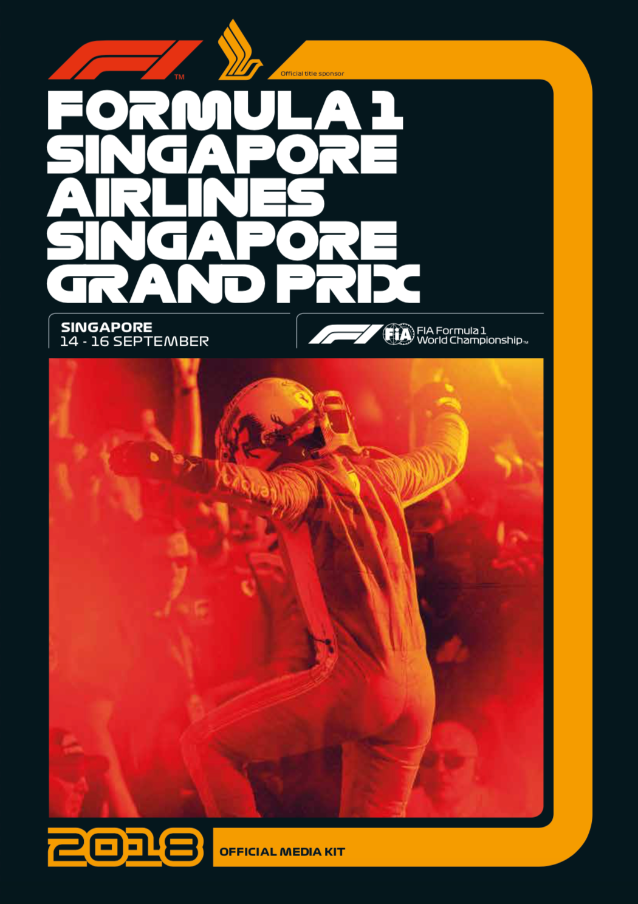
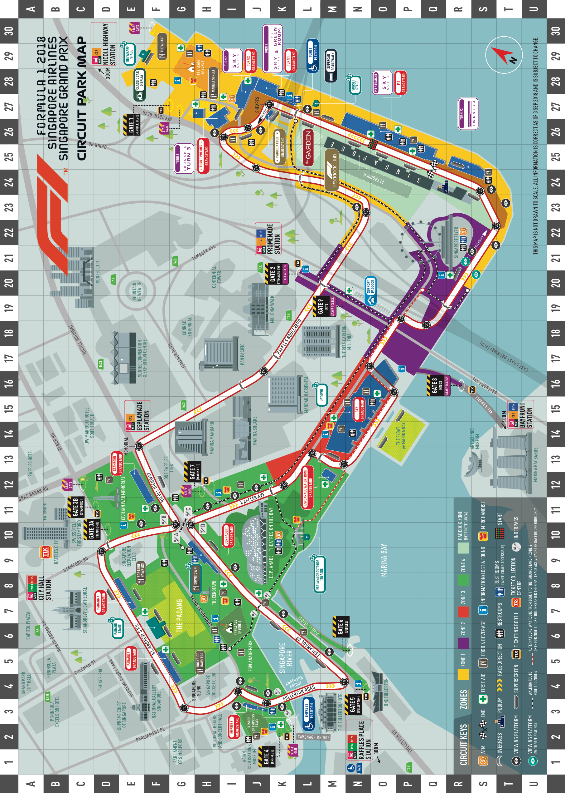
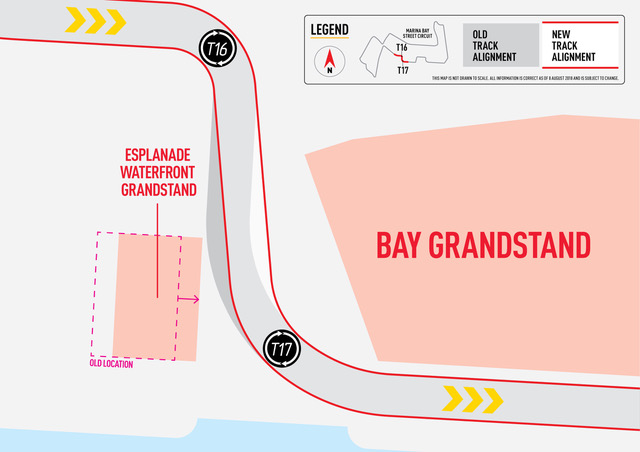
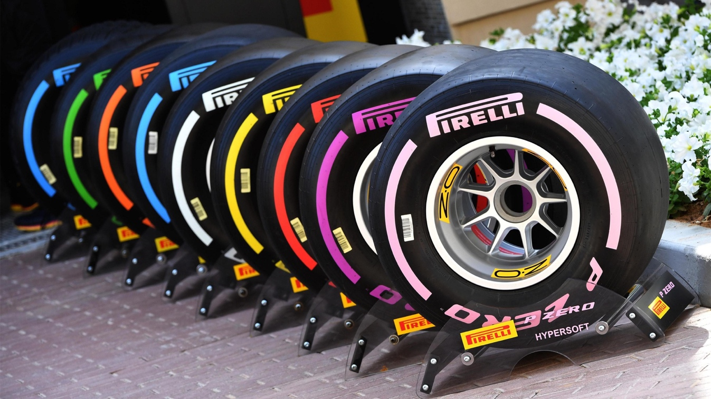
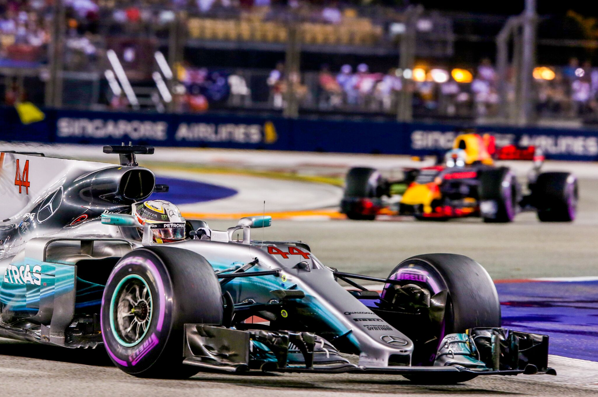

CONTENTS PAGE

Welcome to Singapore 3

Marina Bay Street Circuit Map 4

Circuit Updates 5

Media Accreditation Centre & Media Centre Opening Hours 6

Media Centre:

Key Staff & Contacts 7 Facilities 8 Layout 9

FIA Press Conference Schedule 10

Photographers’ Shuttle Bus Schedule 11

2018 FIA Formula 1 World Championship™:

Track Timetable 12 Entry List 14 Calendar 15 Season so far: Podiums, Pole Positions, Fastest Laps 16 Drivers’ & Constructors’ Current Standings 17 Team & Driver Career Statistics 18

Singapore: 2008 - 2017

Results 28 Drivers’ Record 30 Points per Driver 31

Pirelli Tyres at 2018 Singapore Grand Prix 32

2017 Formula 1 Singapore Airlines Singapore Grand Prix:

Qualifying 33 Race Classification 34 Race Review 35

Useful Contacts/Telephone Numbers 36

2

WELCOME MESSAGE

THE BEAT GOES ON!

Singapore is synonymous with the thrilling sights and sounds of night racing, and as we head into a new chapter as a Grand Prix destination, we are more determined than ever to make sure that the beat goes on!

Over the last decade, we have welcomed more than 2.5 million visitors in total to the Singapore Grand Prix. With all the years of racing under our belts, we relish the challenge of working with the sport’s governing bodies to take Singapore’s event to even greater heights.

Both on the racetrack and off it, there are some changes in place for 2018. A realignment of the circuit between Turns 16 and 17, close to the Marina Bay reservoir, means the track is actually slightly shorter at 5.063 kilometres. This change has the added benefit of bringing the track closer to the Esplanade Waterfront Grandstand, and fans closer to the action.

In the Circuit Park, we have revised the layout of Zone 1, refreshing the F1 Village and moving the Village Stage (now renamed to the Wharf Stage) to allow more music fans to catch performances at the location. The hospitality suites have also been given a fresh new look. There is also an exciting new offering called Twenty3, a 3,000 sqm facility located at the Marina Bay Street Circuit’s final turn that houses a multitude of entertainment options, including three feature restaurants. Meanwhile in Zone 4, the Pitstop@Empress Lawn has been added near the Empress Grandstand with activities to keep the kids occupied.

With star drivers from 15 different countries giving F1 a truly global reach in 2018, we want to match that multi-national appeal with the range of entertainment on offer when the cars have gone quiet.

From ‘King of Asian Pop’ Jay Chou of Taiwan to the regal presence of UK veterans like Simply Red and Liam Gallagher, from the ‘Wonderful, Wonderful’ sounds of Las Vegas band The Killers to dance music’s freshest face, Dutchman Martin Garrix, from Dua Lipa, the youngest female singer to achieve a billion hits on YouTube, to hip-hop heroes The Sugarhill Gang, Singapore is backing up the best on track with the best off it.

As always, we welcome you warmly to our city and to the Marina Bay Street Circuit.

Thank you for being with us, and have a ‘wonderful, wonderful’ weekend!

JONATHAN HALLETT

3

MARINA BAY STREET CIRCUIT MAP

4

CIRCUIT UPDATES FOR 2018

No. of laps: 61

No. of turns: 23

Circuit length: 5.063 kilometres

The track has been resurfaced around turn 1, between turns 5 and 7, between turns 15 and 17 and around turn 23.

Realignment of circuit at Turns 16 and 17

A realignment of the circuit between Turns 16 and 17 has been carried out, due to some construction works in the area. This means the track is actually slightly shorter at 5.063 kilometres. The change also has the added benefit of bringing the track closer to the Esplanade Waterfront Grandstand, and fans closer to the action.

5

MEDIA ACCREDITATION AND MEDIA CENTRE

OPENING HOURS

Media Accreditation Centre (MAC) Pan Pacific Singapore 7 Raffles Boulevard Level 22, China Room Singapore 039595

Day Date Time

Wednesday September 12th 12:00 – 19:00 Thursday September 13th 11:00 – 20:00 Friday September 14th 13:00 – 21:00 Saturday September 15th 13:00 – 18:00

Media Centre 1 Republic Boulevard Pit Building Level 2 Singapore 038975

Day Date Time

Wednesday September 12th 13:00 – 21:00 Thursday September 13th 12:00 – 00:00 Friday September 14th 13:00 – 04:00 Saturday September 15th 13:00 – 04:00 Sunday September 16th 13:00 – 05:00

6

MEDIA CENTRE: KEY STAFF Contact numbers in Singapore

FIA F1 Head of Communications & Media Delegate Matteo Bonciani +65 6219 6542

FIA F1 Deputy Media Delegate Pierre Guyonnet-Duperat +65 6219 6542

National Press Office Fiona Smith +65 6219 6564 Henedick Chng

Media Manager Stuart Sykes +65 6219 6541

Logistics Manager Rob van Leeuwen +65 6219 6539

Media Centre Reception +65 6314 2546

Photographers’ Area Reception +65 6219 6611

IT Helpdesk +65 6219 6538

7

MEDIA CENTRE FACILITIES

Media Centre staff will be ready to help you with your seat and locker allocation upon check- in at the main reception desk in the Media Centre.

Lockers

The Media Centre now has brand new lockers which no longer require users to pay a deposit and obtain a key from the Reception. You will be assigned an available locker and can set your own numerical code on the combination lock.

Telecommunications

Telephones are provided on a request basis with outgoing local calls free of charge. To obtain telecommunication services such as International Direct Dialling or ISDN, please go to the Telecom Reception area by the entrance of the Media Centre.

Singapore GP provides limited free wireless Internet access throughout the Media Centre:

Log in: F1_Media_Centre Password: f1nightrace

You can also obtain a cable from the Media Centre Reception to connect your laptop to the Internet.

Headsets are also available to allow you to listen to race commentary. The general Media Telecom and IT Helpdesk area is located at the back of the Press Room. IT Support

Should you encounter any issues with your laptop over the race weekend, please do not hesitate to approach the Reception staff or IT Helpdesk located at the Media Telecom area at the back of the Press Room.

Camera Repair Service (Photographers’ Area only)

A camera repair service is available at the back of the Photographers’ Area for inspection and cleaning, minor repairs and technical advice.

Media Café & Photographers’ Café

The Media Café and Photographers’ Café offer complimentary all-day light refreshments starting at noon on Thursday, 13th September.

8

MEDIA CENTRE LAYOUT

MEDIA TELECOM AREA CAMERA REPAIR ISDN SEATS SERVICE I T HELPDESK

PHOTOGRAPHERS’ CAFE

TELECOM RECEPTION

MEDIA CAFE

9

FIA PRESS CONFERENCE SCHEDULE

All press conferences organized by the FIA will be held in the Press Conference room on Level 2 of the Pit Building.

Day Time Participants

Thursday, 13th September 18:00 Drivers nominated by the FIA F1 Head of Communications & Media Delegate

Friday, 14th September 18:30 Team representatives nominated by the FIA F1 Head of Communications & Media Delegate

Saturday, 15th September After F1 Qualifying Top three drivers in qualifying

Sunday, 16th September After the Race Top three finishing drivers in the race

Qualifying and post-race press conferences will take place after the parc ferme and/or track interviews. Refer to timetable on Page 12.

10

PHOTOGRAPHERS’ SHUTTLE BUSES

Please find below the schedule of times for the shuttle bus service around the Marina Bay Circuit:

FRIDAY 14TH SEPTEMBER

1400 – 1415 1445 – 1455 1545 – 1555 1800 – 1815 2005 – 2015 2200 – 2210

SATURDAY 15TH SEPTEMBER

1330 – 1345 1510 – 1525 1620 – 1630 1720 – 1730 1900 – 1915 1940 – 2005 2200 – 2210

SUNDAY 16TH SEPTEMBER

1425 – 1435 1605 – 1615 1730 – 1755 1845 – 1900

11

TRACK TIMETABLE

THURSDAY

14:00 16:00 FIA TRACK FINAL CIRCUIT INSPECTION PRESS CONF. 15:00 15:30 PROMOTER ACTIVITY SECURITY BRIEFING ROOM 16:00 16:40 F1 IN SCHOOLS TRACK TRACK TOUR

16:40 17:40 F1 IN SCHOOLS PIT LANE PIT LANE WALK

16:30 22:30 FIA FIA GARAGES INITIAL SCRUTINEERING PRESS CONF. 17:00 18:00 FORMULA 1 TEAM MANAGERS’ MEETING ROOM PRESS CONF. 18:00 19:00 FORMULA 1 PRESS CONFERENCE ROOM 18:00 20:00 PROMOTER ACTIVITY PADDOCK CLUB DRIVERS’ AUTOGRAPH SESSION

19:00 21:00 FIA TRACK TRACK CLOSED FIA/F1 SYSTEMS CHECKS TRACK INSPECTION, TRACK COMPLETELY 19:45 20:00 FIA TRACK CLEAR HIGH SPEED TRACK TEST – FIA SAFETY & 20:00 21:00 FIA TRACK MEDICAL CARS 21:00 23:30 PROMOTER ACTIVITY PIT LANE COMMUNITY PIT LANE WALK

FRIDAY 14:30 CIRCUIT PARK OPEN PRESS CONF. 13:00 13:30 PORSCHE CARRERA CUP ASIA DRIVERS’ MEETING ROOM 14:20 14:30 FIA TRACK MEDICAL INSPECTION

14:30 14:45 FIA TRACK TRACK INSPECTION AND SAFETY CAR TEST

15:00 15:45¹ PORSCHE CARRERA CUP ASIA TRACK PRACTICE SESSION

16:00 16:10 FIA TRACK TRACK INSPECTION

16:30 18:00¹ FORMULA 1 TRACK FIRST PRACTICE SESSION

18:05 19:05 PADDOCK CLUB PIT LANE PADDOCK CLUB PIT LANE WALK PRESS CONF. 18:30 19:00 FORMULA 1 PRESS CONFERENCE ROOM 19:15 20:00¹ FERRARI CHALLENGE TRACK PRACTICE SESSION

20:00 20:10 FIA TRACK TRACK INSPECTION

20:30 22:00¹ FORMULA 1 TRACK SECOND PRACTICE SESSION

22:30 23:30 PROMOTER ACTIVITY PIT LANE MARSHAL PIT LANE WALK PRESS CONF. 23:30 00:30 FORMULA 1 DRIVERS’ MEETING ROOM 22:30 TRACK CLOSED

12

SATURDAY 14:30 CIRCUIT PARK OPEN 14:00 14:10 FIA TRACK MEDICAL INSPECTION

14:10 14:25 FIA TRACK TRACK INSPECTION AND SAFETY CAR TEST

14:40 15:10 FERRARI CHALLENGE TRACK QUALIFYING SESSION

15:10 15:30 FORMULA 1 PIT LANE TEAM PIT STOP PRACTICE

15:50 16:20 PORSCHE CARRERA CUP ASIA TRACK QUALIFYING SESSION

16:50* 17:20² FERRARI CHALLENGE TRACK FIRST RACE (10 LAPS OR 25 MINS)

17:30 17:40 FIA TRACK TRACK INSPECTION

18:00 19:00¹ FORMULA 1 TRACK THIRD PRACTICE SESSION

19:15 20:15 PADDOCK CLUB PIT LANE PADDOCK CLUB PIT LANE WALK

20:30 20:40 FIA TRACK TRACK INSPECTION

21:00 22:00 FORMULA 1 TRACK QUALIFYING SESSION PRESS CONF. 22:00 23:00 FORMULA 1 PRESS CONFERENCE ROOM 22:30 TRACK CLOSED

SUNDAY 15:00 CIRCUIT PARK OPEN 14:45 14:55 FIA TRACK MEDICAL INSPECTION

14:55 15:10 FIA TRACK TRACK INSPECTION AND TRACK TEST

15.30* 16:05² PORSCHE CARRERA CUP ASIA TRACK RACE (12 LAPS OR 30 MINS)

16:55* 17:25² FERRARI CHALLENGE TRACK SECOND RACE (10 LAPS OR 25 MINS)

17:30 19:15 PADDOCK CLUB PIT LANE PADDOCK CLUB PIT LANE WALK

18:30 19:00 FORMULA 1 TRACK DRIVERS’ TRACK PARADE

18:45 19:15 FORMULA 1 TRACK STARTING GRID PRESENTATION

19:00 19:10 FIA TRACK MEDICAL INSPECTION

19:10 19:20 FIA TRACK TRACK INSPECTION

19:30 19:40 FORMULA 1 PIT LANE PIT LANE OPEN

19:54 19:56 FORMULA 1 TRACK NATIONAL ANTHEM

20:10* 22:10² FORMULA 1 TRACK GRAND PRIX (61 LAPS OR 120 MINS)

13

2018 ENTRY LIST

MERCEDES AMG PETRONAS MOTORSPORT F1W09 - Mercedes

44. Lewis HAMILTON (GBR) 77. Valtteri BOTTAS (FIN)

ASTON MARTIN RED BULL RACING RB14 - Renault

3. Daniel RICCIARDO (AUS) 33. Max VERSTAPPEN (NDL)

SCUDERIA FERRARI SF71H - Ferrari

5. Sebastian VETTEL (GER) 7. Kimi RÄIKKÖNEN (FIN)

RACING POINT FORCE INDIA F1 TEAM VJM11 - Mercedes

11. Sergio PÉREZ (MEX) 31. Esteban OCON (FRA)

WILLIAMS MARTINI RACING FW41 - Mercedes

18. Lance STROLL (CAN) 35. Sergey SIROTKIN (RUS)

McLAREN F1 TEAM MCL33 - Renault

2. Stoffel VANDOORNE (BEL) 14. Fernando ALONSO (ESP)

RED BULL TORO ROSSO HONDA STR13 - Honda

10. Pierre GASLY (FRA) 28. Brendon HARTLEY (NZ)

HAAS F1 TEAM VF-18 - Ferrari

8. Romain GROSJEAN (FRA) 20. Kevin MAGNUSSEN (DEN)

RENAULT SPORT FORMULA ONE TEAM RS18 - Renault

27. Nico HÜLKENBERG (GER) 55. Carlos SAINZ (ESP)

ALFA ROMEO SAUBER F1 TEAM C37 - Ferrari

9. Marcus ERICSSON (SWE) 16. Charles LECLERC (MON)

14

2018 F1 CALENDAR

Round Date GP Venue

1 March 25 Australia Albert Park, Melbourne

2 April 8 Bahrain Sakhir, Bahrain

3 April 15 China Shanghai

4 April 29 Azerbaijan Baku

5 May 13 Spain Catalunya, Barcelona

6 May 27 Monaco Monte Carlo

7 June 10 Canada Gilles Villeneuve, Montreal

8 June 24 France Paul Ricard, Le Castellet

9 July 1 Austria Red Bull Ring Spielberg

10 July 8 Great Britain Silverstone

11 July 22 Germany Hockenheim

12 July 29 Hungary Hungaroring, Budapest

13 August 26 Belgium Spa-Francorchamps

14 September 2 Italy Monza

15 September 16 Singapore Marina Bay

16 September 30 Russia Sochi

17 October 7 Japan Suzuka

18 October 21 USA COTA, Austin, Texas

19 October 28 Mexico Hermanos Rodriguez, Mexico City

20 November 11 Brazil Interlagos, Sao Paulo

21 November 25 Abu Dhabi Yas Marina

15

2018 FIA FORMULA 1 WORLD CHAMPIONSHIP: SEASON SO FAR

Race Winner 2nd 3rd Pole Fastest Lap Position

01 Australia Vettel Hamilton Räikkönen Hamilton Ricciardo

02 Bahrain Vettel Bottas Hamilton Vettel Bottas

03 China Ricciardo Bottas Räikkönen Vettel Ricciardo

04 Azerbaijan Hamilton Räikkönen Perez Vettel Bottas

05 Spain Hamilton Bottas Verstappen Hamilton Ricciardo

06 Monaco Ricciardo Vettel Hamilton Ricciardo Verstappen

07 Canada Vettel Bottas Verstappen Vettel Verstappen

08 France Hamilton Verstappen Räikkönen Hamilton Bottas

09 Austria Verstappen Raïkkönen Vettel Bottas Räikkönen

10 Gt. Britain Vettel Hamilton Räikkönen Hamilton Vettel

11 Germany Hamilton Bottas Räikkönen Vettel Hamilton

12 Hungary Hamilton Vettel Räikkönen Hamilton Ricciardo

13 Belgium Vettel Hamilton Verstappen Hamilton Bottas

14 Italy Hamilton Räikkönen Bottas Räikkönen Hamilton

15 SINGAPORE

16 Russia

17 Japan

18 USA

19 Mexico

20 Brazil

21 Abu Dhabi

16

2018 DRIVERS’ STANDINGS: after round 14, Italy

Driver Team Wins Poles F/Laps Podiums Points

1. Lewis Hamilton Mercedes 6 6 2 11 256

2. Sebastian Vettel Ferrari 5 5 1 8 226 3. Kimi Räikkönen Ferrari 0 1 1 9 164 4. Valtteri Bottas Mercedes 0 1 4 6 159 5. Max Verstappen Red Bull 1 0 2 5 130 5. Daniel Ricciardo Red Bull 2 1 4 2 118 7. Nico Hülkenberg Renault 0 0 0 0 52 8. Kevin Magnussen Haas 0 0 0 0 49 9. Sergio Pérez Force India 0 0 0 1 46 10. Esteban Ocon Force India 0 0 0 0 45 11. Fernando Alonso McLaren 0 0 0 0 44 12. Carlos Sainz Renault 0 0 0 0 34 13. Pierre Gasly Toro Rosso 0 0 0 0 28 14. Romain Grosjean Haas 0 0 0 0 27 15. Charles Leclerc Sauber 0 0 0 0 13 16. Stoffel Vandoorne McLaren 0 0 0 0 8 17. Lance Stroll Williams 0 0 0 0 6 18. Marcus Ericsson Sauber 0 0 0 0 6 19. Brendon Hartley Toro Rosso 0 0 0 0 2 20. Sergey Sirotkin Williams 0 0 0 0 1

2018 CONSTRUCTORS’ STANDINGS

Team Wins Poles F/Laps Podiums Points

1. Mercedes 6 7 6 17 415

2. Ferrari 5 6 2 17 390 3. Red Bull 3 1 6 7 248 4. Renault 0 0 0 0 86 5. Haas 0 0 0 0 76 6. McLaren 0 0 0 0 52 7. Racing Point Force India 0 0 0 0 32 8. Toro Rosso 0 0 0 0 30 9. Sauber 0 0 0 0 19 10. Williams 0 0 0 0 7

17

MERCEDES AMG PETRONAS MOTORSPORT

Base Brackley, UK Debut 1954 Chassis W09 Engine Mercedes Races 182 Wins 82 Poles 95 F/Laps 62 Constructors’ Championships 4 Drivers’ Championships 5 (In 1954 Fangio drove Mercedes & Maserati to win the title)

44. Lewis Hamilton (GBR) 77. Valtteri Bottas (FIN)

Born January 7, 1985 Born August 28, 1989 F1 Debut 2007 (McLaren) F1 Debut 2013 (Williams) Races 222 Races 111 Wins 68 Wins 3 Poles 78 Poles 5 F/Laps 40 F/Laps 7 World Champion 2008 2014 2015 2017

2018 Season Results so far… 2018 Season Results so far… GP Qual Race Points GP Qual Race Points

Australia 1 2 18 Australia 10 8 4 Bahrain 4 3 15 Bahrain* 3 2 18 China 4 4 12 China 3 2 18 Azerbaijan 2 1 25 Azerbaijan* 3 14 0 Spain 1 1 25 Spain 2 2 18 Monaco 3 3 15 Monaco 5 5 10 Canada 4 5 10 Canada 2 2 18 France 1 1 25 France* 2 7 6 Austria 2 dnf 0 Austria 1 dnf 0 Great Britain 1 2 18 Great Britain 4 4 12 Germany* 14 1 25 Germany 2 2 18 Hungary 1 1 25 Hungary 2 5 10 Belgium 1 2 18 Belgium * 10 4 12 Italy* 3 1 25 Italy 4 3 15

* Fastest Lap

Media Contact: Bradley Lord +44 (0) 7785 68 28 93 blord@mercedesamgf1.com

18

SCUDERIA FERRARI

Base Maranello, Italy Debut 1950 Chassis SF-71H Engine Ferrari Races 963 Wins 234 Poles 234 F/Laps 246 Constructors’ Championships 16 Drivers’ Championships 15

5. Sebastian Vettel (GER) 7. Kimi Räikkönen (FIN)

Born July 3, 1987 Born October 17, 1979 F1 Debut 2007 (BMW Sauber) F1 Debut 2001 (Sauber) Races 212 Races 285 Wins 52 Wins 20 Poles 55 Poles 18 F/Laps 34 F/Laps 46 World Champion 2010 2011 2012 2013 World Champion 2007

2018 Season Results so far… 2018 Season Results so far… GP Qual Race Points GP Qual Race Points

Australia 3 1 25 Australia 2 3 15 Bahrain 1 1 25 Bahrain 2 dnf 0 China 1 8 4 China 2 3 15 Azerbaijan 1 4 12 Azerbaijan 6 2 18 Spain 3 4 12 Spain 4 dnf 0 Monaco 2 2 18 Monaco 4 4 12 Canada 1 1 25 Canada 5 6 8 France 3 5 10 France 6 3 15 Austria 3 3 15 Austria* 4 2 18 Great Britain* 2 1 25 Great Britain 3 3 15 Germany 1 dnf 0 Germany 3 3 15 Hungary 4 2 18 Hungary 3 3 15 Belgium 2 1 25 Belgium 6 dnf 0 Italy 2 4 12 Italy 1 2 18

*Fastest Lap * Fastest Lap

Media Contact: Alberto Antonini +39 344 055 66 35 alberto.antonini@ferrari.com

19

ASTON MARTIN RED BULL RACING Base Milton Keynes, UK Debut 2005 Chassis RB14 Engine Tag-Heuer (Renault) Races 258 Wins 58 Poles 59 F/Laps 60 Constructors’ Championships 4 Drivers’ Championships 4

3. Daniel Ricciardo (AUS) 33. Max Verstappen (NDL)

Born July 1, 1989 Born September 30, 1997 F1 Debut 2011 (HRT) F1 Debut 2015 (STR) Races 143 Races 74 Wins 7 Wins 4 Poles 2 Poles 0 F/Laps 13 F/Laps 4

2018 Season Results so far… 2018 Season Results so far… GP Qual Race Points GP Qual Race Points

Australia* 5 4 12 Australia 4 6 8 Bahrain 5 dnf 0 Bahrain 15 dnf 0 China* 6 1 25 China 5 5 10 Azerbaijan 4 dnf 0 Azerbaijan 5 dnf 0 Spain* 6 5 10 Spain 5 3 15 Monaco 1 1 25 Monaco * - 9 2 Canada 6 4 12 Canada* 3 3 15 France 5 4 12 France 4 2 18 Austria 7 dnf 0 Austria 5 1 25 Great Britain 6 5 10 Great Britain 5 15 0 Germany 15 dnf 0 Germany 4 4 12 Hungary* 12 4 12 Hungary 7 dnf 0 Belgium 8 dnf 0 Belgium 7 3 15 Italy 15 dnf 0 Italy 5 5 10

* Fastest Lap

Media Contact: Ben Wyatt +44 (0) 7771 85 42 38 ben.wyatt@redbullracing.com

20

RACING POINT FORCE INDIA F1 TEAM

Base Silverstone, UK Debut 2011 Chassis VJM11 Engine Mercedes Races 2 Wins 0 Poles 0 F/Laps 0

As Sahara Force India:- Races 203 Wins 0 Poles 1 F/Laps 5

11. Sergio Pérez (MEX) 31. Esteban Ocon (FRA)

Born January 26, 1990 Born September 17, 1996 F1 Debut 2011 (Sauber) F1 Debut 2016 (Manor) Races 148 Races 43 Wins 0 Wins 0 Poles 0 Poles 0 F/Laps 4 F/Laps 0

2018 Season Results so far… 2018 Season Results so far… GP Qual Race Points GP Qual Race Points

Australia 13 11 0 Australia 15 12 0 Bahrain 12 16 0 Bahrain 9 10 1 China 8 12 0 China 12 11 0 Azerbaijan 8 3 15 Azerbaijan 7 dnf 0 Spain 15 9 2 Spain 13 dnf 0 Monaco 9 12 0 Monaco 6 6 8 Canada 10 14 0 Canada 8 9 8 France 13 dnf 0 France 11 dnf 0 Austria 17 7 6 Austria 11 6 8 Great Britain 12 10 1 Great Britain 10 7 6 Germany 10 7 6 Germany 16 8 4 Hungary 19 14 0 Hungary 18 13 0 Belgium 4 5 10 Belgium 3 6 8 Italy 16 7 6 Italy 8 6 8

Media Contact: Will Hings +44 (0) 7734 20 20 20 will.hings@forceindiaf1.com

21

WILLIAMS MARTINI RACING

Base Wantage, UK Debut 1978 Chassis FW41 Engine Mercedes Races 691 Wins 114 Poles 128 F/Laps 132 Constructors’ Championships 9 Drivers’ Championships 7

18. Lance Stroll (CAN) 35. Sergey Sirotkin (RUS)

Born October 29, 1998 Born August 27,1995 F1 Debut 2017 (Williams) F1 Debut 2018 (Williams) Races 34 Races 14 Wins 0 Wins 0 Poles 0 Poles 0 F/Laps 0 F/Laps 0

2018 Season Results so far… 2018 Season Results so far… GP Qual Race Points GP Qual Race Points

Australia 14 14 0 Australia 19 dnf 0 Bahrain 20 14 0 Bahrain 18 15 0 China 18 14 0 China 16 15 0 Azerbaijan 11 8 4 Azerbaijan 12 dnf 0 Spain 19 11 0 Spain 18 14 0 Monaco 18 17 0 Monaco 13 16 0 Canada 17 dnf 0 Canada 18 17 0 France 20 17 0 France 19 15 0 Austria 15 14 0 Austria 18 13 0 Great Britain - 12 0 Great Britain 18 14 0 Germany 19 dnf 0 Germany 12 dnf 0 Hungary 15 17 0 Hungary 20 16 0 Belgium 19 13 0 Belgium 18 12 0 Italy 10 9 2 Italy 12 10 1

Media Contact: Sophie Ogg +44 (0) 7977 27 57 62 sophie.ogg@williamsf1.com

22

RENAULT SPORT FORMULA ONE TEAM

Base Enstone, UK Debut 1977 Chassis RS18 Engine Renault Races 355 Wins 35 Poles 51 F/Laps 31 Constructors’ Championships 2 Drivers’ Championships 2

27. Nico Hülkenberg (GER) 55. Carlos Sainz (ESP)

Born August 19,1987 Born September 1, 1994 F1 Debut 2010 (Williams) F1 Debut 2015 (STR) Races 149 Races 74 Wins 0 Wins 0 Poles 1 Poles 0 F/Laps 2 F/Laps 0

2018 Season Results so far… 2018 Season Results so far… GP Qual Race Points GP Qual Race Points

Australia 8 7 6 Australia 9 10 1 Bahrain 8 6 8 Bahrain 10 11 0 China 7 6 8 China 9 9 2 Azerbaijan 9 dnf 0 Azerbaijan 10 5 10 Spain 16 dnf 0 Spain 9 7 6 Monaco 11 8 4 Monaco 8 10 1 Canada 7 7 6 Canada 9 8 4 France 12 9 2 France 7 8 4 Austria 10 dnf 0 Austria 9 12 0 Great Britain 11 6 8 Great Britain 16 dnf 0 Germany 7 5 10 Germany 8 12 0 Hungary 13 12 0 Hungary 5 9 2 Belgium 15 dnf 0 Belgium 16 11 0 Italy 14 13 0 Italy 7 8 4

Media Contact: Louis Bordes louis.bordes@fr.renaultsportracing.com

23

McLAREN F1 TEAM

Base Woking, UK Debut 1966 Chassis MCL33 Engine Renault Races 835 Wins 182 Poles 155 F/Laps 155 Constructors’ Championships 8 Drivers’ Championships 12

2. Stoffel Vandoorne (BEL) 14. Fernando Alonso (ESP)

Born March 26, 1992 Born July 29, 1981 F1 Debut 2016 (McLaren) F1 Debut 2001 (Minardi) Races 34 Races 305 Wins 0 Wins 32 Poles 0 Poles 22 F/Laps 0 F/Laps 23 World Champion 2005 2006

2018 Season Results so far… 2018 Season Results so far… GP Qual Race Points GP Qual Race Points

Australia 12 9 2 Australia 11 5 10 Bahrain 14 8 4 Bahrain 13 7 6 China 14 13 0 China 13 7 6 Azerbaijan 16 9 2 Azerbaijan 13 7 6 Spain 11 dnf 0 Spain 8 8 4 Monaco 12 14 0 Monaco 7 dnf 0 Canada 15 16 0 Canada 14 dnf 0 France 18 12 0 France 16 16 0 Austria 16 15 0 Austria 14 8 4 Great Britain 17 11 0 Great Britain 13 8 4 Germany 20 13 0 Germany 11 16 0 Hungary 16 dnf 0 Hungary 11 8 4 Belgium 20 15 0 Belgium 17 dnf 0 Italy 20 12 0 Italy 13 dnf 0

Media Contact: Tim Bampton tim.bampton@mclaren.com

24

RED BULL TORO ROSSO HONDA

Base Faenza, Italy Debut 2006 Chassis STR13 Engine Honda Races 240 Wins 1 Poles 1 F/Laps 1

10. Pierre Gasly (FRA) 28. Brendon Hartley (NZ)

Born February 7, 1996 Born November 10, 1989 F1 Debut 2017 (STR) F1 Debut 2017 (STR) Races 19 Races 18 Wins 0 Wins 0 Poles 0 Poles 0 F/Laps 0 F/Laps 0

2018 Season Results so far… 2018 Season Results so far… GP Qual Race Points GP Qual Race Points

Australia 20 dnf 0 Australia 16 15 0 Bahrain 6 4 12 Bahrain 11 17 0 China 17 18 0 China 15 20 0 Azerbaijan 17 12 0 Azerbaijan nc 10 1 Spain 12 dnf 0 Spain nc 12 0 Monaco 10 7 6 Monaco 16 19 0 Canada 16 11 0 Canada 12 dnf 0 France 14 dnf 0 France 17 14 0 Austria 12 11 0 Austria 19 dnf 0 Great Britain 14 13 0 Great Britain - dnf 0 Germany 17 14 0 Germany 18 10 1 Hungary 6 6 8 Hungary 8 11 0 Belgium 11 9 2 Belgium 12 14 0 Italy 9 14 0 Italy 18 dnf 0

Media Contact: Fabiana Valenti +39 335 711 36 94 fabiana.valenti@tororosso.com

25

HAAS F1 TEAM

Base North Carolina, USA & Banbury, UK Debut 2016 Chassis VF18 Engine Ferrari Races 55 Wins 0 Poles 0 F/Laps 0

8. Romain Grosjean (FRA) 20. Kevin Magnussen (DEN)

Born April 17, 1986 Born October 5, 1992 F1 Debut 2009 (Renault) F1 Debut 2014 (McLaren) Races 136 Races 74 Wins 0 Wins 0 Poles 0 Poles 0 F/Laps 1 F/Laps 0

2018 Season Results so far… 2018 Season Results so far… GP Qual Race Points GP Qual Race Points

Australia 7 dnf 0 Australia 6 dnf 0 Bahrain 16 13 0 Bahrain 7 5 10 China 10 17 0 China 11 10 1 Azerbaijan nc dnf 0 Azerbaijan 15 13 0 Spain 10 dnf 0 Spain 7 6 8 Monaco 15 15 0 Monaco 19 13 0 Canada - 12 0 Canada 11 13 0 France 10 11 0 France 9 6 8 Austria 6 4 12 Austria 8 5 10 Great Britain 8 dnf 0 Great Britain 7 9 2 Germany 6 6 8 Germany 5 11 0 Hungary 10 10 1 Hungary 9 7 6 Belgium 5 7 6 Belgium 9 8 4 Italy 6 dq 0 Italy 11 16 0

Media Contact: Stuart Morrison smorrison@HaasF1Team.com

26

ALFA ROMEO SAUBER F1 TEAM

Base Hinwil, Switzerland Debut 1993 (excludes 2006-2010 – BMW years) Chassis C37 Engine Ferrari Races 366 Wins 0 Poles 0 F/Laps 3

9. Marcus Ericsson (SWE) 94. Charles Leclerc (MON)

Born September 2, 1990 Born October 16, 1997 F1 Debut 2014 (Caterham) F1 Debut 2018 (Sauber) Races 90 Races 14 Wins 0 Wins 0 Poles 0 Poles 0 F/Laps 0 F/Laps 0

2018 Season Results so far… 2018 Season Results so far… GP Qual Race Points GP Qual Race Points

Australia 17 dnf 0 Australia 18 13 0 Bahrain 17 9 2 Bahrain 19 12 0 China 20 16 0 China 19 19 0 Azerbaijan 18 11 0 Azerbaijan 14 6 8 Spain 17 13 0 Spain 14 10 1 Monaco 17 11 0 Monaco 14 18 0 Canada 19 15 0 Canada 13 10 1 France 15 13 0 France 8 10 1 Austria 20 10 1 Austria 13 9 2 Great Britain 15 dnf 0 Great Britain 9 dnf 0 Germany 13 9 2 Germany 9 15 0 Hungary 14 15 0 Hungary 17 dnf 0 Belgium 14 10 1 Belgium 13 dnf 0 Italy 19 15 0 Italy 17 11 0

Media Contact: Maria Guidotti maria.guidotti@sauber-motorsport.com

27

SINGAPORE RESULTS 2008 – 2017

2008 Pole Felipe MASSA (Ferrari) – 1:44.801 (174.055 km/h) Winner Fernando ALONSO (Renault) 2nd Nico ROSBERG (Williams Toyota) 3rd Lewis HAMILTON (McLaren Mercedes) F/Lap Kimi RAIKKONEN (Ferrari) - 1:45.599 (172.740 km/h)

2009 Pole Lewis HAMILTON (McLaren Mercedes) – 1:47.891 (169.270 km/h) Winner Lewis HAMILTON (McLaren Mercedes) 2nd Timo GLOCK (Toyota) 3rd Fernando ALONSO (Renault) F/Lap Fernando ALONSO (Renault) – 1:48.240 (168.725 km/h)

2010 Pole Fernando ALONSO (Ferrari) – 1:45.390 (173.287 km/h) Winner Fernando ALONSO (Ferrari) 2nd Sebastian VETTEL (Red Bull Renault) 3rd Mark WEBBER (Red Bull Renault) F/Lap Fernando ALONSO (Ferrari) – 1:47.976 (169.137 km/h)

2011 Pole Sebastian VETTEL (Red Bull Renault) – 1:44.381 (174.962 km/h) Winner Sebastian VETTEL (Red Bull Renault) 2nd Jenson BUTTON (McLaren Mercedes) 3rd Mark WEBBER (Red Bull Renault) F/Lap Jenson BUTTON (McLaren Mercedes) – 1:48.454 (168.392 km/h)

2012 Pole Lewis HAMILTON (McLaren Mercedes) – 1:46.362 (171.704 km/h) Winner Sebastian VETTEL (Red Bull Renault) 2nd Jenson BUTTON (McLaren Mercedes) 3rd Fernando ALONSO (Ferrari) F/Lap Nico HULKENBERG (Force India Mercedes) – 1:51.033 (164.480 km/h)

2013 Pole Sebastian VETTEL (Red Bull Renault) – 1:42.841 (177.302 km/h) Winner Sebastian VETTEL (Red Bull Renault) 2nd Fernando ALONSO (Ferrari) 3rd Kimi RAIKKONEN (Lotus Renault) F/Lap Sebastian VETTEL (Red Bull Renault) – 1:48.574 (167.574 km/h)

28

2014 Pole Lewis HAMILTON (Mercedes) – 1:45.681 (172.538 km/h) Winner Lewis HAMILTON (Mercedes) 2nd Sebastian VETTEL (Red Bull Renault) 3rd Daniel RICCIARDO (Red Bull Renault) F/Lap Lewis HAMILTON (Mercedes) – 1:50.417 (165.137 km/h)

2015 Pole Sebastian VETTEL (Ferrari) – 1:43.885 (175.521 km/h) Winner Sebastian VETTEL (Ferrari) 2nd Daniel RICCIARDO (Red Bull Renault) 3rd Kimi RAIKKONEN (Ferrari) F/Lap Daniel RICCIARDO (Red Bull Renault) – 1:50.041 (165.701 km/h)

2016 Pole Nico ROSBERG (Mercedes) – 1:42.584 (177.747 km/h) Winner Nico ROSBERG (Mercedes) 2nd Daniel RICCIARDO (Red Bull Renault) 3rd Lewis HAMILTON (Mercedes) F/Lap Daniel RICCIARDO (Red Bull Renault) – 1:47.187 (170.113 km/h)

2017 Pole Sebastian VETTEL (Ferrari) – 1:39.491 (183.272 km/h) Winner Lewis HAMILTON (Mercedes) 2nd Daniel RICCIARDO (Red Bull Renault) 3rd Valtteri BOTTAS (Mercedes) F/Lap Lewis HAMILTON (Mercedes) – 1:45.008 (173.643 km/h) – lap record

29

CURRENT DRIVERS’ SINGAPORE RECORD

Appearances Best result Best qualifying DNF

1st x 3 Pole x 3 3 HAMILTON 10 2009/14/17 2009/12/14 2010/11/15 3rd 6th 1 BOTTAS 5 2017 2017 2016 1st x 4 Pole x 4 1 VETTEL 10 2011/12/13/15 2011/13/15/17 2017 3rd x 2 3rd x 2 2 RAIKKONEN 8 2013/15 2008/15 2008/17 2nd x3 2nd x 2 1 RICCIARDO 7 2015/16/17 2015/16 2013 6th 2nd 1 VERSTAPPEN 3 2016 2017 2017 9th x 2 3 HULKENBERG 7 7th 2017 2013/14 2015/16/17 4th 6th SAINZ 3 0 2017 2016 7th 3rd 3 GROSJEAN 7 2009/13/16* 2012 2013 *dns 10th x 2 9th 1 MAGNUSSEN 3 2014/16 2014 2017 5th 10th PEREZ 7 0 2017 2016 10th 14th OCON 2 0 2017 2017 1st x 2 Pole x 1 2 ALONSO 10 2008/10 2010 2015/17 7th 9th VANDOORNE 1 0 2017 2017

GASLY 0

HARTLEY 0

LECLERC 0

11th 16th 1 ERICSSON 4 2015 2016 2017 8th 18th STROLL 1 0 2017 2017

SIROTKIN 0

30

DRIVERS WHO HAVE SCORED POINTS IN SINGAPORE

Total Driver 08 09 10 11 12 13 14 15 16 17

155 Sebastian VETTEL 4 5 18 25 25 25 18 25 10 104 Fernando ALONSO 10 6 25 12 15 18 12 6 101 Lewis HAMILTON 6 10 10 10 25 15 25 83 Nico ROSBERG 8 10 6 10 12 12 25 71 Daniel RICCIARDO 2 15 18 18 18 58 Jenson BUTTON 4 12 18 18 6 54 Kimi RAIKKONEN 8 15 4 15 12 32 Sergio PEREZ 1 1 4 6 6 4 10 30 Mark WEBBER 15 15 28 Felipe MASSA 4 2 4 8 10 25 Valtteri BOTTAS 10 15 20 Paul DI RESTA 8 12 14 Carlos SAINZ 2 12 13 Timo GLOCK 5 8 12 Max VERSTAPPEN 4 8 11 Rubens BARRICHELLO 3 8 10 Daniil KVYAT 8 2 8 Romain GROSJEAN 6 2 8 Jean-Eric VERGNE 8 8 Jolyon PALMER 8 7 Adrian SUTIL 2 4 1 7 Robert KUBICA 1 6 6 Stoffel VANDOORNE 6 5 Nick HULKENBERG 1 2 2 4 Lance STROLL 4 3 Nick HEIDFELD 3 2 David COULTHARD 2 2 Heikki KOVALAINEN 2 2 Kevin MAGNUSSEN 1 1 1 Kazuki NAKAJIMA 1 1 Felipe NASR 1 1 Esteban OCON 1

Points distribution: 2008-09 10-8-6-5-4-3-2-1 2010- 25-18-15-12-10-8-6-4-2-1

31

PIRELLI AT THE 2018 SINGAPORE GRAND PRIX

For 2018 Pirelli will bring to Marina Bay three tyres from the softer end of their ‘rainbow’ of available colours.

These are the yellow-striped Soft, purple-striped Ultrasoft and new-for-2018 pink-striped Hypersoft compounds. This combination has not previously been seen at any race this season; the Hypersofts have been used only in Monaco and Canada.

Each driver has 13 sets of dry-weather tyres for each race weekend, plus four sets of intermediates and three sets of wets. Two dry-weather sets stipulated by Pirelli must be available for the race; each driver must also retain one set of the softest compound for the third segment of qualifying. Those who qualify in the top ten return that set and start the race on the tyres which they set their fastest lap time in Q2.

One set of tyres must be returned after 40 minutes of Free Practice 1; another at the end of Free Practice 1; two at the end of Free Practice 2 (unless both sessions are wet); and two at the end of Free Practice 3.

32

2017 FORMULA 1 SINGAPORE AIRLINES SINGAPORE GRAND PRIX

QUALIFYING

Pos. No. Driver Nat Car Qualifying Time

1 5 Sebastian VETTEL GER Ferrari 1:39.491 / 183.272 km/h

2 33 Max VERSTAPPEN NDL Red Bull Racing 1:39.814

3 3 Daniel RICCIARDO AUS Red Bull Racing 1:39.840

4 7 Kimi RAIKKONEN FIN Ferrari 1:40.069

5 44 Lewis HAMILTON GBR Mercedes 1:40.126

6 77 Valtteri BOTTAS FIN Mercedes 1:40.810

7 27 Nico HÜLKENBERG GER Renault 1:41.013

8 14 Fernando ALONSO ESP McLaren Honda 1:41.179

9 2 Stoffel VANDOORNE BEL McLaren Honda 1:41.398

10 55 Carlos SAINZ ESP Toro Rosso Ferrari 1:42.056

11 30 Jolyon PALMER GBR Renault 1:42.107

12 11 Sergio PÉREZ MEX Force India Mercedes 1:42.246

13 26 Daniil KVYAT RUS Toro Rosso Ferrari 1:42.338

14 31 Esteban OCON FRA Force India Mercedes 1:42.760

15 8 Romain GROSJEAN FRA Haas Ferrari 1:43.883

16 20 Kevin MAGNUSSEN DEN Haas Ferrari 1:43.756

17 19 Felipe MASSA BRA Williams Mercedes 1:44.014

18 18 Lance STROLL CAN Williams Mercedes 1:44.728

19 94 Pascal WEHRLEIN GER Sauber Ferrari 1:45.059

20 9 Marcus ERICSSON SWE Sauber Ferrari 1:45.570

33

2017 FORMULA 1 SINGAPORE AIRLINES SINGAPORE GRAND PRIX RACE CLASSIFICATION

Pos. No. Driver Nat Car Time / Gap

1 44 Lewis HAMILTON GBR Mercedes 2:03:23.544/142.780km/h

2 3 Daniel RICCIARDO AUS Red Bull Racing 4.507

3 77 Valtteri BOTTAS FIN Mercedes 8.800

4 55 Carlos SAINZ ESP Toro Rosso Ferrari 22.822

5 11 Sergio PÉREZ MEX Force India Mercedes 25.359

6 30 Jolyon PALMER GBR Renault 27.259

7 2 Stoffel VANDOORNE BEL McLaren Honda 30.388

8 18 Lance STROLL CAN Williams Mercedes 41.696

9 8 Romain GROSJEAN FRA Haas Ferrari 43.282

10 31 Esteban OCON FRA Force India Mercedes 44.795

11 19 Felipe MASSA BRA Williams Mercedes 46.536

12 94 Pascal WEHRLEIN GER Sauber Ferrari 2 laps

NOT CLASSIFIED 20 Kevin MAGNUSSEN DEN Haas Ferrari dnf

27 Nico HÜLKENBERG GER Renault dnf

9 Marcus ERICSSON SWE Sauber Ferrari dnf

26 Daniil KVYAT RUS Toro Rosso Ferrari dnf

14 Fernando ALONSO ESP McLaren Honda dnf

5 Sebastian VETTEL GER Ferrari dnf

33 Max VERSTAPPEN NDL Red Bull Racing dnf

7 Kimi RAÏKKÖNEN FIN Ferrari dnf

FASTEST LAP 44 Lewis HAMILTON GBR Mercedes 1:45.008/173.643 on lap 55

34

The 2017 race: Lewis thanks his lucky stars

Singapore may have been celebrating its 10th F1 birthday, but Lewis Hamilton decided he would keep most of the presents for himself.

The 33-year-old Englishman claimed his third Marina Bay Street Circuit victory, his seventh of 2017 and the 60th of his Formula 1 career to move 28 points ahead of championship rival Sebastian Vettel.

Vettel’s Ferrari had started from pole position but the German’s race was over within a few hundred metres. As Red Bull’s Max Verstappen tried to force his way between Vettel and his Ferrari team-mate Kimi Räikkönen the Dutch driver found himself with nowhere to go: he and Räikkönen were out instantly, while Vettel spun into retirement just seconds later.

Never one to look a gift horse in the mouth, Hamilton brought his Mercedes through from the third row to take the race lead which would be his until the end of a race shortened to 58 laps.

Before the race Hamilton had said he needed a miracle and he was quick to acknowledge his good fortune. “God blessed me today for sure,” said the 32-year-old Briton. “I capitalised on the incident – who would ever have known that would happen?”

Daniel Ricciardo’s Red Bull gave chase but could never get within striking distance, leaving the Australian to come home second for the third year in a row at Marina Bay. “I can’t win the bloody thing!” said Ricciardo in jest, “But I’m trying!”

Third, rounding off a superb day for Mercedes, was Valtteri Bottas, the Finn helping propel Mercedes into a lead of more than 100 points from Ferrari in the constructors’ standings as the three-pointed star continued its relentless pursuit of a fourth consecutive double title success.

Hamilton was not the only driver to profit from the early chaos: Carlos Sainz, in his last year with Toro Rosso, took his best-ever finish in fourth place ahead of Sergio Perez’s Force India, Jolyon Palmer, dropped by Renault for 2018 to make way for Sainz, achieved his best F1 result in sixth, and Stoffel Vandoorne’s McLaren was eighth to give the Belgian his own highest finish.

With the race ending at the two-hour limit after 58 of the scheduled 61 laps, only 12 cars finished, the lowest in Singapore’s first decade as a Grand Prix venue. Hamilton sweetened his day even further with a new lap record of 1 minute 45.008 seconds and summed it all up in one sentence.

“I needed it to rain,” he said, “and as soon as it began to rain I knew where I would finish.”

35

USEFUL INFORMATION / TELEPHONE NUMBERS

EMERGENCY

Police 999

Emergencies/Ambulance/Fire Brigade 995

IMPORTANT PUBLIC SERVICE

Police Hotline 1800 225 0000

AAS Emergency Road Service 6748 9911

Non-Emergency Ambulance Service 1777

INFORMATION

Flight Information 1800 542 4422

STB Touristline 1800 736 2000

(24-hr automated tourist information system)

Weather Information 6542 7788

International Calls 104

DIAL-A-CAB

Common Taxi Booking Number 6342 5222

Comfort Taxis & Citycab 6552 1111

Premier Taxis 6363 6888

SMRT Taxis 6555 8888

TransCab Services 6555 3333

Prime Taxi 6778 0808

Yellow-Top Taxi 6293 5545

*Do note that pick-up/drop-off points for taxis and Private Hire Car services

(Grab/Ryde) differ. Ask the media centre staff for directions to the nearest points.

OTHERS

STB Media Hotline 9011 2071

36
