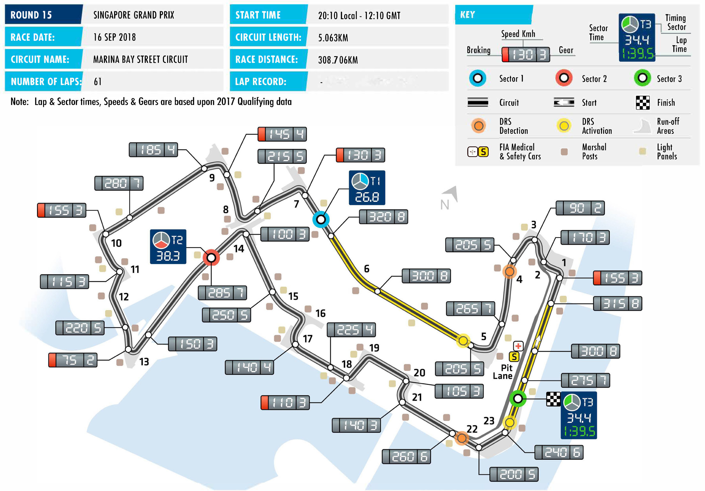
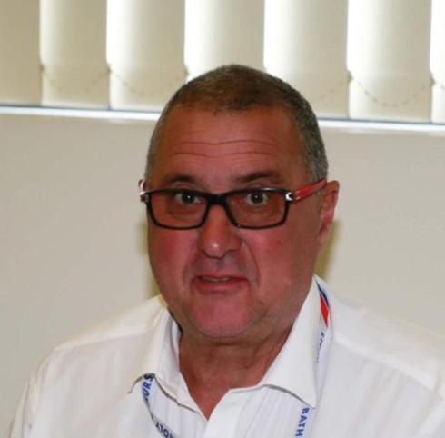

2018 SINGAPORE GRAND PRIX

14 – 16 September 2018

With the core European season complete, F1’s teams and MARINA BAY STRET CIRCUIT

drivers this weekend head for South East Asia and into Length of lap: 5.063km

the night for Round 15 of the 2018 FIA Formula One World Lap record: –

Championship, the Singapore Grand Prix. Start line/finish line offset: 0.137km

Total number of race laps: 61 Formula 1’s original night race, which joined the calendar in 2008, Total race distance: 308.706km presents F1’s drivers and teams with a unique set of challenges, Pitlane speed limits: with the scheduled 61 laps under the lights of the Marina Bay 60km/h in practice, qualifying, Street Circuit being among the toughest faced all season. and the race

For drivers, the major tests come in the shape of heat, humidity CIRCUIT NOTES and the duration of the race. Here, cockpit temperatures often rise ► The track has been resurfaced above 50˚C making the race physically and mentally demanding. around Turn 1, between Turns 5 Add in a long, tight circuit featuring 23 corners and the high and 7, between Turns 15 and 17 likelihood of safety car interventions, both of which often lead to and around Turn 23. the race edging towards or reaching the allotted two-hour for the ► The track has been slightly race, and Singapore represents a true test of endurance. re-aligned around Turns 16 and 17. This means the track length For teams, the challenge centres on ensuring sufficient cooling. is marginally reduced, from With few straights and with the boulevards of Marina Bay edged 5.065km to 5.063km.. by tall buildings, keeping temperatures in check is a difficult task DRS ZONES and teams will bring a variety of solutions to boost air flow to

crucial components. The 23 corners also make the race tough on ► There will be two DRS zones in Singapore. The first detection brakes and gearboxes. With upwards of 80 gear changes per lap point will be at the exit of Turn and brakes deployed more times than at any other circuit on the Four and the first activation point calendar, the Singapore Grand Prix stretches machinery to the limit. will be 53m after Turn Five. The second detection point will be Going into this weekend, Mercedes’ Lewis Hamilton, on 256 180m before the apex of Turn 22,

points, heads Ferrari’s Sebastian Vettel by 30 points in the battle and the activation point will be 48m after apex of Turn 23. for the Drivers’ Championship title, with Kimi Räikkönen a

further 62 points back in third. Meanwhile, in the race for the

Constructors’ title, Mercedes, on 415 points, have a 25-point lead

over Ferrari, while Red Bull Racing lie third.

On paper, Singapore should favour Ferrari and Red Bull but while

Mercedes have, in recent times, gone into this race unfancied, the

Silver Arrows have won three of the last four races here, proving

that on the streets of Marina Bay, predictions count for little and

in one of the season’s toughest races anything can happen.

FAST FACTS

► This is the 11th running of the Singapore ► Only three drivers have taken part in Vettel from third on the grid in 2012 and Grand Prix as a round of the FIA F1 World all 10 F1 races held in Singapore to date: Hamilton, who won last year’s race from Championship. The race has been held Hamilton, Vettel and Alonso. Of the a starting place of fifth. every year since 2008, always at the current drivers Kimi Raikkonen is next Marina Bay Street Circuit. on the list with eight starts. The Finn ► Renault’s Nico Hulkenberg is set to make raced the first two grands prix in his 150th grand prix start this weekend. ► Sebastian Vettel is the most successful Singapore but left F1 for two seasons, The German began his F1 career with driver at the Singapore Grand Prix with in 2010 and 2011. Williams in 2010 before moving to Force four wins to his name. The German India in 2012. He spent one season with scored a hat-trick of victories between ► Despite this race being dominated by Sauber in 2013 before returning to Force 2011-2013 while racing for Red Bull a small number of teams, none has India for three seasons. He joined Renault Racing and also won for Ferrari in 2015. managed a one-two finish in Singapore. last year. Hulkenberg has also achieved Lewis Hamilton’s win here last year, allied another landmark in Singapore – in 2012 to victories in 2009 with McLaren and ► Red Bull Racing lead the way, by quite it was the scene of the first of two career 2014 with Mercedes, puts him second some margin, in terms of podium finishes fastest laps to date. The other was scored on the list, while Fernando Alonso has in Singapore. The Milton Keynes squad at the 2016 Chinese GP. two wins, with Renault in 2008 and with have scored 11 podiums in Singapore, Ferrari in 2010. The only other winner at more than double the total of closest ► Despite being just a little over two this race is Nico Rosberg, who won with rivals Ferrari and Mercedes who have weeks away from his 21st birthday, this Mercedes in 2015. Thus, every winner of five each. As well as Vettel’s three wins, weekend’s race will be the 75th of Max the Singapore GP has a world title to his Red Bull Racing have five second places, Verstappen’s F1 career to date. The Red name. (Vettel in 2010 and 2014 and Daniel Bull driver made his race debut at the Ricciardo from 2015-’17) and three third 2015 Australian GP. ► Red Bull Racing and Mercedes share the places (Mark Webber in 2010 and 2011 honours as most successful team in here and Ricciardo in 2014). ► Carlos Sainz and Kevin Magnussen are with three victories apiece. Red Bull’s also set to make their 75th grand prix were all scored by Vettel between 2011 ► The driver on pole position has gone on start here. Renault’s Sainz debuted and 2013, while for Mercedes Hamilton to win in 70% of the F1 races held at the at the 2015 Australian GP, alongside won in 2014 and last year and Rosberg Marina Bay Street Circuit to date. The only Verstappen at Toro Rosso, while Haas in 2015. Renault (2008) and McLaren drivers to win from a grid position other driver Magnussen made his debut with (2009) have one win each at Marina Bay. than pole are Alonso from 15th in 2008, McLaren at the 2014 Melbourne race.

RACE STEWARDS BIOGRAPHIES

DR GERD ENNSER

MEMBER OF THE DMSB’S EXECUTIVE COMMITTEE FOR AUTOMOBILE SPORT, FORMULA ONE AND DTM STEWARD

Dr Gerd Ennser has successfully combined his formal education in law with his passion for motor racing. While still active as a racing driver he began helping out with the management of his local motor sport club and since 2006 has been a permanent steward at every round of Germany’s DTM championship. Since 2010 he has also been a Formula One steward. Dr Ennser, who has worked as a judge, a prosecutor and in the legal department of an automotive- industry company, has also acted as a member of the steering committee of German motor sport body, the DMSB, since spring 2010, where he is responsible for automobile sport. In addition, Dr Ennser is a board member of the South Bavaria Section of ADAC, Germany’s biggest auto club.

STEVE CHOPPING

FORMER VICE PRESIDENT OF THE CONFEDERATION OF AUSTRALIAN MOTOR SPORT (CAMS), CHAIRMAN CAMS JUDICIAL ADVISORY COMMITTEE, CHAIRMAN NATIONAL STEWARDS PANEL, AUSTRALIAN CHAMPIONSHIP STEWARDS COACH (CAMS)

Steven Chopping competed as a driver in various karting, Formula Ford, Australian Formula 2, Sports and Production Car competitions from the early 1970s until 1990. He was a steward at the Australian Rally Championship from 1997-2004 and Chairman of the Stewards at the Australian Production Car Rally Championship from 2001-2004. He has been a permanent steward at the V8 Supercar Championship in Australia since 2004, national steward at the Australian Grand Prix from 2005 and continues to serve as Chairman of the National Stewards Panel, Supercars Stewards Panel, Judicial Advisory Committee, and as a Member of the Australian Rally Championship Stewards Panel. In 2018 he was appointed a Member of the Order of Australia (AM) for his services to motor sport.

DEREK WARWICK

FORMER FORMULA 1 DRIVER AND WORLD SPORTSCAR CHAMPION, VICE-PRESIDENT OF THE FIA DRIVERS’ COMMISSION

Derek Warwick raced in 146 grands prix from 1981 to 1993, appearing for Toleman, Renault, Brabham, Arrows and Lotus. He scored 71 points and achieved four podium finishes, with two fastest laps. He was World Sportscar Champion in 1992, driving for Peugeot. He also won Le Mans in the same year. He raced Jaguar sportscars in 1986 and 1991 and competed in the British Touring Car Championship between 1995 and 1998, as well as a futher appearance at the Le Mans in 1996, driving for the Courage Competition team. Currently Vice-President of the FIA Drivers’ Commission, Warwick is a frequent FIA driver steward and is also a past President of the British Racing Drivers’ Club.

2018 FIA Formula One World Championship

DRIVERS’ CHAMPIONSHIP STANDINGS

NAJIABREZA AILARTSUA EROPAGNIS IBAHD YNAMREG YRAGNUH STNIOP NIARHAB OCANOM ADANAC AIRTSUA MUIGLEB ECNARF OCIXEM ANIHC AISSUR NAPAJ LIZARB NIAPS YLATI ASU UBA BG

| 18 2 | 15 3 | 12 4 | 25 1 | 25 1 | 15 3 | 10 5 | 25 1 | NC | 18 2 | 25 1 | 25 1 | 18 2 | 25 1 |
| --- | --- | --- | --- | --- | --- | --- | --- | --- | --- | --- | --- | --- | --- |
| 25 1 | 25 1 | 4 8 | 12 4 | 12 4 | 18 2 | 25 1 | 10 5 | 15 3 | 25 1 | NC | 18 2 | 25 1 | 12 4 |
| 15 3 | NC | 15 3 | 18 2 | NC | 12 4 | 8 6 | 15 3 | 18 2 | 15 3 | 15 3 | 15 3 | NC | 18 2 |
| 4 8 | 18 2 | 18 2 | 14 | 18 2 | 10 5 | 18 2 | 6 7 | NC | 12 4 | 18 2 | 10 5 | 12 4 | 15 3 |
| 8 6 | NC | 10 5 | NC | 15 3 | 2 9 | 15 3 | 18 2 | 25 1 | 15 | 12 4 | NC | 15 3 | 10 5 |
| 12 4 | NC | 25 1 | NC | 10 5 | 25 1 | 12 4 | 12 4 | NC | 10 5 | NC | 12 4 | NC | NC |
| 6 7 | 8 6 | 8 6 | NC | NC | 4 8 | 6 7 | 2 9 | NC | 8 6 | 10 5 | 12 | NC | 13 |
| NC | 10 5 | 1 10 | 13 | 8 6 | 13 | 13 | 8 6 | 10 5 | 2 9 | 11 | 6 7 | 4 8 | 16 |
| 11 | 16 | 12 | 15 3 | 2 9 | 12 | 14 | NC | 6 7 | 1 10 | 6 7 | 14 | 10 5 | 6 7 |
| 12 | 1 10 | 11 | NC | NC | 8 6 | 2 9 | NC | 8 6 | 6 7 | 4 8 | 13 | 8 6 | 8 6 |
| 10 5 | 6 7 | 6 7 | 6 7 | 4 8 | NC | NC | 16 | 4 8 | 4 8 | 16 | 4 8 | NC | NC |
| 1 10 | 11 | 2 9 | 10 5 | 6 7 | 1 10 | 4 8 | 4 8 | 12 | NC | 12 | 2 9 | 11 | 4 8 |
| NC | 12 4 | 18 | 12 | NC | 6 7 | 11 | NC | 11 | 13 | 14 | 8 6 | 2 9 | 14 |
| NC | 13 | 17 | NC | NC | 15 | 12 | 11 | 12 4 | NC | 8 6 | 1 10 | 6 7 | DQ |
| 13 | 12 | 19 | 8 6 | 1 10 | 18 | 1 10 | 1 10 | 2 9 | NC | 15 | NC | NC | 11 |
| 2 9 | 4 8 | 13 | 2 9 | NC | 14 | 16 | 12 | 15 | 11 | 13 | NC | 15 | 12 |
| 14 | 14 | 14 | 4 8 | 11 | 17 | NC | 17 | 14 | 12 | NC | 17 | 13 | 2 9 |
| NC | 2 9 | 16 | 11 | 13 | 11 | 15 | 13 | 1 10 | NC | 2 9 | 15 | 1 10 | 15 |
| 15 | 17 | 20 | 1 10 | 12 | 19 | NC | 14 | NC | NC | 1 10 | 11 | 14 | NC |
| NC | 15 | 15 | NC | 14 | 16 | 17 | 15 | 13 | 14 | NC | 16 | 12 | 1 10 |

1 L. HAMILTON 256

2 S. VETTEL 226

3 K. RÄIKKÖNEN 164

4 V. BOTTAS 159

5 M. VERSTAPPEN 130

6 D. RICCIARDO 118

7 N. HÜLKENBERG 52

8 K. MAGNUSSEN 49

9 S. PÉREZ 46

10 E. OCON 45

11 F. ALONSO 44

12 C. SAINZ 34

13 P. GASLY 28

14 R. GROSJEAN 27

15 C. LECLERC 13

16 S. VANDOORNE 8

17 L. STROLL 6

18 M. ERICSSON 6

19 B. HARTLEY 2

20 S. SIROTKIN 1

2018 FIA Formula One World Championship

CONSTRUCTORS’ CHAMPIONSHIP STANDINGS

NAJIABREZA AILARTSUA EROPAGNIS IBAHD YNAMREG YRAGNUH STNIOP NIARHAB OCANOM ADANAC AIRTSUA MUIGLEB ECNARF OCIXEM ANIHC AISSUR NAPAJ LIZARB NIAPS YLATI ASU UBA BG

| 22 2 8 | 33 2 3 | 30 2 4 | 25 1 13 | 43 1 2 | 25 3 5 | 28 2 5 | 31 1 7 | NC NC | 30 2 4 | 43 1 2 | 35 1 5 | 30 2 4 | 40 1 3 |
| --- | --- | --- | --- | --- | --- | --- | --- | --- | --- | --- | --- | --- | --- |
| 40 1 3 | 25 1 NC | 19 3 8 | 30 2 4 | 12 4 NC | 30 2 4 | 33 1 6 | 25 3 5 | 33 2 3 | 40 1 3 | 15 3 NC | 33 2 3 | 25 1 NC | 30 2 4 |
| 20 4 6 | NC NC | 35 1 5 | NC NC | 25 15 10 | 27 1 9 | 27 3 4 | 30 2 4 | 25 1 NC | 10 5 NC | 12 4 NC | 12 4 NC | 15 3 NC | 10 5 NC |
| 7 7 10 | 8 6 11 | 10 6 9 | 10 5 NC | 6 7 NC | 5 8 10 | 10 7 8 | 6 8 9 | NC NC | 8 6 NC | 10 5 12 | 2 9 12 | 11 NC | 4 8 13 |
| NC NC | 10 5 13 | 1 10 17 | 13 NC | 8 6 NC | 13 15 | 12 13 | 8 6 11 | 22 4 5 | 2 9 NC | 8 6 11 | 7 7 10 | 10 7 8 | 16 DQ |
| 12 5 9 | 10 7 8 | 6 7 13 | 8 7 9 | 4 8 NC | 14 NC | 16 NC | 12 16 | 4 8 15 | 4 8 11 | 13 16 | 4 8 NC | 15 NC 18 5 6 | 12 NC 14 6 7 |
| 15 NC | 12 4 17 | 18 20 | 1 10 12 | 12 NC | 6 7 19 | 11 NC | 14 NC | 11 NC | 13 NC | 1 10 14 | 8 6 11 | 2 9 14 | 14 NC |
| 13 NC | 2 9 12 | 16 19 | 8 6 11 | 1 10 13 | 11 18 | 1 10 15 | 1 10 13 | 3 9 10 | NC NC | 2 9 15 | 15 NC | 1 10 NC | 11 15 |
| 14 NC | 14 15 | 14 15 | 4 8 NC | 11 14 | 16 17 | 17 NC | 15 17 | 13 14 | 12 14 | NC NC | 16 17 | 12 13 | 3 9 10 |
| 11 12 | 10 16 | 11 12 | 3 NC | 9 NC | 6 12 | 9 14 | NC NC | 6 7 | 7 10 | 7 8 | 13 14 |  |  |

1 MERCEDES AMG 415 PETRONAS MOTORSPORT

390 2 SCUDERIA FERRARI

3 ASTON MARTIN 248 RED BULL RACING

RENAULT SPORT 86 4 FORMULA ONE TEAM

76 5 HAAS F1 TEAM

52 6 MCLAREN F1 TEAM

RACING POINT 32 7 FORCE INDIA F1TEAM

RED BULL 30 8 TORO ROSSO HONDA

ALFA ROMEO 19 9 SAUBER F1 TEAM

WILLIAMS MARTINI 7 10 RACING

SAHARA FORCE INDIA 0 EX F1 TEAM

FORMULA ONE TIMETABLE & FIA MEDIA SCHEDULE

THURSDAY

Press conference 1800

FRIDAY

Practice session 1 1630-1800 Press conference 1830

Practice session 2 2030-2200

SATURDAY

Practice session 3 1800-1900 Qualifying 2100-2200 Followed by track interviews, press conference

SUNDAY

Drivers’ Parade 1830 Race 2010 Followed by parc fermé interviews and press conference

ADDITIONAL MEDIA OPPORTUNITIES

QUALIFYING

All drivers eliminated in Q1 or Q2 will be available for media interviews after the end of each session, as will drivers who participated in Q3, but who are not required for the post-qualifying press conference. The TV Pen is located in front of the entrance to the media centre.

RACE

Any driver retiring before the end of the race will be made available at the TV pen interview area. In addition, during the race every team will make available at least one senior spokesperson for interview by officially accredited TV crews. A list of those nominated will be made available in the media centre.

FIA COMMUNICATIONS DEPARTMENT press@fia.com T +33 1 43 12 58 15
