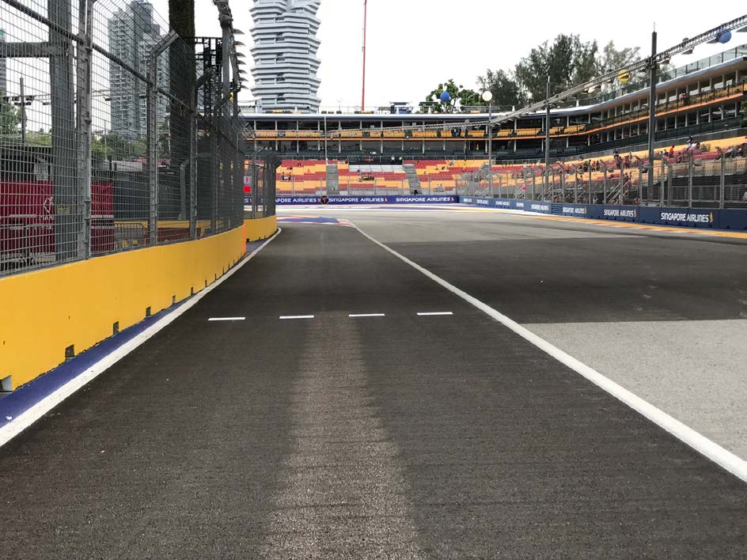
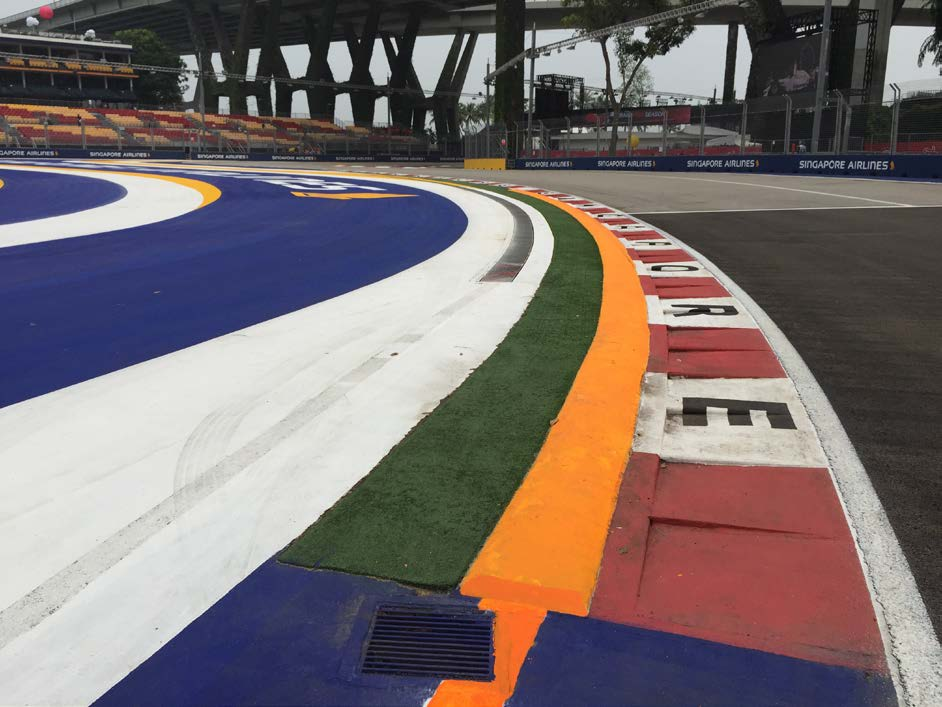
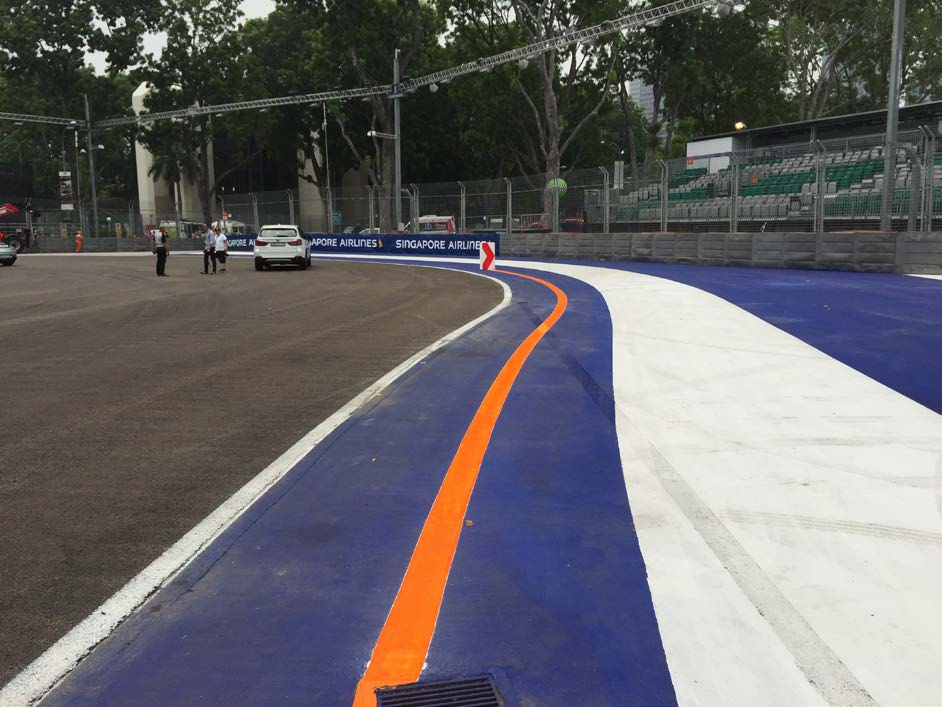
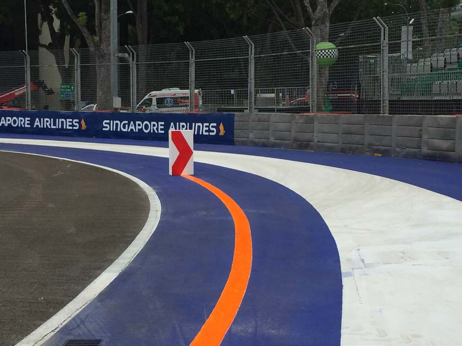
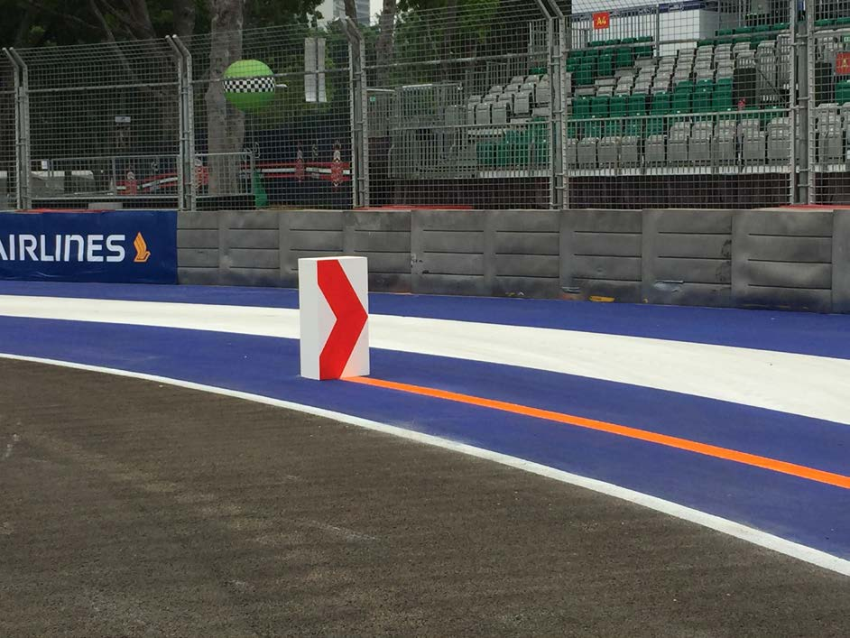
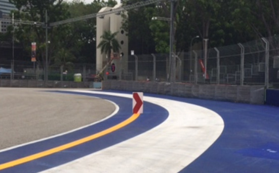
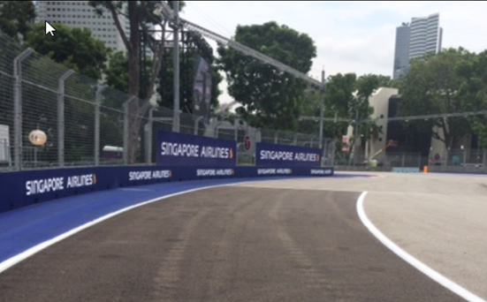
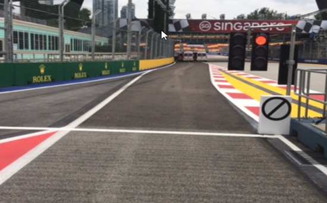
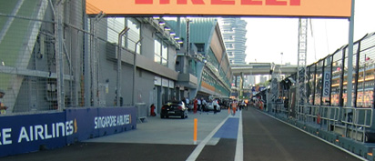

2018 SINGAPORE GRAND PRIX

13 - 16 September 2018

From The FIA Formula One Race Director Document 3

To All Teams, All Officials Date 13 September 2018

Time 17:17

Title Revised Event Notes

Description Revised Event Notes

Enclosed 1_2018_09_13_SINGAPORE_GP_EVENT_NOTES_V2.pdf

Charlie Whiting

The FIA Formula One Race Director

2018 SINGAPORE GRAND PRIX

13-16 SEPTEMBER 2018

From The FIA Formula One Race Director Document 3

To Formula One Team Managers Date 13 September 2018

Time 17.15

EVENT NOTES V2

13 SEPTEMBER 2018

1) Issues arising from the Italian Grand Prix

2) Changes to the circuit

2.1 The track has been resurfaced around turn 1, between turns 5 and 7, between turns 15 and 17 and around turn 23.

2.2 The track has been slightly re-aligned around turns 16 and 17.

3) Pit lane map

3.1 Safety Car lines.

3.2 The location of the pit entry and the pit exit.

3.3 Designated garage areas.

3.4 Safety Car position for first lap and rest of race.

3.5 Blue flag marshal at the pit exit.

3.6 Track light panel displaying pit entry status.

4) Pirelli Event Preview

4.1 With reference to Article 24.4(a) of the Sporting Regulations see the attached document provided by the official tyre supplier.

5) Weighing and weighing platform

5.1 Between 16.30 and 18.00 on Thursday, and by prior arrangement with Jo Bauer, the weighing platform will be available for teams to use for private deflection checks.

1/8

5.2 The weighing platform will be available for general checks at the following times, however, no more than 10 team personnel may be present during any visit. Each visit should last no more than 10 minutes unless no other team is waiting in the pit lane :

a) From 18.00 Thursday until 20.30 on Saturday (between 19.00 and 20.30 each visit will be restricted to five minutes).

b) From when the cars are returned to the teams after qualifying until 01.30 on Sunday.

c) From 15.00 until 18.30 on Sunday.

Any team found to be abusing the time limits set out above, which we will be enforced by FIA security personnel and our own CCTV, will not be permitted to use the weighbridge again during the Event.

5.3 Cars should not be pushed to the weighing platform whilst any support race cars or personnel are in the pit lane.

6) Red zones for photographers in the pit lane during practice sessions

6.1 See the attached drawing.

7) Practice starts during practice sessions

7.1 During practice sessions :

Practice starts may only be carried out at the pit exit on the left hand side but before the end of the pit wall, drivers should leave sufficient space on their right to allow other cars to pass.

7.2 During the time the pit exit is open for reconnaissance laps (19.30-19.40) :

Drivers should start further forward but no further forward than the white dashed line, always keeping to the left in order to allow other cars to pass on their right.

During these times any driver passing a car which has stopped to carry out a practice start may, if necessary, cross the white line that is referred to in 8.1 below. Any driver crossing this line must move back to the right of it as quickly as possible.

Please see the photograph on page 6.

7.3 At all times :

For reasons of safety and sporting equity, cars may not stop in the fast lane of the pits at any time the pit exit is open without a justifiable reason (a practice start is not considered a justifiable reason).

8) Lines and bollards at the pit entry and pit exit

8.1 In accordance with Chapter 4 (Section 5) of Appendix L to the ISC, drivers must keep to the left of the white line at the pit exit when leaving the pits, no part of any car leaving the pits may cross this line.

8.2 For safety reasons drivers must stay to the left of the bollard at the pit entry when entering the pits.

8.3 The dotted white line across the pit entry is the track edge.

8.4 For safety reasons, when driving in the first part of the pit lane (before reaching the first team garage) drivers must stay to the right of the two bollards on the edge of the safety zone.

2/8

9) Run-off area around turns 1, 2 and 3

9.1 Any driver who fails to negotiate turn 2 by using the track, and who passes completely to the right of the orange kerb element, must keep to the right of the red and white polystyrene block and re-join the track on the outside of turn 3.

Any driver forced off the track at turn 2 and, as a consequence fails to negotiate the corner by using the track, need not keep to the right of the red and white polystyrene block, provided it was completely clear he had been forced off the track and that by doing so he gained no advantage.

Please see the photographs on pages 7 and 8.

10) Observing yellow flags during free practice and qualifying

10.1 Double waved : Any driver passing through a double waved yellow marshalling sector must reduce speed significantly and be prepared to change direction or stop. In order for the stewards to be satisfied that any such driver has complied with these requirements it must be clear that he has not attempted to set a meaningful lap time, for practical purposes this means the driver should abandon the lap (this does not necessarily mean he has to pit as the track could well be clear the following lap).

10.2 Single waved : Drivers should reduce their speed and be prepared to change direction. It must be clear that a driver has reduced speed and, in order for this to be clear, a driver would be expected to have braked earlier and/or discernibly reduced speed in the relevant marshalling sector.

Drivers should not overtake any car in a single waved yellow marshalling sector unless it is clear that a car is slowing with a completely obvious problem, e.g. obvious accident damage or a deflated tyre.

11) Track light panels

11.1 The FIA light panels have been installed in the positions shown on the circuit map. In accordance with Appendix H to the ISC the light signals have the same meaning as flag signals.

12) Drivers leaving their pit stop position in the pit lane

12.1 For safety reasons, no car should be driven from its pit stop position at any time unless :

a) It has first been driven into the pit stop position having just entered the pit lane from the track, and ;

b) It is then driven immediately back onto the track from the pit stop position.

13) Fire extinguishers around the circuit

13.1 Indicated by white boards with red letter ‘F’ on the walls or debris fences.

14) Places where drivers may leave the track

14.1 Indicated by small fluorescent orange boards on the debris fences.

15) Places to remove cars from the track

15.1 Indicated by fluorescent orange panels on the walls or guardrails.

3/8

16) Support races

16.1 The Ferrari and Porsche teams will be operating from the F1 pit lane for all their practice sessions and races, would you therefore set up your barriers in order that they have enough room to work comfortably, as the pit lane is a little on the narrow side we suggest one metre from your garages would suffice.

17) In laps and reconnaissance laps

17.1 In order to ensure that cars are not driven unnecessarily slowly on in laps during and after the end of qualifying or during reconnaissance laps when the pit exit is opened for the race, drivers must stay below the maximum time set by the FIA between the Safety Car lines shown on the pit lane map.

We will inform you of the maximum time after the first day of practice.

18) Post qualifying parc fermé

18.1 The cameras should be installed and operated in the same way as usual.

19) Operational personnel curfew

19.1 Boards warning anyone attempting to enter the paddock that the curfew is in operation will be placed immediately before the entry turnstiles at the appropriate times.

20) Removing cars from the grid

20.1 Through one of the two gates in the pit wall, one beside pole position and one beside grid position 12.

21) Car number light panels for the start

21.1 On the right hand side of the grid.

22) Track light panel displaying pit entry status

22.1 The light panel indicated on the pit lane map will display flashing yellow arrows if cars are required to use the pit lane once the Safety Car has been deployed during the race.

22.2 The light panel indicated on the pit lane map will display flashing red crosses if the pit lane is closed at any point during the race.

23) Lapping during the race

23.1 The ISC requires drivers who are caught by another car about to lap him to allow the faster driver past at the first available opportunity. The F1 Marshalling System has been developed in order to ensure that the point at which a driver is shown blue flags is consistent, rather than trusting the ability of marshals to identify situations that require blue flags.

As it was at the end of last season the system will be set to give a pre-warning when the faster car is within 3.0s of the car about to be lapped, this should be used by the team of the slower car to warn their driver he is soon going to be lapped and that allowing the faster car through should be considered a priority. When the faster car is within 1.2s of the car about to be lapped blue flags will be shown to the slower car (in addition to blue light panels, blue cockpit lights and a message on the timing monitors) and the driver must allow the following driver to overtake at the first available opportunity.

4/8

It should be noted that the aim of using F1MS is ensure consistent application of the rules, additional instructions may also be given by race control when necessary.

24) Rolling starts

24.1 If a rolling start procedure is used as set out in Article 39.16 the race will be deemed to have started when the leading car crosses the Line after the safety car has returned to the pits.

For the avoidance of doubt, and with the exception of the permission given in Article 39.16, no driver may overtake until he reaches the Line, unless a car slows with an obvious problem.

25) Post race parc fermé

25.1 All cars should complete a full slowing down lap and enter the pits normally, all cars will then be stopped in the weighing area.

26) Any other business

Charlie Whiting FIA Formula One Race Director

5/8

6/8

7/8

8/8

|  |  | Grand Prix of Singapore 14-16/09/2018 (18R15SIN) |  |  |  |  |  |  |  |
| --- | --- | --- | --- | --- | --- | --- | --- | --- | --- |
|  |  | Compound |  | FL | FR | RL | RR |  | Mandatory race tyres |
|  |  | SOFT |  | S60 | S62 | S70 | S72 |  | SOFT |
|  |  | ULTRASOFT |  | U60 | U62 | U70 | U72 |  | ULTRASOFT |
|  |  | HYPERSOFT |  | K60 | K62 | K70 | K72 |  |  |
|  |  | INTERMEDIATE BASE |  | I37 | I38 | I39 | I40 |  | Q3 tyre |
|  |  | WET SOFT Cross-Over time MINIMUM STARTING PRESSURE, BLISTERING SENSITIVITY, CAMBER LIMIT |  | W37 WET > 119% > INT > 113% > DRY | W38 Front (psi) | W39 | W40 | Rear (psi) | HYPERSOFT |
|  |  |  | Slicks |  | 18.5 |  |  | 17.5 |  |
|  |  |  | Intermediate |  | 17.5 |  |  | 16.5 |  |
|  |  |  | Wet |  | 16.5 |  |  | 15.5 |  |
| FE EOS Camber limit RE EOS Camber limit -3.75 ° -2.00 ° FE Blistering RE Blistering sensitivity sensitivity Low Low |  | TYRE HEATING STRATEGY |  |  |  |  |  |  |  |
| Storage temperature: Optimum time in Storage temperature: Optimum time in blanket (@80°): blanket (@60°): 60°C 40°C 2h 1h SLICKS INTER Maximum boost Blanket time window Maximum boost Blanket time window temperature (@80°): temperature (@60°): 1h @ 110°C 1h to 3h 30min @ 80°C 30 min to 2h Storage temperature: Optimum time in blanket (@60°): 40°C 1h WET Blanket time window NO BOOST (@60°): 30 min to 2h GENERAL NOTES Teams are kindly reminded that the following parameters will be subjected to FIA checks during the event: - Starting pressure. - Camber at maximum speed. - Maximum blanket temperature. - Tyre swapping. | Tyre Notes |  |  |  |  |  |  |  |  |
| ● Not permiHed to switch tyres from their originally allocated posi%on. Storage Temp˚C is the recommended temperature the tyre can stay in blankets without time limit. All temperature limits apply to the actual tyre surface temperature, measured with the IR ● Do not subject tyres to large deforma%on or heavy impact. gun detailed in TD029-15. ● Do not leave fiHed tyres exposed at an air temperature lower than 15°C SIDEWALLS HEATING CLARIFICATION (ALL PRODUCTS): you are allowed to apply a max. and/or any UV emission. temperature of 100 °C for max. 1 hr to the sidewalls as long as the max. temp/time at any part ● Revised prescrip%ons could be issued during the race weekend in of the tread is the one described in the corresponding section above. accordance with TD/007-16. | ● Not permiHed to switch tyres from their originally allocated posi%on. ● Do not subject tyres to large deforma%on or heavy impact. ● Do not leave fiHed tyres exposed at an air temperature lower than 15°C and/or any UV emission. ● Revised prescrip%ons could be issued during the race weekend in accordance with TD/007-16. |  |  |  |  | Storage Temp˚C is the recommended temperature the tyre can stay in blankets without time limit. All temperature limits apply to the actual tyre surface temperature, measured with the IR gun detailed in TD029-15. SIDEWALLS HEATING CLARIFICATION (ALL PRODUCTS): you are allowed to apply a max. temperature of 100 °C for max. 1 hr to the sidewalls as long as the max. temp/time at any part of the tread is the one described in the corresponding section above. |  |  |  |

enaL

8102 tiP rebmetpeS GALF lahsraM aera EULB ffo-nur )thgir 31– eht 1 ni noisreV kcolb ot yats( worrA

|  | rebuaS | detangiseD saerA egaraG |
| --- | --- | --- |
| 04 | rebuaS | rebuaS |
| 93 | rebuaS |  |
| 83 | rebuaS / neraLcM |  |
| 73 | neraLcM | neraLcM |
| 63 | neraLcM |  |
| 53 | neraLcM |  |
| 43 | saaH |  |
| 33 | saaH | saaH |
| 23 | saaH |  |
| 13 | saaH/ossoR oroT | ossoR oroT |
| 03 | ossoR oroT |  |
| 92 | ossoR oroT |  |
| 82 | ossoR oroT |  |
| 72 | tluaneR | tluaneR |
| 62 | tluaneR |  |
| 52 | tluaneR |  |
| 42 | tluaneR / smailliW | smailliW |
| 32 | smailliW |  |
| 22 | smailliW |  |
| 12 | smailliW | aidnI ecroF |
| 02 | aidnI ecroF |  |
| 91 | aidnI ecroF |  |
| 81 | aidnI ecroF |  |
| 71 | aidnI .F / lluB deR | lluB deR |
| 61 | lluB deR |  |
| 51 | lluB deR |  |
| 41 | lluB deR | irarreF |
| 31 | irarreF |  |
| 21 | irarreF |  |
| 11 | irarreF |  |
| 01 | irarreF |  |
| 9 | sedecreM | sedecreM |
| 8 | sedecreM |  |
| 7 | sedecreM |  |
| 6 | sedecreM |  |
| 5 | AIF |  |
| 4 | AIF |  |
| 3 | AIF |  |
| 2 | AIF |  |
| 1 | 1F |  |

2 eniL TIXE RAC TIP YTEFAS ENAL )ylno enil m08 dettod spal TSAF ecnassiannoceR( trats

ecitcarP

RAC sdnE ecaR YTEFAS xirP ENAL

TIP dnarG

s e g a eropagniS r a G ta 1 F edis

dnah-tfel yrtne

enal noitisoP no 8102 tip sdralloB eniL eloP lortnoC

1 eniL )YLNO lennosreP RAC

YTEFAS tratS YRTNE ENAL maeT ecaR(

TIP TSAF

stratS

ENAL

X TIP

RAC lenap paL yrtnE eniL YTEFAS tsriF sutatS lortnoC tiP
