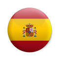
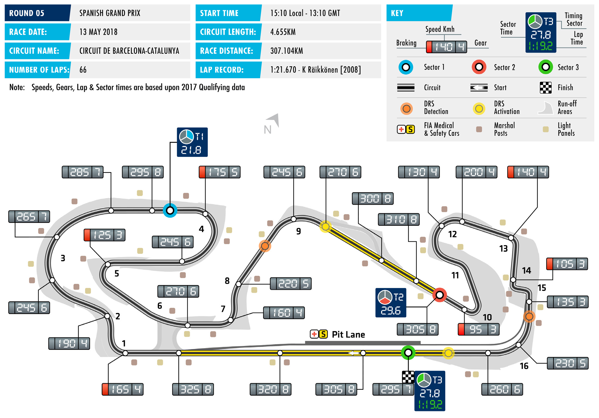
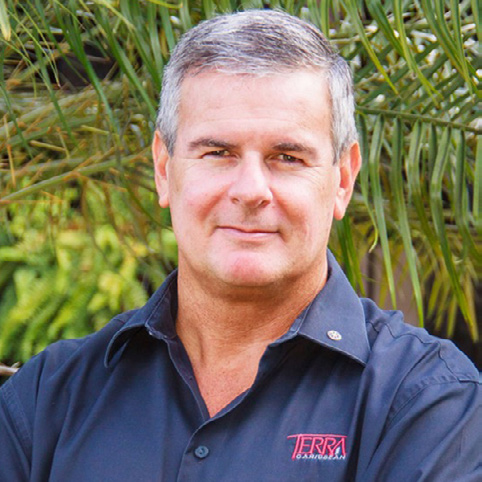

2018 SPANISH GRAND PRIX

11 – 13 May 2018

After a quartet of early flyaway races the 2018 FIA Formula 1 CIRCUIT DE BARCELONA-CATALUNYA

World Championship begins its European season at the Circuit Length of lap:

de Barcelona-Catalunya, home of the Spanish Grand Prix. 4.655km Lap record: The Barcelona track, the favoured off-season test venue for F1’s 1:21.670 (Kimi Räikkönen, Ferrari, teams, has always been something of bellwether circuit, with a 2008)

well-worn maxim stating that if a car is quick around the Montmeló Start line/finish line offset:

circuit is likely to perform well at any of the calendar’s 20 other 0.126km

race venues. Total number of race laps: 66 The judgement is based on the circuit’s layout, which features a Total race distance: good mix of fast-, medium- and slow-speed corners, as well as 307.104km

swift changes of direction and a long start-finish straight. It’s a Pitlane speed limits: 80km/h in practice, qualifying, and combination that tests a broad range of car characteristics and the race after the particular circuit demands of the opening races, taking in

temporary tracks and races in cool and high temperatures, Spain’s CIRCUIT NOTES grand prix circuit is perhaps the first time this season we will get ► The entire track has been a definitive guide to each team’s relative strengths. resurfaced.

However, while the Circuit de Barcelona-Catalunya is perhaps the ► A 10m wide section of asphalt has been replaced by gravel around circuit that offers the largest reserve of historical data for teams to the outside of Turn 1. draw upon, this year’s event presents a variable no team has yet ► The artificial grass on the exit of comes to grips with – in the most literal sense. Turns 2 and 7 has been removed.

► The guardrail has been re-aligned A complete resurfacing of the track coupled with unexpectedly to the left of the run-off at Turn 4. harsh weather in pre-season testing provided more questions than ► New double kerbs have been answers and should make for interesting tyre use this weekend, installed on the exit of Turns 5 with Pirelli offering its Medium, Soft and Supersoft compounds. and 16 and the artificial grass removed. Williams, in particular, have made aggressive choices, with its ► The run-off areas on the exit of drivers, Sergey Sirotkin and Lance Stroll, opting for nine and 10 sets Turn 12 and around the outside of ultrasoft tyres respectively. of Turn 13 have been increased.

An utterly captivating race in Baku last time out has altered the DRS ZONE shape of the Drivers’ Championship and Mercedes’ Lewis Hamilton ► Two DRS zones will be in use. goes into this weekend at the top of the standings for the first The first has a detection point 86m time this year. The 2017 Spanish GP winner now leads close rival before Turn 9 and an activation Sebastian Vettel by four points, with Kimi Räikkönen a further 18 point 40m after. The second detection point is at the Safety Car points back. In the race for the Constructors’ crown Ferrari (114 line, with activation 157m after pts) still hold a narrow four-point lead over Mercedes. Turn 16.

FAST FACTS

► This will be the 48th Formula 1 World ► Ferrari are the most successful team Catalunya has a win been scored from Championship Spanish Grand Prix at the Spanish Grand Prix with a dozen beyond the front row of the grid. Michael and the 28th edition at the Circuit de wins, eight of which were scored at the Schumacher took victory from third place Barcelona-Catalunya. The circuit first held Circuit de Catalunya. The Scuderia’s first on the grid in 1996, Max Verstappen, the race in 1991 and has been the home win in Spain was at the 1954 Pedrables scored his maiden grand prix win after of the Spanish Grand Prix ever since. race courtesy of Mike Hawthorn and its starting the 2016 edition from fourth most recent was in 2013 with Fernando place, while Alonso is the current record ► Four other venues have hosted Spanish Alonso. McLaren is next on the list with having scored his 2013 from fifth place GPs. The first event place at Barcelona’s eight Spanish GP wins, although only four on the starting grid. Pedralbes street circuit in 1951, with a were scored in Barcelona. second race taking place in 1954. After ► Of the current grid, home hero Alonso slipping off the schedule, the grand prix ► Five Spanish Grand Prix winners will also takes the honours for most podium returned in the late 1960s, alternating line up on the grid this weekend: Kimi finishes in Barcelona, with seven. His between Madrid’s Circuito del Jarama Räikkönen (2005, 2008), Fernando first taste of champagne in Spain was in (1968, 1970, 1972, 1974) and Barcelona’s Alonso (2006, 2013) Sebastian Vettel 2003, with second place for Renault. He Montjuïc (1969, 1971, 1973, 1975). (2011), Lewis Hamilton (2014, 2017) brought the Anglo-French team two more Following the cessation of F1 racing at and Max Verstappen (2016). podiums, in 2005 (P2) and 2006 (P1). In Montjuïc, Jarama hosted races from his 2007 he finished third at the wheel 1976-1979 and in 1981, while the Circuito ► Schumacher again leads the way on of a McLaren. In 2010 and 2012 he was de Jerez featured from 1986 to 1990. pole positions at the Spanish GP, with second for Ferrari, before taking his most seven – in 1994 and 1995 and then with recent F1 win, again with the Scuderia, ► Michael Schumacher is the most a straight run from 2000-2004. Hamilton in 2013. successful driver at the Spanish GP, has the most Spanish GP pole positions with six wins (1995-’96, 2001-’04). All of a current driver, with three. All three ► It’s 44 years since Mercedes non- the German’s victories were scored in were achieved with Mercedes, in 2014, executive director Niki Lauda won for Barcelona. A quartet of drivers share 2016 and last year. the first time in his F1 career, at the 1974 second place on the list, with three wins Spanish Grand Prix at Jarama, driving each: Jackie Stewart (1969-’71), Nigel ► Grid position counts for much here. for Ferrari. The Austrian would score a Mansell (1987, 1991-’92) and Alain Prost In only three of the 27 grands prix run further 24 victories, the final one arriving (1988, 1990, 1993). to date at the Circuit de Barcelona- with McLaren at the 1985 Dutch GP.

RACE STEWARDS BIOGRAPHIES

TIM MAYER

FIA ALTERNATE DELEGATE TO THE USA, FIA STEWARD, MEMBER OF THE FIA OFF-ROAD COMMISSION

As the son of former McLaren team principal Teddy Mayer, Tim Mayer grew up around motor sport. He organised IndyCar races internationally from 1992-98, aided the construction of several circuits, and produced international TV for multiple series. In 1998 he became CART’s Senior VP for Racing Operations. He also became VP of ACCUS, the US ASN. In 2003, Mayer became COO of IMSA, operating multiple series at all levels, and also took on the role of COO and Race Director of the American Le Mans Series. He was elected an independent Director of ACCUS and FIA US Alternate Delegate, responsible for US World Championship events. Tim is also a regular FIA World Endurance Championship steward and a member of the FIA’s Off-Road Commission.

ANDREW MALLALIEU

PRESIDENT OF THE BARBADOS MOTORING FEDERATION;

FORMULA 1, WRC AND F3 STEWARD

Andrew Mallalieu’s 30-year plus involvement in motor sport spans rallying, hill climbs and circuit racing in Barbados and the greater Caribbean region. He is currently President of the Barbados Motoring Federation. Andrew has served as a steward at a wide variety of events including rounds of the FIA World Rally Championship and the FIA European F3 Championship. A Certified Public Accountant and a Chartered Surveyor his non-motorsport activities include ownership of the Terra Caribbean Group where he is the Chief Executive. He has also been an advisor to the Barbados Government on real estate development issues.

DEREK WARWICK

FORMER FORMULA 1 DRIVER AND WORLD SPORTSCAR CHAMPION, VICE-PRESIDENT OF THE FIA DRIVERS’ COMMISSION

Derek Warwick raced in 146 grands prix from 1981 to 1993, appearing for Toleman, Renault, Brabham, Arrows and Lotus. He scored 71 points and achieved four podium finishes, with two fastest laps. He was World Sportscar Champion in 1992, driving for Peugeot. He also won Le Mans in the same year. He raced Jaguar sportscars in 1986 and 1991 and competed in the British Touring Car Championship between 1995 and 1998, as well as a futher appearance at the Le Mans in 1996, driving for the Courage Competition team. Currently Vice-President of the FIA Drivers’ Commission, Warwick is a frequent FIA driver steward and is also a past President of the British Racing Drivers’ Club.

2018 Formula One World Championship

DRIVERS’ CHAMPIONSHIP STANDINGS

NAJIABREZA AILARTSUA EROPAGNIS IBAHD YNAMREG YRAGNUH STNIOP NIARHAB OCANOM ADANAC AIRTSUA MUIGLEB ECNARF OCIXEM ANIHC AISSUR NAPAJ LIZARB NIAPS YLATI ASU UBA BG

| 18 2 | 15 3 | 12 4 | 25 1 |
| --- | --- | --- | --- |
| 25 1 | 25 1 | 4 8 | 12 4 |
| 15 3 | NC | 15 3 | 18 2 |
| 4 8 | 18 2 | 18 2 | 14 |
| 12 4 | NC | 25 1 | NC |
| 10 5 | 6 7 | 6 7 | 6 7 |
| 6 7 | 8 6 | 8 6 | NC |
| 8 6 | NC | 10 5 | NC |
| 11 | 16 | 12 | 15 3 |
| 1 10 | 11 | 2 9 | 10 5 |
| NC | 12 4 | 18 | 12 |
| NC | 10 5 | 1 10 | 13 |
| 13 | 12 | 19 | 8 6 |
| 2 9 | 4 8 | 13 | 2 9 |
| 14 | 14 | 14 | 4 8 |
| NC | 2 9 | 16 | 11 |
| 12 | 1 10 | 11 | NC |
| 15 | 17 | 20 | 1 10 |
| NC | 13 | 17 | NC |
| NC | 15 | 15 | NC |

1 L. HAMILTON 70

2 S. VETTEL 66

3 K. RÄIKKÖNEN 48

4 V. BOTTAS 40

5 D. RICCIARDO 37

6 F. ALONSO 28

7 N. HÜLKENBERG 22

8 M. VERSTAPPEN 18

9 S. PÉREZ 15

10 C. SAINZ 13

11 P. GASLY 12

12 K. MAGNUSSEN 11

13 C. LECLERC 8

14 S. VANDOORNE 8

15 L. STROLL 4

16 M. ERICSSON 2

17 E. OCON 1

18 B. HARTLEY 1

19 R. GROSJEAN 0

20 S. SIROTKIN 0

2018 Formula One World Championship

CONSTRUCTORS’ CHAMPIONSHIP STANDINGS

NAJIABREZA AILARTSUA EROPAGNIS IBAHD YNAMREG YRAGNUH STNIOP NIARHAB OCANOM ADANAC AIRTSUA MUIGLEB ECNARF OCIXEM ANIHC AISSUR NAPAJ LIZARB NIAPS YLATI ASU UBA BG

| 40 1 3 | 25 1 NC | 19 3 8 | 30 2 4 |
| --- | --- | --- | --- |
| 22 2 8 | 33 2 3 | 30 2 4 | 25 1 13 |
| 20 4 6 | NC NC | 35 1 5 | NC NC |
| 12 5 9 | 10 7 8 | 6 7 13 | 8 7 9 |
| 7 7 10 | 8 6 11 | 10 6 9 | 10 5 NC |
| 11 12 | 1 10 16 | 11 12 | 15 3 NC |
| 15 NC | 12 4 17 | 18 20 | 1 10 12 |
| NC NC | 10 5 13 | 1 10 17 | 13 NC |
| 13 NC | 2 9 12 | 16 19 | 8 6 11 |
| 14 NC | 14 15 | 14 15 | 4 8 NC |

1 114 SCUDERIA FERRARI

MERCEDES AMG 110 2 PETRONAS MOTORSPORT

3 ASTON MARTIN 55 RED BULL RACING

36 4 MCLAREN F1 TEAM

RENAULT SPORT 35 5 FORMULA ONE TEAM

SAHARA FORCE INDIA 16 6 F1 TEAM

RED BULL 13 7 TORO ROSSO HONDA

11 8 HAAS F1 TEAM

ALFA ROMEO 10 9 SAUBER F1 TEAM

WILLIAMS MARTINI 4 10 RACING

FORMULA ONE TIMETABLE & FIA MEDIA SCHEDULE

THURSDAY

Press conference 15.00

FRIDAY

Practice session 1 11.00-12.30 Press conference 13.00

Practice session 2 15.00-16.30

SATURDAY

Practice session 3 12.00-13.00 Qualifying 15.00-16.00 Followed by unilateral and press conference

SUNDAY

Drivers’ Parade 13.30 Race 15.10 Followed by podium interviews and press conference

ADDITIONAL MEDIA OPPORTUNITIES

QUALIFYING

All drivers eliminated in Q1 or Q2 will be available for media interviews immediately after the end of each session, as will drivers who participated in Q3, but who are not required for the post-qualifying press conference. The TV Pen is located in the paddock in front of the FIA garages.

RACE

Any driver retiring before the end of the race will be made available at the TV pen interview area. In addition, during the race every team will make available at least one senior spokesperson for interview by officially accredited TV crews. A list of those nominated will be made available in the media centre.

FIA COMMUNICATIONS DEPARTMENT press@fia.com T +33 1 43 12 58 15
