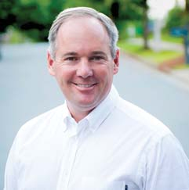
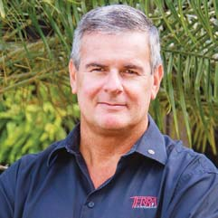
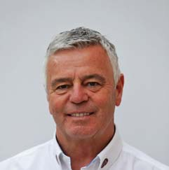

RACE STEWARDS BIOGRAPHIES

TIM MAYER

FIA ALTERNATE DELEGATE TO THE USA, FIA STEWARD,                                       

As the son of former McLaren team principal Teddy Mayer, Tim Mayer grew up                                                                                                                                                                                                                                     He also became VP of ACCUS, the US ASN. In 2003, Mayer became COO of                                                                            COO and Race Director of the American Le Mans Series. He was elected an independent Director of ACCUS and FIA US Alternate Delegate, responsible for US World Championship events. Tim is also a regular FIA World Endurance                                                                    

ANDREW MALLALIEU

PRESIDENT OF THE BARBADOS MOTORING FEDERATION;

FORMULA 1, WRC AND F3 STEWARD

Andrew Mallalieu’s 30-year plus involvement in motor sport spans rallying, hill climbs and circuit racing in Barbados and the greater Caribbean region.                                                                           served as a steward at a wide variety of events including rounds of the FIA                                                                                                                                                   include ownership of the Terra Caribbean Group where he is the Chief                                                                           estate development issues.

DEREK WARWICK

FORMER FORMULA 1 DRIVER AND WORLD SPORTSCAR                                               COMMISSION

Derek Warwick raced in 146 grands prix from 1981 to 1993, appearing for Toleman, Renault, Brabham, Arrows and Lotus. He scored 71 points and                                                                              Champion in 1992, driving for Peugeot. He also won Le Mans in the same year. He raced Jaguar sportscars in 1986 and 1991 and competed in the                                                                                                                                                         Currently Vice-President of the FIA Drivers’ Commission, Warwick is a frequent                                                                                Club.
