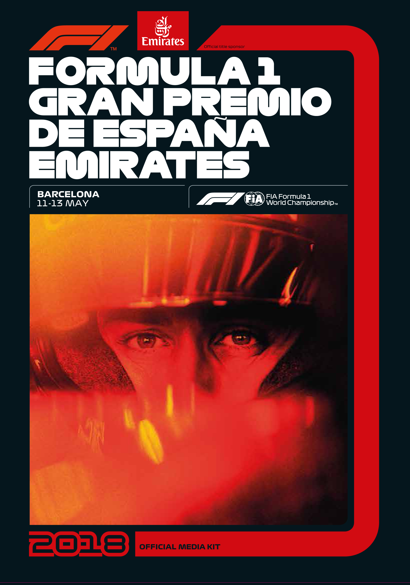
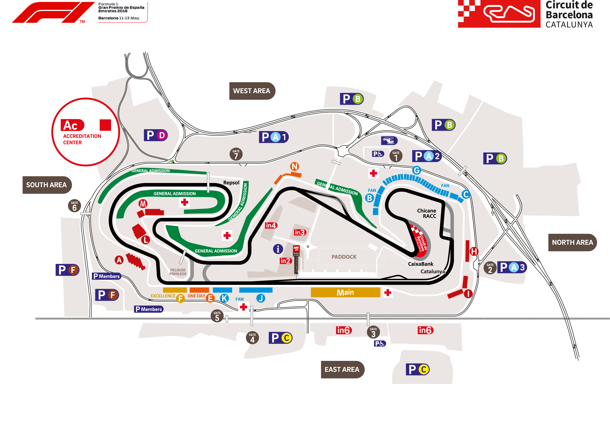
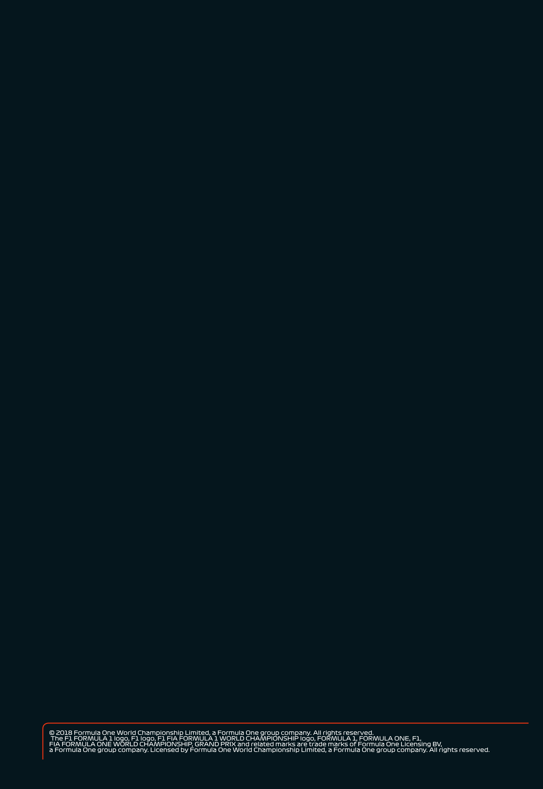

Formula 1 Official Formula 1™ Media Kit Gran Premio de España Emirates 2018

Barcelona 11-13 May

2018 FIA Formula One™

World Championship

F1 GRAN PREMIO DE ESPAÑA EMIRATES

2018

11 – 13 May 2018

Circuit de Barcelona-Catalunya

Mas “La Moreneta” P.O. Box 27 Tel. (+34) 935 719 709 08160 Montmeló media@circuitcat.com Barcelona – Spain www.circuitcat.com

The F1 FORMULA 1 logo, F1 logo, F1 FIA FORMULA 1 WORLD CHAMPIONSHIP logo, FORMULA 1, FORMULA ONE, F1, FIA FORMULA ONE WORLD CHAMPIONSHIP, GRAND PRIX and related marks are trade marks of Formula One Licensing BV, a Formula One group company. Licensed by Formula One World Championship Limited, a Formula One group company. All rights reserved.

Formula 1 Official Formula 1™ Media Kit Gran Premio de España Emirates 2018

Barcelona 11-13 May

TABLE OF CONTENTS

Time Schedule FORMULA 1 GRAN PREMIO DE ESPAÑA EMIRATES 2018

Welcome to Circuit de Barcelona-Catalunya

The Circuit de Barcelona-Catalunya in detail

Recommendations to get to Circuit de Barcelona-Catalunya

Media Centre Operation

Formula One Press Conference Schedule

2011/2017 Spanish Grand Prix results

Media Contacts

FORMULA 1 GRAN PREMIO DE ESPAÑA EMIRATES 2018 Officials

2018 Circuit de Barcelona-Catalunya Race Calendar

2018 FIA Formula One World Championship™ Calendar

2018 FIA Formula One World Championship™ Entry list

2018 FIA Formula One World Championship™ Classification

Drivers and Teams Statistics

2018 FIA Formula One World Championship™: Australia, Bahrain, China and Azerbaijan

Appendix

Circuit general map, grandstands and giant screens

The Formula One Spanish Grand Prix 1913-2017

Circuit de Barcelona-Catalunya

Mas “La Moreneta” P.O. Box 27 Tel. (+34) 935 719 709 08160 Montmeló media@circuitcat.com Barcelona – Spain www.circuitcat.com

The F1 FORMULA 1 logo, F1 logo, F1 FIA FORMULA 1 WORLD CHAMPIONSHIP logo, FORMULA 1, FORMULA ONE, F1, FIA FORMULA ONE WORLD CHAMPIONSHIP, GRAND PRIX and related marks are trade marks of Formula One Licensing BV, a Formula One group company. Licensed by Formula One World Championship Limited, a Formula One group company. All rights reserved.

Formula 1 Official Formula 1™ Media Kit Gran Premio de España Emirates 2018

Barcelona 11-13 May

TIME SCHEDULE

| THURSDAY, 10th May |  |  |
| --- | --- | --- |
| 16.00 - 18.00 | Formula 1 | Autograph Session |
| 16.00-18.30 | Formula 1 | Pit Lane Walk |
| 18.00-18.30 | Circuit Activity | Karting driver demo with F1 Drivers |
| FRIDAY, 11th May |  |  |
| 09.30 – 10.15 | GP3 Series | Practice Session |
| 11.00 - 12.30 | Formula 1 | 1st Practice Session |
| 13.00 - 13.45 | FIA Formula 2 | Practice Session |
| 15.00 - 16.30 | Formula 1 | 2nd Practice Session |
| 16.55 - 17.25 | FIA Formula 2 | Qualifying Session |
| 17.50 - 18.20 | GP3 Series | Qualifying Session |
| 18.45 - 19.30 | Porsche Mobil 1 Supercup | Practice Session |
| 19.40 - 19.50 | Track Activity | F1 2 Seater (1 x 2 laps) |
| SATURDAY, 12th May |  |  |
| 10.15 | GP3 Series | 1st Race - 22 laps or 40' |
| 11.15 - 11.25 | Track Activity | F1 2 Seater (1 x 2 laps) |
| 12.00 - 13.00 | Formula 1 | 3rd Practice Session |
| 13.30 - 14.00 | Porsche Mobil 1 Supercup | Qualifying Session |
| 15.00 - 16.00 | Formula 1 | Qualifying Session |
| 16.40 | FIA Formula 2 | 1st Race - 37 laps or 60' |
| 18.00 - 18.30 | Track Activity | F1 2 Seater (2 x 2 laps) |
| 18.00 - 19.00 | Formula 1 | Fan Forum (Fanzone stage) |
| 19.00 - 20.00 | Circuit Activity | Run The Track |
| SUNDAY, 13th May |  |  |
| 09.00 - 09.30 | Track Activity | F1 2 Seater (2 x 2 laps) |
| 10.25 | GP3 Series | 2nd Race - 17 laps or 30' |
| 11.30 | FIA Formula 2 | 2nd Race - 26 laps or 45' |
| 12.45 | Porsche Mobil 1 Supercup | Race - 14 laps or 30' |
| 13.30 - 13.50 | Formula 1 | Drivers Track Parade |
| 13.50 - 14.00 | Track Activity | F1 2 Seater (1 x 2 laps) |
| 14.10 - 14.25 | Formula 1 | Starting Grid Presentation |
| 14.56 | Formula 1 | Anthems |
| 15.10 | Formula 1 | GRAND PRIX - 66 laps or 120' |

This schedule is subject to changes

Circuit de Barcelona-Catalunya

Mas “La Moreneta” P.O. Box 27 Tel. (+34) 935 719 709 08160 Montmeló media@circuitcat.com Barcelona – Spain www.circuitcat.com

The F1 FORMULA 1 logo, F1 logo, F1 FIA FORMULA 1 WORLD CHAMPIONSHIP logo, FORMULA 1, FORMULA ONE, F1, FIA FORMULA ONE WORLD CHAMPIONSHIP, GRAND PRIX and related marks are trade marks of Formula One Licensing BV, a Formula One group company. Licensed by Formula One World Championship Limited, a Formula One group company. All rights reserved.

Formula 1 Official Formula 1™ Media Kit Gran Premio de España Emirates 2018

Barcelona 11-13 May

WELCOME TO CIRCUIT DE

BARCELONA-CATALUNYA

On 11, 12 and 13 May, the Formula 1 World Schumacher, Jacques Villeneuve, Mika

Championship will make its usual stop at Häkkinen, Kimi Räikkönen, Fernando

Circuit de Barcelona-Catalunya in order to Alonso, Felipe Massa, Jenson Button, Mark

stage the fifth round of the calendar, the Webber, Sebastian Vettel, Pastor

FORMULA 1 GRAN PREMIO DE ESPAÑA Maldonado, Lewis Hamilton, Nico Rosberg

EMIRATES 2018. The venue, a consolidated and Max Verstappen.

racetrack that is much appreciated by the

premier class of motor sports, will be Excitement and equality: the home Grand

hosting the event for the 28th consecutive Prix never disappoints. 10 different winners

year, a milestone that only a few circuits in the past 11 years. Only Lewis Hamilton

have been able to achieve. Before starting has been able to take the victory twice. And

the engines of the single-seaters it is precisely the current world champion

unofficially, the Circuit was able to reveal to who arrives in Barcelona leading the

the world all of the novelties and changes standings of the FIA Formula 1 World

for this season’s championship during the Championship™, fighting for the top

staging of the complete pre-season testing. position against a three-time world

champion, Sebastian Vettel. The Ferrari

The first F1 Grand Prix on the Catalan driver has four points less than the

racetrack was staged on 29 September, Mercedes driver, after taking two out of

1991, only 19 days after the inauguration of four possible victories. Four races have been

the facilities. It was a dream come true for staged so far, namely in Australia, Bahrain,

many fans, which was achieved after 16 China and Azerbaijan, and they were

years of absence of F1 in Catalonia. The enough to confirm that the championship is

romance between the top class of car racing unpredictable. The British driver was only

and Catalonia was back with Circuit de able to step onto the top of the podium

Barcelona-Catalunya, taking over from the once, in Baku, after 51 laps of constant

races that had been staged in Terramar, frights.

Pedralbes and Montjuïc. Along these years,

Circuit de Barcelona-Catalunya has Right behind them in the standings is Kimi

witnessed seventeen different winners on Räikkönen, with three podium finishes.

the top of the podium, eleven of which Circuit de Barcelona-Catalunya will be

became world champions: Nigel Mansell, witness to all of the pending battles, such as

Alain Prost, Damon Hill, Michael those between the Red Bull drivers Daniel

Circuit de Barcelona-Catalunya

Mas “La Moreneta” P.O. Box 27 Tel. (+34) 935 719 709 08160 Montmeló media@circuitcat.com Barcelona – Spain www.circuitcat.com

The F1 FORMULA 1 logo, F1 logo, F1 FIA FORMULA 1 WORLD CHAMPIONSHIP logo, FORMULA 1, FORMULA ONE, F1, FIA FORMULA ONE WORLD CHAMPIONSHIP, GRAND PRIX and related marks are trade marks of Formula One Licensing BV, a Formula One group company. Licensed by Formula One World Championship Limited, a Formula One group company. All rights reserved.

Formula 1 Official Formula 1™ Media Kit Gran Premio de España Emirates 2018

Barcelona 11-13 May

Ricciardo and Max Verstappen, who Barcelona-Catalunya, the hotel

collided and were not able to finish the last accommodation capacity in the region and

Grand Prix. Valtteri Bottas, forth in the the city of Barcelona – only 35 km away from

provisional standings, will try to join the the Circuit – as a worldwide first class tourist

party of the top drivers and cut back the destination, turn the FORMULA 1 GRAN

points to the leader, especially after having PREMIO DE ESPAÑA EMIRATES 2018 into

to hand him over the victory due to a flat one of the most attractive Grands Prix in

tyre that took away every option. the calendar of the F1® World

Championship.

The start of the season is being quite

different for one of the home drivers, Spectators can choose from a competitive

Fernando Alonso. The Spaniard, who had ticket offer, going from the general

been forced to retire four times last year at admittance area to 14 different

this stage of the season, is currently fighting grandstands, two of which are available per

to be among the top 5. He is sixth in the days (E and N), and are located in the most

overall standings and everything seems to interesting sections of the track. The ticket

predict that the Spanish Grand Prix will be for the event, the Circuit Member card and

positive and thrilling for him, with many the Circuit Official card, as well as the

options to offer fans an exciting time with Hospitality pass offer several advantages to

his battles on the track. And we will enjoy enjoy the city of Barcelona and its

the exhibition of talent by Carlos Sainz, the surroundings after spending the day at the

other home representative. At the wheel of Grand Prix, e.g. the Camp Nou Experience or

his Renault, the Spaniard has been able to visiting La Roca Village.

lap on fourth position during a race, facing

up to the heavy weights of the Unique experiences and proposals from 10

Championship. A cocktail of ingredients that to 13 May that will enable everybody to

will turn the FORMULA 1 GRAN PREMIO DE experience the Grand Prix their own way,

ESPAÑA EMIRATES 2018 into a great show. combining motor sports and an unmatched

atmosphere at all times.

An unforgettable experience at Circuit de

Barcelona-Catalunya This year, the event will include a space for

the whole family. The Family Village located

All fans attending the FORMULA 1 GRAN at the former heliport and the forest area,

PREMIO DE ESPAÑA EMIRATES 2018 will will offer animation and activities

have the chance to enjoy an unforgettable throughout the weekend (from 10:00 to

experience, watching the F1® show live in 17:00h). A chill out area, food trucks and live

benchmark facilities with high quality music for the older, with DJs that will liven

services. The comfort of the spectator areas, up the day, while the youngest will have the

the catering offer, the excellent chance to enjoy the children’s area with

communications to get to Circuit de clowns, crafts, a ball pool and a concert of

Circuit de Barcelona-Catalunya

Mas “La Moreneta” P.O. Box 27 Tel. (+34) 935 719 709 08160 Montmeló media@circuitcat.com Barcelona – Spain www.circuitcat.com

The F1 FORMULA 1 logo, F1 logo, F1 FIA FORMULA 1 WORLD CHAMPIONSHIP logo, FORMULA 1, FORMULA ONE, F1, FIA FORMULA ONE WORLD CHAMPIONSHIP, GRAND PRIX and related marks are trade marks of Formula One Licensing BV, a Formula One group company. Licensed by Formula One World Championship Limited, a Formula One group company. All rights reserved.

Formula 1 Official Formula 1™ Media Kit Gran Premio de España Emirates 2018

Barcelona 11-13 May

the mythic children’s series Fraggle Rock... the day of the traditional Pit Lane

and to immortalise the moment, a podium Walkabout (16:00 - 18:30h), to meet the

with photocall. Like every year, the Kids drivers of the premier class of motor sports;

Zone will provide the youngest with a lot of followed by an activity on the karting track

fun. Under constant surveillance, they will of the Circuit. Some of the F1 drivers will

enjoy inflatables, slot cars, games, make-up take part in an exhibition with the youngest,

and a lot more. in order to support a modality that acts as a

driver’s school, and which many of them

The representation of the popular culture practised as well.

will be brought by the drums of the

‘batucaires’, the castellers’ with their On Saturday afternoon, fans will have

human towers and the giants. More than another chance to get closer to some of

1000 people will be providing the public their idols in the Fan Zone, with a stage that

with non-stop animation. The Circuit wants will be the venue of the Fan Forum. At

fans to feel the joy, the thrill and the noise, 19:00h runners will be able to run a lap

not only that of the single-seaters, but of around the track. Run the Track will offer

rhythm and music. Therefore, all of them the chance to run in a unique surrounding,

will be welcomed, and the grandstands will just one day before the staging of the Grand

have constant animation. Prix.

In order to reclaim urban art, 4 graffiti And Sunday couldn’t offer less, in order to

painters will be performing their particular round-off a unique weekend. In addition to

work of art in different modalities: 3D the Driver’s Parade a few minutes before

graffiti, graffiti on tyres, on a car shell and the start of the race, there will be the

personalising caps and t-shirts. Music will be Opening Ceremony with one of the most

present to provide these spaces with a thrilling moments. A group of ‘Tabalers’

special atmosphere and to create a (Catalan drummers) and 80 dancers will get

complete and different experience. onto the main straight to provide for

unforgettable moments. After the race

The Circuit will provide for electric vehicles finish, the fans will be able to get onto the

for people with disabilities that, together track, only a few moments after the

with Red Cross volunteers, will take them to professional drivers, to experience the

any point inside the facilities. prize-giving on the podium up close, with

the post-race track invasion.

But the FORMULA 1 GRAN PREMIO DE

ESPAÑA EMIRATES 2018 will also provide for

four days of non-stop thrill. Thursday will be

NOTE: The complete version of the Media Kit is available on the FIA website (www.fia.com)

Circuit de Barcelona-Catalunya

Mas “La Moreneta” P.O. Box 27 Tel. (+34) 935 719 709 08160 Montmeló media@circuitcat.com Barcelona – Spain www.circuitcat.com

The F1 FORMULA 1 logo, F1 logo, F1 FIA FORMULA 1 WORLD CHAMPIONSHIP logo, FORMULA 1, FORMULA ONE, F1, FIA FORMULA ONE WORLD CHAMPIONSHIP, GRAND PRIX and related marks are trade marks of Formula One Licensing BV, a Formula One group company. Licensed by Formula One World Championship Limited, a Formula One group company. All rights reserved.

Formula 1 Official Formula 1™ Media Kit Gran Premio de España Emirates 2018

Barcelona 11-13 May

CIRCUIT DE BARCELONA-CATALUNYA

IN DETAIL

| Name |  | Circuit de Barcelona-Catalunya |
| --- | --- | --- |
| Address |  | Mas La Moreneta P.O. Box 27 08160 Montmeló (Barcelona-Spain) Tel. +34 93 571 97 00 \| Fax +34 93 572 97 72 http://www.circuitcat.com Radio: Ràdio Circuit 103.2 FM (Catalan/Spanish) 98.0 FM (English) |
| President | General Manager | Vicenç Aguilera Joan Fontserè |
| History |  | Works began 24th February 1989 (First Stone) Official opening: 10th September 1991 1st official competition: 15-09-1991 CET 1st Formula 1® GP: 29-09-1991 Spanish GP 1st Motorcycling GP: 31-05-1992 European GP |
| Sport events organisation |  | Circuit de Barcelona-Catalunya (Sports Department) and RACC (Royal Automobile Club of Catalonia) |
| Technical features of the GP track |  | Length of track: 4.655 metres Length of main straight: 1.047 metres Minimum width of track: 11 metres Width of main straight: 12 metres Number of Bends: 16 Bends to the right: 9 Bends to the left: 7 |
| Record |  | Ahead as the racetrack with the major number of spectators in an F1® race in 2007 |
| Sport Records F1 |  | Pole Mark Webber (Red Bull) 1:19.995 – Spanish GP 10 Fastest Lap Kimi Räikkönen (Ferrari) 1:21.670 – Spanish GP 08 |

Circuit de Barcelona-Catalunya

Mas “La Moreneta” P.O. Box 27 Tel. (+34) 935 719 709 08160 Montmeló media@circuitcat.com Barcelona – Spain www.circuitcat.com

The F1 FORMULA 1 logo, F1 logo, F1 FIA FORMULA 1 WORLD CHAMPIONSHIP logo, FORMULA 1, FORMULA ONE, F1, FIA FORMULA ONE WORLD CHAMPIONSHIP, GRAND PRIX and related marks are trade marks of Formula One Licensing BV, a Formula One group company. Licensed by Formula One World Championship Limited, a Formula One group company. All rights reserved.

Formula 1 Official Formula 1™ Media Kit Gran Premio de España Emirates 2018

Barcelona 11-13 May

Location

The Circuit de Barcelona-Catalunya forms part Barcelona is one of the main European cities and of the elite of the world circuits and every year today one of the axes of the Mediterranean receives the great motor sports event: the economy and the South of Europe. FORMULA 1 GRAN PREMIO DE ESPAÑA EMIRATES 2018. Thanks to its privileged The beaches of the Maresme, Costa Brava, Costa location, it is also able to offer a multitude of Daurada, Costa de Garraf, the Roman remains of options as a great tourist attraction. Tarragona or the Pyrenees are other of the options available to visit. The Circuit is alongside the AP7 motorway, which connects France with Catalonia, Madrid Catalonia is a leading tourist destination which and Zaragoza, and closer to the airports at offers many attractions for any kind of visit: Girona (60 km) and Barcelona (35 km), which cultural, resting, nature, family, business... A connect the Circuit with the whole world. great welcoming capacity and excellent facilities turn it into one of the leading tourist regions of Just 30 minutes from Barcelona, on your stay, Europe. you can visit the city and admire its fantastic architecture: the Sagrada Família Cathedral, the With over 24 million tourists a year, Catalonia is Gothic Quarter, the Rambles... The city of the leading tourist destination in Spain.

Circuit de Barcelona-Catalunya

Mas “La Moreneta” P.O. Box 27 Tel. (+34) 935 719 709 08160 Montmeló media@circuitcat.com Barcelona – Spain www.circuitcat.com

The F1 FORMULA 1 logo, F1 logo, F1 FIA FORMULA 1 WORLD CHAMPIONSHIP logo, FORMULA 1, FORMULA ONE, F1, FIA FORMULA ONE WORLD CHAMPIONSHIP, GRAND PRIX and related marks are trade marks of Formula One Licensing BV, a Formula One group company. Licensed by Formula One World Championship Limited, a Formula One group company. All rights reserved.

Formula 1 Official Formula 1™ Media Kit Gran Premio de España Emirates 2018

Barcelona 11-13 May

RECOMMENDATIONS FOR HELPING TO MAKE

THE ORGANISATIONAL SIDE A SUCCESS

The finest organisational work on the sports side -The Spanish railway company Renfe will be must go hand in hand with a suitable welcome reinforcing its line-2 regional-train service for the enthusiasts, from the time they spend on from Barcelona by putting extra places to the road to when they take up positions at the facilitate getting to the F1® Grand Prix. Renfe Circuit, and good arrangements for the media will be putting on special trains linking and clients of the various hospitality areas. Barcelona and Montmeló. Once at Getting everyone into and out of last year's Montmeló, there are three ways of getting to Formula One Grand Prix was handled very Circuit de Barcelona-Catalunya: using a successfully. This year Circuit de Barcelona- special shuttle service, by taxi or going on Catalunya will be ready again to take on the foot, which takes about 30 minutes challenge of achieving maximum fluidity in the (www.renfe.es). access points. The basic recommendations are these: > Taking advantage of the areas set aside for private vehicles > Use public transport Recommended exits from the AP7 motorway In addition to studying various options with and the C17 main road are shown for getting to Catalonia's police force (Mossos d’Esquadra) for the Media Car Park, as well as for getting to the getting to and leaving the Circuit in such a way other car parks at the surroundings of the as to keep traffic problems down to a minimum, Circuit. the Circuit will be continuing to offer options for getting to Montmeló by public transport: > Follow instructions from the police and the organisation staff - The Sagalés coach company will be making Take note of the information posters put up it possible to get to the GP by coach from outside and inside the Circuit de Barcelona- Barcelona. The bus stop is located in the Catalunya. For security reasons, no cans, Barcelona North Bus Station, platforms 25, bottles, fireworks or any other potentially 26 and 27, and arrives at the Eastern Area of dangerous objects may be brought into the the Circuit. Tickets cost 15 euros and Circuit. reservations can be made from the Sagalés company (www.sagales.com - tel. 902 13 00 14).

Circuit de Barcelona-Catalunya

Mas “La Moreneta” P.O. Box 27 Tel. (+34) 935 719 709 08160 Montmeló media@circuitcat.com Barcelona – Spain www.circuitcat.com

The F1 FORMULA 1 logo, F1 logo, F1 FIA FORMULA 1 WORLD CHAMPIONSHIP logo, FORMULA 1, FORMULA ONE, F1, FIA FORMULA ONE WORLD CHAMPIONSHIP, GRAND PRIX and related marks are trade marks of Formula One Licensing BV, a Formula One group company. Licensed by Formula One World Championship Limited, a Formula One group company. All rights reserved.

Formula 1 Official Formula 1™ Media Kit Gran Premio de España Emirates 2018

Barcelona 11-13 May

INFORMATION FOR MEDIA

Circuit de Barcelona-Catalunya

Mas “La Moreneta” P.O. Box 27 Tel. (+34) 935 719 709 08160 Montmeló media@circuitcat.com Barcelona – Spain www.circuitcat.com

The F1 FORMULA 1 logo, F1 logo, F1 FIA FORMULA 1 WORLD CHAMPIONSHIP logo, FORMULA 1, FORMULA ONE, F1, FIA FORMULA ONE WORLD CHAMPIONSHIP, GRAND PRIX and related marks are trade marks of Formula One Licensing BV, a Formula One group company. Licensed by Formula One World Championship Limited, a Formula One group company. All rights reserved.

Formula 1 Official Formula 1™ Media Kit Gran Premio de España Emirates 2018

Barcelona 11-13 May

MEDIA CENTRE OPERATION

|  | Accreditation Centre | Press Room |
| --- | --- | --- |
| Thursday | 8.00 h - 18.00 h | 9.00 h - 22.00 h |
| Friday | 8.00 h - 16.00 h | 7.00 h - 23.00 h |
| Saturday | 8.00 h - 12.00 h | 7.00 h - 23.00 h |
| Sunday | 8.00 h - 12.00 h | 7.00 h – until last journalist leaves |

Journalists and photographers will be all working at the Press Room, located in the paddock,

on the first floor of the pit garages building.

Welcome Desk

At the Welcome Desk, journalists and photographers can ask for:

 Seat in the Press Room

 Internet connection (15 Euros/day)

 Private telephone lines

 Locker

 Official Media Kit

FIA permanent pass holders must sign the attendance list and can pick up their car park sticker

for the Monaco Grand Prix. Also at the Welcome Desk, the national and international

photographers will have to pick up their tabard and the Photographers’ Bulletin.

Telecom Desk

The Telecom Desk offers to all media representatives a free of charge service for using

telephones, fax machines and computers with Internet connection and the possibility to print

in the Press Room.

Media Car Park Shuttle Service

A shuttle service will be available to ease the journalists and photographers’ transfers from

the Media Car Park to the Media Centre and vice versa. The starting point is next to the Control

Tower.

Circuit de Barcelona-Catalunya

Mas “La Moreneta” P.O. Box 27 Tel. (+34) 935 719 709 08160 Montmeló media@circuitcat.com Barcelona – Spain www.circuitcat.com

The F1 FORMULA 1 logo, F1 logo, F1 FIA FORMULA 1 WORLD CHAMPIONSHIP logo, FORMULA 1, FORMULA ONE, F1, FIA FORMULA ONE WORLD CHAMPIONSHIP, GRAND PRIX and related marks are trade marks of Formula One Licensing BV, a Formula One group company. Licensed by Formula One World Championship Limited, a Formula One group company. All rights reserved.

Formula 1 Official Formula 1™ Media Kit Gran Premio de España Emirates 2018

Barcelona 11-13 May

Photobus service for photographers around the service track

A photobus service will be available to ease the photographers’ transfers around the service

track. The starting point is next to the Control Tower and the timetable will be as follows:

| Practice sessions/ Qualifying session | First departure 60’ before the start of the session. Last departure 40’ before the start of the session. Pick up 5’/10’ after the chequered flag (several trips over at least half an hour) |
| --- | --- |
| Race | First departure 90’ before the starting time of the race. Last departure 75’ before the start of the race No pick up. |

Other services in the Press Room:

 Catering service will be offered to all the media representatives in the Media Lounge

(Corporate Lounge/Piso Box n. 29, on the first floor of the pit garages building).

 Free of charge camera repair service will be available in the Press Room for all the

photographers accredited.

It must be outlined that all radio and/or television broadcasts from the Press Room are

prohibited, unless specific authorisation has been obtained from the FIA F1 Head of

Communications.

Circuit de Barcelona-Catalunya

Mas “La Moreneta” P.O. Box 27 Tel. (+34) 935 719 709 08160 Montmeló media@circuitcat.com Barcelona – Spain www.circuitcat.com

The F1 FORMULA 1 logo, F1 logo, F1 FIA FORMULA 1 WORLD CHAMPIONSHIP logo, FORMULA 1, FORMULA ONE, F1, FIA FORMULA ONE WORLD CHAMPIONSHIP, GRAND PRIX and related marks are trade marks of Formula One Licensing BV, a Formula One group company. Licensed by Formula One World Championship Limited, a Formula One group company. All rights reserved.

Formula 1 Official Formula 1™ Media Kit Gran Premio de España Emirates 2018

Barcelona 11-13 May

FORMULA 1 PRESS CONFERENCE

SCHEDULE

Thursday- 15:00h- Press Conference Room

A maximum of six drivers chosen by the FIA F1 Head of Communications.

Friday- 13:00h- Press Conference Room

A maximum of six team personalities chosen by the FIA F1 Head of Communications.

Saturday- After the qualifying- Press Conference Room

Post-Qualifying Press Conference with top three drivers of the qualifying session.

TV interview with top three drivers of the qualifying session.

Sunday- After the race- Press Conference Room

Post Race Press Conference with top three finishing drivers.

TV interview with top three finishing drivers.

ADDITIONAL MEDIA OPPORTUNITIES

•Qualifying: All drivers eliminated in Q1 or Q2 will be available for media interviews

immediately after the end of each session, as will drivers who participated in Q3, but who are

not required for the post-qualifying press conference, at the “TV Interview Area”, located at

the back of the FIA garage, paddock side.

•Race: Any driver retiring before the end of the race will be available for media interviews

after his return to the paddock. In addition, all drivers who finish the race outside the top

three will be available for media interviews immediately after the end of the race, at each

team's individual garage/hospitality or at the “TV Interview Area”.

•During the race: every team will make at least one senior spokesperson available for

interviews by officially accredited TV crews. A list of those nominated will be available in the

media centre.

Circuit de Barcelona-Catalunya

Mas “La Moreneta” P.O. Box 27 Tel. (+34) 935 719 709 08160 Montmeló media@circuitcat.com Barcelona – Spain www.circuitcat.com

The F1 FORMULA 1 logo, F1 logo, F1 FIA FORMULA 1 WORLD CHAMPIONSHIP logo, FORMULA 1, FORMULA ONE, F1, FIA FORMULA ONE WORLD CHAMPIONSHIP, GRAND PRIX and related marks are trade marks of Formula One Licensing BV, a Formula One group company. Licensed by Formula One World Championship Limited, a Formula One group company. All rights reserved.

Formula 1 Official Formula 1™ Media Kit Gran Premio de España Emirates 2018

Barcelona 11-13 May

2011 - 2017 SPANISH GRAND PRIX

FORMULA 1 GRAN PREMIO DE ESPAÑA SANTANDER 2011

| Starting Grid |  |  |  |  |  |
| --- | --- | --- | --- | --- | --- |
| Pos. | Driver | Team | Q1 | Q2 | Q3 |
| 1 | M. Webber | Red Bull Racing | 1:23.619 | 1:21.773 | 1:20.981 |
| 2 | S. Vettel | Red Bull Racing | 1:24.142 | 1:21.540 | 1:21.181 |
| 3 | L. Hamilton | Vodafone McLaren Mercedes | 1:24.370 | 1:22.148 | 1:21.961 |
| 4 | F. Alonso | Scuderia Ferrari Marlboro | 1:23.485 | 1:22.813 | 1:21.964 |
| 5 | J. Button | Vodafone McLaren Mercedes | 1:24.428 | 1:22.050 | 1:21.996 |
| 6 | V. Petrov | Lotus Renault GP | 1:23.069 | 1:22.948 | 1:22.471 |
| 7 | N. Rosberg | Mercedes GP Petronas F1 Team | 1:23.507 | 1:22.569 | 1:22.599 |
| 8 | F. Massa | Scuderia Ferrari Marlboro | 1:23.506 | 1:23.026 | 1:22.888 |
| 9 | P. Maldonado | AT&T Williams | 1:23.406 | 1:22.854 | 1:22.952 |
| 10 | M. Schumacher | Mercedes GP Petronas F1 Team | 1:22.960 | 1:22.671 | DNS |
| 11 | S. Buemi | Scuderia Toro Rosso | 1:23.962 | 1:23.231 | - |
| 12 | S. Pérez | Sauber F1 Team | 1:24.209 | 1:23.367 | - |
| 13 | J. Alguersuari | Scuderia Toro Rosso | 1:24.049 | 1:23.694 | - |
| 14 | K. Kobayashi | Sauber F1 Team | 1:23.656 | 1:23.702 | - |
| 15 | H. Kovalainen | Team Lotus | 1:25.874 | 1:25.403 | - |
| 16 | P. di Resta | Force India F1 Team | 1:24.332 | 1:26.126 | - |
| 17 | A.Sutil | Force India F1 Team | 1:24.648 | 1:26.571 | - |
| 18 | J. Trulli | Team Lotus | 1:26.521 | - | - |
| 19 | R. Barrichello | AT&T Williams | 1:26.910 | - | - |
| 20 | T. Glock | Marussia Virgin Racing | 1:27.315 | - | - |
| 21 | V. Liuzzi | HRT F1 Team | 1:27.809 | - | - |
| 22 | N. Karthikeyan | HRT F1 Team | 1:27.908 | - | - |
| 23 | J. d’Ambrosio | Marussia Virgin Racing | 1:28.556 | - | - |

| Race Classification |  |  |  |  |  |
| --- | --- | --- | --- | --- | --- |
| Pos. | Driver |  | Team |  | Time |
| 1 2 3 4 5 6 7 8 9 10 11 12 13 14 15 16 17 18 19 20 21 | S. Vettel L. Hamilton J. Button M. Webber F. Alonso M. Schumacher N. Rosberg N. Heidfeld S. Pérez K. Kobayashi V. Petrov P. di Resta A.Sutil S. Buemi P. Maldonado J. Alguersuari R. Barrichello J. Trulli T. Glock J. d’Ambrosio N. Karthikeyan | Red Bull Racing Vodafone McLaren Mercedes Vodafone McLaren Mercedes Red Bull Racing Scuderia Ferrari Marlboro Mercedes GP Petronas F1 Team Mercedes GP Petronas F1 Team Lotus Renault GP Sauber F1 Team Sauber F1 Team Lotus Renault GP Force India F1 Team Force India F1 Team Scuderia Toro Rosso AT&T Williams Scuderia Toro Rosso AT&T Williams Team Lotus Marussia Virgin Racing Marussia Virgin Racing HRT F1 Team |  | 1:39:03.301 1:39:03.931 1:39:38.998 1:39:51.267 1:39:13.856- 1 lap 1:39:31.695- 1 lap 1:39:32.570- 1 lap 1:39:33.015- 1 lap 1:39:53.605- 1 lap 1:39:58.323- 1 lap 1:40:11.150- 1 lap 1:40:17.511- 1 lap 1:40:23.337- 1 lap 1:40:29.839- 1 lap 1:40:30.081- 1 lap 1:39:13.809- 2 laps 1:39:15.964- 2 laps 1:40:11.203- 2 laps 1:40:27.140- 3 laps 1:39:18.879- 4 laps 1:39:10.631- 5 laps |  |
| Fastest lap: L. Hamilton McLaren 1:26.727 on lap 52 (193.227 km/h) |  |  |  |  |  |

Not classified: F. Massa; H. Kovalainen; V. Liuzzi

Circuit de Barcelona-Catalunya

Mas “La Moreneta” P.O. Box 27 Tel. (+34) 935 719 709 08160 Montmeló media@circuitcat.com Barcelona – Spain www.circuitcat.com

The F1 FORMULA 1 logo, F1 logo, F1 FIA FORMULA 1 WORLD CHAMPIONSHIP logo, FORMULA 1, FORMULA ONE, F1, FIA FORMULA ONE WORLD CHAMPIONSHIP, GRAND PRIX and related marks are trade marks of Formula One Licensing BV, a Formula One group company. Licensed by Formula One World Championship Limited, a Formula One group company. All rights reserved.

Formula 1 Official Formula 1™ Media Kit Gran Premio de España Emirates 2018

Barcelona 11-13 May

FORMULA 1 GRAN PREMIO DE ESPAÑA SANTANDER 2012

| Starting Grid |  |  |  |  |  |
| --- | --- | --- | --- | --- | --- |
| Pos. | Driver | Team | Q1 | Q2 | Q3 |
| 1 | L. Hamilton* | Vodafone McLaren Mercedes | 1:22.583 | 1:22.465 | 1:21.707 |
| 2 | P. Maldonado | Williams F1 Team | 1:23.380 | 1:22.105 | 1:22.285 |
| 3 | F. Alonso | Scuderia Ferrari | 1:23.276 | 1:22.862 | 1:22.302 |
| 4 | R. Grosjean | Lotus F1 Team | 1:23.248 | 1:22.667 | 1:22.424 |
| 5 | K. Raikkonen | Lotus F1 Team | 1:23.406 | 1:22.856 | 1:22.487 |
| 6 | S. Pérez | Sauber F1 Team | 1:24.261 | 1:22.773 | 1:22.533 |
| 7 | N. Rosberg | Mercedes AMG Petronas F1 Team | 1:23.370 | 1:22.882 | 1:23.005 |
| 8 | S. Vettel | Red Bull Racing | 1:23.850 | 1:22.884 | DNF |
| 9 | M. Schumacher | Mercedes AMG Petronas F1 Team | 1:23.757 | 1:22.904 | DNS |
| 10 | K. Kobayashi | Sauber F1 Team | 1:23.386 | 1:22.897 | - |
| 11 | J. Button | Vodafone McLaren Mercedes | 1:23.510 | 1:22.944 | - |
| 12 | M. Webber | Red Bull Racing | 1:23.592 | 1:22.977 | - |
| 13 | P. di Resta | Sahara Force India F1 Team | 1:23.852 | 1:23.125 | - |
| 14 | N. Hulkenberg | Sahara Force India F1 Team | 1:23.720 | 1:23.177 | - |
| 15 | J. Vergne | Scuderia Toro Rosso | 1:24.362 | 1:23.265 | - |
| 16 | D. Ricciardo | Scuderia Toro Rosso | 1:23.906 | 1:23.442 | - |
| 17 | F. Massa | Scuderia Ferrari | 1:23.886 | 1:23.444 | - |
| 18 | B. Senna | Williams F1 Team | 1:24.981 | - | - |
| 19 | V. Petrov | Caterham F1 Team | 1:25.277 | - | - |
| 20 | H. Kovalainen | Caterham F1 Team | 1:25.507 | - | - |
| 21 | C. Pic | Marussia F1 Team | 1:26.582 | - | - |
| 22 | T. Glock | Marussia F1 Team | 1:27.032 | - | - |
| 23 | P. de la Rosa | HRT F1 Team | 1:27.555 | - | - |
| 24 | N. Karthikeyan | HRT F1 Team | 1:31.122 | - | - |

* Failed to provide a compulsory fuel sample to the stewards of the meeting and demoted to the back of the grid

| Race Classification |  |  |  |  |  |
| --- | --- | --- | --- | --- | --- |
| Pos. | Driver |  | Team |  | Time |
| 1 2 3 4 5 6 7 8 9 10 11 12 13 14 15 16 17 18 19 | P. Maldonado F. Alonso K. Raikkonen R. Grosjean K. Kobayashi S. Vettel N. Rosberg L. Hamilton J. Button N. Hulkenberg M. Webber J. Vergne D. Ricciardo P. di Resta F. Massa H. Kovalainen V. Petrov T. Glock P. de la Rosa | Williams F1 Team Scuderia Ferrari Lotus F1 Team Lotus F1 Team Sauber F1 Team Red Bull Racing Mercedes AMG Petronas F1 Team Vodafone McLaren Mercedes Vodafone McLaren Mercedes Sahara Force India F1 Team Red Bull Racing Scuderia Toro Rosso Scuderia Toro Rosso Sahara Force India F1 Team Scuderia Ferrari Caterham F1 Team Caterham F1 Team Marussia F1 Team HRT F1 Team |  | 1:39:09.145 1:39:12.340 1:39:13.029 1:39:23.944 1:40:13.786 1:40:16.721 1:40:27.064 1:40:27.285 1:40:34.391- 1 lap 1:39:09.709- 1 lap 1:39:09.928- 1 lap 1:39:16.101- 1 lap 1:39:20.967- 1 lap 1:39:25.660- 1 lap 1:39:27.047- 1 lap 1:39:51.054- 1 lap 1:40:06.205- 1 lap 1:39:23.541- 2 laps 1:39:46.180- 3 laps |  |
| Fastest lap: R. Grosjean Lotus F1 Team 1:26.250 on lap 53 (194.295 km/h) |  |  |  |  |  |

Not classified: S. Pérez ; C. Pic; N. Karthikeyan; B. Senna; M. Schumacher

Circuit de Barcelona-Catalunya

Mas “La Moreneta” P.O. Box 27 Tel. (+34) 935 719 709 08160 Montmeló media@circuitcat.com Barcelona – Spain www.circuitcat.com

The F1 FORMULA 1 logo, F1 logo, F1 FIA FORMULA 1 WORLD CHAMPIONSHIP logo, FORMULA 1, FORMULA ONE, F1, FIA FORMULA ONE WORLD CHAMPIONSHIP, GRAND PRIX and related marks are trade marks of Formula One Licensing BV, a Formula One group company. Licensed by Formula One World Championship Limited, a Formula One group company. All rights reserved.

Formula 1 Official Formula 1™ Media Kit Gran Premio de España Emirates 2018

Barcelona 11-13 May

FORMULA 1 GRAN PREMIO DE ESPAÑA 2013

| Starting Grid |  |  |  |  |  |
| --- | --- | --- | --- | --- | --- |
| Pos. | Driver | Team | Q1 | Q2 | Q3 |
| 1 | N. Rosberg | Mercedes AMG Petronas F1 Team | 1:21.913 | 1:21.776 | 1:20.718 |
| 2 | L.Hamilton | Mercedes AMG Petronas F1 Team | 1:21.728 | 1:21.001 | 1:20.972 |
| 3 | S. Vettel | Infiniti Red Bull Racing | 1:22.158 | 1:21.602 | 1:21.054 |
| 4 | K. Raikkonen | Lotus F1 Team | 1:22.210 | 1:21.676 | 1:21.177 |
| 5 | F. Alonso | Scuderia Ferrari | 1:22.264 | 1:21.646 | 1:21.218 |
| 6 | F. Massa | Scuderia Ferrari | 1:22.492 | 1:21.978 | 1:21.219 |
| 7 | R. Grosjean | Lotus F1 Team | 1:22.613 | 1:21.998 | 1:21.308 |
| 8 | M. Webber | Infiniti Red Bull Racing | 1:22.342 | 1:21.718 | 1:21.570 |
| 9 | S. Perez | Vodafone McLaren Mercedes | 1:23.116 | 1:21.790 | 1:22.069 |
| 10 | P. di Resta | Sahara Force India | 1:22.663 | 1:22.019 | 1:22.233 |
| 11 | D. Ricciardo | Scuderia Toro Rosso | 1:22.905 | 1:22.127 | - |
| 12 | J. Vergne | Scuderia Toro Rosso | 1:22.775 | 1:22.166 | - |
| 13 | A. Sutil | Sahara Force India F1 Team | 1:22.952 | 1:22.346 | - |
| 14 | J. Button | Vodafone McLaren Mercedes | 1:23.166 | 1:22.355 | - |
| 15 | N. Hulkenberg | Sauber F1 Team | 1:23.058 | 1:22.389 | - |
| 16 | E. Gutierrez | Sauber F1 Team | 1:23.218 | 1:22.793 | - |
| 17 | V. Bottas | Williams F1 Team | 1:23.260 | - | - |
| 18 | P. Maldonado | Williams F1 Team | 1:23.318 | - | - |
| 19 | G. van der Garde | Caterham F1 Team | 1:24.661 | - | - |
| 20 | J. Bianchi | Marussia F1 Team | 1:24.713 | - | - |
| 21 | M. Chilton | Marussia F1 Team | 1:24.996 | - | - |
| 22 | C. Pic | Caterham F1 Team | 1:25.070 | - | - |

|  | Race Classification |  |  |  |  |  |
| --- | --- | --- | --- | --- | --- | --- |
|  | Pos. | Driver |  | Team |  | Time |
| 1 2 3 4 5 6 7 8 9 10 11 12 13 14 15 16 17 18 19 |  | F. Alonso K. Raikkonen F. Massa S. Vettel M. Webber N. Rosberg P. di Resta J. Button S. Perez D. Ricciardo E. Gutierrez L. Hamilton A. Sutil P. Maldonado N. Hulkenberg V. Bottas C. Pic J. Bianchi M. Chilton | Scuderia Ferrari Lotus F1 Team Scuderia Ferrari Infiniti Red Bull Racing Infiniti Red Bull Racing Mercedes AMG Petronas F1 Team Sahara Force India F1 Team Vodafone McLaren Mercedes Vodafone McLaren Mercedes Scuderia Toro Rosso Sauber F1 Team Mercedes AMG PetronasF1 Team Sahara Force India F1 Team Williams F1 Team Sauber F1 Team Williams F1 Team Caterham F1 Team Marussia F1 Team Marussia F1 Team |  | 1:39:16.596 1:39:25.934 1:39:42.645 1:39:54.869 1:40:04.559 1:40:24.616 1:40:25.584 1:40:36.102 1:40:38.334 1:39:22.402- 1 lap 1:39:22.706- 1 lap 1:39:27.565- 1 lap 1:39:28.040- 1 lap 1:39:45.740- 1 lap 1:39:47.162- 1 lap 1:40:35.040- 1 lap 1:40:37.441- 1 lap 1:39:20.860- 2 laps 1:39:48.230- 2 laps |  |
| Fastest lap: E. Gutierrez Sauber F1 Team 1:26.217 on lap 56 (194.370 km/h) |  |  |  |  |  |  |

Not classified: J. Vergne; G. van der Garde; R. Grosjean

Circuit de Barcelona-Catalunya

Mas “La Moreneta” P.O. Box 27 Tel. (+34) 935 719 709 08160 Montmeló media@circuitcat.com Barcelona – Spain www.circuitcat.com

The F1 FORMULA 1 logo, F1 logo, F1 FIA FORMULA 1 WORLD CHAMPIONSHIP logo, FORMULA 1, FORMULA ONE, F1, FIA FORMULA ONE WORLD CHAMPIONSHIP, GRAND PRIX and related marks are trade marks of Formula One Licensing BV, a Formula One group company. Licensed by Formula One World Championship Limited, a Formula One group company. All rights reserved.

Formula 1 Official Formula 1™ Media Kit Gran Premio de España Emirates 2018

Barcelona 11-13 May

FORMULA 1 GRAN PREMIO DE ESPAÑA PIRELLI 2014

| Starting Grid |  |  |  |  |  |
| --- | --- | --- | --- | --- | --- |
| Pos. | Driver | Team | Q1 | Q2 | Q3 |
| 1 | L. Hamilton | Mercedes AMG Petronas F1 Team | 1:27.238 | 1:26.210 | 1:25.232 |
| 2 | N. Rosberg | Mercedes AMG Petronas F1 Team | 1:26.764 | 1:26.088 | 1:25.400 |
| 3 | D. Ricciardo | Infiniti Red Bull Racing | 1:28.053 | 1:26.613 | 1:26.285 |
| 4 | V. Bottas | Williams Martini Racing | 1:28.198 | 1:27.563 | 1:26.632 |
| 5 | R. Grosjean | Lotus F1 Team | 1:28.472 | 1:27.258 | 1:26.960 |
| 6 | K. Raikkonen | Scuderia Ferrari | 1:28.308 | 1:27.335 | 1:27.104 |
| 7 | F. Alonso | Scuderia Ferrari | 1:28.329 | 1:27.602 | 1:27.140 |
| 8 | J. Button | McLaren Mercedes | 1:28.279 | 1:27.570 | 1:27.335 |
| 9 | F. Massa | Williams Martini Racing | 1:28.061 | 1:27.016 | 1:27.402 |
| 10 | S. Vettel | Infiniti Red Bull Racing | 1:27.958 | 1:27.052 | DNF |
| 11 | N. Hulkenberg | Sahara Force India F1 Team | 1:28.155 | 1:27.685 | - |
| 12 | S. Perez | Sahara Force India F1 Team | 1:28.469 | 1:28.002 | - |
| 13 | D. Kvyat | Scuderia Toro Rosso | 1:28.074 | 1:28.039 | - |
| 14 | E. Gutierrez | Sauber F1 Team | 1:28.374 | 1:28.280 | - |
| 15 | K. Magnussen | McLaren Mercedes | 1:28.389 | DNF | - |
| 16 | J. Vergne | Scuderia Toro Rosso | 1:28.194 | - | - |
| 17 | A. Sutil | Sauber F1 Team | 1:28.563 | - | - |
| 18 | M. Chilton | Marussia F1 Team | 1:29.586 | - | - |
| 19 | J. Bianchi | Marussia F1 Team | 1:30.177 | - | - |
| 20 | M. Ericsson | Caterham F1 Team | 1:30.312 | - | - |
| 21 | K. Kobayashi | Caterham F1 Team | 1:30.375 | - | - |
| 22 | P. Maldonado | Lotus F1 Team | DNF | - | - |

|  | Race Classification |  |  |  |  |  |
| --- | --- | --- | --- | --- | --- | --- |
|  | Pos. | Driver |  | Team |  | Time |
| 1 2 3 4 5 6 7 8 9 10 11 12 13 14 15 16 17 18 19 20 |  | L. Hamilton N. Rosberg D. Ricciardo S. Vettel V. Bottas F. Alonso K. Raikkonen R. Grosjean S. Perez N. Hulkenberg J. Button K. Magnussen F. Massa D. Kvyat P. Maldonado E. Gutierrez A. Sutil J. Bianchi M. Chilton M. Ericsson | Mercedes AMG Petronas F1 Team Mercedes AMG Petronas F1 Team Infiniti Red Bull Racing Infiniti Red Bull Racing Williams Martini Racing Scuderia Ferrari Scuderia Ferrari Lotus F1 Team Sahara Force India F1 Team Sahara Force India F1 Team McLaren Mercedes McLaren Mercedes Williams Martini Racing Scuderia Toro Rosso Lotus F1 Team Sauber F1 Team Sauber F1 Team Marussia F1 Team Marussia F1 Team Caterham F1 Team |  | 1:41:05.155 1:41:05.791 1:41:54.169 1:42:21.857 1:42:24.448 1:42:32.898 1:41:08.447- 1 lap 1:41:21.479- 1 lap 1:41:22.577- 1 lap 1:41:32.981- 1 lap 1:41:37.467- 1 lap 1:41:38.124- 1 lap 1:41:38.705- 1 lap 1:41:46.961- 1 lap 1:41:55.021- 1 lap 1:42:15.363- 1 lap 1:42:18.487- 1 lap 1:41:29.297- 2 laps 1:42:09.988- 2 laps 1:42:30.846- 2 laps |  |
| Fastest lap: S. Vettel Red Bull Racing 1 :28.918 on lap 55 (188.465 km/h) |  |  |  |  |  |  |

Not classified: K. Kobayashi; J. Vergne

Circuit de Barcelona-Catalunya

Mas “La Moreneta” P.O. Box 27 Tel. (+34) 935 719 709 08160 Montmeló media@circuitcat.com Barcelona – Spain www.circuitcat.com

The F1 FORMULA 1 logo, F1 logo, F1 FIA FORMULA 1 WORLD CHAMPIONSHIP logo, FORMULA 1, FORMULA ONE, F1, FIA FORMULA ONE WORLD CHAMPIONSHIP, GRAND PRIX and related marks are trade marks of Formula One Licensing BV, a Formula One group company. Licensed by Formula One World Championship Limited, a Formula One group company. All rights reserved.

Formula 1 Official Formula 1™ Media Kit Gran Premio de España Emirates 2018

Barcelona 11-13 May

FORMULA 1 GRAN PREMIO DE ESPAÑA PIRELLI 2015

| Starting Grid |  |  |  |  |  |
| --- | --- | --- | --- | --- | --- |
| Pos. | Driver | Team | Q1 | Q2 | Q3 |
| 1 | N. Rosberg | Mercedes AMG Petronas F1 Team | 1:26.490 | 1:25.166 | 1:24.681 |
| 2 | L. Hamilton | Mercedes AMG Petronas F1 Team | 1:26.382 | 1:25.740 | 1:24.948 |
| 3 | S. Vettel | Scuderia Ferrari | 1:27.534 | 1:26.167 | 1:25.458 |
| 4 | V. Bottas | Williams Martini Racing | 1:27.262 | 1:26.197 | 1:25.694 |
| 5 | C. Sainz | Scuderia Toro Rosso | 1:26.773 | 1:26.475 | 1:26.136 |
| 6 | M. Verstappen | Williams Martini Racing | 1:27.393 | 1:26.441 | 1:26.249 |
| 7 | K. Räikkönen | Infiniti Red Bull Racing | 1:26.637 | 1:26.016 | 1:26.414 |
| 8 | D. Kvyat | Lotus F1 Team | 1:27.833 | 1:26.889 | 1:26.629 |
| 9 | F. Massa | Williams Martini Racing | 1:27.165 | 1:26.147 | 1:26.757 |
| 10 | D. Ricciardo | Infiniti Red Bull Racing | 1:27.611 | 1:26.692 | 1:26.770 |
| 11 | R. Grosjean | Lotus F1 Team | 1:27.383 | 1:27.375 | - |
| 12 | P. Maldonado | Lotus F1 Team | 1:27.281 | 1:27.450 | - |
| 13 | F. Alonso | McLaren Honda | 1:27.941 | 1:27.760 | - |
| 14 | J. Button | McLaren Honda | 1:27.813 | 1:27.854 | - |
| 15 | F. Nasr | Sauber F1 Team | 1:27.625 | 1:28.005 | - |
| 16 | M. Ericsson | Sauber F1 Team | 1:28.112 | - | - |
| 17 | N. Hulkenberg | Sahara Force India F1 Team | 1:28.365 | - | - |
| 18 | S. Perez | Sahara Force India F1 Team | 1:28.442 | - | - |
| 19 | W. Stevens | Manor Marussia F1 Team | 1:31.200 | - | - |
| 20 | R. Merhi | Manor Marussia F1 Team | 1:32.038 | - | - |

|  | Race Classification |  |  |  |  |  |  |
| --- | --- | --- | --- | --- | --- | --- | --- |
|  | Pos. |  | Driver |  | Team |  | Time |
| 1 2 3 4 5 6 7 8 9 10 11 12 13 14 15 16 17 18 |  | N. Rosberg L. Hamilton S. Vettel V. Bottas K. Räikkönen F. Massa D. Ricciardo R. Grosjean C. Sainz D. Kvyat M. Verstappen F. Nasr S. Perez M. Ericsson N. Hulkenberg J. Button W. Stevens R. Merhi |  | Mercedes AMG Petronas F1 Team Mercedes AMG Petronas F1 Team Scuderia Ferrari Williams Martini Racing Scuderia Ferrari Williams Martini Racing Infiniti Red Bull Racing Lotus F1 Team Scuderia Toro Rosso Infiniti Red Bull Racing Scuderia Toro Rosso Sauber F1 Team Sahara Force India F1 Team Sauber F1 Team Sahara Force India F1 Team McLaren Honda Manor Marussia F1 Team Manor Marussia F1 Team |  | 1:41:12.555 1:41:30.106 1:41:57.897 1:42:11.772 1:42:12.557 1:42:33.869 1:41:40.894 1:42:10:553 1:42:16.264 1:42:17:749 1:42:18.843 1:42:31.003 1:42:39.931 1:42:40.584 1:42:41.185 1:42:41.938 1:42:35.245 1:41:39.198 |  |
| Fastest lap: L. Hamilton Mercedes AMG Petronas F1 Team 1:28.270 on lap 54 (188.465 km/h) |  |  |  |  |  |  |  |

Not classified: P. Maldonado; F. Alonso

Circuit de Barcelona-Catalunya

Mas “La Moreneta” P.O. Box 27 Tel. (+34) 935 719 709 08160 Montmeló media@circuitcat.com Barcelona – Spain www.circuitcat.com

The F1 FORMULA 1 logo, F1 logo, F1 FIA FORMULA 1 WORLD CHAMPIONSHIP logo, FORMULA 1, FORMULA ONE, F1, FIA FORMULA ONE WORLD CHAMPIONSHIP, GRAND PRIX and related marks are trade marks of Formula One Licensing BV, a Formula One group company. Licensed by Formula One World Championship Limited, a Formula One group company. All rights reserved.

Formula 1 Official Formula 1™ Media Kit Gran Premio de España Emirates 2018

Barcelona 11-13 May

FORMULA 1 GRAN PREMIO DE ESPAÑA PIRELLI 2016

| Starting Grid |  |  |  |  |  |
| --- | --- | --- | --- | --- | --- |
| Pos. | Driver | Team | Q1 | Q2 | Q3 |
| 1 | L. Hamilton | Mercedes AMG Petronas F1 Team | 1:23.002 | 1:22.159 | 1:22.000 |
| 2 | N. Rosberg | Mercedes AMG Petronas F1 Team | 1:23.214 | 1:22.759 | 1:22.280 |
| 3 | D. Ricciardo | Infiniti Red Bull Racing | 1:23.796 | 1:23.585 | 1:22.680 |
| 4 | M. Verstappen | Infiniti Red Bull Racing | 1:23.578 | 1:23.178 | 1:23.087 |
| 5 | K. Räikkönen | Scuderia Ferrari | 1:23.796 | 1:23.504 | 1:23.113 |
| 6 | S. Vettel | Scuderia Ferrari | 1:24.124 | 1:23.688 | 1:23.334 |
| 7 | V. Bottas | Williams Martini Racing | 1:24.251 | 1:24.023 | 1:23.522 |
| 8 | C. Sainz | Scuderia Toro Rosso | 1:24.496 | 1:24.077 | 1:23.643 |
| 9 | S. Pérez | Sahara Force India F1 Team | 1:24.698 | 1.24.003 | 1:23.782 |
| 10 | F. Alonso | McLaren Honda | 1:24.578 | 1:24.192 | 1:23.981 |
| 11 | N. Hulkenberg | Sahara Force India F1 Team | 1:24.463 | 1:24.203 | - |
| 12 | J. Button | McLaren Honda | 1:24.583 | 1:24.348 | - |
| 13 | D. Kvyat | Scuderia Toro Rosso | 1:24.696 | 1:24.445 | - |
| 14 | R. Grosjean | Haas F1 Team | 1:24.716 | 1:24.480 | - |
| 15 | K. Magnussen | Renault F1 Team | 1:24.669 | 1:24.625 | - |
| 16 | E. Gutiérrez | Haas F1 Team | 1:24.406 | 1:24.778 | - |
| 17 | J. Palmer | Renault F1 Team | 1:24.903 | - | - |
| 18 | F. Massa | Williams Martini Racing | 1:24.941 | - | - |
| 19 | M. Ericsson | Sauber F1 Team | 1:25.202 | - | - |
| 20 | F. Nasr | Sauber F1 Team | 1:25.579 | - | - |
| 21 | P. Wehrkein | Manor Racing | 1:25.745 | - | - |
| 22 | R. Haryanto | Manor Racing | 1:25.939 | - | - |

|  | Race Classification |  |  |  |  |  |  |
| --- | --- | --- | --- | --- | --- | --- | --- |
|  | Pos. |  | Driver |  | Team |  | Time |
| 1 |  | M. Verstappen |  | Infiniti Red Bull Racing |  | 1:41:40.017 |  |
| 2 |  | K. Räikkönen |  | Scuderia Ferrari |  | 1:41:40.633 |  |
| 3 |  | S. Vettel |  | Scuderia Ferrari |  | 1:41:45.598 |  |
| 4 |  | D. Ricciardo |  | Infiniti Red Bull Racing |  | 1:42:23.967 |  |
| 5 |  | V. Bottas |  | Williams Martini Racing |  | 1:42:25.288 |  |
| 6 |  | C. Sainz |  | Scuderia Toro Rosso |  | 1:42:41.412 |  |
| 7 |  | S. Pérez |  | Sahara Force India F1 Team |  | 1:42:59.555 |  |
| 8 |  | F. Massa |  | Williams Martini Racing |  | 1:43:00.724 |  |
| 9 |  | J. Button |  | McLaren Honda |  | 1:41:42.447 |  |
| 10 |  | D. Kvyat |  | Scuderia Toro Rosso |  | 1:41:45.762 |  |
| 11 |  | E. Gutiérrez |  | Haas F1 Team |  | 1:41:53.405 |  |
| 12 |  | M. Ericsson |  | Sauber F1 Team |  | 1:42:21.247 |  |
| 13 |  | J. Palmer |  | Renault F1 Team |  | 1:42:26.844 |  |
| 14 |  | F. Nasr |  | Sauber F1 Team |  | 1:42:30.164 |  |
| 15 |  | K. Magnussen |  | Renault F1 Team |  | 1:42:39.630 |  |
| 16 |  | P. Wehrlein |  | Manor Racing |  | 1:42:54.927 |  |
| 17 |  | R. Haryanto |  | Manor Racing |  | 1:43:09.675 |  |
| Fastest lap: D. Kvyat Scuderia Toro Rosso 1:26.948 on lap 53 (192.735 km/h) |  |  |  |  |  |  |  |

Not classified: R. Grosjean; F. Alonso; N. Hülkenberg; L. Hamilton; N. Rosberg

Circuit de Barcelona-Catalunya

Mas “La Moreneta” P.O. Box 27 Tel. (+34) 935 719 709 08160 Montmeló media@circuitcat.com Barcelona – Spain www.circuitcat.com

The F1 FORMULA 1 logo, F1 logo, F1 FIA FORMULA 1 WORLD CHAMPIONSHIP logo, FORMULA 1, FORMULA ONE, F1, FIA FORMULA ONE WORLD CHAMPIONSHIP, GRAND PRIX and related marks are trade marks of Formula One Licensing BV, a Formula One group company. Licensed by Formula One World Championship Limited, a Formula One group company. All rights reserved.

Formula 1 Official Formula 1™ Media Kit Gran Premio de España Emirates 2018

Barcelona 11-13 May

FORMULA 1 GRAN PREMIO DE ESPAÑA PIRELLI 2017

| Starting Grid |  |  |  |  |  |
| --- | --- | --- | --- | --- | --- |
| Pos. | Driver | Team | Q1 | Q2 | Q3 |
| 1 | L. Hamilton | Mercedes AMG Petronas F1 Team | 1:20.551 | 1:20.210 | 1:19.149 |
| 2 | S. Vettel | Scuderia Ferrari | 1:20.939 | 1:20.295 | 1:19.200 |
| 3 | V. Bottas | Williams Martini Racing | 1:20.991 | 1:20.300 | 1:19.373 |
| 4 | K. Räikkönen | Scuderia Ferrari | 1:20.742 | 1:20.621 | 1:19.439 |
| 5 | M. Verstappen | Red Bull Racing | 1:21.430 | 1:20.722 | 1:19.706 |
| 6 | D. Ricciardo | Red Bull Racing | 1:21.704 | 1:20.855 | 1:20.175 |
| 7 | F. Alonso | McLaren Honda | 1:22.015 | 1:21.251 | 1:21.048 |
| 8 | S. Pérez | Sahara Force India F1 Team | 1:21.998 | 1:21.239 | 1:21.070 |
| 9 | F. Massa | Williams Martini Racing | 1:22.138 | 1.21.222 | 1:21.232 |
| 10 | E. Ocon | Sahara Force India F1 Team | 1:21.901 | 1:21.148 | 1:21.272 |
| 11 | K. Magnussen | Haas F1 Team | 1:21.945 | 1:21.329 | - |
| 12 | C. Sainz | Scuderia Toro Rosso | 1:21.941 | 1:21.371 | - |
| 13 | N. Hulkenberg | Renault Sport F1 Team | 1:22.091 | 1:21.397 | - |
| 14 | R. Grosjean | Haas F1 Team | 1:21.822 | 1:21.517 | - |
| 15 | P. Wehrlein | Sauber F1 Team | 1:22.327 | 1:21.803 | - |
| 16 | M. Ericsson | Sauber F1 Team | 1:22.332 | - | - |
| 17 | J. Palmer | Renault Sport F1 Team | 1:22.401 | - | - |
| 18 | L. Stroll | Williams Martini Racing | 1:22.411 | - | - |
| 19 | S. Vandoorne | McLaren Honda | 1:22.532 | - | - |
| 20 | D. Kvyat | Scuderia Toro Rosso | 1:22.746 | - | - |

|  | Race Classification |  |  |  |  |
| --- | --- | --- | --- | --- | --- |
|  | Pos. | Driver |  | Team | Time |
| 1 |  | L. Hamilton | Mercedes AMG Petronas F1 Team |  | 1:35:56.497 |
| 2 |  | S. Vettel | Scuderia Ferrari |  | 1:35:59.987 |
| 3 |  | D. Ricciardo | Red Bull Racing |  | 1:37:12.317 |
| 4 |  | S. Perez | Sahara Force India F1 Team |  | 1:36:25.760 |
| 5 |  | E. Ocon | Sahara Force India F1 Team |  | 1:36:37.102 |
| 6 |  | N. Hulkenberg | Renault Sport F1 Team |  | 1:37:00.685 |
| 7 |  | C. Sainz | Scuderia Toro Rosso |  | 1:37:06.506 |
| 8 |  | P. Wehrlein | Sauber F1 Team |  | 1:37:10.366 |
| 9 |  | D. Kvyat | Scuderia Toro Rosso |  | 1:37:19.845 |
| 10 |  | R. Grosjean | Haas F1 Team |  | 1:37:22.513 |
| 11 |  | M. Ericsson | Sauber F1 Team |  | 1:36:05.401 |
| 12 |  | F. Alonso | McLaren Honda |  | 1:36:16.847 |
| 13 |  | F. Massa | Williams Martini Racing |  | 1:36:22.327 |
| 14 |  | K. Magnussen | Haas F1 Team |  | 1:36:27.995 |
| 15 |  | J. Palmer | Renault Sport F1 Team |  | 1:36:29.251 |
| 16 |  | L. Stroll | Williams Martini Racing |  | 1:36:33.918 |
| Fastest lap: L. Hamilton Mercedes AMG Petronas F1 Team 1:23.593 on lap 64 (200.471 km/h) |  |  |  |  |  |

Not classified: V. Bottas; S. Vandoorne; M. Verstappen; K. Räikkönen

Circuit de Barcelona-Catalunya

Mas “La Moreneta” P.O. Box 27 Tel. (+34) 935 719 709 08160 Montmeló media@circuitcat.com Barcelona – Spain www.circuitcat.com

The F1 FORMULA 1 logo, F1 logo, F1 FIA FORMULA 1 WORLD CHAMPIONSHIP logo, FORMULA 1, FORMULA ONE, F1, FIA FORMULA ONE WORLD CHAMPIONSHIP, GRAND PRIX and related marks are trade marks of Formula One Licensing BV, a Formula One group company. Licensed by Formula One World Championship Limited, a Formula One group company. All rights reserved.

Formula 1 Official Formula 1™ Media Kit Gran Premio de España Emirates 2018

Barcelona 11-13 May

MEDIA CONTACTS

|  | Mercedes AMG Petronas Motorsport | Williams Martini Racing |
| --- | --- | --- |
| Head of Motorsports Communications: Bradley Lord +44 7785 682 893 – blord@mercedesamgf1.com Head of Content: Ben Cowley +44 7920 214 276 – bcowley@mercedes-amg-f1.com Media Officer: Rosa Herrero +44 7469 353 191 – rherrerovenegas@mercedesamgf1.com Digital Manager: Phillip Porter +44 1280 844 284 – pporter@mercedesamgf1.com Content Officer: Dan Paddock +44 1280 846 124 – dpaddock@mercedesamgf1.com |  | Head of Communications: Sophie Ogg +44 7977 27 5762 – sophie.ogg@williamsf1.com Press Officer: Jacques Heckstall-Smith +44 7788 317 639 – jacques.hsmith@williamsf1.com PR Manager - Lance Stroll: Ann Bradshaw +44 7713 317 006 – abc@annieb.co.uk |

|  | McLaren F1 Team | Red Bull Toro Rosso Honda |
| --- | --- | --- |
| Group Communications Director: Tim Bampton +44 7468 714 614– tim.bampton@mclaren.com Head of media and creative content: Steve Cooper +44 7881 426 460 – steve.cooper@mclaren.com Press Office Manager: Silvia Hoffer Frangipane +44 7584 218 639 – silvia.hoffer@mclaren.com PR & Media Manager: Charlotte Sefton +44 7500 065 321 – Charlotte.sefton@mclaren.com |  | Head of Communications: Fabiana Valenti +39 335 711 3694 – fabiana.valenti@tororosso.com Press Officer: Jennifer Seeber +39 348 609 5017 – jennifer.seeber@tororosso.com Social Media Specialist: Diego Mandolfo +39 340 795 1078 – diego.mandolfo@tororosso.com |

|  | Aston Martin Red Bull Racing | Scuderia Ferrari |
| --- | --- | --- |
| Head of Communications: Ben Wyatt +44 7771 854 238 – ben.wyatt@redbullracing.com Producer: Nikki Vasiliadis +44 07702 353327 – nikki.vasiliadis@redbullracing.com Communications Manager: Victoria Lloyd +44 7712 414 196 – Victoria.lloyd@redbullracing.com Communications Manager: James Ranson +44 7834 526 354 – james.ranson@redbullracing.com |  | Head of Motorsport Press Office: Alberto Antonini +39 344 0556635 – alberto.antonini@ferrari.com PR Coordinator: Gionata Giacobazzi +39 338 6476712 – jonathan.giacobazzi@ferrari.com Press Officer: Stefania Bocchi stefania.bocchi@ferrari.com Press Officer: Roberta Colleluori +39 334 6591343 – roberta.colleluori@ferrari.com Media & PR Consultant Sebastian Vettel: Britta Roeske +44 7764 386 402 – britta.roeske@sebastianvettel.com |

|  | Sahara Force India F1 Team | Renault Sport Formula One Team |
| --- | --- | --- |
| Communications Manager: Will Hings +44 7734 202 020 – will.hings@forceindiaf1.com Communications Coordinator: William Ponissi +44 7770 845 843 – William.ponissi@forceindiaf1.com |  | Head of Communications & Marketing: Louis Bordes +33 604656096 – louis.bordes@fr.renaultsports Head of Communications: Andy Stobart +44 7703 366 151 – andy.stobart@uk.renaultsportracing.com Media Communications Manager: Clarisse Hoffmann +44 7747 468 273 – clarisse.hoffmann@uk.renaultsportracing.com Social Media Manager: Aurelie Donzelot +44 7825 938 476 - aurelie.donzelot@uk.renaultsportracing.com |

Circuit de Barcelona-Catalunya

Mas “La Moreneta” P.O. Box 27 Tel. (+34) 935 719 709 08160 Montmeló media@circuitcat.com Barcelona – Spain www.circuitcat.com

The F1 FORMULA 1 logo, F1 logo, F1 FIA FORMULA 1 WORLD CHAMPIONSHIP logo, FORMULA 1, FORMULA ONE, F1, FIA FORMULA ONE WORLD CHAMPIONSHIP, GRAND PRIX and related marks are trade marks of Formula One Licensing BV, a Formula One group company. Licensed by Formula One World Championship Limited, a Formula One group company. All rights reserved.

Formula 1 Official Formula 1™ Media Kit Gran Premio de España Emirates 2018

Barcelona 11-13 May

|  | Alfa Romeo Sauber F1 Team | Haas F1 Team |
| --- | --- | --- |
| Head of Communications: Maria Guidotti +41 79 858 2647 –maria.guidotti@sauber-motorsport.com Digital Communications Manager: Akiko Itoga +41 79 770 1819 – akiko.itoga@sauber-motorsport.com Junior Digital Communications Manager: Mia Djacic +41 79 774 0312 – mia.djacic@sauber-motorsport.com |  | Head of Communication: Mike Arning +1704 236 0405– marning@haasf1team.com Senior Press Officer: Stuart Morrison +44 7779 773 466 – smorrison@haasf1team.com |

|  | Renault Sport F1 | Honda R&D Europe (UK) Ltd. |
| --- | --- | --- |
| Communications Manager: Lucy Genon +33 611 716 178 / +44 781 659 4152 lucy.genon-rsrext@fr.renaultsportracing.com PR Manager: Laurence Letresor +33 676 03 30 29 – laurence.letresor@renaultsportf1.com |  | Communications Manager: Yusuke Suzuki +44 (0)7827845714 – yusuke_suzuki@uk.hrdeu.com Communications Consultant: Eric Silbermann +44 (0)7769 284 348 – eric_Silbermann@uk.hrdeu.com |

|  | Pirelli | Honda Motor Co., Ltd. |
| --- | --- | --- |
| Head of F1 Communications: Roberto Boccafogli +39 3351256694 – roberto.boccafogli@pirelli.com F1 Communications : Sara Vimercati +39 336 6209720 – sara.vimercati@pirelli.com F1 Communications: Anthony Peacock +44 7765 896930 – anthony@mediaticaworld.com |  | Assistant Manager: Genki Miura +81 80 4933 6601 – genki_miura@hm.honda.co.jp |

|  | Fédération Internationale de l’Automobile | Formula 1 |
| --- | --- | --- |
| FIA F1 Head of Communications & Media Delegate: Matteo Bonciani +33 676 322 490 – mbonciani@fia.com FIA F1 Deputy Media Delegate: Pierre Guyonnet +33 643 121 707 – pguyonnet@fia.com FIA F1 Communications Officer: Sandrine Gomez +33 673 212 685 – sgomez@fia.com |  | Director of Communications: Norman Howell +44 7970 181929 – nhowell@f1.com Senior Communications Officer – Luca Colajanni +44 7771 842144 – lcolajanni@f1.com |

Circuit de Barcelona-Catalunya

Communications Manager & Press Officer: Míriam Ramos +34 650 411 841 – miriam.ramos@circuitcat.com Media accreditations: Laura Puerto +34 646 882 484 – laura.puerto@circuitcat.com Media & Content: María Méndez suport.comunicacio@circuitcat.com Social Media Manager: Marc Mañé xarxes.socials@circuitcat.com

Circuit de Barcelona-Catalunya

Mas “La Moreneta” P.O. Box 27 Tel. (+34) 935 719 709 08160 Montmeló media@circuitcat.com Barcelona – Spain www.circuitcat.com

The F1 FORMULA 1 logo, F1 logo, F1 FIA FORMULA 1 WORLD CHAMPIONSHIP logo, FORMULA 1, FORMULA ONE, F1, FIA FORMULA ONE WORLD CHAMPIONSHIP, GRAND PRIX and related marks are trade marks of Formula One Licensing BV, a Formula One group company. Licensed by Formula One World Championship Limited, a Formula One group company. All rights reserved.

Formula 1 Official Formula 1™ Media Kit Gran Premio de España Emirates 2018

Barcelona 11-13 May

OFFICIALS

|  | FIA F1 Race Director, Safety Delegate and Permanent Starter | Charlie Whiting |  |
| --- | --- | --- | --- |
| Clerk of the course |  | Xavier Boné |  |
| FIA F1 Medical Delegate |  | Alain Chantegret |  |
| FIA F1 Deputy Medical Delegate |  | Ian Roberts |  |
| FIA F1 Technical Delegate |  | Jo Bauer |  |
| F1 Head of Communications & Media Delegate |  | Matteo Bonciani |  |
| FIA F1 Deputy Media Delegate |  | Pierre Guyonnet-Duperat |  |
| FIA F1 Safety Car Driver |  | Bernd Mayländer |  |
| FIA F1 Medical Car Driver |  | Alan van der Merwe |  |
| FIA Stewards |  |  | Tim Mayer Andrew Mallalieu Derek Warwick |
| National Steward |  | David Domingo |  |

Circuit de Barcelona-Catalunya

Mas “La Moreneta” P.O. Box 27 Tel. (+34) 935 719 709 08160 Montmeló media@circuitcat.com Barcelona – Spain www.circuitcat.com

The F1 FORMULA 1 logo, F1 logo, F1 FIA FORMULA 1 WORLD CHAMPIONSHIP logo, FORMULA 1, FORMULA ONE, F1, FIA FORMULA ONE WORLD CHAMPIONSHIP, GRAND PRIX and related marks are trade marks of Formula One Licensing BV, a Formula One group company. Licensed by Formula One World Championship Limited, a Formula One group company. All rights reserved.

Formula 1 Official Formula 1™ Media Kit Gran Premio de España Emirates 2018

Barcelona 11-13 May

2018 CIRCUIT DE BARCELONA-

CATALUNYA RACE CALENDAR

| FEBRUARY |  |  |
| --- | --- | --- |
| 26, 27, 28 & 1 | Formula One Test Days |  |
| MARCH |  |  |
| 6, 7, 8 & 9 | Formula One Test Days |  |
| 24 & 25 | V de V Endurance Series |  |
| APRIL |  |  |
| 6, 7 & 8 | Espíritu de Montjuïc |  |
| 14 & 15 | Catalunya FIA World Rallycross |  |
| 21 & 22 | BiCircuit Festival |  |
| MAY |  |  |
| 11, 12 & 13 | FORMULA 1 GRAN PREMIO DE ESPAÑA EMIRATES 2018 |  |
| 15 & 16 | Formula One Test Days |  |
| 22 & 23 | MotoGP™ Test |  |
| 26 & 27 | RFME Spanish Speed Championship |  |
| JUNE |  |  |
| 9 & 10 | FIM CEV Repsol International Championship |  |
| 15, 16 & 17 | Gran Premi Monster Energy de Catalunya de MotoGP™ |  |
| JULY |  |  |
| 6, 7 & 8 | 24 Horas de Catalunya de Motociclismo |  |
| 22 | Catalan Moto Racing Championships |  |
| SEPTEMBER |  |  |
| 7, 8 & 9 | 24 Horas de Barcelona de Automovilismo- Trofeo Fermí Vélez |  |
| 15 & 16 | Ferrari Challenge |  |
| 28, 29 & 30 | Barcelona Speed Festival |  |
| OCTOBER |  |  |
| 20 & 21 | International GT Open |  |
| NOVEMBER |  |  |
| 10 & 11 | Catalan Car Racing Championships | (CER Spanish Endurance Cup) |

Circuit de Barcelona-Catalunya

Mas “La Moreneta” P.O. Box 27 Tel. (+34) 935 719 709 08160 Montmeló media@circuitcat.com Barcelona – Spain www.circuitcat.com

The F1 FORMULA 1 logo, F1 logo, F1 FIA FORMULA 1 WORLD CHAMPIONSHIP logo, FORMULA 1, FORMULA ONE, F1, FIA FORMULA ONE WORLD CHAMPIONSHIP, GRAND PRIX and related marks are trade marks of Formula One Licensing BV, a Formula One group company. Licensed by Formula One World Championship Limited, a Formula One group company. All rights reserved.

Formula 1 Official Formula 1™ Media Kit Gran Premio de España Emirates 2018

Barcelona 11-13 May

2018 FIA FORMULA 1 WORLD CHAMPIONSHIP™

Circuit de Barcelona-Catalunya

Mas “La Moreneta” P.O. Box 27 Tel. (+34) 935 719 709 08160 Montmeló media@circuitcat.com Barcelona – Spain www.circuitcat.com

The F1 FORMULA 1 logo, F1 logo, F1 FIA FORMULA 1 WORLD CHAMPIONSHIP logo, FORMULA 1, FORMULA ONE, F1, FIA FORMULA ONE WORLD CHAMPIONSHIP, GRAND PRIX and related marks are trade marks of Formula One Licensing BV, a Formula One group company. Licensed by Formula One World Championship Limited, a For mula One group company. All rights reserved.

Formula 1 Official Formula 1™ Media Kit Gran Premio de España Emirates 2018

Barcelona 11-13 May

2018 FORMULA 1 CHAMPIONSHIP

CALENDAR

Date Grand Prix Circuit

22-25 March Australia Melbourne

06-08 April Bahrain Sakhir

13-15 April China Shanghai

27-29 April Azerbaijan Baku

11-13 May Spain Barcelona-Catalunya

24-27 May Monaco Montecarlo

08-10 June Canada Montreal

22-24 June France Paul Ricard

29 June-01 July Austria Spielberg

06-08 July Great Britain Silverstone

20-22 July Germany Hockenheim

27-29 July Hungary Hungaroring

24-26 August Belgium Spa-Francorchamps

31 August-02 Sept Italy Monza

14-16 September Singapore Singapore

28-30 September Russia Sochi

05-07 October Japan Suzuka

19-21 October United States Austin

26-28 October Mexico Hermanos Rodríguez

09-11 November Brazil Interlagos

23-25 November Abu Dhabi Yas Marina

Circuit de Barcelona-Catalunya

Mas “La Moreneta” P.O. Box 27 Tel. (+34) 935 719 709 08160 Montmeló media@circuitcat.com Barcelona – Spain www.circuitcat.com

The F1 FORMULA 1 logo, F1 logo, F1 FIA FORMULA 1 WORLD CHAMPIONSHIP logo, FORMULA 1, FORMULA ONE, F1, FIA FORMULA ONE WORLD CHAMPIONSHIP, GRAND PRIX and related marks are trade marks of Formula One Licensing BV, a Formula One group company. Licensed by Formula One World Championship Limited, a For mula One group company. All rights reserved.

Formula 1 Official Formula 1™ Media Kit Gran Premio de España Emirates 2018

Barcelona 11-13 May

ENTRY LIST

N. Driver Team Nationality

8 Romain Grosjean Haas F1 Team France

20 Kevin Magnussen Haas F1 Team Denmark

14 Fernando Alonso McLaren F1 Team Spain

2 Stoffel Vandoorne McLaren F1 Team Belgium

44 Lewis Hamilton Mercedes AMG Petronas Motorsport Great Britain

77 Valtteri Bottas Mercedes AMG Petronas Motorsport Finland

3 Daniel Ricciardo Aston Martin Red Bull Racing Australia

33 Max Verstappen Aston Martin Red Bull Racing Netherlands

27 Nico Hulkenberg Renault Sport F1 Team Germany

55 Carlos Sainz Renault Sport F1 Team Spain

11 Sergio Perez Sahara Force India F1 Team Mexico

31 Esteban Ocon Sahara Force India F1 Team France

9 Marcus Ericsson Alfa Romeo Sauber F1 Team Sweden

16 Charles Leclerc Alfa Romeo Sauber F1 Team Monaco

5 Sebastian Vettel Scuderia Ferrari Germany

7 Kimi Räikkönen Scuderia Ferrari Finland

10 Pierre Gasly Red Bull Toro Rosso Honda France

28 Brendon Hartley Red Bull Toro Rosso Honda New Zealand

18 Lance Stroll Williams Martini Racing Canada

35 Sergey Sirotkin Williams Martini Racing Russia

Circuit de Barcelona-Catalunya

Mas “La Moreneta” P.O. Box 27 Tel. (+34) 935 719 709 08160 Montmeló media@circuitcat.com Barcelona – Spain www.circuitcat.com

The F1 FORMULA 1 logo, F1 logo, F1 FIA FORMULA 1 WORLD CHAMPIONSHIP logo, FORMULA 1, FORMULA ONE, F1, FIA FORMULA ONE WORLD CHAMPIONSHIP, GRAND PRIX and related marks are trade marks of Formula One Licensing BV, a Formula One group company. Licensed by Formula One World Championship Limited, a Formula One group company. All rights reserved.

Formula 1 Official Formula 1™ Media Kit Gran Premio de España Emirates 2018

Barcelona 11-13 May

DRIVERS’ STANDINGS

| Pos. |  | Driver | Australia | Bahrain | China | Azerbaijan | Total |
| --- | --- | --- | --- | --- | --- | --- | --- |
| 1 | Lewis Hamilton 18 15 12 25 70 |  |  |  |  |  |  |
| 2 | Sebastian Vettel 25 25 4 12 66 |  |  |  |  |  |  |
| 3 | Kimi Räikkönen 15 - 15 18 48 |  |  |  |  |  |  |
| 4 | Valtteri Bottas 4 18 18 - 40 |  |  |  |  |  |  |
| 5 | Daniel Ricciardo 12 - 25 - 37 |  |  |  |  |  |  |
| 6 | Fernando Alonso 10 6 6 6 28 |  |  |  |  |  |  |
| 7 | Nico Hulkenberg 6 8 8 - 22 |  |  |  |  |  |  |
| 8 | Max Verstappen 8 - 10 - 18 |  |  |  |  |  |  |
| 9 | Sergio Perez 0 0 0 15 15 |  |  |  |  |  |  |
| 10 | Carlos Sainz 1 0 2 10 13 |  |  |  |  |  |  |
| 11 | Pierre Gasly - 12 0 0 12 |  |  |  |  |  |  |
| 12 | Kevin Magnussen - 10 1 0 11 |  |  |  |  |  |  |
| 13 | Charles Leclerc - 4 - 0 8 |  |  |  |  |  |  |
| 14 | Stoffel Vandoorne 2 4 0 2 8 |  |  |  |  |  |  |
| 15 | Lance Stroll 0 0 0 4 4 |  |  |  |  |  |  |
| 16 | Marcus Ericsson - 2 0 0 2 |  |  |  |  |  |  |
| 17 | Esteban Ocon 0 1 0 - 1 |  |  |  |  |  |  |
| 18 | Brendon Hartley 0 0 - 1 1 |  |  |  |  |  |  |
| 19 | Romain Grosjean - 0 0 - 0 |  |  |  |  |  |  |
| 20 | Sergey Sirotkin - 0 0 - 0 |  |  |  |  |  |  |

CONSTRUCTORS’ STANDINGS

| Pos. |  | Team | Australia | Bahrain | China | Azerbaijan | Total |
| --- | --- | --- | --- | --- | --- | --- | --- |
| 1 | Scuderia Ferrari 40 25 19 30 114 |  |  |  |  |  |  |
| 2 | Mercedes AMG Petronas Motorsport 22 33 30 25 110 |  |  |  |  |  |  |
| 3 | Aston Martin Red Bull Racing 20 0 35 0 55 |  |  |  |  |  |  |
| 4 | McLaren F1 Team 12 10 6 8 36 |  |  |  |  |  |  |
| 5 | Renault Sport Formula One Team 7 8 10 10 35 |  |  |  |  |  |  |
| 6 | Sahara Force India F1 Team 0 1 0 15 16 |  |  |  |  |  |  |
| 7 | Red Bull Toro Rosso Honda 0 12 0 1 13 |  |  |  |  |  |  |
| 8 | Haas F1 Team 0 10 1 0 11 |  |  |  |  |  |  |
| 9 | Alfa Romeo Sauber F1 Team 0 2 0 8 10 |  |  |  |  |  |  |
| 10 | Williams Martini Racing 0 0 0 4 4 |  |  |  |  |  |  |

Circuit de Barcelona-Catalunya

Mas “La Moreneta” P.O. Box 27 Tel. (+34) 935 719 709 08160 Montmeló media@circuitcat.com Barcelona – Spain www.circuitcat.com

The F1 FORMULA 1 logo, F1 logo, F1 FIA FORMULA 1 WORLD CHAMPIONSHIP logo, FORMULA 1, FORMULA ONE, F1, FIA FORMULA ONE WORLD CHAMPIONSHIP, GRAND PRIX and related marks are trade marks of Formula One Licensing BV, a Formula One group company. Licensed by Formula One World Championship Limited, a Formula One group company. All rights reserved.

Formula 1 Official Formula 1™ Media Kit Gran Premio de España Emirates 2018

Barcelona 11-13 May

DRIVERS AND TEAMS STATISTICS

|  | Mercedes AMG Petronas Motorsport |  |  |  |  |  |  |  |  |  |  |  |  |
| --- | --- | --- | --- | --- | --- | --- | --- | --- | --- | --- | --- | --- | --- |
|  | World titles |  | Drivers: 6 Const: 4 |  |  | Race wins |  |  | 77 | 2017 pts | 668 (1st) |  |  |
|  | First GP |  | France 1954 |  |  | Podiums |  |  | 159 | 2018 pts | 136 (2nd) |  |  |
|  | First victory |  | France 1954 (J. Fangio) |  |  | Poles |  |  | 89 | Car |  | F1 W09 EQ Power+ |  |
|  | 100th victory |  | - |  |  | Fastest laps |  |  | 58 | Engine |  | Mercedes AMG F1 M09 EQ |  |
|  | Races 44. Lewis HAMILTON (GBR) |  | 172 |  |  | Total pts |  | 77. Valtteri BOTTAS (FIN) | 3828 | Tyres | Pirelli |  |  |
| World titles |  | 4 (08/14/15/17) |  | Age | 33 |  | World titles |  |  | 0 | Age |  | 28 |
| Races |  | 212 |  | First GP | Australia 2007 |  | Races |  |  | 117 | First GP |  | Australia 2013 |
| Wins |  | 63 |  | First win | Canada 2007 |  | Wins |  |  | 3 | First win |  | Abu Dhabi 2017 |
| Podiums |  | 120 |  | Total pts | 2680 |  | Podiums |  |  | 11 | Total pts |  | 756 |
| Poles |  | 73 |  | 2017 pts | 363 (1st) |  | Poles |  |  | 4 | 2017 pts |  | 305 (3rd) |
| Fastest laps |  | 38 |  | 2018 pts | 70 (1st) |  | Fastest laps |  |  | 5 | 2018 pts |  | 40 (4th) |

|  | Aston Martin Red Bull Racing |  |  |  |  |  |  |  |  |  |  |
| --- | --- | --- | --- | --- | --- | --- | --- | --- | --- | --- | --- |
|  | World titles | Drivers: 4 Const: 4 |  |  | Race wins |  | 56 | 2017 pts |  | 368 (3rd) |  |
|  | First GP | Australia 2005 |  |  | Podiums |  | 149 | 2018 pts |  | 55 (3rd) |  |
|  | First victory | China 2009 (S. Vettel) |  |  | Poles |  | 58 | Car |  | RB14 |  |
|  | 100th victory | - |  |  | Fastest laps |  | 56 | Engine |  | Tag Heuer R.E 18 1.6 V6T |  |
|  | Races 3. Daniel RICCIARDO (AUS) | 248 |  |  | Total pts | 33. Max VERSTAPPEN (NDL) | 3943.5 | Tyres |  | Pirelli |  |
| World titles |  | 0 | Age | 28 |  | World titles |  | 0 | Age |  | 20 |
| Races |  | 141 | First GP | GB 2011 |  | Races |  | 67 | First GP |  | Australia 2015 |
| Wins |  | 6 | First win | Canada 2014 |  | Wins |  | 3 | First win |  | Spain 2016 |
| Podiums |  | 28 | Total pts | 853 |  | Podiums |  | 11 | Total pts |  | 439 |
| Poles |  | 1 | 2017 pts | 200 (5th) |  | Poles |  | 1 | 2017 pts |  | 168 (6th) |
| Fastest laps |  | 11 | 2018 pts | 37 (5th) |  | Fastest laps |  | 2 | 2018 pts |  | 18 (8th) |

Circuit de Barcelona-Catalunya

Mas “La Moreneta” P.O. Box 27 Tel. (+34) 935 719 709 08160 Montmeló media@circuitcat.com Barcelona – Spain www.circuitcat.com

The F1 FORMULA 1 logo, F1 logo, F1 FIA FORMULA 1 WORLD CHAMPIONSHIP logo, FORMULA 1, FORMULA ONE, F1, FIA FORMULA ONE WORLD CHAMPIONSHIP, GRAND PRIX and related marks are trade marks of Formula One Licensing BV, a Formula One group company. Licensed by Formula One World Championship Limited, a Formula One group company. All rights reserved.

Formula 1 Official Formula 1™ Media Kit Gran Premio de España Emirates 2018

Barcelona 11-13 May

| Scuderia Ferrari |  |  |  |  |  |  |  |  |  |  |  |  |  |
| --- | --- | --- | --- | --- | --- | --- | --- | --- | --- | --- | --- | --- | --- |
|  | World titles |  | Drivers: 15 Const: 16 |  |  | Race wins |  | 231 |  | 2017 pts |  | 522 (2nd) |  |
|  | First GP |  | Monaco 1950 |  |  | Podiums |  | 732 |  | 2018 pts |  | 114 (1st) |  |
|  | First victory |  | GB 1951 (F. Gonzalez) |  |  | Poles |  | 216 |  | Car |  | SF71-H |  |
|  | 100th victory |  | France 90 (Alain Prost) |  |  | Fastest laps |  | 244 |  | Engine |  | Ferrari 063 |  |
|  | Races |  | 953 |  |  | Total pts |  | 7296.50 |  | Tyres |  | Pirelli |  |
| 5. Sebastian VETTEL (DEU) | 5. Sebastian VETTEL (DEU) |  |  |  |  |  | 7. Kimi RAIKKONEN (FIN) |  |  |  |  |  |  |
| World titles |  | 4 (2010-13) |  | Age | 30 |  | World titles |  | 1 (2007) |  | Age |  | 38 |
| Races |  | 210 |  | First GP | USA 2007 |  | Races |  | 275 |  | First GP |  | Australia 2001 |
| Wins |  | 49 |  | First win | Italy 2008 |  | Wins |  | 20 |  | First win |  | Malaysia 2003 |
| Podiums |  | 101 |  | Total pts | 2491 |  | Podiums |  | 94 |  | Total pts |  | 1613 |
| Poles |  | 50 |  | 2017 pts | 317 (2nd) |  | Poles |  | 17 |  | 2017 pts |  | 205 (4th) |
| Fastest laps |  | 33 |  | 2018 pts | 66 (2nd) |  | Fastest laps |  | 45 |  | 2018 pts |  | 48 (3rd) |

| Sahara Force India F1 Team |  |  |  |  |  |  |  |  |  |  |  |  |  |
| --- | --- | --- | --- | --- | --- | --- | --- | --- | --- | --- | --- | --- | --- |
|  | World titles | Drivers: 0 Const: 0 |  |  | Race wins |  |  | 0 |  | 2017 pts |  | 187 (4th) |  |
|  | First GP | Australia 2008 |  |  | Podiums |  |  | 6 |  | 2018 pts |  | 16 (6th) |  |
|  | First victory | - |  |  | Poles |  |  | 1 |  | Car |  | VJM11 |  |
|  | 100th victory | - |  |  | Fastest laps |  |  | 5 |  | Engine |  | Mercedes-AMG F1 M09 |  |
|  | Races 11. Sergio PÉREZ MENDOZA (MEX) | 195 |  |  | Total pts |  | 31. Esteban OCON (FRA) | 1003 |  | Tyres |  | Pirelli |  |
| World titles |  | 0 | Age | 28 |  | World titles |  |  | 0 |  | Age |  | 21 |
| Races |  | 138 | First GP | Australia 2011 |  | Races |  |  | 33 |  | First GP |  | Australia 2017 |
| Wins |  | 0 | First win | - |  | Wins |  |  | 0 |  | First win |  | - |
| Podiums |  | 8 | Total pts | 482 |  | Podiums |  |  | 0 |  | Total pts |  | 88 |
| Poles |  | 0 | 2017 pts | 100 (7th) |  | Poles |  |  | 0 |  | 2017 pts |  | 87 (8th) |
| Fastest laps |  | 4 | 2018 pts | 15 (9th) |  | Fastest laps |  |  | 0 |  | 2018 pts |  | 1 (17th) |

Circuit de Barcelona-Catalunya

Mas “La Moreneta” P.O. Box 27 Tel. (+34) 935 719 709 08160 Montmeló media@circuitcat.com Barcelona – Spain www.circuitcat.com

The F1 FORMULA 1 logo, F1 logo, F1 FIA FORMULA 1 WORLD CHAMPIONSHIP logo, FORMULA 1, FORMULA ONE, F1, FIA FORMULA ONE WORLD CHAMPIONSHIP, GRAND PRIX and related marks are trade marks of Formula One Licensing BV, a Formula One group company. Licensed by Formula One World Championship Limited, a Formula One group company. All rights reserved.

Formula 1 Official Formula 1™ Media Kit Gran Premio de España Emirates 2018

Barcelona 11-13 May

| Williams Martini Racing |  |  |  |  |  |  |  |  |  |  |  |  |
| --- | --- | --- | --- | --- | --- | --- | --- | --- | --- | --- | --- | --- |
|  | World titles | Drivers: 7 Const: 9 |  |  | Race wins |  | 114 |  | 2017 pts |  | 83 (5th) |  |
|  | First GP | Argentina 1975 |  |  | Podiums |  | 312 |  | 2018 pts |  | 4 (10th) |  |
|  | First victory | GB 1979 (C. Regazzoni) |  |  | Poles |  | 128 |  | Car |  | FW41 |  |
|  | 100th victory | GB 1997 (J. Villeneuve) |  |  | Fastest laps |  | 133 |  | Engine |  | Mercedes M09 EQ Power+ |  |
|  | Races 18. Lance STROLL (CAN) | 706 |  |  | Total pts |  | 3557 35. Sergey SIROTKIN (RUS) |  | Tyres |  | Pirelli |  |
| World titles |  | 0 | Age | 19 |  | World titles |  | 0 |  | Age |  | 22 |
| Races |  | 4 | First GP | Australia 2018 |  | Races |  | 4 |  | First GP |  | Australia 2018 |
| Wins |  | 0 | First win | - |  | Wins |  | 0 |  | First win |  | - |
| Podiums |  | 0 | Total pts | 4 |  | Podiums |  | 0 |  | Total pts |  | 0 |
| Poles |  | 0 | 2017 pts | 40 (12th) |  | Poles |  | 0 |  | 2017 pts |  | - |
| Fastest laps |  | 0 | 2018 pts | 4 (15th) |  | Fastest laps |  | 0 |  | 2018 pts |  | 0 (20th) |

| McLaren F1 Team |  |  |  |  |  |  |  |  |  |  |  |  |  |
| --- | --- | --- | --- | --- | --- | --- | --- | --- | --- | --- | --- | --- | --- |
|  | World titles | Drivers: 12 Const: 8 |  |  |  | Race wins |  | 182 |  | 2017 pts |  | 30 (9th) |  |
|  | First GP | Monaco 1966 |  |  |  | Podiums |  | 485 |  | 2018 pts |  | 36 (4th) |  |
|  | First victory | Belgium 1968 (B. McLaren) |  |  |  | Poles |  | 155 |  | Car |  | MCL33 |  |
|  | 100th victory | Brazil 1993 (A. Senna) |  |  |  | Fastest laps |  | 155 |  | Engine |  | Renault R.E. 18 |  |
|  | Races | 825 |  |  |  | Total pts |  | 5182,5 |  | Tyres |  | Pirelli |  |
| 14. Fernando ALONSO (ESP) |  |  |  |  |  |  | 2. Stoffel VANDOORNE (BEL) |  |  |  |  |  |  |
|  | World titles | 2 (2005-06) | ) | Age | 36 |  | World titles |  | 0 |  | Age |  | 26 |
|  | Races | 295 |  | First GP | Australia 2001 |  | Races |  | 24 |  | First GP |  | Bahrain 2016 |
|  | Wins | 32 |  | First win | Hungary 2003 |  | Wins |  | 0 |  | First win |  | - |
|  | Podiums | 97 |  | Total pts | 1877 |  | Podiums |  | 0 |  | Total pts |  | 22 |
|  | Poles | 22 |  | 2017 pts | 17 (15th) |  | Poles |  | 0 |  | 2017 pts |  | 13 (16th) |
|  | Fastest laps | 23 |  | 2018 pts | 28 (6th) |  | Fastest laps |  | 0 |  | 2018 pts |  | 8 (14th) |

Circuit de Barcelona-Catalunya

Mas “La Moreneta” P.O. Box 27 Tel. (+34) 935 719 709 08160 Montmeló media@circuitcat.com Barcelona – Spain www.circuitcat.com

The F1 FORMULA 1 logo, F1 logo, F1 FIA FORMULA 1 WORLD CHAMPIONSHIP logo, FORMULA 1, FORMULA ONE, F1, FIA FORMULA ONE WORLD CHAMPIONSHIP, GRAND PRIX and related marks are trade marks of Formula One Licensing BV, a Formula One group company. Licensed by Formula One World Championship Limited, a Formula One group company. All rights reserved.

Formula 1 Official Formula 1™ Media Kit Gran Premio de España Emirates 2018

Barcelona 11-13 May

| Red Bull Toro Rosso Honda |  |  |  |  |  |  |  |  |  |  |  |
| --- | --- | --- | --- | --- | --- | --- | --- | --- | --- | --- | --- |
|  | World titles | Drivers: 0 Const: 0 |  |  | Race wins |  | 1 | 2017 pts |  | 53 (7th) |  |
|  | First GP | Bahrain 2006 |  |  | Podiums |  | 1 | 2018 pts |  | 13 (7th) |  |
|  | First victory | Italy 2008 (S. Vettel) |  |  | Poles |  | 1 | Car |  | STR13 |  |
|  | 100th victory | - |  |  | Fastest laps |  | 1 | Engine |  | Honda RA618H |  |
|  | Races | 230 |  |  | Total pts |  | 395 | Tyres |  | Pirelli |  |
| 10. Pierre GASLY (FRA) |  |  |  |  |  | 28. Brendon HARTLEY (NZ) |  |  |  |  |  |
| World titles |  | - | Age | 22 |  | World titles |  | - | Age |  | 28 |
| Races |  | 4 | First GP | Australia 2018 |  | Races |  | 4 | First GP |  | Australia 2018 |
| Wins |  | 0 | First win | - |  | Wins |  | 0 | First win |  | - |
| Podiums |  | 0 | Total pts | 12 |  | Podiums |  | 0 | Total pts |  | 1 |
| Poles |  | 0 | 2017 pts | - |  | Poles |  | 0 | 2017 pts |  | - |
| Fastest laps |  | 0 | 2018 pts | 12 (11th) |  | Fastest laps |  | 0 | 2018 pts |  | 1 (18th) |

| Haas F1 Team |  |  |  |  |  |  |  |  |  |  |  |  |
| --- | --- | --- | --- | --- | --- | --- | --- | --- | --- | --- | --- | --- |
|  | World titles | Drivers: 0 Const: 0 |  |  | Race wins |  |  | 0 | 2017 pts |  | 47 (8th) |  |
|  | First GP | Australia 2016 |  |  | Podiums |  |  | 0 | 2018 pts |  | 11 (8th) |  |
|  | First victory | - |  |  | Poles |  |  | 0 | Car |  | VF-18 |  |
|  | 100th victory | - |  |  | Fastest laps |  |  | 0 | Engine |  | Ferrari 063 |  |
|  | Races 8. Romain GROSJEAN (FRA) | 45 |  |  | Total pts |  | 20. Kevin MAGNUSSEN (DEN) | 87 | Tyres |  | Pirelli |  |
| World titles |  | 0 | Age | 32 |  | World titles |  |  | 0 | Age |  | 25 |
| Races |  | 126 | First GP | Europe 2009 |  | Races |  |  | 64 | First GP |  | Australia 2013 |
| Wins |  | 0 | First win | - |  | Wins |  |  | 0 | First win |  | - |
| Podiums |  | 10 | Total pts | 344 |  | Podiums |  |  | 1 | Total pts |  | 92 |
| Poles |  | 1 | 2017 pts | 28 (13th) |  | Poles |  |  | 0 | 2017 pts |  | 19 (14th) |
| Fastest laps |  | 1 | 2018 pts | 0 (19th) |  | Fastest laps |  |  | 0 | 2018 pts |  | 11 (12th) |

Circuit de Barcelona-Catalunya

Mas “La Moreneta” P.O. Box 27 Tel. (+34) 935 719 709 08160 Montmeló media@circuitcat.com Barcelona – Spain www.circuitcat.com

The F1 FORMULA 1 logo, F1 logo, F1 FIA FORMULA 1 WORLD CHAMPIONSHIP logo, FORMULA 1, FORMULA ONE, F1, FIA FORMULA ONE WORLD CHAMPIONSHIP, GRAND PRIX and related marks are trade marks of Formula One Licensing BV, a Formula One group company. Licensed by Formula One World Championship Limited, a Formula One group company. All rights reserved.

Formula 1 Official Formula 1™ Media Kit Gran Premio de España Emirates 2018

Barcelona 11-13 May

| Renault Sport Formula One Team |  |  |  |  |  |  |  |  |  |  |  |  |
| --- | --- | --- | --- | --- | --- | --- | --- | --- | --- | --- | --- | --- |
|  | World titles | Drivers: 2 Const: 2 |  |  | Race wins |  | 35 |  | 2017 pts |  | 57 (6th) |  |
|  | First GP | Netherlands 1977 |  |  | Podiums |  | 100 |  | 2018 pts |  | 35 (5th) |  |
|  | First victory | France 1979 (JP.Jabouille) |  |  | Poles |  | 51 |  | Car |  | RS18 |  |
|  | 100th victory | - |  |  | Fastest laps |  | 31 |  | Engine |  | Renault R.E. 18 |  |
|  | Races | 345 |  |  | Total pts |  | 1418 |  | Tyres |  | Pirelli |  |
| 27. Nicolas HULKENBERG (DEU) | 27. Nicolas HULKENBERG (DEU) |  |  |  |  | 30. Carlos SAINZ (ESP) |  |  |  |  |  |  |
| World titles |  | 0 | Age | 30 |  | World titles |  | 0 |  | Age |  | 23 |
| Races |  | 139 | First GP | Bahrain 2010 |  | Races |  | 64 |  | First GP |  | Australia 2015 |
| Wins |  | 0 | First win | - |  | Wins |  | 0 |  | First win |  | - |
| Podiums |  | 0 | Total pts | 427 |  | Podiums |  | 0 |  | Total pts |  | 131 |
| Poles |  | 1 | 2017 pts | 43 (10th) |  | Poles |  | 0 |  | 2017 pts |  | 54 (9th) |
| Fastest laps |  | 2 | 2018 pts | 22 (7th) |  | Fastest laps |  | 0 |  | 2018 pts |  | 13 (10th) |

| Alfa Romeo Sauber F1 Team |  |  |  |  |  |  |  |  |  |  |  |  |
| --- | --- | --- | --- | --- | --- | --- | --- | --- | --- | --- | --- | --- |
|  | World titles | Drivers: 0 Const: 0 |  |  | Race wins |  | 0 |  | 2017 pts |  | 5 (10th) |  |
|  | First GP | South Africa 1993 |  |  | Podiums |  | 10 |  | 2018 pts |  | 10 (9th) |  |
|  | First victory | - |  |  | Poles |  | 0 |  | Car |  | C37 |  |
|  | 100th victory | - |  |  | Fastest laps |  | 3 |  | Engine |  | Ferrari 063 |  |
|  | Races | 356 |  |  | Total pts |  | 475 |  | Tyres |  | Pirelli |  |
| 9. Marcus ERICSSON (SWE) |  |  |  |  |  | 16. Charles LECLERC (MON) |  |  |  |  |  |  |
| World titles |  | 0 | Age | 27 |  | World titles |  | 0 |  | Age |  | 20 |
| Races |  | 80 | First GP | Australia 2014 |  | Races |  | 4 |  | First GP |  | Australia 2018 |
| Wins |  | 0 | First win | - |  | Wins |  | 0 |  | First win |  | - |
| Podiums |  | 0 | Total pts | 11 |  | Podiums |  | 0 |  | Total pts |  | 8 |
| Poles |  | 0 | 2017 pts | 0 (20th) |  | Poles |  | 0 |  | 2017 pts |  | - |
| Fastest laps |  | 0 | 2018 pts | 2 (16th) |  | Fastest laps |  | 0 |  | 2018 pts |  | 8 (13th) |

Circuit de Barcelona-Catalunya

Mas “La Moreneta” P.O. Box 27 Tel. (+34) 935 719 709 08160 Montmeló media@circuitcat.com Barcelona – Spain www.circuitcat.com

The F1 FORMULA 1 logo, F1 logo, F1 FIA FORMULA 1 WORLD CHAMPIONSHIP logo, FORMULA 1, FORMULA ONE, F1, FIA FORMULA ONE WORLD CHAMPIONSHIP, GRAND PRIX and related marks are trade marks of Formula One Licensing BV, a Formula One group company. Licensed by Formula One World Championship Limited, a Formula One group company. All rights reserved.

Formula 1 Official Formula 1™ Media Kit Gran Premio de España Emirates 2018

Barcelona 11-13 May

2018 FORMULA 1 CHAMPIONSHIP

First round: Australian Grand Prix (25th March 2018)

Qualifying Classification

Circuit de Barcelona-Catalunya

Mas “La Moreneta” P.O. Box 27 Tel. (+34) 935 719 709 08160 Montmeló media@circuitcat.com Barcelona – Spain www.circuitcat.com

The F1 FORMULA 1 logo, F1 logo, F1 FIA FORMULA 1 WORLD CHAMPIONSHIP logo, FORMULA 1, FORMULA ONE, F1, FIA FORMULA ONE WORLD CHAMPIONSHIP, GRAND PRIX and related marks are trade marks of Formula One Licensing BV, a Formula One group company. Licensed by Formula One World Championship Limited, a Formula One group company. All rights reserved.

Formula 1 Official Formula 1™ Media Kit Gran Premio de España Emirates 2018

Barcelona 11-13 May

Race Official Classification after 58 laps – 307.574 kms.

Circuit de Barcelona-Catalunya

Mas “La Moreneta” P.O. Box 27 Tel. (+34) 935 719 709 08160 Montmeló media@circuitcat.com Barcelona – Spain www.circuitcat.com

The F1 FORMULA 1 logo, F1 logo, F1 FIA FORMULA 1 WORLD CHAMPIONSHIP logo, FORMULA 1, FORMULA ONE, F1, FIA FORMULA ONE WORLD CHAMPIONSHIP, GRAND PRIX and related marks are trade marks of Formula One Licensing BV, a Formula One group company. Licensed by Formula One World Championship Limited, a Formula One group company. All rights reserved.

Formula 1 Official Formula 1™ Media Kit Gran Premio de España Emirates 2018

Barcelona 11-13 May

Second round: Bahrain Grand Prix (8th April 2018)

Qualifying Classification

Circuit de Barcelona-Catalunya

Mas “La Moreneta” P.O. Box 27 Tel. (+34) 935 719 709 08160 Montmeló media@circuitcat.com Barcelona – Spain www.circuitcat.com

The F1 FORMULA 1 logo, F1 logo, F1 FIA FORMULA 1 WORLD CHAMPIONSHIP logo, FORMULA 1, FORMULA ONE, F1, FIA FORMULA ONE WORLD CHAMPIONSHIP, GRAND PRIX and related marks are trade marks of Formula One Licensing BV, a Formula One group company. Licensed by Formula One World Championship Limited, a Formula One group company. All rights reserved.

Formula 1 Official Formula 1™ Media Kit Gran Premio de España Emirates 2018

Barcelona 11-13 May

Race Official Classification after 57 Laps - 308.238 Kms

Circuit de Barcelona-Catalunya

Mas “La Moreneta” P.O. Box 27 Tel. (+34) 935 719 709 08160 Montmeló media@circuitcat.com Barcelona – Spain www.circuitcat.com

The F1 FORMULA 1 logo, F1 logo, F1 FIA FORMULA 1 WORLD CHAMPIONSHIP logo, FORMULA 1, FORMULA ONE, F1, FIA FORMULA ONE WORLD CHAMPIONSHIP, GRAND PRIX and related marks are trade marks of Formula One Licensing BV, a Formula One group company. Licensed by Formula One World Championship Limited, a Formula One group company. All rights reserved.

Formula 1 Official Formula 1™ Media Kit Gran Premio de España Emirates 2018

Barcelona 11-13 May

Third round: Chinese Grand Prix (15th April 2018)

Qualifying Classification

Circuit de Barcelona-Catalunya

Mas “La Moreneta” P.O. Box 27 Tel. (+34) 935 719 709 08160 Montmeló media@circuitcat.com Barcelona – Spain www.circuitcat.com

The F1 FORMULA 1 logo, F1 logo, F1 FIA FORMULA 1 WORLD CHAMPIONSHIP logo, FORMULA 1, FORMULA ONE, F1, FIA FORMULA ONE WORLD CHAMPIONSHIP, GRAND PRIX and related marks are trade marks of Formula One Licensing BV, a Formula One group company. Licensed by Formula One World Championship Limited, a Formula One group company. All rights reserved.

Formula 1 Official Formula 1™ Media Kit Gran Premio de España Emirates 2018

Barcelona 11-13 May

Race Official Classification after 56 laps – 305.066 kms.

Circuit de Barcelona-Catalunya

Mas “La Moreneta” P.O. Box 27 Tel. (+34) 935 719 709 08160 Montmeló media@circuitcat.com Barcelona – Spain www.circuitcat.com

The F1 FORMULA 1 logo, F1 logo, F1 FIA FORMULA 1 WORLD CHAMPIONSHIP logo, FORMULA 1, FORMULA ONE, F1, FIA FORMULA ONE WORLD CHAMPIONSHIP, GRAND PRIX and related marks are trade marks of Formula One Licensing BV, a Formula One group company. Licensed by Formula One World Championship Limited, a Formula One group company. All rights reserved.

Formula 1 Official Formula 1™ Media Kit Gran Premio de España Emirates 2018

Barcelona 11-13 May

Fourth round: Azerbaijan Grand Prix (29th April 2018)

Qualifying Classification

Circuit de Barcelona-Catalunya

Mas “La Moreneta” P.O. Box 27 Tel. (+34) 935 719 709 08160 Montmeló media@circuitcat.com Barcelona – Spain www.circuitcat.com

The F1 FORMULA 1 logo, F1 logo, F1 FIA FORMULA 1 WORLD CHAMPIONSHIP logo, FORMULA 1, FORMULA ONE, F1, FIA FORMULA ONE WORLD CHAMPIONSHIP, GRAND PRIX and related marks are trade marks of Formula One Licensing BV, a Formula One group company. Licensed by Formula One World Championship Limited, a Formula One group company. All rights reserved.

Formula 1 Official Formula 1™ Media Kit Gran Premio de España Emirates 2018

Barcelona 11-13 May

Race Official Classification after 51 laps – 306.049 kms.

Circuit de Barcelona-Catalunya

Mas “La Moreneta” P.O. Box 27 Tel. (+34) 935 719 709 08160 Montmeló media@circuitcat.com Barcelona – Spain www.circuitcat.com

The F1 FORMULA 1 logo, F1 logo, F1 FIA FORMULA 1 WORLD CHAMPIONSHIP logo, FORMULA 1, FORMULA ONE, F1, FIA FORMULA ONE WORLD CHAMPIONSHIP, GRAND PRIX and related marks are trade marks of Formula One Licensing BV, a Formula One group company. Licensed by Formula One World Championship Limited, a Formula One group company. All rights reserved.

opmeiT emiT spmeT 1"81'2 6"82'1 9"72'1 7"52'1 9"32'1 9"52'1 34"81'1 8"12'1 44"81'1 5"32'1 25"81'1 07"81'1 93"61'1 05"41'1 46"21'1 457"31'1 506"12'1 164"22'1 760"42'1 192"02'1 783"81'1 157"81'1 091"02'1 908"71'1 809"12'1 254”12’1 056”02”1 525”61’1 262”02’1 880’’22’1 479”02’1 102”81’1 463”61’1 267’’71’1 220’51’1 124.13:2 846.41:1 124.12:1 318.12:1 725.02:1 599.91:1 189.02:1 582.22:1 817.02:1 232.52:1 186.42:1 000.22:1 941.91:1

tros 8VFD 8V obrut obrut 01V 01V ua egariT/ 95"01'2 8V 8V 8V VFD 8V 8V VFD obrut 6V 6V 01V 01V 21V 01V 01V 01V 01V 01V sedecreM-31/4PM sedecreM-41/4PM 01V +rewoP

VFD VFD htrowsoC-B94 htrowsoC-33TB rexob rexob VFD rexob htrowsoC-32M VFD VFD htrowsoC-51/11SJ 21V 6V adnoH-B11WF adnoH-4/4PM adnoH-5/4PM adnoH adnoH-6/4PM tluaneR-B41WF tluaneR-C51WF 491 tluaneR-591 tluaneR-71WF tluaneR-91WF 01V irarreF-0002F irarreF dirbyH dirbyH QE

otuA raC otuA tol yb dediceD/gietroS 21V 5.4 573 irarreF 8V 05D aicnaL htrowsoC-94 sutoL 21V 213 irarreF sutoL mahbarB 21 B213 irarreF 21 2B213 irarreF htrowsoC-27 sutoL 21 3B213 irarreF T213 irarreF neraLcM htrowsoC-87 sutoL htrowsoC-97 sutoL droF 01SJ reigiL reigiL artaM-71SJ reigiL tluaneR-T89 sutoL smailliW neraLcM neraLcM B5/4PM neraLcM neraLcM smailliW smailliW B 8V droF notteneB B notteneB smailliW smailliW neraLcM neraLcM irarreF 1002-1F irarreF 2002F irarreF AG 3002 irarreF 4002F irarreF 02.4PM neraLcM 62R 7002F irarreF 8002F irarreF 100 PBG nwarB 6BR lluB deR 7BR lluB deR 43WF smailiW 40W 1F sedecreM 50W 1F sedecreM 60W 1F sedecreM 70W 1F sedecreM 80W 1F sedecreM odanodlaM

tnereferP.P nameloP tnereferP.P reP/oetroS roP oetroS roP oetroS roP oetroS roP oetroS roP oetroS roP oetroS roP oetroS roP oetroS roP oetroS roP oetroS roP oetroS roP iracsA otreblA iracsA otreblA kralC miJ nomA sirhC tdniR nehcoJ mahbarB kcaJ xkcI ykcaJ xkcI ykcaJ nosreteP einnoR aduaL ikiN aduaL ikiN tnuH semaJ itterdnA oiraM itterdnA oiraM etiffaL seuqcaJ etiffaL seuqcaJ etiffaL seuqcaJ anneS notryA teuqiP nosleN anneS notryA anneS notryA anneS notryA regreB drahreG llesnaM legiN tsorP nialA rehcamuhcS .M rehcamuhcS .M lliH nomaD evuenelliV .J nenikkaH .M nenikkaH .M rehcamuhcS.M rehcamuhcS .M rehcamuhcS .M rehcamuhcS .M rehcamuhcS .M nenökkiäR .K osnolA.F assaM epileF nenökkiäR imiK nottuB nosneJ rebbeW kraM rebbeW kraM rotsaP grebsoR ociN notlimaH siweL grebsoR ociN notlimaH siweL notlimaH siweL

0"44'5 0"23'71 0"03'2 0"52'11 "01'12 0"72'7 8"45'4 270,1 0"40'72 0"71'1 36"54'1 atv 5"11'1 atv satv atv 1"85 atv 1"31'1 atv atv 20"84 15"42 42"73 13"72 409"05 85"0 255"12 828"03 644"53 887"54 478"43 909"51 264"62 521"72 969"68 732”50’1 883”84 435”21 490”74 548”01 211”92 626”94 326”24 100’’81 492,23 009,54 159,32 004,71 781’’4 ’429’’31 833’’15 760’’53 488’’30 940’’62 410’’94 243’’54 185’’50 028’’57 a a 1 1 3 1 1 1 1

gk009.1 L6 L8 0.4 52W C2 L8 5.1 L8 VFD htrowsoC-91TB 21V MRB-B68T VFD htrowsoC-08SM 8V VFD htrowsoC-107 21V B021SM rexob 8VFD htrowsoC-1ND 8VFD htrowsoC-32M htrowsoC-B44TB 8V VFD htrowsoC-77 8V VFD htrowsoC-2rW 21V 8V VFD htrowsoC-08 8V VFD htrowsoC-3A VFDhtrowsoC-2/4PM ehcsroPGAT ehcsroP GAT-3/4PM 8V droF-881B 01V adnoH 8V droF-091B 01V tluaneR-41WF 8V droF-B 01V ahamaY/220 21V irarreF-2T 01V tluaneR-81WF 01V tluaneR-791 01V irarreF-893F 01V irarreF-993F 01V irarreF-0002F 01V

otuA raC otuA 4.7 ecyoR slloR nitraM notsA egaleD egaleD egaleD egaleD .P.H.E relsyrhC toegueP 3.2 15 ittaguB 95 ittaguB zneB sedecreM 951 oemoR aflA 691W sedecreM mahbarB repooC artaM hcraM acmiS artaM 21 2B213 irarreF wodahS neraLcM mahbarB sutoL floW artaM-9SJ reigiL sutoL sworrA neraLcM c2/4PM neraLcM neraLcM notteneB 5/4PM neralcM notteneB smailliW A 29F irarreF 391B notteneB llerryT 214 irarreF smailliW B notteneB irarreF irarreF irarreF 300 adnoH RAB 71-4PM neraLcM AG 3002 irarreF 42R 52R 62R 22-4PM neraLcM 32-4PM neraLcM 5BR lluB deR 6BR lluB deR 62-4PM neraLcM 02E sutoL 831F irarreF 01BR lluB deR T-51FS irarreF H-61FS irarreF 31BR lluB deR

hctsihcuarB

recreT drihT recreT drofttalP.E egroeG iksworobZ ednoC leroM érdnA samohT éneR tsioneB.R-rengaW.L reilruoB dnomdE remeleD leffotS irneH dnarreF xuoheL lecraM iralovuN oizaT V derfnaM aniraF eppesuiG oignaF leunaM nauJ mahbarB kcaJ namdeR nairB esiotleB erreiP naeJ itterdnA oiraM nomA sirhC inozzageR yalC remlloF egroeG idlapitiF nosremE nnametueR solraC nossliN rannuG retkcehcS ydoJ etiffaL seuqcaJ itterdnA oiraM ssaM nehcoJ nostaW nhoJ tsorP nialA nossnahoJ nafetS ininnaN ordnasselA tsorP nialA ininnaN ordnasselA essertaP odraciR iselA naeJ rehcamuhcS leahciM llednulB kraM regreB drahreG evuenelliV seuqcaJ iselA naeJ rehcamuhcS leahciM rehcamuhcS leahciM ollehcirraB snebuR evuenelliV seuqcaJ drahtluoC divaD ollehcirraB snebuR illurT onraJ illurT onraJ allehcisiF olracnaiG osnolA odnanreF notlimaH siweL rebbeW kraM letteV naitsabeS nottuB nosneJ nenokkiaR imiK assaM epileF odraicciR leinaD letteV naitsabeS letteV naitsabeS odraicciR leinaD .J 172"21'1 2"25'2 0"42'1 0"24'01 "92'61 0"71'2 "13'4 152'1 0"95'12 0"35 73"45 21"31'1 2"51 0"61 satv atv 29"81 7"24 06"53 79"03 58"51 65"91 49"02 12"0 410"0 522"22 232"62 150"72 460"22 133"11 419"32 378"61 661"42 889”15 203”54 408”50 934”90 832”60 660”61 837”04 036”53 617’’5 092.31 006”72 205”81 007’’60 822’’30 650’’31 560’’42 036’’00 591’’30 833’’90 646’’00 155’’71 616’’00 094’’30 1"0 4"3 1"1 a a 2 1 obruT 8V 01V 01V 01V VFD 8V ehcsroPGAT

)7102 otuA otuA 002.2 8.7 hcirteiD-eniarroL L4 5.1 toblaT L8 02 53 ittaguB egaleD laicifo L8 0.2 53 ittaguB laicifo C L8 5.1 93 ittaguB ittaguB laicifo 0571 oemoR L8 005.2-C8 itaresaM irarreF/6.2 3P oemoR L8 52W zneB sedecreM L8 0.4 52W zneB sedecreM 21V 5.4 573 irarreF L6 052 itaresaM 8V VFD htrowsoC-94 sutoL 8V htrowsoC-A7M neralcM 8V htrowsoC-C7M neralcM htrowsoC-A41M neralcM rexob 21 B213 irarreF rexob 21 2B213 irarreF VFD htrowsoC-600 llerryT rexob 21 3B213 irarreF 8V VFD htrowsoC-27 sutoL rexob 21 67-2T irarreF rexob 21 2T213 irarreF 8V VFD htrowsoC-87 sutoL 8V VFD htrowsoC-97 sutoL 8V VFD htrowsoC-18 sutoL 21V artaM-71SJ reigiL 6V adnoH-11WF smailliW 3/4PM neraLcM 8V dduJ-21WF smailliW 21V 046 irarreF 21V 146 irarreF 21V 246 irarreF 291 B droF notteneB 8V droF-8/4PM neraLcM 491 B 8V droF notteneB tluaneR-591 B notteneB tluaneR-691 B notteneB adnoH neguM-54SJ / tsorP sedecreM-31/4PM neraLcM sedecreM-41/4PM neraLcM sedecreM-51/4PM neraLcM 32WF smailliW 42WF smailliW 32R tluaneR 4002F irarreF 52R tluaneR irarreF 22-4PM neraLcM 8002F irarreF 100 PGB nwarB 01F irarreF 62-4PM neraLcM 2102F irarreF 12E sutoL 50W 1F sedecreM dirbyH 60W 1F sedecreM H-61FS irarreF H-07FS irarreF raC aflA aflA - 3191( zelaznoG aicneluA ayotnoM ayotnoM

1F odnugeS dnoceS nogeS ed séuqraM oviD treblA initnatsnoC oeM tsioneB treboR xuoG seluJ illenoC ednoC onairuoB.E étalP.G-obmoloC iggaM omyA iloigaF igiuL aloiccaraC floduR iloigaF igiuL náliorF ésoJ ossuM igiuL lliH maharG emluH sineD neralcM ecurB neralcM ecurB xkcI ykcaJ xkcI ykcaJ trevéC sioçnarF inozzageR yalC xkcI ykcaJ aduaL ikiN nnametueR solraC nosreteP einnoR nnametueR solraC silegnA ed oilE etiffaL seuqcaJ llesnaM legiN tsorP nialA llesnaM legiN regreB drahreG llesnaM legiN tsorP nialA rehcamuhcS anneS notryA rehcamuhcS trebreH ynnhoJ iselA naeJ sinaP reivilO drahtluoC divaD drahtluoC divaD drahtluoC divaD olbaP nauJ olbaP nauJ osnolA odnanreF ollehcirraB snebuR osnolA odnanreF rehcamuhcS notlimaH siweL assaM epileF ollehcirraB snebuR osnolA odnanreF notlimaH siweL osnolA odnanreF nenokkiaR imiK grebsoR ociN notlimaH siweL nenökkiäR imiK letteV naitsabeS scitàmuenp ed .M .M .M

8V 8V 8V VFD obruT obruT 01V 01V 01V ed

añapsE 009.1 laicifO L8 irarreF/6.2 L8 52W L8 0.4 52W C2 l8 5.1 VFD htrowsoC VFD VFD htrowsoC-08SM VFD htrowsoC-107 8V VFD htrowsoC-300 8V VFD htrowsoC-D27 8V VFD rexob VFD htrowsoC-32M VFD htrowsoC-32M 8V VFD 8V VFD 8V VFD htrowsoC-11SJ htrowsoC-B70WF obruT obruT 6V 6V adnoH-B11WF 6V adnoH-4/4PM 01V adnoH 21V 01V tluaneR-41WF 01V tluaneR-B41WF 01V tluaneR-C51WF 01V tluaneR-61WF 01V tluaneR-591 01V irarreF-013F 01V tluaneR-91 sedecreM-31/4PM sedecreM-41/4PM sedecreM-51/4PM 01V irarreF dirbyH +rewoP QE laicifitra enacix

ed oimerP otuA raC otuA L6 4.7 ecyoR slloR L4 5.1 toblaT maebnuS egaleD ittaguB egaleD ittaguB 0571 oemoR aflA 005.2-C8 itaresaM 3P oemoR aflA zneB sedecreM zneB sedecreM M 951 oemoR aflA L4 irarreF droF-94 sutoL htrowsoC-94 sutoL artaM hcraM llerryT sutoL htrowsoC-27 sutoL 21 3B213 irarreF neraLcM neraLcM htrowsoC-87 sutoL htrowsoC-97 sutoL reigiL smailliW 6V KC 621 irarreF tluaneR-T89 sutoL smailliW neraLcM 5/4PM neraLcM 09 1F 146 irarreF smailliW smailliW smailliW smailliW B notteneB irarreF WF smailliW neraLcM neraLcM neraLcM 1002-1F irarreF 2002F irarreF AG 3002 irarreF 4002F irarreF 02-4PM neraLcM 62R tluaneR 7002F irarreF 8002F irarreF 100 PGB nwarB 6BR lluB deR 7BR lluB deR 43WF smailliW 831F irarreF 50W 1F sedecreM 60W 1F sedecreM 21BR lluB deR 80W 1F sedecreM bmA – enacihc seryt

narG rodanaG renniW rodaynauG acnamalaS ed solraC atseR oiraD evarges .D.O irneH oviD treblA initnatsoC oeM tsioneB treboR norihC siuoL redneheZ.G-lagiR.L izraV ellihcA norihC siuoL iloigaF igiuL aloiccaraC floduR oignaF leunaM nauJ mohtwaH ekiM kralC miJ lliH maharG trawetS eikcaJ trawetS eikcaJ trawetS eikcaJ idlapitiF nosremE idlapitiF nosremE aduaL ikiN ssaM nehcoJ tnuH semaJ itterdnA oiraM itterdnA oiraM relliapeD kcirtaP senoJ nalA eveunelliV seliG anneS notryA llesnaM legiN tsorP nialA anneS notryA tsorP nialA llesnaM legiN llesnaM legiN tsorP nialA lliH nomaD rehcamuhcS leahciM rehcamuhcS leahciM evuenelliV seuqcaJ nenikkaH akiM nenikkaH akiM nenikkaH akiM rehcamuhcS leahciM rehcamuhcS leahciM rehcamuhcS leahciM rehcamuhcS leahciM nenökkïäR imiK osnolA odnanreF assaM epileF nenökkiäR imiK nottuB nosneJ rebbeW kraM letteV naitsabeS odanodlaM rotsaP osnolA odnanreF notlimaH siweL grebsoR ociN neppatsreV xaM notlimaH siweL ”turieB“ htiW - socitámuen

led .gnoL kcart.L .gnoL 005.09 000.2 007.71 007.71 513.71 513.71 513.71 513.71 513.71 513.71 513.71 513.71 803.6 803.6 404.3 404.3 097.3 404.3 097.3 404.3 097.3 404.3 097.3 404.3 404.3 404.3 404.3 213.3 213.3 812.4 812.4 812.4 812.4 812.4 747.4 747.4 747.4 *747.4 727.4 727.4 727.4 727.4 727.4 727.4 727.4 727.4 727.4 726.4 726.4 726.4 556.4 556.4 556.4 556.4 556.4 556.4 556.4 556.4 556.4 556.4 556.4 ed lairotsiH amarradauG B B laicifitra

otiucriC tiucriC tiucriC segtiS A etrasaL A etrasaL B etrasaL B etrasaL B etrasaL B etrasaL B etrasaL B etrasaL B etrasaL B etrasaL seblardeP seblardeP A amaraJ A amaraJ cïujtnoM A amaraJ cïujtnoM A amaraJ cïujtnoM A amaraJ cïujtnoM A amaraJ A amaraJ A amaraJ A amaraJ B amaraJ B amaraJ zereJ zereJ zereJ zereJ zereJ aynulataC aynulataC aynulataC aynulataC aynulataC aynulataC aynulataC aynulataC aynulataC aynulataC aynulataC aynulataC aynulataC aynulataC aynulataC aynulataC aynulataC aynulataC aynulataC aynulataC aynulataC aynulataC aynulataC aynulataC aynulataC aynulataC aynulataC enacihc

oñA raeY ynA 3191 3291 4291 5291 6291 7291 8291 9291 0391 3391 4391 5391 1591 4591 7691 8691 9691 0791 1791 2791 3791 4791 5791 6791 7791 8791 9791 0891 1891 6891 7891 8891 9891 0991 1991 2991 3991 4991 5991 6991 7991 8991 9991 0002 1002 2002 3002 4002 5002 6002 7002 8002 9002 0102 1102 2102 3102 4102 5102 6102 7102 noC *

