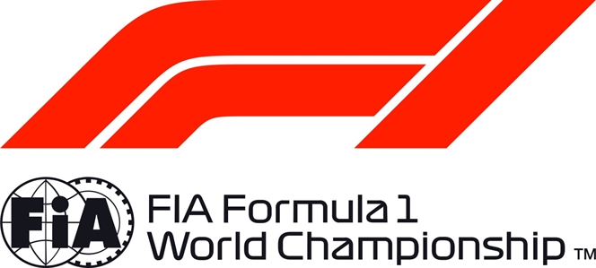

FORMULA 1 PIRELLI 2018 UNITED STATES GRAND PRIX - Austin

Race Pit Stop Summary

NO DRIVER ENTRANT LAP TIME OF DAY STOP DURATION TOTAL TIME

| 16 | Charles LECLERC | Alfa Romeo Sauber F1 Team | 1 | 13:15:33 | 1 | 34.812 | 34.812 |
| --- | --- | --- | --- | --- | --- | --- | --- |
| 18 | Lance STROLL | Williams Martini Racing | 1 | 13:15:34 | 1 | 41.048 | 41.048 |
| 8 | Romain GROSJEAN | Haas F1 Team | 1 | 13:15:46 | 1 | 35.104 | 35.104 |
| 18 | Lance STROLL | Williams Martini Racing | 5 | 13:23:02 | 2 | 18.610 | 59.658 |
| 35 | Sergey SIROTKIN | Williams Martini Racing | 10 | 13:31:11 | 1 | 23.686 | 23.686 |
| 2 | Stoffel VANDOORNE | McLaren F1 Team | 10 | 13:31:16 | 1 | 24.065 | 24.065 |
| 10 | Pierre GASLY | Red Bull Toro Rosso Honda | 10 | 13:31:19 | 1 | 23.865 | 23.865 |
| 44 | Lewis HAMILTON | Mercedes AMG Petronas Motorsport | 11 | 13:32:38 | 1 | 23.693 | 23.693 |
| 7 | Kimi RAIKKONEN | Scuderia Ferrari | 21 | 13:49:44 | 1 | 23.714 | 23.714 |
| 33 | Max VERSTAPPEN | Aston Martin Red Bull Racing | 22 | 13:51:28 | 1 | 23.446 | 23.446 |
| 31 | Esteban OCON | Racing Point Force India F1 Team | 22 | 13:52:07 | 1 | 24.534 | 24.534 |
| 77 | Valtteri BOTTAS | Mercedes AMG Petronas Motorsport | 23 | 13:53:07 | 1 | 23.478 | 23.478 |
| 27 | Nico HULKENBERG | Renault Sport Formula One Team | 23 | 13:53:40 | 1 | 24.681 | 24.681 |
| 55 | Carlos SAINZ | Renault Sport Formula One Team | 24 | 13:55:25 | 1 | 29.319 | 29.319 |
| 11 | Sergio PEREZ | Racing Point Force India F1 Team | 25 | 13:57:18 | 1 | 25.723 | 25.723 |
| 5 | Sebastian VETTEL | Scuderia Ferrari | 26 | 13:58:25 | 1 | 24.449 | 24.449 |
| 28 | Brendon HARTLEY | Red Bull Toro Rosso Honda | 27 | 14:00:53 | 1 | 23.819 | 23.819 |
| 35 | Sergey SIROTKIN | Williams Martini Racing | 29 | 14:04:26 | 2 | 23.715 | 47.401 |
| 20 | Kevin MAGNUSSEN | Haas F1 Team | 30 | 14:05:48 | 1 | 23.723 | 23.723 |
| 9 | Marcus ERICSSON | Alfa Romeo Sauber F1 Team | 30 | 14:06:07 | 1 | 23.940 | 23.940 |
| 44 | Lewis HAMILTON | Mercedes AMG Petronas Motorsport | 37 | 14:16:27 | 2 | 23.915 | 47.608 |
| 10 | Pierre GASLY | Red Bull Toro Rosso Honda | 36 | 14:16:33 | 2 | 24.219 | 48.084 |
| 18 | Lance STROLL | Williams Martini Racing | 38 | 14:20:52 | 3 | 24.296 | 1:23.954 |
| 2 | Stoffel VANDOORNE | McLaren F1 Team | 40 | 14:23:09 | 2 | 24.195 | 48.260 |

© 2018 Formula One World Championship Limited The F1 FORMULA 1 logo, F1 logo, FORMULA 1, FORMULA ONE, F1, FIA FORMULA ONE WORLD CHAMPIONSHIP, GRAND PRIX and related marks are trade marks of Formula One Licensing BV, a Formula 1 company. The FIA logo is a trade mark of the Fédération Internationale de l’Automobile. All rights reserved. No part of these results/data may be reproduced, stored in a retrieval system or transmitted in any form or by any means electronic, mechanical, photocopying, recording, broadcasting or otherwise without prior permission of the copyright holder except for reproduction in local/national/international daily press and regular printed publications on sale to the public within 90 days of the event to which the results/data relate and provided that the copyright symbol and name of copyright owner appears.
