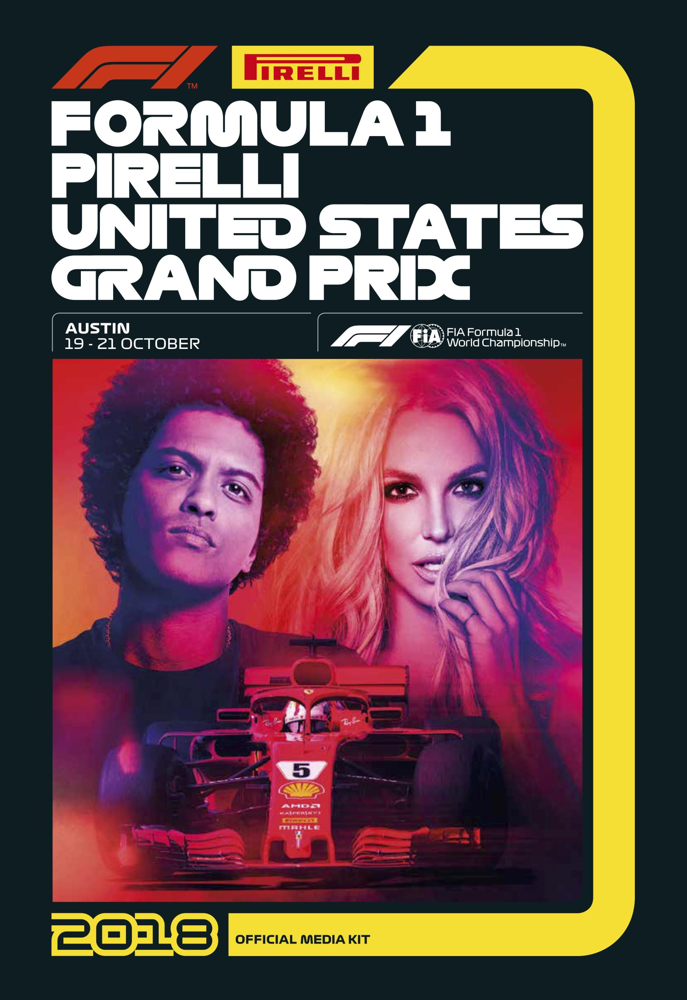

POCKET GUIDE

FORMULA ONE PIRELLI

UNITED STATES GRAND PRIX

Circuit of The Americas

October 19 – 21, 2018

TABLE OF CONTENTS

1 GENERAL INFORMATION Timetable 1-2 Circuit Map 3 Route to Media Accreditation Center & Circuit of The Americas 4 Media Accreditation Center (MAC) Map 5 About Circuit of The Americas 6-7

1.1 AUSTIN TRAVEL GUIDE Dining Suggestions 8 Nightlife / Shopping / Tourism / Accommodations 9 Airports / Airlines / Taxis / Rental Cars / Emergency Information 10

2 MEDIA SERVICES Key Contacts: FIA / Media Centre / Media Accreditation Centre (MAC) 11 Accreditation / Media Centre Opening Hours & Credential Pickup 12 Shuttle Services: Route & Timetable 13 Red Zone Map / Photographic & Technological Services 14 Press Conferences 15 COTA Tower & Concert Information 16

3 2018 FIA FORMULA ONE WORLD CHAMPIONSHIP Race Calendar 17 Entry List 18

3.1 2018 FIA FORMULA ONE WORLD CHAMPIONSHIP - STATISTICS Standing: Drivers’ & Constructors’ Classification 19-20 Statistics / Pole Positions / Winners / Fastest Lap 21 Drivers at a glance 22 Teams at a glance 23

3.2 CIRCUIT CHARACTERISTICS & RESULTS Circuit Characteristics & Results: Australia Grand Prix 24-25 Circuit Characteristics & Results: Bahrain Grand Prix 26-27 Circuit Characteristics & Results: China Grand Prix 28-29 Circuit Characteristics & Results: Azerbaijan Grand Prix 30-31 Circuit Characteristics & Results: Spain Grand Prix 32-33 Circuit Characteristics & Results: Monaco Grand Prix 34-35 Circuit Characteristics & Results: Canada Grand Prix 36-37 Circuit Characteristics & Results: France Grand Prix 38-39 Circuit Characteristics & Results: Austria Grand Prix 40-41 Circuit Characteristics & Results: British Grand Prix 42-43 Circuit Characteristics & Results: Germany Grand Prix 44-45

TABLE OF CONTENTS CONTINUED

3.2 CIRCUIT CHARACTERISTICS & RESULTS Circuit Characteristics & Results: Hungary Grand Prix 46-47 Circuit Characteristics & Results: Belgium Grand Prix 48-49 Circuit Characteristics & Results: Italy Grand Prix 50-51 Circuit Characteristics & Results: Russia Grand Prix 52-53 Circuit Characteristics & Results: Singapore Grand Prix 54-55 Circuit Characteristics & Results: Japan Grand Prix 56-57 Circuit Characteristics: United States Grand Prix 58 Circuit Characteristics: Mexico Grand Prix 59 Circuit Characteristics: Brazil Grand Prix 60 Circuit Characteristics: Abu Dhabi Grand Prix 61

4 2018 FIA FORMULA ONE WORLD CHAMPIONSHIP TEAM INFORMATION Mercedes AMG Petronas Motorsport 62 Scuderia Ferrari 63 Red Bull Racing 64 Williams Martini Racing 65 Racing Point Force India F1 Team 66 Renault Sport F1 Team 67 Red Bull Toro Rosso Honda 68 Haas F1 Team 69 McLaren Team 70 Alfa Romeo Sauber F1 Team 71

5 UNITED STATES GRAND PRIX 2017 FIA Formula One USGP Results 72 History of Formula One in the United States 73 American Formula One Drivers 74-75

6 HISTORY BOOK FACTS & FIGURES Formula One Drivers World Championship Winners 1950-2017 76-77 Formula One Constructors World Championship Winners 1958-2017 78

7 SUPPORT RACES FIA Formula 4 79 F3 Americas 80

TIMETABLE

THURSDAY

11:00 12:00 FORMULA 1 PRESS CONFERENCE

13:45 14:00 FIA TRACK INSPECTION HIGH SPEED TRACK TEST – FIA SAFETY/ 14:00 15:00 FIA MEDICAL CARS 15:15 15:45 FORMULA 1 FORMULA 1 PIRELLI HOT LAPS

16:00 17:30 PROMOTER ACTIVITY 3 DAY TICKET HOLDERS’ PIT LANE WALK

17:00 17:45 FORMULA 1 F1 EXPERIENCE – TRUCK TOUR F1 EXPERIENCE – PIT LANE WALK/TRUCK TOUR (F1 17:45 19:15 PROMOTER ACTIVITY EXPERIENCE GUESTS ONLY

FRIDAY

07:30 PARKING LOTS OPEN 08:00 17:30 GATES OPEN/CLOSE 08:15 08:30 FIA TRACK INSPECTION & SAFETY CAR TEST 08:45 09:15 F3 AMERICAS SERIES FIRST PRACTICE SESSION 09:30 09:40 FIA TRACK INSPECTION 10:00 11:30 FORMULA 1 FIRST PRACTICE SESSION 11:55 12:25 FIA FORMULA 4 FIRST PRACTICE SESSION 12:00 13:00 FORMULA 1 PRESS CONFERENCE 12:30 13:00 FORMULA 1 PIRELLI HOT LAPS 13:30 13:40 FIA TRACK INSPECTION 14:00 15:30 FORMULA 1 SECOND PRACTICE SESSION 16:00 16:20 FIA FORMULA 4 QUALIFYING SESSION 16:45 17:15 F3 AMERICAS SERIES QUALIFYING SESSION

1

TIMETABLE

|  | SATURDAY |  |  |  |  |  |
| --- | --- | --- | --- | --- | --- | --- |
| 08:30 |  |  |  |  | PARKING LOTS OPEN |  |
|  | 09:30 | 22:00 |  |  |  | GATES OPEN/CLOSE |
|  | 10:15 | 10:45 |  | FORMULA 1 |  | TEAM PIT STOP PRACTICE |
|  | 11:40 | 12:10 |  | F3 AMERICAS SERIES |  | FIRST RACE (10 LAPS OR 25 MINS) |
|  | 12:30 | 12:40 |  | FIA |  | TRACK INSPECTION |
|  | 13:00 | 14:00 |  | FORMULA 1 |  | THIRD PRACTICE SESSION |
| 14:15 |  | 15:15 | PROMOTER ACTIVITY |  |  | 302ND AVIATION SQUADRON STATIC AIRCRAFT DISPLAY – TURN 1 HELIPADS |
|  | 14:20 | 14:40 |  | FORMULA 1 |  | FORMULA 1 PIRELLI HOT LAPS |
|  | 16:00 | 17:00 |  | FORMULA 1 |  | QUALIFYING |
|  | 17:30 | 18:00 |  | FIA FORMULA 4 |  | FIRST RACE (10 LAPS OR 25 MINS) |
|  | 20:00 |  |  | PROMOTER ACTIVITY |  | BRUNO MARS – COTA SUPER STAGE |

SUNDAY

07:30 PARKING LOTS OPEN 08:30 20:00 GATES OPEN/CLOSE 09:15 09:45 F3 AMERICAS SERIES SECOND RACE (10 LAPS OR 25 MINS) 10:15 10:45 FIA FORMULA 4 SECOND RACE (10 LAPS OR 25 MINS) 11:00 11:20 FORMULA 1 FORMULA 1 PIRELLI HOT LAPS 11:30 12:00 FORMULA 1 FORMULA 1 DRIVERS PARADE

LONGHORN MARCHING BAND & DALLAS 12:00 12:20 OPENING CEREMONIES COWBOY CHEERLEADERS

RETIRED NAVY PETTY OFFICER, GENERALD 12:54 12:56 NATIONAL ANTHEM WILSON

12:58 12:59 AIR DISPLAY 302ND AVIATION SQUADRON: FT HOOD 13:10 15:10 FORMULA 1 UNITED STATES GRAND PRIX 15:15 16:00 PROMOTER ACTIVITY FAN TRACK WALK 18:00 PROMOTER ACTIVITY BRITNEY SPEARS – COTA SUPER STAGE

2

CIRCUIT MAP

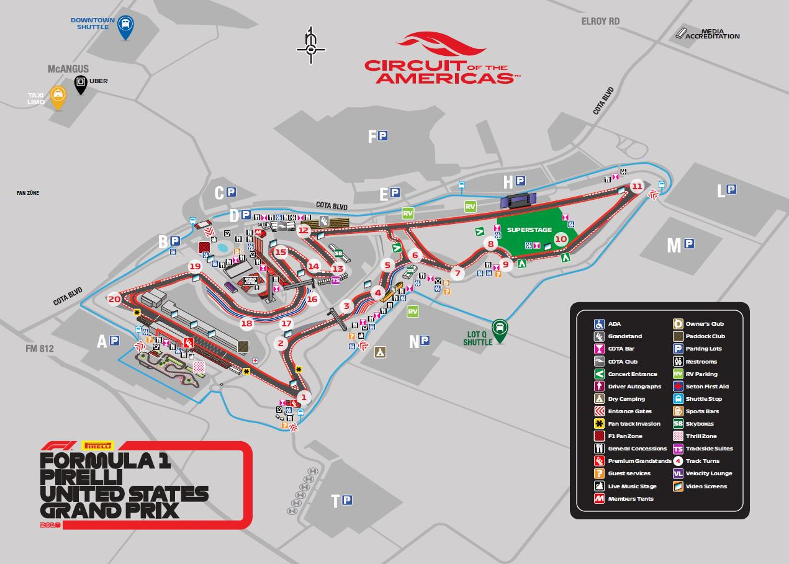

3

ROUTE TO THE MEDIA ACCREDIATION CENTER (MAC)

| MAC Address: | 7736 Kellam Road Del Valle, TX 78617 (Located in Lot R at the intersection of Kellam & Elroy) |  |
| --- | --- | --- |
| From Downtown Austin to the Media Accreditation Center: | Follow 1-35 S/US-290 W and TX-71 E to Garfield. Exit and turn right down Kellam Road. The Media Accreditation Center will be on your left. |  |
| From MAC to Lot A: | Once you have received your credentials and parking pass, please follow the “MEDIA PARKING” directional signage down COTA Boulevard to Parking Lot A. |  |
| If you already have your parking pass: |  | Circuit of The Americas is located 15 miles south east of downtown Austin and connected to the downtown area via TX-71, US-183 and the 45/130 toll road. From downtown Austin, take I-35 South to TX-71 East. Exit TX-71 at Burleson Road and continue until Highway 183. Go south on Highway 183 and make a left on FM 812. After passing underneath the 45/130 toll road, Circuit of The Americas will be on your left. |
| Distance from Austin Airport: | Distance to Circuit of The Americas from Austin-Bergstrom International Airport is 10 miles. Travel TX71 or 45/130 Toll Road. |  |

4

MAP TO MEDIA ACCREDITATION CENTER

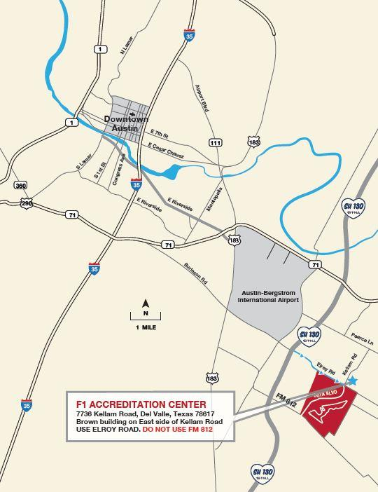

5

ABOUT CIRCUIT OF THE AMERICAS

The premier destination for world-class motorsports and entertainment in the United States. Set

on 1,500 acres in the rolling hills just outside downtown Austin, Circuit of The Americas has

hosted the biggest names in racing, action sports and music since 2012. At its heart is a 3.41-

mile racetrack that was designed to challenge the world's most exacting competitors while

providing a thrilling spectacle for audiences.

The 20-turn, counterclockwise circuit takes advantage of the naturally undulating landscape,

including an intimidating 133-foot hill at Turn 1 that you have to see in person to believe. It is

home to the only Formula 1 and MotoGP races in America — the Formula 1 United States

Grand Prix and MotoGP Red Bull Grand Prix of The Americas — and has played host to ESPN's

X Games, the FIA World Endurance Championship, IMSA WeatherTech SportsCar

Championship, Pirelli World Challenge and more.

Nestled within the track is the Austin360 Amphitheater, the largest permanent outdoor

amphitheater in Central Texas, and its 251-foot signature observation tower. This unique

treasure in the Live Music Capital of the World has hosted some of the biggest names in music

and entertainment, including Taylor Swift, Justin Timberlake, Metallica, Blake Shelton, Twenty-

One Pilots, Willie Nelson, Kenny Chesney, KISS, Nine Inch Nails, Kanye West, Drake and Lil

Wayne, Maroon 5, Kelly Clarkson and many more.

Construction of Circuit of The Americas began in 2010 and was funded entirely using private

money. Since its announcement in 2010, the Circuit of The Americas has had a cumulative

economic impact of $2.8 billion to the Austin metro area. The Circuit also continues to be a

leader in environmental awareness and sustainability and has helped make advances in

educational and scientific fields, including solar car technology, as well as racing and

consumer automotive technology.

World Rallycross made its debut at Circuit of The Americas September 29-30. The Formula 1

U.S. Grand Prix returns October 19-21 and will feature superstars Bruno Mars and Britney Spears

as Saturday & Sunday night entertainment respectively for Formula 1 fans. Circuit of The

Americas is set for excitement for years to come with world championship racing, new

amenities and more events than ever before.

For an experience as unique as Austin and a rush you will never forget, come to Circuit of The

Americas — where exhilaration happens.

6

ABOUT CIRCUIT OF THE AMERICAS (Continued)

FOR MORE INFORMATION & DOWNLOADABLE VIDEO, AUDIO & PHOTOS: COTA Website: www.TheCircuit.com Austin360 Amphitheatre: www.Austin360Amphitheater.com FOLLOW CIRCUIT OF THE AMERICAS: Facebook: www.facebook.com/CircuitofTheAmericas Twitter: @cota

Instagram: @cota_official

CIRCUIT INFORMATION: First Grand Prix: 2012 Circuit Length: 3.427 miles (5.513 km)

Number of Laps: 56

Race Distance: 308.405 km

Lap Record: 1:39.347 – S. Vettel (2012)

Capacity: 120,000

Architect: Hermann Tilke

Tower Height: 251 feet (77m)

Circuit Grounds: 1,100 acres

7

AUSTIN DINING SUGGESTIONS

FINE DINING

| Lambert’s Downtown Barbecue 401 W 2nd St, Austin, TX 78701-3802 Phone: 1 (512) 494-1500 Open for Lunch, Dinner, Brunch & Late Night Offers American, Southwestern and Barbecue options | Odd Duck 1201 S Lamar Blvd, Austin, TX 78704 Phone: 1 (512) 433-6521 Upscale eatery doling out locally sourced New American chow & drinks in a contemporary setting |
| --- | --- |
| Uchi 801 South Lamar Blvd, Austin, TX 78704 Phone: 1 (512) 916-4808 Open for dinner Sushi plus creative hot & cold dishes | Eddie V’s Prime Seafood 9400B Arboretum Blvd, Austin, TX 78759-6392 Phone: 1 512-342-2642 Open for dinner & late night Offers American, Seafood & International Options |
| Truluck’s Seafood 400 Colorado St, Austin, TX 78701-2919 Phone: 1 (512) 482-9000 Casual Elegant Dining – Open late for dinner & drinks Offers American, Seafood & Gluten Free options | Perry’s Steakhouse & Grille 114 W 7th St, Austin, TX 78701-3000 Phone: 1 (512) 474-6300 Casual Elegant Dining – Open late for dinner & drinks American Steakhouse, also offers gluten free options |
| Vespaio 1610 S Congress Ave, Austin, TX 78704-3522 Phone: 1 (512) 441-6100 Lunch, Dinner & Late Night Offers Italian, Pizza and Mediterranean options | III Forks Austin 111 Lavaca St, Austin, TX 78701-3932 Phone: 1 (512) 474-1776 Fine Dining – Open late for dinner Offers American & Steakhouse cuisine |

CASUAL DINING

| Guero’s Taco Bar 1412 S. Congress Avenue 900 E. 11th Street www.guerostacobar.com Open for lunch and dinner | South Congress Cafe 1600 S. Congress Avenue www.southcongresscafe.com Open for brunch, lunch and dinner |
| --- | --- |
| Homeslice Pizza 1415 S. Congress Avenue www.homeslicepizza.com Open for lunch and dinner | Franklin’s Barbecue 900 E. 11th Street www.franklinsbarbecue.com Open for lunch and dinner |

8

NIGHTLIFE / SHOPPING / TOURISM / ACCOMMODATIONS

SHOPPING

| San Marcos Premium Outlets 3939 IH 35, San Marcos, TX Phone: 1(512)396-2200 | The Domain 11410 Century Oaks Terrace, Austin, TX 78758 Phone: 1(512)873-8099 |  |
| --- | --- | --- |
| Barton Creek Square 2901 S Capital of Texas Hwy, Austin, TX 78746 Phone: 1(512)327-7041 |  | The Arboretum 10000 Research Blvd, Austin, TX 78759 Phone: 1(512)338-4437 |

TOURISM

| The Texas Capitol Phone: 1(512)305-8400 www.tspb.state.tx.us.org | The Bob Bullock Texas State History Museum 1800 Congress Avenue Phone: 1 (512) 305-8400 |  |
| --- | --- | --- |
| Bat Bridge Lady Bird Lake on top of Congress Ave Bridge http://www.batcon.org/ |  | Zilker Park 2100 Barton Springs Rd, Austin, TX 78704 http://zilkerpark.org/ |

ACCOMMODATIONS

| Hotel Van Zandt Phone: 1(512)542-5300 http://www.hotelvanzandt.com/ |  | JW Mariott Phone: 1(512)474-4777 http://www.jwmarriottaustin.com/ |
| --- | --- | --- |
| Homewood Suites South Phone: 1(512)445-5050 http://homewoodsuites3.hilton.com | The Driskill Phone: 1 (512) 439-1234 http://www.driskillhotel.com/ |  |
| Hilton Garden Inn Phone: 1 (512) 480-8181 http://hiltongardeninn3.hilton.com/en/hotels/texa s/hilton-garden-inn-austin-downtown-convention- center-AUSGIGI/index.html | Hilton Austin Airport Phone: 1 (512) 385-6767 http://www3.hilton.com/en/hotels/texas/hilton- austin-airport-AUSAHHF/index.html |  |

AUSTIN NIGHTLIFE SUGGESTIONS

Rainey Street Area 6th Street/Downtown

-Container Bar -The Ranch -Bar 96 -Dogwood -Blackheart -Pete’s Dueling Piano Bar -Lucille -Easy Tiger -Banger’s -Shakespeare’s -Half Step -Continental Club

*visit http://www.austintexas.org/visit/ for more information

9

TRANSPORTATION / EMERGENCY INFO / HOSPITAL LOCATION

AIRPORTS

| Austin Bergstrom International 3600 Presidential Blvd, Austin, TX 78719 Phone: 1(512)530-2242 |  |  |  | Dallas Fort Worth International International Pkwy, DFW Airport, TX 75261 Phone: 1(972)973-3112 |
| --- | --- | --- | --- | --- |
| Houston Bush International 2800 N Terminal Rd, Houston, TX 77032 Phone: 1(281)230-3100 |  |  |  | San Antonio International 9800 Airport Blvd, San Antonio, TX 78216 Phone: 1(210)207-3433 |
| AIRLINES |  |  |  |  |
| Air Tran |  |  | Alaska Airlines Phone: 1(800)252-7522 |  |
| Phone: 1(800)247-8726 |  |  |  |  |
| American Airlines Phone: 1(800)433-7300 |  |  | British Airways Phone: 1(800)247-9297 |  |
| Delta Phone: 1(800)221-1212 |  |  | Frontier Phone: 1(800)432-1359 |  |
| Jet Blue Phone: 1(800)538-2583 |  |  | Southwest Phone: 1(800)435-9792 |  |
| United Airlines Phone: 1(800)241-6522 |  |  |  | US Airways Phone: 1(800)428-4322 |
| TAXIS |  |  |  |  |
| Yellow Cab Austin Phone: 1(512)452-9999 |  |  |  | Austin Cab Company Phone: 1(512)478-2222 |
| Lone Star Cab Phone: 1(512)836-4900 |  |  |  |  |
| RENTAL CARS |  |  |  |  |
| ACE Car Rental Austin Phone: 1(512)530-3900 |  |  |  | Advantage Phone: 1(800)777-5500 |
| Alamo/National Phone: 1(512)530-3500 |  |  |  | Avis Phone: 1 (512) 530-3400 |
| Budget Phone: 1(512) 530-3350 |  |  |  | Dollar Phone: 1(512)530-7368 |
| Enterprise Phone: 1(512)530-8100 |  |  |  | Hertz Phone: 1(512)530-3600 |
| HOSPITAL | In case of emergency, please dial 9-1-1 | In case of emergency, please dial 9-1-1 |  |  |
| Seton Northwest Hospital |  |  |  |  |
| 11113 Research Blvd 1 (512) 324-6000 |  |  |  |  |

10

KEY PEOPLE + CONTACTS

FIA

| FIA F1 Head of Communications & Media Delegate | Matteo Bonciani; mbonciani@fia.com 1 (512) 655-6523 (Circuit office) |  |
| --- | --- | --- |
| FIA Deputy Media Delegate |  | Pierre Guyonnet-Duperat; pguyonnet@fia.com 1 (512) 655-6523 (Circuit office) |
| MEDIA CENTER |  |  |
| National Press Officer |  | Catherine Land; Catherine.land@thecircuit.com |
| National Press Officer Assistant | Egbert Thamm; egbert.thamm@khpconsulting.com |  |
| Media Centre Reception Desk | 1 (512) 655-6516 |  |
| Media Center Reception Management | Irwen Song & Ali Alcantara; |  |
| MEDIA ACCREDITATION CENTER |  |  |
| Media Accreditation Center Desk | 1 (512) 655-6257 |  |
| Media Accreditation Center Manager |  | Renet Presas; Renet.presas@thecircuit.com |

11

MEDIA CENTER/ACCREDITATION HOURS & CREDENTIAL PICKUP

MEDIA CENTER

|  | The Media Center is located in Building K in the F1 Paddock. |  |  |  |
| --- | --- | --- | --- | --- |
| Location |  |  |  |  |
| Opening Hours | Wednesday, Oct. 17th Thursday, Oct. 18th Friday, Oct. 19th Saturday, Oct. 20th Sunday, Oct. 21st |  | 11.00 – 20.00 hrs 09.00 – 22.00 hrs 07.00 – 23.00 hrs 07.00 – 23.00 hrs 07.00 – Late* |  |
| *Or until the last journalist leaves |  |  |  |  |
| ACCREDIATION CENTER |  |  |  |  |
| Location |  | The Media Accreditation Center is located at 7736 Kellam Road Del Valle, TX 78617 |  |  |
| Opening Hours | Wednesday, Oct. 17th Thursday, Oct. 18th Friday, Oct. 19th Saturday, Oct. 20th Sunday, Oct. 21st |  | 08.00 – 12.00 hrs | 11.00 – 18.00 hrs 08.00 – 18.00 hrs 08.00 – 16.00 hrs 08.00 – 12.00 hrs |
| MEDIA CREDENTIAL PICKUP |  |  |  |  |
| Each accredited journalist must sign release forms and show photo ID in order to pick up |  |  |  |  |
| his/her credential. Media outlets cannot pick up credentials en masse. **Transportation from |  |  |  |  |
| the Media Accreditation Center (MAC) to the track is not provided. Journalists should pick up |  |  |  |  |
| credentials and parking passes at the MAC before parking at the circuit. ** |  |  |  |  |

12

SHUTTLE SERVICE

MEDIA SHUTTLES

|  | Shuttles operate between Lot A and the Media Center during Media Center Operating Hours. |
| --- | --- |
| Route | Wednesday, Oct. 17th 11.00 – 20.00 hrs Thursday, Oct. 18th 09.00 – 22.00 hrs Friday, Oct. 19th 07.00 – 23.00 hrs Saturday, Oct. 20th 07.00 – 23.00 hrs Sunday, Oct. 21st 07.00 – Late |
| Operating Hours | Journalists who wish to stay beyond the operating hours of the Media Center are kindly requested to contact the Media Center staff at the reception desk at least one hour before the Media Center closes. |
| Notice |  |
| PHOTOGRAPHERS’ SHUTTLES | A photographers’ shuttle service is provided nonstop during practice sessions and races to locations all around the track using the service road. |
| Route | Photo shuttles will begin running 30 minutes prior to all on-track activity and will continue running for 30 minutes after all on-track activity on Friday, Saturday and Sunday (Oct 19. 20 & 21). |
| Operating Hours | The Photographers’ Shuttle schedule is subject to change. Please be sure to check the notice board located within the Media Center for the latest transportation information. Photographers must have appropriate accreditation to use this service. |
| Notice | Please see Map on next page. |
| Red Zones | The Photographers’ Tower is located outside of Turn 1. Please refer to the map on the official notice board in the photographers’ area for information on the photographers’ tower. |
| Photographers’ Tower | Crossing the track is allowed 30 minutes before each practice session and 60 minutes before the Grand Prix race. |
| Crossing the track |  |

13

PHOTOGRAPHIC & TECHNOLOGY SERVICES INFORMATION

|  | Photographic technical support will be provided by Nikon. Nikon will be stationed in the Media Center to assist photographers with technical issues. |
| --- | --- |
| Photographic |  |
| Support Services | United States spec power (110v, 60hz) will be available for each workstation. We will have universal power adapters available at the reception area, which will enable any country’s plug type to plug into a U.S. wall socket. |
| Electrical Power | Circuit of The Americas offers free high-speed broadband Internet connections. Access information for the Circuit’s free Wi- Fi network can be obtained at the Media Centre reception desk. |
| Internet |  |

14

PRESS CONFERENCES

The Media Centre will host four official Fédération Internationale de l’Automobile (FIA) press conferences during the race weekend. There will be a press conference on each of the four days of the event. All FIA-hosted press conferences will take place in the designated press conference room located in the Media Centre, near the Media Café. Transcripts will be distributed within the Media Centre. Please note that only FIA-accredited media may attend.

Thursday, 11.00 hrs, in the Media Centre:

Press Conference for a maximum of six drivers, chosen by the FIA F1

Head of Communications.

Friday, 16.00 hrs, in the Media Centre:

Press Conference for six team personalities, chosen by the FIA F1 Head

of Communications.

Saturday, following the Qualifying session:

TV interview with the top three drivers of the qualifying session.

(Transmitted into the Media Centre).

Saturday, after the TV unilateral interview, in the Media Centre:

Post-Qualifying Press Conference with the top three drivers of the

qualifying session.

Sunday, following the podium celebrations:

TV interview with the top three finishing drivers. (Transmitted into the

Media Centre).

Sunday, after the TV unilateral interview, in the Media Centre:

Post-Race Press Conference with the top three finishing drivers.

*NOTE: Photographers are kindly requested to use the platform that has been provided behind the rows for the journalists.

15

COTA TOWER ACCESS & CONCERT INFORMATION

RACE CALENDAR

TOWER ACCESS

Media will be allowed FREE access to the observation deck at the Tower

ONLY during the below hours of operation.

| Friday, October 19 11:00 a.m. – 5:00 p.m. | Saturday, October 20 | 9:00 a.m. – 12:00 p.m. |
| --- | --- | --- |
| 9:00 a.m. – 11:00 a.m. Sunday, October 21 4:00 p.m. – 5:00 p.m. |  |  |

CONCERT INFORMATION

Saturday, Oct. 20 8:00 p.m. Superstage Bruno Mars

Sunday, Oct. 21 6:00 p.m. Superstage Britney Spears

*The Superstage is located on the back straight in-between Turns 11 and 12. All credentialed media that are interested in attending will be allowed GA access.

16

2018 RACE CALENDAR

RACE CALENDAR

25 Mar AUSTRALIAN GRAND PRIX Melbourne

8 Apr BAHRAIN GRAND PRIX Sakhir

15 Apr CHINESE GRAND PRIX Shanghai

29 Apr AZERBAIJAN GRAND PRIX Baku

13 May SPANISH GRAND PRIX Catalunya

27 May MONACO GRAND PRIX Monte Carlo

10 Jun CANADIAN GRAND PRIX Montreal

24 Jun FRENCH GRAND PRIX Paul Ricard

1 Jul AUSTRIAN GRAND PRIX Spielberg

8 Jul BRITISH GRAND PRIX Silverstone

22 Jul GERMAN GRAND PRIX Hockenheim

29 Jul HUNGARIAN GRAND PRIX Budapest

26 Aug BELGIAN GRAND PRIX Spa-Francorchamps

2 Sep ITALIAN GRAND PRIX Monza

16 Sep SINGAPORE GRAND PRIX Singapore

30 Sep RUSSIAN GRAND PRIX Sochi

7 Oct JAPANESE GRAND PRIX Suzuka

21 Oct UNITED STATES GRAND PRIX Austin

28 Oct MEXICAN GRAND PRIX Mexico City

11 Nov BRAZILIAN GRAND PRIX Sao Paulo

25 Nov ABU DHABI GRAND PRIX Yas Marina

17

2018 ENTRY LIST

No. DRIVER NAT TEAM

44 Lewis Hamilton GBR Mercedes AMG Petronas Motorsport

77 Valtteri Bottas FIN Mercedes AMG Petronas Motorsport

| 5 | Sebastian Vettel | GER | Scuderia Ferrari |
| --- | --- | --- | --- |
| 7 | Kimi Räikkönen | FIN | Scuderia Ferrari |

3 Daniel Ricciardo AUS Aston Martin Red Bull Racing

33 Max Verstappen NED Aston Martin Red Bull Racing

| 11 | Sergio Perez | MEX | Racing Point Force India F1 Team |
| --- | --- | --- | --- |
| 31 | Esteban Ocon | FRA | Racing Point Force India F1 Team |

18 Lance Stroll CAN Williams Martini Racing

35 Sergey Sirotkin RUS Williams Martini Racing

| 27 | Nico Hülkenberg | GER | Renault Sport Formula One Team |
| --- | --- | --- | --- |
| 55 | Carlos Sainz | ESP | Renault Sport Formula One Team |

28 Brendon Hartley NZL Red Bull Toro Rosso Honda

10 Pierre Gasly FRA Red Bull Toro Rosso Honda

| 8 | Romain Grosjean | FRA | Haas F1 Team |
| --- | --- | --- | --- |
| 20 | Kevin Magnussen | DEN | Haas F1 Team |
| 14 | Fernando Alonso | ESP | McLaren F1 Team |
| 2 | Stoffel Vandoorne | BEL | McLaren F1 Team |
| 9 | Marcus Ericsson | SWE | Alfa Romeo Sauber F1 |
| 16 | Charles Leclerc | MCO | Alfa Romeo Sauber F1 |

18

2018 DRIVER STANDINGS

y e

DRIVER A u str ali a B a hr ai n C hi n a B a k u S p ai n M o n a c o C a n a d a F r a n c e A u stri a E n gl a n d G er m a n H u n g ar y B el gi u m I t al y S i n g a p or R u s si a J a p a n T O T A L

Lewis Hamilton 18 15 12 25 25 15 10 25 0 18 25 25 18 25 25 25 25 331

Sebastian Vettel 25 25 4 12 12 18 25 10 15 25 0 18 25 12 15 15 8 264

Valtteri Bottas 4 18 18 0 18 10 18 6 0 12 18 10 12 15 12 18 18 207

Kimi Räikkönen 15 0 15 18 0 12 8 15 18 15 15 15 0 18 10 12 10 196

Max Verstappen 8 0 10 0 15 2 15 18 25 0 12 0 15 10 18 10 15 173

Daniel Ricciardo 12 0 25 0 10 25 12 12 0 10 0 12 0 0 8 8 12 146

Kevin Magnussen 0 10 1 0 8 0 0 8 10 2 0 6 4 0 0 4 0 53

Nico Hülkenberg 6 8 8 0 0 4 6 2 0 8 10 0 0 0 1 0 0 53

Sergio Perez 0 0 0 15 2 0 0 0 6 1 6 0 10 6 0 1 6 53

Fernando Alonso 10 6 6 6 7 0 0 0 4 4 0 4 0 0 6 0 0 50

Esteban Ocon 0 1 0 0 0 8 2 0 8 6 4 0 8 8 0 2 2 49

Carlos Sainz 1 0 2 10 6 1 4 4 0 0 0 2 0 4 4 0 1 39

Romain Grosjean 0 0 0 0 0 0 0 0 12 0 8 1 6 0 0 0 4 31

Pierre Gasly 0 12 0 0 0 6 0 0 0 0 0 8 2 0 0 0 0 28

Charles Leclerc 0 0 0 8 1 0 1 1 2 0 0 0 0 0 2 6 0 21

Stoffel Vandoorne 2 4 0 2 0 0 0 0 0 0 0 0 0 0 0 0 0 8

Lance Stroll 0 0 0 4 0 0 0 0 0 0 0 0 0 2 0 0 0 6

Marcus Ericsson 0 2 0 0 0 0 0 0 1 0 2 0 1 0 0 0 0 6

Brendon Hartley 0 0 0 1 0 0 0 0 0 0 1 0 0 0 0 0 0 2

Sergey Sirotkin 0 0 0 0 0 0 0 0 0 0 0 0 0 1 0 0 0 1

19

2018 CONSTRUCTOR STANDINGS

y e

CONSTRUCTOR A u str ali a B a hr ai n C hi n a B a k u S p ai n M o n a c o C a n a d a F r a n c e A u stri a E n gl a n d G er m a n H u n g ar y B el gi u m I t al y S i n g a p or R u s si a J a p a n T O T A L

MERCEDES 22 33 30 25 43 25 28 31 0 30 43 35 30 40 37 43 43 538

FERRARI 40 25 19 30 12 30 33 25 33 40 15 33 25 30 25 27 18 460

RED BULL RACING 20 0 35 0 25 27 27 30 25 10 12 12 15 10 26 18 27 319 TAG HEUER

RENAULT 7 8 10 10 6 5 10 6 0 8 10 2 0 4 5 0 0 92

HAAS FERRARI 0 10 1 0 8 0 0 8 22 2 8 7 10 0 0 4 4 84

MCLAREN RENAULT 12 10 6 8 4 0 0 0 4 4 0 4 0 0 6 0 1 58

FORCE INDIA 0 0 0 0 0 0 0 0 0 0 0 0 18 14 0 3 8 43 MERCEDES

SCUDERIA TORO 0 12 0 1 0 6 0 0 0 0 1 8 2 0 0 0 0 30 ROSSO HONDA

SAUBER FERRARI 0 2 0 8 1 0 1 1 3 0 2 0 1 0 2 6 0 27

WILLIAMS 0 0 0 4 0 0 0 0 0 0 0 0 0 3 0 0 0 7 MERCEDES

20

|  | 2018 STATISTICS - POLE POSITION / WINNER / FASTEST LAP |  |  |  |
| --- | --- | --- | --- | --- |
| Grand Prix |  | Pole Position | Winner | Fastest Lap |

Australia Lewis Hamilton Lewis Hamilton Daniel Ricciardo

Bahrain Sebastian Vettel Sebastian Vettel Valtteri Bottas

China Sebastian Vettel Daniel Ricciardo Daniel Ricciardo

Azerbaijan Sebastian Vettel Lewis Hamilton Valtteri Bottas

Spain Lewis Hamilton Lewis Hamilton Daniel Ricciardo

Monaco Daniel Ricciardo Daniel Ricciardo Max Verstappen

Canada Sebastian Vettel Sebastian Vettel Max Verstappen

France Lewis Hamilton Lewis Hamilton Max Verstappen

Austria Valtteri Bottas Max Verstappen Kimi Räikkönen

Great Britain Lewis Hamilton Sebastian Vettel Sebastian Vettel

Germany Sebastian Vettel Lewis Hamilton Lewis Hamilton

Hungary Lewis Hamilton Lewis Hamilton Daniel Ricciardo

Belgium Lewis Hamilton Sebastian Vettel Valtteri Bottas

Italy Kimi Räikkönen Lewis Hamilton Lewis Hamilton

Singapore Lewis Hamilton Lewis Hamilton Kevin Magnussen

Russia Valtteri Bottas Lewis Hamilton Valtteri Bottas

Japan Lewis Hamilton Lewis Hamilton Sebastian Vettel

21

2018 STATISTICS – DRIVERS AT A GLANCE

| Driver | Debut | GP Entered | Poles | Podium | Wins | Titles | Total Points |
| --- | --- | --- | --- | --- | --- | --- | --- |
| Lewis Hamilton | 2007 | 225 | 80 | 131 | 71 | 4 | 2,941 |

Sebastian Vettel 2007 216 55 109 52 4 2,689

Valtteri Bottas 2013 115 6 30 3 0 923

Kimi Räikkönen 2001 290 18 100 20 1 1,761

Max Verstappen 2015 77 0 18 4 0 594

Daniel Ricciardo 2011 146 2 29 7 0 962

Kevin Magnussen 2014 78 0 1 0 0 134

Nico Hülkenberg 2010 154 1 0 0 0 458

Fernando Alonso 2001 310 22 97 32 2 1,899

Sergio Perez 2011 154 0 8 0 0 520

Esteban Ocon 2016 46 0 0 0 0 136

Carlos Sainz 2015 77 0 0 0 0 157

Pierre Gasly 2017 22 0 0 0 0 28

Romain Grosjean 2009 141 0 10 0 0 375

Charles Leclerc 2018 17 0 0 0 0 21

Stoffel Vandoorne 2016 38 0 0 0 0 22

Lance Stroll 2017 37 0 0 0 0 46

Marcus Ericsson 2014 93 0 0 0 0 15

| Brendon Hartley | 2017 | 21 | 0 | 0 | 0 | 0 | 2 |
| --- | --- | --- | --- | --- | --- | --- | --- |
| Sergey Sirotkin | 2018 | 17 | 0 | 0 | 0 | 0 | 1 |

22

2018 STATISTICS – TEAMS AT A GLANCE

Team F1 Titles Debut Wins Poles Fastest Laps Total Points

MERCEDES 4 1954 85 98 63 4,256

SCUDERIA FERRARI 16 1950 234 219 247 7,642.5

RED BULL RACING 4 2005 58 59 60 4,207.5

RENAULT 2 1977 35 51 31 1,475

HAAS 0 2016 0 0 1 160

MCLAREN 8 1966 182 155 155 5,204.5

FORCE INDIA 0 2018 0 0 0 43

SCUDERIA TORO ROSSO 0 2006 1 1 1 412

SAUBER 0 1993 1 1 5 844

WILLIAMS 9 1977 114 128 133 3,560

23

2018 FORMULA ONE AUSTRALIAN GRAND PRIX

MELBOURNE

Date 25 March Race distance 307.574 km

Circuit length 5.303 km Number of laps 58

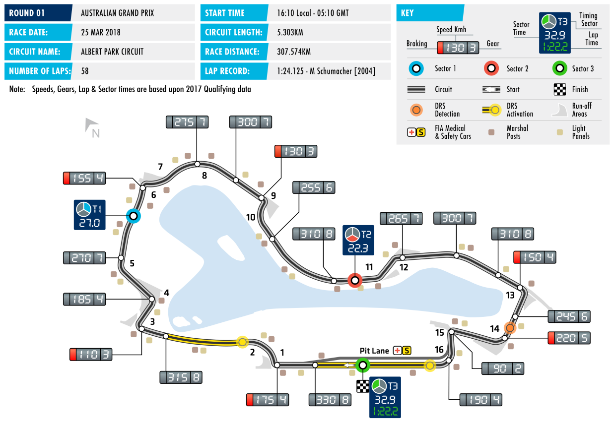

Melbourne’s Albert Park remains one of the most popular circuits with fans on the F1 calendar, offering a combination of long straights, sweeping curves and tight chicanes make it a welcome challenge for the drivers. The Australian Grand Prix is this season’s first round of the Formula 1 Championship, having held this distinction each year since the event moved to Melbourne in 1996, excluding 2006 and 2010.

24

| 2018 FORMULA ONE AUSTRALIAN GRAND PRIX | 2018 FORMULA ONE AUSTRALIAN GRAND PRIX RESULTS |  |  |  |  |
| --- | --- | --- | --- | --- | --- |
| POS |  | DRIVER | TEAM | TIME/RETIRED | GRID |

1 Sebastian Vettel Ferrari 1:29:33.283 3

2 Lewis Hamilton Mercedes +5.036s 1

3 Kimi Räikkönen Ferrari +6.309s 2

4 Daniel Ricciardo Red Bull Racing TAG Heuer +7.069s 8

5 Fernando Alonso McLaren Renault +27.886s 10

6 Max Verstappen Red Bull Racing TAG Heuer +28.945s 4

7 Nico Hülkenberg Renault +32.671s 7

8 Valtteri Bottas Mercedes +34.339s 15

9 Stoffel Vandoorne McLaren Renault +34.921s 11

10 Carlos Sainz Jr. Renault +45.722s 9

11 Sergio Perez Force India Mercedes +46.817s 12

12 Esteban Ocon Force India Mercedes +1:00.278 14

13 Charles Leclerc Sauber Ferrari +1:15.759 18

14 Lance Stroll Williams Mercedes +1:18.288 13

15 Brendon Hartley Scuderia Toro Rosso Honda +1 Lap 16

NC Romain Grosjean Haas-Ferrari DNF 6

NC Kevin Magnussen Haas Ferrari DNF 5

NC Pierre Gasly Scuderia Toro Rosso Honda DNF 20

NC Marcus Ericsson Sauber Ferrari DNF 17

NC Sergey Sirotkin Williams-Mercedes DNF 19

Pole Position Lewis Hamilton 1:21:164

Fastest Lap Daniel Ricciardo 1:25.945

25

2018 FORMULA ONE BAHRAIN GRAND PRIX

SAKHIR

Date 8 April Race distance 308.238 km

Circuit length 5.412 km Number of laps 57

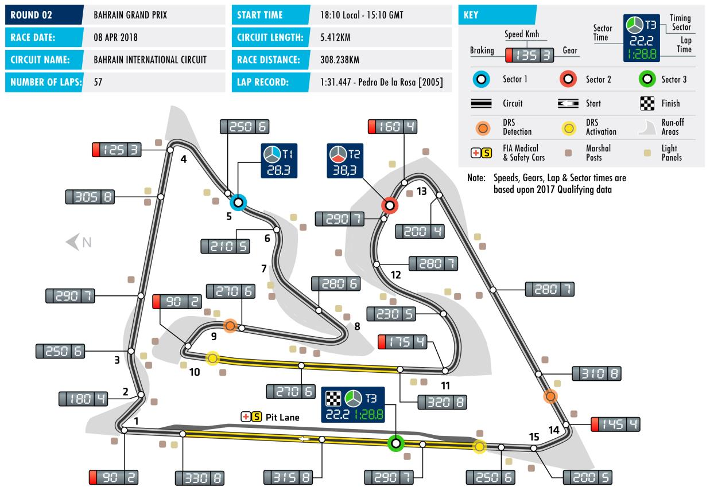

The Bahrain International Circuit has quickly become a popular host for world-class motor sport. Professional facilities and experienced staff has paved the way for numerous international race series to utilise the circuit, including: Formula 3, GP2, GP2 Asia, the FIA GT Championship, V8 Supercar Series, and the BMW World Final. It is also still the only desert race on the F1 calendar.

26

2018 FORMULA ONE BAHRAIN GRAND PRIX

| RESULTS |  |  |  |  |
| --- | --- | --- | --- | --- |
| POS | DRIVER | TEAM | TIME/RETIRED | GRID |

1 Sebastian Vettel Ferrari 1:32:01.940 1

2 Valtteri Bottas Mercedes +0.699 3

3 Lewis Hamilton Mercedes +6.512 9

4 Pierre Gasly Scuderia Toro Rosso Honda +1:02.234 5

5 Kevin Magnussen Haas Ferrari +1:15.046 6

6 Nico Hülkenberg Renault +1:39.024 7

7 Fernando Alonso McLaren Renault +1 Lap 13

8 Stoffel Vandoorne McLaren Renault +1 Lap 14

9 Marcus Ericsson Sauber Ferrari +1 Lap 17

10 Esteban Ocon Force India Mercedes +1 Lap 8

11 Carlos Sainz Jr. Renault +1 Lap 10

12 Charles Leclerc Sauber Ferrari +1 Lap 19

13 Romain Grosjean Haas Ferrari +1 Lap 16

14 Lance Stroll Williams Mercedes +1 Lap 20

15 Sergey Sirotkin Williams Mercedes +1 Lap 18

16 Sergio Perez Force India Mercedes +1 Lap 12

17 Brendon Hartley Scuderia Toro Rosso Honda +1 Lap 11

NC Kimi Räikkönen Ferrari DNF 2

NC Max Verstappen Red Bull Racing TAG Heuer DNF 15

NC Daniel Ricciardo Red Bull Racing TAG Heuer DNF 4

Pole Position Sebastian Vettel 1:27.958

Fastest Lap Valtteri Bottas 1:33.740

27

2018 FORMULA ONE CHINESE GRAND PRIX

SHANGHAI

Date 15 April Race distance 305.066 km

Circuit length 5.451 km Number of laps 56

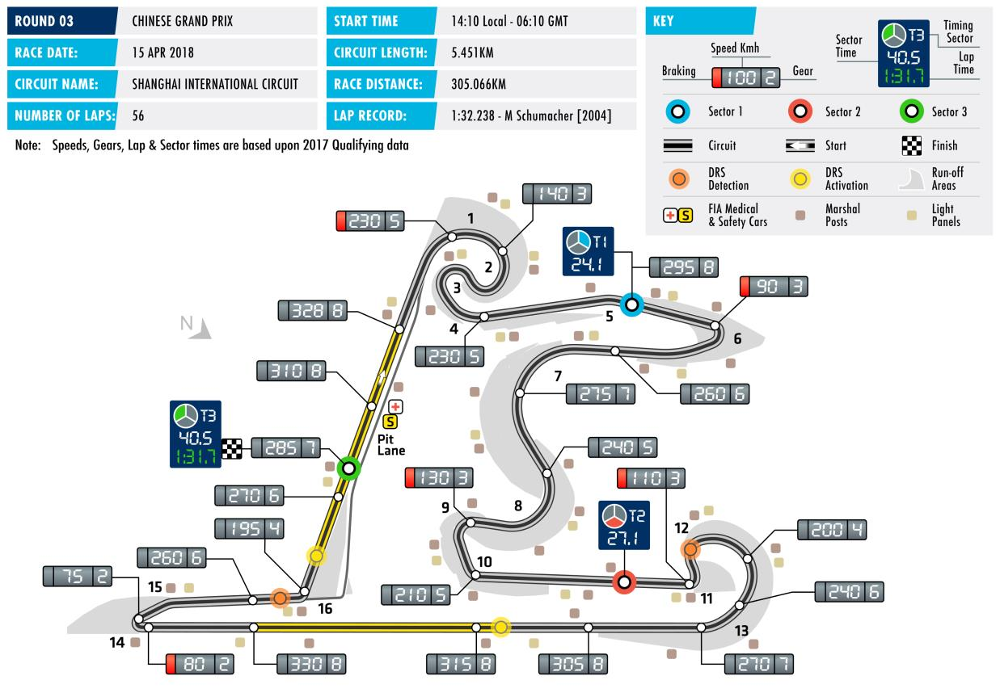

The Shanghai International Circuit boasts various winding turns and high-speed straights, demanding a great deal of acceleration and deceleration, while providing numerous overtaking opportunities.

28

|  | 2018 FORMULA ONE CHINESE GRAND PRIX RESULTS |  |  |  |  |
| --- | --- | --- | --- | --- | --- |
| POS |  | DRIVER | TEAM | TIME/RETIRED | GRID |

1 Daniel Ricciardo Red Bull Racing TAG Heuer 1:35.36:380 6

2 Valtteri Bottas Mercedes +8.894 3

3 Kimi Räikkönen Ferrari +9.637 2

4 Lewis Hamilton Mercedes +16.985 4

5 Max Verstappen Red Bull Racing TAG Heuer +20.436 5

6 Nico Hülkenberg Renault +21.052 7

7 Fernando Alonso McLaren Renault +30.639 13

8 Sebastian Vettel Ferrari +35.286 1

9 Carlos Sainz Jr. Renault +35.763 9

10 Kevin Magnussen Haas Ferrari +39.594 11

11 Esteban Ocon Force India Mercedes +44.050 12

12 Sergio Pérez Force India Mercedes +44.725 8

13 Stoffel Vandoorne McLaren Renault +49.373 14

14 Lance Stroll Williams Mercedes +55.490 18

15 Sergey Sirotkin Williams Mercedes +58.241 16

16 Marcus Ericsson Sauber Ferrari +1:02.604 20

17 Romain Grosjean Haas Ferrari +1:05.296 10

18 Pierre Gasly Scuderia Toro Rosso Honda +1:06.330 17

19 Charles Leclerc Sauber Ferrari +1:22.575 19

NC Brendon Hartley Scuderia Toro Rosso Honda DNF 15

Pole Position Sebastian Vettel 1:31.095

Fastest Lap Daniel Ricciardo 1:35.785

29

2018 FORMULA ONE AZERBAIJAN GRAND PRIX

BAKU

Date 29 April Race distance 306.051 km

Circuit length 6.001 km Number of laps 51

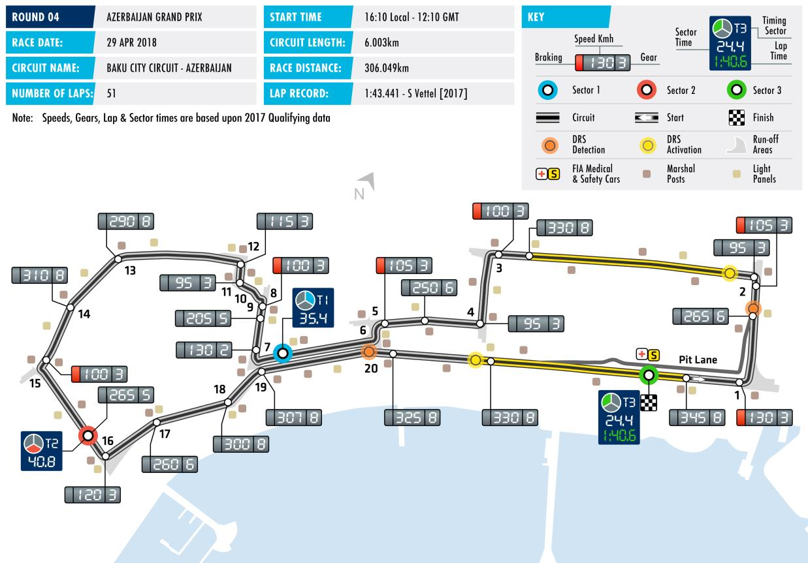

The six-kilometer, anti-clockwise layout of Baku City Circuit was designed by circuit architect Hermann Tilke. The circuit will start adjacent to Azadliq Square, looping around Government

House before heading west. From turn 8, the circuit will enter a narrow uphill section before

circling the Old City. A downhill section following the Old City leads to the 2.2km final stretch along Neftchilar Avenue, passing the historic Maiden Tower, on the way back to the

start/finish line.

30

|  | 2018 FORMULA ONE AZERBAIJAN GRAND PRIX RESULTS |  |  |  |  |
| --- | --- | --- | --- | --- | --- |
| POS |  | DRIVER | TEAM | TIME/RETIRED | GRID |

1 Lewis Hamilton Mercedes 1:43:44.291 2

2 Kimi Räikkönen Ferrari +2.460 6

3 Sergio Pérez Force India Mercedes +4.024 8

4 Sebastian Vettel Ferrari +5.329 1

5 Carlos Sainz Jr. Renault +7.515 9

6 Charles Leclerc Sauber Ferrari +9.158 13

7 Fernando Alonso McLaren Renault +10.931 12

8 Lance Stroll Williams Mercedes +12.546 10

9 Stoffel Vandoorne McLaren Renault +14.152 16

10 Brendon Hartley Scuderia Toro Rosso Honda +18.030 19

11 Marcus Ericsson Sauber Ferrari +18.512 18

12 Pierre Gasly Scuderia Toro Rosso Honda +24.720 17

13 Kevin Magnussen Haas Ferrari +40.663 15

14 Valtteri Bottas Mercedes DNF 3

NC Romain Grosjean Haas Ferrari DNF 20

| NC | Max Verstappen | Red Bull Racing TAG Heuer | DNF | 5 |
| --- | --- | --- | --- | --- |
| NC | Daniel Ricciardo | Red Bull Racing TAG Heuer | DNF | 4 |
| NC | Nico Hülkenberg | Renault | DNF | 14 |

NC Esteban Ocon Force India Mercedes DNF 7

NC Sergey Sirotkin Williams Mercedes DNF 11

Pole Position Sebastian Vettel 1:41.498

Fastest Lap Valtteri Bottas 1:45.149

31

2018 FORMULA ONE SPANISH GRAND PRIX

CATALUNYA

Date 13 May Race distance 307.104 km

Circuit length 4.655 km Number of laps 66

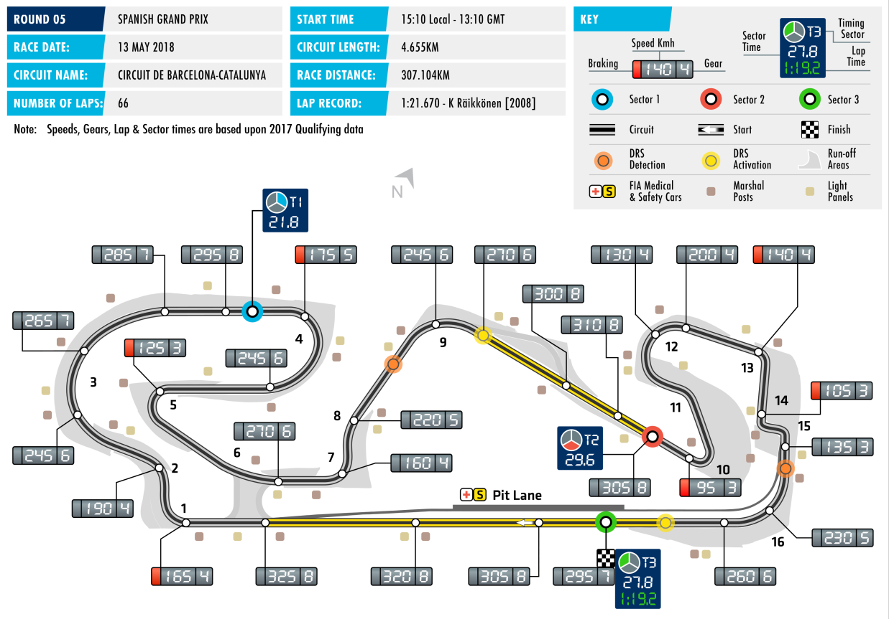

The Circuit de Catalunya was built in 1989 through the efforts of a Consortium composed of the Catalan Government, the Reial Automòbil Club de Catalunya (RACC) and the Montmeló

Town Council. In September 1991, the 35th Spanish F1 Grand Prix was held following a

seventeen-year of absence in Catalonia. Today, the circuit is a familiar site for teams and drivers as the track is used for extensive offseason testing.

32

2018 FORMULA ONE SPANISH GRAND PRIX

| RESULTS |  |  |  |  |
| --- | --- | --- | --- | --- |
| POS | DRIVER | TEAM | TIME/RETIRED | GRID |

1 Lewis Hamilton Mercedes 1:35.29.972 1

2 Valtteri Bottas Mercedes +20.593 2

3 Max Verstappen Red Bull Racing TAG Heuer +26.873 5

4 Sebastian Vettel Ferrari +27.584 3

5 Daniel Ricciardo Red Bull Racing TAG Heuer +50.058 6

6 Kevin Magnussen Haas Ferrari +1 Lap 7

7 Carlos Sainz Jr. Renault +1 Lap 9

8 Fernando Alonso McLaren Renault +1 Lap 8

9 Sergio Pérez Force India Mercedes +2 Laps 15

10 Charles Leclerc Sauber Ferrari +2 Laps 14

11 Lance Stroll Williams Mercedes +2 Laps 18

12 Brendon Hartley Scuderia Toro Tosso Honda +2 Laps 20

13 Marcus Ericsson Sauber Ferrari +2 Laps 17

14 Sergey Sirotkin Williams Mercedes +3 Laps 19

NC Stoffel Vandoorne McLaren Renault DNF 11

| NC | Esteban Ocon | Force India Mercedes | DNF | 13 |
| --- | --- | --- | --- | --- |
| NC | Kimi Räikkönen | Ferrari | DNF | 4 |
| NC | Romain Grosjean | Haas Ferrari | DNF | 10 |

NC Pierre Gasly Scuderia Toro Tosso Honda DNF 12

NC Nico Hülkenberg Renault DNF 16

Pole Position Lewis Hamilton 1:16.173

Fastest Lap Daniel Ricciardo 1:18.441

33

2018 FORMULA ONE MONACO GRAND PRIX

MONTE CARLO

Date 27 May Race distance 206.520 km

Circuit length 3.340 km Number of laps 78

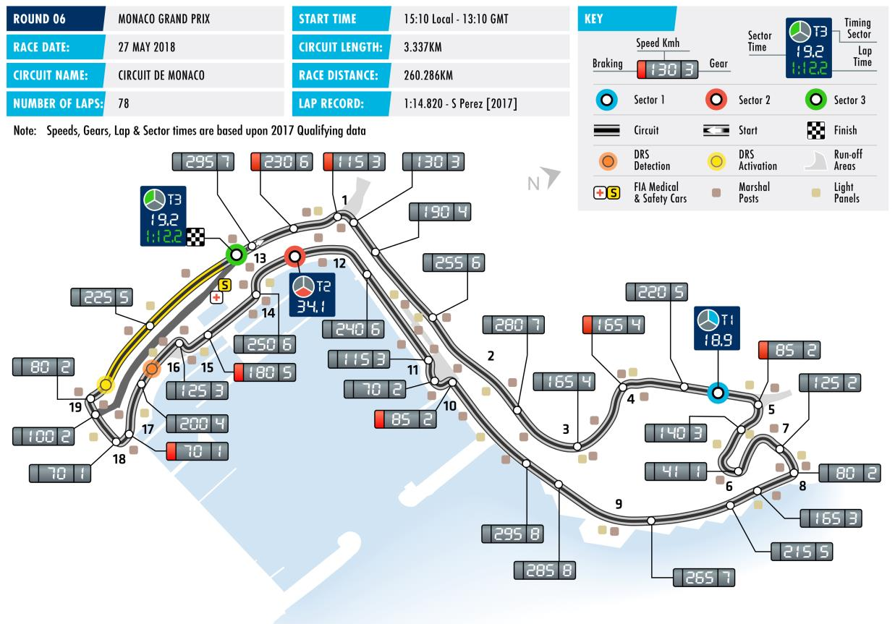

Monaco remains one of the most prestigious auto races in the world, long recognized for its entertainment and celebrity presence. Motorsports most famous street circuit takes six weeks

to build up and organize, offering drivers with the challenge of negotiating numerous

elevation shifts and very tight corners, including one of the slowest corners in F1 racing as well as one of the fastest. Due to its unique configuration, change in speeds and lack of straights,

keeping the engine cool is a point of focus for the teams, as Formula One cars depend on air

moving over the car to remove heat and don’t use formal cooling technology.

34

|  | 2018 FORMULA ONE MONACO GRAND PRIX RESULTS |  |  |  |  |
| --- | --- | --- | --- | --- | --- |
| POS |  | DRIVER | TEAM | TIME/RETIRED | GRID |

1 Daniel Ricciardo Red Bull Racing TAG Heuer 1:42:4.807 1

2 Sebastian Vettel Ferrari +7.336 2

3 Lewis Hamilton Mercedes +17.013 3

4 Kimi Räikkönen Ferrari +18.127 4

5 Valterri Bottas Mercedes +18.822 5

6 Esteban Ocon Force India Mercedes +23.667 6

7 Pierre Gasly Scuderia Toro Rosso Honda +24.331 10

8 Nico Hülkenberg Renault +24.839 11

9 Max Verstappen Red Bull Racing TAG Heuer +25.317 20

10 Carlos Sainz Jr. Renault +1:09.013 8

11 Marcus Ericsson Sauber Ferrari +1:09.864 16

12 Sergio Pérez Force India Mercedes +1:10.461 9

13 Kevin Magnussen Haas Ferrari +1:14.823 19

14 Stoffel Vandoorne McLaren Renault +1 Lap 12

15 Romain Grosjean Haas Ferrari +1 Lap 18

| 16 | Sergey Sirotkin | Williams Mercedes | +1 Lap | 13 |
| --- | --- | --- | --- | --- |
| 17 | Lance Stroll | Williams Mercedes | +2 Laps | 17 |
| NC | Charles Leclerc | Sauber Ferrari | DNF | 14 |

NC Brendon Hartley Scuderia Toro Rosso Honda DNF 15

NC Fernando Alonso McLaren Renault DNF 7

Pole Position Daniel Ricciardo 1:10.810

Fastest Lap Max Verstappen 1:14.260

35

2018 FORMULA ONE CANADIAN GRAND PRIX

MONTREAL

Date 10 June Race distance 305.270 km

Circuit length 4.361 km Number of laps 70

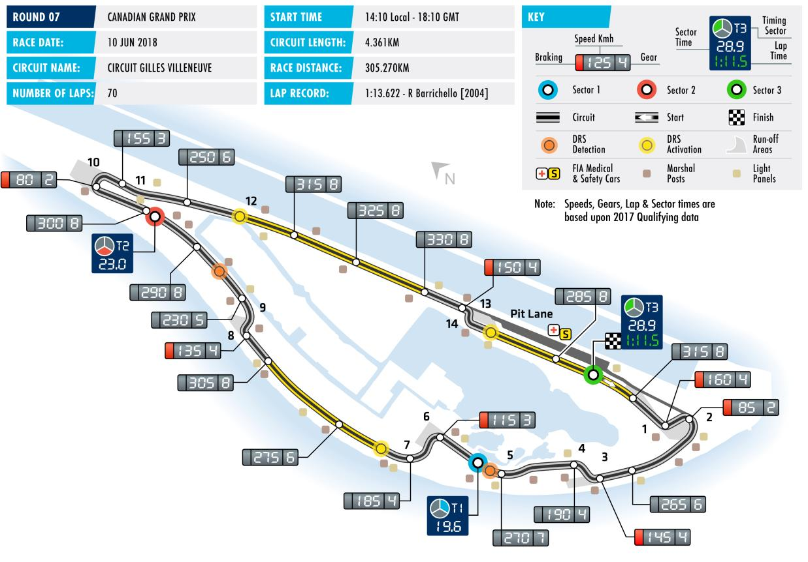

The circuit, on Ile Notre Dame, a man-made island on the St. Lawrence River, was renamed

for Canadian Formula One driver Gilles Villenueve, following his death in 1982. 2006 saw the

last occasion when US-based Champ Car and F1 ran on the same track. Formula One’s performance proved significantly better with a 5-to-7 second advantage both in terms of

qualifying and recording of fastest lap times during the respective races. The Canadian

Grand Prix continues to be tremendously popular with both teams and drivers, owing to its festive atmosphere.

36

2018 FORMULA ONE CA NADIAN GRAND PRIX

|  | RESULTS |  |  |  |  |
| --- | --- | --- | --- | --- | --- |
| POS |  | DRIVER | TEAM | TIME/RETIRED | GRID |

1 Sebastian Vettel Ferrari 1:28:31.377 1

2 Valtteri Bottas Mercedes +7.376 2

3 Max Verstappen Red Bull Racing TAG Heuer +8.360 3

4 Daniel Ricciardo Red Bull Racing TAG Heuer +20.892 6

5 Lewis Hamilton Mercedes +21.559 4

6 Kimi Räikkönen Ferrari +27.184 5

7 Nico Hülkenberg Renault +1 Lap 7

8 Carlos Sainz Jr. Renault +1 Lap 9

9 Esteban Ocon Force India Mercedes +1 Lap 8

10 Charles Leclerc Sauber Ferarri +1 Lap 13

11 Pierre Gasly Scuderia Toro Rosso Honda +1 Lap 19

12 Romain Grosjean Haas Ferrari +1 Lap 20

13 Kevin Magnussen Haas Ferrari +1 Lap 11

14 Sergio Pérez Force India Mercedes +1 Lap 10

15 Marcus Ericsson Sauber Ferrari +2 Laps 18

| 16 | Stoffel Vandoorne | McLaren Renault | +2 Laps | 15 |
| --- | --- | --- | --- | --- |
| 17 | Sergey Sirotkin | Williams Mercedes | +2 Laps | 17 |
| NC | Fernando Alonso | McLaren Renault | DNF | 14 |

NC Brendon Hartley Scuderia Toro Rosso Honda DNF 12

NC Lance Stroll Williams Mercedes DNF 16

Pole Position Sebastian Vettel 1:10.764

Fastest Lap Max Verstappen 1:13.864

37

2018 FORMULA ONE FRENCH GRAND PRIX

PAUL RICARD

Date 24 June Race distance 309.69 km

Circuit length 5.482 km Number of laps 53

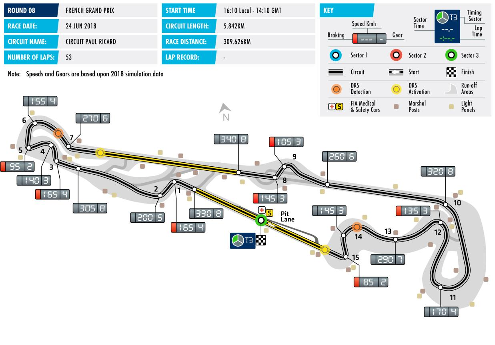

The Circuit Paul Ricard’s even distribution of high-, medium- and low-speed corners is a key reason why it’s one of the most used test circuits in the world (the typically good weather is another). F1 drivers love the 290km/h right-hander at Signes and the 5g joyride of the following Beausset bend, while the circuit’s 2018 return to the F1 calendar showed that the French Grand Prix track is a bit of an overtaking gem.

38

2018 FORMULA ONE FRENCH GRAND PRIX

|  | RESULTS |  |  |  |  |
| --- | --- | --- | --- | --- | --- |
| POS |  | DRIVER | TEAM | TIME/RETIRED | GRID |

1 Lewis Hamilton Mercedes 1:30:11.385 1

2 Max Verstappen Red Bull Racing TAG Heuer +7.090 4

3 Kimi Räikkönen Ferrari +25.888 6

4 Daniel Ricciardo Red Bull Racing TAG Heuer +34.736 5

5 Sebastian Vettel Ferrari +1:01.935 3

6 Kevin Magnussen Haas Ferrari +1:19.364 9

7 Valtteri Bottas Mercedes +1:20.632 2

8 Carlos Sainz Jr. Renault +1:27.184 7

9 Nico Hülkenberg Renault +1:31.989 12

10 Charles Leclerc Sauber Ferrari +1:33.873 8

11 Romain Grosjean Haas Ferrari +1 Lap 10

12 Stoffel Vandoorne McLaren Renault +1 Lap 17

13 Marcus Ericsson Sauber Ferrari +1 Lap 15

14 Brendon Hartley Scuderia Toro Rosso Honda +1 Lap 20

15 Sergey Sirotkin Williams Mercedes +1 Lap 18

| 16 | Fernando Alonso | McLaren Renault | DNF | 16 |
| --- | --- | --- | --- | --- |
| 17 | Lance Stroll | Williams Mercedes | DNF | 19 |
| NC | Sergio Pérez | Force India Mercedes | DNF | 13 |

NC Esteban Ocon Force India Mercedes DNF 11

NC Pierre Gasly Scuderia Toro Rosso Honda DNF 14

Pole Position Lewis Hamilton 1:30.029

Fastest Lap Valtteri Bottas 1:34.225

39

2018 FORMULA ONE AUSTRIAN GRAND PRIX

SPIELBERG

Date 01 July Race distance 307.020 km

Circuit length 4.326 km Number of laps 71

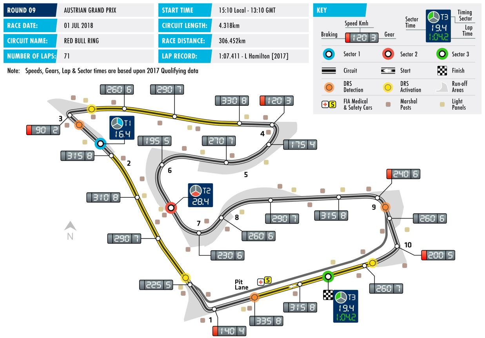

2014 saw a triumphant return for the Austrian Grand Prix at the Red Bull Ring in the town of Spielberg, which previously hosted the Austrian Grand Prix in 2003, when the circuit was known as the A1-Ring. The fearsome, original Osterreichring was originated in 1969 as a replacement for the Zeltweg airfield circuit. The track known today as the Red Bull Ring was more or less created over the winter of 1995-6, when Hermann Tilke was engaged to turn the Osterreichring into a shorter, more modern race track.

40

2018 FORMULA ONE AUSTRIAN GRAND PRIX

|  | RESULTS |  |  |  |  |
| --- | --- | --- | --- | --- | --- |
| POS |  | DRIVER | TEAM | TIME/RETIRED | GRID |

1 Max Verstappen Red Bull Racing TAG Heuer 1:21.56.024 4

2 Kimi Räikkönen Ferrari +1.504 3

3 Sebastian Vettel Ferrari +3.181 6

4 Romain Grosjean Haas Ferrari +1 Lap 5

5 Kevin Magnussen Haas Ferrari +1 Lap 8

6 Esteban Ocon Force India Mercedes +1 Lap 11

7 Sergio Pérez Force India Mercedes +1 Lap 15

8 Fernando Alonso McLaren Renault +1 Lap PL

9 Charles Leclerc Sauber Ferrari +1 Lap 17

10 Marcus Ericsson Sauber Ferrari +1 Lap 18

11 Pierre Gasly Scuderia Toro Rosso Honda +1 Lap 12

12 Carlos Sainz Jr. Renault +1 Lap 9

13 Sergey Sirotkin Williams Mercedes +2 Laps 16

14 Lance Stroll Williams Mercedes +2 Laps 13

NC Stoffel Vandoorne McLaren Renault DNF 14

| NC | Lewis Hamilton | Mercedes | DNF | 2 |
| --- | --- | --- | --- | --- |
| NC | Brendon Hartley | Scuderia Toro Rosso Honda | DNF | 19 |
| NC | Daniel Ricciardo | Red Bull Racing TAG Heuer | DNF | 7 |

NC Valtteri Bottas Mercedes DNF 1

NC Nico Hülkenberg Renault DNF 10

Pole Position Valtteri Bottas 1:03.130

Fastest Lap Kimi Räikkönen 1:06.957

41

2018 FORMULA ONE BRITISH GRAND PRIX

SILVERSTONE

Date 08 July Race distance 306.198 km

Circuit length 5.891 km Number of laps 52

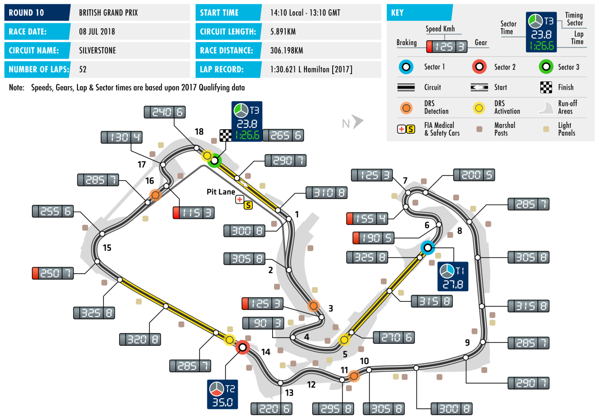

Silverstone continues to be a top draw for fans of Formula 1, offering a rich tradition of racing,

a fast and challenging track, as well as the constant prospect of weather playing a critical role in race day strategy. Contracted to host F1 through 2027, Silverstone offers motorsport

fans a wealth of viewing options staging events through the year, including British F3, Le Mans

Series, and MotoGP, among others. The circuit has undergone major modifications and rebuilds, primarily in 1991 and most recently in 2010.

42

2018 FORMULA ONE BRITISH GRAND PRIX

|  | RESULTS |  |  |  |  |
| --- | --- | --- | --- | --- | --- |
| POS |  | DRIVER | TEAM | TIME/RETIRED | GRID |

1 Sebastian Vettel Ferrari 1:27:29.784 2

2 Lewis Hamilton Mercedes +2.264 1

3 Kimi Räikkönen Ferrari +3.652 3

4 Valtteri Bottas Mercedes +8.88 4

5 Daniel Ricciardo Red Bull Racing TAG Heuer +9.500 6

6 Nico Hülkenberg Renault +28.220 11

7 Esteban Ocon Force India Mercedes +29.930 10

8 Fernando Alonso McLaren Renault +31.115 13

9 Kevin Magnussen Haas Ferrari +33.188 7

10 Sergio Pérez Force India Mercedes +34.708 12

11 Stoffel Vandoorne McLaren Renault +35.774 17

12 Lance Stroll Williams Mercedes +38.106 PL

13 Pierre Gasly Scuderia Toro Rosso Honda +39.129 14

14 Sergey Sirotkin Williams Mercedes +48.113 PL

NC Max Verstappen Red Bull Racing TAG Heuer DNF 5

| NC | Romain Grosjean | Haas Ferrari | DNF | 8 |
| --- | --- | --- | --- | --- |
| NC | Carlos Sainz Jr. | Renault | DNF | 16 |
| NC | Marcus Ericsson | Sauber Ferrari | DNF | 15 |

NC Charles Leclerc Sauber Ferrari DNF 9

NC Brendon Hartley Scuderia Toro Rosso Honda DNF PL

Pole Position Lewis Hamilton 1:25.892

Fastest Lap Sebastian Vettel 1:30.696

43

2018 FORMULA ONE GERMAN GRAND PRIX

HOCKENHEIM

Date 22 July Race distance 306.458 km

Circuit length 4.574 km Number of laps 67

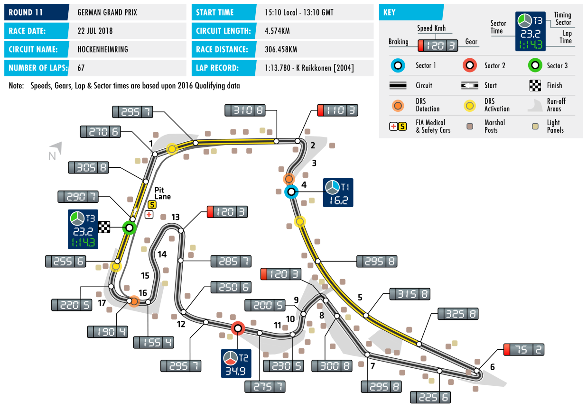

Hockenheim dates all the way back to 1932, when it was created by Mercedes as a test track for their cars, in particular to fettle them for the Tripoli Grand Prix. The original track was an enormous 12km triangular affair – in fact it was called the ‘Dreieckskurs’, or 'Triangle Track' – that speared off to the outskirts of nearby Oftersheim before looping back via the current B291.

44

2018 FORMULA ONE GERMAN GRAND PRIX

| RESULTS |  |  |  |  |
| --- | --- | --- | --- | --- |
| POS | DRIVER | TEAM | TIME/RETIRED | GRID |

1 Lewis Hamilton Mercedes 1:32:29.845 14

2 Valtteri Bottas Mercedes +4.535 2

3 Kimi Räikkönen Ferrari +6.732 3

4 Max Verstappen Red Bull Racing TAG Heuer +7.654 4

5 Nico Hülkenberg Renault +26.609 7

6 Romain Grosjean Haas Ferrari +28.871 6

+30.556 7 Sergio Pérez Force India Mercedes 10

+31.750 8 Esteban Ocon Force India Mercedes 15

+32.362 9 Marcus Ericsson Sauber Ferrari 13

+34.197 10 Brendon Hartley Scuderia Toro Rosso Honda 16

+34.919 11 Kevin Magnussen Haas Ferrari 5

+43.069 12 Carlos Sainz Jr. Renault 8

+46.617 13 Stoffel Vandoorne McLaren Renault 18

+1 Lap 14 Pierre Gasly Scuderia Toro Rosso Honda 20

15 Charles Leclerc Sauber Ferrari +1 Lap 9

| NC | Fernando Alonso | McLaren Renault | DNF | 11 |
| --- | --- | --- | --- | --- |
| NC | Lance Stroll | Williams Mercedes | DNF | 17 |
| NC | Sebastian Vettel | Ferrari | DNF | 1 |

NC Sergey Sirotkin Williams Mercedes DNF 12

NC Daniel Ricciardo Red Bull Racing TAG Heuer DNF 19

Pole Position Sebastian Vettel 1:11.212

Fastest Lap Lewis Hamilton 1:15.545

45

2018 FORMULA ONE HUNGARIAN GRAND PRIX

BUDAPEST

Date 29 July Race distance 306.630 km

Circuit length 4.381 km Number of laps 70

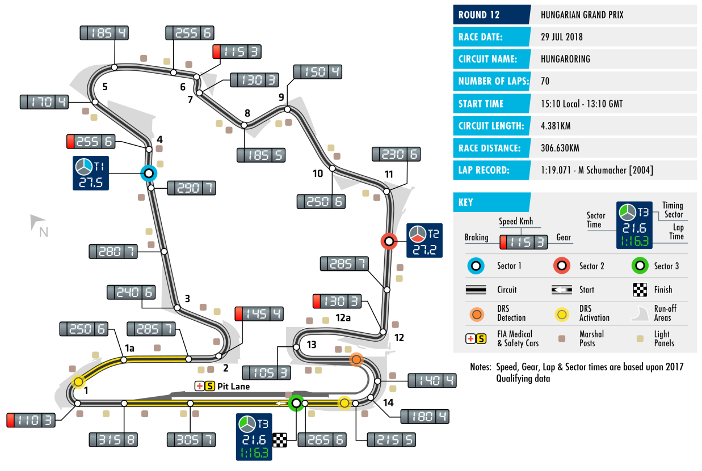

Home of the first Grand Prix to have been held behind the “Iron Curtain”, The Hungaroring

was built in record time and remains today a major attraction in Hungary. Held in the summer,

the circuit is built in a valley allowing excellent vantage points for spectators.

46

2018 FORMULA ONE HUNGARIAN GRAND PRIX

| RESULTS |  |  |  |  |
| --- | --- | --- | --- | --- |
| POS | DRIVER | TEAM | TIME/RETIRED | GRID |

1 Lewis Hamilton Mercedes 1:37:16.427 1

2 Sebastian Vettel Ferrari +17.123 4

3 Kimi Räikkönen Ferrari +20.101 3

4 Daniel Ricciardo Red Bull Racing TAG Heuer +46.419 12

5 Valtteri Bottas Mercedes +1:00.000 2

6 Pierre Gasly Scuderia Toro Rosso Honda +1:13.273 6

7 Kevin Magnussen Haas Ferrari +1 Lap 9

8 Fernando Alonso McLaren Renault +1 Lap 11

9 Carlos Sainz Jr. Renault +1 Lap 5

10 Romain Grosjean Haas Ferrari +1 Lap 10

11 Brendon Hartley Scuderia Toro Rosso Honda +1 Lap 8

12 Nico Hülkenberg Renault +1 Lap 13

13 Esteban Ocon Force India Mercedes +1 Lap 17

14 Sergio Pérez Force India Mercedes +1 Lap 18

15 Marcus Ericsson Sauber Ferrari +2 Laps 14

| 16 | Sergey Sirotkin | Williams Mercedes | +2 Laps | 19 |
| --- | --- | --- | --- | --- |
| 17 | Lance Stroll | Williams Mercedes | +2 Laps | PL |
| NC | Stoffel Vandoorne | McLaren Renault | DNF | 15 |

NC Max Verstappen Red Bull Racing TAG Heuer DNF 7

NC Charles Leclerc Sauber Ferrari DNF 16

Pole Position Lewis Hamilton 1:35.658

Fastest Lap Daniel Ricciardo 1:20.012

47

2018 FORMULA ONE BELGIAN GRAND PRIX

SPA-FRANCORCHAMPS

Date 26 August Race distance 308.052 km

Circuit length 7.004 km Number of laps 44

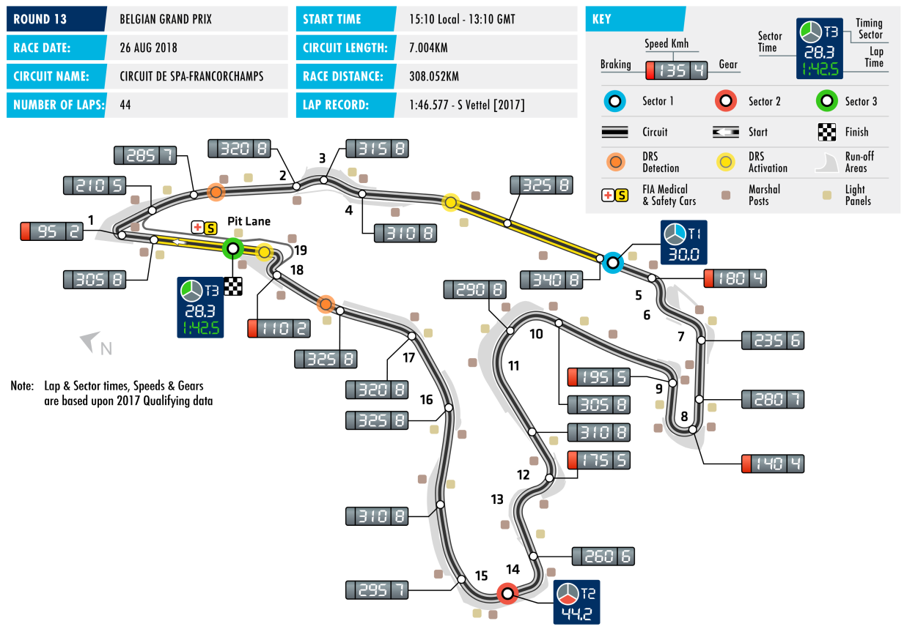

The Circuit de Spa-Francorchamps is legendary among race enthusiasts for its long-standing history and unique setting. It is considered one of the most challenging tracks in the world,

mainly due to its fast, hilly and twisty layout within the Ardennes Forest. The circuit tests driver

skills especially when trying to negotiate the Eau Rouge and Blanchimont corners. Designed originally in 1920, Spa-Francorchamps also plays host to a range of other race series including

the Spa 24 Hours endurance race.

48

|  | 2018 FORMULA ONE BELGIAN GRAND PRIX RESULTS |  |  |  |  |
| --- | --- | --- | --- | --- | --- |
| POS |  | DRIVER | TEAM | TIME/RETIRED | GRID |

1 Lewis Hamilton Mercedes 1:16:54.484 3

2 Kimi Räikkönen Ferrari +8.705 1

3 Valtteri Bottas Mercedes +14.06616.151 4

4 Sebastian Vettel Ferrari +18.208 2

5 Max Verstappen Red Bull Racing TAG Heuer +57.761 5

6 Esteban Ocon Force India Mercedes +58.678 8

7 Sergio Pérez Force India Mercedes +1:18.140 14

8 Carlos Sainz Jr. Renault +1 Lap 7

9 Lance Stroll Williams Mercedes +1 Lap 10

10 Sergey Sirotkin Williams Mercedes +1 Lap 12

11 Charles Leclerc Sauber Ferrari +1 Lap 15

12 Stoffel Vandoorne McLaren Renault +1 Lap 17

13 Nico Hülkenberg Renault +1 Lap 20

14 Pierre Gasly Scuderia Toro Rosso Honda +1 Lap 9

15 Marcus Ercisson Sauber Ferrari +1 Lap 18

| 16 | Kevin Magnussen | Haas Ferrari | DNF | 11 |
| --- | --- | --- | --- | --- |
| NC | Daniel Ricciardo | Red Bull Racing TAG Heuer | DNF | 19 |
| NC | Fernando Alonso | McLaren Renault | DNF | 13 |

NC Brendon Hartley Scuderia Toro Rosso Honda DNF 16

NC Romain Grosjean Haas Ferrari DNF 6

Pole Position Lewis Hamilton 1:58.179

Fastest Lap Valtteri Bottas 1:46.286

49

2018 FORMULA ONE ITALIAN GRAND PRIX

MONZA

Date 2 September Race distance 306.720 km

Circuit length 5.793 km Number of laps 53

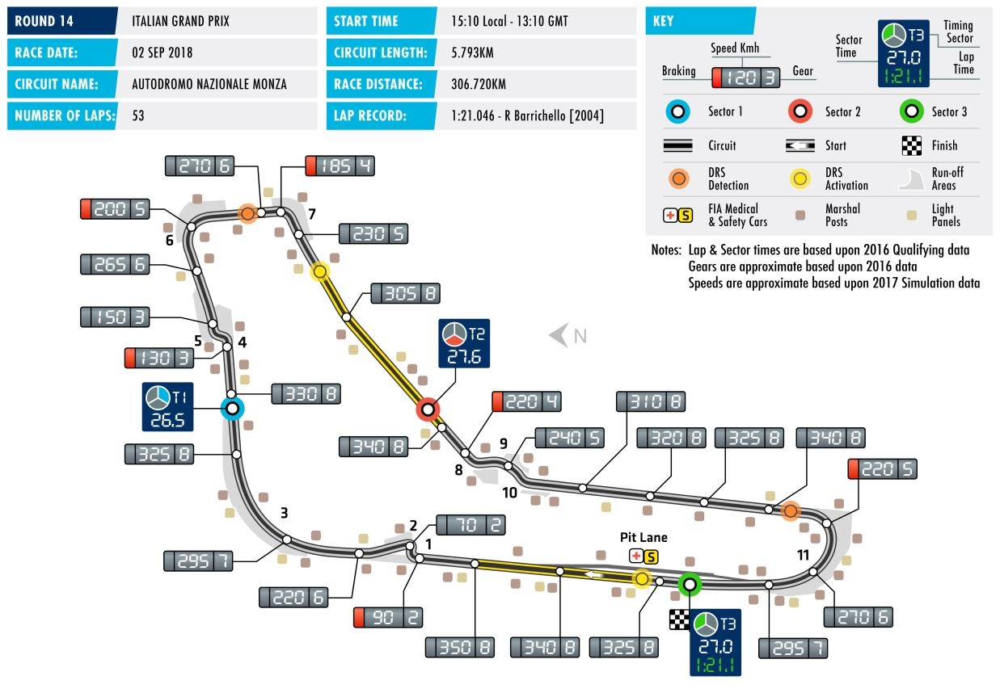

Monza has hosted the Italian Grand Prix since the inception of F1. A singular atmosphere with

a dedicated following among the Italian “Tifosi”, Monza boasts some of the sport’s most famous turns, including Curva di Lesmo, and the Curva Parabolica, providing high speed thrills

for both drivers and spectators.

50

2018 FORMULA ONE ITALIAN GRAND PRIX

|  | RESULTS |  |  |  |  |
| --- | --- | --- | --- | --- | --- |
| POS |  | DRIVER | TEAM | TIME/RETIRED | GRID |

1 Sebastian Vettel Ferrari 1:23:34.476 2

2 Lewis Hamilton Mercedes +11.061 1

3 Max Verstappen Red Bull Racing TAG Heuer +31.372 7

4 Valtteri Bottas Mercedes +1:08.605 17

5 Sergio Pérez Force India Mercedes +1:11.023 4

6 Esteban Ocon Force India Mercedes +1:19.520 3

7 Romain Grosjean Haas Ferrari +1:25.953 5

8 Kevin Magnussen Haas Ferrari +1:27.639 9

9 Pierre Gasly Scuderia Toro Rosso Honda +1:45.892 10

10 Marcus Ericsson Sauber Ferrari +1 Lap 13

11 Carlos Sainz Jr. Renault +1 Lap 19

12 Sergey Sirotkin Williams Mercedes +1 Lap 15

13 Lance Stroll Williams Mercedes +1 Lap 16

14 Brendon Hartley Scuderia Toro Rosso Honda +1 Lap 11

NC Stoffel Vandoorne McLaren Renault DNF 20

| NC | Daniel Ricciardo | Red Bull Racing TAG Heuer | DNF | 8 |
| --- | --- | --- | --- | --- |
| NC | Kimi Räikkönen | Ferrari | DNF | 6 |
| NC | Charles Leclerc | Sauber Ferrari | DNF | 12 |

NC Fernando Alonso McLaren Renault DNF 14

NC Nico Hülkenberg Renault DNF 18

Pole Position Kimi Räikkönen 1:19.119

Fastest Lap Lewis Hamilton 1:22.497

51

2018 FORMULA ONE SINGAPORE GRAND PRIX

SINGAPORE

Date 16 September Race distance 308.828 km

Circuit length 5.065 km Number of laps 61

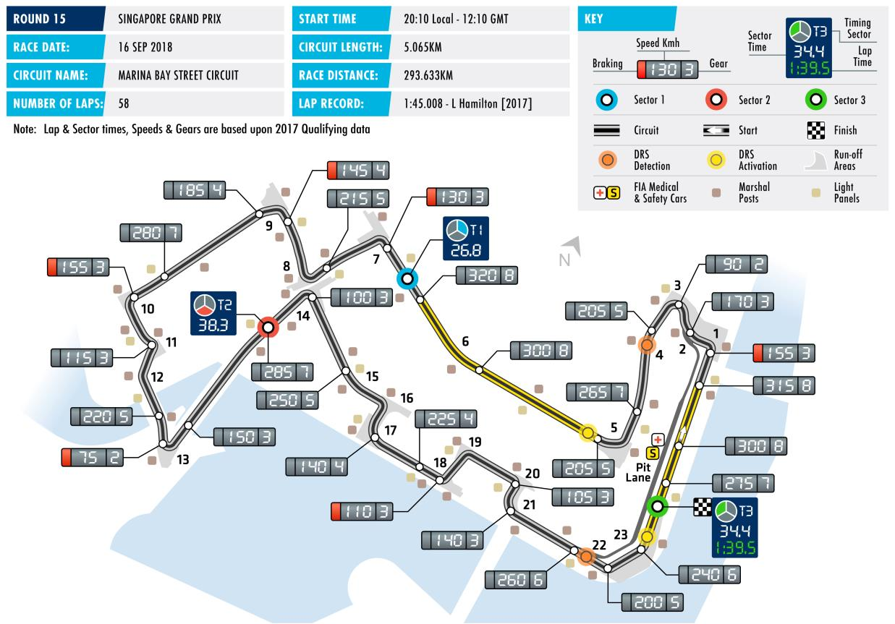

The Marina Bay Street Circuit plays host to the Singapore Grand Prix, Formula One’s first ever night race. Given its city setting, the circuit is popular with fans and teams for its easy access,

allowing many of the drivers and engineers to simply walk from their hotels to the circuit.

Drivers must negotiate tight racing lines, adjust to driving at night under a vast and sophisticated lighting system, and ensure their fitness to deal with the high levels of humidity.

52

2018 FORMULA ONE SINGAPORE GRAND PRIX

| RESULTS |  |  |  |  |
| --- | --- | --- | --- | --- |
| POS | DRIVER | TEAM | TIME/RETIRED | GRID |

1 Lewis Hamilton Mercedes 1:51:11.611 1

2 Max Verstappen Red Bull Racing TAG Heuer +8.961 2

3 Sebatian Vettel Ferrari +39.945 3

4 Valtteri Bottas Mercedes +51.930 4

5 Kimi Räikkönen Ferrari +53.001 5

6 Daniel Ricciardo Red Bull Racing TAG Heuer +53.982 6

7 Fernando Alsonso McLaren Renault +1:43.011 11

8 Carlos Sainz Jr. Renault +1 Lap 12

9 Charles Leclerc Sauber Ferrari +1 Lap 13

10 Nico Hülkenberg Renault +1 Lap 10

11 Marcus Ericsson Sauber Ferrari +1 Lap 14

12 Stoffel Vandoorne McLaren Renault +1 Lap 18

13 Pierre Gasly Scuderia Toro Rosso Honda +1 Lap 15

14 Lance Stroll Williams Mercedes +1 Lap 20

15 Romain Grosjean Haas Ferrari +1 Lap 8

| 16 | Sergio Pérez | Force India Mercedes | +1 Lap | 7 |
| --- | --- | --- | --- | --- |
| 17 | Brendon Hartley | Scuderia Toro Rosso Honda | +1 Lap | 17 |
| 18 | Kevin Magnussen | Haas Ferrari | +2 Laps | 16 |

19 Sergey Sirotkin Williams Mercedes +2 Laps 19

NC Esteban Ocon Force India Mercedes DNF 9

Pole Position Lewis Hamilton 1:36.015

Fastest Lap Kevin Magnussen 1:41.905

53

2018 FORMULA ONE RUSSIAN GRAND PRIX

SOCHI

Date 30 September Race distance 310.209 km

Circuit length 5.854 km Number of laps 53

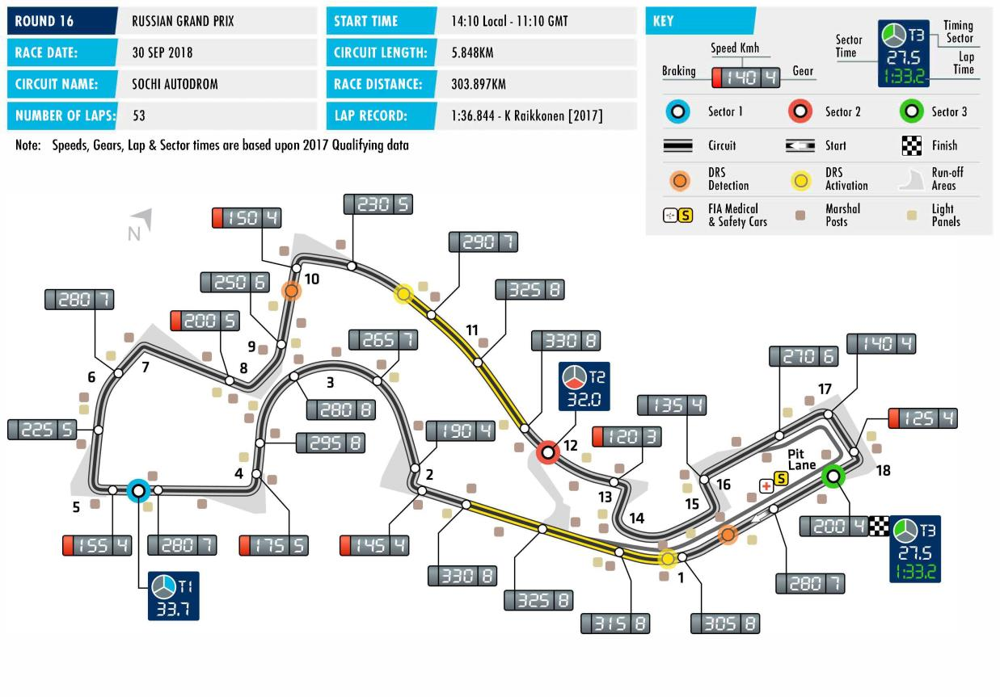

Sochi Autodrom circuit is located in the Black Sea resort of the same name. Sochi is the first

purpose-built Formula One facility in Russia and hosted the country’s inaugural Grand Prix in October 2014, in the same year that the city also staged the Winter Olympics.

54

2018 FORMULA ONE RUSSIAN GRAND PRIX

|  | RESULTS |  |  |  |  |
| --- | --- | --- | --- | --- | --- |
| POS |  | DRIVER | TEAM | TIME/RETIRED | GRID |

1 Lewis Hamilton Mercedes 1:27:25.181 2

2 Valtteri Bottas Mercedes +2.545 1

3 Sebastian Vettel Ferrari +7.487 3

4 Kimi Räikkönen Ferrari +16.543 4

5 Max Verstappen Red Bull Racing TAG Heuer +31.016 19

6 Daniel Ricciardo Red Bull Racing TAG Heuer +1:20.451 18

7 Charles Leclerc Sauber Ferrari +1:38.390 7

8 Kevin Magnussen Haas Ferrari +1 Lap 5

+1 Lap 9 Esteban Ocon Force India Mercedes 6

+1 Lap 10 Sergio Pérez Force India Mercedes 8

+1 Lap 11 Romain Grosjean Haas Ferrari 9

+1 Lap 12 Nico Hülkenberg Renault 12

+1 Lap 13 Marcus Ericsson Sauber Ferrari 10

+1 Lap 14 Fernando Alonso McLaren Renault 16

+1 Lap 15 Lance Stroll Williams Mercedes 14

16 Stoffel Vandoorne McLaren Renault +2 Laps 15

17 Carlos Sainz Renault +2 Laps 11

18 Sergey Sirotkin Williams Mercedes +2 Laps 13

NC Pierre Gasly Scuderia Toro Rosso Honda DNF 17

NC Brendon Hartley Scuderia Toro Rosso Honda DNF 20

Pole Position Valtteri Bottas 1:31.387

Fastest Lap Valtteri Bottas 1:35.861

55

2018 FORMULA ONE JAPANESE GRAND PRIX

SUZUKA

Date 7 October Race distance 307.471 km

Circuit length 5.807 km Number of laps 53

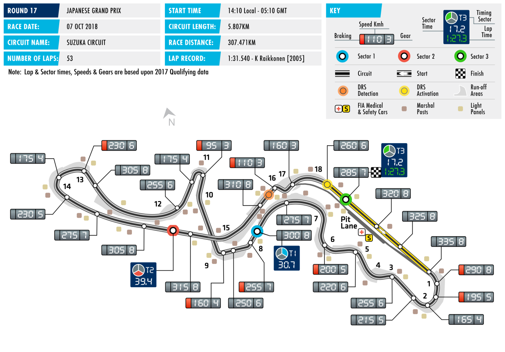

Designed as a Honda test track in 1962, Suzuka is one of few circuits in the world to have a

"figure 8" layout, where the back straight passes over the front via an overpass. Suzuka is

another of the racer’s favorite circuits with its exceptionally fast, flowing layout.

56

2018 FORMULA ONE JAPANESE GRAND PRIX

| RESULTS |  |  |  |  |
| --- | --- | --- | --- | --- |
| POS | DRIVER | TEAM | TIME/RETIRED | GRID |

1 Lewis Hamilton Mercedes 1:27:17.062 1

2 Valtteri Bottas Mercedes +12.919 2

3 Max Verstappen Red Bull Racing TAG Heuer +14.295 3

4 Daniel Ricciardo Red Bull Racing TAG Heuer +19.495 15

5 Kimi Räikkönen Ferrari +50.998 4

6 Sebastian Vettel Ferrari +1:09.873 8

7 Sergio Pérez Force India Mercedes +1:19.379 9

8 Romain Grosjean Haas Ferrari +1:27.198 5

9 Esteban Ocon Force India Mercedes +1:28.055 11

10 Carlos Sainz Renault +1 Lap 13

11 Pierre Gasly Scuderia Toro Rosso Honda +1 Lap 7

12 Marcus Ericsson Sauber Ferrari +1 Lap 20

13 Brendon Hartley Scuderia Toro Rosso Honda +1 Lap 6

14 Fernando Alonso McLaren Renault +1 Lap 18

15 Stoffel Vandoorne McLaren Renault +1 Lap 19

| 16 | Sergey Sirotkin | Williams Mercedes | +1 Lap | 17 |
| --- | --- | --- | --- | --- |
| 17 | Lance Stroll | Williams Mercedes | +1 Lap | 14 |
| NC | Charles Leclerc | Sauber Ferrari | DNF | 10 |

NC Nico Hülkenberg Renault DNF 16

NC Kevin Magnussen Haas Ferrari DNF 12

Pole Position Lewis Hamilton 1:27.760

Fastest Lap Sebastian Vettel 1:32.318

57

2018 FORMULA ONE UNITED STATES GRAND PRIX

AUSTIN

Date 21 October Race distance 308.405 km

Circuit length 5.513 km Number of laps 56

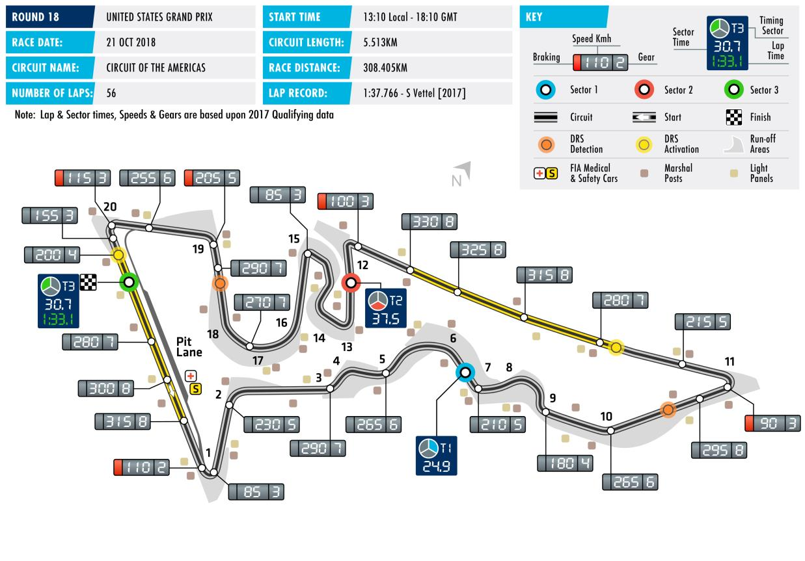

In 2012 The United States Grand Prix returned to the F1 calendar at Austin, Texas, the first Grand Prix on US soil since the 2007 race at the Indianapolis Motor Speedway. The track runs anticlockwise and features 20 corners, including sequences inspired by some of the world’s most celebrated circuits.

58

2018 FORMULA ONE MEXICO GRAND PRIX

MEXICO CITY

Date 28 October Race distance 305.354 km

Circuit length 4.304 km Number of laps 71

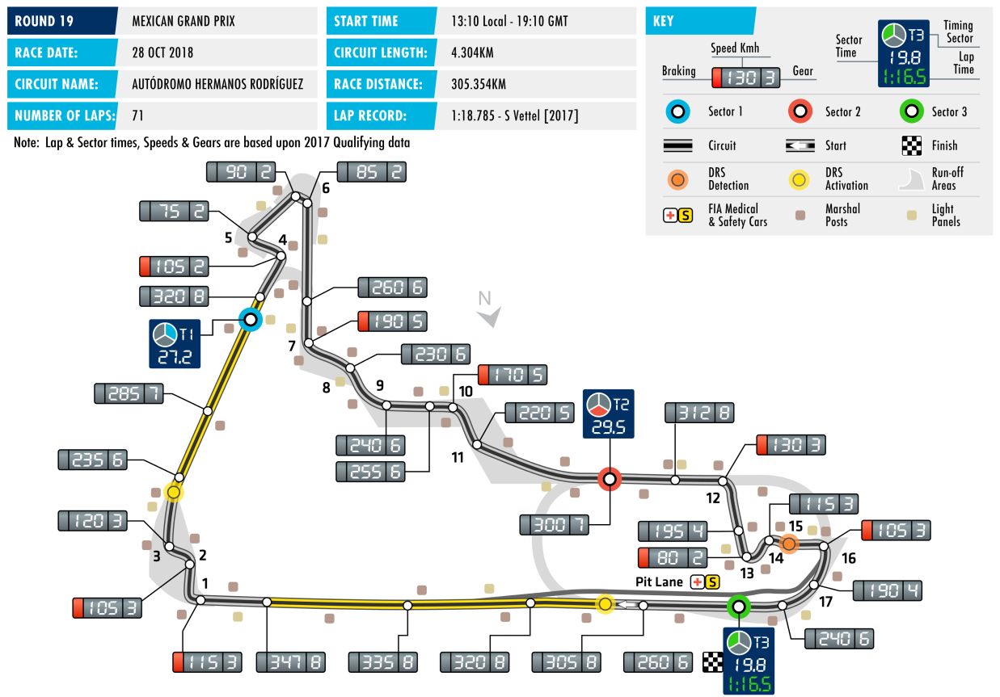

With its first race in 2015, the Autodromo Hermanos Rodriguz circuit is situated in the center of

Mexico City and has not held a Formula One Grand Prix since 1992. This race was won by

Nigel Mansell for the Williams Renault Team. The facility has been comprehensively upgraded, while the entire track was resurfaced for the occasion and changes made to a number of

corners including Peraltada.

59

2018 FORMULA ONE BRAZILIAN GRAND PRIX

SAO PAULO

Date 11 November Race distance 305.909 km

Circuit length 4.309 km Number of laps 71

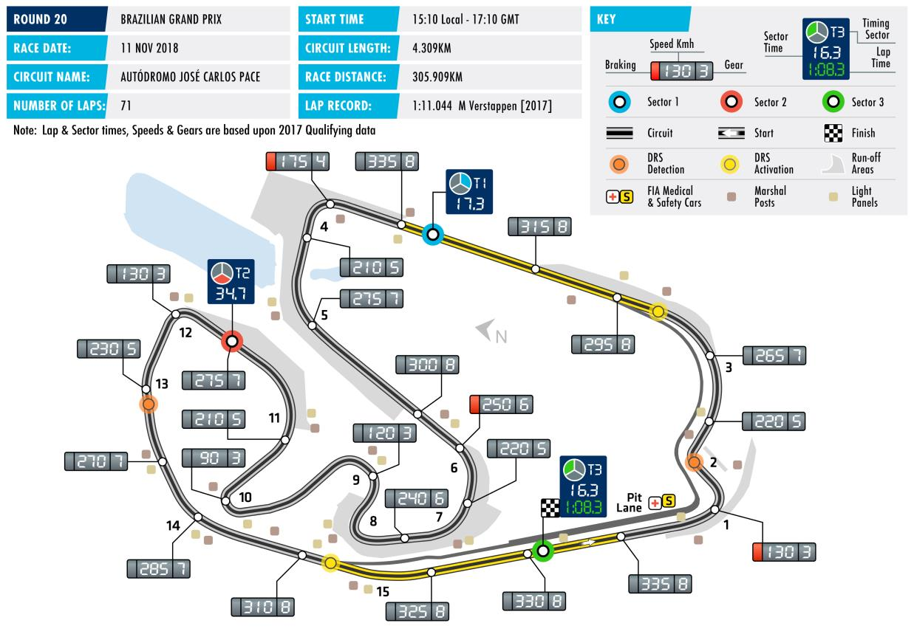

Located in Sao Paulo, Interlagos includes the Autodromo Jose Carlos Pace racetrack, home

to the Brazilian Grand Prix. The Interlagos circuit has played host to some of the most exciting and memorable races in recent Formula One history, including Lewis Hamilton winning the

World Championship on the last lap of the 2008 race. Regarded as one of the most

challenging circuits in Grand prix racing, Alain Prost still holds the record with six victories in Brazil.

60

2018 FORMULA ONE ABU DHABI GRAND PRIX

YAS MARINA

Date 25 November Race distance 305.355 km

Circuit length 5.554 km Number of laps 55

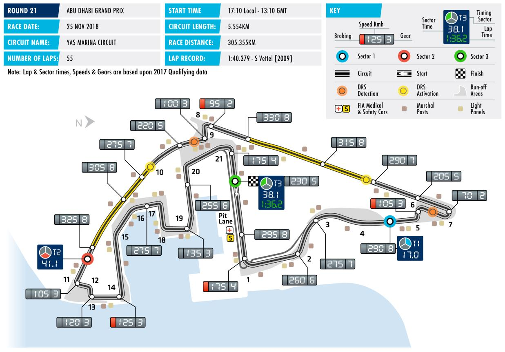

The Hermann Tilke-designed track is dominated by its 1.2km straight between Turns 7 and 8 – which, with slow-speed corners marking its beginning and end, makes it a honeypot for overtaking moves. Other highlights include the tricky run through Turns 15 and 16 into 17, which forces the drivers to brake hard with bags of lateral load still on the car.

61

MERCEDES AMG PETRONAS MOTORSPORT

Chassis: Mercedes-AMG F1 W09 EQ Power+

1954 France, 1st Power Unit: Mercedes First Team Entry: (JM Fangio)

Team Principal: Toto Wolff

Technical Chief: James Allison World Championships: 4

Media Contacts: Bradley Lord Grand Prix Contested: 185

+44 (0)7785 682893 Grand Prix Victories: 85

blord@mercedesamgf1.com Most Recent Win: 2018 Japan

www.mercedesamgf1.com 2017 Championship: Winner

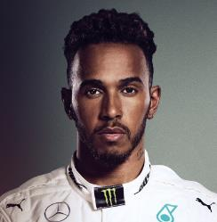

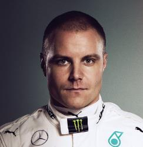

44 LEWIS HAMILTON 77 VALTTERI BOTTAS

Date of Birth: January 07, 1985 Date of Birth: August 28, 1989

F1 Debut: 2007 F1 Debut: 2013

GP Starts: 223 GP Starts: 115

GP Victories: 71 GP Victories: 3

Pole Positions: 80 Pole Positions: 6

F1 Titles: 4 F1 Titles: 0

62

SCUDERIA FERRARI

Chassis: Ferrari SF71-H

1950 Monaco, 2nd Power Unit: Ferrari First Team Entry: (A. Ascari)

Team Principal: Maurizio Arrivabene

Technical Chief: Mattia Binotto World Championships: 16

Media Contacts: Alberto Antonini Grand Prix Contested: 968

+39 344 055 6635 Grand Prix Victories: 234

alberto.antonini@ferrari.com Most Recent Win: 2018 Belgium

www.ferrari.com 2017 Championship: 2nd

5 SEBASTIAN VETTEL 7 KIMI RÄIKKÖNEN

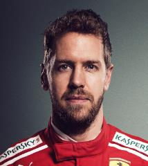

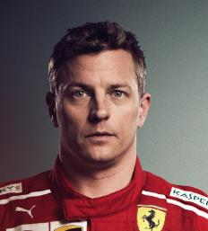

Date of Birth: July 03, 1987 Date of Birth: October 17, 1979

F1 Debut: 2007 F1 Debut: 2001

GP Starts: 216 GP Starts: 290

GP Victories: 52 GP Victories: 20

Pole Positions: 55 Pole Positions: 18

F1 Titles: 4 F1 Titles: 1

63

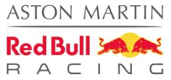

RED BULL RACING

Chassis: Red Bull RB13

2005 Australia, 4th Power Unit: Renault First Team Entry: (D. Coulthard)

Team Principal: Christian Horner

Technical Chief: Adrian Newey World Championships: 4

Media Contacts: James Ranson Grand Prix Contested: 262

+44 7834526354 Grand Prix Victories: 58

James.Ranson@redbullracing.com Most Recent Win: 2018 Austria

www.redbullracing.com 2017 Championship: 3rd

3 DANIEL RICCIARDO 26 MAX VERSTAPPEN

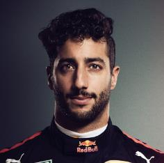

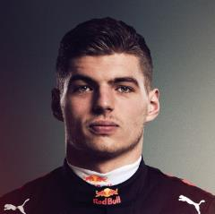

September 30,

Date of Birth: July 1, 1989 Date of Birth: 1997

F1 Debut: 2011 F1 Debut: 2015

GP Starts: 146 GP Starts: 77

GP Victories: 7 GP Victories: 4

Pole Positions: 2 Pole Positions: 0

F1 Titles: 0 F1 Titles: 0

64

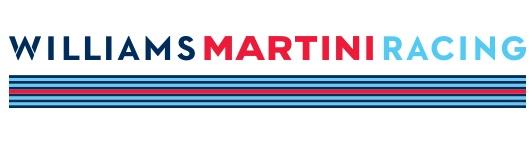

WILLIAMS MARTINI RACING

Chassis: Williams FW41

1978 Argentina, Power Unit: Mercedes First Team Entry: 17th (J. Lafitte)

Team Principal: Frank Williams

Technical Chief: Paddy Iowe World Championships: 9

Media Contacts: Sophie Ogg Grand Prix Contested: 706

+44 7977 275762 Grand Prix Victories: 114

Sophie.ogg@williamsf1.com Most Recent Win: 2012 Spain

www.williamsf1.com 2017 Championship: 5th

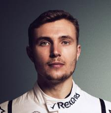

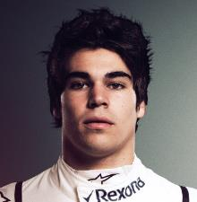

18 LANCE STROLL 35 SERGEY SIROTKIN

Date of Birth: October 29, 1998 Date of Birth: August 25, 1995

F1 Debut: 2013 F1 Debut: 2018

GP Starts: 37 GP Starts: 17

GP Victories: 0 GP Victories: 0

Pole Positions: 0 Pole Positions: 0

F1 Titles: 0 F1 Titles: 0

65

RACING POINT FORCE INDIA F1 TEAM

Chassis: Force India VJM11

2018 Belgium, 5th Power Unit: Mercedes First Team Entry: (S. Perez)

Team Principal: Otmar Szafnauer

Technical Chief: Andrew Green World Championships: 0

Media Contacts: Will Hings Grand Prix Contested: 5

+44 7734 202020 Grand Prix Victories: 0

Will.hings@forceindiaf1.com Most Recent Win: 0

www.forceindiaf1.com 2017 Championship: N/A

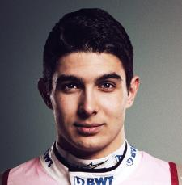

11 SERGIO PÉREZ 31 ESTEBAN OCON

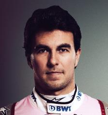

September 17,

Date of Birth: January 26, 1990 Date of Birth: 1996

F1 Debut: 2011 F1 Debut: 2016

GP Starts: 154 GP Starts: 46

GP Victories: 0 GP Victories: 0

Pole Positions: 0 Pole Positions: 0

F1 Titles: 0 F1 Titles: 0

66

RENAULT SPORT F1 TEAM

Chassis: Renault R.S.S 18

1977 Great Britain, Power Unit: Renault First Team Entry: 21st (JP Jabouille)

Team Principal: Cyril Abiteboul

Technical Chief: Bob Bell World Championships: 2

Media Contacts: Andy Stobart Grand Prix Contested: 361

andy.stobart@uk.renaultsportracing.com Grand Prix Victories: 35

www.renaultsport.com Most Recent Win: 2008 Singapore

2017 Championship: 6th

27 NICO HÜLKENBERG 55 CARLOS SAINZ

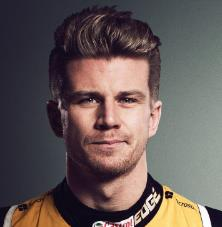

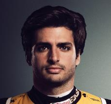

Date of Birth: August 5, 1987 Date of Birth: January 20, 1991

F1 Debut: 2010 F1 Debut: 2015

GP Starts: 154 GP Starts: 77

GP Victories: 0 GP Victories: 0

Pole Positions: 1 Pole Positions: 0

F1 Titles: 0 F1 Titles: 0

67

RED BULL TORO ROSSO HONDA

Chassis: Toro Rosso STR13

2006 Bahrain, 11th Power Unit: Honda First Team Entry: (V. Liuzzi)

Team Principal: Franz Tost

Technical Chief: James Key World Championships: 0

Media Contacts: Fabiana Valenti Grand Prix Contested: 243

+39 335 711 3694 Grand Prix Victories: 1

Fabiana.valenti@tororosso.com Most Recent Win: 2008 Italy

www.tororosso.com 2017 Championship: 7th

10 PIERRE GASLY 28 BRENDON HARTLEY

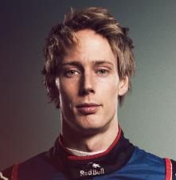

November 10,

Date of Birth: February 7, 1996 Date of Birth: 1989

F1 Debut: 2017 F1 Debut: 17

GP Starts: 22 GP Starts: 21

GP Victories: 0 GP Victories: 0

Pole Positions: 0 Pole Positions: 0

F1 Titles: 0 F1 Titles: 0

68

HAAS F1 TEAM

Chassis: Haas VF-18

Power Unit: Ferrari First Team Entry: 2016 Australia, NC

Team Principal: Guenther Steiner

Technical Chief: Rob Taylor World Championships: 0

Media Contacts: Mike Arning Grand Prix Contested: 58

+1 704 236 0405 Grand Prix Victories: 0

MArning@haasf1team.com Most Recent Win: N/A

www.haasf1team.com 2017 Championship: 8th

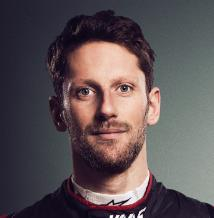

8 ROMAIN GROSJEAN 20 KEVIN MAGNUSSEN

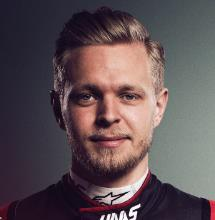

Date of Birth: April 17, 1986 Date of Birth: October 5, 1992

F1 Debut: 2009 F1 Debut: 2014

GP Starts: 141 GP Starts: 78

GP Victories: 0 GP Victories: 0

Pole Positions: 0 Pole Positions: 0

F1 Titles: 0 F1 Titles: 0

69

MCLAREN TEAM

Chassis: McLaren MCL33

Power Unit: Renault First Team Entry: 1966 Monaco, NC

Team Principal: Zack Brown

Technical Chief: Andrea Stella World Championships: 8

Media Contacts: Tim Bampton Grand Prix Contested: 842

Tim.bampton@mclaren.com Grand Prix Victories: 182

www.mclaren.com Most Recent Win: 2012 Brazil

2017 Championship: 9th

14 FERNANDO ALONSO 2 STOFFEL VANDOORNE

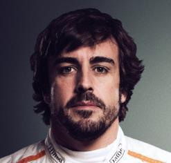

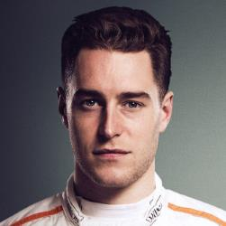

Date of Birth: July 29, 1981 Date of Birth: March 26, 1992

F1 Debut: 2001 F1 Debut: 2016 Bahrain

GP Starts: 310 GP Starts: 38

GP Victories: 32 GP Victories: 0

Pole Positions: 22 Pole Positions: 0

F1 Titles: 2 F1 Titles: 0

70

ALFA ROMEO SAUBER F1 TEAM

Chassis: Sauber C36

1993 South Africa, Power Unit: Ferrari Tipo 059/5 First Team Entry: 5th (JJ Letho)

Team Principal: Frederic Vasseur

Technical Chief: Simone Resta World Championships: 0

Media Contacts: Maria Guidotti Grand Prix Contested: 461

+41 79 770 1819 Grand Prix Victories: 1

Maria.guidotti@sauber-group.com Most Recent Win: N/A

www.sauberf1team.com 2017 Championship: 10th

9 MARCUS ERICSSON 16 CHARLES LECLERC

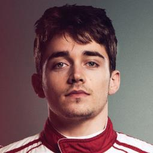

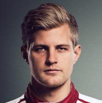

September 2,

Date of Birth: 1990 Date of Birth: October 16, 1997

F1 Debut: 2014 F1 Debut: 2018

GP Starts: 93 GP Starts: 17

GP Victories: 0 GP Victories: 0

Pole Positions: 0 Pole Positions: 0

F1 Titles: 0 F1 Titles: 0

71

2017 FIA FORMULA ONE UNITED STATES GRAND PRIX RESULTS

POS DRIVER TEAM LAPS TIME/RETIRE POINTS

1 Lewis Hamilton Mercedes 56 1:33:50.991 25

2 Sebastian Vettel Ferrari 56 +10.143 18

3 Kimi Räikkönen Ferrari 56 +15.779 15

| 4 | Max Verstappen | Red Bull Racing | 56 | +16.768 | 12 |
| --- | --- | --- | --- | --- | --- |
| 5 | Valtteri Bottas | Mercedes | 56 | +34.967 | 10 |
| 6 | Esteban Ocon | Force India | 56 | +1:30.980 | 8 |
| 7 | Carlos Sainz Jr. | Renault | 56 | +1:32.944 | 6 |
| 8 | Sergio Perez | Force India | 55 | +1 Lap | 4 |
| 9 | Felipe Massa | Williams | 55 | +1 Lap | 2 |
| 10 | Daniil Kvyat | Toro Rosso | 55 | +1 Lap | 1 |
| 11 | Lance Stroll | Williams | 55 | +1 Lap | 0 |
| 12 | Stoffel Vandoorne | McLaren Honda | 55 | +1 Lap | 0 |
| 13 | Brendon Hartley | Toro Rosso | 55 | +1 Lap | 0 |
| 14 | Romain Grosjean | Haas | 55 | +1 Lap | 0 |
| 15 | Marcus Ericsson | Sauber | 55 | +1 Lap | 0 |
| 16 | Kevin Magnussen | Haas | 55 | +1 Lap | 0 |
| NC | Fernando Alonso | McLaren Honda | 24 | DNF | 0 |
| NC | Daniel Ricciardo | Red Bull Racing | 14 | DNF | 0 |
| NC | Pascal Wehrlein | Sauber | 5 | DNF | 0 |
| NC | Nico Hülkenberg | Renault | 3 | DNF | 0 |

72

HISTORY OF FORMULA ONE GRAND PRIX IN THE UNITED STATES

YEAR(S) RACE LOCATION

1950 - 1960 Indianapolis 500 Indianapolis, Indiana

1959 United States Grand Prix Sebring, Florida

1960 United States Grand Prix Riverside, California

1961 - 1980 United States Grand Prix Watkins Glen, New York

1976 - 1983 United States Grand Prix West Long Beach, California

1981 - 1982 Caesars Palace Grand Prix Las Vegas, Nevada

1982 - 1988 Detroit Grand Prix Detroit, Michigan

1984 Dallas Grand Prix Dallas, Texas

1989 - 1991 United States Grand Prix Phoenix, Arizona

2000 - 2007 United States Grand Prix Indianapolis, Indiana

2012 - United States Grand Prix Austin, Texas Present

73

AMERICAN FORMULA ONE DRIVERS

DRIVER YEAR(S) RACES PTS WINS POLES CHAMPIONSHIPS

Harry Schell 1950-1960 56 32 0 0

Robert O’Brien 1952 1 0 0 0

John Fitch 1953, 1955 2 0 0 0

Fred Wacker 1953-1954 3 0 0 0

Herbert Mackay-Fraser 1957 1 0 0 0

Masten Gregory 1957-1963, 1965 38 21 0 0

Caroll Shelby 1958-1959 8 0 0 0

Phil Hill 1958-1966 48 98 3 6 1 (1961)

Harry Blanchard 1959 1 0 0 0

George Constantine 1959 1 0 0 0

Bob Said 1959 1 0 0 0

Dan Gurney 1959-1968, 1970 86 133 4 3

Pete Lovely 1959-1960, 1969-1971 7 0 0 0

Chuck Daigh 1960 3 0 0 0

Bob Drake 1960 1 0 0 0

Fred Gamble 1960 1 0 0 0

Lance Reventlow 1960 1 0 0 0

Lloyd Ruby 1960-1961 1 0 0 0

Jim Hall 1960-1963 11 3 0 0

Richie Ginther 1960-1967 52 102 1 0

Roger Penske 1961-1962 2 0 0 0

| Walt Hansgen | 1961, 1964 | 2 | 2 | 0 | 0 |
| --- | --- | --- | --- | --- | --- |
| Hap Sharp | 1961-1964 | 6 | 0 | 0 | 0 |

74

FORMULA ONE DRIVERS’ WORLD CHAMPIONSHIP WINNERS 1950 – 2017

| DRIVER | YEAR(S) | RACES | PTS | WINS | POLES | CHAMPIONSHIPS |
| --- | --- | --- | --- | --- | --- | --- |
| Jay Chamberlain | 1962 | 3 | 0 | 0 | 0 |  |

Tim Mayer 1962 1 0 0 0

Rob Schroeder 1962 1 0 0 0

Tony Settember 1962-1963 6 0 0 0

Ronnie Bucknum 1964-1966 11 2 0 0

Peter Revson 1964,1971-1974 30 61 2 1

Bob Bondurant 1965-1966 9 3 0 0

Mike Fisher 1967 1 0 0 0

| Bobby Unser | 1968 | 1 | 0 | 0 | 0 |  |
| --- | --- | --- | --- | --- | --- | --- |
| Mario Andretti | 1968-1972, 1974-1982 | 128 | 180 | 12 | 18 | 1 (1978) |
| Gus Hutchinson | 1970 | 1 | 0 | 0 | 0 |  |
| Skip Barber | 1971-1972 | 5 | 0 | 0 | 0 |  |
| Sam Posey | 1971-1972 | 2 | 0 | 0 | 0 |  |
| Mark Donahue | 1971,1974-1975 | 14 | 8 | 0 | 0 |  |
| George Follmer | 1973 | 12 | 5 | 0 | 0 |  |
| Brett Lunger | 1975-1978 | 34 | 0 | 0 | 0 |  |
| Danny Ongais | 1977-1978 | 4 | 0 | 0 | 0 |  |
| Bobby Rahal | 1978 | 2 | 0 | 0 | 0 |  |
| Eddie Cheever | 1978,1980-1989 | 132 | 70 | 0 | 0 |  |
| Danny Sullivan | 1983 | 15 | 2 | 0 | 0 |  |
| Michael Andretti | 1993 | 13 | 7 | 0 | 0 |  |
| Scott Speed | 2006-2007 | 28 | 0 | 0 | 0 |  |
| Alexander Rossi | 2015 | 5 | 0 | 0 | 0 |  |

*One-off entries in the Indianapolis 500 between 1950-1960 and drivers who failed to start a Grand Prix are not included.

75

|  | F ORMULA ONE DRIVERS’ WORLD CHAMPIONSHIP WINNERS 1950 – 2017 |  |  |  |  |  |
| --- | --- | --- | --- | --- | --- | --- |
| YEAR |  | DRIVER | TEAM | YEAR | DRIVER | TEAM |
| 1950 |  | G. Farina (ITA) | Alfa-Romeo |  |  |  |
|  |  |  |  | 1974 | E. Fittipaldi (BRA) | McLaren-Ford |
| 1952 |  | A. Ascari (ITA) | Ferrari |  |  |  |
|  |  |  |  | 1976 | J. Hunt (GBR) | McLaren-Ford |
| 1954 |  | J.M. Fangio (ARG) | Mercedes/Maserati |  |  |  |
|  |  |  |  | 1978 | M. Andretti (USA) | Lotus-Ford |
| 1956 |  | J.M. Fangio (ARG) | Lancia/Ferrari |  |  |  |
|  |  |  |  | 1980 | A. Jones (AUS) | Williams-Ford |
| 1958 |  | M. Hawthorn (GBR) | Ferrari |  |  |  |
|  |  |  |  | 1982 | K. Rosberg (FIN) | Williams-Ford |
| 1960 |  | J. Brabham (AUS) | Cooper-Climax |  |  |  |
|  |  |  |  | 1984 | N. Lauda (AUT) | McLaren-TAG-Porsche |
| 1962 |  | G. Hill (GBR) | BRM |  |  |  |
|  |  |  |  | 1986 | A. Prost (FRA) | McLaren-TAG-Porsche |
| 1964 |  | J. Surtees (GBR) | Ferrari |  |  |  |
|  |  |  |  | 1988 | A. Senna (BRA) | McLaren-Honda |
| 1966 |  | J. Brabham (AUS) | Brabham-Repco |  |  |  |
|  |  |  |  | 1990 | A. Senna (BRA) | McLaren-Honda |
| 1968 |  | G. Hill (GBR) | Lotus-Ford |  |  |  |
|  |  |  |  | 1992 | N. Mansell (GBR) | Williams-Renault |
| 1970 |  | J. Rindt (AUT) | Lotus-Ford |  |  |  |
|  |  |  |  | 1994 | M. Schumacher (GER) | Benetton-Ford |
| 1972 |  | E. Fittipaldi (BRA) | Lotus-Ford |  |  |  |

76

|  | FORMULA ONE DRIVERS’ WORLD CHAMPIONSHIP WINNERS 1950 – 2017 |  |  |  |  |  |  |
| --- | --- | --- | --- | --- | --- | --- | --- |
| YEAR |  | DRIVER |  | TEAM | YEAR | DRIVER | TEAM |
| 1996 |  | D. Hill (GBR) |  | Williams-Renault |  |  |  |
| 1997 |  |  | J. Villeneuve (CAN) | Williams-Renault | 2008 | L. Hamilton (GBR) | McLaren-Mercedes |
| 1998 |  | M. Hakkinen (FIN) |  | McLaren-Mercedes |  |  |  |
|  |  |  |  |  | 2010 | S. Vettel (GER) | Red Bull Racing |
| 2000 |  |  | M. Schumacher (GER) | Ferrari |  |  |  |
|  |  |  |  |  | 2012 | S. Vettel (GER) | Red Bull Racing |
| 2002 |  |  | M. Schumacher (GER) | Ferrari |  |  |  |
|  |  |  |  |  | 2014 | L. Hamilton (GBR) | Mercedes AMG |
| 2004 |  |  | M. Schumacher (GER) | Ferrari |  |  |  |
|  |  |  |  |  | 2016 | N. Rosberg (GER) | Mercedes AMG |
| 2006 |  | F. Alonso (ESP) |  | Renault | 2017 | L. Hamilton (GBR) | Mercedes AMG |

77

CONSTRUCTORS’ WORLD CHAMPIONSHIP WINNERS 1958-2017

| YEAR | CONSTRUCTOR |  | YEAR 1988 |  | CONSTRUCTOR McLaren-Honda |  |
| --- | --- | --- | --- | --- | --- | --- |
| 1959 |  | Cooper-Climax |  | 1990 |  | McLaren-Honda |
| 1961 |  | Ferrari |  | 1992 |  | Williams-Renault |
| 1963 |  | Lotus-Climax |  | 1994 |  | Williams-Renault |
| 1965 |  | Lotus-Climax |  | 1996 |  | Williams-Renault |
| 1967 |  | Brabham-Repco |  | 1998 |  | McLaren-Mercedes |
| 1969 |  | Matra-Ford |  | 2000 |  | Ferrari |
| 1971 |  | Tyrrell-Ford |  | 2002 |  | Ferrari |
| 1973 |  | Lotus-Ford |  | 2004 |  | Ferrari |
| 1975 |  | Ferrari |  | 2006 |  | Renault |
| 1977 |  | Ferrari |  | 2008 |  | Ferrari |
| 1979 |  | Ferrari | 2010 |  | Red Bull Racing |  |
| 1981 | Williams-Ford |  | 2012 |  | Red Bull Racing |  |
| 1983 |  | Ferrari |  | 2014 |  | Mercedes AMG |
| 1985 |  | McLaren-TAG-Porsche | 2016 |  | Mercedes AMG |  |
| 1987 | Williams-Honda |  | 2017 |  | Mercedes AMG |  |

78

FIA FORMULA 4

Launched in 2014, FIA Formula 4 was created to offer young race car drivers around the world the opportunity to take the first step from karting into the world of open-wheel racing.

Designed to be globally recognized yet an affordable step between karting and F3, the F4 car was designed to keep costs down while providing an ideal learning tool for young drivers who have never raced cars before. The series offers more value and benefits than any other form of entry-level open-wheel racing at a low cost.

In 2015, SCCA Pro Racing and the FIA combined forces to create the Formula 4 United States Championship. F4 teams and drivers are aligned with the FIA and series partners: Honda, Honda Performance Development, Pirelli and Onroak Automotive. Stepping into the F4 series builds upon the progression offered from karting both on and off the track. The series offers developmental educational programs that cover everything from driving preparation to marketing and public relations.

The inaugural season included five event weekends with 15 races. A total of 19 drivers and nine teams competed over the course of the season. The field for season two doubled in size with an average of 33 cars participating in the 20-race season. Even with record-breaking grid sizes in its second season and the launch of the new F3 Americas Championship, the car count for season three is anticipated to be 40 by the end of the season, with 38 cars already registered for the opening event. The popularity the F4 U.S. Championship is exceeding the expectations of its partners and participants, and is considering series expansion on the West Coast.

The F4 series is the fastest way for an aspiring driver to gain experience to an international racing platform. With driving training, unmatched affordability and strong manufacturer support, competitors can grow and succeed into the higher levels of motorsports.

27 – 29 April Virginia International Raceway

10 – 12 May Road Atlanta

28 June – 1 July Mid-Ohio Sports Car Course

3-5 August Pittsburgh International Race Complex

14-16 September New Jersey Motorsports Park

19-21 October Circuit of The Americas

79

FORMULA 3 AMERICAS

With the F4 U.S. Championship exceeding the expectations of its partners and participants, its drivers and teams are seeking a next step in their championship development. After years of discussion, development, testing and manufacturing, the F3 Americas series is ready for launch. The regional FIA series is the fastest way for an aspiring driver to gain experience to an international racing platform at an affordable price.

The F3 Americas Championship Powered by Honda offers young talent the opportunity to demonstrate their skills on an international platform while keeping affordability and safety as key elements of the program. Having the F3 Americas chassis manufactured in the United States by Onroak Automotive, the Honda Civic Type R motor built in Anna, Ohio, and the Pirelli PZero Tires made in North America, aids in affordability and availability.

Stepping into the F3 Americas series builds upon the progression offered from the F4 U.S. Championship both on and off the track. With driver training, unmatched affordability and strong manufacturer support, competitors can grow and succeed into the higher levels of motorsports.

The F3 Americas series offers plenty of track time for drivers. Race meetings will offer three 35-minute races with qualifying and two 35 minute practices built into the race weekend. Altogether, the drivers have around three hours of track time available per race meeting, allowing them to increase their experience in open wheel racing. One of F3 America’s greatest strengths, compared to other young driver categories, is the analytical work that must be carried out by the drivers in cooperation with their engineers. The series is a spec series, allowing multicar or single cars teams the same opportunity of success with capped costs; however, the cars allow for significant setup adjustments, which increases the drivers’ technical knowledge and gains experience required for moving up the open wheel ladder, whether with a large or small team.

Top drivers will be presented FIA Super License points to aid in their racing career advancement to Formula1.

4-5 August Pittsburgh International Race Complex

9-11 August Mid-Ohio Sports Car Course

14-16 September New Jersey Motorsports Park

13-14 October NOLA Motorsports Park

19-21 October Circuit of The Americas

80

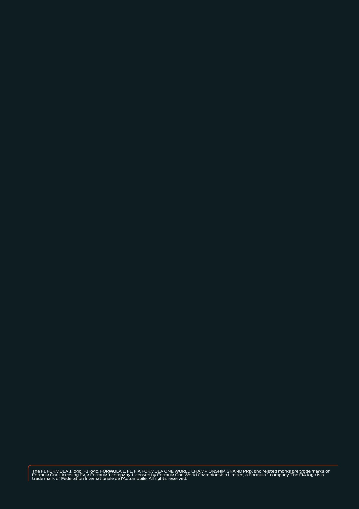

81
