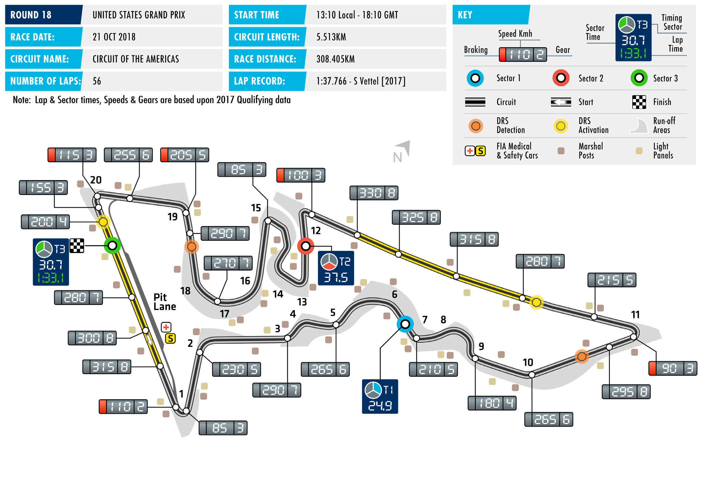
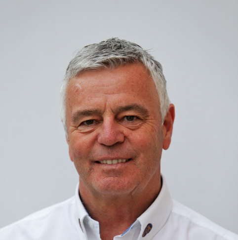

2018 UNITED STATES GRAND PRIX

19 – 21 October 2018

Formula One switches focus from Eastern to Western CIRCUIT OF THE AMERICAS

hemispheres this weekend as teams and drivers head to Austin, Length of lap: 5.513km Texas, and the Circuit of the Americas – home of the 2018 FIA F1 Lap record: United States Grand Prix. 1:37.766 (Sebastian Vettel,

Despite being a relatively new addition to the F1 calendar, with Ferrari, 2017)

the circuit making its debut in 2012, COTA has already made a Start line/finish line offset: 0.323km name for itself as a track capable of showing off F1 cars at their Total number of race laps: best. Similar to the Esses at the previous race, it features a first 56 sector with high-speed changes of direction – but COTA is a more Total race distance: balanced layout than Suzuka: while the latter features only two 308.405km

low-speed sections, the whole of the second half of the lap at Pitlane speed limits: COTA is built around a serious of medium and low-speed corners. 80km/h in practice, qualifying, and the race It is this characteristic that prompts tyre supplier Pirelli to move to

softer tyres for the US Grand Prix, bringing the soft, supersoft and CIRCUIT NOTES ultrasoft compounds to Texas.

► Three bumps similar to those on While COTA has a predominantly smooth surface, in the last few the exit of Turns 11, 15 and 19 years the track has settled and now features several prominent have been installed behind the exit kerb at Turn 1. bumps, some of which are located in braking zones and have the

ability to unsettle a car. This gives engineers and drivers something ► Kerbs 2m long, 1m wide and to ponder: the softer their car, the easier it will ride the bumps, but 50mm high have been installed behind the apex kerbs in Turns 16 at the cost of lost performance through the corners. The circuit has and 17. attempted to grind down some of the undulations, and in doing so

last year produced some interesting variations in the grip level. DRS ZONES

► There will be two DRS zones at The Championship battles are nearing their conclusion. Lewis COTA. The detection point of the Hamilton needs to outscore Sebastian Vettel by seven points first will be 150m after Turn 10, to secure the 2018 Drivers’ Championship. Mercedes scored a with the activation point 250m second consecutive 1-2 finish last time out in Japan, giving the after Turn 11. The second zone’s detection point will be 65m after Brackley-based team a very useful 78-point lead over Ferrari in the Turn 18, with the activation point Constructors’ Championship. A similar result in Austin would put 80m after Turn 20, on the start/ them on the brink of a fifth consecutive title. finish straight.

FAST FACTS

► This is the 40th FIA Formula One United has won five of the six races held at COTA ► Vettel has taken the fastest lap in five of States Grand Prix. The race debuted in to date, once with McLaren in 2012 and the six races at COTA. He missed out in 1959 at Sebring. It has subsequently with Mercedes from 2014 to 2017. 2015 when Nico Rosberg went quickest. been held at Riverside (1960), Watkins Glen (1961-80), Phoenix (1989-91) and ► Two of the current grid made their ► Three titles have been secured at COTA. Indianapolis (2000-2007). This is the F1 debut in the USA. Sebastian Vettel Red Bull Racing secured the Constructors’ seventh consecutive running at the appeared for BMW-Sauber in 2007, as Championship at this track in 2012, purpose-built Circuit of the Americas. a replacement for the injured Robert when it hosted the penultimate round Kubica, and Toro Rosso gave a debut to of the season, and Mercedes took the ► The USA has also hosted several other F1 Brendon Hartley last year. Vettel is not the Constructors’ Championship last year at grands prix. The US Grand Prix West ran only World Champion to have started his the 17th round of 20. Lewis Hamilton at Long Beach between 1976-1983, The F1 career at the US GP: Mario Andretti became a three-times Drivers’ World Caesars Palace Grand Prix (1981-82) was (1968), Jody Scheckter (1972) and Mika Champion here in 2015. held in Las Vegas; the Detroit Grand Prix Häkkinen (1991) also took their bow here. ran between 1982 and 1988, and Dallas Andretti had participated in qualifying for ► The US Grand Prix has often been hosted a one-off grand prix in 1984. the Italian Grand Prix earlier in the season an end-of-season race, and thus it Between 1950 and 1960 the Indianapolis – but was subsequently banned from has been the venue for many other 500 was also officially included as a round taking part in the race, having attempted championship deciders. The Constructors’ in the Formula One World Championship. to return to the US to contest a dirt track Championship was settled at Watkins race (the Hoosier Hundred) between Glen on five occasions, in favour of ► Ferrari are the most successful qualifying and the grand prix. Brabham (1966), Lotus (1970, 1973), constructor at the US Grand Prix, scoring McLaren (1974) and Ferrari (1976). The their nine wins at Watkins Glen in 1975, ► The race at the Circuit of the Americas Drivers’ title has previously been won at 1978 and 1979, and at Indianapolis in has only ever been won from the front Sebring by Jack Brabham (1959) and at 2000, 2002-2006. row, with an even 3-3 split between Watkins Glen by Jochen Rindt (1970 – starting from P1 and P2. Vettel (2013) and posthumously), Emerson Fittipaldi (1974) ► Lewis Hamilton is the most successful Hamilton (2016, 2017) have won from P1. and Niki Lauda (1977). driver at the US Grand Prix. He is also Hamilton alone (2012, 2014, 2015) has the only driver to win the race at more won from P2. Vettel finished third in 2015 ► Pierre Gasly, Sergey Sirotkin and Charles than one venue. He has a victory at having started 13th: the furthest back a Leclerc race at COTA for the first time this Indianapolis, in 2007 with McLaren, and podium finisher has started. weekend.

RACE STEWARDS BIOGRAPHIES

DR GERD ENNSER

MEMBER OF THE DMSB’S EXECUTIVE COMMITTEE FOR AUTOMOBILE SPORT, FORMULA ONE AND DTM STEWARD

Dr Gerd Ennser has successfully combined his formal education in law with his passion for motor racing. While still active as a racing driver he began helping out with the management of his local motor sport club and since 2006 has been a permanent steward at every round of Germany’s DTM championship. Since 2010 he has also been a Formula One steward. Dr Ennser, who has worked as a judge, a prosecutor and in the legal department of an automotive- industry company, has also acted as a member of the steering committee of German motor sport body, the DMSB, since spring 2010, where he is responsible for automobile sport. In addition, Dr Ennser is a board member of the South Bavaria Section of ADAC, Germany’s biggest auto club.

SILVIA BELLOT

MEMBER OF THE ROYAL SPANISH AUTOMOBILE FEDERATION BOARD OF DIRECTORS, FIA WOMEN IN MOTORSPORT COMMISSION MEMBER, F1, F2 AND GP3 STEWARD

Silvia Bellot began marshalling in 2001, when she was 16. In the years that followed she acted as a steward in a number of national and international series, including the European F3 Open, GT Open, BMW Europe, the Spanish Endurance Championship, DTM, World Series by Renault, the former FIA World Touring Car Championship and the FIA World Rally Championship. In 2009, she took part in the FIA trainee stewards’ program for F1 and what was then GP2 (now F2). She made her first appearance as a Formula 1 steward at the 2011 Turkish GP and in 2012 was awarded the FIA’s Outstanding Official prize. Away from the stewards’ room she is a member of the FIA’s Women in Motorsport Commission and also works closely with RACC, the Circuit de Catalunya and the Spanish federation in event organisation.

DEREK WARWICK

FORMER FORMULA 1 DRIVER AND WORLD SPORTSCAR CHAMPION, VICE-PRESIDENT OF THE FIA DRIVERS’ COMMISSION

Derek Warwick raced in 146 grands prix from 1981 to 1993, appearing for Toleman, Renault, Brabham, Arrows and Lotus. He scored 71 points and achieved four podium finishes, with two fastest laps. He was World Sportscar Champion in 1992, driving for Peugeot. He also won Le Mans in the same year. He raced Jaguar sportscars in 1986 and 1991 and competed in the British Touring Car Championship between 1995 and 1998, as well as a futher appearance at the Le Mans in 1996, driving for the Courage Competition team. Currently Vice-President of the FIA Drivers’ Commission, Warwick is a frequent FIA driver steward and is also a past President of the British Racing Drivers’ Club.

2018 FIA Formula One World Championship

DRIVERS’ CHAMPIONSHIP STANDINGS

NAJIABREZA AILARTSUA EROPAGNIS IBAHD YNAMREG YRAGNUH STNIOP NIARHAB OCANOM ADANAC AIRTSUA MUIGLEB ECNARF OCIXEM ANIHC AISSUR NAPAJ LIZARB NIAPS YLATI ASU UBA BG

| 18 2 | 15 3 | 12 4 | 25 1 | 25 1 | 15 3 | 10 5 | 25 1 | NC | 18 2 | 25 1 | 25 1 | 18 2 | 25 1 | 25 1 | 25 1 | 25 1 |
| --- | --- | --- | --- | --- | --- | --- | --- | --- | --- | --- | --- | --- | --- | --- | --- | --- |
| 25 1 | 25 1 | 4 8 | 12 4 | 12 4 | 18 2 | 25 1 | 10 5 | 15 3 | 25 1 | NC | 18 2 | 25 1 | 12 4 | 15 3 | 15 3 | 8 6 |
| 4 8 | 18 2 | 18 2 | 14 | 18 2 | 10 5 | 18 2 | 6 7 | NC | 12 4 | 18 2 | 10 5 | 12 4 | 15 3 | 12 4 | 18 2 | 18 2 |
| 15 3 | NC | 15 3 | 18 2 | NC | 12 4 | 8 6 | 15 3 | 18 2 | 15 3 | 15 3 | 15 3 | NC | 18 2 | 10 5 | 12 4 | 10 5 |
| 8 6 | NC | 10 5 | NC | 15 3 | 2 9 | 15 3 | 18 2 | 25 1 | 15 | 12 4 | NC | 15 3 | 10 5 | 18 2 | 10 5 | 15 3 |
| 12 4 | NC | 25 1 | NC | 10 5 | 25 1 | 12 4 | 12 4 | NC | 10 5 | NC | 12 4 | NC | NC | 8 6 | 8 6 | 12 4 |
| 11 | 16 | 12 | 15 3 | 2 9 | 12 | 14 | NC | 6 7 | 1 10 | 6 7 | 14 | 10 5 | 6 7 | 16 | 1 10 | 6 7 |
| NC | 10 5 | 1 10 | 13 | 8 6 | 13 | 13 | 8 6 | 10 5 | 2 9 | 11 | 6 7 | 4 8 | 16 | 18 | 4 8 | NC |
| 6 7 | 8 6 | 8 6 | NC | NC | 4 8 | 6 7 | 2 9 | NC | 8 6 | 10 5 | 12 | NC | 13 | 1 10 | 12 | NC |
| 10 5 | 6 7 | 6 7 | 6 7 | 4 8 | NC | NC | 16 | 4 8 | 4 8 | 16 | 4 8 | NC | NC | 6 7 | 14 | 14 |
| 12 | 1 10 | 11 | NC | NC | 8 6 | 2 9 | NC | 8 6 | 6 7 | 4 8 | 13 | 8 6 | 8 6 | NC | 2 9 | 2 9 |
| 1 10 | 11 | 2 9 | 10 5 | 6 7 | 1 10 | 4 8 | 4 8 | 12 | NC | 12 | 2 9 | 11 | 4 8 | 4 8 | 17 | 1 10 |
| NC | 13 | 17 | NC | NC | 15 | 12 | 11 | 12 4 | NC | 8 6 | 1 10 | 6 7 | DQ | 15 | 11 | 4 8 |
| NC | 12 4 | 18 | 12 | NC | 6 7 | 11 | NC | 11 | 13 | 14 | 8 6 | 2 9 | 14 | 13 | NC | 11 |
| 13 | 12 | 19 | 8 6 | 1 10 | 18 | 1 10 | 1 10 | 2 9 | NC | 15 | NC | NC | 11 | 2 9 | 6 7 | NC |
| 2 9 | 4 8 | 13 | 2 9 | NC | 14 | 16 | 12 | 15 | 11 | 13 | NC | 15 | 12 | 12 | 16 | 15 |
| 14 | 14 | 14 | 4 8 | 11 | 17 | NC | 17 | 14 | 12 | NC | 17 | 13 | 2 9 | 14 | 15 | 17 |
| NC | 2 9 | 16 | 11 | 13 | 11 | 15 | 13 | 1 10 | NC | 2 9 | 15 | 1 10 | 15 | 11 | 13 | 12 |
| 15 | 17 | 20 | 1 10 | 12 | 19 | NC | 14 | NC | NC | 1 10 | 11 | 14 | NC | 17 | NC | 13 |
| NC | 15 | 15 | NC | 14 | 16 | 17 | 15 | 13 | 14 | NC | 16 | 12 | 1 10 | 19 | 18 | 16 |

1 L. HAMILTON 331

2 S. VETTEL 264

3 V. BOTTAS 207

4 K. RÄIKKÖNEN 196

5 M. VERSTAPPEN 173

6 D. RICCIARDO 146

7 S. PÉREZ 53

8 K. MAGNUSSEN 53

9 N. HÜLKENBERG 53

10 F. ALONSO 50

11 E. OCON 49

12 C. SAINZ 39

13 R. GROSJEAN 31

14 P. GASLY 28

15 C. LECLERC 21

16 S. VANDOORNE 8

17 L. STROLL 6

18 M. ERICSSON 6

B. HARTLEY 2 19

S. SIROTKIN 1 20

2018 FIA Formula One World Championship

CONSTRUCTORS’ CHAMPIONSHIP STANDINGS

NAJIABREZA AILARTSUA EROPAGNIS IBAHD YNAMREG YRAGNUH STNIOP NIARHAB OCANOM ADANAC AIRTSUA MUIGLEB ECNARF OCIXEM ANIHC AISSUR NAPAJ LIZARB NIAPS YLATI ASU UBA BG

| 22 2 8 | 33 2 3 | 30 2 4 | 25 1 13 | 43 1 2 | 25 3 5 | 28 2 5 | 31 1 7 | NC NC | 30 2 4 | 43 1 2 | 35 1 5 | 30 2 4 | 40 1 3 | 37 14 | 43 1 2 | 43 1 2 |
| --- | --- | --- | --- | --- | --- | --- | --- | --- | --- | --- | --- | --- | --- | --- | --- | --- |
| 40 1 3 | 25 1 NC | 19 3 8 | 30 2 4 | 12 4 NC | 30 2 4 | 33 1 6 | 25 3 5 | 33 2 3 | 40 1 3 | 15 3 NC | 33 2 3 | 25 1 NC | 30 2 4 | 25 35 | 27 3 4 | 18 5 6 |
| 20 4 6 | NC NC | 35 1 5 | NC NC | 25 15 10 | 27 1 9 | 27 3 4 | 30 2 4 | 25 1 NC | 10 5 NC | 12 4 NC | 12 4 NC | 15 3 NC | 10 5 NC | 26 26 | 18 5 6 | 27 3 4 |
| 7 7 10 | 8 6 11 | 10 6 9 | 10 5 NC | 6 7 NC | 5 8 10 | 10 7 8 | 6 8 9 | NC NC | 8 6 NC | 10 5 12 | 2 9 12 | 11 NC | 4 8 13 | 5 8 10 | 12 17 | 1 10 NC |
| NC NC | 10 5 13 | 1 10 17 | 13 NC | 8 6 NC | 13 15 | 12 13 | 8 6 11 | 22 4 5 | 2 9 NC | 8 6 11 | 7 7 10 | 10 7 8 | 16 DQ | 15 18 | 4 8 11 | 4 8 NC |
| 12 5 9 | 10 7 8 | 6 7 13 | 8 7 9 | 4 8 NC | 14 NC | 16 NC | 12 16 | 4 8 15 | 4 8 11 | 13 16 | 4 8 NC | 15 NC | 12 NC | 6 7 12 | 14 16 | 14 15 |
|  |  |  |  |  |  |  |  |  |  |  |  | 18 5 6 | 14 6 7 | 16 NC | 3 9 10 | 8 7 9 |
| 15 NC | 12 4 17 | 18 20 | 1 10 12 | 12 NC | 6 7 19 | 11 NC | 14 NC | 11 NC | 13 NC | 1 10 14 | 8 6 11 | 2 9 14 | 14 NC | 13 17 | NC NC | 11 13 |
| 13 NC | 2 9 12 | 16 19 | 8 6 11 | 1 10 13 | 11 18 | 1 10 15 | 1 10 13 | 3 9 10 | NC NC | 2 9 15 | 15 NC | 1 10 NC | 11 15 | 2 9 11 | 6 7 13 | 12 NC |
| 14 NC | 14 15 | 14 15 | 4 8 NC | 11 14 | 16 17 | 17 NC | 15 17 | 13 14 | 12 14 | NC NC | 16 17 | 12 13 | 3 9 10 | 14 19 | 15 18 | 16 17 |
| 11 12 | 10 16 | 11 12 | 3 NC | 9 NC | 6 12 | 9 14 | NC NC | 6 7 | 7 10 | 7 8 | 13 14 |  |  |  |  |  |

1 MERCEDES AMG 538 PETRONAS MOTORSPORT

460 2 SCUDERIA FERRARI

3 ASTON MARTIN 319 RED BULL RACING

RENAULT SPORT 92 4 FORMULA ONE TEAM

84 5 HAAS F1 TEAM

58 6 MCLAREN F1 TEAM

RACING POINT 43 7 FORCE INDIA F1TEAM

RED BULL 30 8 TORO ROSSO HONDA

ALFA ROMEO 27 9 SAUBER F1 TEAM

WILLIAMS MARTINI 7 10 RACING

SAHARA FORCE INDIA 0 EX F1 TEAM

FORMULA ONE TIMETABLE & FIA MEDIA SCHEDULE

THURSDAY

Press conference 1100

FRIDAY

Practice session 1 1000-1130 Press conference 1200

Practice session 2 1400-1530

SATURDAY

Practice session 3 1300-1400 Qualifying 1600-1700 Followed by track interviews, press conference

SUNDAY

Drivers’ Parade 1130 Race 1310 Followed by parc fermé interviews and press conference

ADDITIONAL MEDIA OPPORTUNITIES

QUALIFYING

All drivers eliminated in Q1 or Q2 will be available for media interviews immediately after the end of each session, as will drivers who participated in Q3, but who are not required for the post-qualifying press conference. The TV Pen is located adjacent to the entrance to race control.

RACE

Any driver retiring before the end of the race will be made available at the TV pen interview area. In addition, during the race every team will make available at least one senior spokesperson for interview by officially accredited TV crews. A list of those nominated will be made available in the media centre.

FIA COMMUNICATIONS DEPARTMENT press@fia.com T +33 1 43 12 58 15
