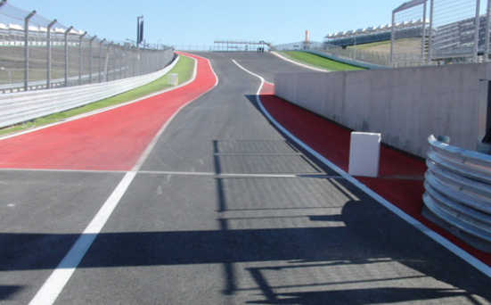
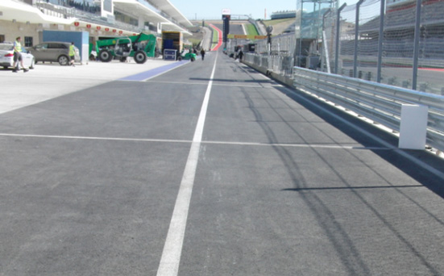

2018 UNITED STATES GRAND PRIX

18 - 21 October 2018

From The FIA Formula One Race Director Document 33

To All Teams, All Officials Date 21 October 2018

Time 08:30

Title Revised Event Notes

Description Revised Event Notes

Enclosed 2018_10_21_USGP_EVENT_NOTES_v3.pdf

Charlie Whiting

The FIA Formula One Race Director

2018 UNITED STATES GRAND PRIX

18-21 OCTOBER 2018

From The FIA Formula One Race Director Document 33

To Formula One Team Managers Date 21 October 2018

Time 08.30

EVENT NOTES

21 OCTOBER 2018 (V3)

1) Issues arising from the Japanese Grand Prix

2) Changes to the circuit

2.1 Three bumps similar to those on the exit of turns 11, 15 and 19 have been installed behind the exit kerb at turn 1.

2.2 Kerbs 2m long, 1m wide and 50mm high have been installed behind the apex kerbs in turns 16 and 17.

3) Pit lane map

3.1 Safety Car lines.

3.2 The location of the pit entry and the pit exit.

3.3 Designated garage areas.

3.4 Safety Car position for first lap and rest of race.

3.5 Blue flag marshal at the pit exit.

3.6 Track light panels displaying pit entry status.

4) Pirelli Event Preview

4.1 With reference to Article 24.4(a) of the Sporting Regulations see the attached document provided by the official tyre supplier.

5) Weighing and weighing platform

5.1 The weighing platform will be available for general checks at the following times, however, no more than 10 team personnel may be present during any visit. Each visit should last no more than 10 minutes unless no other team is waiting in the pit lane :

1/4

a) From 11.00 on Thursday until 15.30 on Saturday (between 14.00 and 15.30 each visit will be restricted to five minutes).

b) From when the cars are returned to the teams after qualifying until 20.30 on Saturday.

c) From 08.00 to 09.00 and then from 11.15 to 12.00 on Sunday.

Any team found to be abusing the time limits set out above, which we will be enforced by FIA security personnel and our own CCTV, will not be permitted to use the weighbridge again during the Event.

5.2 Cars should not be pushed to the weighing platform whilst any support race cars or personnel are in the pit lane unless they are behind the barriers (see 9.1 below).

6) Red zones for photographers in the pit lane during practice sessions

6.1 See the attached drawing.

7) Practice starts

7.1 Practice starts may only be carried out at the pit exit on the asphalt to the left of the fast lane and, for the avoidance of doubt, this includes any time the pit exit is open for the race.

Unless there are no cars behind also waiting to carry out a practice start, drivers should take no more than five seconds to prepare for their car for a practice start.

7.2 For reasons of safety and sporting equity, cars may not stop in the fast lane at any time the pit exit is open without a justifiable reason (a practice start is not considered a justifiable reason).

8) Pit entry and pit exit

8.1 In accordance with Chapter 4 (Section 5) of Appendix L to the ISC drivers must keep to the left of the white line at the pit exit when leaving the pits, no part of any car leaving the pits may cross this line.

8.2 For safety reasons drivers must stay to the left of the bollard at the pit entry.

8.3 The dotted white lines across the pit entry and the pit exit are the track edges.

8.4 There is a small light panel on the driver’s left at the start of the pit entry which will be operated if a car is stopped or going slowly around the corner of the pit entry.

9) Support races and pit walks

9.1 Please be kind enough to align your barriers on the white line on the second break in the concrete apron (approximately ten metres from the front of your garages) during all support practice sessions and races.

9.2 Similarly please align your barriers on the first break in the concrete apron (approximately five metres from the front of your garages) during all pit walks.

10) Leaving the track on the exit of turn 19

10.1 If a driver crosses the kerb on the exit of turn 19 during qualifying and, as a result, no part of the car remains in contact with the red and white section of the kerb, the lap time of the driver concerned will be deleted by the stewards.

During the race a black and white flag will be shown to any driver who clears the red and white section of the kerb three times, any further occurrence will then be reported to the stewards. Each time any car clears the red and white section teams will be informed via the official messaging system.

2/4

11) Observing yellow flags during free practice and qualifying

11.1 Double waved : Any driver passing through a double waved yellow marshalling sector must reduce speed significantly and be prepared to change direction or stop. In order for the stewards to be satisfied that any such driver has complied with these requirements it must be clear that he has not attempted to set a meaningful lap time, for practical purposes this means the driver should abandon the lap (this does not necessarily mean he has to pit as the track could well be clear the following lap).

11.2 Single waved : Drivers should reduce their speed and be prepared to change direction. It must be clear that a driver has reduced speed and, in order for this to be clear, a driver would be expected to have braked earlier and/or discernibly reduced speed in the relevant marshalling sector.

Drivers should not overtake any car in a single waved yellow marshalling sector unless it is clear that a car is slowing with a completely obvious problem, e.g. obvious accident damage or a deflated tyre.

12) Light panels

12.1 The FIA light panels have been installed in the positions shown on the circuit map. In accordance with Appendix H to the ISC the light signals have the same meaning as flag signals.

13) Drivers leaving their pit stop position in the pit lane

13.1 For safety reasons, no car should be driven from its pit stop position at any time unless :

a) It has first been driven into the pit stop position having just entered the pit lane from the track, and ;

b) It is then driven immediately back onto the track from the pit stop position.

14) Fire extinguishers around the circuit

14.1 Indicated by white boards with an red letter ‘F’ on the guardrails or debris fences.

15) Places to remove cars from the track

15.1 Indicated by fluorescent orange panels on the walls or guardrails.

16) In laps and reconnaissance laps

16.1 In order to ensure that cars are not driven unnecessarily slowly on in laps during and after the end of qualifying or during reconnaissance laps when the pit exit is opened for the race, drivers must stay below the maximum time set by the FIA between the Safety Car lines shown on the pit lane map.

We will inform you of the maximum time after the first day of practice.

17) Post qualifying parc fermé

17.1 The cameras should be installed and operated in the same way as usual.

18) Operational personnel curfew

18.1 Boards warning anyone attempting to enter the paddock that the curfew is in operation will be placed immediately before the entry turnstiles at the appropriate times.

3/4

19) Removing cars from the grid

19.1 Via the gates in the pit wall in front of pole position or beside grid positions 2 and 14.

20) Car number light panels for the start

20.1 On the driver’s left.

21) Track light panels displaying pit entry status

21.1 The light panels indicated on the pit lane map will display flashing yellow arrows if cars are required to use the pit lane once the Safety Car has been deployed during the race.

21.2 The light panels indicated on the pit lane map will display flashing red crosses if the pit lane is closed at any point during the race.

22) Lapping during the race

22.1 The ISC requires drivers who are caught by another car about to lap him to allow the faster driver past at the first available opportunity. The F1 Marshalling System has been developed in order to ensure that the point at which a driver is shown blue flags is consistent, rather than trusting the ability of marshals to identify situations that require blue flags.

As it was at the end of last season the system will be set to give a pre-warning when the faster car is within 3.0s of the car about to be lapped, this should be used by the team of the slower car to warn their driver he is soon going to be lapped and that allowing the faster car through should be considered a priority. When the faster car is within 1.2s of the car about to be lapped blue flags will be shown to the slower car (in addition to blue light panels, blue cockpit lights and a message on the timing monitors) and the driver must allow the following driver to overtake at the first available opportunity.

It should be noted that the aim of using F1MS is ensure consistent application of the rules, additional instructions may also be given by race control when necessary.

23) Post race parc fermé

23.1 All cars should complete a full slowing down lap and enter the pits normally. All cars, except the first three, will then be stopped in the weighing area.

The first three cars should proceed half way down the pit lane, without stopping, to the area under the podium.

24) Any other business

Charlie Whiting FIA Formula One Race Director

4/4

|  |  |  | Grand Prix of United States 19-21/10/2018 (18R18TEX) |  |  |  |  |  |  |  |  |  |  |  |  |  |  |  |  |  |  |  |  |  |  |
| --- | --- | --- | --- | --- | --- | --- | --- | --- | --- | --- | --- | --- | --- | --- | --- | --- | --- | --- | --- | --- | --- | --- | --- | --- | --- |
|  |  |  | Compound |  |  | FL | FR | RL |  | RR |  |  |  |  |  |  | Ma |  |  |  |  |  |  |  | ndatory race tyres |
|  |  |  | SOFT |  |  | S60 | S62 | S70 |  | S72 |  |  |  |  |  |  |  |  |  |  |  |  |  |  | SOFT |
|  |  |  | SUPERSOFT |  |  | X60 | X62 | X70 |  | X72 |  |  |  |  |  |  |  |  |  |  |  |  |  |  | SUPERSOFT |
|  |  |  | ULTRASOFT |  |  | U60 | U62 | U70 |  | U72 |  |  |  |  |  |  |  |  |  |  |  |  |  |  |  |
|  |  |  | INTERMEDIATE BASE |  |  | I37 | I38 | I39 |  | I40 |  |  |  |  |  |  |  |  |  |  |  |  |  |  | Q3 tyre |
|  |  | Cross-Over time WET > 119% > INT > 113% > DRY | WET SOFT MINIMUM STARTING PRESSURE, BLISTERING SENSITIVITY, CAMBER LIMIT |  |  | W37 | W38 Front (psi) | W39 |  | W40 |  |  |  |  |  | Rear (psi) |  |  |  |  |  |  |  |  | ULTRASOFT |
|  |  |  |  | Slicks |  |  | 21.0 |  |  |  |  |  |  |  |  |  | 21.5 |  |  |  |  |  |  |  |  |
|  |  |  |  | Intermediate |  |  | 20.0 |  |  |  |  |  |  |  |  |  | 20.5 |  |  |  |  |  |  |  |  |
|  |  |  |  | Wet |  |  | 19.0 |  |  |  |  |  |  |  |  |  | 20.0 |  |  |  |  |  |  |  |  |
| FE EOS Camber limit RE EOS Camber limit -3.50 ° -2.00 ° FE Blistering RE Blistering sensitivity sensitivity Medium Low |  |  | TYRE HEATING STRATEGY |  |  |  |  |  |  |  |  |  |  |  |  |  |  |  |  |  |  |  |  |  |  |
| Temperature 0 40 60 80 100 (°C) |  |  |  |  |  |  |  |  |  |  |  |  |  |  |  |  |  |  |  |  |  |  |  |  |  |
|  |  |  |  |  | Slicks |  | storage |  |  |  |  |  |  |  |  |  |  | m | a | x | . | 3 | h | ma | x. 2h (max. temp = 100°C) |
|  |  |  |  |  | Intermediate |  | storage |  |  |  | m | ax | . | 2 | h |  |  | m | a | x | . | 3 | 0' |  | (max. temp = 80°C) |
|  |  |  |  |  | Wet |  | storage |  |  |  | m | ax | . | 2 | h |  |  |  |  |  |  |  |  |  | (max. temp = 60°C) |
| (Time limits apply before the start of each session). (Max. temperature for each product applies at all times during the event). GENERAL NOTES Teams are kindly reminded that the following parameters will be subjected to FIA checks during the event: - Starting pressure. - Camber at maximum speed. - Maximum blanket temperature. - Tyre swapping. | Tyre Notes |  |  |  |  |  |  |  |  |  |  |  |  |  |  |  |  |  |  |  |  |  |  |  |  |
| ●Not permitted to switch tyres from their originally allocated position. ●All temperature limits apply to the actual tyre surface temperature, measured with the IR gun detailed in TD029-15. ●Do not subject tyres to large deformation or heavy impact. ●SIDEWALLS HEATING CLARIFICATION (all products): Teams are allowed to ●Do not leave fitted tyres exposed at an air temperature lower than 15°C apply a max. temperature of 100 °C for max. 1 hr to the sidewalls as long as the and/or any UV emission. max. temp/time at any part of the tread is the one described in the corresponding section above. ● Revised prescriptions could be issued during the race weekend in accordance with TD/007-16. ●BLANKET HEATING TIME for each temperature range to be counted from the moment the blanket control unit is set to reach its targeted temperature within ●STORAGE temperature is the recommended temperature the tyre can stay in its correspondent interval. blankets without time limit. | ●Not permitted to switch tyres from their originally allocated position. ●Do not subject tyres to large deformation or heavy impact. ●Do not leave fitted tyres exposed at an air temperature lower than 15°C and/or any UV emission. ● Revised prescriptions could be issued during the race weekend in accordance with TD/007-16. ●STORAGE temperature is the recommended temperature the tyre can stay in blankets without time limit. |  |  |  |  |  |  |  | ●All temperature limits apply to the actual tyre surface temperature, measured with the IR gun detailed in TD029-15. ●SIDEWALLS HEATING CLARIFICATION (all products): Teams are allowed to apply a max. temperature of 100 °C for max. 1 hr to the sidewalls as long as the max. temp/time at any part of the tread is the one described in the corresponding section above. ●BLANKET HEATING TIME for each temperature range to be counted from the moment the blanket control unit is set to reach its targeted temperature within its correspondent interval. |  |  |  |  |  |  |  |  |  |  |  |  |  |  |  |  |

enaL 8102

rebotcO

tiP 81– 1 noisreV

|  | potS noitisoP tiP |
| --- | --- |
| spaL toH |  |
| rebuaS |  |
| rebuaS | rebuaS |
| rebuaS |  |
| neraLcM | neraLcM |
| neraLcM |  |
| neraLcM |  |
| saaH | saaH |
| saaH |  |
| saaH | ossoR oroT |
| ossoR oroT |  |
| ossoR oroT |  |
| ossoR oroT |  |
| tluaneR | tluaneR |
| tluaneR |  |
| tluaneR | smailliW |
| smailliW |  |
| smailliW |  |
| smailliW |  |
| aidnI ecroF | aidnI ecroF |
| aidnI ecroF |  |
| aidnI ecroF | lluB deR |
| lluB deR |  |
| lluB deR |  |
| lluB deR |  |
| irarreF | irarreF |
| irarreF |  |
| irarreF | sedecreM |
| sedecreM |  |
| sedecreM |  |
| sedecreM |  |
| 1 alumroF |  |
| AIF | detangiseD egaraG saerA |
| AIF |  |

43 galF lahsram 33

eulB 23

2 13 eniL

RAC ENAL YTEFAS 03 sdnE TIXE 92 noitisoP ENAL TIP TSAF 82

TIP 72 eloP 62 xirP 52

RAC dnarG 42 ecaR YTEFAS 32 22

12 setatS 02 91

detinU 81 segaraG 71

61

8102 1F 51 41

31

MORF 21 EREH 11 DEREVOCER DECALP stratS 01

9 ENAL KCART 8 ENAL SRAC TIP 7

X RAC TSAF paL YTEFAS tsriF YRTNE 6

5 TIP 4

3 eniL 2 1 lortnoC drallob X 1 slenap eniL yrtnE RAC yrtnE sutatS tiP YTEFAS tiP dna
