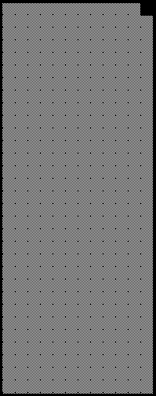
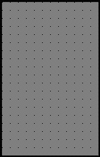
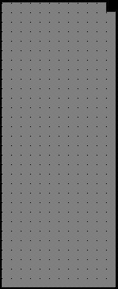

2019 AUSTRIAN GRAND PRIX

27 - 30 June 2019

From The FIA Formula One Race Director Document 43

To All Teams, All Officials Date 30 June 2019

Time 14:43

Title Race Directors Note - Post Race Interviews

Description Post Race Interviews

Enclosed 2019 Austrian F1 Grand Prix - Post Race Interviews Doc 43.pdf

Michael Masi

The FIA Formula One Race Director

2019 AUSTRIAN GRAND PRIX

27 – 30 June 2019

From The FIA Formula One Race Director Document 43

To All Officials, All Teams Date 43 June 2019

Time 14:42

In addition to the provisions of the 2019 Formula One Sporting Regulations – Appendix 3 Podium Ceremony, the

procedure must be followed.

The post-race interview procedure will remain as in the previous race with the top three drivers again being

interviewed as soon as they get out of their cars.

We would like to ask for your co-operation in following the simple procedure set out below:

• Drivers who finish the race in the top three positions will be required to enter pit lane and proceed down pit

lane directly to the 1,2,3 boards which will be located in front of the FIA Garage.

• Behind the boards there will be two historic cars, the 1976 Ferrari and the 1984 McLaren plus other items as part of a tribute to Niki Lauda, located on a red-painted area with the message “Danke Niki”. • Once out of their cars, the interviews will take place in this designated area. The interviewer will be Martin

Brundle.

• Drivers must not interfere with parc fermé protocols in any way.

• At the end of the live interviews, the drivers will be escorted by the FIA Press Delegate through the Pit Building

and proceed to the 1st floor, where the cool down room and the podium are located.

• These drivers will be weighed by the FIA in the cool down room before the podium ceremony.

• At the end of podium ceremony, the top three drivers will go downstairs to the TV pen, located beside the

Mercedes-Benz hospitality in the Paddock and they may be accompanied by their press officers.

• After the TV pen interviews, the top three drivers will be driven on three dedicated shuttles to the main stand

building for the FIA Press Conference.

• Drivers classified from 4th and beyond must proceed directly to the TV pen immediately after they have been

weighed in the parc fermé, located in the FIA garage.

• Drivers who retired during the race are requested to go to the TV pen as soon as they have come back into

the paddock.

Please see the attached Post Race Parc Fermé Diagram.

Michael Masi FIA Formula One Race Director

ecaR srehsinif 9102

- ereh enuJ emreF 03–

gniniameR dekrap 2 noisreV

craP

llaW

tiP ecneF

tiucriC

2 3 dn dr 1 ts namaremaC FR xirP VT

s’rehpargotohP dnarG

– ot aduaL laicepS erutaeF etubirT nairtsuA ikiN

ecneF tiucriC

9102

llaW

tiP srehpargotohP aera

gnitiaw

s’rehpargotohP

muidoP
