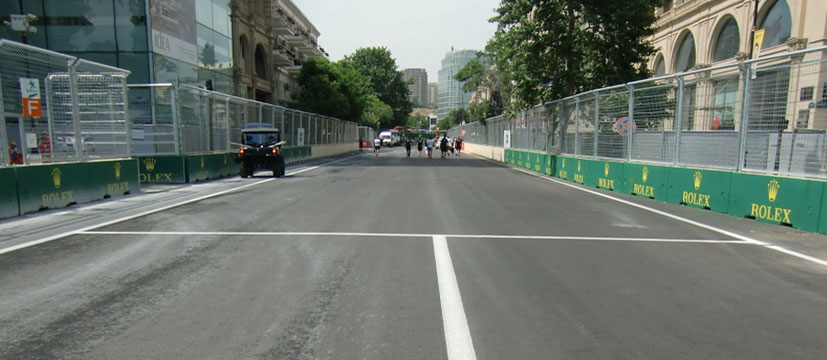

2019 AZERBAIJAN GRAND PRIX

25 - 28 April 2019

From The FIA Formula One Race Director Document 2

To All Teams, All Officials Date 25 April 2019

Time 11:44

Title Event Notes

Description Event Notes

Enclosed 2019 Azerbaijan F1 Grand Prix Race Directors Event Notes - Doc 2.pdf

Michael Masi

The FIA Formula One Race Director

2019 AZERBAIJAN GRAND PRIX

25 – 28 April 2019

From The FIA Formula 1 Race Director Document 2

To All Officials, All Teams Date 25 April 2019

Time 11:45

EVENT NOTES

1) Matters arising from the Chinese Grand Prix

2) Changes to the circuit

2.1 The track has been resurfaced between the exit of turn 1 through to the entry of turn 2.

3) Pit lane map

3.1 Safety Car lines.

3.2 The location of the pit entry and the pit exit.

3.3 Designated garage areas.

3.4 Safety Car position for first lap and rest of race.

3.5 Blue flag marshal at the pit exit.

4) Pirelli Event Preview

4.1 With reference to Article 24.4(a) of the Sporting Regulations see the attached updated document provided by the official tyre supplier.

5) Weighing and weighing platform

5.1 The FIA weighing platform will be available for teams to use at the following times, however, no more than 10 team personnel may be present during any visit. Each visit should last no more than 10 minutes unless no other team is waiting in the pit lane:

a) From 16:30 on Thursday until 12:00 on Friday.

b) From 13:30 on Friday until 16:30 on Saturday (between 15:00 and 16:30 each visit will be restricted to five minutes).

c) From when the cars are returned to the teams after qualifying until 21:30 on Saturday.

d) From 11:00 until 12:00 and 14:00 until 15:30 on Sunday.

Any team found to be abusing the time limits set out above, which we will be enforced by FIA security personnel and our own CCTV, will not be permitted to use the weighbridge again during the Event.

6) Red zones for photographers in the pit lane during practice sessions

6.1 See the attached drawing

1/4

7) Practice starts

7.1 During practice sessions: Practice starts may only be carried out in the pit exit on the left-hand side after the corner but before the dashed white line across the pit exit, drivers should leave sufficient space on their right to allow other cars to pass.

7.2 During the time the pit exit is open for reconnaissance laps (15.30-15.40): Drivers may start further forward but no further forward than the end of the painted kerb, always keeping to the left and again leaving sufficient space on their right to allow other cars to pass.

7.3 At all times: For reasons of safety and sporting equity, cars may not stop in the fast lane at any time the pit exit is open without a justifiable reason (a practice start is not considered a justifiable reason).

8) Lines or bollards at the pit entry and pit exit

8.1 In accordance with Chapter 4 (Section 5) of Appendix L to the ISC drivers must keep to the left of the solid white line at the pit exit when leaving the pits, no part of any car leaving the pits may cross this line.

8.2 For safety reasons, the limits of the pit exit should not be exceeded by cutting the white line bordering the painted kerb on the apex with all four wheels.

8.3 When entering the pits, drivers must keep to the left of the solid white line on the track before the start of the pit entry. The dotted line prior is to assist drivers to better identify where the solid white line starts.

8.4 Furthermore, any car with four wheels to the left of the solid white line must enter the pit lane.

8.5 The dotted white lines across the pit exit and the pit entry are the track edges.

9) Observing yellow flags during free practice and qualifying

9.1 Double waved: Any driver passing through a double waved yellow marshalling sector must reduce speed significantly and be prepared to change direction or stop. In order for the stewards to be satisfied that any such driver has complied with these requirements it must be clear that he has not attempted to set a meaningful lap time, for practical purposes this means the driver should abandon the lap (this does not necessarily mean he has to pit as the track could well be clear the following lap).

9.2 Single waved: Drivers should reduce their speed and be prepared to change direction. It must be clear that a driver has reduced speed and, in order for this to be clear, a driver would be expected to have braked earlier and/or discernibly reduced speed in the relevant marshalling sector.

Drivers should not overtake any car in a single waved yellow marshalling sector unless it is clear that a car is slowing with a completely obvious problem, e.g. obvious accident damage or a deflated tyre.

10) Track light panels

10.1 The FIA track light panels have been installed in the positions shown on the circuit map. In accordance with Appendix H to the ISC the light signals have the same meaning as flag signals.

11) Drivers leaving their pit stop position in the pit lane

11.1 For safety reasons, no car should be driven from its pit stop position at any time unless:

a) It has first been driven into the pit stop position having just entered the pit lane from the track, and;

b) It is then driven immediately back onto the track from the pit stop position.

12) Fire extinguishers around the circuit

12.1 Indicated by small fluorescent orange boards with a white letter “F”.

2/4

13) Places where drivers can leave the track

13.1 Indicated by white and green panels (showing a man running) on the fences, in addition the tops of the walls in these locations are painted fluorescent orange.

14) Places to remove cars from the track

14.1 Indicated by fluorescent orange panels 2m long on the walls or guardrails. Due to the nature of the track there are limited places where cars can be recovered, it is therefore extremely important that the drivers are familiar with these locations. In addition to openings in the walls, cars can be pushed away from the back of the escape roads in turns 1, 2, 3, 4, 6, 7, 8, 12, 15 and 16.

14.2 This is not a track where a driver should take any risks to get back to the pits if he has a serious mechanical problem or damage to his car, the stewards will be asked to strictly enforce Article 22.11 of the Sporting Regulations at all times.

15) Support races

15.1 Team barrier placement during support race sessions and races: No more than four metres from the garages.

15.2 Please do not push cars to the weighing area by using the fast lane during any support race activity.

16) In laps during qualifying and reconnaissance laps

16.1 In order to ensure that cars are not driven unnecessarily slowly on in laps during and after the end of qualifying or during reconnaissance laps when the pit exit is opened for the race, drivers must stay below the maximum time set by the FIA between the Safety Car lines shown on the pit lane map.

You will be informed of the maximum time after the first day of practice.

17) Post qualifying parc fermé

17.1 The cameras should be installed and operated in the same way as usual.

18) Operational personnel curfew

18.1 Boards warning anyone attempting to enter the paddock that the curfew is in operation will be placed immediately before the turnstiles at the appropriate times.

19) Removing cars from the grid

19.1 Two gates in the pit wall, the first just in front of pole position and the second adjacent to grid position 14.

20) Car number light panels for the start

20.1 On the driver’s left.

21) Track light panels displaying pit entry status

21.1 The light panel indicated on the pit lane map will display flashing yellow arrows if cars are required to use the pit lane once the Safety Car has been deployed during the race.

21.2 The light panel indicated on the pit lane map will display flashing red crosses if the pit lane is closed at any point during the race.

22) Lapping during the race

22.1 The ISC requires drivers who are caught by another car about to lap him to allow the faster driver past at the first available opportunity. The F1 Marshalling System has been developed in order to ensure that the point at which a driver is shown blue flags is consistent, rather than trusting the ability of marshals to identify situations that require blue flags.

3/4

As it was at the end of last season the system will be set to give a pre-warning when the faster car is within 3.0s of the car about to be lapped, this should be used by the team of the slower car to warn their driver he is soon going to be lapped and that allowing the faster car through should be considered a priority. When the faster car is within 1.2s of the car about to be lapped blue flags will be shown to the slower car (in addition to blue light panels, blue cockpit lights and a message on the timing monitors) and the driver must allow the following driver to overtake at the first available opportunity.

It should be noted that the aim of using F1MS is ensure consistent application of the rules, additional instructions may also be given by race control when necessary.

23) Post race parc fermé

23.1 All cars must enter the pit lane and should be driven directly to the weighing area.

24) Any other business

Michael Masi FIA Formula One Race Director

4/4

|  |  | Grand Prix of Azerbaijan 26-28/04/2019 (19R04BAK) |  |  |  |  |  |  |  |  |  |  |  |  |  |  |  |  |  |  |  |  |  |  |
| --- | --- | --- | --- | --- | --- | --- | --- | --- | --- | --- | --- | --- | --- | --- | --- | --- | --- | --- | --- | --- | --- | --- | --- | --- |
|  |  | Compound |  |  | FL | FR | RL |  | RR |  |  |  |  |  |  | Ma |  |  |  |  |  |  |  | ndatory race tyres |
|  |  | C2 |  |  | 2A1 | 2A2 | 2A3 |  | 2A4 |  |  |  |  |  |  |  |  |  |  |  |  |  |  | C2 |
|  |  | C3 |  |  | 3B1 | 3B2 | 3B3 |  | 3B4 |  |  |  |  |  |  |  |  |  |  |  |  |  |  | C3 |
|  |  | C4 |  |  | 4C1 | 4C2 | 4C3 |  | 4C4 |  |  |  |  |  |  |  |  |  |  |  |  |  |  |  |
|  |  | INTERMEDIATE |  |  | 33G | 35G | 37G |  | 39G |  |  |  |  |  |  |  |  |  |  |  |  |  |  | Q3 tyre |
|  |  | WET Cross-Over time MINIMUM STARTING PRESSURE, BLISTERING SENSITIVITY, CAMBER LIMIT |  |  | 34F WET > 119% > INT > 113% > DRY | 36F Front (psi) | 37F |  | 39F |  |  |  |  |  | Rear (psi) |  |  |  |  |  |  |  |  | C4 |
|  |  |  | Slicks |  |  | 21.5 |  |  |  |  |  |  |  |  |  | 20.5 |  |  |  |  |  |  |  |  |
|  |  |  | Intermediate |  |  | 20.5 |  |  |  |  |  |  |  |  |  | 21.0 |  |  |  |  |  |  |  |  |
|  |  |  | Wet |  |  | 19.5 |  |  |  |  |  |  |  |  |  | 20.0 |  |  |  |  |  |  |  |  |
| FE EOS Camber limit RE EOS Camber limit -3.50 ° -2.00 ° FE Blistering RE Blistering sensitivity sensitivity Low Low |  | TYRE HEATING STRATEGY (TREAD&SIDEWALL) |  |  |  |  |  |  |  |  |  |  |  |  |  |  |  |  |  |  |  |  |  |  |
| Temperature 0 40 60 80 100 (°C) |  |  |  |  |  |  |  |  |  |  |  |  |  |  |  |  |  |  |  |  |  |  |  |  |
|  |  |  |  | Slicks (front axle) |  | storage |  |  |  |  |  |  |  |  |  |  | m | a | x | . | 3 | h | ma | x. 2h (max. temp = 100°C) |
|  |  |  |  | Slicks (rear axle) |  | storage |  |  |  |  |  |  |  |  |  |  | m | a | x | . | 5 | h |  | (max. temp = 80°C) |
|  |  |  |  | Intermediate |  | storage |  |  |  | m | ax | . | 2 | h |  |  | m | a | x | . | 3 | 0' |  | (max. temp = 80°C) |
|  |  |  |  | Wet |  | storage |  |  |  | m | ax | . | 2 | h |  |  |  |  |  |  |  |  |  | (max. temp = 60°C) |
| (The time limits refer to the period leading up to the start of the session in which the tyres are intended for use). (The temperatures referred to above apply at all times during the event). GENERAL NOTES Teams are kindly reminded that the following parameters will be subjected to FIA checks during the event: - Starting pressure. - Camber at maximum speed. - Maximum blanket temperature. - Tyre swapping. | Tyre Notes |  |  |  |  |  |  |  |  |  |  |  |  |  |  |  |  |  |  |  |  |  |  |  |
| ●Not permitted to switch tyres from their originally allocated position. ●All temperature limits apply to the actual tyre surface temperature, measured with the IR gun detailed in TD029-15. ●Do not subject tyres to large deformation or heavy impact. ●STORAGE temperature is the recommended temperature the tyre can stay in ●Do not leave fitted tyres exposed at an air temperature lower than 15°C blankets without time limit. and/or any UV emission. ●BLANKET HEATING TIME for each temperature range to be counted from the ● Revised prescriptions could be issued during the race weekend in moment the blanket control unit is set to reach its targeted temperature within accordance with TD/007-16. its correspondent interval. | ●Not permitted to switch tyres from their originally allocated position. ●Do not subject tyres to large deformation or heavy impact. ●Do not leave fitted tyres exposed at an air temperature lower than 15°C and/or any UV emission. ● Revised prescriptions could be issued during the race weekend in accordance with TD/007-16. |  |  |  |  |  |  | ●All temperature limits apply to the actual tyre surface temperature, measured with the IR gun detailed in TD029-15. ●STORAGE temperature is the recommended temperature the tyre can stay in blankets without time limit. ●BLANKET HEATING TIME for each temperature range to be counted from the moment the blanket control unit is set to reach its targeted temperature within its correspondent interval. |  |  |  |  |  |  |  |  |  |  |  |  |  |  |  |  |

enaL

| 44 | illeriP |  |  |
| --- | --- | --- | --- |
| 34 | illeriP |  |  |
| 24 | illeriP | smailliW |  |
| 14 | smailliW |  |  |
| 04 | smailliW |  |  |
| 93 | smailliW |  |  |
| 83 | smailliW/ossoR oroT | ossoR oroT |  |
| 73 | ossoR oroT |  |  |
| 63 | ossoR oroT |  |  |
| 53 | ossoR oroT | oemoR aflA |  |
| 43 | oemoR aflA |  |  |
| 33 | oemor aflA |  |  |
| 23 | oemoR aflA |  |  |
| 13 | aflA/tnioP gnicaR | tnioP gnicaR |  |
| 03 | tnioP gnicaR |  |  |
| 92 | tnioP gnicaR |  |  |
| 82 | tnioP gnicaR |  |  |
| 72 | neraLcM | neraLcM |  |
| 62 | neraLcM |  |  |
| 52 | neraLcM |  |  |
| 42 | neraLcM/saaH |  |  |
| 32 | saaH | saaH |  |
| 22 1 | saaH saaH yawklaW | tluaneR |  |
| 02 | tluaneR |  |  |
| 91 | tluaneR |  |  |
| 81 | tluaneR |  |  |
| 71 | tluaneR/lluB deR | lluB deR |  |
| 61 | lluB deR |  |  |
| 51 | lluB deR lluB deR |  |  |
| 41 |  |  |  |
| 31 | irarreF |  |  |
| 21 | irarreF | irarreF |  |
| 11 | irarreF |  |  |
| 01 | irarreF/sedecreM |  |  |
| 9 | sedecreM sedecreM | sedecreM |  |
| 8 |  |  |  |
| 7 | sedecreM |  |  |
| 6 | 1 alumroF |  |  |
| 5 | 1 alumroF | potS noitisoP tiP |  |
| 4 | AIF |  | potS noitisoP tiP |
| 3 | AIF |  |  |
| 2 | AIF |  |  |
| 1 | AIF rewoT lortnoC ecaR | saerA detangiseD egaraG |  |

9102 tiP RAC lirpA TIXE ecaR 52– YTEFAS TIP 1 noisreV

2 eniL

RAC

YTEFAS sdnE

ENAL ENAL segaraG TIP TSAF

1F xirP

dnarG

MORF EREH

najiabrezA DEREVOCER DECALP

KCART SRAC

9102

stratS

ENAL YRTNE

TIP TIP

noitisoP

1 eniL ENAL eloP RAC

YTEFAS TSAF

lennosreP )YLNO

tratS

maeT ecaR(

RAC eniL paL YTEFAS lortnoC tsriF

yrtnE sutatS lenap

tiP X
