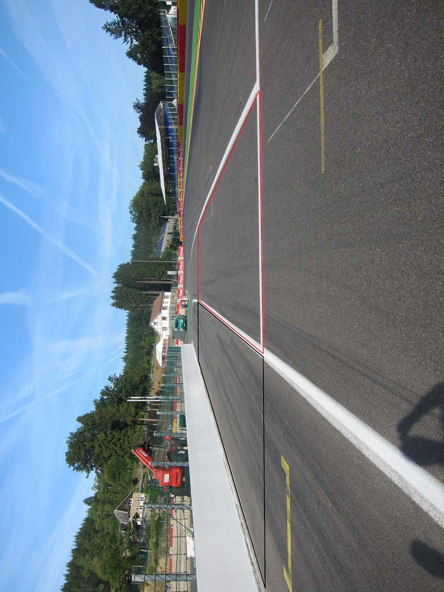

2019 BELGIAN GRAND PRIX

29 August - 1 September 2019

From The FIA Formula One Race Director Document 2

To All Teams, All Officials Date 29 August 2019

Time 11:50

Title Race Directors' Event Notes

Description Event Notes

Enclosed 2019 Belgian F1 Grand Prix - Race Director Event Notes Doc 2.pdf

Michael Masi

The FIA Formula One Race Director

2019 BELGIAN GRAND PRIX

29 August – 1 September 2019

From The FIA Formula One Race Director Document 2

To All Officials, All Teams Date 29 August 2019

Time 11:50

EVENT NOTES

1) Matters arising from the Hungarian Grand Prix

2) Changes to the circuit

2.1 Nothing of significance.

3) Pit lane map

3.1 Safety Car lines.

3.2 The location of the pit entry and the pit exit.

3.3 Designated garage areas.

3.4 Safety Car position for first lap and rest of race.

3.5 Blue flag marshal at the pit exit.

3.6 Track light panels displaying pit entry status.

4) Pirelli Event Preview

4.1 With reference to Article 24.4(a) of the Sporting Regulations see the attached document provided by the official tyre supplier.

5) Weighing and weighing platform

The FIA weighing platform will be available for teams to use at the following times, however, no more than 10 team personnel may be present during any visit. Each visit should last no more than 10 minutes unless no other team is waiting in the pit lane:

a) From 13:00 on Thursday until 10:00 on Friday.

b) From 11:30 on Friday until 14:30 on Saturday (between 13:00 and 14:30 each visit will be restricted to five minutes).

c) From when the cars are returned to the teams after qualifying until 19:30 on Saturday.

d) From 10:00 until 11:00 and 13:00 until 14:30 on Sunday.

Any team found to be abusing the time limits set out above, which we will be enforced by FIA security personnel and our own CCTV, will not be permitted to use the weighbridge again during the Event.

1/5

6) Red zones for photographers in the pit lane during practice sessions

6.1 See the attached drawing.

7) Practice starts

7.1 During each practice session, practice starts may only be carried out on the right-hand side after leaving the pit lane. These must be done prior to the SC2 line and with all four wheels between the white line on the right-hand edge of the pit exit and the wall (the area bordered by black in the photograph on page 5).

7.2 During the time the pit exit is open for the race, practice starts may be carried out on the track after the pit exit before the SC2 line. Drivers wishing to carry out a practice start should stop wholly within the pit exit in order to allow other cars to pass on their left (the area bordered by red in the photograph on page 5). During this time any driver passing a car which has stopped to carry out a practice start may cross the white line that is referred to in 8.1 below.

7.3 For reasons of safety and sporting equity, cars may not stop in the fast lane of the pits at any time the pit exit is open without a justifiable reason (a practice start is not considered a justifiable reason).

8) Lines or bollards at the Pit Entry and Pit Exit

8.1 In accordance with Chapter 4 (Section 5) of Appendix L to the ISC drivers must keep to the right of the solid white line at the pit exit when leaving the pits. No part of any car leaving the pits may cross this line other than in the case detailed in 7.2 above.

8.2 For safety reasons drivers must keep to the right of the bollard at the pit entry when they are entering the pits.

8.3 Except in the cases of force majeure (accepted as such by the Stewards), the crossing, in any direction, of the red/white/green chevron separating the pit entry and the track by a driver who, in the opinion of the Stewards, had committed to entering the pit lane is prohibited.

9) Observing yellow flags during free practice and qualifying

9.1 Double waved: Any driver passing through a double waved yellow marshalling sector must reduce speed significantly and be prepared to change direction or stop. In order for the stewards to be satisfied that any such driver has complied with these requirements it must be clear that he has not attempted to set a meaningful lap time, for practical purposes this means the driver should abandon the lap (this does not necessarily mean he has to pit as the track could well be clear the following lap).

9.2 Single waved: Drivers should reduce their speed and be prepared to change direction. It must be clear that a driver has reduced speed and, in order for this to be clear, a driver would be expected to have braked earlier and/or discernibly reduced speed in the relevant marshalling sector.

Drivers should not overtake any car in a single waved yellow marshalling sector unless it is clear that a car is slowing with a completely obvious problem, e.g. obvious accident damage or a deflated tyre.

10) Track light panels

10.1 The FIA track light panels have been installed in the positions shown on the circuit map. In accordance with Appendix H to the ISC the light signals have the same meaning as flag signals.

11) Track Limits – Turn 4

11.1 Any lap completed during any qualifying session or the race by leaving the track and cutting behind the apex of turn 4, as judged by the detection loop in this location, will be deleted by the stewards.

11.2 On the third occasion of a driver cutting behind the apex during the race, he will be shown a black and white flag, any further cutting will then be reported to the stewards.

11.3 Each time any car cuts behind the apex teams will be informed via the official messaging system.

2/5

11.4 The above requirements will not automatically apply to any driver who is judged to have been forced off the track, each such case will be judged individually.

11.5 In all cases detailed above, the driver must only re-join the track when it is safe to do so and without gaining a lasting advantage.

12) Escape road at Turn 5

12.1 If a driver overshoots the corner at Turn 5 there is a small road along the front of the tyre barrier which leads back on to the track at Turn 7, please ensure that your drivers use this when necessary.

13) Drivers leaving their pit stop position in the pit lane

13.1 For safety reasons, no car should be driven from its pit stop position at any time unless:

a) It has first been driven into the pit stop position having just entered the pit lane from the track, and;

b) It is then driven immediately back onto the track from the pit stop position.

14) Fire extinguishers around the circuit

14.1 Indicated by white boards with a red letter "F".

15) Places to remove cars from the track

15.1 Indicated by fluorescent orange panels on the walls or guardrails.

16) Spectator Pit Walk and Support races team barrier placement

16.1 Team barrier placement prior to and during all support category practice sessions and races: No more than three metres from the garages.

16.2 It is not permitted to push cars to the weighing area at any time a support category is in pit lane.

17) In laps during qualifying and reconnaissance laps

17.1 In order to ensure that cars are not driven unnecessarily slowly on in laps during and after the end of qualifying or during reconnaissance laps when the pit exit is opened for the race, drivers must stay below the maximum time set by the FIA between the Safety Car lines shown on the pit lane map.

You will be informed of the maximum time after the first day of practice.

18) Post qualifying parc fermé

18.1 The cameras should be installed and operated in the same way as usual.

19) Operational personnel curfew

19.1 Boards warning anyone attempting to enter the paddock that the curfew is in operation will be placed immediately before the turnstiles at the appropriate times.

20) Removing cars from the grid

20.1 The gate in the pit wall adjacent to grid position 1.

21) Car number light panels for the start

21.1 On the left-hand side of the grid.

22) Track light panel displaying pit entry status

22.1 The light panel indicated on the pit lane map will display flashing yellow arrows if cars are required to use the pit lane once the Safety Car has been deployed during the race.

3/5

22.2 The light panel indicated on the pit lane map will display flashing red crosses if the pit lane is closed at any point during the race.

23) Lapping during the race

23.1 The ISC requires drivers who are caught by another car about to lap him to allow the faster driver past at the first available opportunity. The F1 Marshalling System has been developed in order to ensure that the point at which a driver is shown blue flags is consistent, rather than trusting the ability of marshals to identify situations that require blue flags.

As it was at the end of last season the system will be set to give a pre-warning when the faster car is within 3.0s of the car about to be lapped, this should be used by the team of the slower car to warn their driver he is soon going to be lapped and that allowing the faster car through should be considered a priority. When the faster car is within 1.2s of the car about to be lapped blue flags will be shown to the slower car (in addition to blue light panels, blue cockpit lights and a message on the timing monitors) and the driver must allow the following driver to overtake at the first available opportunity.

It should be noted that the aim of using F1MS is ensure consistent application of the rules, additional instructions may also be given by race control when necessary.

24) Post race parc fermé

24.1 Drivers should not complete a full slowing down lap but should enter the pits via the pit exit and proceed down the pit lane in the “wrong” direction, all cars will then be stopped in the weighing area.

25) Any other business

Michael Masi FIA Formula One Race Director

4/5

PRACTICE START LOCATIONS

5/5

|  |  | Grand Prix of Belgium 30/08-01/09/2019 (19R13SPA) |  |  |  |  |  |  |  |  |  |  |  |  |  |  |  |  |  |  |  |  |  |  |
| --- | --- | --- | --- | --- | --- | --- | --- | --- | --- | --- | --- | --- | --- | --- | --- | --- | --- | --- | --- | --- | --- | --- | --- | --- |
|  |  | Compound |  |  | FL | FR | RL |  | RR |  |  |  |  |  |  | Ma |  |  |  |  |  |  |  | ndatory race tyres |
|  |  | C1 |  |  | 1A1 | 1A2 | 1A3 |  | 1A4 |  |  |  |  |  |  |  |  |  |  |  |  |  |  | C1 |
|  |  | C2 |  |  | 2B1 | 2B2 | 2B3 |  | 2B4 |  |  |  |  |  |  |  |  |  |  |  |  |  |  | C2 |
|  |  | C3 |  |  | 3C1 | 3C2 | 3C3 |  | 3C4 |  |  |  |  |  |  |  |  |  |  |  |  |  |  |  |
|  |  | INTERMEDIATE |  |  | 33G | 35G | 37G |  | 39G |  |  |  |  |  |  |  |  |  |  |  |  |  |  | Q3 tyre |
|  |  | WET Cross-Over time MINIMUM STARTING PRESSURE, BLISTERING SENSITIVITY, CAMBER LIMIT |  |  | 34F WET > 119% > INT > 113% > DRY | 36F Front (psi) | 37F |  | 39F |  |  |  |  |  | Rear (psi) |  |  |  |  |  |  |  |  | C3 |
|  |  |  | Slicks |  |  | 24.0 |  |  |  |  |  |  |  |  |  | 20.0 |  |  |  |  |  |  |  |  |
|  |  |  | Intermediate |  |  | 22.0 |  |  |  |  |  |  |  |  |  | 20.0 |  |  |  |  |  |  |  |  |
|  |  |  | Wet |  |  | 21.0 |  |  |  |  |  |  |  |  |  | 19.0 |  |  |  |  |  |  |  |  |
| FE EOS Camber limit RE EOS Camber limit -2.75 ° -1.50 ° FE Blistering RE Blistering sensitivity sensitivity Low Medium |  | TYRE HEATING STRATEGY (TREAD&SIDEWALL) |  |  |  |  |  |  |  |  |  |  |  |  |  |  |  |  |  |  |  |  |  |  |
| Temperature 0 40 60 80 100 (°C) |  |  |  |  |  |  |  |  |  |  |  |  |  |  |  |  |  |  |  |  |  |  |  |  |
|  |  |  |  | Slicks (front axle) |  | storage |  |  |  |  |  |  |  |  |  |  | m | a | x | . | 3 | h | ma | x. 2h (max. temp = 100°C) |
|  |  |  |  | Slicks (rear axle) |  | storage |  |  |  |  |  |  |  |  |  |  | m | a | x | . | 5 | h |  | (max. temp = 80°C) |
|  |  |  |  | Intermediate |  | storage |  |  |  | m | ax | . | 2 | h |  |  | m | a | x | . | 3 | 0' |  | (max. temp = 80°C) |
|  |  |  |  | Wet |  | storage |  |  |  | m | ax | . | 2 | h |  |  |  |  |  |  |  |  |  | (max. temp = 60°C) |
| (The time limits refer to the period leading up to the start of the session in which the tyres are intended for use). (The temperatures referred to above apply at all times during the event). GENERAL NOTES Teams are kindly reminded that the following parameters will be subjected to FIA checks during the event: - Starting pressure. - Camber at maximum speed. - Maximum blanket temperature. - Tyre swapping. | Tyre Notes |  |  |  |  |  |  |  |  |  |  |  |  |  |  |  |  |  |  |  |  |  |  |  |
| ●Not permitted to switch tyres from their originally allocated position. ●All temperature limits apply to the actual tyre surface temperature, measured with the IR gun detailed in TD029-15. ●Do not subject tyres to large deformation or heavy impact. ●STORAGE temperature is the recommended temperature the tyre can stay in ●Do not leave fitted tyres exposed at an air temperature lower than 15°C blankets without time limit. and/or any UV emission. ●BLANKET HEATING TIME for each temperature range to be counted from the ● Revised prescriptions could be issued during the race weekend in moment the blanket control unit is set to reach its targeted temperature within accordance with TD/007-16. its correspondent interval. | ●Not permitted to switch tyres from their originally allocated position. ●Do not subject tyres to large deformation or heavy impact. ●Do not leave fitted tyres exposed at an air temperature lower than 15°C and/or any UV emission. ● Revised prescriptions could be issued during the race weekend in accordance with TD/007-16. |  |  |  |  |  |  | ●All temperature limits apply to the actual tyre surface temperature, measured with the IR gun detailed in TD029-15. ●STORAGE temperature is the recommended temperature the tyre can stay in blankets without time limit. ●BLANKET HEATING TIME for each temperature range to be counted from the moment the blanket control unit is set to reach its targeted temperature within its correspondent interval. |  |  |  |  |  |  |  |  |  |  |  |  |  |  |  |  |

enaL

lenap 9102 yrtnE tiP eniL tsuguA sutatS tiP lortnoC RAC 92– paL yrtnE dralloB YTEFAS 1 noisreV tsriF tiP X

| 1 | 1F |  |
| --- | --- | --- |
| 2 | AIF | saerA detangiseD egaraG |
| 3 | AIF |  |
| 4 | AIF |  |
| 5 | AIF | sedecreM |
| 6 | sedecreM |  |
| 7 | sedecreM |  |
| 8 | sedecreM |  |
| 9 | irarreF / sedecreM | irarreF |
| 01 | irarreF |  |
| 11 | irarreF |  |
| 21 | irarreF |  |
| 31 | lluB deR | lluB deR |
| 41 | lluB deR |  |
| 51 | lluB deR |  |
| 61 | tluaneR / lluB deR | tluaneR |
| 71 | tluaneR |  |
| 81 | tluaneR |  |
| 91 | tluaneR |  |
| 02 | yawklaW |  |
| 12 | saaH | saaH |
| 22 | saaH |  |
| 32 | saaH |  |
| 42 | neraLcM / saaH | neraLcM |
| 52 | neraLcM |  |
| 62 | neraLcM |  |
| 72 | neraLcM | tnioP gnicaR |
| 82 | tnioP gnicaR |  |
| 92 | tnioP gnicaR |  |
| 03 | tnioP gnicaR |  |
| 13 | aflA / tP gnicaR | oemoR aflA |
| 23 | oemoR aflA |  |
| 33 | oemoR aflA |  |
| 43 | oemoR aflA |  |
| 53 | ossoR oroT | ossoR oroT |
| 63 | ossoR oroT |  |
| 73 | ossoR oroT |  |
| 83 | ossoR.T / smailliW |  |
| 93 | smailliW | smailliW |
| 04 | smailliW |  |
| 14 | smailliW |  |
| 24 | 1F |  |

YRTNE

TIP ENAL

1 eniL TSAF RAC

YTEFAS

stratS

ENAL noitisoP

xirP TIP eloP

dnarG

naigleB

segaraG

9102

1F

2 eniL

RAC

YTEFAS

RAC ENAL ecaR YTEFAS TSAF

TIXE

TIP

sdnE

ENAL

TIP

noitisoP

potS

tiP

