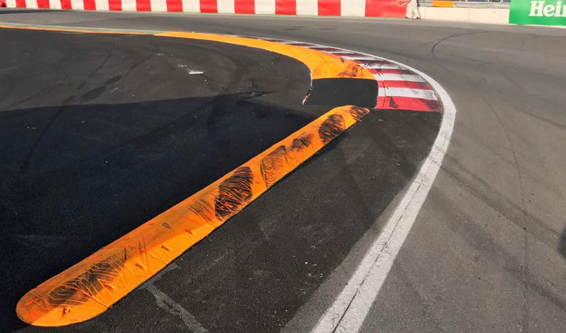

2019 CANADIAN GRAND PRIX

6 - 9 June 2019

From The FIA Formula One Race Director Document 2

To All Teams, All Officials Date 06 June 2019

Time 09:05

Title Event Notes

Description Event Notes

Enclosed 2019 Canadian F1 Grand Prix Race Directors Event Notes - DOC 2.pdf

Michael Masi

The FIA Formula One Race Director

2019 CANADIAN GRAND PRIX

6 – 9 June 2019

From The FIA Formula One Race Director Document 2

To All Officials, All Teams Date 6 June 2019

Time 09:00

EVENT NOTES

1) Matters arising from the Monaco Grand Prix

2) Changes to the circuit

2.1 The section of wall and guardrail between Turns 4 and 6 have been replaced by new concrete walls and debris fence.

2.2 The guardrail between Turns 6 and 7 have been replaced by new concrete walls and debris fence.

2.3 The guardrail at Turn 8 have been replaced by new concrete walls and debris fence.

2.4 The section of wall and guardrail between turns 9 and 10 have been replaced by new concrete walls and debris fence.

2.5 The opening after Turn 10 on drivers right has been significantly widened and extended.

2.6 The configuration of the wall at Turn 13 driver's right has been completely modified and guardrail replaced by concrete wall.

2.7 The fence at Turn 14 has been replaced by new concrete walls and debris fence.

2.8 Four additional CCTV Cameras have been installed to allow the entire track to be monitored.

2.9 A drain has been added to the inside the Turn 2 to assist the standing water issue.

2.10 The entire Pit Building has been demolished and rebuilt.

3) Pit lane map

3.1 Safety Car lines.

3.2 The location of the pit entry and the pit exit.

3.3 Designated garage areas.

3.4 Safety Car position for first lap and rest of race.

3.5 Blue flag marshal at the pit exit.

3.6 Track light panel displaying pit entry status.

4) Pirelli Event Preview

4.1 With reference to Article 24.4(a) of the Sporting Regulations see the attached updated document provided by the official tyre supplier.

1/5

5) Weighing and weighing platform

5.1 The FIA weighing platform will be available for teams to use at the following times, however, no more than 10 team personnel may be present during any visit. Each visit should last no more than 10 minutes unless no other team is waiting in the pit lane:

a) From 12:30 on Thursday until 09:00 on Friday.

b) From 10:30 on Friday until 13:30 on Saturday (between 12:00 and 13:30 each visit will be restricted to five minutes).

c) From when the cars are returned to the teams after qualifying until 18:30 on Saturday.

d) From 09:00 until 10:00 and 12:00 until 13:30 on Sunday.

Any team found to be abusing the time limits set out above, which we will be enforced by FIA security personnel and our own CCTV, will not be permitted to use the weighbridge again during the Event.

6) Red zones for photographers in the pit lane during practice sessions

6.1 See the attached drawing.

7) Practice starts

7.1 During practice sessions: Practice starts may only be carried out at the pit exit on the left hand side and, for the avoidance of doubt, this includes any time the pit exit is open for the race.

7.2 During the time the pit exit is open for reconnaissance laps (13.30-13.40): As a number of drivers will want to carry out a practice start during this short period any driver going to the pit exit first, or any driver arriving there when no other car is present, should stop beyond the pit exit line and go as far as the end of the pit wall (where the Rolex clock is located). This should then allow other drivers to queue in a position to make a start without the need to stop more than once.

7.3 At all times: For reasons of safety and sporting equity, cars may not stop in the fast lane at any time the pit exit is open without a justifiable reason (a practice start is not considered a justifiable reason).

8) Lines or bollards at the Pit Entry and Pit Exit

8.1 In accordance with Chapter 4 (Section 5) of Appendix L to the ISC drivers must keep to the left of the solid white line at the pit exit when leaving the pits and stay to the left of it until it finishes after Turn 1. No part of any car leaving the pits may cross this line.

8.2 For safety reasons, drivers must stay to the left of the white line at the pit entry when entering the pits.

8.3 There will be no bollards in the first part of the pit lane between the beginning of the speed limit and the first garage. The only exception to this will be at the end of P2 and during qualifying when it will be necessary to protect cars in the weighing area.

8.4 Furthermore, drivers may cut across the white lines in this section (always entering the pit lane by staying left of the block/bollard at the start of the speed limit), car speed calculations are based on a straight line between the pit speed loops.

9) Cutting the Chicanes

9.1 Any driver who fails to negotiate Turn 9 by using the track, and who passes completely to the left of the orange kerb element on the apex of the corner, must keep completely to the left of the orange speed bump and the orange block/bollard on the exit of the corner and re-join the track at the far end of the asphalt run-off area.

9.2 Any driver who fails to negotiate Turn 14 by using the track, and who passes completely to the left of the orange kerb element on the apex of the corner (as opposed to the speed bump before it, see photo below), must keep to the left of the orange block/bollard and re-join the track at the far end of the asphalt run-off area.

2/5

9.3 The above requirements will not automatically apply to any driver who is judged to have been forced off the track, each such case will be judged individually

10) Observing yellow flags during free practice and qualifying

10.1 Double waved: Any driver passing through a double waved yellow marshalling sector must reduce speed significantly and be prepared to change direction or stop. In order for the stewards to be satisfied that any such driver has complied with these requirements it must be clear that he has not attempted to set a meaningful lap time, for practical purposes this means the driver should abandon the lap (this does not necessarily mean he has to pit as the track could well be clear the following lap).

10.2 Single waved: Drivers should reduce their speed and be prepared to change direction. It must be clear that a driver has reduced speed and, in order for this to be clear, a driver would be expected to have braked earlier and/or discernibly reduced speed in the relevant marshalling sector.

Drivers should not overtake any car in a single waved yellow marshalling sector unless it is clear that a car is slowing with a completely obvious problem, e.g. obvious accident damage or a deflated tyre.

11) Track light panels

11.1 The FIA track light panels have been installed in the positions shown on the circuit map. In accordance with Appendix H to the ISC the light signals have the same meaning as flag signals.

12) Drivers leaving their pit stop position in the pit lane

12.1 For safety reasons, no car should be driven from its pit stop position at any time unless:

a) It has first been driven into the pit stop position having just entered the pit lane from the track, and;

b) It is then driven immediately back onto the track from the pit stop position.

13) Fire extinguishers around the circuit

13.1 Indicated by small white boards with a red letter “F”.

14) Places to remove cars from the track

14.1 Indicated by fluorescent orange panels on the walls.

3/5

15) Places where drivers can leave the track

15.1 Indicated by fluorescent orange panels on the debris fences or walls.

16) Support races and Pit Walks

16.1 Team barrier placement prior to and during all support race practice sessions and races: No more than three metres from the garages.

16.2 It is not permitted to push cars to the weighing area at any time a support category is in pit lane.

17) In laps during qualifying and reconnaissance laps

17.1 In order to ensure that cars are not driven unnecessarily slowly on in laps during and after the end of qualifying or during reconnaissance laps when the pit exit is opened for the race, drivers must stay below the maximum time set by the FIA between the Safety Car lines shown on the pit lane map.

You will be informed of the maximum time after the first day of practice.

18) Post qualifying parc fermé

18.1 The cameras should be installed and operated in the same way as usual.

19) Operational personnel curfew

19.1 Boards warning anyone attempting to enter the paddock that the curfew is in operation will be placed immediately before the turnstiles at the appropriate times.

20) Removing cars from the grid

20.1 At the end of the pit signaling wall and via the Pit Exit.

21) Car number light panels for the start

21.1 On the left hand side of the grid.

22) Track light panels displaying pit entry status

22.1 The light panel indicated on the pit lane map will display flashing yellow arrows if cars are required to use the pit lane once the Safety Car has been deployed during the race.

22.2 The light panel indicated on the pit lane map will display flashing red crosses if the pit lane is closed at any point during the race.

23) Lapping during the race

23.1 The ISC requires drivers who are caught by another car about to lap him to allow the faster driver past at the first available opportunity. The F1 Marshalling System has been developed in order to ensure that the point at which a driver is shown blue flags is consistent, rather than trusting the ability of marshals to identify situations that require blue flags.

As it was at the end of last season the system will be set to give a pre-warning when the faster car is within 3.0s of the car about to be lapped, this should be used by the team of the slower car to warn their driver he is soon going to be lapped and that allowing the faster car through should be considered a priority. When the faster car is within 1.2s of the car about to be lapped blue flags will be shown to the slower car (in addition to blue light panels, blue cockpit lights and a message on the timing monitors) and the driver must allow the following driver to overtake at the first available opportunity.

It should be noted that the aim of using F1MS is ensure consistent application of the rules, additional instructions may also be given by race control when necessary.

4/5

24) Post race parc fermé

24.1 All cars must enter the pit lane and, with the exception of the first three cars, should be driven directly to the weighing area.

24.2 The first three cars should be driven down the pit lane to the end of the Pit Building without stopping.

25) Any other business

Michael Masi FIA Formula One Race Director

5/5

|  |  | Grand Prix of Canada 07-09/06/2019 (19R07MTL) |  |  |  |  |  |  |  |  |  |  |  |  |  |  |  |  |  |  |  |  |  |  |
| --- | --- | --- | --- | --- | --- | --- | --- | --- | --- | --- | --- | --- | --- | --- | --- | --- | --- | --- | --- | --- | --- | --- | --- | --- |
|  |  | Compound |  |  | FL | FR | RL |  | RR |  |  |  |  |  |  | Ma |  |  |  |  |  |  |  | ndatory race tyres |
|  |  | C3 |  |  | 3A1 | 3A2 | 3A3 |  | 3A4 |  |  |  |  |  |  |  |  |  |  |  |  |  |  | C3 |
|  |  | C4 |  |  | 4B1 | 4B2 | 4B3 |  | 4B4 |  |  |  |  |  |  |  |  |  |  |  |  |  |  | C4 |
|  |  | C5 |  |  | 5C1 | 5C2 | 5C3 |  | 5C4 |  |  |  |  |  |  |  |  |  |  |  |  |  |  |  |
|  |  | INTERMEDIATE |  |  | 33G | 35G | 37G |  | 39G |  |  |  |  |  |  |  |  |  |  |  |  |  |  | Q3 tyre |
|  |  | WET Cross-Over time MINIMUM STARTING PRESSURE, BLISTERING SENSITIVITY, CAMBER LIMIT |  |  | 34F WET > 119% > INT > 113% > DRY | 36F Front (psi) | 37F |  | 39F |  |  |  |  |  | Rear (psi) |  |  |  |  |  |  |  |  | C5 |
|  |  |  | Slicks |  |  | 22.0 |  |  |  |  |  |  |  |  |  | 20.0 |  |  |  |  |  |  |  |  |
|  |  |  | Intermediate |  |  | 20.0 |  |  |  |  |  |  |  |  |  | 20.0 |  |  |  |  |  |  |  |  |
|  |  |  | Wet |  |  | 19.0 |  |  |  |  |  |  |  |  |  | 19.0 |  |  |  |  |  |  |  |  |
| FE EOS Camber limit RE EOS Camber limit -3.50 ° -2.00 ° FE Blistering RE Blistering sensitivity sensitivity Low Low |  | TYRE HEATING STRATEGY (TREAD&SIDEWALL) |  |  |  |  |  |  |  |  |  |  |  |  |  |  |  |  |  |  |  |  |  |  |
| Temperature 0 40 60 80 100 (°C) |  |  |  |  |  |  |  |  |  |  |  |  |  |  |  |  |  |  |  |  |  |  |  |  |
|  |  |  |  | Slicks (front axle) |  | storage |  |  |  |  |  |  |  |  |  |  | m | a | x | . | 3 | h | ma | x. 2h (max. temp = 100°C) |
|  |  |  |  | Slicks (rear axle) |  | storage |  |  |  |  |  |  |  |  |  |  | m | a | x | . | 5 | h |  | (max. temp = 80°C) |
|  |  |  |  | Intermediate |  | storage |  |  |  | m | ax | . | 2 | h |  |  | m | a | x | . | 3 | 0' |  | (max. temp = 80°C) |
|  |  |  |  | Wet |  | storage |  |  |  | m | ax | . | 2 | h |  |  |  |  |  |  |  |  |  | (max. temp = 60°C) |
| (The time limits refer to the period leading up to the start of the session in which the tyres are intended for use). (The temperatures referred to above apply at all times during the event). GENERAL NOTES Teams are kindly reminded that the following parameters will be subjected to FIA checks during the event: - Starting pressure. - Camber at maximum speed. - Maximum blanket temperature. - Tyre swapping. | Tyre Notes |  |  |  |  |  |  |  |  |  |  |  |  |  |  |  |  |  |  |  |  |  |  |  |
| ●Not permitted to switch tyres from their originally allocated position. ●All temperature limits apply to the actual tyre surface temperature, measured with the IR gun detailed in TD029-15. ●Do not subject tyres to large deformation or heavy impact. ●STORAGE temperature is the recommended temperature the tyre can stay in ●Do not leave fitted tyres exposed at an air temperature lower than 15°C blankets without time limit. and/or any UV emission. ●BLANKET HEATING TIME for each temperature range to be counted from the ● Revised prescriptions could be issued during the race weekend in moment the blanket control unit is set to reach its targeted temperature within accordance with TD/007-16. its correspondent interval. | ●Not permitted to switch tyres from their originally allocated position. ●Do not subject tyres to large deformation or heavy impact. ●Do not leave fitted tyres exposed at an air temperature lower than 15°C and/or any UV emission. ● Revised prescriptions could be issued during the race weekend in accordance with TD/007-16. |  |  |  |  |  |  | ●All temperature limits apply to the actual tyre surface temperature, measured with the IR gun detailed in TD029-15. ●STORAGE temperature is the recommended temperature the tyre can stay in blankets without time limit. ●BLANKET HEATING TIME for each temperature range to be counted from the moment the blanket control unit is set to reach its targeted temperature within its correspondent interval. |  |  |  |  |  |  |  |  |  |  |  |  |  |  |  |  |

enaL 9102

enuJ

tiP 6– 1 noisreV 2 eniL

| lortnoC ecaR | saerA detangiseD egaraG |  |
| --- | --- | --- |
| 1 alumroF | sedecreM |  |
| sedecreM |  |  |
| sedecreM |  |  |
| sedecreM |  |  |
| sedecreM | irarreF |  |
| irarreF |  |  |
| irarreF |  |  |
| irarreF |  |  |
| irarreF | lluB deR |  |
| lluB deR |  |  |
| lluB deR |  |  |
| lluB deR | tluaneR |  |
| tluaneR |  |  |
| tluaneR |  |  |
| tluaneR |  |  |
| tluaneR | saaH |  |
| saaH |  |  |
| saaH |  |  |
| saaH | neraLcM |  |
| neraLcM |  |  |
| neraLcM |  |  |
| neraLcM |  |  |
| yawklaW | tnioP gnicaR |  |
| tnioP gnicaR |  |  |
| tnioP gnicaR |  |  |
| tnioP gnicaR | oemoR aflA |  |
| oemoR aflA |  |  |
| oemoR aflA |  |  |
| oemoR aflA |  |  |
| oemoR aflA | ossoR oroT |  |
| ossoR oroT |  |  |
| ossoR oroT |  |  |
| ossoR oroT |  |  |
| smailliW | smailliW |  |
| smailliW |  |  |
| smailliW |  |  |
| spaL toH |  |  |
| spaL toH |  |  |
| AIF |  | potS noitisoP tiP |
| AIF |  |  |
| AIF |  |  |
| AIF |  |  |
| AIF |  |  |

RAC galF lahsraM YTEFAS eulB

noitisoP 34 TIXE 24 ENAL TIP 14 eloP

sdnE 04 TSAF 93 ENAL 83 xirP TIP 73 63 53 dnarG 43 33 RAC ecaR 23 YTEFAS naidanaC 13 03 92 82 72 segaraG 62 9102 52

42 32 1F 22

MORF 12 EREH 02 DEREVOCER DECALP 91 81 71 KCART SRAC 61 51 41 stratS 31 ENAL ENAL 21 11 TIP TSAF 01

9

1 8 eniL 7 RAC 6 YRTNE YTEFAS 5 RAC 4 TIP paL 3 YTEFAS tsriF lenap 2 yrtnE 1 sutatS tiP

X
