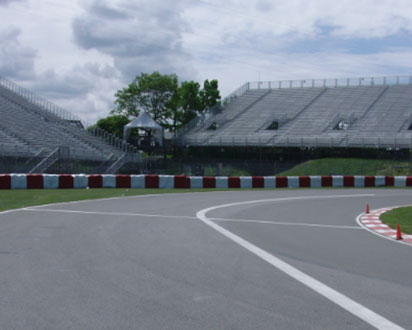
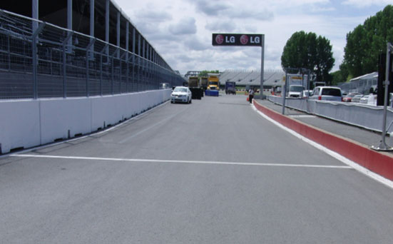

2019 CANADIAN GRAND PRIX

6 - 9 June 2019

From The FIA Formula One Race Director Document 20

To All Teams, All Officials Date 08 June 2019

Time 12:04

Title Race Directors Note - Post Qualifying Interviews

Description Post Qualifying Interviews

Enclosed 2019 Canadian F1 Grand Prix - Post Qualifying Interviews - Doc 20.pdf

Michael Masi

The FIA Formula One Race Director

2019 CANADIAN GRAND PRIX

6 – 9 June 2019

From The FIA Formula One Race Director Document 20

To All Officials, All Teams Date 8 June 2019

Time 12:05

NOTE TO TEAMS

The Post-qualifying interview procedure will basically remain as in the previous race with the top three drivers again being interviewed as soon as they get out of their cars on the track.

Should either of your drivers be among the top three at the end of qualifying we would like to ask for your co-operation in following the procedure below:

• If they take the chequered flag at the end of Q3, the fastest three drivers should enter Pit Lane and procced directly to the Pit Exit where the 1, 2, 3 boards which will be located at the end of the signaling wall.

• Other than the team mechanics (with cooling fans if necessary), officials and accredited television crews and photographers, no one else will be allowed in the designated area at this time (no driver physios nor team PR personnel).

• Once out of their cars the interviews will take place in this designated area. The interviewer will be Jenson Button.

• If one of the top three drivers is already in the pit lane at the end of the session, the team should ensure that he goes directly to the designated area once the other drivers have arrived there.

• At the end of the live interviews the drivers will walk back into Pit Lane towards the Pit Building and then be led to the backdrop for the AfRS photo opportunity.

• Mechanics will be authorised to remove the cars from the grid only after the interviews are completed and must push these cars directly to the parc fermé.

• The pole position driver should then remain in front of the AfRS backdrop to receive the Pirelli Pole Position Award from the Pirelli Representative, actress Liza Koshy. These three drivers will be weighed by the FIA next to the AfRS backdrop. o • The drivers will then be escorted by the FIA Press Delegate through the Pit Building and take a buggy to the Media Centre where the press conference will take place.

• At the end of the press conference, the top three drivers will go downstairs to the TV pen, located between the McLaren and Racing Point hospitalities in the Paddock and they may be accompanied by their press officers.

• NB: Drivers eliminated in Q1 and Q2, drivers classified from 4th to 10th in Q3 and drivers who did not participate to Q1 but are eligible to race must also attend the TV pen interview session after they have been weighed at the end of the last part of qualifying which they participated.

• For safety reasons, following qualifying, please ensure that non-essential team personnel do not exit the front of the garages until after the top three cars have passed through the pit lane and parked in the designated area.

Please see the attached Qualifying - Parc Fermé Diagram.

Michael Masi FIA Formula One Race Director

enaL 9102

enuJ

tiP 6– 1 noisreV 2 eniL

| lortnoC ecaR | saerA detangiseD egaraG |  |
| --- | --- | --- |
| 1 alumroF | sedecreM |  |
| sedecreM |  |  |
| sedecreM |  |  |
| sedecreM |  |  |
| sedecreM | irarreF |  |
| irarreF |  |  |
| irarreF |  |  |
| irarreF |  |  |
| irarreF | lluB deR |  |
| lluB deR |  |  |
| lluB deR |  |  |
| lluB deR | tluaneR |  |
| tluaneR |  |  |
| tluaneR |  |  |
| tluaneR |  |  |
| tluaneR | saaH |  |
| saaH |  |  |
| saaH |  |  |
| saaH | neraLcM |  |
| neraLcM |  |  |
| neraLcM |  |  |
| neraLcM |  |  |
| yawklaW | tnioP gnicaR |  |
| tnioP gnicaR |  |  |
| tnioP gnicaR |  |  |
| tnioP gnicaR | oemoR aflA |  |
| oemoR aflA |  |  |
| oemoR aflA |  |  |
| oemoR aflA |  |  |
| oemoR aflA | ossoR oroT |  |
| ossoR oroT |  |  |
| ossoR oroT |  |  |
| ossoR oroT |  |  |
| smailliW | smailliW |  |
| smailliW |  |  |
| smailliW |  |  |
| spaL toH |  |  |
| spaL toH |  |  |
| AIF |  | potS noitisoP tiP |
| AIF |  |  |
| AIF |  |  |
| AIF |  |  |
| AIF |  |  |

RAC galF lahsraM YTEFAS eulB

noitisoP 34 TIXE 24 ENAL TIP 14 eloP

sdnE 04 TSAF 93 ENAL 83 xirP TIP 73 63 53 dnarG 43 33 RAC ecaR 23 YTEFAS naidanaC 13 03 92 82 72 segaraG 62 9102 52

42 32 1F 22

MORF 12 EREH 02 DEREVOCER DECALP 91 81 71 KCART SRAC 61 51 41 stratS 31 ENAL ENAL 21 11 TIP TSAF 01

9

1 8 eniL 7 RAC 6 YRTNE YTEFAS 5 RAC 4 TIP paL 3 YTEFAS tsriF lenap 2 yrtnE 1 sutatS tiP

X
