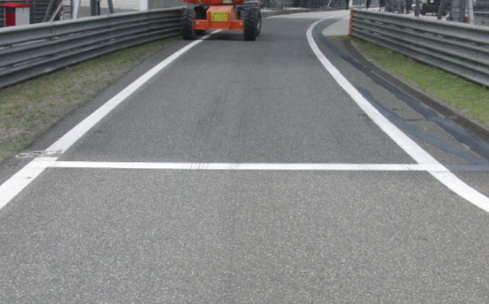
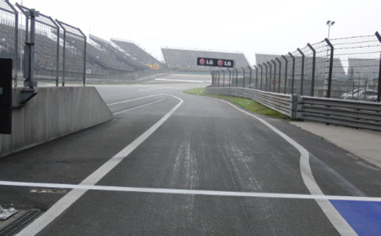
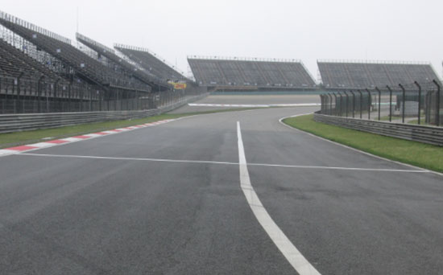

2019 CHINESE GRAND PRIX

11 - 14 April 2019

From The FIA Formula One Race Director Document 6

To All Teams, All Officials Date 11 April 2019

Time 19:05

Title Event Notes Version 2

Description Event Notes Version 2

Enclosed 2019 Chinese F1 Grand Prix - Race Director Event Notes Doc 06.pdf

Michael Masi

The FIA Formula One Race Director

2019 CHINESE GRAND PRIX

11 – 14 April 2019

From The FIA Formula 1 Race Director Document 6

To All Officials, All Teams Date 11 April 2019

Time 19.05

EVENT NOTES VERSION 2

1) Matters arising from the Bahrain Grand Prix

2) Changes to the circuit

2.1 Other than routine maintenance no changes of significance have been made.

3) Pit lane map

3.1 Safety Car lines.

3.2 The location of the pit entry and the pit exit.

3.3 Designated garage areas.

3.4 Safety Car position for first lap and rest of race.

3.5 Blue flag marshal at the pit exit.

4) Pirelli Event Preview

4.1 With reference to Article 24.4(a) of the Sporting Regulations see the attached document provided by the official tyre supplier.

5) Weighing and weighing platform

5.1 The FIA weighing platform will be available for teams to use at the following times, however, no more than 10 team personnel may be present during any visit. Each visit should last no more than 10 minutes unless no other team is waiting in the pit lane:

a) From 12.30 on Thursday until 13.30 on Saturday (between 12.00 and 13.30 each visit will be restricted to five minutes).

b) From when the cars are returned to the teams after qualifying until 18.30 on Saturday.

c) From 09.10 until 13.10 on Sunday.

Any team found to be abusing the time limits set out above, which we will be enforced by FIA security personnel and our own CCTV, will not be permitted to use the weighbridge again during the Event.

6) Red zones for photographers in the pit lane during practice sessions

6.1 See the attached drawing

1/4

7) Practice starts

7.1 Practice starts may only be carried out on the right of the pit exit before the end of the pit wall. Drivers must leave adequate room on their left for another driver to pass.

7.2 For reasons of safety and sporting equity, cars may not stop in the fast lane at any time the pit exit is open without a justifiable reason (a practice start is not considered a justifiable reason).

8) Lines or bollards at the pit entry and pit exit

8.1 In accordance with Chapter 4 (Section 5) of Appendix L to the ISC drivers must keep to the right of the solid white line at the pit exit when leaving the pits, no part of any car leaving the pits may cross this line.

8.2 For safety reasons, drivers must keep to the right of the bollard at pit entry.

8.3 The dotted white lines across the pit exit are the track edge.

8.4 If there is a yellow flag waved on the driver’s right at the beginning of the pit entry it will be warning of an incident around the corner of the pit entry. This flag is not intended for drivers staying on the track and competing a lap.

9) Observing yellow flags during free practice and qualifying

9.1 Double waved: Any driver passing through a double waved yellow marshalling sector must reduce speed significantly and be prepared to change direction or stop. In order for the stewards to be satisfied that any such driver has complied with these requirements it must be clear that he has not attempted to set a meaningful lap time, for practical purposes this means the driver should abandon the lap (this does not necessarily mean he has to pit as the track could well be clear the following lap).

9.2 Single waved: Drivers should reduce their speed and be prepared to change direction. It must be clear that a driver has reduced speed and, in order for this to be clear, a driver would be expected to have braked earlier and/or discernibly reduced speed in the relevant marshalling sector.

Drivers should not overtake any car in a single waved yellow marshalling sector unless it is clear that a car is slowing with a completely obvious problem, e.g. obvious accident damage or a deflated tyre.

10) Track light panels

10.1 The FIA track light panels have been installed in the positions shown on the circuit map. In accordance with Appendix H to the ISC the light signals have the same meaning as flag signals.

11) VSC Test after FP1 and FP2

11.1 There will be a test of the VSC procedure at the end of FP1 and FP2. The procedure will be as follows:

a) All cars on the track when either of these sessions finish may complete another lap and cross the Line on the track for a second (or a third) time.

b) As soon as the last car on track has taken the chequered flag all the light panels will display “VSC” and drivers should then maintain a positive “delta” at least once in each marshalling sector and at both the first and second safety car lines.

c) All cars should continue on the track for a second lap.

d) One car will be selected to drive through the pit lane and re-join the track, the team will be informed over the intercom that their driver has been selected for this procedure.

e) Once all cars have completed a lap under VSC conditions a message will appear on the official messaging system, and the car dash display, saying “VSC ENDING”. Between 10 and 15 seconds after this message all light panels will change to green and all cars should enter the pit lane. When entering the pit lane drivers should also have a positive “delta” at the SC1 line.

2/4

12) Drivers leaving their pit stop position in the pit lane

12.1 For safety reasons, no car should be driven from its pit stop position at any time unless:

a) It has first been driven into the pit stop position having just entered the pit lane from the track, and;

b) It is then driven immediately back onto the track from the pit stop position.

13) Fire extinguishers around the circuit

13.1 Indicated by fluorescent orange boards.

14) Places to remove cars from the track

14.1 Indicated by fluorescent orange panels on the walls or guardrails.

15) Support races

15.1 Team barrier placement during support race sessions and races: No more than five metres from the garages.

15.2 Please do not push cars to the weighing area by using the fast lane during any support race activity.

16) In laps during qualifying and reconnaissance laps

16.1 In order to ensure that cars are not driven unnecessarily slowly on in laps during and after the end of qualifying or during reconnaissance laps when the pit exit is opened for the race, drivers must stay below the maximum time set by the FIA between the Safety Car lines shown on the pit lane map.

You will be informed of the maximum time after the first day of practice.

17) Post qualifying parc fermé

17.1 The cameras should be installed and operated in the same way as usual.

18) Operational personnel curfew

18.1 Boards warning anyone attempting to enter the paddock that the curfew is in operation will be placed immediately before the turnstiles at the appropriate times.

19) Removing cars from the grid

19.1 Two gates in the pit wall, adjacent to grid positions 5 and 18.

20) Car number light panels for the start

20.1 On the driver’s right.

21) Track light panels displaying pit entry status

21.1 The two light panels indicated on the pit lane map will display flashing yellow arrows if cars are required to use the pit lane once the Safety Car has been deployed during the race.

21.2 The two light panels indicated on the pit lane map will display flashing red crosses if the pit lane is closed at any point during the race.

22) Lapping during the race

22.1 The ISC requires drivers who are caught by another car about to lap him to allow the faster driver past at the first available opportunity. The F1 Marshalling System has been developed in order to ensure that the point at which a driver is shown blue flags is consistent, rather than trusting the ability of marshals to identify situations that require blue flags.

3/4

As it was at the end of last season the system will be set to give a pre-warning when the faster car is within 3.0s of the car about to be lapped, this should be used by the team of the slower car to warn their driver he is soon going to be lapped and that allowing the faster car through should be considered a priority. When the faster car is within 1.2s of the car about to be lapped blue flags will be shown to the slower car (in addition to blue light panels, blue cockpit lights and a message on the timing monitors) and the driver must allow the following driver to overtake at the first available opportunity.

It should be noted that the aim of using F1MS is ensure consistent application of the rules, additional instructions may also be given by race control when necessary.

23) Post race parc fermé

23.1 All cars must enter the pit lane and should be driven directly to the weighing area.

24) Any other business

Michael Masi FIA Formula One Race Director

4/4

|  |  | Grand Prix of China 12-14/04/2019 (19R03SHA) |  |  |  |  |  |  |  |  |  |  |  |  |  |  |  |  |  |  |  |  |  |  |
| --- | --- | --- | --- | --- | --- | --- | --- | --- | --- | --- | --- | --- | --- | --- | --- | --- | --- | --- | --- | --- | --- | --- | --- | --- |
|  |  | Compound |  |  | FL | FR | RL |  | RR |  |  |  |  |  |  | Ma |  |  |  |  |  |  |  | ndatory race tyres |
|  |  | C2 |  |  | 2A1 | 2A2 | 2A3 |  | 2A4 |  |  |  |  |  |  |  |  |  |  |  |  |  |  | C2 |
|  |  | C3 |  |  | 3B1 | 3B2 | 3B3 |  | 3B4 |  |  |  |  |  |  |  |  |  |  |  |  |  |  | C3 |
|  |  | C4 |  |  | 4C1 | 4C2 | 4C3 |  | 4C4 |  |  |  |  |  |  |  |  |  |  |  |  |  |  |  |
|  |  | INTERMEDIATE |  |  | 33G | 35G | 37G |  | 39G |  |  |  |  |  |  |  |  |  |  |  |  |  |  | Q3 tyre |
|  |  | WET Cross-Over time MINIMUM STARTING PRESSURE, BLISTERING SENSITIVITY, CAMBER LIMIT |  |  | 34F WET > 119% > INT > 113% > DRY | 36F Front (psi) | 37F |  | 39F |  |  |  |  |  | Rear (psi) |  |  |  |  |  |  |  |  | C4 |
|  |  |  | Slicks |  |  | 20.5 |  |  |  |  |  |  |  |  |  | 18.5 |  |  |  |  |  |  |  |  |
|  |  |  | Intermediate |  |  | 19.5 |  |  |  |  |  |  |  |  |  | 18.0 |  |  |  |  |  |  |  |  |
|  |  |  | Wet |  |  | 18.5 |  |  |  |  |  |  |  |  |  | 17.0 |  |  |  |  |  |  |  |  |
| FE EOS Camber limit RE EOS Camber limit -3.50 ° -2.00 ° FE Blistering RE Blistering sensitivity sensitivity Low Low |  | TYRE HEATING STRATEGY (TREAD&SIDEWALL) |  |  |  |  |  |  |  |  |  |  |  |  |  |  |  |  |  |  |  |  |  |  |
| Temperature 0 40 60 80 100 (°C) |  |  |  |  |  |  |  |  |  |  |  |  |  |  |  |  |  |  |  |  |  |  |  |  |
|  |  |  |  | Slicks (front axle) |  | storage |  |  |  |  |  |  |  |  |  |  | m | a | x | . | 3 | h | ma | x. 2h (max. temp = 100°C) |
|  |  |  |  | Slicks (rear axle) |  | storage |  |  |  |  |  |  |  |  |  |  | m | a | x | . | 5 | h |  | (max. temp = 80°C) |
|  |  |  |  | Intermediate |  | storage |  |  |  | m | ax | . | 2 | h |  |  | m | a | x | . | 3 | 0' |  | (max. temp = 80°C) |
|  |  |  |  | Wet |  | storage |  |  |  | m | ax | . | 2 | h |  |  |  |  |  |  |  |  |  | (max. temp = 60°C) |
| (The time limits refer to the period leading up to the start of the session in which the tyres are intended for use). (The temperatures referred to above apply at all times during the event). GENERAL NOTES Teams are kindly reminded that the following parameters will be subjected to FIA checks during the event: - Starting pressure. - Camber at maximum speed. - Maximum blanket temperature. - Tyre swapping. | Tyre Notes |  |  |  |  |  |  |  |  |  |  |  |  |  |  |  |  |  |  |  |  |  |  |  |
| ●Not permitted to switch tyres from their originally allocated position. ●All temperature limits apply to the actual tyre surface temperature, measured with the IR gun detailed in TD029-15. ●Do not subject tyres to large deformation or heavy impact. ●STORAGE temperature is the recommended temperature the tyre can stay in ●Do not leave fitted tyres exposed at an air temperature lower than 15°C blankets without time limit. and/or any UV emission. ●BLANKET HEATING TIME for each temperature range to be counted from the ● Revised prescriptions could be issued during the race weekend in moment the blanket control unit is set to reach its targeted temperature within accordance with TD/007-16. its correspondent interval. | ●Not permitted to switch tyres from their originally allocated position. ●Do not subject tyres to large deformation or heavy impact. ●Do not leave fitted tyres exposed at an air temperature lower than 15°C and/or any UV emission. ● Revised prescriptions could be issued during the race weekend in accordance with TD/007-16. |  |  |  |  |  |  | ●All temperature limits apply to the actual tyre surface temperature, measured with the IR gun detailed in TD029-15. ●STORAGE temperature is the recommended temperature the tyre can stay in blankets without time limit. ●BLANKET HEATING TIME for each temperature range to be counted from the moment the blanket control unit is set to reach its targeted temperature within its correspondent interval. |  |  |  |  |  |  |  |  |  |  |  |  |  |  |  |  |

enaL yrtnE sutatS lenap

tiP 9102 tiP lirpA 11– X 1 eniL noisreV

| A | AIF |  |
| --- | --- | --- |
| B | AIF | saerA detangiseD egaraG |
| C | AIF |  |
| 1 | 1 alumroF |  |
| 2 | sedecreM |  |
| 3 | sedecreM | sedecreM |
| 4 | sedecreM |  |
| 5 | irarreF |  |
| 6 | irarreF | irarreF |
| 7 | irarreF |  |
| 8 | lluB deR | lluB deR |
| 9 | lluB deR |  |
| 01 | lluB deR |  |
| 11 | tluaneR |  |
| 21 | tluaneR | tluaneR |
| 31 | tluaneR |  |
| 41 | saaH | saaH |
| 51 | saaH |  |
| 61 | saaH |  |
| 71 | neraLcM | neraLcM |
| 81 | neraLcM |  |
| 91 | neraLcM | tnioP gnicaR |
| 02 | tnioP gnicaR |  |
| 12 | tnioP gnicaR |  |
| 22 | tnioP gnicaR |  |
| 32 | oemoR aflA | oemoR aflA |
| 42 | oemoR aflA |  |
| 52 | aflA ossoR oroT |  |
| 62 | ossoR oroT | ossoR oroT |
| 72 | ossoR oroT |  |
| 82 | smailliW |  |
| 92 | smailliW | smailliW |
| 03 | smailliW |  |
| 13 | illeriP |  |
| 23 | illeriP |  |
| 33 | illeriP |  |

lortnoC RAC paL YTEFAS tsriF

ENAL lennosreP )YLNO MORF EREH YRTNE 1 eniL tratS DEREVOCER TSAF DECALP TIP RAC maeT ecaR( YTEFAS KCART SRAC

xirP

dnarG stratS noitisoP ENAL

esenihC TIP eloP

9102 segaraG

1F

sdnE

ENAL

TIP

ENAL

RAC TSAF YTEFAS ecaR 2 eniL

RAC

YTEFAS

TIXE GALF TIP lahsraM

EULB

potS

tiP
