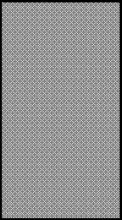
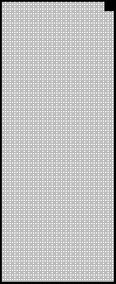

2019 CHINESE GRAND PRIX

11 - 14 April 2019

From The FIA Formula One Race Director Document 19

To All Teams, All Officials Date 13 April 2019

Time 13:42

Title Post Qualifying Interviews

Description Post Qualifying Interviews

Enclosed 2019 Chinese F1 Grand Prix - Race Directors Note Post Qualifying Interviews Doc 19.pdf

Michael Masi

The FIA Formula One Race Director

2019 CHINESE GRAND PRIX

11 – 14 April 2019

From The FIA Formula 1 Race Director Document 19

To All Officials, All Teams Date 13 April 2019

Time 13:45

NOTE TO TEAMS

The Post-qualifying interview procedure will basically remain as in the previous race with the top three drivers again being interviewed as soon as they get out of their cars on the track.

Should either of your drivers be among the top three at the end of qualifying we would like to ask for your co-operation in following the procedure below:

• If they take the chequered flag at the end of Q3, the fastest three drivers should go to the main straight where the 1, 2, 3 boards which will be located in the vicinity of grid position 12.

• Other than the team mechanics (with cooling fans if necessary), officials and accredited television crews and photographers, no one else will be allowed on the designated area at this time (no driver physios nor team PR personnel).

• Once out of their cars the interviews will take place in this designated area. The interviewer will be Martin Brundle.

• If one of the top three drivers is in the pit lane at the end of the session the team should ensure that he goes directly to the designated area once the other drivers have arrived there.

• At the end of the live interviews the drivers will walk through the pit wall door towards the parc fermé and then be led to the backdrop, located outside garage B, for the AfRS photo opportunity.

• Mechanics will be authorised to remove the cars from the grid only after the interviews are completed and must push these cars directly to the parc fermé.

• The pole position driver should then remain in front of the AfRS backdrop to receive the Pirelli Pole Position Award from the FIA President, Jean Todt. These three drivers will be weighed by the FIA next to the AfRS backdrop. o • The drivers will then be escorted by the FIA Press Delegate upstairs to the press conference room located in the Pit building.

• At the end of the press conference, the top three drivers should go to the TV pen and they may be accompanied by their press officers.

• NB: Drivers eliminated in Q1 and Q2, drivers classified from 4th to 10th in Q3 and drivers who did not participate to Q1 but are eligible to race must also attend the TV pen interview session after they have been weighed at the end of the last part of qualifying which they participated.

Please see the attached Qualifying - Parc Fermé Diagram.

Michael Masi FIA Formula One Race Director

gniyfilauQ

9102

lirpA - emreF tup RETFA s’rehpargotohp ot 21– 1 devom noisreV eb llaw craP ot ssorca tip ecneF evah

s’rehpargotohP aera

gnitiaw

xirP

dnarG

esenihC e c n e namaremaC F FR VT muidoP 9102 srevird s’rehpargotohP

dr 3 dn 2 ts 1

ecneF

namaremaC FR VT

21

noitisop

dirG dr dn 3 2 ts 1
