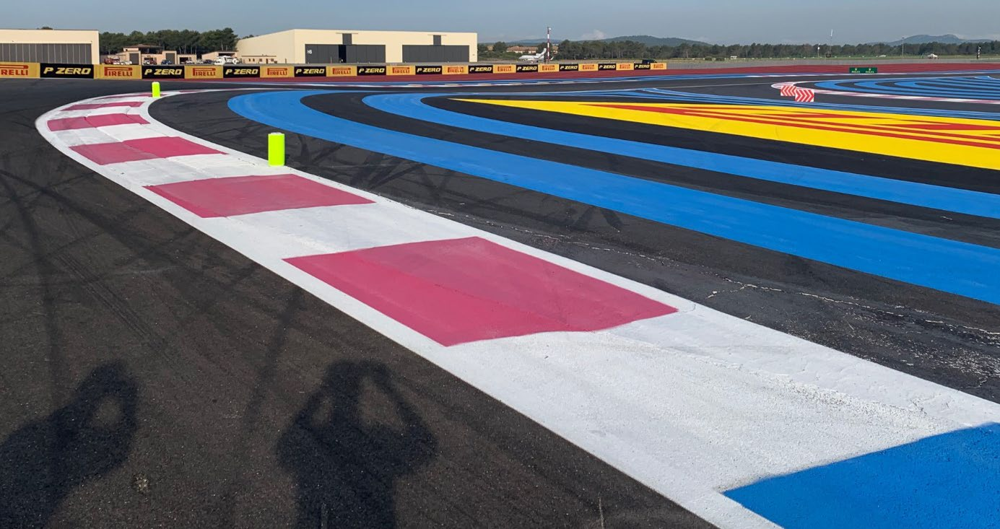
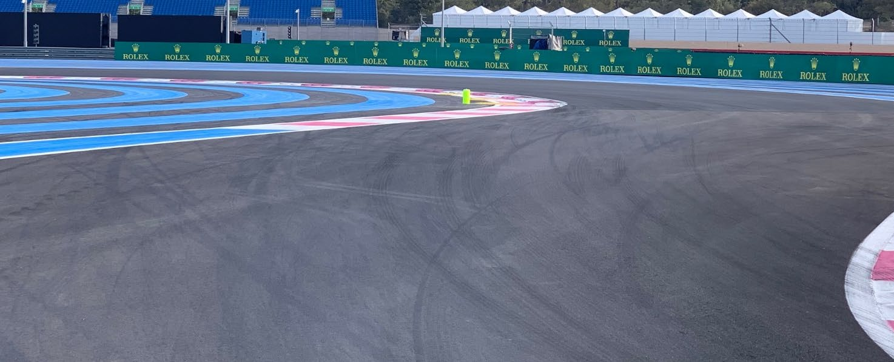
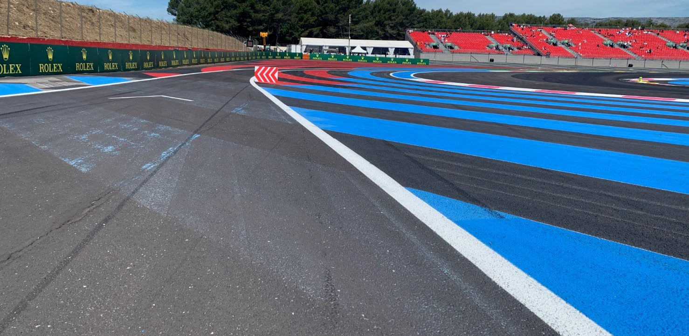
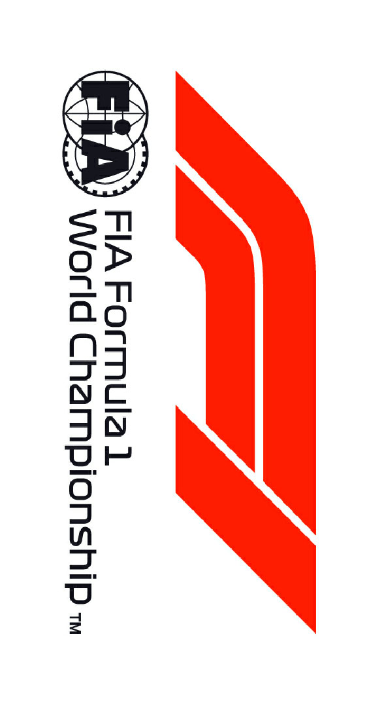

2019 FRENCH GRAND PRIX

20 - 23 June 2019

From The FIA Formula One Race Director Document 39

To All Teams, All Officials Date 23 June 2019

Time 11:21

Title Race Directors' Event Notes Version 3

Description Event Notes Version 3

Enclosed 2019 French F1 Grand Prix - Race Directors Notes Version 3 Doc 39.pdf

Michael Masi

The FIA Formula One Race Director

2019 FRENCH GRAND PRIX

20 – 23 June 2019

From The FIA Formula One Race Director Document 39

To All Officials, All Teams Date 23 June 2019

Time 11.20

EVENT NOTES VERSION 3

1) Matters arising from the Canadian Grand Prix

2) Changes to the circuit

2.1 The Pit Entry has been reconfigured, resurfaced and is now on the right side at Turn 14.

2.2 The SC1 line has been moved as a result of the Pit Entry being reconfigured.

2.3 The Pit Exit has been reconfigured, widened and extended towards Turn 1.

2.4 The track has been resurfaced at Turn 1, Turn 3 through to Turn 7, small section at Turn 8.5, Turns 8 and 9, Turn 9.5 through to Turn 11.5, Turn 12, Turn 14 through to 15.

3) Pit lane map

3.1 Safety Car lines.

3.2 The location of the pit entry and the pit exit.

3.3 Designated garage areas.

3.4 Safety Car position for first lap and rest of race.

3.5 Blue flag marshal at the pit exit.

3.6 Track light panel displaying pit entry status.

4) Pirelli Event Preview

4.1 With reference to Article 24.4(a) of the Sporting Regulations see the attached updated document provided by the official tyre supplier.

5) Weighing and weighing platform

5.1 The FIA weighing platform will be available for teams to use at the following times, however, no more than 10 team personnel may be present during any visit. Each visit should last no more than 10 minutes unless no other team is waiting in the pit lane:

a) From 15:00 on Thursday until 10:00 on Friday.

b) From 11:30 on Friday until 14:30 on Saturday (between 13:00 and 14:30 each visit will be restricted to five minutes).

c) From when the cars are returned to the teams after qualifying until 19:30 on Saturday.

d) From 10:00 until 11:00 and 13:00 until 14:30 on Sunday.

1/5

Any team found to be abusing the time limits set out above, which we will be enforced by FIA security personnel and our own CCTV, will not be permitted to use the weighbridge again during the Event.

6) Red zones for photographers in the pit lane during practice sessions

6.1 See the attached drawing.

7) Pit Lane Speed Limit

For safety reasons, the Pit lane Speed limit detailed in Article 22.10 of the 2019 Formula One Sporting Regulations is hereby amended to 60km/h for the duration of the Event.

8) Practice starts

8.1 Practice starts may only be carried out after the pit exit on the right hand side (in the slow lane of the second part of the pit lane) and, for the avoidance of doubt, this includes any time the pit exit is open for the race.

8.2 For reasons of safety and sporting equity, cars may not stop in the fast lane at any time the pit exit is open without a justifiable reason (a practice start is not considered a justifiable reason).

9) Lines or bollards at the Pit Entry and Pit Exit

9.1 In accordance with Chapter 4 (Section 5) of Appendix L to the ISC drivers must keep to the right of the solid white line at the pit exit when leaving the pits. No part of any car leaving the pits may cross this line.

9.2 For safety reasons, drivers must keep to the right of the bollard at the pit entry.

10) Cutting the Chicanes

10.1 Turns 1 and 2 Any driver who fails to negotiate Turn 2 by using the track, and who passes completely to the right of the first fluorescent yellow bollard on the apex of the corner, must keep completely to the right of the fluorescent yellow bollard and re-join the track by driving through the two arrays of blocks in the run off by passing to the right of the first and to the left of the second. See Image below.

10.2 Turns 3 to 5 Any driver who fails to negotiate Turn 4 by using the track, and who passes completely to the left of the fluorescent yellow bollard on the apex of the corner, must keep completely to the left of the fluorescent yellow bollard and re-join the track by driving to the left of two the block in the run off prior to Turn 5. See Images below.

2/5

10.3 Turns 8 and 9 Any driver going straight on at turn 8 must re-join the track by driving through the four arrays of blocks in the escape road, to the left of the first, to the right of the second, to the left of the third and to the right of the fourth.

10.4 The above requirements will not automatically apply during any Free Practice Session and Qualifying Practice session, each such case will be judged individually.

10.5 The above requirements will not automatically apply to any driver who is judged to have been forced off the track, each such case will be judged individually.

10.6 In all cases detailed above, the driver must only re-join the track when it is safe to do so and without gaining a lasting advantage.

11) Observing yellow flags during free practice and qualifying

11.1 Double waved: Any driver passing through a double waved yellow marshalling sector must reduce speed significantly and be prepared to change direction or stop. In order for the stewards to be satisfied that any such driver has complied with these requirements it must be clear that he has not attempted to set a meaningful lap time, for practical purposes this means the driver should abandon the lap (this does not necessarily mean he has to pit as the track could well be clear the following lap).

11.2 Single waved: Drivers should reduce their speed and be prepared to change direction. It must be clear that a driver has reduced speed and, in order for this to be clear, a driver would be expected to have braked earlier and/or discernibly reduced speed in the relevant marshalling sector.

3/5

Drivers should not overtake any car in a single waved yellow marshalling sector unless it is clear that a car is slowing with a completely obvious problem, e.g. obvious accident damage or a deflated tyre.

12) Track light panels

12.1 The FIA track light panels have been installed in the positions shown on the circuit map. In accordance with Appendix H to the ISC the light signals have the same meaning as flag signals.

13) Drivers leaving their pit stop position in the pit lane

13.1 For safety reasons, no car should be driven from its pit stop position at any time unless:

a) It has first been driven into the pit stop position having just entered the pit lane from the track, and;

b) It is then driven immediately back onto the track from the pit stop position.

14) Fire extinguishers around the circuit

14.1 Indicated by small red boards with a white letter “F”.

15) Places to remove cars from the track

15.1 Indicated by fluorescent orange panels on the walls or guardrails.

16) Support races and Pit Walks

16.1 Team barrier placement prior to and during all support race practice sessions and races: On the white line approximately two metres from the garages.

16.2 It is not permitted to push cars to the weighing area at any time a support category is in pit lane.

17) In laps during qualifying and reconnaissance laps

17.1 In order to ensure that cars are not driven unnecessarily slowly on in laps during and after the end of qualifying or during reconnaissance laps when the pit exit is opened for the race, drivers must stay below the maximum time set by the FIA between the Safety Car lines shown on the pit lane map.

You will be informed of the maximum time after the first day of practice.

18) Post qualifying parc fermé

18.1 The cameras should be installed and operated in the same way as usual.

19) Operational personnel curfew

19.1 Boards warning anyone attempting to enter the paddock that the curfew is in operation will be placed immediately before the turnstiles at the appropriate times.

20) Removing cars from the grid

20.1 Two gates in the pit wall, the first is in front of pole position and the second adjacent to grid position 16.

21) Car number light panels for the start

21.1 On the right hand side of the grid.

22) Track light panel displaying pit entry status

22.1 The light panel indicated on the pit lane map will display flashing yellow arrows if cars are required to use the pit lane once the Safety Car has been deployed during the race.

22.2 The light panel indicated on the pit lane map will display flashing red crosses if the pit lane is closed at any point during the race.

4/5

23) Lapping during the race

23.1 The ISC requires drivers who are caught by another car about to lap him to allow the faster driver past at the first available opportunity. The F1 Marshalling System has been developed in order to ensure that the point at which a driver is shown blue flags is consistent, rather than trusting the ability of marshals to identify situations that require blue flags.

As it was at the end of last season the system will be set to give a pre-warning when the faster car is within 3.0s of the car about to be lapped, this should be used by the team of the slower car to warn their driver he is soon going to be lapped and that allowing the faster car through should be considered a priority. When the faster car is within 1.2s of the car about to be lapped blue flags will be shown to the slower car (in addition to blue light panels, blue cockpit lights and a message on the timing monitors) and the driver must allow the following driver to overtake at the first available opportunity.

It should be noted that the aim of using F1MS is ensure consistent application of the rules, additional instructions may also be given by race control when necessary.

24) Post race parc fermé

24.1 All cars must enter the pit lane and with the exception of the first three cars, should be driven directly to the weighing area.

24.2 The first three cars should be driven down the pit lane and stop under the Podium.

25) Any other business

Michael Masi FIA Formula One Race Director

5/5

|  |  | Grand Prix of France 21-23/06/2019 (19R08PRC) |  |  |  |  |  |  |  |  |  |  |  |  |  |  |  |  |  |  |  |  |  |  |
| --- | --- | --- | --- | --- | --- | --- | --- | --- | --- | --- | --- | --- | --- | --- | --- | --- | --- | --- | --- | --- | --- | --- | --- | --- |
|  |  | Compound |  |  | FL | FR | RL |  | RR |  |  |  |  |  |  | Ma |  |  |  |  |  |  |  | ndatory race tyres |
|  |  | C2 |  |  | 2A1 | 2A2 | 2A3 |  | 2A4 |  |  |  |  |  |  |  |  |  |  |  |  |  |  | C2 |
|  |  | C3 |  |  | 3B1 | 3B2 | 3B3 |  | 3B4 |  |  |  |  |  |  |  |  |  |  |  |  |  |  | C3 |
|  |  | C4 |  |  | 4C1 | 4C2 | 4C3 |  | 4C4 |  |  |  |  |  |  |  |  |  |  |  |  |  |  |  |
|  |  | INTERMEDIATE |  |  | 33G | 35G | 37G |  | 39G |  |  |  |  |  |  |  |  |  |  |  |  |  |  | Q3 tyre |
|  |  | WET Cross-Over time MINIMUM STARTING PRESSURE, BLISTERING SENSITIVITY, CAMBER LIMIT |  |  | 34F WET > 119% > INT > 113% > DRY | 36F Front (psi) | 37F |  | 39F |  |  |  |  |  | Rear (psi) |  |  |  |  |  |  |  |  | C4 |
|  |  |  | Slicks |  |  | 23.0 |  |  |  |  |  |  |  |  |  | 20.0 |  |  |  |  |  |  |  |  |
|  |  |  | Intermediate |  |  | 22.0 |  |  |  |  |  |  |  |  |  | 21.0 |  |  |  |  |  |  |  |  |
|  |  |  | Wet |  |  | 21.0 |  |  |  |  |  |  |  |  |  | 20.0 |  |  |  |  |  |  |  |  |
| FE EOS Camber limit RE EOS Camber limit -3.50 ° -2.00 ° FE Blistering RE Blistering sensitivity sensitivity Medium Low |  | TYRE HEATING STRATEGY (TREAD&SIDEWALL) |  |  |  |  |  |  |  |  |  |  |  |  |  |  |  |  |  |  |  |  |  |  |
| Temperature 0 40 60 80 100 (°C) |  |  |  |  |  |  |  |  |  |  |  |  |  |  |  |  |  |  |  |  |  |  |  |  |
|  |  |  |  | Slicks (front axle) |  | storage |  |  |  |  |  |  |  |  |  |  | m | a | x | . | 3 | h | ma | x. 2h (max. temp = 100°C) |
|  |  |  |  | Slicks (rear axle) |  | storage |  |  |  |  |  |  |  |  |  |  | m | a | x | . | 5 | h |  | (max. temp = 80°C) |
|  |  |  |  | Intermediate |  | storage |  |  |  | m | ax | . | 2 | h |  |  | m | a | x | . | 3 | 0' |  | (max. temp = 80°C) |
|  |  |  |  | Wet |  | storage |  |  |  | m | ax | . | 2 | h |  |  |  |  |  |  |  |  |  | (max. temp = 60°C) |
| (The time limits refer to the period leading up to the start of the session in which the tyres are intended for use). (The temperatures referred to above apply at all times during the event). GENERAL NOTES Teams are kindly reminded that the following parameters will be subjected to FIA checks during the event: - Starting pressure. - Camber at maximum speed. - Maximum blanket temperature. - Tyre swapping. | Tyre Notes |  |  |  |  |  |  |  |  |  |  |  |  |  |  |  |  |  |  |  |  |  |  |  |
| ●Not permitted to switch tyres from their originally allocated position. ●All temperature limits apply to the actual tyre surface temperature, measured with the IR gun detailed in TD029-15. ●Do not subject tyres to large deformation or heavy impact. ●STORAGE temperature is the recommended temperature the tyre can stay in ●Do not leave fitted tyres exposed at an air temperature lower than 15°C blankets without time limit. and/or any UV emission. ●BLANKET HEATING TIME for each temperature range to be counted from the ● Revised prescriptions could be issued during the race weekend in moment the blanket control unit is set to reach its targeted temperature within accordance with TD/007-16. its correspondent interval. | ●Not permitted to switch tyres from their originally allocated position. ●Do not subject tyres to large deformation or heavy impact. ●Do not leave fitted tyres exposed at an air temperature lower than 15°C and/or any UV emission. ● Revised prescriptions could be issued during the race weekend in accordance with TD/007-16. |  |  |  |  |  |  | ●All temperature limits apply to the actual tyre surface temperature, measured with the IR gun detailed in TD029-15. ●STORAGE temperature is the recommended temperature the tyre can stay in blankets without time limit. ●BLANKET HEATING TIME for each temperature range to be counted from the moment the blanket control unit is set to reach its targeted temperature within its correspondent interval. |  |  |  |  |  |  |  |  |  |  |  |  |  |  |  |  |

enaL RAC dralloB yrtnE sutatS slenap paL 9102 YTEFAS tsriF CT tiP enuJ tiP X 02 – 1 1 noisreV

|  | detangiseD egaraG saerA | ENAL TSAF ENAL TSAF |
| --- | --- | --- |
| AIF |  |  |
| 1F | sedecreM |  |
| sedecreM | irarreF |  |
| irarreF | lluB deR |  |
| lluB deR |  |  |
| tluaneR | tluaneR |  |
| saaH | saaH neraLcM |  |
| neraLcM | tnioP gnicaR |  |
| tnioP gnicaR | oemoR aflA |  |
| oemoR aflA |  |  |
| ossoR oroT | ossoR oroT |  |
| smailliW | smailliW |  |
| 1F | potS noitisoP tiP |  |

1 eniL 2

RAC YRTNE YTEFAS

TIP 3

MORF EREH

DEREVOCER DECALP 4

KCART SRAC 5 stratS

ENAL s lennosreP )YLNO e g xirP TIP a 6 r a tratS G 1 maeT F ecaR( dnarG

hcnerF

7 lacideM ertneC

9102

8

sdnE

ENAL 9

TIP RAC

YTEFAS ecaR 01

TIXE noitisoP 11 TIP eloP

21

2 eniL

RAC

YTEFAS

