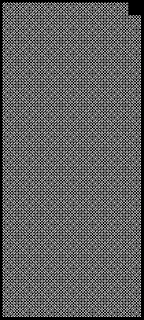
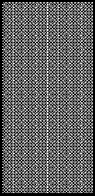

2019 FRENCH GRAND PRIX

20 - 23 June 2019

From The FIA Formula One Race Director Document 24

To All Teams, All Officials Date 22 June 2019

Time 13:05

Title Race Directors Note - Post Qualifying Interviews

Description Post Qualifying Interviews

Enclosed 2019 French F1 Grand Prix Post Qualifying Interviews Doc 24.pdf

Michael Masi

The FIA Formula One Race Director

2019 FRENCH GRAND PRIX

20 – 23 June 2019

From The FIA Formula One Race Director Document 24

To All Officials, All Teams Date 22 June 2019

Time 13:05

NOTE TO TEAMS

The Post-qualifying interview procedure will basically remain as in the previous race with the top three drivers again being interviewed as soon as they get out of their cars on the track.

Should either of your drivers be among the top three at the end of qualifying we would like to ask for your co-operation in following the procedure below:

• If they take the chequered flag at the end of Q3, the fastest three drivers should stay on the track and procced directly to the pit straight where the 1, 2, 3 boards which will be located below the Pirelli P Zero Bridge in the vicinity of grid position 14.

• Other than the team mechanics (with cooling fans if necessary), officials and accredited television crews and photographers, no one else will be allowed in the designated area at this time (no driver physios nor team PR personnel).

• Once out of their cars the interviews will take place in this designated area. The interviewer will be Paul di Resta.

• If one of the top three drivers is already in the pit lane at the end of the session, the team should ensure that he goes directly to the designated area once the other drivers have arrived there.

• At the end of the live interviews the drivers will walk back into Pit Lane towards the Pit Building and then be led to the backdrop located below the Podium for the AfRS photo opportunity.

• Mechanics will be authorised to remove the cars from the grid only after the interviews are completed and must push these cars directly to the parc fermé.

• The pole position driver should then remain in front of the AfRS backdrop to receive the Pirelli Pole Position Award from the Pirelli Representative, former Formula 1 driver Jean Alesi. These three drivers will be weighed by the FIA next to the AfRS backdrop. o • The drivers will then be escorted by the FIA Press Delegate through the Pit Building and proceed to the 2nd floor, where the press conference room is located.

• At the end of the press conference, the top three drivers will go downstairs to the TV pen, located between the FIA and Mercedes-Benz hospitalities in the Paddock and they may be accompanied by their press officers.

• NB: Drivers eliminated in Q1 and Q2, drivers classified from 4th to 10th in Q3 and drivers who did not participate to Q1 but are eligible to race must also attend the TV pen interview session after they have been weighed by the FIA at the end of the last part of qualifying in which they participated.

Please see the attached Qualifying - Parc Fermé Diagram.

Michael Masi FIA Formula One Race Director

gniyfilauQ 9102 dekrap enuJ egarag CT AIF srac 22 – gniniameR AIF 2 noisreV ta - emreF 1F 1 gniyfilauQ

craP sedecreM 2

irarreF 3

llaW lluB deR 4 tiP

tluaneR 5 xirP namaremaC FR VT dnarG saaH 6

hcnerF

srehpargotohP pordkcaB 9102 dn dr 2 3 ts 1 neraLcM 7

tnioP 8 gnicaR llaW

tiP

oemoR 9 aflA

ossoR oroT 01

11 smailliW

s’rehpargotohP aera 21 1F gnitiaw
