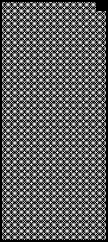
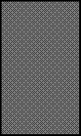

2019 FRENCH GRAND PRIX

20 - 23 June 2019

From The FIA Formula One Race Director Document 40

To All Teams, All Officials Date 23 June 2019

Time 13:05

Title Race Directors Note - Post Race Interviews

Description Post Race Interviews

Enclosed 2019 French F1 Grand Prix Post Race Podium Interviews Doc 40.pdf

Michael Masi

The FIA Formula One Race Director

2019 FRENCH GRAND PRIX

20 – 23 June 2019

From The FIA Formula One Race Director Document 40

To All Officials, All Teams Date 23 June 2019

Time 13:05

NOTE TO TEAMS

In addition to the provisions of the 2019 Formula One Sporting Regulations – Appendix 3 Podium Ceremony, the

procedure must be followed.

The post-race interview procedure will remain as in the previous race with the top three drivers again being

interviewed as soon as they get out of their cars.

We would like to ask for your co-operation in following the simple procedure set out below:

• Drivers who finish the race in the top three positions will be required to enter pit lane and proceed down pit

lane directly to the 1,2,3 boards which will be located below the podium.

• Once out of their cars, the interviews will take place in this designated area. The interviewer will be Martin

Brundle.

• Drivers must not interfere with parc fermé protocols in any way.

• At the end of the live interviews, the drivers will be escorted by the FIA Press Delegate through the Pit Building

and proceed to the 1st floor, where the cool down room and the podium are located.

• These drivers will be weighed by the FIA in the cool down room before the podium ceremony.

• At the end of podium ceremony, the top three drivers will go downstairs to the TV pen, located between the

FIA and Mercedes-Benz hospitalities in the Paddock and they may be accompanied by their press officers.

• After the TV pen interviews, the top three drivers will return to the 2nd floor of the Pit Building for the FIA

Press Conference.

• Drivers classified from 4th and beyond must proceed directly to the TV pen immediately after they have been

weighed in the parc fermé, located in the FIA garage.

• Drivers who retired during the race are requested to go to the TV pen as soon as they have come back into

the paddock.

Please see the attached Post Race Parc Fermé Diagram.

Michael Masi FIA Formula One Race Director

ecaR dekrap 9102 egarag enuJ srac - 12 emreF gniniameR AIF – 2 ta noisreV

|  | AIF 1F sedecreM irarreF lluB deR tluaneR saaH |
| --- | --- |
| muidoP | neraLcM tnioP gnicaR oemoR aflA ossoR oroT smailliW s’rehpargotohP aera 1F gnitiaw |

ecaR craP

llaW

tiP

xirP

dnarG

dnaB

hcnerF

srehpargotohP )rewoT(

dn dr 2 3 9102 ts 1

namaremaC FR VT

llaW

tiP
