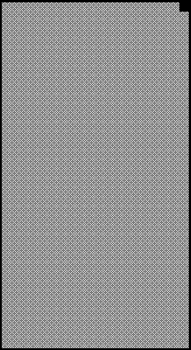
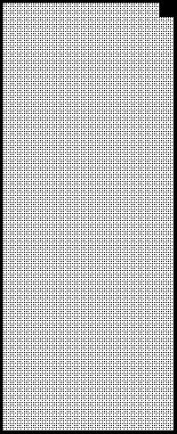
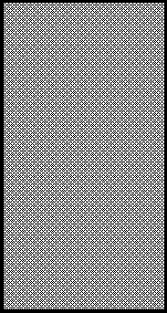

2019 GERMAN GRAND PRIX

25 - 28 July 2019

From The FIA Formula One Race Director Document 43

To All Teams, All Officials Date 28 July 2019

Time 12:28

Title Race Directors Note - Post Race Interviews

Description Post Race Interviews

Enclosed 2019 German Grand Prix - Race Directors Note - Post Race Interview Procedures DOC 43.pdf

Michael Masi

The FIA Formula One Race Director

2019 GERMAN GRAND PRIX

25 – 28 July 2019

From The FIA Formula One Race Director Document 43

To All Officials, All Teams Date 28 July 2019

Time 12:25

NOTE TO TEAMS

In addition to the provisions of the 2019 Formula One Sporting Regulations – Appendix 3 Podium Ceremony, the

procedure must be followed.

The post-race interview procedure will remain as in the previous race with the top three drivers again being

interviewed as soon as they get out of their cars.

We would like to ask for your co-operation in following the simple procedure set out below:

• Drivers who finish the race in the top three positions will be required to enter pit lane and proceed directly

to the 1,2,3 boards which will be located under the Podium.

• Once out of their cars, the interviews will take place in this designated area. The interviewer will be Martin

Brundle.

• Drivers must not interfere with parc fermé protocols in any way.

• At the end of the live interviews, the drivers will be escorted by the FIA Press Delegate behind the podium,

where the cool down area is located.

• These drivers will be weighed by the FIA in the cool down area before the podium ceremony.

• At the end of podium ceremony, the top three drivers will go downstairs to the TV pen, located between the

FIA and F1 Motorhomes at the Pit Entry end of the Paddock and they may be accompanied by their press

officers.

• After the TV pen interviews, the top three drivers will transported by shuttle to the FIA Press Conference

located on the 4th floor of the Baden-Württemberg Centre.

• Parc fermé for all finishers outside of the top three will be located at the Pit Entry on the drivers’ right-hand

side.

• Drivers classified from 4th and beyond must proceed directly to the TV pen immediately after they have been

weighed in the parc fermé, located in the FIA garage.

• Drivers who retired during the race are requested to go to the TV pen as soon as they have come back into

the paddock.

• NOTE: In the event of inclement weather, the TV pen will be covered, so there will be no change in

procedure.

Please see the attached Post Race Parc Fermé Diagram.

Michael Masi FIA Formula One Race Director

ecaR

- emreF 9102

yluJ 62– craP 1 noisreV

egaraG AIF

srehsinif

ereh

gniniameR dekrap

xirP lortnoC rewoT

dnarG

namreG

9102

ecneF

srehpargotohP muidoP

dn dr 3 2 ts 1 namaremaC FR srehpargotohP VT aera ecneF gnitiaw

ytiruceS
