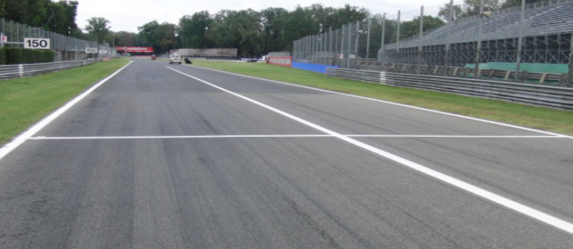

2019 ITALIAN GRAND PRIX

5 - 8 September 2019

From The FIA Formula One Race Director Document 16

To All Teams, All Officials Date 06 September 2019

Time 20:11

Title Race Directors' Event Notes Version 3

Description Event Notes Version 3

Enclosed 2019 Italian F1 Grand Prix - Race Director Notes Doc 16.pdf

Michael Masi

The FIA Formula One Race Director

2019 ITALIAN GRAND PRIX

5 – 8 September 2019

From The FIA Formula One Race Director Document 16

To All Officials, All Teams Date 5 September 2019

Time 20:10

EVENT NOTES VERSION 3

1) Matters arising from the Belgian Grand Prix

2) Changes to the circuit

2.1 The guardrail barrier on the right-hand side of the pit exit road has been replaced with a concrete wall.

2.2 An additional row of directional arrows has been placed in the run-off between Turn 1 and Turn 2.

2.3 Turn 4 and Turn 5 have been resurfaced similar to the original specification.

2.4 The exit kerb at Turn 5 has been replaced with one of similar specification.

2.5 The SC2 line has moved approximately 30m closer to the Pit Exit.

3) Pit lane map

3.1 Safety Car lines.

3.2 The location of the pit entry and the pit exit.

3.3 Designated garage areas.

3.4 Safety Car position for first lap and rest of race.

3.5 Blue flag marshal at the pit exit.

3.6 Track light panels displaying pit entry status.

4) Pirelli Event Preview

4.1 With reference to Article 24.4(a) of the Sporting Regulations see the attached document provided by the official tyre supplier.

5) Weighing and weighing platform

5.1 The FIA weighing platform will be available for teams to use at the following times, however, no more than 10 team personnel may be present during any visit. Each visit should last no more than 10 minutes unless no other team is waiting in the pit lane:

a) From 13:00 on Thursday until 10:00 on Friday.

b) From 11:30 on Friday until 14:30 on Saturday (between 13:00 and 14:30 each visit will be restricted to five minutes).

c) From when the cars are returned to the teams after qualifying until 19:30 on Saturday.

1/4

d) From 10:00 until 11:00 and 13:00 until 14:30 on Sunday.

Any team found to be abusing the time limits set out above, which we will be enforced by FIA security personnel and our own CCTV, will not be permitted to use the weighbridge again during the Event.

6) Red zones for photographers in the pit lane during practice sessions

6.1 See the attached drawing.

7) Practice starts

7.1 During each practice session, practice starts may only be carried out on the right-hand side after the end of the Pit wall but before the first dotted white line across the pit exit. Drivers wishing to carry out a practice start should stop on the right in order to allow other cars to pass on their left.

7.2 During the time the pit exit is open for the race, practice starts may be carried out after the end of the pit wall but before the second dotted white line across the pit exit. Drivers wishing to carry out a start should stop on the right in order to allow other cars to pass on their left.

7.3 During these times any driver passing a car which has stopped to carry out a practice start may cross the white line that is referred to in 8.1 below. Any driver crossing this line must move back to the right of it as quickly as possible.

7.4 For reasons of safety and sporting equity, cars may not stop in the fast lane of the pits at any time the pit exit is open without a justifiable reason (a practice start is not considered a justifiable reason).

8) Lines or bollards at the Pit Entry and Pit Exit

8.1 In accordance with Chapter 4 (Section 5) of Appendix L to the ISC drivers must keep to the right of the solid white line at the pit exit when leaving the pits. No part of any car leaving the pits may cross this line other than in the case detailed in 6.1 and 6.2 above.

8.2 For safety reasons drivers must keep to the right of the bollard at the pit entry when they are entering the pits.

8.3 Except in the cases of force majeure (accepted as such by the Stewards), the crossing, in any direction, of the green painted area separating the pit entry and the track by a driver who, in the opinion of the Stewards, had committed to entering the pit lane is prohibited.

8.4 The dotted white line across the pit exit is the track edge.

9) Observing yellow flags during free practice and qualifying

9.1 Double waved: Any driver passing through a double waved yellow marshalling sector must reduce speed significantly and be prepared to change direction or stop. In order for the stewards to be satisfied that any such driver has complied with these requirements it must be clear that he has not attempted to set a meaningful lap time, for practical purposes this means the driver should abandon the lap (this does not necessarily mean he has to pit as the track could well be clear the following lap).

9.2 Single waved: Drivers should reduce their speed and be prepared to change direction. It must be clear that a driver has reduced speed and, in order for this to be clear, a driver would be expected to have braked earlier and/or discernibly reduced speed in the relevant marshalling sector.

Drivers should not overtake any car in a single waved yellow marshalling sector unless it is clear that a car is slowing with a completely obvious problem, e.g. obvious accident damage or a deflated tyre.

10) Track light panels

10.1 The FIA track light panels have been installed in the positions shown on the circuit map. In accordance with Appendix H to the ISC the light signals have the same meaning as flag signals.

2/4

11) Track Limits

11.1 Turn 1-2

a) Four rows of polystyrene blocks have been placed in the escape road at Turn 1 / Turn 2 (first chicane). In order to ensure that cars are able to re-join the track safely any driver using the escape road must go around the end of each of these rows and re-join the track at the end of the escape road. Drivers may only use the grass if it is clearly unavoidable.

11.2 Turn 4-5

a) Any driver going straight and who misses the black and yellow bumps placed before the apex kerb of Turn 5 (second chicane) must stay to the right of the yellow line and the bollard, he may then re-join the track at the far end of the asphalt run-off area after the exit of Turn 5.

11.3 In all cases detailed in 10.1.and 10.2 above, the driver must only re-join the track when it is safe to do so and without gaining a lasting advantage.

11.4 Turn 11

a) A lap time achieved during any practice session or the race by leaving the track (all four wheels over the white track edge line) on the outside of Turn 11 will result in that lap time and the immediately following lap time being invalidated by the stewards.

b) Teams will be informed of any such breach on the official messaging system.

12) Drivers leaving their pit stop position in the pit lane

12.1 For safety reasons, no car should be driven from its pit stop position at any time unless:

a) It has first been driven into the pit stop position having just entered the pit lane from the track, and;

b) It is then driven immediately back onto the track from the pit stop position.

13) Fire extinguishers around the circuit

13.1 Indicated by small white boards with a red letter "F".

14) Places to remove cars from the track

14.1 Indicated by fluorescent orange panels on the walls or guardrails.

15) Support races team barrier placement

15.1 Team barrier placement prior to and during all support category practice sessions and races: No more than three metres from the garages.

15.2 It is not permitted to push cars to the weighing area at any time a support category is in pit lane.

16) In laps during qualifying and reconnaissance laps

16.1 In order to ensure that cars are not driven unnecessarily slowly on in laps during and after the end of qualifying or during reconnaissance laps when the pit exit is opened for the race, drivers must stay below the maximum time set by the FIA between the Safety Car lines shown on the pit lane map.

You will be informed of the maximum time after the first day of practice.

17) Post qualifying parc fermé

17.1 The cameras should be installed and operated in the same way as usual.

18) Operational personnel curfew

18.1 Boards warning anyone attempting to enter the paddock that the curfew is in operation will be placed immediately before the turnstiles at the appropriate times.

3/4

19) Removing cars from the grid

19.1 Either through the gate in the pit wall adjacent to grid position 6 or through the Pit Exit.

20) Car number light panels for the start

20.1 On the right-hand side of the grid.

21) Track light panel displaying pit entry status

21.1 The light panels indicated on the pit lane map will display flashing yellow arrows if cars are required to use the pit lane once the Safety Car has been deployed during the race.

21.2 The light panels indicated on the pit lane map will display flashing red crosses if the pit lane is closed at any point during the race.

22) Tyre Blanket Usage during Pit Stops in the Race

22.1 For reasons of safety, tyre blankets are not permitted in the Pit Lane at any time during the race.

23) Lapping during the race

23.1 The ISC requires drivers who are caught by another car about to lap him to allow the faster driver past at the first available opportunity. The F1 Marshalling System has been developed in order to ensure that the point at which a driver is shown blue flags is consistent, rather than trusting the ability of marshals to identify situations that require blue flags.

As it was at the end of last season the system will be set to give a pre-warning when the faster car is within 3.0s of the car about to be lapped, this should be used by the team of the slower car to warn their driver he is soon going to be lapped and that allowing the faster car through should be considered a priority. When the faster car is within 1.2s of the car about to be lapped blue flags will be shown to the slower car (in addition to blue light panels, blue cockpit lights and a message on the timing monitors) and the driver must allow the following driver to overtake at the first available opportunity.

It should be noted that the aim of using F1MS is ensure consistent application of the rules, additional instructions may also be given by race control when necessary.

24) Post race parc fermé

24.1 All cars must enter the pit lane and should proceed directly to the weighing area.

25) Any other business

Michael Masi FIA Formula One Race Director

4/4

|  |  | Grand Prix of Italy 06-08/09/2019 (19R14MZA) |  |  |  |  |  |  |  |  |  |  |  |  |  |  |  |  |  |  |  |  |  |  |
| --- | --- | --- | --- | --- | --- | --- | --- | --- | --- | --- | --- | --- | --- | --- | --- | --- | --- | --- | --- | --- | --- | --- | --- | --- |
|  |  | Compound |  |  | FL | FR | RL |  | RR |  |  |  |  |  |  | Ma |  |  |  |  |  |  |  | ndatory race tyres |
|  |  | C2 |  |  | 2A1 | 2A2 | 2A3 |  | 2A4 |  |  |  |  |  |  |  |  |  |  |  |  |  |  | C2 |
|  |  | C3 |  |  | 3B1 | 3B2 | 3B3 |  | 3B4 |  |  |  |  |  |  |  |  |  |  |  |  |  |  | C3 |
|  |  | C4 |  |  | 4C1 | 4C2 | 4C3 |  | 4C4 |  |  |  |  |  |  |  |  |  |  |  |  |  |  |  |
|  |  | INTERMEDIATE |  |  | 33G | 35G | 37G |  | 39G |  |  |  |  |  |  |  |  |  |  |  |  |  |  | Q3 tyre |
|  |  | WET Cross-Over time MINIMUM STARTING PRESSURE, BLISTERING SENSITIVITY, CAMBER LIMIT |  |  | 34F WET > 119% > INT > 113% > DRY | 36F Front (psi) | 37F |  | 39F |  |  |  |  |  | Rear (psi) |  |  |  |  |  |  |  |  | C4 |
|  |  |  | Slicks |  |  | 23.5 |  |  |  |  |  |  |  |  |  | 21.0 |  |  |  |  |  |  |  |  |
|  |  |  | Intermediate |  |  | 21.5 |  |  |  |  |  |  |  |  |  | 21.0 |  |  |  |  |  |  |  |  |
|  |  |  | Wet |  |  | 20.5 |  |  |  |  |  |  |  |  |  | 20.0 |  |  |  |  |  |  |  |  |
| FE EOS Camber limit RE EOS Camber limit -3.00 ° -2.00 ° FE Blistering RE Blistering sensitivity sensitivity Low Medium |  | TYRE HEATING STRATEGY (TREAD&SIDEWALL) |  |  |  |  |  |  |  |  |  |  |  |  |  |  |  |  |  |  |  |  |  |  |
| Temperature 0 40 60 80 100 (°C) |  |  |  |  |  |  |  |  |  |  |  |  |  |  |  |  |  |  |  |  |  |  |  |  |
|  |  |  |  | Slicks (front axle) |  | storage |  |  |  |  |  |  |  |  |  |  | m | a | x | . | 3 | h | ma | x. 2h (max. temp = 100°C) |
|  |  |  |  | Slicks (rear axle) |  | storage |  |  |  |  |  |  |  |  |  |  | m | a | x | . | 5 | h |  | (max. temp = 80°C) |
|  |  |  |  | Intermediate |  | storage |  |  |  | m | ax | . | 2 | h |  |  | m | a | x | . | 3 | 0' |  | (max. temp = 80°C) |
|  |  |  |  | Wet |  | storage |  |  |  | m | ax | . | 2 | h |  |  |  |  |  |  |  |  |  | (max. temp = 60°C) |
| (The time limits refer to the period leading up to the start of the session in which the tyres are intended for use). (The temperatures referred to above apply at all times during the event). GENERAL NOTES Teams are kindly reminded that the following parameters will be subjected to FIA checks during the event: - Starting pressure. - Camber at maximum speed. - Maximum blanket temperature. - Tyre swapping. | Tyre Notes |  |  |  |  |  |  |  |  |  |  |  |  |  |  |  |  |  |  |  |  |  |  |  |
| ●Not permitted to switch tyres from their originally allocated position. ●All temperature limits apply to the actual tyre surface temperature, measured with the IR gun detailed in TD029-15. ●Do not subject tyres to large deformation or heavy impact. ●STORAGE temperature is the recommended temperature the tyre can stay in ●Do not leave fitted tyres exposed at an air temperature lower than 15°C blankets without time limit. and/or any UV emission. ●BLANKET HEATING TIME for each temperature range to be counted from the ● Revised prescriptions could be issued during the race weekend in moment the blanket control unit is set to reach its targeted temperature within accordance with TD/007-16. its correspondent interval. | ●Not permitted to switch tyres from their originally allocated position. ●Do not subject tyres to large deformation or heavy impact. ●Do not leave fitted tyres exposed at an air temperature lower than 15°C and/or any UV emission. ● Revised prescriptions could be issued during the race weekend in accordance with TD/007-16. |  |  |  |  |  |  | ●All temperature limits apply to the actual tyre surface temperature, measured with the IR gun detailed in TD029-15. ●STORAGE temperature is the recommended temperature the tyre can stay in blankets without time limit. ●BLANKET HEATING TIME for each temperature range to be counted from the moment the blanket control unit is set to reach its targeted temperature within its correspondent interval. |  |  |  |  |  |  |  |  |  |  |  |  |  |  |  |  |

slenap enaL yrtnE X 9102 sutatS tiP tiP eniL rebmetpeS

| 1 | AIF | egaraG saerA detangiseD |  |
| --- | --- | --- | --- |
| 2 | AIF |  | ENAL TSAF ENAL TSAF |
| 3 | AIF |  |  |
| 4 | AIF |  |  |
| 5 | AIF |  |  |
| 6 | 1 alumroF |  |  |
| 7 | 1 alumroF |  |  |
| 8 | sedecreM | sedecreM |  |
| 9 | sedecreM |  |  |
| 01 | sedecreM |  |  |
| 11 | sedecreM |  |  |
| 21 | sedecreM |  |  |
| 31 | irarreF | irarreF |  |
| 41 | irarreF |  |  |
| 51 | irarreF |  |  |
| 61 | irarreF |  |  |
| 71 | irarreF |  |  |
| 81 | lluB deR | lluB deR |  |
| 91 | lluB deR |  |  |
| 02 | lluB deR |  |  |
| 12 | lluB deR |  |  |
| 22 | tluaneR / lluB deR |  |  |
| 32 | tluaneR | tluaneR |  |
| 42 | tluaneR |  |  |
| 52 | tluaneR |  |  |
| 62 | tluaneR |  |  |
| 72 | tluaneR |  |  |
| 82 | yawklaW | saaH |  |
| 92 | saaH |  |  |
| 03 | saaH |  |  |
| 13 | saaH |  |  |
| 23 | saaH |  |  |
| 33 | neraLcM / saaH | neraLcM |  |
| 43 | neraLcM |  |  |
| 53 | neraLcM |  |  |
| 63 | neraLcM |  |  |
| 73 | neraLcM |  |  |
| 83 | neraLcM | tnioP gnicaR |  |
| 93 | tnioP gnicaR |  |  |
| 04 | tnioP gnicaR |  |  |
| 14 | tnioP gnicaR |  |  |
| 24 | tnioP gnicaR |  |  |
| 34 | af;A / tP gnicaR |  |  |
| 44 | oemoR aflA | oemoR aflA |  |
| 54 | oemoR aflA |  |  |
| 64 | oemoR aflA |  |  |
| 74 | oemoR aflA |  |  |
| 84 | ossoR oroT |  |  |
| 94 | ossoR oroT | ossoR oroT |  |
| 05 | ossoR oroT |  |  |
| 15 | ossoR oroT |  |  |
| 25 | ossoR oroT |  |  |
| 35 | smailliW |  |  |
| 45 | smailliW | smailliW |  |
| 55 | smailliW |  |  |
| 65 | smailliW |  |  |
| 75 | smailliW |  |  |
| 85 | spaL toH 1F |  |  |
| 95 | spaL toH 1F |  |  |
| 06 | spaL toH 1F |  |  |

lortnoC X 5– 1 eniL 1 RAC noisreV paL RAC YTEFAS tsriF YTEFAS

yrtnE dralloB

tiP

YRTNE

TIP

stratS

xirP ENAL

TIP dnarG

segaraG

nailatI 1F sdnE

ENAL

9102 TIP

noitisoP

eloP

RAC ecaR YTEFAS

TIXE

TIP

GALF lahsraM EULB

2 eniL

RAC

YTEFAS

