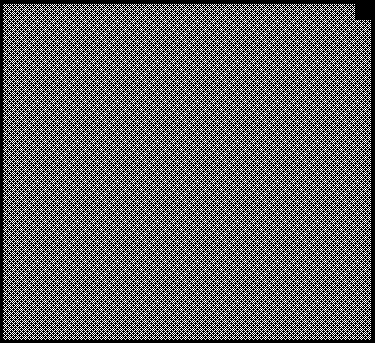
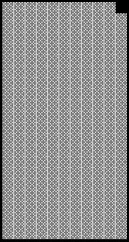
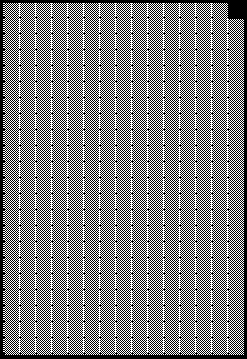

2019 ITALIAN GRAND PRIX

5 - 8 September 2019

From The FIA Formula One Race Director Document 53

To All Teams, All Officials Date 08 September 2019

Time 14:30

Title Race Directors Note - Post Race Interviews

Description Post Race Interviews

Enclosed 2019 Italian F1 Grand Prix - Post Race Interviews Doc 53.pdf

Michael Masi

The FIA Formula One Race Director

2019 ITALIAN GRAND PRIX

5 – 8 September 2019

From The FIA Formula One Race Director Document 53

To All Officials, All Teams Date 8 September 2019

Time 14:30

NOTE TO TEAMS

In addition to the provisions of the 2019 Formula One Sporting Regulations – Appendix 3 Podium Ceremony, the

procedure must be followed.

The post-race interview procedure will remain as in the previous race with the top three drivers again being

interviewed as soon as they get out of their cars.

We would like to ask for your co-operation in following the simple procedure set out below:

• Drivers who finish the race in the top three positions will be required to enter pit lane and proceed directly

to the 1,2,3 boards which will be located outside the FIA Garages.

• Once out of their cars, the interviews will take place in this designated area. The interviewer will be Martin

Brundle.

• Drivers must not interfere with parc fermé protocols in any way.

• At the end of the live interviews, the drivers will be escorted by the FIA Press Delegate to the 1st floor of the

Pit Building, where the cool down area is located.

• These drivers will be weighed by the FIA in the cool down area before the podium ceremony.

• At the end of podium ceremony, the top three drivers will go downstairs to the TV pen, located at the Pit

Entry end of the Paddock between the Mercedes Hospitality and FIA Transporters and they may be

accompanied by their press officers.

• After the TV pen interviews, the top three drivers will be escorted to the FIA Press Conference located on the

1st floor of the Pit Building.

• Parc fermé for all finishers outside of the top three will be located at the Pit Entry behind the top three cars.

• Drivers classified from 4th and beyond must proceed directly to the TV pen immediately after they have been

weighed in the parc fermé, located in the FIA garage.

• Drivers who retired during the race are requested to go to the TV pen as soon as they have come back into

the paddock.

Please see the attached Post Race Parc Fermé Diagram.

Michael Masi FIA Formula One Race Director

ecaR

- 9102 emreF ereh gniniameR rebmetpeS srehsinif eniL

dekrap eciloP craP ytiruceS 7– 1 noisreV

ecneF

tiucriC

llaW

tiP

xirP ecneF tiucriC ecneF

dnarG

srehpargotohP aerA

e nailatI gnitiaW c n e F namaremaC ecneF FR s’rehpargotohP nameriF VT 9102

dn ts dr 2 1 3

ecneF

m Podiu
