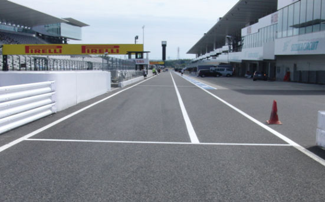
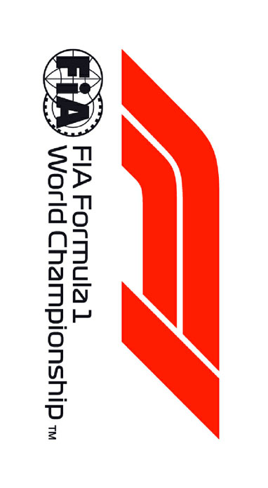

2019 JAPANESE GRAND PRIX

10 - 13 October 2019

From The FIA Formula One Race Director Document 3

To All Teams, All Officials Date 10 October 2019

Time 11:22

Title Race Directors' Event Notes

Description Event Notes

Enclosed 2019 Japanese F1 Grand Prix Race Directors Event Notes Doc 3.pdf

Michael Masi

The FIA Formula One Race Director

2019 JAPANESE GRAND PRIX

10 – 13 October 2019

From The FIA Formula One Race Director Document 3

To All Officials, All Teams Date 10 October 2019

Time 11:20

EVENT NOTES

1) Matters arising from the Russian Grand Prix

2) Changes to the circuit

2.1 The artificial grass on the right-hand side at Turn 15 has been removed and replaced by an FIA/FIM Double kerb, along with improved drainage in this area.

3) Pit lane map

3.1 Safety Car lines.

3.2 The location of the pit entry and the pit exit.

3.3 Designated garage areas.

3.4 Safety Car position for first lap and rest of race.

3.5 Blue flag marshal at the pit exit.

3.6 Track light panels displaying pit entry status.

4) Pirelli Event Preview

4.1 With reference to Article 24.4(a) of the Sporting Regulations see the attached document provided by the official tyre supplier.

5) Weighing and weighing platform

5.1 The FIA weighing platform will be available for teams to use at the following times, however, no more than 10 team personnel may be present during any visit. Each visit should last no more than 10 minutes unless no other team is waiting in the pit lane:

a) From 13:30 on Thursday until 09:00 on Friday.

b) From 10:30 on Friday until 14:30 on Saturday (between 13:00 and 14:30 each visit will be restricted to five minutes).

c) From when the cars are returned to the teams after qualifying until 19:30 on Saturday.

d) From 09:00 until 10:00 and 12:00 until 13:30 on Sunday.

Any team found to be abusing the time limits set out above, which we will be enforced by FIA security personnel and our own CCTV, will not be permitted to use the weighbridge again during the Event.

1/4

6) Red zones for photographers in the pit lane during practice sessions

6.1 See the attached drawing.

7) Practice starts

7.1 During practice sessions:

a) Practice starts may only be carried out on the right-hand side at the pit exit and before the end of the pit signalling wall.

b) Drivers must leave adequate room on their left for another driver to pass.

7.2 During the time the pit exit is open for reconnaissance laps:

a) Practice starts should only be carried out on the track after the pit exit, but before the point at which the grass verge starts after the old medical centre, drivers must leave adequate room on their left for another car to pass.

b) During this time any driver passing a car which has stopped to carry out a practice start may cross the white line that is referred to in 8.1 below. Any driver crossing this line must move back to the right of it as quickly as possible.

7.3 At all times:

a) For reasons of safety and sporting equity, cars may not stop in the fast lane of the pits at any time the pit

exit is open without a justifiable reason (a practice start is not considered a justifiable reason).

8) Lines or bollards at the Pit Entry and Pit Exit

8.1 In accordance with Chapter 4 (Section 5) of Appendix L to the ISC drivers must keep to the right of the solid white line at the pit exit when leaving the pits. No part of any car leaving the pits may cross this line.

8.2 For safety reasons drivers must keep to the right of the bollard at the pit entry when they are entering the pits.

8.3 Except in the cases of force majeure (accepted as such by the Stewards), the crossing by any part of the car, in any direction, of the grass verge between the pit entry and the track, by a driver who, in the opinion of the Stewards, had committed to entering the pit lane is prohibited.

8.4 The dotted white line across the pit exit is the track edge.

9) Observing yellow flags during free practice and qualifying

9.1 Double waved: Any driver passing through a double waved yellow marshalling sector must reduce speed significantly and be prepared to change direction or stop. In order for the stewards to be satisfied that any such driver has complied with these requirements it must be clear that he has not attempted to set a meaningful lap time, for practical purposes this means the driver should abandon the lap (this does not necessarily mean he has to pit as the track could well be clear the following lap).

9.2 Single waved: Drivers should reduce their speed and be prepared to change direction. It must be clear that a driver has reduced speed and, in order for this to be clear, a driver would be expected to have braked earlier and/or discernibly reduced speed in the relevant marshalling sector.

Drivers should not overtake any car in a single waved yellow marshalling sector unless it is clear that a car is slowing with a completely obvious problem, e.g. obvious accident damage or a deflated tyre.

10) Track light panels

10.1 The FIA track light panels have been installed in the positions shown on the circuit map. In accordance with Appendix H to the ISC the light signals have the same meaning as flag signals.

2/4

11) Drivers leaving their pit stop position in the pit lane

11.1 For safety reasons, no car should be driven from its pit stop position at any time unless:

a) It has first been driven into the pit stop position having just entered the pit lane from the track, and;

b) It is then driven immediately back onto the track from the pit stop position.

12) Fire extinguishers around the circuit

12.1 Indicated by small fluorescent orange boards attached to the guardrails or debris fence.

13) Places where drivers may leave the track

13.1 Indicated by fluorescent orange panels on the walls or guardrails.

14) Places to remove cars from the track

14.1 Indicated by fluorescent orange panels on the walls or guardrails.

14.2 If a driver has a choice where to stop during a session, it is recommended they do so on the right-hand side of the track as cars may then be recovered more easily and brought back to the pits

15) Support races team barrier placement

15.1 Team barrier placement prior to and during all support category practice sessions and races: No more than three metres from the garages.

15.2 It is not permitted to push cars to the weighing area at any time a support category is in pit lane.

16) In laps during qualifying and reconnaissance laps

16.1 In order to ensure that cars are not driven unnecessarily slowly on in laps during and after the end of qualifying or during reconnaissance laps when the pit exit is opened for the race, drivers must stay below the maximum time set by the FIA between the Safety Car lines shown on the pit lane map.

You will be informed of the maximum time after the first day of practice.

17) Post qualifying parc fermé

17.1 The cameras should be installed and operated in the same way as usual.

18) Operational personnel curfew

18.1 Boards warning anyone attempting to enter the paddock that the curfew is in operation will be placed immediately before the turnstiles at the appropriate times.

19) Removing cars from the grid

19.1 Either through the gate in the pit wall adjacent to grid position 5 or through the Pit Exit.

20) Car number light panels for the start

20.1 On the right-hand side of the grid.

21) Track light panel displaying pit entry status

21.1 The light panels indicated on the pit lane map will display flashing yellow arrows if cars are required to use the pit lane once the Safety Car has been deployed during the race.

21.2 The light panels indicated on the pit lane map will display flashing red crosses if the pit lane is closed at any point during the race.

3/4

22) Tyre Blanket Usage during Pit Stops in the Race

22.1 For reasons of safety, tyre blankets are not permitted in the Pit Lane at any time during the race.

23) Lapping during the race

23.1 The ISC requires drivers who are caught by another car about to lap him to allow the faster driver past at the first available opportunity. The F1 Marshalling System has been developed in order to ensure that the point at which a driver is shown blue flags is consistent, rather than trusting the ability of marshals to identify situations that require blue flags.

As it was at the end of last season the system will be set to give a pre-warning when the faster car is within 3.0s of the car about to be lapped, this should be used by the team of the slower car to warn their driver he is soon going to be lapped and that allowing the faster car through should be considered a priority. When the faster car is within 1.2s of the car about to be lapped blue flags will be shown to the slower car (in addition to blue light panels, blue cockpit lights and a message on the timing monitors) and the driver must allow the following driver to overtake at the first available opportunity.

It should be noted that the aim of using F1MS is ensure consistent application of the rules, additional instructions may also be given by race control when necessary.

24) Post race parc fermé

24.1 All cars must enter the pit lane and should proceed directly to the weighing area.

25) Any other business

Michael Masi FIA Formula One Race Director

4/4

|  |  | Grand Prix of Japan 11-13/10/2019 (19R17SUZ) |  |  |  |  |  |  |  |  |  |  |  |  |  |  |  |  |  |  |  |  |  |  |
| --- | --- | --- | --- | --- | --- | --- | --- | --- | --- | --- | --- | --- | --- | --- | --- | --- | --- | --- | --- | --- | --- | --- | --- | --- |
|  |  | Compound |  |  | FL | FR | RL |  | RR |  |  |  |  |  |  | Ma |  |  |  |  |  |  |  | ndatory race tyres |
|  |  | C1 |  |  | 1A1 | 1A2 | 1A3 |  | 1A4 |  |  |  |  |  |  |  |  |  |  |  |  |  |  | C1 |
|  |  | C2 |  |  | 2B1 | 2B2 | 2B3 |  | 2B4 |  |  |  |  |  |  |  |  |  |  |  |  |  |  | C2 |
|  |  | C3 |  |  | 3C1 | 3C2 | 3C3 |  | 3C4 |  |  |  |  |  |  |  |  |  |  |  |  |  |  |  |
|  |  | INTERMEDIATE |  |  | 33G | 35G | 37G |  | 39G |  |  |  |  |  |  |  |  |  |  |  |  |  |  | Q3 tyre |
|  |  | WET Cross-Over time MINIMUM STARTING PRESSURE, BLISTERING SENSITIVITY, CAMBER LIMIT |  |  | 34F WET > 119% > INT > 113% > DRY | 36F Front (psi) | 37F |  | 39F |  |  |  |  |  | Rear (psi) |  |  |  |  |  |  |  |  | C3 |
|  |  |  | Slicks |  |  | 22.5 |  |  |  |  |  |  |  |  |  | 20.0 |  |  |  |  |  |  |  |  |
|  |  |  | Intermediate |  |  | 20.5 |  |  |  |  |  |  |  |  |  | 20.0 |  |  |  |  |  |  |  |  |
|  |  |  | Wet |  |  | 19.5 |  |  |  |  |  |  |  |  |  | 19.0 |  |  |  |  |  |  |  |  |
| FE EOS Camber limit RE EOS Camber limit -3.00 ° -1.75 ° FE Blistering RE Blistering sensitivity sensitivity High Medium |  | TYRE HEATING STRATEGY (TREAD&SIDEWALL) |  |  |  |  |  |  |  |  |  |  |  |  |  |  |  |  |  |  |  |  |  |  |
| Temperature 0 40 60 80 100 (°C) |  |  |  |  |  |  |  |  |  |  |  |  |  |  |  |  |  |  |  |  |  |  |  |  |
|  |  |  |  | Slicks (front axle) |  | storage |  |  |  |  |  |  |  |  |  |  | m | a | x | . | 3 | h | ma | x. 2h (max. temp = 100°C) |
|  |  |  |  | Slicks (rear axle) |  | storage |  |  |  |  |  |  |  |  |  |  | m | a | x | . | 5 | h |  | (max. temp = 80°C) |
|  |  |  |  | Intermediate |  | storage |  |  |  | m | ax | . | 2 | h |  |  | m | a | x | . | 3 | 0' |  | (max. temp = 80°C) |
|  |  |  |  | Wet |  | storage |  |  |  | m | ax | . | 2 | h |  |  |  |  |  |  |  |  |  | (max. temp = 60°C) |
| (The time limits refer to the period leading up to the start of the session in which the tyres are intended for use). (The temperatures referred to above apply at all times during the event). GENERAL NOTES Teams are kindly reminded that the following parameters will be subjected to FIA checks during the event: - Starting pressure. - Camber at maximum speed. - Maximum blanket temperature. - Tyre swapping. | Tyre Notes |  |  |  |  |  |  |  |  |  |  |  |  |  |  |  |  |  |  |  |  |  |  |  |
| ●Not permitted to switch tyres from their originally allocated position. ●All temperature limits apply to the actual tyre surface temperature, measured with the IR gun detailed in TD029-15. ●Do not subject tyres to large deformation or heavy impact. ●STORAGE temperature is the recommended temperature the tyre can stay in ●Do not leave fitted tyres exposed at an air temperature lower than 15°C blankets without time limit. and/or any UV emission. ●BLANKET HEATING TIME for each temperature range to be counted from the ● Revised prescriptions could be issued during the race weekend in moment the blanket control unit is set to reach its targeted temperature within accordance with TD/007-16. its correspondent interval. | ●Not permitted to switch tyres from their originally allocated position. ●Do not subject tyres to large deformation or heavy impact. ●Do not leave fitted tyres exposed at an air temperature lower than 15°C and/or any UV emission. ● Revised prescriptions could be issued during the race weekend in accordance with TD/007-16. |  |  |  |  |  |  | ●All temperature limits apply to the actual tyre surface temperature, measured with the IR gun detailed in TD029-15. ●STORAGE temperature is the recommended temperature the tyre can stay in blankets without time limit. ●BLANKET HEATING TIME for each temperature range to be counted from the moment the blanket control unit is set to reach its targeted temperature within its correspondent interval. |  |  |  |  |  |  |  |  |  |  |  |  |  |  |  |  |

enaL slenap yrtnE X drallob 1 9102 sutatS eniL tiP tiP rebotcO RAC yrtnE

|  | rewoT lortnoC |  | saerA detangiseD egaraG |
| --- | --- | --- | --- |
| 55 | AIF |  |  |
| 45 | AIF |  |  |
| 35 | AIF |  |  |
| 25 | AIF |  |  |
| 15 | AIF |  |  |
| 05 | 1 alumroF |  | smailliW |
| 94 | 1 alumroF |  |  |
| 84 | smailliW |  |  |
| 74 | smailliW |  |  |
| 64 | smailliW |  |  |
| 54 | smailliW |  | ossoR oroT |
| 44 | ossoR oroT |  |  |
| 34 | ossoR oroT |  |  |
| 24 14 | ossoR oroT ossoR oroT |  |  |
| 04 | oemoR aflA |  | oemoR aflA |
| 93 | oemoR aflA |  |  |
| 83 | oemor aflA |  |  |
| 73 | oemoR aflA |  |  |
| 63 | tnioP gnicaR |  |  |
| 53 | tnioP gnicaR |  | tnioP gnicaR |
| 43 | tnioP gnicaR |  |  |
| 33 | tnioP gnicaR |  |  |
| 23 | neraLcM |  |  |
| 13 | neraLcM |  |  |
| 03 | neraLcM |  | neraLcM |
| 92 | neraLcM |  |  |
| 82 | neraLcM | spaL toH |  |
| 72 | spaL toH |  |  |
| 62 | yawklaW |  |  |
| 52 | saaH |  | saaH |
| 42 | saaH |  |  |
| 32 | saaH |  |  |
| 22 | saaH |  |  |
| 12 | saaH |  | tluaneR |
| 02 | tluaneR |  |  |
| 91 | tluaneR |  |  |
| 81 | tluaneR |  |  |
| 71 | tluaneR |  |  |
| 61 | tluaneR |  |  |
| 51 | lluB deR |  | lluB deR |
| 41 | lluB deR |  |  |
| 31 | lluB deR |  |  |
| 21 | lluB deR |  |  |
| 11 | lluB deR |  | irarreF |
| 01 | irarreF |  |  |
| 9 | irarreF |  |  |
| 8 | irarreF |  |  |
| 7 | irarreF |  |  |
| 6 | sedecreM | irarreF |  |
| 5 | sedecreM | irarreF | sedecreM |
| 4 | sedecreM |  |  |
| 3 | sedecreM |  |  |
| 2 | sedecreM |  |  |
| 1 | sedecreM |  | potS noitisoP tiP |

YTEFAS 9– tiP X 1 dna eniL noisreV

lortnoC

RAC paL YRTNE YTEFAS tsriF TIP ENAL

TSAF stratS

ENAL

TIP

xirP MORF lennosreP )YLNO EREH

DEREVOCER tratS DECALP dnarG maeT ecaR(

KCART SRAC

esenapaJ segaraG

9102 sdnE

ENAL

TIP

RAC ENAL ecaR YTEFAS TIXE TSAF noitisoP TIP

eloP 2 eniL morf )yrtnag RAC thgil detarepo( YTEFAS eulB trats

