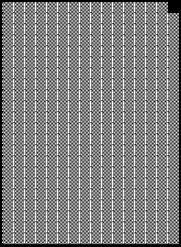
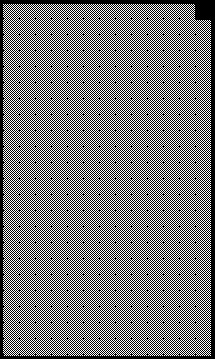

2019 JAPANESE GRAND PRIX

10 - 13 October 2019

From The FIA Formula One Race Director Document 17

To All Teams, All Officials Date 13 October 2019

Time 09:10

Title Race Directors Note - Post Qualifying Interviews

Description Post Qualifying Interviews

Enclosed 2019 Japanese F1 Grand Prix Post Qualifying Interviews Doc 17.pdf

Michael Masi

The FIA Formula One Race Director

2019 JAPANESE GRAND PRIX

10 – 13 October 2019

From The FIA Formula One Race Director Document 17

To All Officials, All Teams Date 13 October 2019

Time 09:10

NOTE TO TEAMS

The Post-qualifying interview procedure will be modified as a result of the amended schedule. The top three drivers will now be interviewed in parc fermé rather than the grid.

Should either of your drivers be among the top three at the end of qualifying we would like to ask for your co-operation in following the procedure below:

• If they take the chequered flag at the end of Q3, the fastest three drivers should procced directly to the

pit lane in front of the FIA Garages where Parc Fermé is located.

• Once out of their cars the interviews will take place in this designated area. The interviewer will be

Damon Hill.

• No driver physios or team PR personnel will be allowed to enter parc fermé at any time.

• At the end of the live interviews the drivers will be led to the backdrop located in front of the FIA Pit

Garage for the AfRS photo opportunity.

• The pole position driver should then remain in front of the AfRS backdrop to receive the Pirelli Pole

Position Award from the Pirelli Representative, Dimitrios Papadakos, Pirelli CCO - North East Asia.

• These three drivers will be weighed in the FIA Garage.

• There will be no post qualifying press conference or TV pen at this Event.

• Note: Drivers eliminated in Q1 and Q2 and drivers classified from 4th to 10th in Q3 will be interviewed

by a Formula 1 TV crew at the back of the FIA garage immediately after they have been weighed in the

parc fermé. Drivers who did not participate in Q1 but are eligible to race must go to the FIA garage for

a short interview with the Formula 1 TV crew.

Please see the attached Qualifying - Parc Fermé Diagram.

Michael Masi FIA Formula One Race Director

gniyfilauQ srehpargotohP aerA 9102

gnitiaW rebotcO

21– - emreF 2 noisreV

| ecaR lortnoC rewoT | ecaR lortnoC rewoT 55 |  |  |  |
| --- | --- | --- | --- | --- |
| 45 | 35 25 15 05 94 84 | muid | o | pordkcaB |
| P 74 | P 74 | P |  |  |

craP

llaW

tiP selacs AIF

xirP

ecneF dnarG

s’rehpargotohP

esenapaJ

namaremaC FR VT 9102

llaW ecneF

ytiruceS tiP
