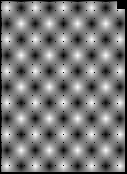
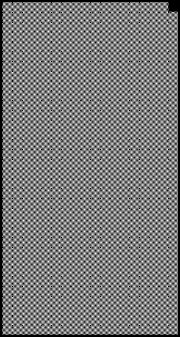

2019 JAPANESE GRAND PRIX

10 - 13 October 2019

From The FIA Formula One Race Director Document 21

To All Teams, All Officials Date 13 October 2019

Time 12:00

Title Race Directors Note - Post Race Interviews

Description Post Race Interviews

Enclosed 2019 Japanese F1 Grand Prix Post Race Interviews Doc 21.pdf

Michael Masi

The FIA Formula One Race Director

2019 JAPANESE GRAND PRIX

10 – 13 October 2019

From The FIA Formula One Race Director Document 21

To All Officials, All Teams Date 13 October 2019

Time 12:00

NOTE TO TEAMS

In addition to the provisions of the 2019 Formula One Sporting Regulations – Appendix 3 Podium

Ceremony, the procedure must be followed.

The post-race interview procedure will remain as in the previous race with the top three drivers again being

interviewed as soon as they get out of their cars.

We would like to ask for your co-operation in following the simple procedure set out below:

• Drivers who finish the race in the top three positions will be required to enter pit lane and proceed

directly to the 1,2,3 boards which will be located outside the FIA Garages.

• Once out of their cars, the interviews will take place in this designated area. The interviewer will

be Paul di Resta.

• Drivers must not interfere with parc fermé protocols in any way.

• At the end of the live interviews, the drivers will be escorted by the FIA Press Delegate to the 1st floor

of the Pit Building, where the cool down area is located.

• These drivers will be weighed by the FIA in the cool down area before the podium ceremony.

• At the end of podium ceremony, the top three drivers will go downstairs to the TV pen, located at the

Pit Entry end of the Paddock behind the Race Control Building and they may be accompanied by

their press officers.

• After the TV pen interviews, the top three drivers will be escorted to the FIA Press Conference

located on the 1st floor of the Pit Building.

• Parc fermé for all finishers outside of the top three will be located at the Pit Entry behind the top three

cars.

• Drivers classified from 4th and beyond must proceed directly to the TV pen immediately after they

have been weighed in the parc fermé, located in the FIA garage.

• Drivers who retired during the race are requested to go to the TV pen as soon as they have come

back into the paddock.

Please see the attached Post Race Parc Fermé Diagram.

Michael Masi FIA Formula One Race Director

1/4

srehpargotohP ecaR aerA

9102 gnitiaW - rebotcO emreF

21– 1 craP noisreV

| ecaR lortnoC rewoT | 55 45 35 25 15 05 |  |  |
| --- | --- | --- | --- |
| 94 | 84 | o | muid |
| P 74 | 74 |  | P |

srehsinif

ereh

gniniameR dekrap

llaW

tiP

xirP

dnarG

nameriF

esenapaJ namaremaC FR VT

9102 ecneF llaW s’rehpargotohP

tiP

dn dr 2 3 ts 1

ecneF

ytiruceS ytiruceS

ytiruceS ytiruceS
