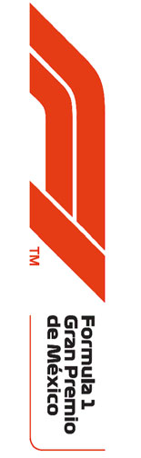

2019 MEXICAN GRAND PRIX

24 - 27 October 2019

From The FIA Formula One Race Director Document 29

To All Teams, All Officials Date 27 October 2019

Time 10:07

Title Race Directors Note - Post Race Interviews

Description Post Race Interviews

Enclosed 2019 Mexican F1 Grand Prix Post Race Interviews DOC 29.pdf

Michael Masi

The FIA Formula One Race Director

2019 MEXICAN GRAND PRIX

24 – 27 October 2019

From The FIA Formula One Race Director Document 29

To All Officials, All Teams Date 27 October 2019

Time 10.05

NOTE TO TEAMS

In addition to the provisions of the 2019 Formula One Sporting Regulations – Appendix 3 Podium

Ceremony, the procedure must be followed.

The post-race interview and podium procedure will be substantially different to previous races.

We would like to ask for your co-operation in following the procedure set out below:

• Drivers who finish the race in the top three positions will be required to proceed directly to the exit of

Turn 13 where the 1,2,3 boards which will be located.

• Once out of their cars, the interviews will take place in this designated area. The interviewer will

be Jenson Button.

• Drivers must not interfere with parc fermé protocols in any way.

• Mechanics for the teams in the top three positions must be in position in the zone marked ‘Authorised

Personnel’ on the attached map no later than two laps before the end of the race.

• Mechanics for teams who could potentially score a podium position must also be on standby in the

‘Authorised Personnel’ area should the positions change during the last two laps.

• Physios for drivers who could finish in the top three positions should also be on standby in the

‘Authorised Personnel’ area no later than two laps before the end of the race. This also applies to

the designated team representative for the podium for teams who could finish in the top three

positions.

• Teams of the top three finishing cars need to bring the necessary equipment should a car not to be

safe in this Parc Fermé location (orange or red ES status light).

• The cars finishing in 2nd and 3rd positions, the mechanics will be authorised to remove the cars from

the designated area before the interviews are completed and the drivers have gone to the podium

area.

• The car finishing in 1st position, under the supervision of the FIA Technical Delegate, must then be

pushed to the podium and onto the ramp which leads to the car elevator. A mechanic must sit in the

car to steer it during this procedure.

• At the end of the live interviews, the drivers will be escorted by the FIA Press Delegate below the

Podium, where the cool down area is located.

• These drivers will be weighed by the FIA in the cool down area before the podium ceremony.

• The 2nd and 3rd classified drivers and the team representative will then go to the back of the podium

and be called for the presentation as normal. The winning driver will remain underneath the podium

and stand next to their car on the platform. The platform will then be raised when their name is

announced.

• The trophy presentation and national anthems will take place as normal.

1/2

• Following the champagne celebrations, the participants are requested to move to the front of the

platform and stand next to the winning car for a photo opportunity.

• At the end of podium ceremony, the top three drivers, accompanied by the FIA Press Delegate, will

exit at the back of the Podium structure and procced to the TV pen, located at the Pit Entry end of

the Paddock between the F1 Broadcast Centre and Mercedes Pit Garages.

• The team press officers must wait at the entrance to the TV pen and are not permitted in the podium

area.

• After the TV pen interviews, the top three drivers will be escorted to the FIA Press Conference

located on the 1st floor of the Media Centre Building.

• Parc fermé for all finishers outside of the top three will be located at the Pit Entry.

• Drivers classified from 4th and beyond must proceed directly to the TV pen immediately after they

have been weighed in the parc fermé, located in the FIA garage.

• Drivers who retired during the race are requested to go to the TV pen as soon as they have come

back into the paddock.

Please see the attached Post Race Podium Ceremony Diagram.

Michael Masi FIA Formula One Race Director

2/2

