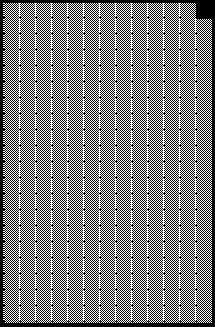
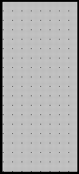

2019 MONACO GRAND PRIX

22 - 26 May 2019

From The FIA Formula One Race Director Document 19

To All Teams, All Officials Date 25 May 2019

Time 13:06

Title Race Directors Note - Post Qualifying Interviews

Description Post Qualifying Interviews

Enclosed 2019 Monaco F1 Grand Prix - Post Qualifying Interviews - DOC 19.pdf

Michael Masi

The FIA Formula One Race Director

2019 MONACO GRAND PRIX

22 – 26 May 2019

From The FIA Formula One Race Director Document 19

To All Officials, All Teams Date 25 May 2019

Time 13:05

NOTE TO TEAMS

The Post-qualifying interview procedure will basically remain as in the previous race with the top three drivers again being interviewed as soon as they get out of their cars on the track.

Should either of your drivers be among the top three at the end of qualifying we would like to ask for your co-operation in following the procedure below:

• If they take the chequered flag at the end of Q3, the fastest three drivers should stop on the track just beyond the Pit Lane Entry prior to Turn 19 where the 1, 2, 3 boards which will be located.

• Other than the team mechanics (with cooling fans if necessary), officials and accredited television crews and photographers, no one else will be allowed in the designated area at this time (no driver physios nor team PR personnel).

• Once out of their cars the interviews will take place in this designated area. The interviewer will be Paul di Resta.

• If one of the top three drivers is in the pit lane at the end of the session the team should ensure that he goes directly to the designated area once the other drivers have arrived there.

• At the end of the live interviews the drivers will walk back to the Pit Lane Entry towards the parc fermé and then be led to the backdrop, located outside the FIA Garage, for the AfRS photo opportunity.

• Mechanics will be authorised to remove the cars from the track only after the interviews are completed and must push these cars directly to the parc fermé.

• The pole position driver should then remain in front of the AfRS backdrop to receive the Pirelli Pole Position Award from the Pirelli Representative, Sir Jackie Stewart. These three drivers will be weighed by the FIA next to the AfRS backdrop. o • The drivers will then be escorted by the FIA Press Delegate to the Media Centre where the Press Conference will take place.

• At the end of the press conference, the top three drivers should go to the TV pen located on the terrace of the F1 Building in the Paddock and they may be accompanied by their press officers.

• NB: Drivers eliminated in Q1 and Q2, drivers classified from 4th to 10th in Q3 and drivers who did not participate to Q1 but are eligible to race must also attend the TV pen interview session after they have been weighed at the end of the last part of qualifying which they participated.

Please see the attached Qualifying - Parc Fermé Diagram.

Michael Masi FIA Formula One Race Director

gniyfilauQ 9102

yaM 32– 1 noisreV

lla W tiP

ecneF

s re xirP h p 1 a F rg p o o rd to dnarG kca h P B

ocanoM

lla W 9102 tiP

A IF

A IF

s’rehpargotohP aera

gnitiaw

namaremaC FR dn VT 2

ts 1

dr 3
