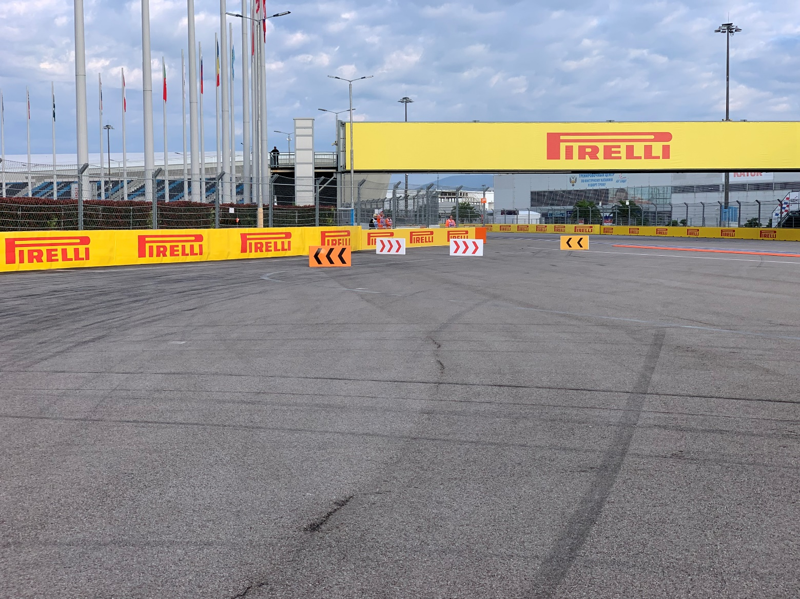
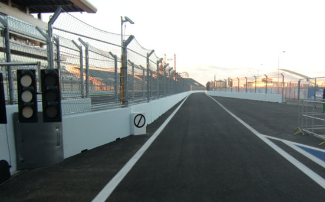
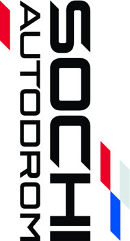

2019 RUSSIAN GRAND PRIX

26 - 29 September 2019

From The FIA Formula One Race Director Document 7

To All Teams, All Officials Date 27 September 2019

Time 08:51

Title Race Directors' Event Notes Version 2

Description Event Notes Version 2

Enclosed 2019 Russian F1 Grand Prix Race Directors Event Notes Doc 7.pdf

Michael Masi

The FIA Formula One Race Director

2019 RUSSIAN GRAND PRIX

26 – 29 September 2019

From The FIA Formula One Race Director Document 7

To All Officials, All Teams Date 26 September 2019

Time 08:50

EVENT NOTES VERSION 2

1) Matters arising from the Singapore Grand Prix

2) Changes to the circuit

2.1 A domed kerb section 50mm high has been installed behind the kerb on the exit of Turn 4, Turn 7 and Turn 17.

2.2 The previously advised resurfacing works were not required and as a result have not taken place.

3) Pit lane map

3.1 Safety Car lines.

3.2 The location of the pit entry and the pit exit.

3.3 Designated garage areas.

3.4 Safety Car position for first lap and rest of race.

3.5 Blue flag marshal at the pit exit.

3.6 Track light panels displaying pit entry status.

4) Pirelli Event Preview

4.1 With reference to Article 24.4(a) of the Sporting Regulations see the attached document provided by the official tyre supplier.

5) Weighing and weighing platform

5.1 The FIA weighing platform will be available for teams to use at the following times, however, no more than 10 team personnel may be present during any visit. Each visit should last no more than 10 minutes unless no other team is waiting in the pit lane:

a) From 13:00 on Thursday until 10:00 on Friday.

b) From 11:30 on Friday until 14:30 on Saturday (between 13:00 and 14:30 each visit will be restricted to five minutes).

c) From when the cars are returned to the teams after qualifying until 19:30 on Saturday.

d) From 09:00 until 10:00 and 12:00 until 13:30 on Sunday.

Any team found to be abusing the time limits set out above, which we will be enforced by FIA security personnel and our own CCTV, will not be permitted to use the weighbridge again during the Event.

1/5

6) Red zones for photographers in the pit lane during practice sessions

6.1 See the attached drawing.

7) Pit Lane Speed Limit

7.1 For safety reasons, the Pit lane Speed limit detailed in Article 22.10 of the 2019 Formula One Sporting Regulations is hereby amended to 60km/h for the duration of the Event.

8) Practice starts

8.1 Practice starts may only be carried out on the right-hand side after the pit exit lights and, for the avoidance of doubt, this includes any time the pit exit is open for the race.

Drivers must leave adequate room on their left for another driver to pass.

8.2 For reasons of safety and sporting equity, cars may not stop in the fast lane of the pits at any time the pit exit is open without a justifiable reason (a practice start is not considered a justifiable reason).

9) Lines or bollards at the Pit Entry and Pit Exit

9.1 In accordance with Chapter 4 (Section 5) of Appendix L to the ISC drivers must keep to the right of the solid white line at the pit exit when leaving the pits. No part of any car leaving the pits may cross this line.

9.2 For safety reasons drivers must keep to the right of the bollard at the pit entry when they are entering the pits. No part of any car entering the pits may cross this line.

9.3 The line separating the pit entry from the track is considered to be the white line on the left edge of the pit entry.

9.4 Except in the cases of force majeure (accepted as such by the Stewards), the crossing by any part of the car, in any direction, of the white line separating the pit entry and the track (as detailed in 9.3 above) by a driver who, in the opinion of the Stewards, had committed to entering the pit lane is prohibited.

9.5 The dotted white line across the pit entry and across the pit exit are the track edges.

10) Observing yellow flags during free practice and qualifying

10.1 Double waved: Any driver passing through a double waved yellow marshalling sector must reduce speed significantly and be prepared to change direction or stop. In order for the stewards to be satisfied that any such driver has complied with these requirements it must be clear that he has not attempted to set a meaningful lap time, for practical purposes this means the driver should abandon the lap (this does not necessarily mean he has to pit as the track could well be clear the following lap).

10.2 Single waved: Drivers should reduce their speed and be prepared to change direction. It must be clear that a driver has reduced speed and, in order for this to be clear, a driver would be expected to have braked earlier and/or discernibly reduced speed in the relevant marshalling sector.

Drivers should not overtake any car in a single waved yellow marshalling sector unless it is clear that a car is slowing with a completely obvious problem, e.g. obvious accident damage or a deflated tyre.

11) Track light panels

11.1 The FIA track light panels have been installed in the positions shown on the circuit map. In accordance with Appendix H to the ISC the light signals have the same meaning as flag signals.

12) Track Limits - Turn 2

12.1 Any driver who fails to negotiate Turn 2 by using the track, and who passes completely to the left of the first orange kerb element on prior to the apex, must then re-join the track by driving through the three arrays of blocks in the run-off, to the left of the first (orange block), to the right of the second (white block), to the left of the third (orange block). (See attached image).

2/5

12.2 The above requirements will not automatically apply during any Free Practice Session and Qualifying Practice session, each such case will be judged individually.

12.3 The above requirements will not automatically apply to any driver who is judged to have been forced off the track, each such case will be judged individually.

12.4 In all cases detailed above, the driver must only re-join the track when it is safe to do so and without gaining a lasting advantage.

13) Driving Unnecessarily Slowly - Turns 12 and 13

13.1 Any driver intending to create a gap in front of him in order to get a clear lap should not attempt do this around turns 12 and/or 13. Any driver seen to have done this will be reported to the stewards as being in breach of Article 27.4 of the 2019 Formula One Sporting Regulations (“At no time may a car be driven unnecessarily slowly, erratically or in a manner which could be deemed potentially dangerous to other drivers or any other person").

14) Drivers leaving their pit stop position in the pit lane

14.1 For safety reasons, no car should be driven from its pit stop position at any time unless:

a) It has first been driven into the pit stop position having just entered the pit lane from the track, and;

b) It is then driven immediately back onto the track from the pit stop position.

15) Fire extinguishers around the circuit

15.1 Indicated by small fluorescent orange boards with a white letter "F" attached to the debris fence.

16) Places where drivers may leave the track

16.1 Indicated by white and green panels (showing a man running) attached to the debris fences.

17) Places to remove cars from the track

17.1 Indicated by fluorescent orange panels on the walls or guardrails.

17.2 If a driver has a choice where to stop during a session, it is recommended they do so on the right-hand side of the track as cars may then be recovered more easily and brought back to the pits

18) Support races team barrier placement

18.1 Team barrier placement prior to and during all support category practice sessions and races: No more than three metres from the garages.

18.2 It is not permitted to push cars to the weighing area at any time a support category is in pit lane.

19) In laps during qualifying and reconnaissance laps

19.1 In order to ensure that cars are not driven unnecessarily slowly on in laps during and after the end of qualifying or during reconnaissance laps when the pit exit is opened for the race, drivers must stay below the maximum time set by the FIA between the Safety Car lines shown on the pit lane map.

You will be informed of the maximum time after the first day of practice.

20) Post qualifying parc fermé

20.1 The cameras should be installed and operated in the same way as usual.

21) Operational personnel curfew

21.1 Boards warning anyone attempting to enter the paddock that the curfew is in operation will be placed immediately before the turnstiles at the appropriate times.

3/5

22) Removing cars from the grid

22.1 Two gates in the pit wall, the first is adjacent to grid position 6 and the second adjacent to grid position 18.

23) Car number light panels for the start

23.1 On the right-hand side of the grid.

24) Track light panel displaying pit entry status

24.1 The light panel indicated on the pit lane map will display flashing yellow arrow if cars are required to use the pit lane once the Safety Car has been deployed during the race.

24.2 The light panel indicated on the pit lane map will display flashing red cross if the pit lane is closed at any point during the race.

25) Tyre Blanket Usage during Pit Stops in the Race

25.1 For reasons of safety, tyre blankets are not permitted in the Pit Lane at any time during the race.

26) Lapping during the race

26.1 The ISC requires drivers who are caught by another car about to lap him to allow the faster driver past at the first available opportunity. The F1 Marshalling System has been developed in order to ensure that the point at which a driver is shown blue flags is consistent, rather than trusting the ability of marshals to identify situations that require blue flags.

As it was at the end of last season the system will be set to give a pre-warning when the faster car is within 3.0s of the car about to be lapped, this should be used by the team of the slower car to warn their driver he is soon going to be lapped and that allowing the faster car through should be considered a priority. When the faster car is within 1.2s of the car about to be lapped blue flags will be shown to the slower car (in addition to blue light panels, blue cockpit lights and a message on the timing monitors) and the driver must allow the following driver to overtake at the first available opportunity.

It should be noted that the aim of using F1MS is ensure consistent application of the rules, additional instructions may also be given by race control when necessary.

27) Post race parc fermé

27.1 All cars must enter the pit lane and should proceed directly to the weighing area.

28) Any other business

Michael Masi FIA Formula One Race Director

4/5

Track Limits - Turn 2 Run Off (Updated Image)

5/5

|  |  | Grand Prix of Russia 27-29/09/2019 (19R16SOC) |  |  |  |  |  |  |  |  |  |  |  |  |  |  |  |  |  |  |  |  |  |  |
| --- | --- | --- | --- | --- | --- | --- | --- | --- | --- | --- | --- | --- | --- | --- | --- | --- | --- | --- | --- | --- | --- | --- | --- | --- |
|  |  | Compound |  |  | FL | FR | RL |  | RR |  |  |  |  |  |  | Ma |  |  |  |  |  |  |  | ndatory race tyres |
|  |  | C2 |  |  | 2A1 | 2A2 | 2A3 |  | 2A4 |  |  |  |  |  |  |  |  |  |  |  |  |  |  | C2 |
|  |  | C3 |  |  | 3B1 | 3B2 | 3B3 |  | 3B4 |  |  |  |  |  |  |  |  |  |  |  |  |  |  | C3 |
|  |  | C4 |  |  | 4C1 | 4C2 | 4C3 |  | 4C4 |  |  |  |  |  |  |  |  |  |  |  |  |  |  |  |
|  |  | INTERMEDIATE |  |  | 33G | 35G | 37G |  | 39G |  |  |  |  |  |  |  |  |  |  |  |  |  |  | Q3 tyre |
|  |  | WET Cross-Over time MINIMUM STARTING PRESSURE, BLISTERING SENSITIVITY, CAMBER LIMIT |  |  | 34F WET > 119% > INT > 113% > DRY | 36F Front (psi) | 37F |  | 39F |  |  |  |  |  | Rear (psi) |  |  |  |  |  |  |  |  | C4 |
|  |  |  | Slicks |  |  | 23.0 |  |  |  |  |  |  |  |  |  | 19.0 |  |  |  |  |  |  |  |  |
|  |  |  | Intermediate |  |  | 21.0 |  |  |  |  |  |  |  |  |  | 19.0 |  |  |  |  |  |  |  |  |
|  |  |  | Wet |  |  | 20.0 |  |  |  |  |  |  |  |  |  | 18.0 |  |  |  |  |  |  |  |  |
| FE EOS Camber limit RE EOS Camber limit -3.25 ° -2.00 ° FE Blistering RE Blistering sensitivity sensitivity Medium Low |  | TYRE HEATING STRATEGY (TREAD&SIDEWALL) |  |  |  |  |  |  |  |  |  |  |  |  |  |  |  |  |  |  |  |  |  |  |
| Temperature 0 40 60 80 100 (°C) |  |  |  |  |  |  |  |  |  |  |  |  |  |  |  |  |  |  |  |  |  |  |  |  |
|  |  |  |  | Slicks (front axle) |  | storage |  |  |  |  |  |  |  |  |  |  | m | a | x | . | 3 | h | ma | x. 2h (max. temp = 100°C) |
|  |  |  |  | Slicks (rear axle) |  | storage |  |  |  |  |  |  |  |  |  |  | m | a | x | . | 5 | h |  | (max. temp = 80°C) |
|  |  |  |  | Intermediate |  | storage |  |  |  | m | ax | . | 2 | h |  |  | m | a | x | . | 3 | 0' |  | (max. temp = 80°C) |
|  |  |  |  | Wet |  | storage |  |  |  | m | ax | . | 2 | h |  |  |  |  |  |  |  |  |  | (max. temp = 60°C) |
| (The time limits refer to the period leading up to the start of the session in which the tyres are intended for use). (The temperatures referred to above apply at all times during the event). GENERAL NOTES Teams are kindly reminded that the following parameters will be subjected to FIA checks during the event: - Starting pressure. - Camber at maximum speed. - Maximum blanket temperature. - Tyre swapping. | Tyre Notes |  |  |  |  |  |  |  |  |  |  |  |  |  |  |  |  |  |  |  |  |  |  |  |
| ●Not permitted to switch tyres from their originally allocated position. ●All temperature limits apply to the actual tyre surface temperature, measured with the IR gun detailed in TD029-15. ●Do not subject tyres to large deformation or heavy impact. ●STORAGE temperature is the recommended temperature the tyre can stay in ●Do not leave fitted tyres exposed at an air temperature lower than 15°C blankets without time limit. and/or any UV emission. ●BLANKET HEATING TIME for each temperature range to be counted from the ● Revised prescriptions could be issued during the race weekend in moment the blanket control unit is set to reach its targeted temperature within accordance with TD/007-16. its correspondent interval. | ●Not permitted to switch tyres from their originally allocated position. ●Do not subject tyres to large deformation or heavy impact. ●Do not leave fitted tyres exposed at an air temperature lower than 15°C and/or any UV emission. ● Revised prescriptions could be issued during the race weekend in accordance with TD/007-16. |  |  |  |  |  |  | ●All temperature limits apply to the actual tyre surface temperature, measured with the IR gun detailed in TD029-15. ●STORAGE temperature is the recommended temperature the tyre can stay in blankets without time limit. ●BLANKET HEATING TIME for each temperature range to be counted from the moment the blanket control unit is set to reach its targeted temperature within its correspondent interval. |  |  |  |  |  |  |  |  |  |  |  |  |  |  |  |  |

enaL 9102

rebmetpeS tiP

| 1 | AIF |  | egaraG saerA detangiseD |
| --- | --- | --- | --- |
| 2 | AIF |  |  |
| 3 | AIF |  |  |
| 4 | AIF |  |  |
| 5 | 1F |  |  |
| 6 | sedecreM |  | sedecreM |
| 7 | sedecreM |  |  |
| 8 | sedecreM |  |  |
| 9 | irarreF |  | irarreF |
| 01 | irarreF |  |  |
| 11 | irarreF |  | lluB deR |
| 21 | lluB deR |  |  |
| 31 | lluB deR |  |  |
| 41 | lluB deR |  | tluaneR |
| 51 | tluaneR |  |  |
| 61 | tluaneR |  |  |
| 71 | tluaneR |  | saaH |
| 81 | saaH |  |  |
| 91 | saaH |  |  |
| 02 | saaH |  | neraLcM |
| 12 | neraLcM |  |  |
| 22 | neraLcM |  |  |
| 32 | neraLcM |  | tnioP gnicaR |
| 42 | tnioP gnicaR |  |  |
| 52 | tnioP gnicaR |  |  |
| 62 | aflA | tnioP gnicaR | oemoR aflA |
| 72 | oemoR aflA |  |  |
| 82 | oemoR aflA |  |  |
| 92 | smailliW | ossoR oroT | ossoR oroT |
| 03 | ossoR oroT |  |  |
| 13 | ossoR oroT |  |  |
| 23 | smailliW |  | smailliW |
| 33 | smailliW |  | potS noitisoP tiP |

62– 1 stratS noisreV YRTNE eniL MORF EREH ENAL lortnoC 1F TIP DEREVOCER DECALP TIP X

yrtnE dralloB KCART segaraG SRAC tiP lenap yrtnE ENAL sutatS 1F 1 tiP eniL TSAF RAC RAC YTEFAS paL YTEFAS tsriF RAC ecaR YTEFAS

xirP

dnarG

sdnE

ENAL

naissuR TIP

TIXE 9102 TIP

2 )4.1 eniL tsop RAC lahsram( YTEFAS

noitisoP

ENAL eloP

TSAF

