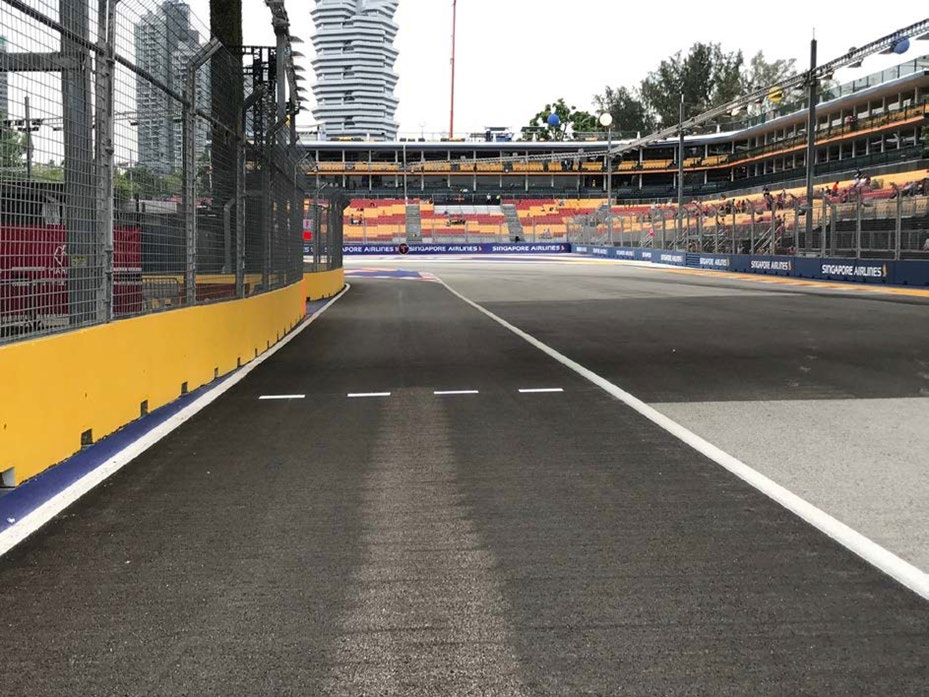
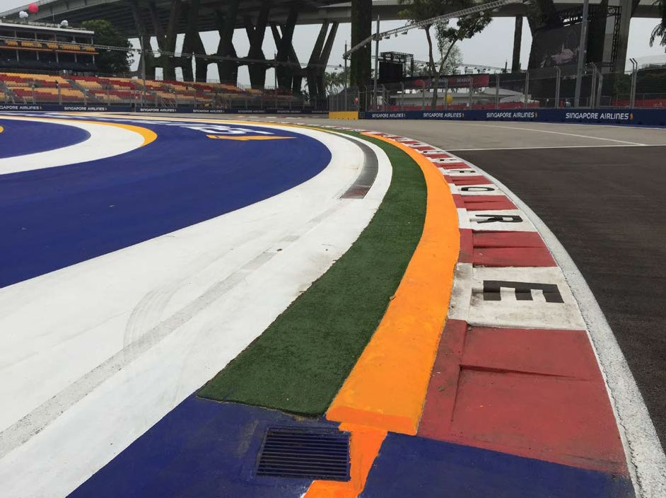
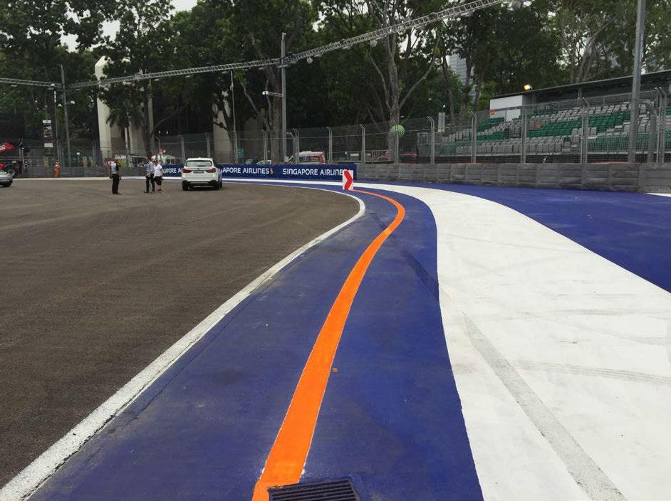
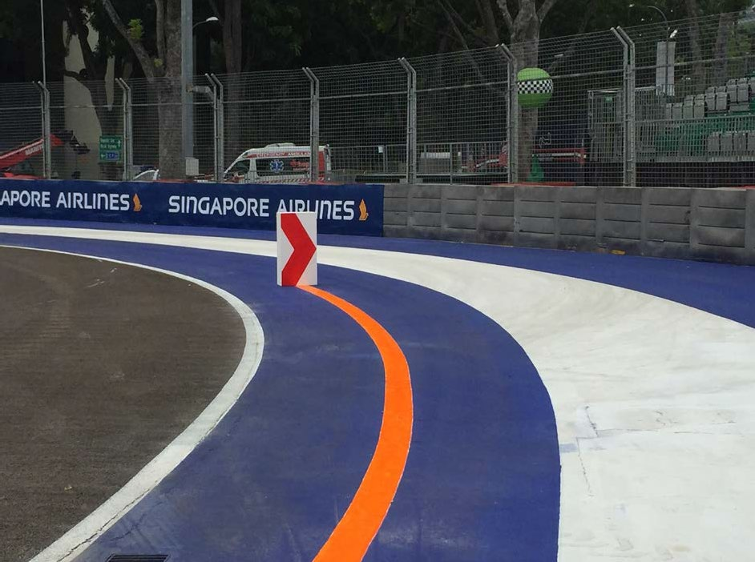
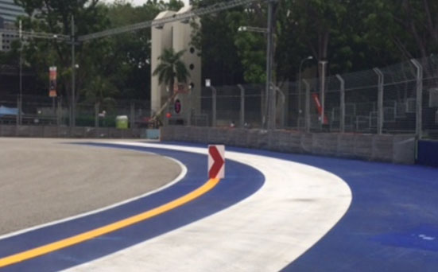
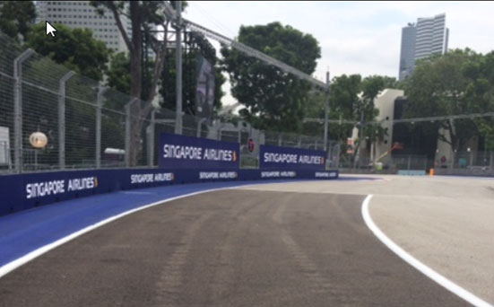
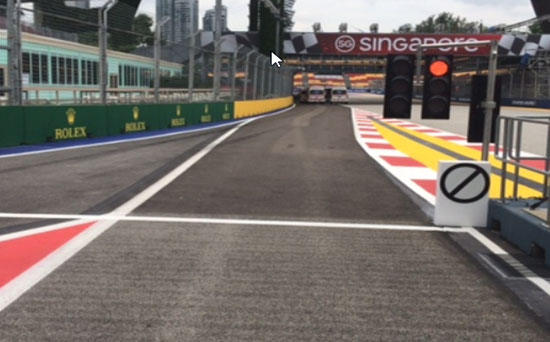
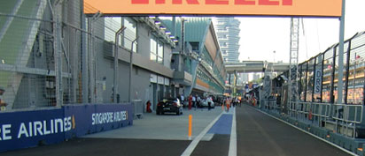

2019 SINGAPORE GRAND PRIX

19 - 22 September 2019

From The FIA Formula One Race Director Document 8

To All Teams, All Officials Date 20 September 2019

Time 15:36

Title Race Directors' Event Notes Version 2

Description Event Notes Version 2

Enclosed 2019 Singapore F1 Grand Prix - Race Directors Event Notes V2 Doc 8.pdf

Michael Masi

The FIA Formula One Race Director

2019 SINGAPORE GRAND PRIX

19 – 22 September 2019

From The FIA Formula One Race Director Document 8

To All Officials, All Teams Date 20 September 2019

Time 15:35

EVENT NOTES VERSION 2

1) Matters arising from the Italian Grand Prix

2) Changes to the circuit

2.1 The track has been resurfaced from the end of the Pit Wall through to the exit of Turn 1, Right hand side between Turn 3 and Turn 4, left hand side from the exit of Turn 5 to Point 5.5, prior to Turn 7 through to the exit of Turn 7, left hand side between Turn 12 and Turn 13, left hand side immediately prior to Turn 13, left hand side at approximately Point 13.3, a small patch on the exit of Turn 14, exit of Turn 16 through to the entry to Turn 19, a small patch at Turn 20, Point 21.5 through to the exit of Turn 23.

2.2 Five domed kerb sections 50mm high are installed approximately 1.5m from the track edge behind the exit of Turn 7.

2.3 The entire working lane has been ground back and resurfaced.

3) Pit lane map

3.1 Safety Car lines.

3.2 The location of the pit entry and the pit exit.

3.3 Designated garage areas.

3.4 Safety Car position for first lap and rest of race.

3.5 Blue flag marshal at the pit exit.

3.6 Track light panels displaying pit entry status.

4) Pirelli Event Preview

4.1 With reference to Article 24.4(a) of the Sporting Regulations see the attached document provided by the official tyre supplier.

5) Weighing and weighing platform

5.1 The FIA weighing platform will be available for teams to use at the following times, however, no more than 10 team personnel may be present during any visit. Each visit should last no more than 10 minutes unless no other team is waiting in the pit lane:

a) From 19:00 on Thursday until 15:30 on Friday.

b) From 17:00 on Friday until 20:30 on Saturday (between 19:00 and 20:30 each visit will be restricted to five minutes).

c) From when the cars are returned to the teams after qualifying on Saturday until 01:30 Sunday morning.

1/6

d) From 15:00 until 16:00 and 18:00 until 19:30 on Sunday.

Any team found to be abusing the time limits set out above, which we will be enforced by FIA security personnel and our own CCTV, will not be permitted to use the weighbridge again during the Event.

6) Red zones for photographers in the pit lane during practice sessions

6.1 See the attached drawing.

7) Pit Lane Speed Limit

7.1 For safety reasons, the Pit lane Speed limit detailed in Article 22.10 of the 2019 Formula One Sporting Regulations is hereby amended to 60km/h for the duration of the Event.

8) Practice starts

8.1 During each practice session, practice starts may only be carried out on the left-hand side after the pit exit lights. Drivers must stay completely to the left of the left-hand line in the pit exit.

8.2 During the time the pit exit is open for the race, practice starts may be carried out no further forward than the dashed white line across the pit exit. Drivers wishing to carry out a start should stop on the left in order to allow other cars to pass on their right. (See attached image)

8.3 During these times any driver passing a car which has stopped to carry out a practice start may cross the white line that is referred to in 9.1 8.1 below. Any driver crossing this line must move back to the left of it as quickly as possible.

8.4 For reasons of safety and sporting equity, cars may not stop in the fast lane of the pits at any time the pit exit is open without a justifiable reason (a practice start is not considered a justifiable reason).

9) Lines or bollards at the Pit Entry and Pit Exit

9.1 In accordance with Chapter 4 (Section 5) of Appendix L to the ISC drivers must keep to the left of the solid white line at the pit exit when leaving the pits. No part of any car leaving the pits may cross this line other than in the case detailed in 8.1 7.1 and 8.2 7.2 above.

9.2 For safety reasons drivers must keep to the left of the bollard at the pit entry when they are entering the pits.

9.3 Except in the cases of force majeure (accepted as such by the Stewards), the crossing, in any direction, of the painted area separating the pit entry and the track by a driver who, in the opinion of the Stewards, had committed to entering the pit lane is prohibited.

9.4 The dotted white line across the pit entry is the track edge.

9.5 For safety reasons, when driving in the first part of the pit lane, prior to the first team garage, drivers must keep to the right of the two bollards separating the fast lane and inner lane.

10) Observing yellow flags during free practice and qualifying

10.1 Double waved: Any driver passing through a double waved yellow marshalling sector must reduce speed significantly and be prepared to change direction or stop. In order for the stewards to be satisfied that any such driver has complied with these requirements it must be clear that he has not attempted to set a meaningful lap time, for practical purposes this means the driver should abandon the lap (this does not necessarily mean he has to pit as the track could well be clear the following lap).

10.2 Single waved: Drivers should reduce their speed and be prepared to change direction. It must be clear that a driver has reduced speed and, in order for this to be clear, a driver would be expected to have braked earlier and/or discernibly reduced speed in the relevant marshalling sector.

Drivers should not overtake any car in a single waved yellow marshalling sector unless it is clear that a car is slowing with a completely obvious problem, e.g. obvious accident damage or a deflated tyre.

2/6

11) Track light panels

11.1 The FIA track light panels have been installed in the positions shown on the circuit map. In accordance with Appendix H to the ISC the light signals have the same meaning as flag signals.

12) Track Limits - Turn 1, 2 and 3

12.1 Any driver who fails to negotiate Turn 2 by using the track, and who passes completely to the right of the orange kerb/line element, must keep to the right of the red and white polystyrene block and re-join the track on the outside of Turn 3. (See attached image)

12.2 The above requirements will not automatically apply to any driver who is judged to have been forced off the track, each such case will be judged individually.

12.3 In all cases detailed above, the driver must only re-join the track when it is safe to do so and without gaining a lasting advantage.

13) Drivers leaving their pit stop position in the pit lane

13.1 For safety reasons, no car should be driven from its pit stop position at any time unless:

a) It has first been driven into the pit stop position having just entered the pit lane from the track, and;

b) It is then driven immediately back onto the track from the pit stop position.

14) Fire extinguishers around the circuit

14.1 Indicated by small white boards with a red letter "F".

15) Places where drivers may leave the track

15.1 Indicated by white and green panels (showing a man running) on the debris fences.

16) Places to remove cars from the track

16.1 Indicated by fluorescent orange panels on the walls or guardrails.

17) Support races team barrier placement

17.1 Team barrier placement prior to and during all support category practice sessions and races: No more than one metre from the garages.

17.2 It is not permitted to push cars to the weighing area at any time a support category is in pit lane.

18) In laps during qualifying and reconnaissance laps

18.1 In order to ensure that cars are not driven unnecessarily slowly on in laps during and after the end of qualifying or during reconnaissance laps when the pit exit is opened for the race, drivers must stay below the maximum time set by the FIA between the Safety Car lines shown on the pit lane map.

You will be informed of the maximum time after the first day of practice.

19) Post qualifying parc fermé

19.1 The cameras should be installed and operated in the same way as usual.

20) Operational personnel curfew

20.1 Boards warning anyone attempting to enter the paddock that the curfew is in operation will be placed immediately before the turnstiles at the appropriate times.

21) Removing cars from the grid

21.1 Two gates in the pit wall, the first is adjacent to grid position 1 and the second adjacent to grid position 12.

3/6

22) Car number light panels for the start

22.1 On the right-hand side of the grid.

23) Track light panel displaying pit entry status

23.1 The light panel indicated on the pit lane map will display flashing yellow arrow if cars are required to use the pit lane once the Safety Car has been deployed during the race.

23.2 The light panel indicated on the pit lane map will display flashing red cross if the pit lane is closed at any point during the race.

24) Tyre Blanket Usage during Pit Stops in the Race

24.1 For reasons of safety, tyre blankets are not permitted in the Pit Lane at any time during the race.

25) Lapping during the race

25.1 The ISC requires drivers who are caught by another car about to lap him to allow the faster driver past at the first available opportunity. The F1 Marshalling System has been developed in order to ensure that the point at which a driver is shown blue flags is consistent, rather than trusting the ability of marshals to identify situations that require blue flags.

As it was at the end of last season the system will be set to give a pre-warning when the faster car is within 3.0s of the car about to be lapped, this should be used by the team of the slower car to warn their driver he is soon going to be lapped and that allowing the faster car through should be considered a priority. When the faster car is within 1.2s of the car about to be lapped blue flags will be shown to the slower car (in addition to blue light panels, blue cockpit lights and a message on the timing monitors) and the driver must allow the following driver to overtake at the first available opportunity.

It should be noted that the aim of using F1MS is ensure consistent application of the rules, additional instructions may also be given by race control when necessary.

26) Post race parc fermé

26.1 All cars must enter the pit lane and should proceed directly to the weighing area.

27) Any other business

Michael Masi FIA Formula One Race Director

4/6

Practice Start Location when the Pit Exit is open prior to the Race

Track Limits Turns 1, 2 and 3

5/6

Track Limits Turns 1, 2 and 3

6/6

|  |  | Grand Prix of Singapore 20-22/09/2019 (19R15SIN) |  |  |  |  |  |  |  |  |  |  |  |  |  |  |  |  |  |  |  |  |  |  |
| --- | --- | --- | --- | --- | --- | --- | --- | --- | --- | --- | --- | --- | --- | --- | --- | --- | --- | --- | --- | --- | --- | --- | --- | --- |
|  |  | Compound |  |  | FL | FR | RL |  | RR |  |  |  |  |  |  | Ma |  |  |  |  |  |  |  | ndatory race tyres |
|  |  | C3 |  |  | 3A1 | 3A2 | 3A3 |  | 3A4 |  |  |  |  |  |  |  |  |  |  |  |  |  |  | C3 |
|  |  | C4 |  |  | 4B1 | 4B2 | 4B3 |  | 4B4 |  |  |  |  |  |  |  |  |  |  |  |  |  |  | C4 |
|  |  | C5 |  |  | 5C1 | 5C2 | 5C3 |  | 5C4 |  |  |  |  |  |  |  |  |  |  |  |  |  |  |  |
|  |  | INTERMEDIATE |  |  | 33G | 35G | 37G |  | 39G |  |  |  |  |  |  |  |  |  |  |  |  |  |  | Q3 tyre |
|  |  | WET Cross-Over time MINIMUM STARTING PRESSURE, BLISTERING SENSITIVITY, CAMBER LIMIT |  |  | 34F WET > 119% > INT > 113% > DRY | 36F Front (psi) | 37F |  | 39F |  |  |  |  |  | Rear (psi) |  |  |  |  |  |  |  |  | C5 |
|  |  |  | Slicks |  |  | 19.0 |  |  |  |  |  |  |  |  |  | 16.5 |  |  |  |  |  |  |  |  |
|  |  |  | Intermediate |  |  | 18.0 |  |  |  |  |  |  |  |  |  | 16.5 |  |  |  |  |  |  |  |  |
|  |  |  | Wet |  |  | 17.0 |  |  |  |  |  |  |  |  |  | 15.5 |  |  |  |  |  |  |  |  |
| FE EOS Camber limit RE EOS Camber limit -3.75 ° -2.00 ° FE Blistering RE Blistering sensitivity sensitivity Low Low |  | TYRE HEATING STRATEGY (TREAD&SIDEWALL) |  |  |  |  |  |  |  |  |  |  |  |  |  |  |  |  |  |  |  |  |  |  |
| Temperature 0 40 60 80 100 (°C) |  |  |  |  |  |  |  |  |  |  |  |  |  |  |  |  |  |  |  |  |  |  |  |  |
|  |  |  |  | Slicks (front axle) |  | storage |  |  |  |  |  |  |  |  |  |  | m | a | x | . | 3 | h | ma | x. 2h (max. temp = 100°C) |
|  |  |  |  | Slicks (rear axle) |  | storage |  |  |  |  |  |  |  |  |  |  | m | a | x | . | 5 | h |  | (max. temp = 80°C) |
|  |  |  |  | Intermediate |  | storage |  |  |  | m | ax | . | 2 | h |  |  | m | a | x | . | 3 | 0' |  | (max. temp = 80°C) |
|  |  |  |  | Wet |  | storage |  |  |  | m | ax | . | 2 | h |  |  |  |  |  |  |  |  |  | (max. temp = 60°C) |
| (The time limits refer to the period leading up to the start of the session in which the tyres are intended for use). (The temperatures referred to above apply at all times during the event). GENERAL NOTES Teams are kindly reminded that the following parameters will be subjected to FIA checks during the event: - Starting pressure. - Camber at maximum speed. - Maximum blanket temperature. - Tyre swapping. | Tyre Notes |  |  |  |  |  |  |  |  |  |  |  |  |  |  |  |  |  |  |  |  |  |  |  |
| ●Not permitted to switch tyres from their originally allocated position. ●All temperature limits apply to the actual tyre surface temperature, measured with the IR gun detailed in TD029-15. ●Do not subject tyres to large deformation or heavy impact. ●STORAGE temperature is the recommended temperature the tyre can stay in ●Do not leave fitted tyres exposed at an air temperature lower than 15°C blankets without time limit. and/or any UV emission. ●BLANKET HEATING TIME for each temperature range to be counted from the ● Revised prescriptions could be issued during the race weekend in moment the blanket control unit is set to reach its targeted temperature within accordance with TD/007-16. its correspondent interval. | ●Not permitted to switch tyres from their originally allocated position. ●Do not subject tyres to large deformation or heavy impact. ●Do not leave fitted tyres exposed at an air temperature lower than 15°C and/or any UV emission. ● Revised prescriptions could be issued during the race weekend in accordance with TD/007-16. |  |  |  |  |  |  | ●All temperature limits apply to the actual tyre surface temperature, measured with the IR gun detailed in TD029-15. ●STORAGE temperature is the recommended temperature the tyre can stay in blankets without time limit. ●BLANKET HEATING TIME for each temperature range to be counted from the moment the blanket control unit is set to reach its targeted temperature within its correspondent interval. |  |  |  |  |  |  |  |  |  |  |  |  |  |  |  |  |

enaL

9102 tiP rebmetpeS GALF lahsraM aera EULB ffo-nur )thgir 91– eht 1 ni noisreV kcolb ot yats( worrA

|  | smailliW | detangiseD saerA egaraG smailliW |
| --- | --- | --- |
| 04 | smailliW |  |
| 93 | smailliW |  |
| 83 | ossoR oroT | ossoR oroT |
| 73 | ossoR oroT |  |
| 63 | ossoR oroT |  |
| 53 | ossoR oroT |  |
| 43 | oemoR aflA | oemoR aflA |
| 33 | oemoR aflA |  |
| 23 | oemoR aflA |  |
| 13 | tnioP gnicaR | tnioP gnicaR |
| 03 | tnioP gnicaR |  |
| 92 | tnioP gnicaR |  |
| 82 | tnioP gnicaR |  |
| 72 | neraLcM | neraLcM |
| 62 | neraLcM |  |
| 52 | neraLcM |  |
| 42 | saaH | saaH |
| 32 | saaH |  |
| 22 | saaH |  |
| 12 | saaH | tluaneR |
| 02 | tluaneR |  |
| 91 | tluaneR |  |
| 81 | tluaneR |  |
| 71 | lluB deR | lluB deR |
| 61 | lluB deR |  |
| 51 | lluB deR |  |
| 41 | lluB deR | irarreF |
| 31 | irarreF |  |
| 21 | irarreF |  |
| 11 | irarreF |  |
| 01 | irarreF |  |
| 9 | sedecreM | sedecreM |
| 8 | sedecreM |  |
| 7 | sedecreM |  |
| 6 | sedecreM |  |
| 5 | AIF |  |
| 4 | AIF |  |
| 3 | AIF |  |
| 2 | AIF |  |
| 1 | 1F |  |

2 eniL TIXE RAC TIP YTEFAS ENAL )ylno enil m08 dettod spal TSAF ecnassiannoceR( trats

ecitcarP

RAC sdnE ecaR YTEFAS xirP ENAL

TIP dnarG

s e g a eropagniS r a G ta 1 F edis

dnah-tfel yrtne

enal noitisoP no 9102 tip sdralloB eniL eloP lortnoC

1 eniL )YLNO lennosreP RAC

YTEFAS tratS YRTNE ENAL maeT ecaR(

TIP TSAF

stratS

ENAL

X TIP

RAC lenap paL yrtnE eniL YTEFAS tsriF sutatS lortnoC tiP

