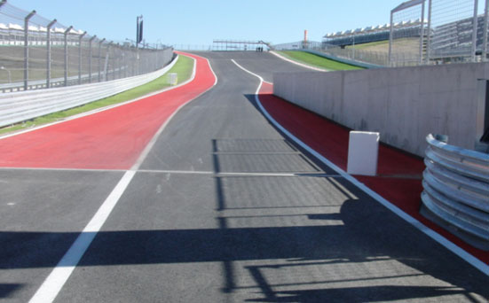
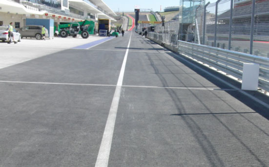

2019 UNITED STATES GRAND PRIX

31 October - 3 November 2019

From The FIA Formula One Race Director Document 2

To All Teams, All Officials Date 31 October 2019

Time 10:35

Title Race Directors' Event Notes

Description Event Notes

Enclosed 2019 United States F1 Grand Prix Race Director Event Notes Doc 2.pdf

Michael Masi

The FIA Formula One Race Director

2019 UNITED STATES GRAND PRIX

31 October – 3 November 2019

From The FIA Formula One Race Director Document 2

To All Officials, All Teams Date 31 October 2019

Time 10.35

EVENT NOTES

1) Matters arising from the Mexican Grand Prix

2) Changes to the circuit

2.1 A section of track in the vicinity of Turn 9 and Turn 10 has been resurfaced.

3) Pit lane map

3.1 Safety Car lines.

3.2 The location of the pit entry and the pit exit.

3.3 Designated garage areas.

3.4 Safety Car position for first lap and rest of race.

3.5 Blue flag marshal at the pit exit.

3.6 Track light panels displaying pit entry status.

4) Pirelli Event Preview

4.1 With reference to Article 24.4(a) of the Sporting Regulations see the attached document provided by the official tyre supplier.

5) Weighing and weighing platform

5.1 The FIA weighing platform will be available for teams to use at the following times, however, no more than 10 team personnel may be present during any visit. Each visit should last no more than 10 minutes unless no other team is waiting in the pit lane:

a) From 13:00 on Thursday until 10:00 on Friday.

b) From 11:30 on Friday until 15:30 on Saturday (between 14:00 and 15:30 each visit will be restricted to five minutes).

c) From when the cars are returned to the teams after qualifying until 20:30 on Saturday.

d) From 08:00 until 09:00 and 11:00 until 12:30 on Sunday.

Any team found to be abusing the time limits set out above, which we will be enforced by FIA security personnel and our own CCTV, will not be permitted to use the weighbridge again during the Event.

1/4

6) Red zones for photographers in the pit lane during practice sessions

6.1 See the attached drawing.

7) Practice starts

7.1 Practice starts may only be carried out on the asphalt on the left-hand side of the fast lane at the pit exit and, for the avoidance of doubt, this includes any time the pit exit is open for the race.

7.2 Drivers should take no more than five seconds to prepare for their car for a practice start if any cars are waiting behind them.

7.3 For reasons of safety and sporting equity, cars may not stop in the fast lane of the pits at any time the pit exit is open without a justifiable reason (a practice start is not considered a justifiable reason).

8) Lines or bollards at the Pit Entry and Pit Exit

8.1 In accordance with Chapter 4 (Section 5) of Appendix L to the ISC drivers must keep to the left of the solid white line at the pit exit when leaving the pits. No part of any car leaving the pits may cross this line.

8.2 For safety reasons drivers must keep to the left of the bollard at the pit entry when they are entering the pits.

8.3 There is a small warning light panel on the left-hand side at the pit entry which will be operated if a car is stopped or going slowly around the corner of the pit entry.

8.4 Except in the cases of force majeure (accepted as such by the Stewards), the crossing by any part of the car, in any direction, of the red painted area between the pit entry and the track, by a driver who, in the opinion of the Stewards, had committed to entering the pit lane is prohibited.

8.5 The dotted white line across the pit entry and the pit exit are the track edges.

9) Observing yellow flags during free practice and qualifying

9.1 Double waved: Any driver passing through a double waved yellow marshalling sector must reduce speed significantly and be prepared to change direction or stop. In order for the stewards to be satisfied that any such driver has complied with these requirements it must be clear that he has not attempted to set a meaningful lap time, for practical purposes this means the driver should abandon the lap (this does not necessarily mean he has to pit as the track could well be clear the following lap).

9.2 Single waved: Drivers should reduce their speed and be prepared to change direction. It must be clear that a driver has reduced speed and, in order for this to be clear, a driver would be expected to have braked earlier and/or discernibly reduced speed in the relevant marshalling sector.

Drivers should not overtake any car in a single waved yellow marshalling sector unless it is clear that a car is slowing with a completely obvious problem, e.g. obvious accident damage or a deflated tyre.

10) Track light panels

10.1 The FIA track light panels have been installed in the positions shown on the circuit map. In accordance with Appendix H to the ISC the light signals have the same meaning as flag signals.

11) Drivers leaving their pit stop position in the pit lane

11.1 For safety reasons, no car should be driven from its pit stop position at any time unless:

a) It has first been driven into the pit stop position having just entered the pit lane from the track, and;

b) It is then driven immediately back onto the track from the pit stop position.

2/4

12) Track Limits

12.1 Turn 19 – Exit

a) A lap time achieved during any practice session or the race by leaving the track and cutting behind the red and white kerb on the exit of Turn 19, as judged by the detection loop in this location, will be invalidated by the stewards.

b) On the third occasion of a driver cutting behind the apex of Turn 4 during the race, he will be shown a black and white flag, any further cutting will then be reported to the stewards.

c) Each time any car passes behind the red and white exit kerb, teams will be informed via the official messaging system.

d) The above requirements will not automatically apply to any driver who is judged to have been forced off the track, each such case will be judged individually.

e) In all cases detailed above, the driver must only re-join the track when it is safe to do so and without gaining a lasting advantage.

f) The above requirements will not automatically apply to any driver who is judged to have been forced off the track, each such case will be judged individually.

13) Fire extinguishers around the circuit

13.1 Indicated by small white boards with a red letter "F" attached to the guardrails or debris fence.

14) Places where drivers may leave the track

14.1 Indicated by fluorescent orange panels on the walls or guardrails.

15) Places to remove cars from the track

15.1 Indicated by fluorescent orange panels on the walls or guardrails.

16) Pit Lane Walk and Support Races team barrier placement

16.1 Team barrier placement prior to and during all support category practice sessions and races and during all pit lane walks: On the white line on the second break in the concrete apron, approximately ten metres from the garages.

16.2 It is not permitted to push cars to the weighing area at any time a support category is in pit lane.

17) In laps during qualifying and reconnaissance laps

17.1 In order to ensure that cars are not driven unnecessarily slowly on in laps during and after the end of qualifying or during reconnaissance laps when the pit exit is opened for the race, drivers must stay below the maximum time set by the FIA between the Safety Car lines shown on the pit lane map.

You will be informed of the maximum time after the first day of practice.

18) Post qualifying parc fermé

18.1 The cameras should be installed and operated in the same way as usual.

19) Operational personnel curfew

19.1 Boards warning anyone attempting to enter the paddock that the curfew is in operation will be placed immediately before the turnstiles at the appropriate times.

20) Removing cars from the grid

20.1 Through the gates in the pit wall in front of grid position 1 or adjacent to grid positions 2 and 14.

3/4

21) Car number light panels for the start

21.1 On the left-hand side of the grid.

22) Track light panel displaying pit entry status

22.1 The light panels indicated on the pit lane map will display a flashing yellow arrow if cars are required to use the pit lane once the Safety Car has been deployed during the race.

22.2 The light panels indicated on the pit lane map will display a flashing red cross if the pit lane is closed at any point during the race.

23) Tyre Blanket Usage during Pit Stops in the Race

23.1 For reasons of safety, tyre blankets are not permitted in the Pit Lane at any time during the race.

24) Lapping during the race

24.1 The ISC requires drivers who are caught by another car about to lap him to allow the faster driver past at the first available opportunity. The F1 Marshalling System has been developed in order to ensure that the point at which a driver is shown blue flags is consistent, rather than trusting the ability of marshals to identify situations that require blue flags.

As it was at the end of last season the system will be set to give a pre-warning when the faster car is within 3.0s of the car about to be lapped, this should be used by the team of the slower car to warn their driver he is soon going to be lapped and that allowing the faster car through should be considered a priority. When the faster car is within 1.2s of the car about to be lapped blue flags will be shown to the slower car (in addition to blue light panels, blue cockpit lights and a message on the timing monitors) and the driver must allow the following driver to overtake at the first available opportunity.

It should be noted that the aim of using F1MS is ensure consistent application of the rules, additional instructions may also be given by race control when necessary.

25) Post race parc fermé

25.1 All cars must enter the pit lane and should proceed directly to the weighing area.

26) Any other business

Michael Masi FIA Formula One Race Director

4/4

|  |  | Grand Prix of United States 01-03/11/2019 (19R19TEX) |  |  |  |  |  |  |  |  |  |  |  |  |  |  |  |  |  |  |  |  |  |  |
| --- | --- | --- | --- | --- | --- | --- | --- | --- | --- | --- | --- | --- | --- | --- | --- | --- | --- | --- | --- | --- | --- | --- | --- | --- |
|  |  | Compound |  |  | FL | FR | RL |  | RR |  |  |  |  |  |  | Ma |  |  |  |  |  |  |  | ndatory race tyres |
|  |  | C2 |  |  | 2A1 | 2A2 | 2A3 |  | 2A4 |  |  |  |  |  |  |  |  |  |  |  |  |  |  | C2 |
|  |  | C3 |  |  | 3B1 | 3B2 | 3B3 |  | 3B4 |  |  |  |  |  |  |  |  |  |  |  |  |  |  | C3 |
|  |  | C4 |  |  | 4C1 | 4C2 | 4C3 |  | 4C4 |  |  |  |  |  |  |  |  |  |  |  |  |  |  |  |
|  |  | INTERMEDIATE |  |  | 33G | 35G | 37G |  | 39G |  |  |  |  |  |  |  |  |  |  |  |  |  |  | Q3 tyre |
|  |  | WET Cross-Over time MINIMUM STARTING PRESSURE, BLISTERING SENSITIVITY, CAMBER LIMIT |  |  | 34F WET > 119% > INT > 113% > DRY | 36F Front (psi) | 37F |  | 39F |  |  |  |  |  | Rear (psi) |  |  |  |  |  |  |  |  | C4 |
|  |  |  | Slicks |  |  | 22.0 |  |  |  |  |  |  |  |  |  | 19.0 |  |  |  |  |  |  |  |  |
|  |  |  | Intermediate |  |  | 21.0 |  |  |  |  |  |  |  |  |  | 19.0 |  |  |  |  |  |  |  |  |
|  |  |  | Wet |  |  | 20.0 |  |  |  |  |  |  |  |  |  | 18.5 |  |  |  |  |  |  |  |  |
| FE EOS Camber limit RE EOS Camber limit -3.50 ° -2.00 ° FE Blistering RE Blistering sensitivity sensitivity Low Low |  | TYRE HEATING STRATEGY (TREAD&SIDEWALL) |  |  |  |  |  |  |  |  |  |  |  |  |  |  |  |  |  |  |  |  |  |  |
| Temperature 0 40 60 80 100 (°C) |  |  |  |  |  |  |  |  |  |  |  |  |  |  |  |  |  |  |  |  |  |  |  |  |
|  |  |  |  | Slicks (front axle) |  | storage |  |  |  |  |  |  |  |  |  |  | m | a | x | . | 3 | h | ma | x. 2h (max. temp = 100°C) |
|  |  |  |  | Slicks (rear axle) |  | storage |  |  |  |  |  |  |  |  |  |  | m | a | x | . | 5 | h |  | (max. temp = 80°C) |
|  |  |  |  | Intermediate |  | storage |  |  |  | m | ax | . | 2 | h |  |  | m | a | x | . | 3 | 0' |  | (max. temp = 80°C) |
|  |  |  |  | Wet |  | storage |  |  |  | m | ax | . | 2 | h |  |  |  |  |  |  |  |  |  | (max. temp = 60°C) |
| (The time limits refer to the period leading up to the start of the session in which the tyres are intended for use). (The temperatures referred to above apply at all times during the event). GENERAL NOTES Teams are kindly reminded that the following parameters will be subjected to FIA checks during the event: - Starting pressure. - Camber at maximum speed. - Maximum blanket temperature. - Tyre swapping. | Tyre Notes |  |  |  |  |  |  |  |  |  |  |  |  |  |  |  |  |  |  |  |  |  |  |  |
| ●Not permitted to switch tyres from their originally allocated position. ●All temperature limits apply to the actual tyre surface temperature, measured with the IR gun detailed in TD029-15. ●Do not subject tyres to large deformation or heavy impact. ●STORAGE temperature is the recommended temperature the tyre can stay in ●Do not leave fitted tyres exposed at an air temperature lower than 15°C blankets without time limit. and/or any UV emission. ●BLANKET HEATING TIME for each temperature range to be counted from the ● Revised prescriptions could be issued during the race weekend in moment the blanket control unit is set to reach its targeted temperature within accordance with TD/007-16. its correspondent interval. | ●Not permitted to switch tyres from their originally allocated position. ●Do not subject tyres to large deformation or heavy impact. ●Do not leave fitted tyres exposed at an air temperature lower than 15°C and/or any UV emission. ● Revised prescriptions could be issued during the race weekend in accordance with TD/007-16. |  |  |  |  |  |  | ●All temperature limits apply to the actual tyre surface temperature, measured with the IR gun detailed in TD029-15. ●STORAGE temperature is the recommended temperature the tyre can stay in blankets without time limit. ●BLANKET HEATING TIME for each temperature range to be counted from the moment the blanket control unit is set to reach its targeted temperature within its correspondent interval. |  |  |  |  |  |  |  |  |  |  |  |  |  |  |  |  |

enaL 9102

rebotcO

tiP 13– 1 noisreV

|  | potS noitisoP tiP |
| --- | --- |
| spaL toH 1F |  |
| smailliW |  |
| smailliW | smailliW |
| smailliW |  |
| ossoR oroT | ossoR oroT |
| ossoR oroT |  |
| ossoR oroT |  |
| oemoR aflA | oemoR aflA |
| oemoR aflA |  |
| oemoR aflA | gnicaR tnioP |
| tnioP gnicaR |  |
| tnioP gnicaR |  |
| tnioP gnicaR |  |
| neraLcM | neraLcM |
| neraLcM |  |
| neraLcM | saaH |
| saaH |  |
| saaH |  |
| saaH |  |
| tluaneR | tluaneR |
| tluaneR |  |
| tluaneR | lluB deR |
| lluB deR |  |
| lluB deR |  |
| lluB deR |  |
| irarreF | irarreF |
| irarreF |  |
| irarreF | sedecreM |
| sedecreM |  |
| sedecreM |  |
| sedecreM |  |
| 1 alumroF |  |
| AIF | detangiseD egaraG saerA |
| AIF |  |

43 galF lahsram 33

eulB 23

2 13 eniL

RAC ENAL YTEFAS 03 sdnE TIXE 92 noitisoP ENAL TIP TSAF 82

TIP 72 eloP 62 xirP 52

RAC dnarG 42 ecaR YTEFAS 32 22

12 setatS 02 91

detinU 81 segaraG 71

61

9102 1F 51 41

31

MORF 21 EREH 11 DEREVOCER DECALP stratS 01

9 ENAL KCART 8 ENAL SRAC TIP 7

X RAC TSAF paL YTEFAS tsriF YRTNE 6

5 TIP 4

3 eniL 2 1 lortnoC drallob X 1 slenap eniL yrtnE RAC yrtnE sutatS tiP YTEFAS tiP dna

