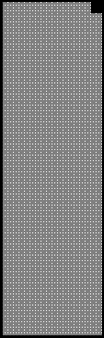
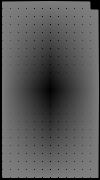
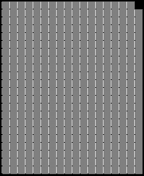

2019 UNITED STATES GRAND PRIX

31 October - 3 November 2019

From The FIA Formula One Race Director Document 47

To All Teams, All Officials Date 03 November 2019

Time 10:20

Title Race Directors Note - Post Race Interviews

Description Post Race Interviews

Enclosed 2019 United States F1 Grand Prix Post Race Interviews Doc 47.pdf

Michael Masi

The FIA Formula One Race Director

2019 UNITED STATES GRAND PRIX

31 October – 3 November 2019

From The FIA Formula One Race Director Document 47

To All Officials, All Teams Date 3 November 2019

Time 10.20

NOTE TO TEAMS

In addition to the provisions of the 2019 Formula One Sporting Regulations – Appendix 3 Podium

Ceremony, the procedure must be followed.

The post-race interview procedure will remain as in the previous race with the top three drivers again being

interviewed as soon as they get out of their cars.

We would like to ask for your co-operation in following the simple procedure set out below:

• Drivers who finish the race in the top three positions will be required to enter pit lane and proceed

directly to the 1,2,3 boards which will be located beneath the podium immediately prior to the FIA

Garages.

• Once out of their cars, the interviews will take place in this designated area. The interviewer will

be Martin Brundle.

• Drivers must not interfere with parc fermé protocols in any way.

• At the end of the live interviews, these drivers will be weighed by the FIA in the FIA garage.

• These drivers will be escorted by the FIA Press Delegate to the 1st floor of the Pit Building, where

the cool down area is located.

• At the end of podium ceremony, the top three drivers will go downstairs to the TV pen, located at the

Pit Entry end of the Paddock behind the Race Control Building and they may be accompanied by

their press officers.

• After the TV pen interviews, the top three drivers will be escorted to the FIA Press Conference

located in the Media Centre Building.

• Parc fermé for all finishers outside of the top three will be located at the Pit Entry behind the top three

cars.

• Drivers classified from 4th and beyond must proceed directly to the TV pen immediately after they

have been weighed in the parc fermé, located in the FIA garage.

• Drivers who retired during the race are requested to go to the TV pen as soon as they have come

back into the paddock.

• If the World Championship for Drivers is decided at this race, there are two potential scenarios:

If the driver is classified in the top three, they will stop in their designated position indicated on o the attached map underneath the podium and conduct the normal TV pen and press conference

activities.

1/2

If the driver is classified outside the top three, they will stop in front of the top three in parc fermé o as indicated in the attached map. They will then complete their TV pen obligations before going

to the Media Centre for a special champions’ press conference.

Please see the attached Post Race Parc Fermé Diagram.

Michael Masi FIA Formula One Race Director

2/2

ecaR

| 3 | 3 2 e c n e F 1 |
| --- | --- |
| muidoP | muidoP |

- emreF 9102

rebotcO

craP 13– 1 noisreV

xirP eht ni 3 pot ton dnarG fI

setatS ecneF

noipmahC dlroW

detinU

ts dr 1 dn 3 2 s’rehpargotohP

9102

e c n e namaremaC F FR nameriF VT

srac ereh llaW gniniameR dekraP tiP

s’rehpargotohP aera

gnitiaw
