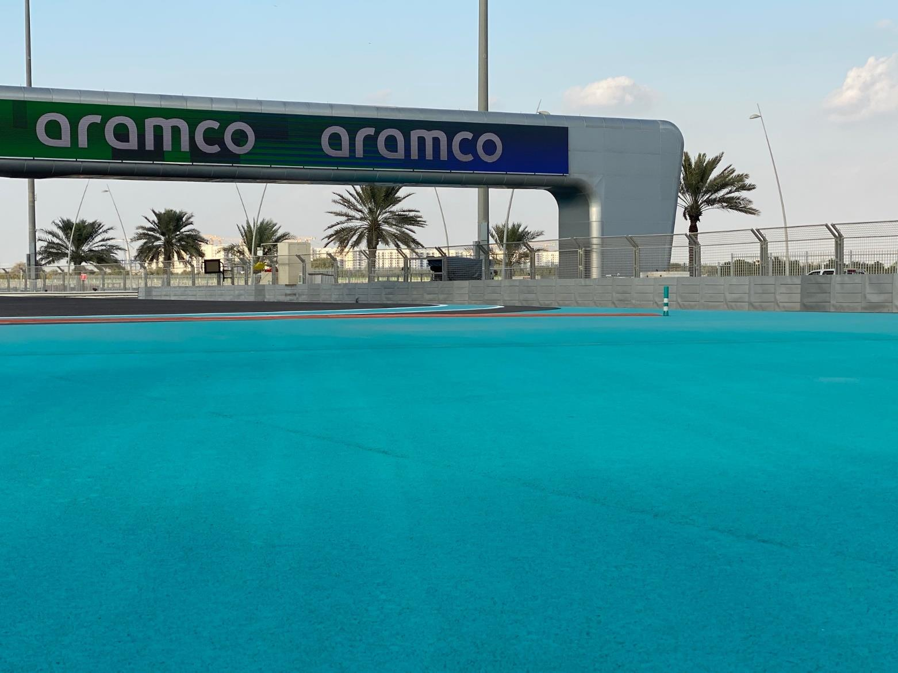

2020 ABU DHABI GRAND PRIX

10 - 13 December 2020

From The FIA Formula One Race Director Document 19

To All Teams, All Officials Date 11 December 2020

Time 20:31

Title Race Directors' Event Notes Version 3

Description Event Notes Version 3

Enclosed 2020 Abu Dhabi F1 Grand Prix Event Notes V3 Doc 19 111220.pdf

Michael Masi

The FIA Formula One Race Director

2020 A D G P BU HABI RAND RIX

10 - 13 December 2020

From The FIA Formula One Race Director Document 19

To All Teams, All Officials Date 11 December 2020

Time 20:35

EVENT NOTES VERSION 3 General Instructions

1) Pit lane map

1.1 Safety Car lines.

1.2 The location of the pit entry and the pit exit.

1.3 Designated garage areas.

1.4 Safety Car position for first lap and rest of race.

1.5 Blue flag marshal at the pit exit.

1.6 Track light panels displaying pit entry status.

2) Pirelli Event Preview

2.1 With reference to Article 24.4(a) of the Sporting Regulations see the attached document provided by the official tyre supplier.

3) Red zones for photographers in the pit lane during practice sessions

3.1 See the attached drawing.

4) Track light panels

4.1 The FIA track light panels have been installed in the positions shown on the circuit map. In accordance with Appendix H to the ISC the light signals have the same meaning as flag signals.

5) Track light panel displaying pit entry status

5.1 The light panels indicated on the pit lane map will display a flashing yellow arrow if cars are required to use the pit lane once the Safety Car has been deployed during the race.

5.2 The light panel indicated on the pit lane map will display a flashing red cross if the pit lane is closed at any point during the race.

6) Drivers leaving their pit stop position in the pit lane

6.1 For safety reasons, no car should be driven from its pit stop position at any time unless:

a) It has first been driven into the pit stop position having just entered the pit lane from the track,

and;

b) It is then driven immediately back onto the track from the pit stop position.

1/6

7) Observing yellow flags during free practice and qualifying

7.1 Double waved: Any driver passing through a double waved yellow marshalling sector must reduce speed significantly and be prepared to change direction or stop. In order for the stewards to be

satisfied that any such driver has complied with these requirements it must be clear that he has not

attempted to set a meaningful lap time, for practical purposes this means the driver should abandon

the lap (this does not necessarily mean he has to pit as the track could well be clear the following

lap).

7.2 Single waved: Drivers should reduce their speed and be prepared to change direction. It must be clear that a driver has reduced speed and, in order for this to be clear, a driver would be expected

to have braked earlier and/or discernibly reduced speed in the relevant marshalling sector.

Drivers should not overtake any car in a single waved yellow marshalling sector unless it is clear that

a car is slowing with a completely obvious problem, e.g. obvious accident damage or a deflated tyre.

8) In laps during qualifying and reconnaissance laps

8.1 In order to ensure that cars are not driven unnecessarily slowly on in laps during and after the end of qualifying or during reconnaissance laps when the pit exit is opened for the race, drivers must stay

below the maximum time set by the FIA between the Safety Car lines shown on the pit lane map.

You will be informed of the maximum time after the first day of practice.

9) Parc Fermé Cameras

9.1 To assist with the revised FIA Event procedures, the Parc Fermé cameras must be uncovered and operational at all times during the Event.

10) Operational personnel curfew

10.1 Boards warning anyone attempting to enter the paddock that the curfew is in operation will be placed immediately before the turnstiles at the appropriate times.

10.2 At this Event, Personnel will be permitted to enter the Paddock 30 minutes prior to the curfew to assist social distancing. No work is permitted to be undertaken until the curfew has ended.

11) Tyre Blanket Usage during Pit Stops in the Race

11.1 For reasons of safety, tyre blankets are not permitted in the Pit Lane at any time during the race.

12) Lapping during the race

12.1 The ISC requires drivers who are caught by another car about to lap him to allow the faster driver past at the first available opportunity. The F1 Marshalling System has been developed in order to

ensure that the point at which a driver is shown blue flags is consistent, rather than trusting the ability

of marshals to identify situations that require blue flags.

As it was at the end of last season the system will be set to give a pre-warning when the faster car

is within 3.0s of the car about to be lapped, this should be used by the team of the slower car to warn

their driver he is soon going to be lapped and that allowing the faster car through should be

considered a priority. When the faster car is within 1.2s of the car about to be lapped blue flags will

be shown to the slower car (in addition to blue light panels, blue cockpit lights and a message on the

timing monitors) and the driver must allow the following driver to overtake at the first available

opportunity.

It should be noted that the aim of using F1MS is ensure consistent application of the rules, additional

instructions may also be given by race control when necessary.

2/6

Event Specific Instructions

13) Formula 1 Sporting Regulations Article 21.6

13.1 In accordance with the provisions of Article 21.6a) i), this Event is a Closed Event.

14) Changes to the circuit

14.1 Resurfacing has taken place at the following locations:

a) Pit Straight in the vicinity of the Control Line.

b) A small section between Turn 2 and Turn 3.

c) Two sections on the straight between Turn 7 and Turn 8.

d) A section between Turn 19 and Turn 20.

e) A section at the exit of Turn 20.

f) Pit Lane Entry opposite the Helipad.

14.2 The bumps on the right-hand side between Turns 8-9 and Turns 11-12 have been constructed in concrete.

15) Specific Technical Procedures for Closed Events

15.1 The provisions of Technical Directive Ref: TD/039-20 C and the “Pirelli HSE procedures” must be complied with at all times during the Event.

15.2 Any tyres that are removed from a car and could be re-used during a session should be presented for scanning before being rewrapped and reheated. If time constraints do not permit this then all

tyres used during a session must be presented to the tyre checker at the front of the garage the end

of any session. This applies to dry, wet and intermediate tyres.

15.3 Both TD/039-20 C and the “Pirelli HSE procedures” will be amended after the Event to reflect any additional operational requirements as required.

16) Weighing and weighing platform

16.1 The FIA weighing platform will be available for teams to use at the following times, however, no more than 8 team personnel may be present during any visit. Each visit should last no more than 10

minutes unless no other team is waiting in the pit lane:

a) From 13:00 on Thursday until 12:00 on Friday.

b) From 14:30 on Friday until 16:30 on Saturday (between 15:00 and 16:30 each visit will be

restricted to five minutes).

c) From when the cars are returned to the teams after qualifying until 21:30 on Saturday.

d) From 12:00 until 13:00 and 15:00 until 16:30 on Sunday.

Any team found to be abusing the time limits set out above, which we will be enforced by FIA security

personnel and our own CCTV, will not be permitted to use the weighbridge again during the Event.

17) Practice starts

17.1 Practice starts may only be carried out on the track at the end of each free practice session, none may be carried out in the pit lane. Any car on the track when the chequered flag is shown may then

complete another lap and, instead of entering the pits, proceed to the grid and carry out a practice

start.

All drivers carrying out a practice must do so by pulling as far forward on the grid as possible and, if

necessary, should wait for others to carry out a start before getting to a grid position further forward.

Under no circumstances should a driver make a practice start if another car is still stationary in front

of him on the same side of the grid.

3/6

If any driver appears to be disregarding any of the above a red flag will be displayed and the

possibility to carry out any further starts will be immediately terminated.

17.2 For reasons of safety and sporting equity, cars may not stop in the fast lane at any time the pit exit is open without a justifiable reason (a practice start is not considered a justifiable reason).

18) Lines or bollards at the Pit Entry and Pit Exit

18.1 In accordance with Chapter 4 (Section 5) of Appendix L to the ISC drivers must keep to the left of the solid white line at the pit exit when leaving the pits.

18.2 For safety reasons drivers must keep to the right of the solid white line at the pit entry when they are entering the pits.

18.3 Except in the cases of force majeure (accepted as such by the Stewards), the crossing by any part of the car, in any direction, of the red and white painted area, between the pit entry and the track, by

a driver who, in the opinion of the Stewards, had committed to entering the pit lane is prohibited.

19) DRS

19.1 DRS Detection will be automatically disabled in each individual zone if any of the light panels in that particular zone are displaying yellow. The zone and corresponding light panels are as follows:

a) Zone 1: Panels 7, 8, 9

b) Zone 2: Panels 10, 11, 12

20) Track Limits

20.1 Drivers are reminded of the provisions of Article 27.3 of the Sporting Regulations.

20.2 Support Category Pit Exit – Entry to Turn 11

a) The dotted white line across the pit exit of the support category pit lane is the track edge.

20.3 Turns 11, 12 and 13

a) For safety reasons, any driver who either passes to the right of or runs over the fluorescent

orange kerb sections on the driver’s right between Turns 11 and 12, must re-join the track by

driving around the end of the fluorescent orange kerb and bollard on the driver’s left between

Turns 12 and 13. See attached image on page 6.

20.4 Turn 21 - Exit

a) A lap time achieved during any practice session or the race by leaving the track on the exit of

Turn 21, will result in that lap time and the immediately following lap time being invalidated by

the stewards. A driver will be judged to have left the track if no part of the car remains in contact

with the track.

b) Each time any car fails to negotiate Turn 21 Exit by using the track, teams will be informed via

the official messaging system.

c) On the third occasion of a driver failing to negotiate Turn 21 Exit by using the track during the

race, he will be shown a black and white flag, any further cutting will then be reported to the

stewards.

20.5 General - Turn 11, 12, 13 and Turn 21 Exit

a) In the case detailed above, the driver must only re-join the track when it is safe to do so and

without gaining a lasting advantage.

b) The above requirement will not automatically apply to any driver who is judged to have been

forced off the track, each such case will be judged individually.

21) Fire extinguishers around the circuit

21.1 Indicated by small orange boards with a white letter ‘F’ on the barriers and debris fences.

4/6

22) Places where drivers may leave the track

22.1 Egress is available behind all guardrails

23) Places to remove cars from the track

23.1 Indicated by fluorescent orange panels on the barriers.

23.2 Should a car stop on the track during a session, the driver must keep all of their protective clothing (Helmet, Gloves, etc) on until they have returned to their garage.

24) Sporting Regulations Article 36.4 and Article 42.3

24.1 In addition to the provisions of Article 36.4 and Article 42.3, and for reasons of safety, tyre blankets must be disconnected from any power supply at the five-minute signal and must not be reconnected

during the start procedure, unless the delayed start signal is shown.

25) Access to the grid prior to the Start Procedure

25.1 To assist social distancing in accessing the grid prior to the commencement of the start procedure, Team personnel and equipment will be granted access to the grid from 1610hrs on Sunday 13th

December.

26) Removing cars from the grid

26.1 Through the two gates in the pit wall, the first located adjacent to grid position 7 and the 2nd located adjacent to grid position 17.

27) Car number light panels for the start

27.1 On the right-hand side of the grid.

28) Sporting Regulation Article 42.3

28.1 For reasons of safety, Article 42.3 is amended as follows with the additions displayed with double underline:

42.3 When the five minute signal is shown all cars must have their wheels fitted, after this signal

wheels may only be removed if the car has been moved out of the fast lane or during a further

race suspension.

A penalty under Article 38.3(d) will be imposed on any driver whose car did not have all its

wheels fully fitted at the five minute signal or has any of its wheels changed before it leaves

the pit lane after the race has been resumed.

At the two minute point any cars between the safety car and the leader, in addition to any cars

that had been lapped by the leader at the time the race was suspended, will be allowed to

leave the pit lane and complete a further lap, without overtaking, enter the pit lane and then

join the line of cars behind the safety car which left the pit lane when the race was resumed.

29) Post-race parc fermé

29.1 All cars must enter the pit lane and, with the exception of the first three, should be driven directly to the weighing area at the pit entry. The first three must follow the post-race procedure which will be

distributed prior to the start of the race.

30) Any other business

Michael Masi

FIA Formula One Race Director

5/6

IMAGE 1 – TURN 11, 12, 13 RUN-OFF AREA

BUMP ACROSS RUN-OFF AREA

BOLLARD AT THE END OF THE BUMP

6/6

enaL 0202

| 1 | 1 alumroF |  | saerA detangiseD egaraG |
| --- | --- | --- | --- |
| 2 | AIF |  |  |
| 3 | AIF |  |  |
| 4 | AIF |  |  |
| 5 | sedecreM |  | sedecreM |
| 6 | sedecreM |  |  |
| 7 | sedecreM |  |  |
| 8 | irarreF | sedecreM |  |
| 9 | irarreF |  | irarreF |
| 01 | irarreF |  |  |
| 11 | irarreF |  |  |
| 21 | lluB deR |  | lluB deR |
| 31 | lluB deR |  |  |
| 41 | lluB deR |  |  |
| 51 | neraLcM | lluB deR |  |
| 61 | neraLcM |  | neraLcM |
| 71 | neraLcM |  |  |
| 81 | neraLcM |  |  |
| 91 | tluaneR |  | tluaneR |
| 02 | tluaneR |  |  |
| 12 | tluaneR |  |  |
| 22 | iruaT ahplA | tluaneR | iruaTahplA |
| 32 | iruaTahplA |  |  |
| 42 | iruaTahplA |  |  |
| 52 | iruaTahplA |  | tnioP gnicaR |
| 62 | tnioP gnicaR |  |  |
| 72 | tnioP gnicaR |  |  |
| 82 | tnioP gnicaR |  | oemoR aflA |
| 92 | tnioP gnicaR | oemoR aflA |  |
| 03 | oemoR aflA |  |  |
| 13 | oemoR aflA |  |  |
| 23 | oemoR aflA |  | saaH |
| 33 | saaH |  |  |
| 43 | saaH |  |  |
| 53 | saaH |  |  |
| 63 | saaH | smailliW | smailliW |
| 73 | smailliW |  |  |
| 83 | smailliW |  |  |
| 93 | smailliW |  |  |
| 04 |  |  |  |

rebmeceD tiP

2 01 eniL – 2 RAC noisreV sdnE YTEFAS ENAL noitisoP

TIP eloP

ENAL

TSAF TIXE

TIP

galF lahsram

xirP eulB RAC ecaR YTEFAS dnarG

ibahD s e g a ar G 1 F ubA

MORF stratS EREH 0202 DEREVOCER ENAL DECALP

TIP er KCART w T o SRAC

CM

RAC paL YRTNE YTEFAS tsriF ENAL TIP TSAF

X X

1 slenap eniL yrtnE

RAC sutatS tiP YTEFAS

potS

tiP

| Grand Prix of Abu Dhabi 11/12-13/12/2020 (20R17ABU) |  |  |  |  |  |  |  |  |
| --- | --- | --- | --- | --- | --- | --- | --- | --- |
| Compound |  | FL | FR | RL | RR |  |  |  |
| C3 |  | 3A1 | 3A2 | 3A3 | 3A4 |  |  |  |
| C4 |  | 4B1 | 4B2 | 4B3 | 4B4 |  |  |  |
| C5 |  | 5C1 | 5C2 | 5C3 | 5C4 |  |  |  |
| INTERMEDIATE |  | 33X | 35X | 37X | 39X |  | Q3 tyre |  |
| WET |  | 34Y | 36Y | 37Y | 39Y |  | C5 |  |
| MINIMUM STARTING PRESSURE, BLISTERING SENSITIVITY, CAMBER LIMIT |  |  | Front (psi) |  |  | Rear (psi) |  |  |
|  | Slicks |  | 23,0 |  |  | 20,0 |  |  |
|  | Intermediate |  | 21,0 |  |  | 20,0 |  |  |
|  | Wet | FE EOS Camber Limit RE EOS Camber limit -3,75° | 20,0 |  |  | 19,0 | -2,00 ° |  |
| FE Blistering RE Blistering |  |  |  |  |  |  |  |  |
| sensitivity sensitivity |  |  |  |  |  |  |  |  |
| Low |  |  |  |  |  |  |  | Low |

GENERAL NOTES Teams are kindly reminded that the following parameters will be subjected to FIA checks during the event: - Starting pressure. - Camber at maximum speed. - Maximum blanket temperature. - Tyre swapping.

| TyreNotes |  |
| --- | --- |
| •Not permittedto switch tyres from their originally allocated position. •Do not subject tyres tolarge deformation or heavy impact. •Do not leave fitted tyres exposed at an airtemperature lower than 15°C and/or any UV emission. •Revisedprescriptions could be issued dring the race weekend in accordance with TD/036-18. | •Alltemperature limits apply to the actual tyre surface temperature, measured with the IR gun detailed in the Appendix to the Technical and Sporting regulations. •STORAGE temperature is the recommended temperature the tyre can stay in blanketswithout time limit. •BLANKET HEATING TIME for each temperature range to be countedfrom the moment the blanket control unit is set to reach its targeted temperature within its correspondent interval. |
