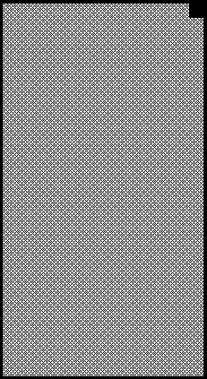
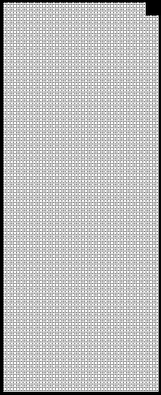

2020 ABU DHABI GRAND PRIX

10 - 13 December 2020

From The FIA Formula One Race Director Document 37

To All Teams, All Officials Date 13 December 2020

Time 14:53

Title Race Directors Note - Post Race Procedure

Description Post Race Procedure

Enclosed 2020 Abu Dhabi F1 Grand Prix Post Race Procedure Doc 37 131220.pdf

Michael Masi

The FIA Formula One Race Director

2020 A D G P BU HABI RAND RIX

10 - 13 December 2020

From The FIA Formula One Race Director Document 37

To All Teams, All Officials Date 13 December 2020

Time 14:55

In addition to the provisions of the 2020 Formula One Sporting Regulations – Appendix 3 Podium

Ceremony, as this is a Closed Event the Podium Ceremony procedure detailed below must be followed.

The initial parts of this Post Race Procedure will be substantially different to previous races.

Podium Ceremony and Post Race Interview Procedure:

• The master of ceremonies will be appointed by the FIA to conduct and take responsibility for the

entire podium ceremony.

• Drivers who finish the race in the top three positions are permitted to drive to the start/finish straight,

where there will be the opportunity for post-championship celebrations should they wish to do so.

Otherwise they should proceed directly to the pit lane entry where they will find the boards showing

positions from 1,2, 3 located in front of the Race Control Tower.

• Should a driver decide to celebrate on the start/finish straight, they must do so near to the finish line,

as their car will be pushed back through the gate in the pit wall at this location and into parc fermé.

• Other than the team mechanics (with cooling fans if necessary), officials and FIA pre-approved

television crews and the three FIA approved photographers, no one else will be allowed in the

designated area at this time (no driver physios nor team PR personnel).

• Once out of their cars, the top three Drivers will be weighed by the FIA in Parc Fermé. Each Driver

must remain fully attired until after they have been weighed (e.g.: Helmet, Gloves, etc.).

• For the duration of the Podium Ceremony and Post Race Interview Procedure, the Drivers finishing

in race in positions 1, 2, 3 must remain attired only in their Driving Suits, 'done up' to the neck, not

opened to the waist. For the avoidance of doubt this includes a Medical Face Mask or Team Branded

Face Mask only as provided in the Parc Fermé Area by the master of ceremonies.

• After the Drivers have been weighed, the post-race interviews will take place in this designated area,

and the interviewer will be Martin Brundle.

• Drivers must not interfere with Parc Fermé protocols in any way.

• During this time, team members of the top three drivers will be permitted to access their allocated

areas in the Pit Lane.

• Once the interviews have been completed, the cool down area, where water and towels will be

positioned for each Driver, will be located underneath the podium. No other drinks are permitted in

the Parc Fermé area.

• Each Driver will be given their Pirelli Caps which will also contain a Medical Face Mask both of which

must be worn during the Podium Ceremony.

• The drivers will then be escorted to the permanent Podium area where the 1, 2, 3 Rostrum and Dias

will be located.

• When the Drivers are ready, an announcement for the Podium Ceremony will take place with the 3rd

and 2nd placed Drivers introduced to move to their respective Podium Dias steps.

1/3

• The Winning Constructor representative will be announced and will move to their position on the

podium.

• The Winning Driver will then be announced who will move to his position on the Podium.

• The National Anthems will then take place and flags will be displayed.

• There will be two Dignitaries on the Podium to present the trophies.

• The Master of Ceremonies will present all 4 trophies.

• The Trophy Presentations will take place on the Podium in the following order:

o Winning Driver

o A representative of the Winning Constructor

o 2nd Place Driver

o 3rd Place Driver

• The winning Celebrations will the take place.

• For the duration of the TV pen interviews and FIA Post Race Press Conference, all Drivers finishing

must remain attired in their respective teams’ uniform only. For the avoidance of doubt this includes

a Medical Face Mask or Team Branded Face Mask.

• Following the Podium Ceremony, the top three drivers will be escorted by the FIA Media Delegate

to the TV pen located at the Pit Entry end of the Formula 1 Paddock where they may be accompanied

by their press officers.

• At the end of the TV pen, the top three drivers will go to the FIA Press Conference, located on the

ground floor of the Media Centre Building at the back of the paddock.

• Drivers classified from 4th and beyond must proceed directly to the TV pen immediately after they

have been weighed in the Parc Fermé, located in the FIA garage. Each Driver must remain fully

attired until after they have been weighed (e.g.: Helmet, Gloves, etc.).

• Drivers who retired during the race are required to go to the TV pen as soon as they have come back

into the paddock.

Please see the attached Post Race Podium Ceremony and Parc Fermé Diagram.

Michael Masi

FIA Formula One Race Director

2/3

ecaR

- emreF 0202

rebmeceD

craP 21– 2 noisreV

srehsinif

ereh

gniniameR dekrap

xirP

dnarG

ibahD

dn dr 2 ts 3 1 ubA ecneF

0202

muidoP srehpargotohP

namaremaC FR VT

pordkcaB

ecneF

ytiruceS
