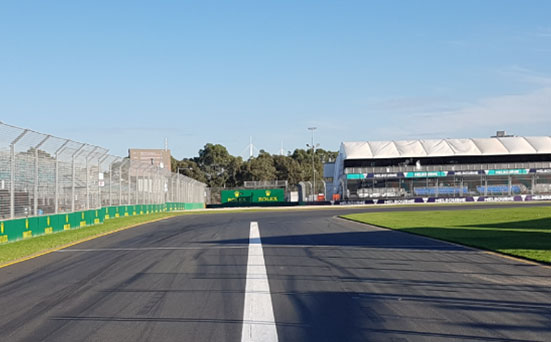
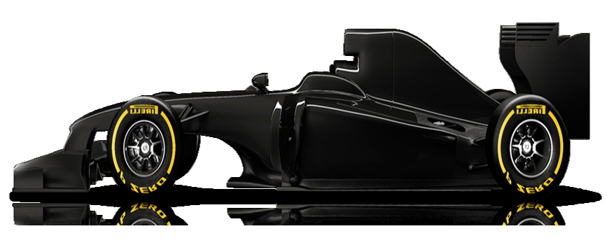
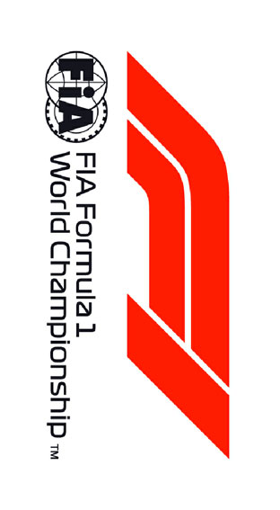

2020 AUSTRALIAN GRAND PRIX

12 - 15 March

From The FIA Formula One Race Director Document 2

To All Teams, All Officials Date 12 March 2020

Time 10:33

Title Race Directors' Event Notes

Description Event Notes

Enclosed 2020 Australian F1 Grand Prix - Race Directors Event Notes Doc 02.pdf

Michael Masi

The FIA Formula One Race Director

2020 A G P USTRALIAN RAND RIX

12 – 15 March 2020

From FIA Formula One Race Director Document 2

To Formula One Team Managers Date 12 March 2020

Time 10:30

General Instructions

1) Pit lane map

1.1 Safety Car lines.

1.2 The location of the pit entry and the pit exit.

1.3 Designated garage areas.

1.4 Safety Car position for first lap and rest of race.

1.5 Blue flag marshal at the pit exit.

1.6 Track light panels displaying pit entry status.

2) Pirelli Event Preview

2.1 With reference to Article 24.4(a) of the Sporting Regulations see the attached document provided by the official tyre supplier.

3) Red zones for photographers in the pit lane during practice sessions

3.1 See the attached drawing.

4) Track light panels

4.1 The FIA track light panels have been installed in the positions shown on the circuit map. In accordance with Appendix H to the ISC the light signals have the same meaning as flag signals.

5) Drivers leaving their pit stop position in the pit lane

5.1 For safety reasons, no car should be driven from its pit stop position at any time unless:

a) It has first been driven into the pit stop position having just entered the pit lane from the track,

and;

b) It is then driven immediately back onto the track from the pit stop position.

6) Observing yellow flags during free practice and qualifying

6.1 Double waved: Any driver passing through a double waved yellow marshalling sector must reduce speed significantly and be prepared to change direction or stop. In order for the stewards to be

satisfied that any such driver has complied with these requirements it must be clear that he has not

attempted to set a meaningful lap time, for practical purposes this means the driver should abandon

the lap (this does not necessarily mean he has to pit as the track could well be clear the following

lap).

1/4

6.2 Single waved: Drivers should reduce their speed and be prepared to change direction. It must be clear that a driver has reduced speed and, in order for this to be clear, a driver would be expected

to have braked earlier and/or discernibly reduced speed in the relevant marshalling sector.

Drivers should not overtake any car in a single waved yellow marshalling sector unless it is clear that

a car is slowing with a completely obvious problem, e.g. obvious accident damage or a deflated tyre.

7) In laps during qualifying and reconnaissance laps

7.1 In order to ensure that cars are not driven unnecessarily slowly on in laps during and after the end of qualifying or during reconnaissance laps when the pit exit is opened for the race, drivers must stay

below the maximum time set by the FIA between the Safety Car lines shown on the pit lane map.

You will be informed of the maximum time after the first day of practice.

8) Post qualifying parc fermé

8.1 The cameras should be installed and operated in the same way as usual.

9) Operational personnel curfew

9.1 Boards warning anyone attempting to enter the paddock that the curfew is in operation will be placed immediately before the turnstiles at the appropriate times.

10) Lapping during the race

10.1 The ISC requires drivers who are caught by another car about to lap him to allow the faster driver past at the first available opportunity. The F1 Marshalling System has been developed in order to

ensure that the point at which a driver is shown blue flags is consistent, rather than trusting the ability

of marshals to identify situations that require blue flags.

As it was at the end of last season the system will be set to give a pre-warning when the faster car

is within 3.0s of the car about to be lapped, this should be used by the team of the slower car to warn

their driver he is soon going to be lapped and that allowing the faster car through should be

considered a priority. When the faster car is within 1.2s of the car about to be lapped blue flags will

be shown to the slower car (in addition to blue light panels, blue cockpit lights and a message on the

timing monitors) and the driver must allow the following driver to overtake at the first available

opportunity.

It should be noted that the aim of using F1MS is ensure consistent application of the rules, additional

instructions may also be given by race control when necessary.

2/4

Event Specific Instructions

11) Changes to the circuit

11.1 The asphalt path located on the verge between the Pit Exit and the Track has been re-established and smoothed out.

11.2 The left-hand barrier between Turns 2 and 3 has been realigned closer to the edge of the Track.

11.3 The gate across the support pit entry has been removed.

12) Weighing and weighing platform

12.1 The FIA weighing platform will be available for teams to use at the following times, however, no more than 10 team personnel may be present during any visit. Each visit should last no more than 10

minutes unless no other team is waiting in the pit lane:

a) From 15:30 on Thursday until 11:00 on Friday.

b) From 12:30 on Friday until 16:30 on Saturday (between 15:00 and 16:30 each visit will be

restricted to five minutes).

c) From when the cars are returned to the teams after qualifying until 21:30 on Saturday.

d) From 11:00 until 12:00 and 14:00 until 15:30 on Sunday.

Any team found to be abusing the time limits set out above, which we will be enforced by FIA security

personnel and our own CCTV, will not be permitted to use the weighbridge again during the Event.

13) Pit Lane Walk and Support Races team barrier placement

13.1 Team barrier placement prior to and during all support category practice sessions and races and during all pit lane walks: On the joint between the asphalt and the concrete.

13.2 It is not permitted to push cars to the weighing area at any time a support category is in pit lane.

14) Practice starts

14.1 Practice starts during practice sessions may also only be carried out on the right at the pit exit before the end of the pit wall. Drivers must leave adequate room on their left for another driver to pass.

14.2 Practice starts during the time the pit exit is open for the race (15.30-15.40 on Sunday) may be carried out on the right in the pit exit before the point at which the white line on the track starts. Room

must always be left on the driver’s left to allow other cars to pass.

14.3 For reasons of safety and sporting equity, cars may not stop in the fast lane at any time the pit exit is open without a justifiable reason (a practice start is not considered a justifiable reason).

15) Lines or bollards at the Pit Entry and Pit Exit

15.1 In accordance with Chapter 4 (Section 5) of Appendix L to the ISC drivers must keep to the right of the solid white line at the pit exit when leaving the pits. No part of any car leaving the pits may cross

this line.

15.2 For safety reasons, drivers must keep to the right of the bollard immediately at the pit entry when they are entering the pits.

15.3 Except in the cases of force majeure (accepted as such by the Stewards), the crossing by any part of the car, in any direction, of the white line immediately prior to the pit entry or the red and white

painted area between the pit entry and the track, by a driver who, in the opinion of the Stewards, had

committed to entering the pit lane is prohibited.

16) Fire extinguishers around the circuit

16.1 Indicated by white boards with a red fire extinguisher image attached to the debris fences.

3/4

17) Places where drivers may leave the track

17.1 Indicated by white boards with a green running man image attached to the debris fences.

18) Places to remove cars from the track

18.1 Indicated by fluorescent orange panels on the barriers.

19) Removing cars from the grid

19.1 Through the Pit Exit or the gate in the pit wall adjacent to grid position 10.

20) Car number light panels for the start

20.1 On the left-hand side of the grid.

21) Track light panel displaying pit entry status

21.1 The light panels indicated on the pit lane map will display a flashing yellow arrow if cars are required to use the pit lane once the Safety Car has been deployed during the race.

21.2 The light panels indicated on the pit lane map will display a flashing red cross if the pit lane is closed at any point during the race.

22) Post race parc fermé

22.1 All cars must enter the pit lane and, with the exception of the first three, should be driven directly to the weighing area. The first three must be driven down the pit lane to the control tower without

stopping.

22.2 If a car stops between the Line and turn 1, having taken the chequered flag, it would be very helpful if the team concerned could assist the marshals to bring the car back to the pit lane. Getting a

recovery vehicle to the area after the track invasion is very difficult and time consuming.

23) Any other business

Michael Masi

FIA Formula One Race Director

4/4

enaL 1 eniL yrtnE sutatS slenap 0202 RAC tiP tiP hcraM YTEFAS X 21 – 1 noisreV X 14 04 93 83 dralloB 73 RAC 63 paL YTEFAS 53 tsriF YRTNE 43 ENAL 33 TIP TSAF 23 13 03 92 stratS 82 ENAL 72 xirP 62 TIP 52

|  | egaraG saerA detangiseD |
| --- | --- |
| AIF |  |
| AIF |  |
| AIF |  |
| AIF |  |
| AIF | smailliW |
| smailliW |  |
| smailliW |  |
| smailliW |  |
| saaH / smailliW | saaH |
| saaH |  |
| saaH |  |
| saaH |  |
| saaH / oemoR aflA | oemoR aflA |
| oemoR aflA |  |
| oemoR aflA |  |
| aflA/tnioP gnicaR |  |
| tnioP gnicaR | tnioP gnicaR |
| tnioP gnicaR |  |
| tnioP gnicaR |  |
| tnioP gnicaR | iruaTahplA |
| iruaTahplA |  |
| iruaTahplA |  |
| iruaTahplA |  |
| tluaneR / iruaT.A |  |
| tluaneR | tluaneR |
| tluaneR |  |
| tluaneR |  |
| neraLcM | neraLcM |
| neraLcM |  |
| neraLcM |  |
| neraLcM / lluB deR |  |
| lluB deR | lluB deR |
| lluB deR |  |
| lluB deR |  |
| irarreF |  |
| irarreF | irarreF |
| irarreF |  |
| irarreF |  |
| sedecreM / irarreF |  |
| sedecreM | sedecreM |
| sedecreM |  |
| sedecreM |  |
| 1 alumroF |  |
| 1 alumroF |  |
| 1 alumroF | noitisoP potS tiP |

dnarG 42 segaraG

32 22 1F nailartsuA 12 02 91 81 71 RAC ecaR lortnoC 61

YTEFAS ecaR 51 0202

41 )YLNO lennosreP 31 21 tratS sdnE 11 maeT GALF ecaR( lahsraM 01 ENAL EULB 9 TIP 8 7 ENAL 6 TIXE

TIP TSAF 5 4 2 eniL 3 RAC 2 1 YTEFAS D noitisoP C B eloP eniL A lortnoC

|  |  | Grand Prix of Australia 13-15/03/2020 (20R01MEL) |  |  |  |  |  |  |  |  |  |  |  |  |  |  |  |  |  |  |  |  |
| --- | --- | --- | --- | --- | --- | --- | --- | --- | --- | --- | --- | --- | --- | --- | --- | --- | --- | --- | --- | --- | --- | --- |
|  |  | Compound |  |  | FL | FR | RL |  | RR |  |  |  |  |  | Ma |  |  |  |  |  |  | ndatory race tyres |
|  |  | C2 |  |  | 2A1 | 2A2 | 2A3 |  | 2A4 |  |  |  |  |  |  |  |  |  |  |  |  | C2 |
|  |  | C3 |  |  | 3B1 | 3B2 | 3B3 |  | 3B4 |  |  |  |  |  |  |  |  |  |  |  |  | C3 |
|  |  | C4 |  |  | 4C1 | 4C2 | 4C3 |  | 4C4 |  |  |  |  |  |  |  |  |  |  |  |  |  |
|  |  | INTERMEDIATE |  |  | 33X | 35X | 37X |  | 39X |  |  |  |  |  |  |  |  |  |  |  |  | Q3 tyre |
|  |  | WET Cross-Over time MINIMUM STARTING PRESSURE, BLISTERING SENSITIVITY, CAMBER LIMIT |  |  | 34Y WET > 119% > INT > 113% > DRY | 36Y Front (psi) | 37Y |  | 39Y |  |  |  |  | Rear (psi) |  |  |  |  |  |  |  | C4 |
|  |  |  | Slicks |  |  | 22.5 |  |  |  |  |  |  |  |  | 20.5 |  |  |  |  |  |  |  |
|  |  |  | Intermediate |  |  | 20.5 |  |  |  |  |  |  |  |  | 18.5 |  |  |  |  |  |  |  |
|  |  |  | Wet |  |  | 19.5 |  |  |  |  |  |  |  |  | 17.5 |  |  |  |  |  |  |  |
| FE EOS Camber limit RE EOS Camber limit -3.75 ° -2.00 ° FE Blistering RE Blistering sensitivity sensitivity Low Low |  | TYRE HEATING STRATEGY (TREAD&SIDEWALL) |  |  |  |  |  |  |  |  |  |  |  |  |  |  |  |  |  |  |  |  |
| Temperature 0 40 60 80 100 (°C) |  |  |  |  |  |  |  |  |  |  |  |  |  |  |  |  |  |  |  |  |  |  |
|  |  |  |  | Slicks (front axle) |  | storage |  |  |  |  |  |  |  |  |  | m | ax | . | 3 | h | ma | x. 2h (max. temp = 100°C) |
|  |  |  |  | Slicks (rear axle) |  | storage |  |  |  |  |  |  |  |  |  | m | ax | . | 5 | h |  | (max. temp = 80°C) |
|  |  |  |  | Intermediate |  | storage |  |  |  | m | a | x. | 2h |  |  | m | ax | . | 30 | ' |  | (max. temp = 80°C) |
|  |  |  |  | Wet |  | storage |  |  |  | m | a | x. | 2h |  |  |  |  |  |  |  |  | (max. temp = 60°C) |
| (The time limits refer to the period leading up to the start of the session in which the tyres are intended for use). (The temperatures referred to above apply at all times during the event). GENERAL NOTES Teams are kindly reminded that the following parameters will be subjected to FIA checks during the event: - Starting pressure. - Camber at maximum speed. - Maximum blanket temperature. - Tyre swapping. | Tyre Notes |  |  |  |  |  |  |  |  |  |  |  |  |  |  |  |  |  |  |  |  |  |
| ●Not permitted to switch tyres from their originally allocated position. ●All temperature limits apply to the actual tyre surface temperature, measured with the IR gun detailed in TD/029-15. ●Do not subject tyres to large deformation or heavy impact. ●STORAGE temperature is the recommended temperature the tyre can stay in ●Do not leave fitted tyres exposed at an air temperature lower than 15°C blankets without time limit. and/or any UV emission. ●BLANKET HEATING TIME for each temperature range to be counted from the ● Revised prescriptions could be issued during the race weekend in moment the blanket control unit is set to reach its targeted temperature within accordance with TD/040-17. its correspondent interval. | ●Not permitted to switch tyres from their originally allocated position. ●Do not subject tyres to large deformation or heavy impact. ●Do not leave fitted tyres exposed at an air temperature lower than 15°C and/or any UV emission. ● Revised prescriptions could be issued during the race weekend in accordance with TD/040-17. |  |  |  |  |  |  | ●All temperature limits apply to the actual tyre surface temperature, measured with the IR gun detailed in TD/029-15. ●STORAGE temperature is the recommended temperature the tyre can stay in blankets without time limit. ●BLANKET HEATING TIME for each temperature range to be counted from the moment the blanket control unit is set to reach its targeted temperature within its correspondent interval. |  |  |  |  |  |  |  |  |  |  |  |  |  |  |

