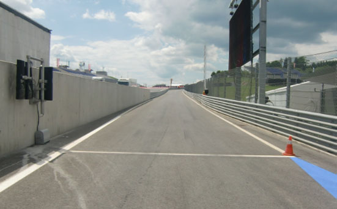
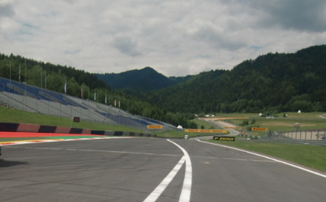

2020 AUSTRIAN GRAND PRIX

2 - 5 July 2020

From The FIA Formula One Race Director Document 5

To All Teams, All Officials Date 02 July 2020

Time 19:40

Title Race Directors' Event Notes Version 2

Description Event Notes Version 2

Enclosed 2020 Austrian F1 Grand Prix - Event Notes V2 Doc 05 020720.pdf

Michael Masi

The FIA Formula One Race Director

2020 A G P USTRIAN RAND RIX

2 – 5 July 2020

From The FIA Formula One Race Director Document 5

To Formula One Team Managers Date 2 July 2020

Time 19.40

VERSION 2 General Instructions

1) Pit lane map

1.1 Safety Car lines.

1.2 The location of the pit entry and the pit exit.

1.3 Designated garage areas.

1.4 Safety Car position for first lap and rest of race.

1.5 Blue flag marshal at the pit exit.

1.6 Track light panels displaying pit entry status.

2) Pirelli Event Preview

2.1 With reference to Article 24.4(a) of the Sporting Regulations see the attached document provided by the official tyre supplier.

3) Red zones for photographers in the pit lane during practice sessions

3.1 See the attached drawing.

4) Track light panels

4.1 The FIA track light panels have been installed in the positions shown on the circuit map. In accordance with Appendix H to the ISC the light signals have the same meaning as flag signals.

5) Drivers leaving their pit stop position in the pit lane

5.1 For safety reasons, no car should be driven from its pit stop position at any time unless:

a) It has first been driven into the pit stop position having just entered the pit lane from the track,

and;

b) It is then driven immediately back onto the track from the pit stop position.

6) Observing yellow flags during free practice and qualifying

6.1 Double waved: Any driver passing through a double waved yellow marshalling sector must reduce speed significantly and be prepared to change direction or stop. In order for the stewards to be

satisfied that any such driver has complied with these requirements it must be clear that he has not

attempted to set a meaningful lap time, for practical purposes this means the driver should abandon

the lap (this does not necessarily mean he has to pit as the track could well be clear the following

lap).

1/6

6.2 Single waved: Drivers should reduce their speed and be prepared to change direction. It must be clear that a driver has reduced speed and, in order for this to be clear, a driver would be expected

to have braked earlier and/or discernibly reduced speed in the relevant marshalling sector.

Drivers should not overtake any car in a single waved yellow marshalling sector unless it is clear that

a car is slowing with a completely obvious problem, e.g. obvious accident damage or a deflated tyre.

7) In laps during qualifying and reconnaissance laps

7.1 In order to ensure that cars are not driven unnecessarily slowly on in laps during and after the end of qualifying or during reconnaissance laps when the pit exit is opened for the race, drivers must stay

below the maximum time set by the FIA between the Safety Car lines shown on the pit lane map.

You will be informed of the maximum time after the first day of practice.

8) Parc Fermé Cameras

8.1 To assist with the revised FIA Event procedures, the Parc Fermé cameras must be uncovered and operational at all times during the Event.

9) Operational personnel curfew

9.1 Boards warning anyone attempting to enter the paddock that the curfew is in operation will be placed immediately before the turnstiles at the appropriate times.

9.2 At this Event, Personnel will be permitted to enter the Paddock 30 minutes prior to the curfew to assist social distancing. No work is permitted to be undertaken until the curfew has ended.

10) Tyre Blanket Usage during Pit Stops in the Race

10.1 For reasons of safety, tyre blankets are not permitted in the Pit Lane at any time during the race.

11) Lapping during the race

11.1 The ISC requires drivers who are caught by another car about to lap him to allow the faster driver past at the first available opportunity. The F1 Marshalling System has been developed in order to

ensure that the point at which a driver is shown blue flags is consistent, rather than trusting the ability

of marshals to identify situations that require blue flags.

As it was at the end of last season the system will be set to give a pre-warning when the faster car

is within 3.0s of the car about to be lapped, this should be used by the team of the slower car to warn

their driver he is soon going to be lapped and that allowing the faster car through should be

considered a priority. When the faster car is within 1.2s of the car about to be lapped blue flags will

be shown to the slower car (in addition to blue light panels, blue cockpit lights and a message on the

timing monitors) and the driver must allow the following driver to overtake at the first available

opportunity.

It should be noted that the aim of using F1MS is ensure consistent application of the rules, additional

instructions may also be given by race control when necessary.

2/6

Event Specific Instructions

12) Formula 1 Sporting Regulations Article 21.6

12.1 In accordance with the provisions of Article 21.6a) i), this Event is a Closed Event.

13) Changes to the circuit

13.1 An extension has been added to the concrete behind the Turn 8 apex kerb and to the exit kerb.

13.2 The additional yellow kerbs behind the exit kerbs at Turn 9 and Turn 10 have been removed and timing loops have been installed.

14) Specific Technical Procedures for Closed Events

14.1 The provisions of Technical Directive Ref: TD/025-20 must be complied with at all times during the Event, with the exception of point 5 (Scrutineers and tyre checkers), which should be replaced with

the following guidelines:

a) All scrutineers and tyre checkers will be advised to carry out their duties outside the Teams’

garages until further notice.

b) Furthermore, and during all sessions, in the situations detailed at paragraph 15.1 of the Pirelli

document named “Pirelli HSE procedures – F1 – Covid19_Teams” wheels must be delivered

to the Pirelli area at the rear of the Team’s garage for scanning. This must be done before any

other job is carried out on these wheels (e.g. wear check, pressure check etc.).

c) On the grid, race tyre start pressures will be checked in the normal way.

14.2 For this Event, the requirement for each Competitor to deliver the tyres after runs of eight times laps or more will apply and this will be reviewed for subsequent events.

14.3 Both TD/025-20 and the “Pirelli HSE procedures” will be amended after the Event to reflect any additional operational requirements that we will have gathered during this first weekend of operating

under such conditions.

15) Weighing and weighing platform

15.1 The FIA weighing platform will be available for teams to use at the following times, however, no more than 5 team personnel may be present during any visit. Each visit should last no more than 10

minutes unless no other team is waiting in the pit lane:

a) From 11:00 on Thursday until 10:00 on Friday.

b) From 12:30 on Friday until 14:30 on Saturday (between 13:00 and 14:30 each visit will be

restricted to five minutes).

c) From when the cars are returned to the teams after qualifying until 19:30 on Saturday.

d) From 10:00 until 11:00 and 13:00 until 14:40 on Sunday.

Any team found to be abusing the time limits set out above, which we will be enforced by FIA security

personnel and our own CCTV, will not be permitted to use the weighbridge again during the Event.

16) Support Races team barrier placement

16.1 Team barrier placement prior to and during all support category practice sessions and races: No more than two metres from the garages.

16.2 It is not permitted to push cars to the weighing area at any time a support category is in pit lane.

17) Practice starts

17.1 Practice starts may only be carried out on the track at the end of each free practice session, none may be carried out in the pit lane. Any car on the track when the chequered flag is shown may then complete another lap and, instead of entering the pits, proceed to the grid and carry out a practice start.

3/6

All drivers carrying out a practice must do so by pulling as far forward on the grid as possible and, if necessary, should wait for others to carry out a start before getting to a grid position further forward. Under no circumstances should a driver make a practice start if another car is still stationary in front of him on the same side of the grid.

If any driver appears to be disregarding any of the above a red flag will be displayed and the

possibility to carry out any further starts will be immediately terminated.

17.2 For reasons of safety and sporting equity, cars may not stop in the fast lane at any time the pit exit is open without a justifiable reason (a practice start is not considered a justifiable reason).

18) Lines or bollards at the Pit Entry and Pit Exit

18.1 In accordance with Chapter 4 (Section 5) of Appendix L to the ISC drivers must keep to the right of the solid white line at the pit exit when leaving the pits. No part of any car leaving the pits may cross

this line.

18.2 For safety reasons drivers must keep to the right of white line preceding the pit entry which starts approximately 50m before Turn 9. No part of any car entering the pits may cross this line.

18.3 Except in the cases of force majeure (accepted as such by the Stewards), the crossing by any part of the car, in any direction, of the white line immediately prior to the pit entry or the red and white

painted area between the pit entry and the track, by a driver who, in the opinion of the Stewards, had

committed to entering the pit lane is prohibited.

19) Cars stopping on the Track

19.1 Should a car stop on the track during a session, the driver must keep all of their protective clothing (Helmet, Gloves, etc) on until they have returned to their garage.

20) Escape Road Turn 6

20.1 If a driver overshoots the corner at Turn 6 there is a small road along the front of the tyre barrier which leads back on to the track before Turn 7, please ensure that your drivers use this when

necessary.

21) Track Limits

21.1 Turn 9 – Exit

a) A lap time achieved during any practice session or the race by leaving the track and cutting

behind the red and white kerb on the exit of Turn 9, as judged by the detection loop in this

location, will result in that lap time being invalidated by the stewards.

b) On the third occasion of a driver cutting behind the red and white exit kerb at Turn 9 during the

race, he will be shown a black and white flag, any further cutting will then be reported to the

stewards.

c) Each time any car passes behind the red and white exit kerb, teams will be informed via the

official messaging system.

d) In all cases detailed above, the driver must only re-join the track when it is safe to do so and

without gaining a lasting advantage.

e) The above requirements will not automatically apply to any driver who is judged to have been

forced off the track, each such case will be judged individually.

21.2 Turn 10 – Exit

a) A lap time achieved during any practice session or the race by leaving the track and cutting

behind the red and white kerb on the exit of Turn 10, as judged by the detection loop in this

location, will result in that lap time and the immediately following lap time being invalidated by

the stewards.

4/6

b) On the third occasion of a driver cutting behind the red and white exit kerb at Turn 10 during

the race, he will be shown a black and white flag, any further cutting will then be reported to

the stewards.

c) Each time any car passes behind the red and white exit kerb, teams will be informed via the

official messaging system.

d) In all cases detailed above, the driver must only re-join the track when it is safe to do so and

without gaining a lasting advantage.

e) The above requirements will not automatically apply to any driver who is judged to have been

forced off the track, each such case will be judged individually.

22) DRS

22.1 DRS Detection will be automatically disabled in each individual zone if any of the light panels in that particular zone are displaying yellow. The zones and corresponding light panels are as follows:

a) Zone 1: Panels 3, 4, 5

b) Zone 2: Panels 6, 7, 8

c) Zone 3: Panels 15, 1, 2

23) Fire extinguishers around the circuit

23.1 Indicated by small white boards with a red letter ‘F’.

24) Places to remove cars from the track

24.1 Indicated by fluorescent orange panels on the barriers.

25) Removing cars from the grid

25.1 Two gates in the pit wall, the first is adjacent to the pole position and the second adjacent to grid position 12.

26) Car number light panels for the start

26.1 On the right-hand side of the grid.

27) Track light panel displaying pit entry status

27.1 The light panels indicated on the pit lane map will display a flashing yellow arrow if cars are required to use the pit lane once the Safety Car has been deployed during the race.

27.2 The light panels indicated on the pit lane map will display a flashing red cross if the pit lane is closed at any point during the race.

28) Post-race parc fermé

28.1 All cars must enter the pit lane and, with the exception of the first three, should be driven directly to the weighing area. The first three must follow the post race procedure which will be distributed prior

to the start of the race.

29) Sporting Regulations Article 36.4

29.1 In addition to the provisions of Article 36.4, and for reasons of safety, tyre blankets must be disconnected from any power supply at the five minute signal.

5/6

30) Any other business

Michael Masi

FIA Formula One Race Director

6/6

FORMULA 1 ROLEX GROSSER PREIS VON ÖSTERREICH 2020 - Spielberg

Circuit Map

6 M10 M10A 3 M9 T M8 M11 8 M13 DRS ACTIVATION 2 7 M12 4

5 M14 S1 M16 10 DRS DETECTION 2 M7 M15 2 9 6 5 DRS DETECTION 3 M17 8 M21 13 M22 14 M23 9 4 M21A S2 11 12 M17A 7M19 M20 M6 M24 15

M18 10 M26 M25 1

DRS ACTIVATION 1 M27 M1 3 M5 M4 DRS ACTIVATION 3 M2 M3 2 1

DRS DETECTION 1

Start Line

Control Line

S1 Sector 1 (170m before T3)

S2 Sector 2 (60m before T7)

T Speed Trap (170m before T4)

DRS Detection1 (160m before T1)

DRS Activation1 (102m after T1)

DRS Detection2 (40m before T3)

DRS Activation2 (100m after T3)

DRS Detection3 (120m before T10) DRS Activation3 (106m after T10)

15 Corner Numbers

M22 Marshal Post 22 FIA Marshal Light No.

Circuit Centreline Length = 4.318km

© 2020 Formula One World Championship Limited The F1 FORMULA 1 logo, F1 logo, FORMULA 1, FORMULA ONE, F1, FIA FORMULA ONE WORLD CHAMPIONSHIP, GRAND PRIX and related marks are trade marks of Formula One Licensing BV, a                                                                                                                        VERSION 1 - ISSUED 17.06.20

enaL 0202 yluJ tiP 2– 1 noisreV

eniL slenap yrtnE lortnoC

| 1 | AIF | saerA detangiseD egaraG |
| --- | --- | --- |
| 2 | AIF |  |
| 3 | AIF |  |
| 4 | 1 alumroF |  |
| 5 | sedecreM | sedecreM |
| 6 | sedecreM |  |
| 7 | sedecreM |  |
| 8 | irarreF | irarreF |
| 9 | irarreF |  |
| 01 | irarreF |  |
| 11 | lluB deR | lluB deR |
| 21 | lluB deR |  |
| A21 | lluB deR |  |
| 41 | neraLcM | neraLcM |
| 51 | neraLcM |  |
| 61 | neraLcM |  |
| 71 | tluaneR | tluaneR |
| 81 | tluaneR |  |
| 91 | tluaneR | iruaTahplA |
| 02 | iruaTahplA |  |
| 12 | iruaTahplA |  |
| 22 | iruaTA / tP gcR | tnioP gnicaR |
| 32 | tnioP gnicaR |  |
| 42 | tnioP gnicaR |  |
| 52 | aflA / tP gnicaR | oemoR aflA |
| 62 | oemoR aflA |  |
| 72 | oemoR aflA |  |
| 82 | saaH | saaH |
| 92 | saaH |  |
| 03 | smailliW / saaH |  |
| 13 | smailliW | smailliW |
| 23 | smailliW |  |

sutatS tiP 1 eniL YRTNE RAC ENAL TIP YTEFAS TSAF X

RAC paL xirP YTEFAS tsriF lennosreP )YLNO stratS MORF EREH ENAL tratS dnarG DEREVOCER DECALP maeT ecaR( TIP

KCART SRAC nairtsuA noitisoP segaraG X eloP

1F 0202

sdnE RAC ENAL ecaR YTEFAS

TIP

ENAL TIXE TSAF TIP 2 eniL galF lahsraM RAC eulB YTEFAS

potS

tiP

| Grand Prix of Austria 03-05/07/20 (20R01SPI) |  |  |  |  |  |  |  |  |
| --- | --- | --- | --- | --- | --- | --- | --- | --- |
| Compound |  | FL | FR | RL | RR |  |  |  |
| C2 |  | 2A1 | 2A2 | 2A3 | 2A4 |  |  |  |
| C3 |  | 3B1 | 3B2 | 3B3 | 3B4 |  |  |  |
| C4 |  | 4C1 | 4C2 | 4C3 | 4C4 |  |  |  |
| INTERMEDIATE |  | 33X | 35X | 37X | 39X |  | Q3 tyre |  |
| WET |  | 34Y | 36Y | 37Y | 39Y |  | C4 |  |
| MINIMUM STARTING PRESSURE, BLISTERING SENSITIVITY, CAMBER LIMIT |  |  | Front (psi) |  |  | Rear (psi) |  |  |
|  | Slicks |  | 24.5 |  |  | 19.0 |  |  |
|  | Intermediate |  | 22.5 |  |  | 19.0 |  |  |
|  | Wet | FE EOS Camber Limit RE EOS Camber limit -3.50° | 21.5 |  |  | 18.0 | -2.00° |  |
| FE Blistering RE Blistering |  |  |  |  |  |  |  |  |
| sensitivity sensitivity |  |  |  |  |  |  |  |  |
| Medium |  |  |  |  |  |  |  | Medium |

GENERAL NOTES Teams are kindly reminded that the following parameters will be subjected to FIA checks during the event: - Starting pressure. - Camber at maximum speed. - Maximum blanket temperature. - Tyre swapping.

| TyreNotes |  |
| --- | --- |
| •Not permittedto switch tyres from their originally allocated position. •Do not subject tyres tolarge deformation or heavy impact. •Do not leave fitted tyres exposed at an airtemperature lower than 15°C and/or any UV emission. •Revisedprescriptions could be issued dring the race weekend in accordance with TD/036-18. | •Alltemperature limits apply to the actual tyre surface temperature, measured with the IR gun detailed in the Appendix to the Technical and Sporting regulations. •STORAGE temperature is the recommended temperature the tyre can stay in blanketswithout time limit. •BLANKET HEATING TIME for each temperature range to be countedfrom the moment the blanket control unit is set to reach its targeted temperature within its correspondent interval. |

| YB | veR ENOZDER02_SEGARAG_AIRTSUA STN EROTS TELIOT TELIOT YAWKLAW elacS ENOZDER 10 20 rebmuN 02026032 gniwarD 30 etaD 4 0 2-1 ttegnirpS.R TELIOT TELIOT EROTS eltiT YAWKLAW gniwarD .oN nwarD 50 ecaR 60 E elxA tnorF N O TELIOTTELIOT EROTSEROTS Z D 7 0 E R 80 90 elxA tnorF 01 TELIOTTELIOT EROTSEROTS 11 2 1 elxA tnorF A2141 TELIOTTELIOT EROTSEROTS 0202 51 elxA tnorF 61 HCIERRETSÖ 71 E 81 N O TELIOT EROTS elxA tnorF Z YAWKLAW D E 0202 R TELIOT EROTS 91 NOV airtsuA 0 2 luJ elxA tnorF 12 ENOZ SIERP gniR 50 22 - lluB nuS grebleipS TELIOTTELIOT EROTSEROTS RESSORG deR 32 elxA tnorF – 42 SREHPARGOTOHP luJ 30 52 DER XELOR 62 irF TELIOTTELIOT EROTSEROTS elxA tnorF 72 82 1 E N ALUMROF O NOISULCXE Z 92 elxA tnorF D E 03 R 13 23 elxA tnorF :eltiT :euneV :etaD ecaR YAWKLAW TELIOT TELIOT | ENOZDER02_SEGARAG_AIRTSUA ENOZDER rebmuN gniwarD 2-1 .oN ecaR | veR STN elacS 020 |
| --- | --- | --- | --- |
| ETAD N |  |  |  |
| OITPIRCSED TNEMDNEMA |  |  | 26032 eta D ttegnirpS.R nwarD |
| VER |  |  |  |
| .detibihorp yltcirts si tnesnoc nettirw roirp tuohtiw mrof yna ni noitcudorpeR .dtL pihsnoipmahC dlroW enO alumroF fo ytreporp eht si niereht deniatnoc noitamrofni eht dna gniward sihT .dtL pihsnoipmahC dlroW enO alumroF thgirypoC C |  |  |  |
| 4A |  |  |  |
