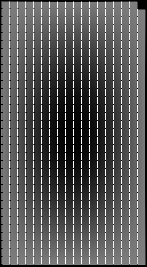
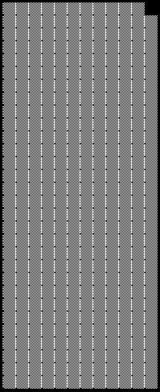

2020 AUSTRIAN GRAND PRIX

2 - 5 July 2020

From The FIA Formula One Race Director Document 37

To All Teams, All Officials Date 05 July 2020

Time 10:07

Title Race Directors' Note - Podium Procedure and Post Race Interviews

Description Podium Procedure and Post Race Interviews

Enclosed 2020 Austrian F1 Grand Prix Podium Procedure Doc 37 050720.pdf

Michael Masi

The FIA Formula One Race Director

2020 A G P USTRIAN RAND RIX

2 – 5 July 2020

From The FIA Formula One Race Director Document 37

To Formula One Team Managers Date 5 July 2020

Time 10:05

In addition to the provisions of the 2020 Formula One Sporting Regulations – Appendix 3 Podium

Ceremony, as this is a Closed Event the Podium Ceremony procedure detailed below must be followed.

Podium Ceremony and Post Race Interview Procedure:

• The master of ceremonies will be appointed by the FIA to conduct and take responsibility for the

entire podium ceremony.

• The top three drivers will be required to significantly slow after the exit of Turn 1, so that they are the

last three cars on the track. All other cars must overtake when safe to do so.

• Drivers who finish the race in the top three positions will be required to drive to the start/finish straight,

where they will find the boards showing positions from 1,2 3 located in the vicinity of the start line.

• Other than the team mechanics (with cooling fans if necessary), officials and FIA pre-approved

television crews and the three FIA approved photographers, no one else will be allowed in the

designated area at this time (no driver physios nor team PR personnel).

• Once out of their cars, the top three Drivers will be weighed by the FIA using the Portable Scales

next to their cars. Each Driver must remain fully attired until after they have been weighed (e.g:

Helmet, Gloves, etc)

• After the Drivers have been weighed, the post race interviews will take place in this designated area,

and the interviewer will be Jenson Button.

• Drivers must not interfere with Parc Fermé protocols in any way.

• Once the interviews have been completed a remote-control trolley with water and towel will be

delivered to each Driver. No other drinks are permitted in the Parc Fermé area.

• The 1, 2, 3 Rostrum and Dias will be placed on the track in front of the top three cars.

• Each Driver will be handed their Pirelli Caps which will also contain a Medical Face Mask both of

which must be worn during the Podium Ceremony.

• When the Drivers are ready, an announcement for the for the Podium Ceremony will take place

which each Driver introduced to move to their respective Podium Dias steps.

• The National Anthems will then take place and virtual flags will be displayed.

• The Trophy Presentations will take place in the following order however no dignitaries will be

involved:

o Winning Driver

o A representative of the Winning Constructor

o 2nd Place Driver

o 3rd Place Driver

• The Champagne Celebrations will the take place.

• Following the Podium Ceremony, the top three drivers will be escorted across the track by the FIA

Media Delegate to the FIA Press Conference located on the ground floor of the Media Centre

Building.

1/2

• At the end of the FIA Press Conference, the top three drivers will go to the TV pen, located at the Pit

Entry end of the Paddock behind the Race Control Building and they may be accompanied by their

press officers, who should wait to collect their drivers at the back of the press conference room.

• Parc Fermé for all finishers outside of the top three will be located at the Pit Entry.

• Drivers classified from 4th and beyond must proceed directly to the TV pen immediately after they

have been weighed in the Parc Fermé, located in the FIA garage. Each Driver must remain fully

attired until after they have been weighed (e.g: Helmet, Gloves, etc).

• Drivers who retired during the race are requested to go to the TV pen as soon as they have come

back into the paddock.

Please see the attached Post Race Podium Ceremony and Parc Fermé Diagram.

2/2

ecaR

0202

- yluJ emreF 30– 1 noisreV

craP

llaW srehsinif tiP ereh

gniniameR dekrap

xirP

dnarG

nairtsuA

0202

eniL hsiniF

dn 2

ts 1

dr 3

namaremaC FR reweivretnI

VT aera

gnitiaw s’rehpargotohP

srehpargotohP
