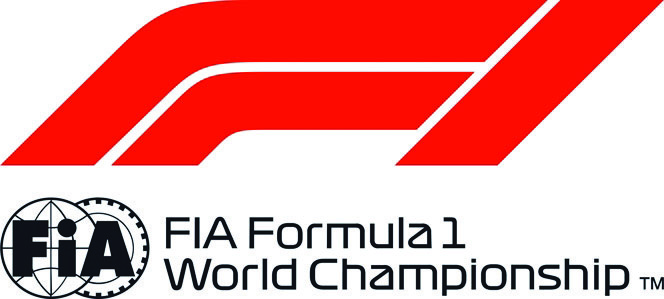
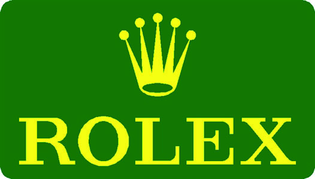

2020 BAHRAIN GRAND PRIX

26 - 29 November 2020

From The Stewards Document 32

To All Teams, All Officials Date 29 November 2020

Time 18:23

Title Restart Grid

Description Restart Grid

Enclosed BRN DOC 32- ReStart Grid.pdf

Garry Connelly Loic Bacquelaine

Mika Salo Mazen Al Hilli

The Stewards

Doc 32 Time 18:22

FORMULA 1 GULF AIR BAHRAIN GRAND PRIX 2020 - Sakhir

Race Restart Grid

1 44 Lewis HAMILTON Mercedes-AMG Petronas F1 Team 2 33 Max VERSTAPPEN Aston Martin Red Bull Racing 3 11 Sergio PEREZ BWT Racing Point F1 Team 4 77 Valtteri BOTTAS Mercedes-AMG Petronas F1 Team 5 23 Alexander ALBON Aston Martin Red Bull Racing 6 3 Daniel RICCIARDO Renault DP World F1 Team 7 4 Lando NORRIS McLaren F1 Team 8 31 Esteban OCON Renault DP World F1 Team 9 10 Pierre GASLY Scuderia AlphaTauri Honda 10 5 Sebastian VETTEL Scuderia Ferrari 11 18 Lance STROLL BWT Racing Point F1 Team 12 16 Charles LECLERC Scuderia Ferrari 13 55 Carlos SAINZ McLaren F1 Team 14 99 Antonio GIOVINAZZI Alfa Romeo Racing ORLEN 15 26 Daniil KVYAT Scuderia AlphaTauri Honda 16 7 Kimi RAIKKONEN Alfa Romeo Racing ORLEN 17 20 Kevin MAGNUSSEN Haas F1 Team 18 63 George RUSSELL Williams Racing 19 6 Nicholas LATIFI Williams Racing

© 2020 Formula One World Championship Limited The F1 FORMULA 1 logo, F1 logo, FORMULA 1, FORMULA ONE, F1, FIA FORMULA ONE WORLD CHAMPIONSHIP, GRAND PRIX and related marks are trade marks of Formula One Licensing BV, a Formula 1 company. The FIA logo is a trade mark of the Fédération Internationale de l’Automobile. All rights reserved. No part of these results/data may be reproduced, stored in a retrieval system or transmitted in any form or by any means electronic, mechanical, photocopying, recording, broadcasting or otherwise without prior permission of the copyright holder except for reproduction in local/national/international daily press and regular printed publications on sale to the public within 90 days of the event to which the results/data relate and provided that the copyright symbol and name of copyright owner appears.
