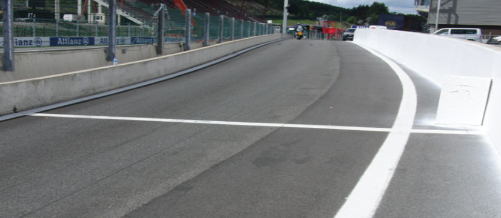
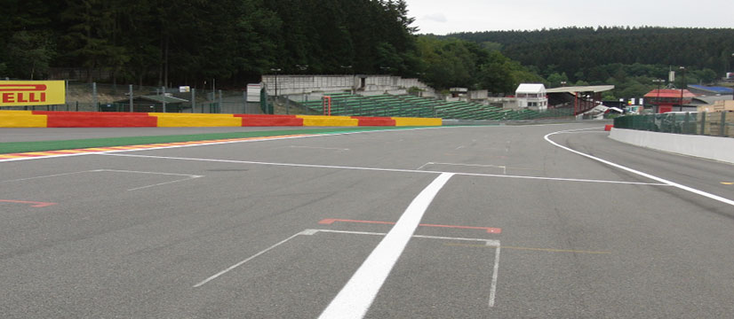

2020 BELGIAN GRAND PRIX

27 - 30 August 2020

From The FIA Formula One Race Director Document 3

To All Teams, All Officials Date 27 August 2020

Time 11:32

Title Race Directors' Event Notes

Description Event Notes

Enclosed 2020 Belgian F1 Grand Prix Event Notes Doc 03 270820.pdf

Michael Masi

The FIA Formula One Race Director

2020 B G P ELGIAN RAND RIX

27 - 30 August 2020

From The FIA Formula One Race Director Document 3

To All Teams, All Officials Date 27 August 2020

Time 11.30

EVENT NOTES General Instructions

1) Pit lane map

1.1 Safety Car lines.

1.2 The location of the pit entry and the pit exit.

1.3 Designated garage areas.

1.4 Safety Car position for first lap and rest of race.

1.5 Blue flag marshal at the pit exit.

1.6 Track light panels displaying pit entry status.

2) Pirelli Event Preview

2.1 With reference to Article 24.4(a) of the Sporting Regulations see the attached document provided by the official tyre supplier.

3) Red zones for photographers in the pit lane during practice sessions

3.1 See the attached drawing.

4) Track light panels

4.1 The FIA track light panels have been installed in the positions shown on the circuit map. In accordance with Appendix H to the ISC the light signals have the same meaning as flag signals.

5) Track light panel displaying pit entry status

5.1 The light panel indicated on the pit lane map will display a flashing yellow arrow if cars are required to use the pit lane once the Safety Car has been deployed during the race.

5.2 The light panel indicated on the pit lane map will display a flashing red cross if the pit lane is closed at any point during the race.

6) Drivers leaving their pit stop position in the pit lane

6.1 For safety reasons, no car should be driven from its pit stop position at any time unless:

a) It has first been driven into the pit stop position having just entered the pit lane from the track,

and;

b) It is then driven immediately back onto the track from the pit stop position.

1/6

7) Observing yellow flags during free practice and qualifying

7.1 Double waved: Any driver passing through a double waved yellow marshalling sector must reduce speed significantly and be prepared to change direction or stop. In order for the stewards to be

satisfied that any such driver has complied with these requirements it must be clear that he has not

attempted to set a meaningful lap time, for practical purposes this means the driver should abandon

the lap (this does not necessarily mean he has to pit as the track could well be clear the following

lap).

7.2 Single waved: Drivers should reduce their speed and be prepared to change direction. It must be clear that a driver has reduced speed and, in order for this to be clear, a driver would be expected

to have braked earlier and/or discernibly reduced speed in the relevant marshalling sector.

Drivers should not overtake any car in a single waved yellow marshalling sector unless it is clear that

a car is slowing with a completely obvious problem, e.g. obvious accident damage or a deflated tyre.

8) In laps during qualifying and reconnaissance laps

8.1 In order to ensure that cars are not driven unnecessarily slowly on in laps during and after the end of qualifying or during reconnaissance laps when the pit exit is opened for the race, drivers must stay

below the maximum time set by the FIA between the Safety Car lines shown on the pit lane map.

You will be informed of the maximum time after the first day of practice.

9) Parc Fermé Cameras

9.1 To assist with the revised FIA Event procedures, the Parc Fermé cameras must be uncovered and operational at all times during the Event.

10) Operational personnel curfew

10.1 Boards warning anyone attempting to enter the paddock that the curfew is in operation will be placed immediately before the turnstiles at the appropriate times.

10.2 At this Event, Personnel will be permitted to enter the Paddock 30 minutes prior to the curfew to assist social distancing. No work is permitted to be undertaken until the curfew has ended.

11) Tyre Blanket Usage during Pit Stops in the Race

11.1 For reasons of safety, tyre blankets are not permitted in the Pit Lane at any time during the race.

12) Lapping during the race

12.1 The ISC requires drivers who are caught by another car about to lap him to allow the faster driver past at the first available opportunity. The F1 Marshalling System has been developed in order to

ensure that the point at which a driver is shown blue flags is consistent, rather than trusting the ability

of marshals to identify situations that require blue flags.

As it was at the end of last season the system will be set to give a pre-warning when the faster car

is within 3.0s of the car about to be lapped, this should be used by the team of the slower car to warn

their driver he is soon going to be lapped and that allowing the faster car through should be

considered a priority. When the faster car is within 1.2s of the car about to be lapped blue flags will

be shown to the slower car (in addition to blue light panels, blue cockpit lights and a message on the

timing monitors) and the driver must allow the following driver to overtake at the first available

opportunity.

It should be noted that the aim of using F1MS is ensure consistent application of the rules, additional

instructions may also be given by race control when necessary.

2/6

Event Specific Instructions

13) Formula 1 Sporting Regulations Article 21.6

13.1 In accordance with the provisions of Article 21.6a) i), this Event is a Closed Event.

14) Changes to the circuit

14.1 The length on the wall on the right-hand side at the exit of Turn 1 (Endurance Pit Entry) has been extended.

14.2 The 4 row tyre barrier at the exit of Turn 4 has been extended.

14.3 The artificial grass around the entire track has all been removed.

15) Specific Technical Procedures for Closed Events

15.1 The provisions of Technical Directive Ref: TD/025-20 must be complied with at all times during the Event, with the exception of point 5 (Scrutineers and tyre checkers), which should be replaced with

the following guidelines:

a) All scrutineers and tyre checkers will be advised to carry out their duties outside the Teams’

garages until further notice.

b) Furthermore, and during all sessions, in the situations detailed at paragraphs 15.1 and 15.2 of

the Pirelli document named “Pirelli HSE procedures – F1 – Covid19_Teams” wheels must be

delivered to the Pirelli area at the rear of the Team’s garage for scanning. This must be done

before any other job is carried out on these wheels (e.g. wear check, pressure check etc.).

c) On the grid, race tyre start pressures will be checked in the normal way.

15.2 For this Event, the requirement for each Competitor to deliver the tyres after runs of four timed laps or more will apply and this will be reviewed for subsequent events.

Whilst we agree there may be some minor inconveniences for the teams during session times, great

compromises have been made to produce these operating procedures which have everyone’s best

interests in mind.

15.3 Any tyres that are removed from a car and could be re-used during a session should be presented for scanning before being rewrapped and reheated. If time constraints do not permit this then all

tyres used during a session must be presented to the Pirelli area as outlined below at the end of any

session. This applies to dry, wet and intermediate tyres.

15.4 Both TD/025-20 and the “Pirelli HSE procedures” will be amended after the Event to reflect any additional operational requirements.

16) Weighing and weighing platform

16.1 The FIA weighing platform will be available for teams to use at the following times, however, no more than 8 team personnel may be present during any visit. Each visit should last no more than 10

minutes unless no other team is waiting in the pit lane:

a) From 11:00 on Thursday until 10:00 on Friday.

b) From 12:30 on Friday until 14:30 on Saturday (between 13:00 and 14:30 each visit will be

restricted to five minutes).

c) From when the cars are returned to the teams after qualifying until 19:30 on Saturday.

d) From 10:00 until 11:00 and 13:00 until 14:30 on Sunday.

Any team found to be abusing the time limits set out above, which we will be enforced by FIA security

personnel and our own CCTV, will not be permitted to use the weighbridge again during the Event.

3/6

17) Support Races

17.1 Team Barrier placement

a) Team barrier placement prior to and during all support category practice sessions and races:

No more than three metres from the garages.

b) It is not permitted to push cars to the weighing area at any time a support category is in pit

lane.

17.2 Support Category Movements

a) Support Crews and Trolleys will be released into Pit Lane no earlier than 20 minutes prior to

the opening of Pit Exit for their respective sessions.

b) Support Category competition vehicles will be release from the marshalling area no earlier

than 15 minutes prior to the opening of Pit Exit for their respective sessions.

18) Practice starts

18.1 During each practice session, practice starts may only be carried out on the right-hand side after leaving the pit lane. These must be done prior to the SC2 line and with all four wheels between the

white line on the right-hand edge of the pit exit and the wall.

18.2 During the time the pit exit is open for the race, practice starts may be carried out on the track after the pit exit before the SC2 line. Drivers wishing to carry out a practice start should stop wholly within

the pit exit in order to allow other cars to pass on their left (the area bordered by red in the photograph

on page 5). During this time any driver passing a car which has stopped to carry out a practice start

may cross the white line that is referred to in 19.1 below.

18.3 For reasons of safety and sporting equity, cars may not stop in the fast lane at any time the pit exit is open without a justifiable reason (a practice start is not considered a justifiable reason).

19) Lines or bollards at the Pit Entry and Pit Exit

19.1 In accordance with Chapter 4 (Section 5) of Appendix L to the ISC drivers must keep to the right of the solid white line at the pit exit when leaving the pits. No part of any car leaving the pits may cross

this line.

19.2 For safety reasons drivers must keep to the right of the bollard the pit entry when they are entering the pits.

19.3 Except in the cases of force majeure (accepted as such by the Stewards), the crossing by any part of the car, in any direction, of the painted area between the pit entry and the track, by a driver who,

in the opinion of the Stewards, had committed to entering the pit lane is prohibited.

20) Track Limits

20.1 Turn 4

a) A lap time achieved during any practice session or the race by leaving the track and cutting

behind the apex kerb of Turn 4, will result in that lap time being invalidated by the stewards.

20.2 Turn 9 - Exit

a) A lap time achieved during any practice session or the race by leaving the track and cutting

behind the painted kerb on the exit of Turn 9, will result in that lap time being invalidated by

the stewards.

20.3 Turn 19 – Exit

a) A lap time achieved during any practice session or the race by leaving the track and cutting

behind the kerb on the exit of Turn 19, will result in that lap time and the immediately following

lap time being invalidated by the stewards.

4/6

20.4 General - Turn 4 Turn 9 Exit and Turn 19 Exit a) Each time any car passes behind the kerb, teams will be informed via the official messaging

system.

b) On the third occasion of a driver cutting behind the kerb at Turn 4, Turn 9 - exit and Turn 19-

exit during the race, he will be shown a black and white flag, any further cutting will then be

reported to the stewards. For the avoidance of doubt this means a total of three occasions

combined not three at each corner.

c) The above requirements will not automatically apply to any driver who is judged to have been

forced off the track, each such case will be judged individually.

d) In all cases detailed above, the driver must only re-join the track when it is safe to do so and

without gaining a lasting advantage.

20.5 Escape Road at Turn 5 a) If a driver overshoots the corner at Turn 5 there is a small road along the front of the tyre barrier

which leads back on to the track at Turn 7, please ensure that your drivers use this when

necessary.

21) DRS

21.1 DRS Detection will be automatically disabled in each individual zone if any of the light panels in that particular zone are displaying yellow. The zones and corresponding light panels are as follows:

a) Zone 1: Panels 5, 6, 7

b) Zone 2: Panels 19, 1, 2

22) Fire extinguishers around the circuit

22.1 Indicated by small fluorescent orange boards on the barriers.

23) Places to remove cars from the track

23.1 Indicated by fluorescent orange panels on the barriers.

23.2 If a driver has a choice where to stop during a session, it is recommended they do so on the right- hand side of the track as cars may then be recovered more easily and brought back to the pits.

23.3 Should a car stop on the track during a session, the driver must keep all of their protective clothing (Helmet, Gloves, etc) on until they have returned to their garage.

24) Sporting Regulations Article 36.4

24.1 In addition to the provisions of Article 36.4, and for reasons of safety, tyre blankets must be disconnected from any power supply at the five-minute signal and must not be reconnected during

the start procedure, unless the delayed start signal is shown.

25) Access to the grid prior to the Start Procedure

25.1 To assist social distancing in accessing the grid prior to the commencement of the start procedure, Team personnel and equipment will be granted access to the grid from 1410hrs on Sunday 30th

August.

26) Removing cars from the grid

26.1 One gate in the pit wall located adjacent to grid position 1.

27) Car number light panels for the start

27.1 On the left-hand side of the grid.

5/6

28) Post-race parc fermé

28.1 All cars must enter the pit lane and, with the exception of the first three, should be driven directly to the weighing area. The first three must follow the post-race procedure which will be distributed prior

to the start of the race.

29) Any other business

29.1 Blue Flags

Michael Masi

FIA Formula One Race Director

6/6

FORMULA 1 ROLEX BELGIUM GRAND PRIX 2020 - Spa-Francorchamps

Circuit Map

1 M1 M1B

03

M19C 02 DRS DETECTION 1 M1C

01 04

M2 M19B 2 DRS 3 ACTIVATION 2 M19 18 19 05 4 M 3 M18 T

DRS DETECTION 2 M4 19 Start Line

Control Line DRS S1 Sector 1 [145m before Turn 5] ACTIVATION 1 M4B S2 Sector 2 [48m before Turn 15] 06

T Speed Trap [30m after Turn 4] M17 DRS Detection1 [240m before Turn 2] 18 DRS Detection2 [160m before Turn 18] 17

DRS Activation1 [230m after Turn 4]

DRS Activation2 [30m adter Turn 19]

15 Corner Numbers M4C

M22 Marshal Post 16 M10B 22 FIA Marshal Light No. 12 10 M16 M11 11 M10 17 S1 16 M15C 07 11

M5 M9B 5 13 6 13 M12 M15B M13 12 M12B 15 M7 7 15 9 M7B 08 14 M15 10 M9 14 S2 M8B M14 09 8 M8 Circuit Centreline Length = 7.004km

© 2020 Formula One World Championship Limited The F1 FORMULA 1 logo, F1 logo, FORMULA 1, FORMULA ONE, F1, FIA FORMULA ONE WORLD CHAMPIONSHIP, GRAND PRIX and related marks are trade marks of Formula One Licensing BV, a Formula 1 company. The FIA logo is a trade mark of the Fédération Internationale de l'Automobile. All rights reserved. VERSION * - ISSUED **.**.**

enaL

lenap 9102 yrtnE tiP eniL tsuguA sutatS tiP lortnoC RAC 72– paL yrtnE dralloB YTEFAS 1 noisreV tsriF tiP X

| 1 | 1 alumroF |  |
| --- | --- | --- |
| 2 | AIF | saerA detangiseD egaraG |
| 3 | AIF |  |
| 4 | AIF |  |
| 5 | AIF | sedecreM |
| 6 | sedecreM |  |
| 7 | sedecreM |  |
| 8 | sedecreM |  |
| 9 | irarreF / sedecreM | irarreF |
| 01 | irarreF |  |
| 11 | irarreF |  |
| 21 | irarreF |  |
| 31 | lluB deR | lluB deR |
| 41 | lluB deR |  |
| 51 | lluB deR |  |
| 61 | neraLcM / lluB deR | neraLcM |
| 71 | neraLcM |  |
| 81 | neraLcM |  |
| 91 | neraLcM |  |
| 02 | yawklaW |  |
| 12 | tluaneR | tluaneR |
| 22 | tluaneR |  |
| 32 | tluaneR |  |
| 42 | ahplA / tluaneR | iruaTahplA |
| 52 | iruaTahplA |  |
| 62 | iruaTahplA |  |
| 72 | iruaTahplA | tnioP gnicaR |
| 82 | tnioP gnicaR |  |
| 92 | tnioP gnicaR |  |
| 03 | tnioP gnicaR |  |
| 13 | aflA / tP gnicaR | oemoR aflA |
| 23 | oemoR aflA |  |
| 33 | oemoR aflA |  |
| 43 | oemoR aflA |  |
| 53 | saaH | saaH |
| 63 | saaH |  |
| 73 | saaH |  |
| 83 | smailliW / saaH |  |
| 93 | smailliW | smailliW |
| 04 | smailliW |  |
| 14 | smailliW |  |
| 24 | 1 alumroF |  |

YRTNE

TIP ENAL

1 eniL TSAF RAC

YTEFAS

stratS

ENAL noitisoP

xirP TIP eloP

dnarG

naigleB

segaraG

0202

1F

2 eniL

RAC

YTEFAS

RAC ENAL ecaR YTEFAS TSAF

TIXE

TIP

sdnE

ENAL

TIP

noitisoP

potS

tiP

| Grand Prix of Belgium 28-30/08/20 (20R07SPA) |  |  |  |  |  |  |  |  |
| --- | --- | --- | --- | --- | --- | --- | --- | --- |
| Compound |  | FL | FR | RL | RR |  |  |  |
| C2 |  | 2A1 | 2A2 | 2A3 | 2A4 |  |  |  |
| C3 |  | 3B1 | 3B2 | 3B3 | 3B4 |  |  |  |
| C4 |  | 4C1 | 4C2 | 4C3 | 4C4 |  |  |  |
| INTERMEDIATE |  | 33X | 35X | 37X | 39X |  | Q3 tyre |  |
| WET |  | 34Y | 36Y | 37Y | 39Y |  | C4 |  |
| MINIMUM STARTING PRESSURE, BLISTERING SENSITIVITY, CAMBER LIMIT |  |  | Front (psi) |  |  | Rear (psi) |  |  |
|  | Slicks |  | 24.5 |  |  | 21.0 |  |  |
|  | Intermediate |  | 22.5 |  |  | 21.0 |  |  |
|  | Wet | FE EOS Camber Limit RE EOS Camber limit -2.75° | 21.5 |  |  | 20.0 | -1.50° |  |
| FE Blistering RE Blistering |  |  |  |  |  |  |  |  |
| sensitivity sensitivity |  |  |  |  |  |  |  |  |
| Medium |  |  |  |  |  |  |  | Medium |

GENERAL NOTES Teams are kindly reminded that the following parameters will be subjected to FIA checks during the event: - Starting pressure. - Camber at maximum speed. - Maximum blanket temperature. - Tyre swapping.

| TyreNotes |  |
| --- | --- |
| •Not permittedto switch tyres from their originally allocated position. •Do not subject tyres tolarge deformation or heavy impact. •Do not leave fitted tyres exposed at an airtemperature lower than 15°C and/or any UV emission. •Revisedprescriptions could be issued dring the race weekend in accordance with TD/036-18. | •Alltemperature limits apply to the actual tyre surface temperature, measured with the IR gun detailed in the Appendix to the Technical and Sporting regulations. •STORAGE temperature is the recommended temperature the tyre can stay in blanketswithout time limit. •BLANKET HEATING TIME for each temperature range to be countedfrom the moment the blanket control unit is set to reach its targeted temperature within its correspondent interval. |

| YB | ENOZ veR DER STN 1F AC 02_SEGARAG_MUIGLEB elacS 1 2 m08.91 m81.5 m12.6 m08.91 m81.5 m12.6 m18.3 m63.3 m55.3 1 alumroF 1 alumroFAIF POC CABLE DRUMS LOISBTCA RTOAEBCSCTKHEROAABDCCSKETCHAOPRBCGCERCHAORBGCERS HETCLIBBMAOST.S HCNEBKROW CBOHCNEBKROW CBOHCNEBKROW CBO OBC WORKBENCH OBC WORKBENCH ADROFEPRMIBRATC EGFDRIBRF ELBAT CBO ELBAT CBO CHABRRGFING AFTRSBIL GNIFGRRBAHC BFR TBARBFLEBBORFXBBORXF ASTRSBIL SEPXPOBB ALTCSBILLCB EBUC ELBCUBCHCNEB HCNEB ATSTOSIPLELBAT PPBATSTOSIPL TEHSSGRAIBLCF SMURD ELBAC BFR RIEDELRIEDEL MEDIA PEN HCNEBKROW CBOHCNEBKROW CBO SEOLBBCA TW OOIRDKUBAENCHSODBOC PWIROTRKBENCH EL OBC W P ORKBENCH BPABTEPLBPABT CIM NI CIM CIM CIM CIM CIM CIM TUO enoZ deR rebmuN gniwarD 02.80.60 3 m08.91 m81.5 m12.6 AIF etaD 4 m12.5 m12.6 AIF 70 NOTRUB.J m08.91 5 m08.91 m12.5 m12.6 AIF eltiT 6 m12.5 m12.6 MERCEDES GP GMA sedecreM gniwarD .oN ecaR nwarD m08.91 7 m08.91 m12.5 m12.6 GMA sedecreM elxA tnorF MERCEDES GP 8 m81.5 m12.6 GMA sedecreM m08.91 MERCEDES GP E 9 m08.91 m81.5 m12.6 N irarreFm5 2a.0i1reducS GMA sme55d.9ecreM O Z 01 m08.91 m12.5 m12.6 SCUDERIA D FERRARI irarreF aireducS E elxA tnorF R 11 m08.91 m12.5 m12.6 irarreF aireducS SCUDERIA FERRARI 21 m12.5 m12.6 SCUDERIA FERRARI irarreF aireducS m08.91 31 m08.91 m12.5 m12.6 REDBULL RACING gnicaR lluB deR 41 m81.5 m12.6 REDBULL RACING gnicaR lluB deR m08.91 elxA tnorF 51 m08.91 m81.5 m12.6 gnicaR lluB deR REDBULL 61 m12.5 m12.6 RACING neraLcMgnicaR lluB deR 0202 m08.91 m52.01 m55.9 71 m08.91 m12.5 m12.6 McLAREN neraLcM 81 m12.5 m12.6 neraLcM elxA tnorF XIRP m08.91 McLAREN 91 m08.91 m12.5 m12.6 neraLcM 02 m12.5 m12.6 McLAREN yawklaW E DNARG muigleB 0202 m08.91 N 12 m81.5 m12.6 O RENAULT tropS tluaneR Z spmahcrocnarF-apS m08.91 D tratS elxA tnorF R E guA 22 m08.91 m81.5 m12.6 tropS tluaneR - RENAULT NAIGLEB spmahcrocnarF-apS 32 m12.5 m12.6 SPORT tropS tluaneR 03 m08.91 42 m08.91 m12.5 m12.6 RENAULT iruaTahpml5A2.0 1aireducS tropmS5 5t.9luaneR nuS 52 m12.5 m12.6 SCUDERIA iruaTahplA aireducS m08.91 ALPHATAURI elxA tnorF – 62 m08.91 m12.5 m12.6 iruaTahplA aireducS XELOR ed guA SCUDERIA ALPHATAURI tiucriC 72 m08.91 m81.5 m12.6 iruaTahplA aireducS SCUDERIA ALPHATAURI 82 82 m08.91 m81.5 m12.6 tnioP gnicaR 1 irF RACING ALUMROF 92 m12.5 m12.6 POINT tnioP gnicaR elxA tnorF ENOZ m08.91 E 03 m08.91 m12.5 m12.6 N RACING POINT tnioP gnicaR O Z 13 m12.5 m12.6 RACING POINT D gnicaR oemoR aflA tnioP gnicaR E m08.91 m52.01 m55.9 R SREHPARGOTOHP 23 m08.91 m12.5 m12.6 ALFA gnicaR oemoR aflA ROMEO DER 33 m81.5 m12.6 RACING gnicaR oemoR aflA elxA tnorF m08.91 43 m08.91 m81.5 m12.6 ALFA ROMEO RACING gnicaR oemoR aflA :eltiT :euneV :etaD 051 53 m12.5 m12.6 saaH NOISULCXE ecaR m08.91 63 m08.91 m12.5 m12.6 HAAS saaH elxA tnorF 73 m12.5 m12.6 HAAS saaH m08.91 83 m08.91 m12.5 m12.6 HAAS gnicaRm 5s2.0m1ailliW sma55.9aH 93 m81.5 m12.6 WILLIAMS gnicaR smailliW E m08.91 N O Z 04 m08.91 m81.5 m12.6 gnicaR smailliW elxA tnorF D E 14 m12.5 m12.6 WILLIAMS R gnicaR smailliW m08.91 001 24 m12.5 m12.6 1 alumroF m08.91 | ENOZ veR DER STN 02_SEGARAG_MUIGL elacS 02.80.60 |
| --- | --- | --- |
| ETAD |  |  |
| NOITPIRCSED TN |  |  |
| EMDNEMA VER |  | EB etaD NOTRUB.J nwarD |
| .detibihorp yltcirts si tnesnoc nettirw roirp tuohtiw mrof yna ni noitcudorpeR .dtL pihsnoipmahC dlroW enO alumroF fo ytreporp eht si niereht deniatnoc noitamrofni eht dna gniward sihT .dtL pihsnoipmahC dlroW enO alumroF thgirypoC |  |  |
| 3A |  |  |
