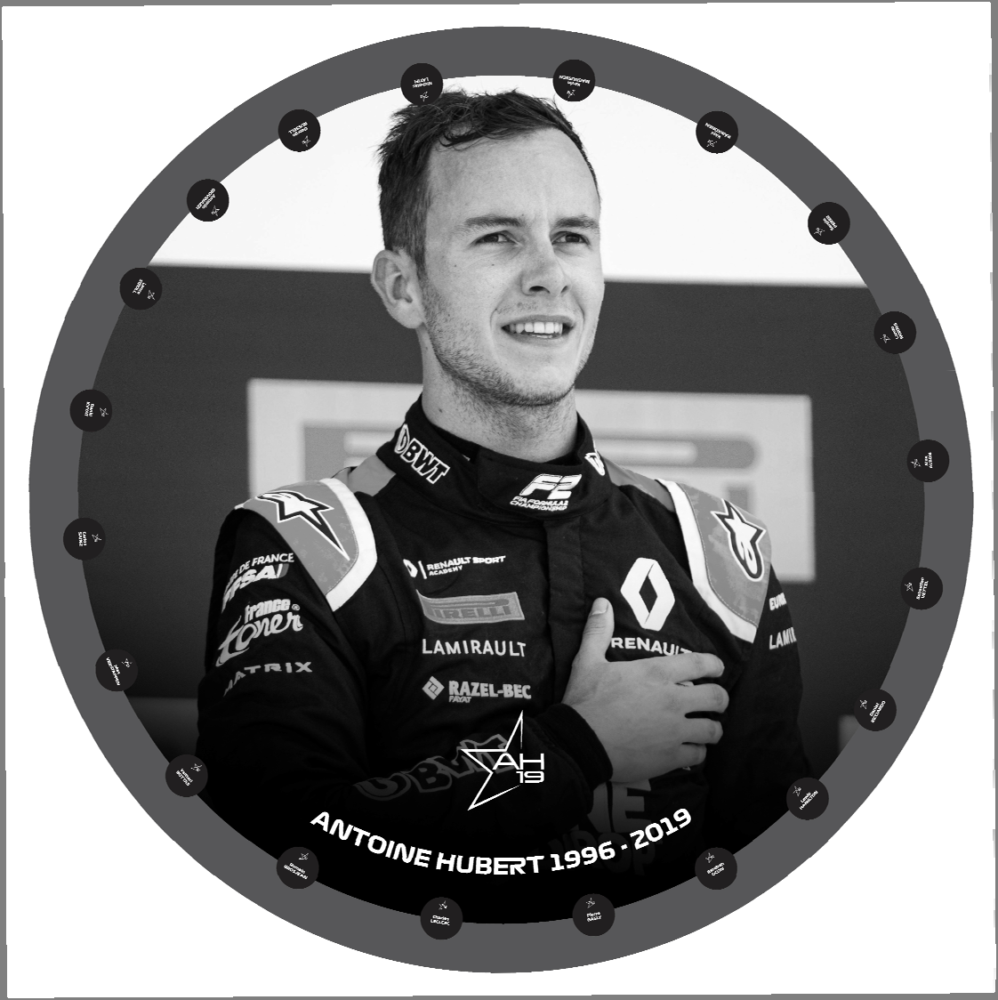

2020 BELGIAN GRAND PRIX

27 - 30 August 2020

From The FIA Formula One Race Director Document 31

To All Teams, All Officials Date 30 August 2020

Time 09:20

Title Race Directors Note - Pre-Race Procedure

Description Pre-Race Procedure

Enclosed 2020 Belgian F1 Grand Prix Pre Race Procedure Doc 31 300820.pdf

Michael Masi

The FIA Formula One Race Director

2020 B G P ELGIAN RAND RIX

27 - 30 August 2020

From The FIA Formula One Race Director Document 31

To All Teams, All Officials Date 30 August 2020

Time 09.20

NOTE TO TEAMS: END RACISM RECOGNITION, REMEMBRANCE OF ANTHOINE HUBERT AND NATIONAL ANTHEM

Please find below a summary of the procedures for the Pre-Race activity to support the End Racism

message, Remembrance of Anthoine Hubert and the National Anthem.

The FIA, Formula 1, Teams and Drivers stand united as a sport in the fight to end racism and fully support

equality, inclusivity and equal opportunity for all. The FIA supports any form of individual expression in

accordance with the fundamental principles of its Statutes, and as a mark of respect each driver, as an

individual, may choose to mark this moment with their own gesture.

The procedure outlined for the pre-race activities are detailed below together with the associated timings:

14.50.30 At F1 personnel visual cue and an announcement over the PA system each Driver wearing

their black coloured ‘end racism’ t-shirts will walk to the carpet runner, with the ‘end racism’

banner placed across the width of the track, and stand by their name card.

At this stage the VT of driver pledges will be playing on the International feed whilst Drivers

get organised and into position.

14.51:22 Circuit audio: ‘Formula 1 and the FIA will take this moment, in recognition of the importance of

equality and equal opportunity for all’.

14.51:30 International Feed goes live to drivers organised in position on the carpet runner.

14:51:30 On the Audio Beep, drivers can choose their gesture of support. As suggestions these gestures

could include;

• taking the knee

• standing on carpet with arms crossed in front or behind them

• standing on carpet and bow head

• standing on carpet and pointing to the words ‘end racism’ on their t-shirts

• standing on carpet and place their hand on the heart

• anything else a driver may feel comfortable to do

14.51:50 On the Audio Beep, this moment will be concluded with the audio ‘Thank you for this statement

of support to end racism in the world’, and the drivers have 1 minute to remove their End

Racism t-shirt and move to their name card position for the minute of silence in remembrance

of Anthoine Hubert and the National Anthem.

14.52:50 The minute of silence in remembrance of Anthoine Hubert will commence on the PA

announcement.

1/3

14:53:50 The minute of silence ends and PA to announce the National Anthem.

14.54:00 National Anthem of Belgium will commence for a duration of 1 minute.

The FIA, F1 and F1 Teams Communication Directors will continue to manage the media expectations on

how this gesture will be marked.

Please see the attached National Anthem Diagram.

Michael Masi

FIA Formula One Race Director

2/3

