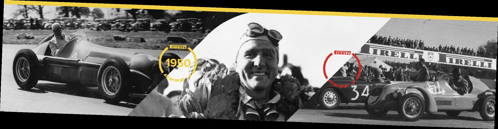

2020 BRITISH GRAND PRIX

30 July - 2 August 2020

From The FIA Formula One Race Director Document 41

To All Teams, All Officials Date 01 August 2020

Time 18:42

Title Race Directors' Note - Pre-Race Activities

Description Pre-Race Activities

Enclosed 2020 British F1 Grand Prix- End Racism & National Anthem Doc 41 010820.pdf

Michael Masi

The FIA Formula One Race Director

2020 B G P RITISH RAND RIX

30 July – 2 August 2020

From The FIA Formula One Race Director Document 41

To All Teams, All Officials Date 1 August 2020

Time 18:40

NOTE TO TEAMS: END RACISM RECOGNITION AND NATIONAL ANTHEM

Please find below a summary of the procedures for the Pre-Race activity to support the End Racism message and National Anthem.

The FIA, Formula 1, Teams and Drivers stand united as a sport in the fight to end racism and fully support equality, inclusivity and equal opportunity for all. The FIA supports any form of individual expression in accordance with the fundamental principles of its Statutes, and as a mark of respect each driver, as an individual, may choose to mark this moment with their own gesture.

The procedure outlined for the pre-race activities are detailed below together with the associated timings:

13.52.30 At sound of a beep on PA system each Driver wearing their black coloured ‘end racism’ t-shirts will walk to the carpet runner, with the ‘end racism’ banner placed across the width of the track, and stand by their name card.

At this stage the VT of driver pledges will be playing on the International feed whilst Drivers get organised and into position.

13.53:00 International Feed goes live to drivers organised in position on the carpet runner.

13.53:03 Circuit audio: ‘Formula 1 and the FIA will take this moment, in recognition of the importance of equality and equal opportunity for all’.

At end of circuit audio driver can choose their gesture of support. As suggestions these gestures could include;

• taking the knee

• standing on carpet with arms crossed in front or behind them

• standing on carpet and bow head

• standing on carpet and pointing to the words ‘end racism’ on their t-shirts

• standing on carpet and place their hand on the heart

• anything else a driver may feel comfortable to do

13.53:30 This moment will be concluded with the audio ‘Thank you for this statement of support to end racism in the world’, and drivers move to their name card position for National Anthem

13.54:00 National Anthem of the United Kingdom will commence.

13.56:00 ‘THANK YOU NHS’ Spitfire Flyover for 2 minutes.

13.57:00 An audio announcement to indicate the start of clapping moment for NHS.

(on the grid, in team garages, paddock, personnel and marshals around the circuit)

13.58:00 An audio announcement to indicate the end of clapping moment for NHS.

1/2

I hope the above is clear and provides some clarity and reassurance to the drivers. The FIA, F1 and F1 Teams Communication Directors will continue to manage the media expectations on how this gesture will be marked, and that each driver is united in the call to end racism and will choose their own gesture at the determined time to mark this.

Please see the attached National Anthem Diagram.

Michael Masi

Race Director

2/2

| 1A | LAITNEDIFNOC YLERUCES ESU RETFA EB DENRUTER TSUM SGNIWARD DNA DEROTS LLA |
| --- | --- |
| .detibihorp yltcirts si tnesnoc nettirw roirp tuohtiw mrof yna ni noitcudorpeR .dtL pihsnoipmahC dlroW enO alumroF fo ytreporp eht si niereht deniatnoc noitamrofni eht dna gniward sihT .dtL pihsnoipmahC dlroW enO alumroF thgirypoC C |  |

.veR A

S.T.N

M

E elacS M

02.80.10

:eussI etaD

5/4 NOTRUB.J mehtnA

:.oN nwarD ecaR

lanoitaN

MEHTNA_YADECAR_NIATIRB

\0202\:U

rebmuN :eltiT noitacoL

gniwarD gniwarD

eliF

EENNIILL TTRRAATTSS

0202

0202

XIRP &

SAFET Y CAR guA 0202

DNARG

90

XIRP tiucriC

nuS

YRASREVINNA enotsrevliS DNARG -

guA

STHGIL TRATS

70

HSITIRB - NIATIRB irF

&

0202

HT07 TAERG

ILLERIP

guA - 1 enotsrevliS

ALUMROF

20 1

ALUMROF

nuS

–

luJ SETARIME

Y 13 H

P

O irF G R

A T G L A F :eltiT :tnevE :etaD L F ecaR

R

E

G

N

I S

MSICAR DNE
