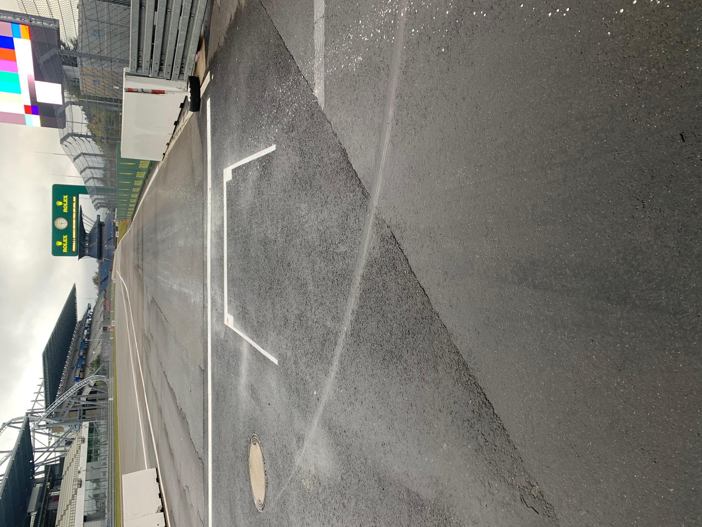
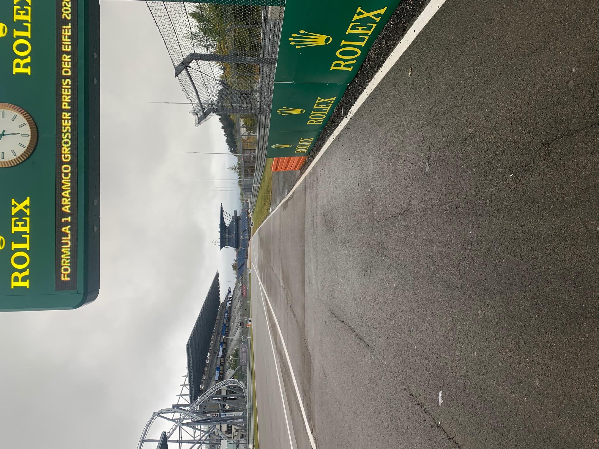
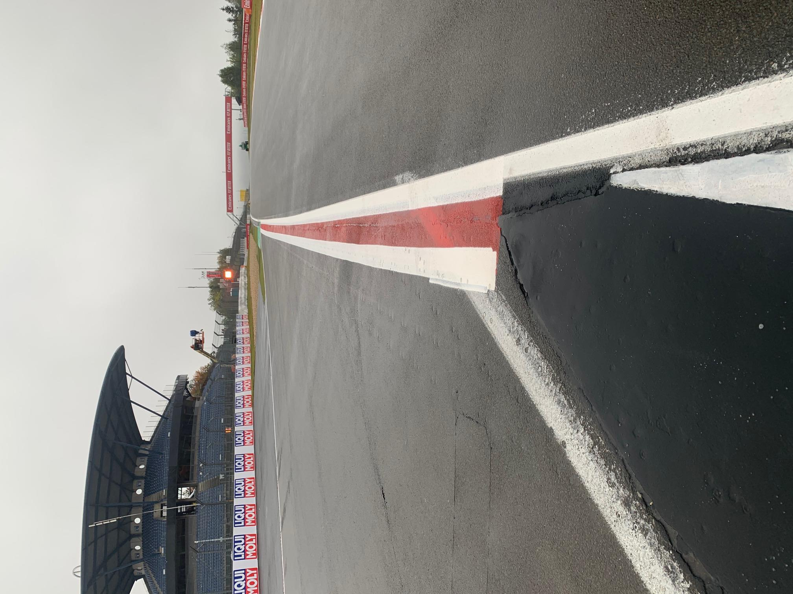
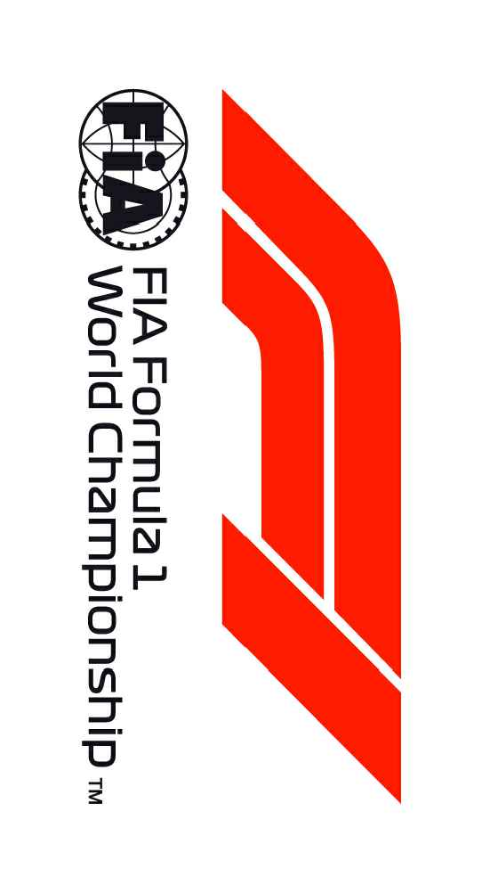

2020 EIFEL GRAND PRIX

8 - 11 October 2020

From The FIA Formula One Race Director Document 7

To All Teams, All Officials Date 08 October 2020

Time 18:20

Title Race Directors' Event Notes Version 2

Description Event Notes Version 2

Enclosed 2020 Eifel F1 Grand Prix Event Notes V2 Doc 07 081020.pdf

Michael Masi

The FIA Formula One Race Director

2020 E G P IFEL RAND RIX

8 - 11 October 2020

From The FIA Formula One Race Director Document 7

To All Teams, All Officials Date 8 October 2020

Time 18:20

EVENT NOTES VERSION 2 General Instructions

1) Pit lane map

1.1 Safety Car lines.

1.2 The location of the pit entry and the pit exit.

1.3 Designated garage areas.

1.4 Safety Car position for first lap and rest of race.

1.5 Blue flag marshal at the pit exit.

1.6 Track light panels displaying pit entry status.

2) Pirelli Event Preview

2.1 With reference to Article 24.4(a) of the Sporting Regulations see the attached document provided by the official tyre supplier.

3) Red zones for photographers in the pit lane during practice sessions

3.1 See the attached drawing.

4) Track light panels

4.1 The FIA track light panels have been installed in the positions shown on the circuit map. In accordance with Appendix H to the ISC the light signals have the same meaning as flag signals.

5) Track light panel displaying pit entry status

5.1 The light panel indicated on the pit lane map will display a flashing yellow arrow if cars are required to use the pit lane once the Safety Car has been deployed during the race.

5.2 The light panel indicated on the pit lane map will display a flashing red cross if the pit lane is closed at any point during the race.

6) Drivers leaving their pit stop position in the pit lane

6.1 For safety reasons, no car should be driven from its pit stop position at any time unless:

a) It has first been driven into the pit stop position having just entered the pit lane from the track,

and;

b) It is then driven immediately back onto the track from the pit stop position.

1/9

7) Observing yellow flags during free practice and qualifying

7.1 Double waved: Any driver passing through a double waved yellow marshalling sector must reduce speed significantly and be prepared to change direction or stop. In order for the stewards to be

satisfied that any such driver has complied with these requirements it must be clear that he has not

attempted to set a meaningful lap time, for practical purposes this means the driver should abandon

the lap (this does not necessarily mean he has to pit as the track could well be clear the following

lap).

7.2 Single waved: Drivers should reduce their speed and be prepared to change direction. It must be clear that a driver has reduced speed and, in order for this to be clear, a driver would be expected

to have braked earlier and/or discernibly reduced speed in the relevant marshalling sector.

Drivers should not overtake any car in a single waved yellow marshalling sector unless it is clear that

a car is slowing with a completely obvious problem, e.g. obvious accident damage or a deflated tyre.

8) In laps during qualifying and reconnaissance laps

8.1 In order to ensure that cars are not driven unnecessarily slowly on in laps during and after the end of qualifying or during reconnaissance laps when the pit exit is opened for the race, drivers must stay

below the maximum time set by the FIA between the Safety Car lines shown on the pit lane map.

You will be informed of the maximum time after the first day of practice.

9) Parc Fermé Cameras

9.1 To assist with the revised FIA Event procedures, the Parc Fermé cameras must be uncovered and operational at all times during the Event.

10) Operational personnel curfew

10.1 Boards warning anyone attempting to enter the paddock that the curfew is in operation will be placed immediately before the turnstiles at the appropriate times.

10.2 At this Event, Personnel will be permitted to enter the Paddock 30 minutes prior to the curfew to assist social distancing. No work is permitted to be undertaken until the curfew has ended.

11) Tyre Blanket Usage during Pit Stops in the Race

11.1 For reasons of safety, tyre blankets are not permitted in the Pit Lane at any time during the race.

12) Lapping during the race

12.1 The ISC requires drivers who are caught by another car about to lap him to allow the faster driver past at the first available opportunity. The F1 Marshalling System has been developed in order to

ensure that the point at which a driver is shown blue flags is consistent, rather than trusting the ability

of marshals to identify situations that require blue flags.

As it was at the end of last season the system will be set to give a pre-warning when the faster car

is within 3.0s of the car about to be lapped, this should be used by the team of the slower car to warn

their driver he is soon going to be lapped and that allowing the faster car through should be

considered a priority. When the faster car is within 1.2s of the car about to be lapped blue flags will

be shown to the slower car (in addition to blue light panels, blue cockpit lights and a message on the

timing monitors) and the driver must allow the following driver to overtake at the first available

opportunity.

It should be noted that the aim of using F1MS is ensure consistent application of the rules, additional

instructions may also be given by race control when necessary.

2/9

Event Specific Instructions

13) Formula 1 Sporting Regulations Article 21.6

13.1 In accordance with the provisions of Article 21.6a) i), this Event is a Closed Event.

14) Changes to the circuit

14.1 This is a new event.

15) Specific Technical Procedures for Closed Events

15.1 The provisions of Technical Directive Ref: TD/039-20 C and the “Pirelli HSE procedures” must be complied with at all times during the Event.

15.2 Any tyres that are removed from a car and could be re-used during a session should be presented for scanning before being rewrapped and reheated. If time constraints do not permit this then all

tyres used during a session must be presented to the tyre checker at the front of the garage Pirelli

area at the end of any session. This applies to dry, wet and intermediate tyres.

15.3 Both TD/039-20 C and the “Pirelli HSE procedures” will be amended after the Event to reflect any additional operational requirements as required.

16) Weighing and weighing platform

16.1 The FIA weighing platform will be available for teams to use at the following times, however, no more than 8 team personnel may be present during any visit. Each visit should last no more than 10

minutes unless no other team is waiting in the pit lane:

a) From 11:00 on Thursday until 10:00 on Friday.

b) From 12:30 on Friday until 14:30 on Saturday (between 13:00 and 14:30 each visit will be

restricted to five minutes).

c) From when the cars are returned to the teams after qualifying until 19:30 on Saturday.

d) From 09:00 until 10:00 and 12:00 until 13:30 on Sunday.

Any team found to be abusing the time limits set out above, which we will be enforced by FIA security

personnel and our own CCTV, will not be permitted to use the weighbridge again during the Event.

16.2 When queuing for the weighing platform, tyre blankets, which use resistive heating elements, may be used at ambient temperatures below 15 °C. The reference for this is the temperature published

on Page 3 of the Official Messaging System. The blankets must be properly fastened around the

tyre and done up tightly and may not cover any car components other than the wheel.

17) Support Races

17.1 Team Barrier placement

a) Team barrier placement prior to and during all support category practice sessions and races:

No more than three metres from the garages.

b) It is not permitted to push cars to the weighing area at any time a support category is in pit

lane.

17.2 Support Category Movements

a) Support Crews and Trolleys will be released into Pit Lane no earlier than 20 minutes prior to

the opening of Pit Exit for their respective sessions.

b) Support Category competition vehicles will be release from the marshalling area no earlier

than 15 minutes prior to the opening of Pit Exit for their respective sessions.

3/9

18) Practice starts

18.1 During each practice session, practice starts may only be carried out on the right-hand side prior to the derestriction line indicated by the white grid marking. Drivers wishing to carry out a practice start

should stop on the right in order to allow other cars to pass on their left. See attached image 1.

18.2 During the time the pit exit is open for the race, practice starts may be carried out after the end of the pit wall and adjacent to the orange band on the right-hand side barrier. Drivers wishing to carry

out a practice start should stop on the right in order to allow other cars to pass on their left. See

attached image 2.

During this time any driver passing a car which has stopped to carry out a practice start may cross

the white line that is referred to in 19.1 below. Any driver crossing this line must move back to the

right of it as quickly as possible.

18.3 For reasons of safety and sporting equity, cars may not stop in the fast lane at any time the pit exit is open without a justifiable reason (a practice start is not considered a justifiable reason).

19) Lines or bollards at the Pit Entry and Pit Exit

19.1 In accordance with Chapter 4 (Section 5) of Appendix L to the ISC drivers must keep to the right of the solid white line at the pit exit when leaving the pits. No part of any car leaving the pits may cross

this line.

19.2 For safety reasons drivers must keep to the right of the first bollard at the pit entry when they are entering the pits.

19.3 Except in the cases of force majeure (accepted as such by the Stewards), the crossing by any part of the car, in any direction, of the white line and/or the red and white painted area, between the pit

entry and the track, by a driver who, in the opinion of the Stewards, had committed to entering the

pit lane is prohibited.

19.4 The dotted white line across the pit entry and across the pit exit are the track edge line.

20) DRS

20.1 DRS Detection will be automatically disabled in each individual zone if any of the light panels in that particular zone are displaying yellow. The zone and corresponding light panels are as follows:

a) Zone 1: Panels 14, 15, 16

b) Zone 2: Panels 1, 2, 18

21) Track Limits

21.1 Turn 4 - Exit

a) A lap time achieved during any practice session or the race by leaving the track (all four wheels

over the white track edge line) on the exit of Turn 4, will result in that lap time being invalidated

by the stewards. See attached image 3 displaying the track edge line.

21.2 General - Turn 4 Exit

a) Each time any car fails to negotiate Turn 4 Exit by using the track, teams will be informed via

the official messaging system.

b) On the third occasion of a driver failing to negotiate Turn 4 Exit by using the track during the

race, he will be shown a black and white flag, any further cutting will then be reported to the

stewards. For the avoidance of doubt this means a total of three occasions combined not three

at each corner.

c) In all cases detailed above, the driver must only re-join the track when it is safe to do so and

without gaining a lasting advantage.

d) The above requirements will not automatically apply to any driver who is judged to have been

forced off the track, each such case will be judged individually.

4/9

21.3 Turn 13-14

a) Drivers are reminded of the provisions of Article 27 of the Sporting Regulations and in particular

Articles 27.2 and 27.3.

22) Fire extinguishers around the circuit

22.1 Indicated by small fluorescent orange boards behind the barriers.

23) Places to remove cars from the track

23.1 Indicated by fluorescent orange panels on the barriers.

23.2 Should a car stop on the track during a session, the driver must keep all of their protective clothing (Helmet, Gloves, etc) on until they have returned to their garage.

23.3 If a driver has a choice where to stop during a session, it is recommended they do so on the right- hand side of the track as cars may then be recovered more easily and brought back to the pits.

24) Sporting Regulations Article 36.4

24.1 In addition to the provisions of Article 36.4, and for reasons of safety, tyre blankets must be disconnected from any power supply at the five-minute signal and must not be reconnected during

the start procedure, unless the delayed start signal is shown.

25) Access to the grid prior to the Start Procedure

25.1 To assist social distancing in accessing the grid prior to the commencement of the start procedure, Team personnel and equipment will be granted access to the grid from 1310hrs on Sunday 11th

October.

26) Removing cars from the grid

26.1 Either through the pit exit or the gate in the pit wall located adjacent to grid position 14.

27) Car number light panels for the start

27.1 On the right-hand side of the grid.

28) Sporting Regulation Article 42.3

28.1 For reasons of safety, Article 42.3 is amended as follows with the additions displayed with double underline:

42.3 When the five minute signal is shown all cars must have their wheels fitted, after this signal

wheels may only be removed if the car has been moved out of the fast lane or during a further

race suspension.

A penalty under Article 38.3(d) will be imposed on any driver whose car did not have all its

wheels fully fitted at the five minute signal or has any of its wheels changed before it leaves

the pit lane after the race has been resumed.

At the two minute point any cars between the safety car and the leader, in addition to any cars

that had been lapped by the leader at the time the race was suspended, will be allowed to

leave the pit lane and complete a further lap, without overtaking, enter the pit lane and then

join the line of cars behind the safety car which left the pit lane when the race was resumed.

29) Post-race parc fermé

29.1 All cars must enter the pit lane and, with the exception of the first three, should be driven directly to the weighing area at the pit entry. The first three must follow the post-race procedure which will be

distributed prior to the start of the race.

5/9

30) Any other business

Michael Masi

FIA Formula One Race Director

6/9

IMAGE 1 – PRACTICE START LOCATION - PRACTICE SESSIONS

PRACTICE START LOCATION DURING EACH PRACTICE SESSION

7/9

IMAGE 2 – PRACTICE START LOCATION – PRIOR TO THE RACE

PRACTICE START LOCATION PRIOR TO THE START OF THE RACE INDICATED WITH THE RED ARROW ABOVE

8/9

IMAGE 3 – TRACK EDGE LINE TURN 4 EXIT

WHITE TRACK EDGE LINE INDICATED WITH THE RED ARROW BELOW

9/9

FORMULA 1 ARAMCO GROSSER PREIS DER EIFEL 2020 - Nürburgring

Circuit Map

M43 M45 18 17 15

14 M44 DRS DETECT M47 M46 M40a 2 T 13 M49 M40 M42 16 DRS ACTIVATION 2 M48 M50 12 M41 15

M1 1 M39

M38 M7 M2 DRS ACTIVATION 1 S2

M36 5 2 M6 M37 M8 3 4 M9 4 11 6 M5 M35 M10 2 14 M3 M11 M4 M34 10 3 1

DRS DETECTION 1 7 M33 M12 13

M13 M31 M32 S1

M30 12 8 M14 M15 Start Line 5 9 Control Line M29 M16 9 S1 Sector 1 90m before Turn 5 6 M18 S2 Sector 2 85m after Turn 11 M28 8 M27 M17 T Speed Trap 165m before Turn 13 M19 DRS Detection 1 45m before Turn 10 11 DRS Activation 1 55m after Turn 11 M26 M21 M20 DRS Detection 2 115m before Turn 15

M22 DRS Activation 2 73m after Turn 15 M25 15 Corner Numbers 10 M23 M22 Marshal Post 18 FIA Marshal Light Number & Location

7 M24 Circuit Centreline Length = 5.148 km

© 2020 Formula One World Championship Limited The F1 FORMULA 1 logo, F1 logo, FORMULA 1, FORMULA ONE, F1, FIA FORMULA ONE WORLD CHAMPIONSHIP, GRAND PRIX and related marks are trade marks of Formula One Licensing BV, a                                                                                                                        VERSION 3 - ISSUED 07.10.20

| Grand Prix of Germany 09/10-11/10/2020 (20R11NUR) |  |  |  |  |  |  |  |  |
| --- | --- | --- | --- | --- | --- | --- | --- | --- |
| Compound |  | FL | FR | RL | RR |  |  |  |
| C2 |  | 2A1 | 2A2 | 2A3 | 2A4 |  |  |  |
| C3 |  | 3B1 | 3B2 | 3B3 | 3B4 |  |  |  |
| C4 |  | 4C1 | 4C2 | 4C3 | 4C4 |  |  |  |
| INTERMEDIATE |  | 33X | 35X | 37X | 39X |  | Q3 tyre |  |
| WET |  | 34Y | 36Y | 37Y | 39Y |  | C4 |  |
| MINIMUM STARTING PRESSURE, BLISTERING SENSITIVITY, CAMBER LIMIT |  |  | Front (psi) |  |  | Rear (psi) |  |  |
|  | Slicks |  | 22.5 |  |  | 19.0 |  |  |
|  | Intermediate |  | 20.5 |  |  | 19.0 |  |  |
|  | Wet | FE EOS Camber Limit RE EOS Camber limit -3.5° | 19.5 |  |  | 18.0 | -2.00 ° |  |
| FE Blistering RE Blistering |  |  |  |  |  |  |  |  |
| sensitivity sensitivity |  |  |  |  |  |  |  |  |
| Low |  |  |  |  |  |  |  | Medium |

GENERAL NOTES Teams are kindly reminded that the following parameters will be subjected to FIA checks during the event: - Starting pressure. - Camber at maximum speed. - Maximum blanket temperature. - Tyre swapping.

| TyreNotes |  |
| --- | --- |
| •Not permittedto switch tyres from their originally allocated position. •Do not subject tyres tolarge deformation or heavy impact. •Do not leave fitted tyres exposed at an airtemperature lower than 15°C and/or any UV emission. •Revisedprescriptions could be issued dring the race weekend in accordance with TD/036-18. | •Alltemperature limits apply to the actual tyre surface temperature, measured with the IR gun detailed in the Appendix to the Technical and Sporting regulations. •STORAGE temperature is the recommended temperature the tyre can stay in blanketswithout time limit. •BLANKET HEATING TIME for each temperature range to be countedfrom the moment the blanket control unit is set to reach its targeted temperature within its correspondent interval. |

enaL 0202

rebotcO tiP eniL 7– lortnoC 1 noisreV

| 1 | 1 alumroF | detangiseD aerA egaraG |
| --- | --- | --- |
| 2 | AIF |  |
| 3 | AIF | sedecreM |
| 4 | sedecreM |  |
| 5 | sedecreM |  |
| 6 | sedecreM | irarreF |
| 7 | irarreF |  |
| 8 | irarreF |  |
| 9 | irarreF | lluB deR |
| 01 | lluB deR |  |
| 11 | lluB deR |  |
| 21 | lluB deR | neraLcM |
| 31 | neraLcM |  |
| 41 | neraLcM |  |
| 51 | neraLcM | tluaneR |
| 61 | tluaneR |  |
| 71 | tluaneR |  |
| 81 | tluaneR | iruaTahplA |
| 91 | iruaTahplA |  |
| 02 | iruaTahplA |  |
| 12 | iruaTahplA | tnioP gnicaR |
| 22 | tnioP gnicaR |  |
| 32 | tnioP gnicaR |  |
| 42 | tnioP gnicaR | oemoR aflA |
| 52 | oemoR aflA |  |
| 62 | oemoR aflA |  |
| 72 | oemoR aflA | saaH |
| 82 | saaH |  |
| 92 | saaH |  |
| 03 | saaH | smailliW |
| 13 | smailliW |  |
| 23 | smailliW |  |
| 33 | smailliW |  |

1 ENIL

RAC

YTEFAS

YRTNE STRATS ENAL TIP X ENAL TSAF TIP slenap RAC dralloB yrtnE PAL YTEFAS TSRIF sutatS tiP

MORF EREH

DEREVOCER DECALP

xirP X KCART SRAC dnarG

segaraG

m052 lefiE 1F

0202

lahsraM – )llaw RAC ECAR tip noitisoP YTEFAS galF fo dne( eulB eloP

SDNE TIXE ENAL ENAL TIP TIP TSAF galF lahsraM 2 ENIL eulB RAC

YTEFAS

potS noitisoP

tiP

1 m7.6 18.6m 2 7.6 18.6m 3 7.6 18.6m

yawklaW E N O Z D E R 4 m7.6 18.5m 5 m7.6 18.5m 6 m7.6 18.5m NOISIVID HSEM 7 m7.6 S 18.5m 8 m7.6 18.5m 9 m7.6 E 18.5m 0202

E N 1 0 m7.6 G O 18.5m Z D LEFIE 11 m7.6 E R .devreser 18.5m 21 m7.6 sthgir A NOISIVID 18.5m HSEM RED llA 31 m7.6 .elibomotuA'l 18.5m 41 m7.6 SIERP ed 18.5m elanoitanretnI 51 m7.6 R 18.5m noitarédéF RESSORG eht fo 61 kram m7.6 A 9.8m 8.7m edart 71 m7.6 E N a si ogol 18.5m O Z AIF 81 m7.6 D OCMARA ehT 18.5m E .ynapmoc G NOISIVID HSEM R 91 m7.6 1 18.5m alumroF 02 m7.6 a ,VB 18.5m gnisneciL 12 m7.6 9.8m 8.7m 1 enO ALUMROF alumroF

fo skram 22 m7.6 edart 18.5m era 2 3 m7.6 skram 18.5m NOISIVID HSEM E detaler 2 4 m7.6 N O dna 18.5m Z XIRP 5 D 2 m7.6 E DNARG 18.5m R NOISIVID HSEM 62 ,PIHSNOIPMAHC m7.6 18.5m 72 m7.6 18.5m DLROW

ENO ALUMROF 82 m7.6 18.5m AIF 92 ,1F m7.6 ,ENO NOISIVID 18.5m HSEM E N detimiL ALUMROF 03 m7.6 O 18.5m Z pihsnoipmahC ,1 13 D ALUMROF 7.6 E 18.5m R NOISIVID HSEM 23 m7.6 dlroW ,ogol 18.5m 1F enO ,ogol 33 m7.6 alumroF 1 ALUMROF 18.5m

0202 1F ehT ©
