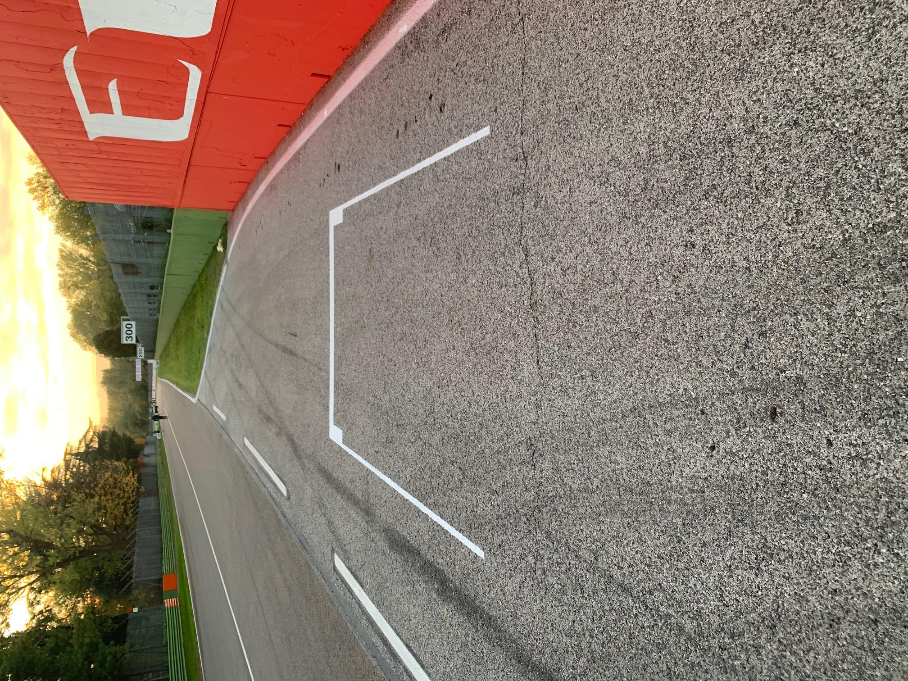
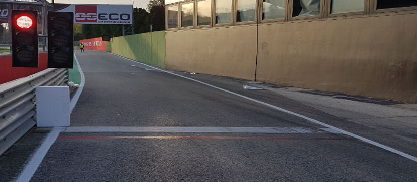
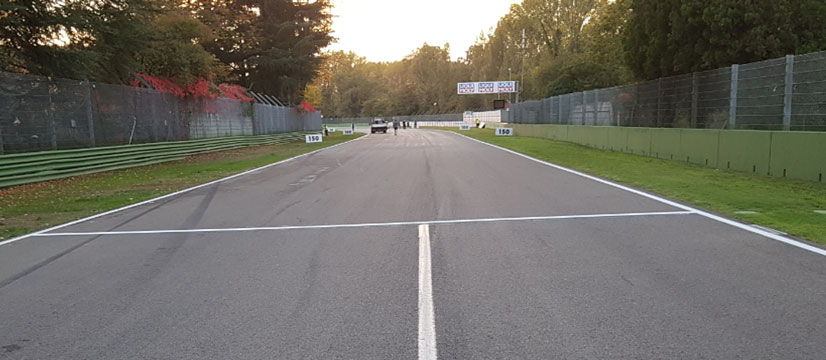

2020 EMILIA ROMAGNA GRAND PRIX

30 October - 1 November 2020

From The FIA Formula One Race Director Document 17

To All Teams, All Officials Date 31 October 2020

Time 12:53

Title Race Directors' Event Notes Version 3

Description Event Notes Version 3

Enclosed 2020 Emilia Romagna F1 Grand Prix Event Notes V3 Doc 17 311020.pdf

Michael Masi

The FIA Formula One Race Director

2020 E R G P MILIA OMAGNA RAND RIX

30 October - 1 November 2020

From The FIA Formula One Race Director Document 17

To All Teams, All Officials Date 31 October 2020

Time 12:45

EVENT NOTES VERSION 3 General Instructions

1) Pit lane map

1.1 Safety Car lines.

1.2 The location of the pit entry and the pit exit.

1.3 Designated garage areas.

1.4 Safety Car position for first lap and rest of race.

1.5 Blue flag marshal at the pit exit.

1.6 Track light panels displaying pit entry status.

2) Pirelli Event Preview

2.1 With reference to Article 24.4(a) of the Sporting Regulations see the attached document provided by the official tyre supplier.

3) Red zones for photographers in the pit lane during practice sessions

3.1 See the attached drawing.

4) Track light panels

4.1 The FIA track light panels have been installed in the positions shown on the circuit map. In accordance with Appendix H to the ISC the light signals have the same meaning as flag signals.

5) Track light panel displaying pit entry status

5.1 The light panel indicated on the pit lane map will display a flashing yellow arrow if cars are required to use the pit lane once the Safety Car has been deployed during the race.

5.2 The light panel indicated on the pit lane map will display a flashing red cross if the pit lane is closed at any point during the race.

6) Drivers leaving their pit stop position in the pit lane

6.1 For safety reasons, no car should be driven from its pit stop position at any time unless:

a) It has first been driven into the pit stop position having just entered the pit lane from the track,

and;

b) It is then driven immediately back onto the track from the pit stop position.

1/7

7) Observing yellow flags during free practice and qualifying

7.1 Double waved: Any driver passing through a double waved yellow marshalling sector must reduce speed significantly and be prepared to change direction or stop. In order for the stewards to be

satisfied that any such driver has complied with these requirements it must be clear that he has not

attempted to set a meaningful lap time, for practical purposes this means the driver should abandon

the lap (this does not necessarily mean he has to pit as the track could well be clear the following

lap).

7.2 Single waved: Drivers should reduce their speed and be prepared to change direction. It must be clear that a driver has reduced speed and, in order for this to be clear, a driver would be expected

to have braked earlier and/or discernibly reduced speed in the relevant marshalling sector.

Drivers should not overtake any car in a single waved yellow marshalling sector unless it is clear that

a car is slowing with a completely obvious problem, e.g. obvious accident damage or a deflated tyre.

8) In laps during qualifying and reconnaissance laps

8.1 In order to ensure that cars are not driven unnecessarily slowly on in laps during and after the end of qualifying or during reconnaissance laps when the pit exit is opened for the race, drivers must stay

below the maximum time set by the FIA between the Safety Car lines shown on the pit lane map.

You will be informed of the maximum time after free practice 1.

9) Parc Fermé Cameras

9.1 To assist with the revised FIA Event procedures, the Parc Fermé cameras must be uncovered and operational at all times during the Event.

10) Operational personnel curfew

10.1 Boards warning anyone attempting to enter the paddock that the curfew is in operation will be placed immediately before the turnstiles at the appropriate times.

10.2 At this Event, Personnel will be permitted to enter the Paddock 30 minutes prior to the curfew to assist social distancing. No work is permitted to be undertaken until the curfew has ended.

11) Tyre Blanket Usage during Pit Stops in the Race

11.1 For reasons of safety, tyre blankets are not permitted in the Pit Lane at any time during the race.

12) Lapping during the race

12.1 The ISC requires drivers who are caught by another car about to lap him to allow the faster driver past at the first available opportunity. The F1 Marshalling System has been developed in order to

ensure that the point at which a driver is shown blue flags is consistent, rather than trusting the ability

of marshals to identify situations that require blue flags.

As it was at the end of last season the system will be set to give a pre-warning when the faster car

is within 3.0s of the car about to be lapped, this should be used by the team of the slower car to warn

their driver he is soon going to be lapped and that allowing the faster car through should be

considered a priority. When the faster car is within 1.2s of the car about to be lapped blue flags will

be shown to the slower car (in addition to blue light panels, blue cockpit lights and a message on the

timing monitors) and the driver must allow the following driver to overtake at the first available

opportunity.

It should be noted that the aim of using F1MS is ensure consistent application of the rules, additional

instructions may also be given by race control when necessary.

2/7

Event Specific Instructions

13) Formula 1 Sporting Regulations Article 21.6

13.1 In accordance with the provisions of Article 21.6a) i), this Event is a Closed Event.

14) Changes to the circuit

14.1 This is a new event.

15) Specific Technical Procedures for Closed Events

15.1 The provisions of Technical Directive Ref: TD/039-20 C and the “Pirelli HSE procedures” must be complied with at all times during the Event.

15.2 Any tyres that are removed from a car and could be re-used during a session should be presented for scanning before being rewrapped and reheated. If time constraints do not permit this then all

tyres used during a session must be presented to the tyre checker at the front of the garage the end

of any session. This applies to dry, wet and intermediate tyres.

15.3 Both TD/039-20 C and the “Pirelli HSE procedures” will be amended after the Event to reflect any additional operational requirements as required.

15.4 When queuing for the weighing platform, tyre blankets, which use resistive heating elements, may be used at ambient temperatures below 15 °C. The reference for this is the temperature published

on Page 3 of the Official Messaging System. The blankets must be properly fastened around the

tyre and done up tightly and may not cover any car components other than the wheel.

16) Weighing and weighing platform

16.1 The FIA weighing platform will be available for teams to use at the following times, however, no more than 8 team personnel may be present during any visit. Each visit should last no more than 10

minutes unless no other team is waiting in the pit lane:

a) From 11:00 on Friday until 13:30 on Saturday (between 11:30 and 13:30 each visit will be

restricted to five minutes).

b) From when the cars are returned to the teams after qualifying until 18:30 on Saturday.

c) From 08:00 until 09:00 and 11:00 until 12:30 on Sunday.

Any team found to be abusing the time limits set out above, which we will be enforced by FIA security

personnel and our own CCTV, will not be permitted to use the weighbridge again during the Event.

17) Support Races

17.1 Team Barrier placement

a) Team barrier placement prior to and during all support category practice sessions and races:

No more than three metres from the garages.

b) It is not permitted to push cars to the weighing area at any time a support category is in pit

lane.

17.2 Support Category Movements

a) Support Crews and Trolleys will be released into Pit Lane no earlier than 20 minutes prior to

the opening of Pit Exit for their respective sessions.

b) Support Category competition vehicles will be release from the marshalling area no earlier

than 15 minutes prior to the opening of Pit Exit for their respective sessions.

18) Practice starts

18.1 Free Practice

a) Practice starts may be carried out on the track at the end of the free practice session, none

3/7

may be carried out in the pit lane. Any car on the track when the chequered flag is shown may

then complete another lap and, instead of entering the pits, proceed to the grid and carry out

a practice start.

All drivers carrying out a practice must do so by pulling as far forward on the grid as possible

and, if necessary, should wait for others to carry out a start before getting to a grid position

further forward. Under no circumstances should a driver make a practice start if another car is

still stationary in front of him on the same side of the grid.

If any driver appears to be disregarding any of the above a red flag will be displayed and the

possibility to carry out any further starts will be immediately terminated.

18.2 Race

a) During the time the pit exit is open for the race, practice starts may be carried out on the right

hand side adjacent to the Emirates signage on the pit exit and indicated by the white grid

marking. Drivers wishing to carry out a practice start should stop on the right in order to allow

other cars to pass on their left. See attached Image.

b) During this time, any driver passing a car which has stopped to carry out a practice start may

cross the white line that is referred to in 19.1 below. Any driver crossing this line must move

back to the right of it as quickly as possible.

18.3 For reasons of safety and sporting equity, cars may not stop in the fast lane at any time the pit exit is open without a justifiable reason (a practice start is not considered a justifiable reason).

19) Lines or bollards at the Pit Entry and Pit Exit

19.1 In accordance with Chapter 4 (Section 5) of Appendix L to the ISC drivers must keep to the right of the solid white line at the pit exit when leaving the pits. No part of any car leaving the pits may cross

this line.

19.2 For safety reasons drivers must keep to the right of the bollard at the pit entry when they are entering the pits.

19.3 Except in the cases of force majeure (accepted as such by the Stewards), the crossing by any part of the car, in any direction, of the green painted area, between the pit entry and the track, by a driver

who, in the opinion of the Stewards, had committed to entering the pit lane is prohibited.

20) DRS

20.1 DRS Detection will be automatically disabled in each individual zone if any of the light panels in that particular zone are displaying yellow. The zone and corresponding light panels are as follows:

a) Zone 1: Panels 1, 2, 3, 4

21) Track Limits

21.1 Turn 9 - Exit

a) A lap time achieved during any practice session or the race by leaving the track on the exit of

Turn 9, will result in that lap time being invalidated by the stewards. A driver will be judged to

have left the track if no part of the car remains in contact with the track.

21.2 Turn 15 - Exit

a) A lap time achieved during any practice session or the race by leaving the track and cutting

behind the red, white and green kerb on the exit of Turn 15, will result in that lap time being

invalidated by the stewards.

21.3 Turn 13 – Apex

a) A lap time achieved during any practice session by leaving the track and cutting behind the

red, white and green kerb on the apex of Turn 13, will result in that lap time being invalidated

by the stewards.

4/7

21.4 General – Turn 9 Exit, Turn 15 Exit

A driver will be judged to have left the track if no part of the car remains in contact with the

track.

a) Each time any car fails to negotiate Turn 9 Exit or Turn 15 Exit by using the track, teams will

be informed via the official messaging system.

b) On the third occasion of a driver failing to negotiate Turn 9 Exit and/or Turn 15 Exit by using

the track during the race, he will be shown a black and white flag, any further cutting will then

be reported to the stewards. For the avoidance of doubt this means a total of three occasions

combined not three at each corner.

c) In all cases detailed above, the driver must only re-join the track when it is safe to do so and

without gaining a lasting advantage.

d) The above requirements will not automatically apply to any driver who is judged to have been

forced off the track, each such case will be judged individually.

22) Fire extinguishers around the circuit

22.1 Indicated by small orange boards behind the barriers and attached to the debris fence.

23) Places where drivers may leave the track

23.1 Indicated by short fluorescent orange panels on the barriers.

24) Places to remove cars from the track

24.1 Indicated by large fluorescent orange panels on the barriers.

24.2 If a driver has a choice where to stop during a session, it is recommended they do so on the right hand side of the track as cars may then be recovered more easily and brought back to the pits.

24.3 Should a car stop on the track during a session, the driver must keep all of their protective clothing (Helmet, Gloves, etc) on until they have returned to their garage.

25) Sporting Regulations Article 36.4

25.1 In addition to the provisions of Article 36.4, and for reasons of safety, tyre blankets must be disconnected from any power supply at the five-minute signal and must not be reconnected during

the start procedure, unless the delayed start signal is shown.

26) Access to the grid prior to the Start Procedure

26.1 To assist social distancing in accessing the grid prior to the commencement of the start procedure, Team personnel and equipment will be granted access to the grid from 1210hrs on Sunday 1st

November.

27) Removing cars from the grid

27.1 Through the gate in the pit wall located adjacent to grid position 14.

28) Car number light panels for the start

28.1 On the right-hand side of the grid.

29) Race Suspension

29.1 In the case of a race suspension, cars will be stopped in the pit lane fast lane in the vicinity of the start tower.

5/7

30) Sporting Regulation Article 42.3

30.1 For reasons of safety, Article 42.3 is amended as follows with the additions displayed with double underline:

42.3 When the five minute signal is shown all cars must have their wheels fitted, after this signal

wheels may only be removed if the car has been moved out of the fast lane or during a further

race suspension.

A penalty under Article 38.3(d) will be imposed on any driver whose car did not have all its

wheels fully fitted at the five minute signal or has any of its wheels changed before it leaves

the pit lane after the race has been resumed.

At the two minute point any cars between the safety car and the leader, in addition to any cars

that had been lapped by the leader at the time the race was suspended, will be allowed to

leave the pit lane and complete a further lap, without overtaking, enter the pit lane and then

join the line of cars behind the safety car which left the pit lane when the race was resumed.

31) Post-race parc fermé

31.1 All cars must enter the pit lane and, with the exception of the first three, should be driven directly to the weighing area at the pit entry. The first three must follow the post-race procedure which will be

distributed prior to the start of the race.

32) TD/036-18 – Data Exchange with Pirelli

32.1 For this Event only, please find below the amendments to TD/036-18 Data exchange with Pirelli; point 3; Event by Event Communication: Deletion are displayed as strikethrough and additions are

double underlined.

As previously agreed, for each race, the following data transfer is expected:

a) On Monday three weeks before the relevant race teams must provide updated simulation data

based on the expected performance of their car for both Q (low fuel, DRS on, Full ERS release)

and Race (110Kg, DRS off, Balanced ERS release, -5% grip level).

b) On Monday two weeks before the race Pirelli will distribute the official Event preview.

c) No later than two hours after the end of P2 Q teams must provide telemetry data from P1 and

P2 Q in the agreed format. If either of these sessions is declared wet teams must also provide

telemetry data from the following dry session no later than two hours after its end, and so on

until Pirelli has received data from two dry sessions (weather permitting).

d) No more than four hours after receiving the data Pirelli will complete their analysis and decide

whether or not updated prescriptions are necessary. Should new prescriptions be deemed

necessary, and the decision is taken after the end of P3, tyre pressures will be the only

parameter subject to change.

e) The teams should provide telemetry data for both qualifying and the race within three days of

the Event in question.

We expect teams to upload all the data to the Pirelli ftp site respecting the agreed format and naming

code. If any team is unable to provide all of this data the FIA will be informed and will require an

explanation as to why this was the case.

33) Any other business

Michael Masi

FIA Formula One Race Director

6/7

IMAGE 1 – PRE-RACE PRACTICE START LOCATION

PRACTICE START LOCATION PRIOR TO THE START OF THE RACE

7/7

enaL X slenap yrtnE 0202 tiP sutatS rebotcO tiP

|  | lortnoC rewoT ecaR | saerA detangiseD egaraG |
| --- | --- | --- |
| A | AIF |  |
| B | AIF |  |
| C | AIF |  |
| 1 | 1 alumroF |  |
| 2 | 1 alumroF |  |
| 3 | sedecreM | sedecreM |
| 4 | sedecreM |  |
| 5 | sedecreM |  |
| 6 | irarreF | irarreF |
| 7 | irarreF |  |
| 8 | irarreF |  |
| 9 | lluB deR | lluB deR |
| 01 | lluB deR |  |
| 11 | lluB deR neraLcM | neraLcM |
| 31 | neraLcM |  |
| 41 | neraLcM |  |
| 51 | tluaneR | tluaneR |
| 61 | tluaneR |  |
| 71 | tluaneR |  |
| 81 | iruaTahplA | iruaT ahplA |
| 91 | iruaTahplA |  |
| 02 | iruaTahplA |  |
| 12 | tnioP gnicaR | gnicaR tnioP |
| 22 | tnioP gnicaR |  |
| 32 | tnioP gnicaR |  |
| 42 | oemoR aflA | oemoR aflA |
| 52 | oemoR aflA |  |
| 62 | oemoR aflA |  |
| 72 | saaH | saaH |
| 82 | saaH |  |
| 92 | saaH |  |
| 03 | smailliW | smailliW |
| 13 | smailliW |  |
| 23 | smailliW |  |

X 03– eniL 2 RAC noisreV PAL lortnoC YTEFAS TSRIF

RAC dralloB 1 ENAL YTEFAS ENIL

YRTNE yrtnE TSAF

xirP tiP TIP

dnarG

STRATS

angamoR MORF ENAL EREH

DEREVOCER TIP DECALP

KCART SRAC ailimE

s e g a r 0202 a G 1 F

ENAL – RAC SDNE ECAR YTEFAS TSAF ENAL

TIP

RAC TIXE 2 potS noitisoP YTEFAS ENIL TIP tiP GALF lahsraM

EULB

| Grand Prix of Emilia Romagna 31/10-01/11/2020 (20R13IMO) |  |  |  |  |  |  |  |  |
| --- | --- | --- | --- | --- | --- | --- | --- | --- |
| Compound |  | FL | FR | RL | RR |  |  |  |
| C2 |  | 2A1 | 2A2 | 2A3 | 2A4 |  |  |  |
| C3 |  | 3B1 | 3B2 | 3B3 | 3B4 |  |  |  |
| C4 |  | 4C1 | 4C2 | 4C3 | 4C4 |  |  |  |
| INTERMEDIATE |  | 33X | 35X | 37X | 39X |  | Q3 tyre |  |
| WET |  | 34Y | 36Y | 37Y | 39Y |  | C4 |  |
| MINIMUM STARTING PRESSURE, BLISTERING SENSITIVITY, CAMBER LIMIT |  |  | Front (psi) |  |  | Rear (psi) |  |  |
|  | Slicks |  | 23,0 |  |  | 20,0 |  |  |
|  | Intermediate |  | 21,0 |  |  | 20,0 |  |  |
|  | Wet | FE EOS Camber Limit RE EOS Camber limit -3,5° | 20,0 |  |  | 19,0 | -2,00 ° |  |
| FE Blistering RE Blistering |  |  |  |  |  |  |  |  |
| sensitivity sensitivity |  |  |  |  |  |  |  |  |
| Medium |  |  |  |  |  |  |  | Medium |

GENERAL NOTES Teams are kindly reminded that the following parameters will be subjected to FIA checks during the event: - Starting pressure. - Camber at maximum speed. - Maximum blanket temperature. - Tyre swapping.

| TyreNotes |  |
| --- | --- |
| •Not permittedto switch tyres from their originally allocated position. •Do not subject tyres tolarge deformation or heavy impact. •Do not leave fitted tyres exposed at an airtemperature lower than 15°C and/or any UV emission. •Revisedprescriptions could be issued dring the race weekend in accordance with TD/036-18. | •Alltemperature limits apply to the actual tyre surface temperature, measured with the IR gun detailed in the Appendix to the Technical and Sporting regulations. •STORAGE temperature is the recommended temperature the tyre can stay in blanketswithout time limit. •BLANKET HEATING TIME for each temperature range to be countedfrom the moment the blanket control unit is set to reach its targeted temperature within its correspondent interval. |

