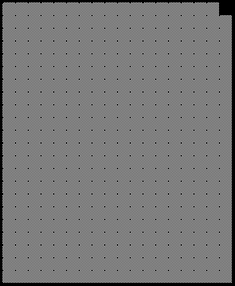
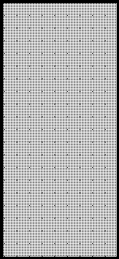
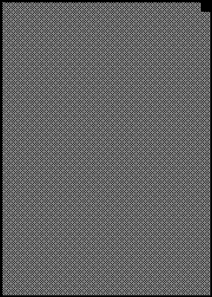

70TH ANNIVERSARY GRAND PRIX

6 – 9 August 2020

From The FIA Formula One Race Director Document 20

To All Teams, All Officials Date 08 August 2020

Time 12:07

Title Race Directors Note - Post Qualifying Procedure

Description Post Qualifying Procedure

Enclosed 70TH Anniversary Grand Prix - Post Qualifying Procedure Doc 20 080820.pdf

Michael Masi

The FIA Formula One Race Director

70 A G P TH NNIVERSARY RAND RIX

6 – 9 August 2020

From The FIA Formula One Race Director Document 20

To All Teams, All Officials Date 8 August 2020

Time 12:05

NOTE TO TEAMS

The Post-Qualifying interview procedure requires the top three drivers to be interviewed as soon as they get out of their cars in the Pit Lane.

Should either of your drivers be among the top three at the end of qualifying we would like to ask for your co-operation in following the procedure below:

• If they take the chequered flag at the end of Q3, the fastest three drivers should proceed directly to the Pit Lane where the 1, 2, 3 boards which will be located at the pit lane entry close to the permanent podium.

• Other than the team mechanics (with cooling fans if necessary), officials and FIA pre-approved television crews and the three FIA approved photographers, no one else will be allowed in the designated area at this time (no driver physios nor team PR personnel).

• Once out of their cars, the top three Drivers will be weighed by the FIA. Each Driver must remain fully attired until after they have been weighed (e.g: Helmet, Gloves, etc).

• After the Drivers have been weighed, the Post-Qualifying interviews will take place in this designated area.

• If one of the top three drivers is already in the Pit Lane at the end of the session, the team should ensure that he goes directly to the designated area once the other drivers have arrived there.

• At the end of the live interviews the pole position driver will be led to the backdrop located under the permanent podium for the AfRS and Pirelli Pole Position Award photo opportunity.

• The top three drivers will then be escorted by the FIA Media Delegate to the FIA Press Conference located on the 1st floor of the Race Control Building.

• At the end of the FIA Press Conference, the top three drivers will go to the TV pen, located at the Pit Entry end of the Paddock behind the Race Control Building and they may be accompanied by their press officers, who should wait to collect their drivers at the back of the press conference room.

• NB: Drivers eliminated in Q1 and Q2, drivers classified from 4th to 10th in Q3 and drivers who did not participate to Q1 but are eligible to race must also attend the TV pen interview session after they have been weighed by the FIA at the end of the last part of qualifying in which they participated.

Please see the attached Qualifying - Parc Fermé Diagram.

gniyfilauQ

0202

tsuguA

- emreF 6– d llaW r 1 3 noisreV

tiP craP st 1

d n 2 srehpargotohP ediskcarT )5 xam(

namaremaC FR VT

xirP

p o rd S k dnarG R c a F B reweivretnI A

m u id yrasrevinnA o P

ht 07

s’rehpargotohP aera devorppA

gnitiaw

srehsinif

ereh

gniniameR dekrap

llaW

tiP
