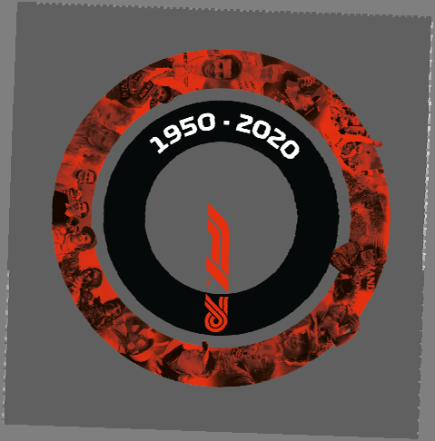

70TH ANNIVERSARY GRAND PRIX

6 – 9 August 2020

From The FIA Formula One Race Director Document 27

To All Teams, All Officials Date 08 August 2020

Time 16:15

Title Race Directors Note - Pre-Race Activities and National Anthem

Description Pre-Race Activities and National Anthem

Enclosed 70TH Anniversary Grand Prix - End Racism & National Anthem Doc 27 080820.pdf

Michael Masi

The FIA Formula One Race Director

70 A G P TH NNIVERSARY RAND RIX

6 – 9 August 2020

From The Stewards Document 27

To All Teams, All Officials Date 8 August 2020

Time 16:15

NOTE TO TEAMS: END RACISM RECOGNITION AND NATIONAL ANTHEM

Please find below a summary of the procedures for the Pre-Race activity to support the End Racism message and National Anthem.

The FIA, Formula 1, Teams and Drivers stand united as a sport in the fight to end racism and fully support equality, inclusivity and equal opportunity for all. The FIA supports any form of individual expression in accordance with the fundamental principles of its Statutes, and as a mark of respect each driver, as an individual, may choose to mark this moment with their own gesture.

The procedure outlined for the pre-race activities are detailed below together with the associated timings:

13.52.30 At F1 personnel visual cue and an announcement over the PA system each Driver wearing their black coloured ‘end racism’ t-shirts will walk to the carpet runner, with the ‘end racism’ banner placed across the width of the track, and stand by their name card.

At this stage the VT of driver pledges will be playing on the International feed whilst Drivers get organised and into position.

13.52:55 Circuit audio: ‘Formula 1 and the FIA will take this moment, in recognition of the importance of equality and equal opportunity for all’.

13.53:00 International Feed goes live to drivers organised in position on the carpet runner.

13:53:03 On the Audio Beep, drivers can choose their gesture of support. As suggestions these gestures could include;

• taking the knee

• standing on carpet with arms crossed in front or behind them

• standing on carpet and bow head

• standing on carpet and pointing to the words ‘end racism’ on their t-shirts

• standing on carpet and place their hand on the heart

• anything else a driver may feel comfortable to do

13.53:30 On the Audio Beep, this moment will be concluded with the audio ‘Thank you for this statement of support to end racism in the world’, and drivers move to their name card position for National Anthem

13.54:00 National Anthem of the United Kingdom will commence.

The FIA, F1 and F1 Teams Communication Directors will continue to manage the media expectations on how this gesture will be marked.

Please see the attached National Anthem Diagram.

Michael Masi

Race Director

