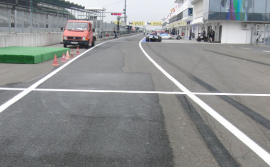

2020 HUNGARIAN GRAND PRIX

16 - 19 July 2020

From The FIA Formula One Race Director Document 2

To All Teams, All Officials Date 16 July 2020

Time 10:45

Title Race Directors' Event Notes

Description Event Notes

Enclosed 2020 Hungarian F1 Grand Prix - Event Notes Doc 02 160720.pdf

Michael Masi

The FIA Formula One Race Director

2020 H G P UNGARIAN RAND RIX

16 – 19 July 2020

From The FIA Formula One Race Director Document 2

To All Teams, All Officials Date 16 July 2020

Time 10:45

EVENT NOTES General Instructions

1) Pit lane map

1.1 Safety Car lines.

1.2 The location of the pit entry and the pit exit.

1.3 Designated garage areas.

1.4 Safety Car position for first lap and rest of race.

1.5 Blue flag marshal at the pit exit.

1.6 Track light panels displaying pit entry status.

2) Pirelli Event Preview

2.1 With reference to Article 24.4(a) of the Sporting Regulations see the attached document provided by the official tyre supplier.

3) Red zones for photographers in the pit lane during practice sessions

3.1 See the attached drawing.

4) Track light panels

4.1 The FIA track light panels have been installed in the positions shown on the circuit map. In accordance with Appendix H to the ISC the light signals have the same meaning as flag signals.

5) Drivers leaving their pit stop position in the pit lane

5.1 For safety reasons, no car should be driven from its pit stop position at any time unless:

a) It has first been driven into the pit stop position having just entered the pit lane from the track,

and;

b) It is then driven immediately back onto the track from the pit stop position.

6) Observing yellow flags during free practice and qualifying

6.1 Double waved: Any driver passing through a double waved yellow marshalling sector must reduce speed significantly and be prepared to change direction or stop. In order for the stewards to be

satisfied that any such driver has complied with these requirements it must be clear that he has not

attempted to set a meaningful lap time, for practical purposes this means the driver should abandon

the lap (this does not necessarily mean he has to pit as the track could well be clear the following

lap).

1/6

6.2 Single waved: Drivers should reduce their speed and be prepared to change direction. It must be clear that a driver has reduced speed and, in order for this to be clear, a driver would be expected

to have braked earlier and/or discernibly reduced speed in the relevant marshalling sector.

Drivers should not overtake any car in a single waved yellow marshalling sector unless it is clear that

a car is slowing with a completely obvious problem, e.g. obvious accident damage or a deflated tyre.

7) In laps during qualifying and reconnaissance laps

7.1 In order to ensure that cars are not driven unnecessarily slowly on in laps during and after the end of qualifying or during reconnaissance laps when the pit exit is opened for the race, drivers must stay

below the maximum time set by the FIA between the Safety Car lines shown on the pit lane map.

You will be informed of the maximum time after the first day of practice.

8) Parc Fermé Cameras

8.1 To assist with the revised FIA Event procedures, the Parc Fermé cameras must be uncovered and operational at all times during the Event.

9) Operational personnel curfew

9.1 Boards warning anyone attempting to enter the paddock that the curfew is in operation will be placed immediately before the turnstiles at the appropriate times.

9.2 At this Event, Personnel will be permitted to enter the Paddock 30 minutes prior to the curfew to assist social distancing. No work is permitted to be undertaken until the curfew has ended.

10) Tyre Blanket Usage during Pit Stops in the Race

10.1 For reasons of safety, tyre blankets are not permitted in the Pit Lane at any time during the race.

11) Lapping during the race

11.1 The ISC requires drivers who are caught by another car about to lap him to allow the faster driver past at the first available opportunity. The F1 Marshalling System has been developed in order to

ensure that the point at which a driver is shown blue flags is consistent, rather than trusting the ability

of marshals to identify situations that require blue flags.

As it was at the end of last season the system will be set to give a pre-warning when the faster car

is within 3.0s of the car about to be lapped, this should be used by the team of the slower car to warn

their driver he is soon going to be lapped and that allowing the faster car through should be

considered a priority. When the faster car is within 1.2s of the car about to be lapped blue flags will

be shown to the slower car (in addition to blue light panels, blue cockpit lights and a message on the

timing monitors) and the driver must allow the following driver to overtake at the first available

opportunity.

It should be noted that the aim of using F1MS is ensure consistent application of the rules, additional

instructions may also be given by race control when necessary.

1/6

Event Specific Instructions

12) Formula 1 Sporting Regulations Article 21.6

12.1 In accordance with the provisions of Article 21.6a) i), this Event is a Closed Event.

13) Changes to the circuit

13.1 All markings on the track, including the track edges, are painted with a genuine non-slip paint.

13.2 The guardrail in the corner of the run-off areas around Turn 1, Turn 5 and Turn 9 has been realigned.

13.3 Additional debris fencing has been installed to protect marshal posts.

14) Specific Technical Procedures for Closed Events

14.1 The provisions of Technical Directive Ref: TD/025-20 must be complied with at all times during the Event, with the exception of point 5 (Scrutineers and tyre checkers), which should be replaced with

the following guidelines:

a) All scrutineers and tyre checkers will be advised to carry out their duties outside the Teams’

garages until further notice.

b) Furthermore, and during all sessions, in the situations detailed at paragraphs 15.1 and 15.2 of

the Pirelli document named “Pirelli HSE procedures – F1 – Covid19_Teams” wheels must be

delivered to the Pirelli area at the rear of the Team’s garage for scanning. This must be done

before any other job is carried out on these wheels (e.g. wear check, pressure check etc.).

c) On the grid, race tyre start pressures will be checked in the normal way.

14.2 For this Event, the requirement for each Competitor to deliver the tyres after runs of eight times laps or more will apply and this will be reviewed for subsequent events.

14.3 Both TD/025-20 and the “Pirelli HSE procedures” will be amended after the Event to reflect any additional operational requirements that we will have gathered during this first weekend of operating

under such conditions.

15) Weighing and weighing platform

15.1 The FIA weighing platform will be available for teams to use at the following times, however, no more than 5 team personnel may be present during any visit. Each visit should last no more than 10

minutes unless no other team is waiting in the pit lane:

a) From 11:00 on Thursday until 10:00 on Friday.

b) From 12:30 on Friday until 14:30 on Saturday (between 13:00 and 14:30 each visit will be

restricted to five minutes).

c) From when the cars are returned to the teams after qualifying until 19:30 on Saturday.

d) From 10:00 until 11:00 and 13:00 until 14:40 on Sunday.

Any team found to be abusing the time limits set out above, which we will be enforced by FIA security

personnel and our own CCTV, will not be permitted to use the weighbridge again during the Event.

16) Support Races

16.1 Team Barrier placement

a) Team barrier placement prior to and during all support category practice sessions and races:

No more than three metres from the garages.

b) It is not permitted to push cars to the weighing area at any time a support category is in pit

lane.

16.2 Support Category Movements

a) Support Crews and Trolleys will be released into Pit Lane no earlier than 20 minutes prior to

the opening of Pit Exit for their respective sessions.

1/6

b) Support Category competition vehicles will be release from the marshalling area no earlier

than 15 minutes prior to the opening of Pit Exit for their respective sessions.

17) Practice starts

17.1 Practice starts may only be carried out at the pit exit on the right-hand side and, for the avoidance of doubt, this includes any time the pit exit is open for the race.

17.2 For reasons of safety and sporting equity, cars may not stop in the fast lane at any time the pit exit is open without a justifiable reason (a practice start is not considered a justifiable reason).

18) Lines or bollards at the Pit Entry and Pit Exit

18.1 In accordance with Chapter 4 (Section 5) of Appendix L to the ISC drivers must keep to the right of the solid white line at the pit exit when leaving the pits. No part of any car leaving the pits may cross

this line.

18.2 For safety reasons drivers must keep to the right of the bollard the pit entry when they are entering the pits.

18.3 Except in the cases of force majeure (accepted as such by the Stewards), the crossing by any part of the car, in any direction, of the red and white painted area between the pit entry and the track, by

a driver who, in the opinion of the Stewards, had committed to entering the pit lane is prohibited.

18.4 The dotted white line across the pit exit is the track edge.

19) Track Limits

19.1 Turn 4 – Exit

a) A lap time achieved during any practice session or the race by leaving the track and cutting

behind the red and white kerb on the exit of Turn 4, will result in that lap time being invalidated

by the stewards.

19.2 Turn 11 – Exit

a) A lap time achieved during any practice session or the race by leaving the track and cutting

behind the red and white kerb on the exit of Turn 11, will result in that lap time being invalidated

by the stewards.

19.3 Turn 12 – Exit

a) A lap time achieved during any practice session or the race by leaving the track and cutting

behind the red and white kerb on the exit of Turn 12, will result in that lap time being invalidated

by the stewards.

19.4 General - Turn 4 Exit, Turn 11 Exit and Turn 12 Exit

a) Each time any car passes behind the red and white exit kerb, teams will be informed via the

official messaging system.

b) On the third occasion of a driver cutting behind the red and white exit kerb at Turns 4, 11 and

12 during the race, he will be shown a black and white flag, any further cutting will then be

reported to the stewards. For the avoidance of doubt this means a total of three occasions

combined not three at each corner.

c) In all cases detailed above, the driver must only re-join the track when it is safe to do so and

without gaining a lasting advantage.

d) The above requirements will not automatically apply to any driver who is judged to have been

forced off the track, each such case will be judged individually.

1/6

20) DRS

20.1 DRS Detection will be automatically disabled in each individual zone if any of the light panels in that particular zone are displaying yellow. The zones and corresponding light panels are as follows:

a) Zone 1: Panels 19,1, 2, 3

b) Zone 2: Panels 3, 4, 5

21) Fire extinguishers around the circuit

21.1 Indicated by small white boards with a red letter ‘F’.

22) Places to remove cars from the track

22.1 Indicated by fluorescent orange panels on the barriers.

22.2 Should a car stop on the track during a session, the driver must keep all of their protective clothing (Helmet, Gloves, etc) on until they have returned to their garage.

22.3 If a driver has a choice where to stop during a session, it is recommended they do so on the right hand side of the track as cars may then be recovered more easily and brought back to the pits.

23) Sporting Regulations Article 36.4

23.1 In addition to the provisions of Article 36.4, and for reasons of safety, tyre blankets must be disconnected from any power supply at the five minute signal and must not be reconnected during

the start procedure, unless the delayed start signal is shown.

24) Access to the grid prior to the Start Procedure

24.1 To assist social distancing in accessing the grid prior to the commencement of the start procedure, Team personnel and equipment will be granted access to the grid from 1410hrs on Sunday 19th July.

25) Removing cars from the grid

25.1 Two gates in the pit wall, the first is adjacent to grid position 4 and the second adjacent to grid position 18.

25.2 The pit lane has a small ramp down from the track which may result in cars grounding when pushed off the grid. It is therefore important that someone from your team is present, close to the gate nearest

your grid positions, to assist marshals if a car has to be pushed off the grid after the start of the

formation lap or after the start of the race.

26) Car number light panels for the start

26.1 On the right-hand side of the grid.

27) Track light panel displaying pit entry status

27.1 The light panels indicated on the pit lane map will display a flashing yellow arrow if cars are required to use the pit lane once the Safety Car has been deployed during the race.

27.2 The light panels indicated on the pit lane map will display a flashing red cross if the pit lane is closed at any point during the race.

28) Post-race parc fermé

28.1 All cars must enter the pit lane and, with the exception of the first three, should be driven directly to the weighing area. The first three must follow the post race procedure which will be distributed prior

to the start of the race.

1/6

29) Any other business

29.1 Blue Flags

29.2 Cars stopping on track in a safe position

Michael Masi

FIA Formula One Race Director

1/6

enaL 0202 dralloB tiP yluJ yrtnE 61– 1 noisreV tiP YRTNE

| 0 | AIF | saerA detangiseD egaraG |  |
| --- | --- | --- | --- |
| 1 | AIF |  | ENAL TSAF ENAL TSAF |
| 2 | AIF |  |  |
| 3 | AIF |  |  |
| 4 | AIF |  |  |
| 5 | 1 alumroF 1 alumroF 1 alumroF | noitisoP potS tiP |  |
| 6 | sedecreM | sedecreM |  |
| 7 | sedecreM |  |  |
| 8 | sedecreM |  |  |
| 9 | sedecreM |  |  |
| 01 | sedecreM |  |  |
| 11 | irarreF | irarreF |  |
| 21 | irarreF |  |  |
| 31 | irarreF |  |  |
| 41 | irarreF |  |  |
| 51 | irarreF |  |  |
| 61 | lluB deR | lluB deR |  |
| 71 | lluB deR |  |  |
| 81 | lluB deR |  |  |
| 91 | lluB deR |  |  |
| 02 | lluB deR |  |  |
| 12 | neraLcM | neraLcM |  |
| 22 | neraLcM |  |  |
| 32 | neraLcM |  |  |
| 42 | neraLcM |  |  |
| 52 | neraLcM |  |  |
| 62 | tluaneR | tluaneR |  |
| 72 | tluaneR |  |  |
| 82 | tluaneR |  |  |
| 92 | tluaneR |  |  |
| 03 | tluaneR |  |  |
| 13 | iruaTahplA | iruaTahplA |  |
| 23 | iruaTahplA |  |  |
| 33 | iruaTahplA |  |  |
| 43 | iruaTahplA |  |  |
| 53 | iruaTahplA |  |  |
| 63 | tnioP gnicaR | tnioP gnicaR |  |
| 73 | tnioP gnicaR |  |  |
| 83 | tnioP gnicaR |  |  |
| 93 | tnioP gnicaR |  |  |
| 04 | tnioP gnicaR |  |  |
| 14 | oemoR aflA | oemoR aflA |  |
| 24 3 | oemoR aflA |  |  |
| 4 44 | oemoR aflA oemoR aflA |  |  |
| 54 | oemoR aflA |  |  |
| 64 | saaH | saaH |  |
| 74 | saaH |  |  |
| 84 | saaH |  |  |
| 94 | saaH |  |  |
| 05 | saaH |  |  |
| 15 | smailliW | smailliW |  |
| 25 | smailliW |  |  |
| 35 | smailliW |  |  |
| 45 | smailliW |  |  |
| 55 | smailliW |  |  |

X TIP

RAC paL YTEFAS slenap tsriF 1 yrtnE eniL sutatS RAC tiP

YTEFAS X

MORF EREH

DEREVOCER DECALP

xirP stratS KCART ENAL SRAC dnarG TIP

segaraG

nairagnuH

1F

sdnE

0202 ENAL

TIP

RAC ecaR YTEFAS

TIXE

TIP

2 eniL lahsraM fo RAC dne ) eht llaw YTEFAS galF retfa tip eht eulB m05 (

| Grand Prix of Hungary 17-19/07/20 (20R03BUD) |  |  |  |  |  |  |  |  |
| --- | --- | --- | --- | --- | --- | --- | --- | --- |
| Compound |  | FL | FR | RL | RR |  |  |  |
| C2 |  | 2A1 | 2A2 | 2A3 | 2A4 |  |  |  |
| C3 |  | 3B1 | 3B2 | 3B3 | 3B4 |  |  |  |
| C4 |  | 4C1 | 4C2 | 4C3 | 4C4 |  |  |  |
| INTERMEDIATE |  | 33X | 35X | 37X | 39X |  | Q3 tyre |  |
| WET |  | 34Y | 36Y | 37Y | 39Y |  | C4 |  |
| MINIMUM STARTING PRESSURE, BLISTERING SENSITIVITY, CAMBER LIMIT |  |  | Front (psi) |  |  | Rear (psi) |  |  |
|  | Slicks |  | 20.0 |  |  | 18.0 |  |  |
|  | Intermediate |  | 18.0 |  |  | 18.0 |  |  |
|  | Wet | FE EOS Camber Limit RE EOS Camber limit -3.75° | 17.0 |  |  | 17.0 | -2.00° |  |
| FE Blistering RE Blistering |  |  |  |  |  |  |  |  |
| sensitivity sensitivity |  |  |  |  |  |  |  |  |
| Low |  |  |  |  |  |  |  | Medium |

GENERAL NOTES Teams are kindly reminded that the following parameters will be subjected to FIA checks during the event: - Starting pressure. - Camber at maximum speed. - Maximum blanket temperature. - Tyre swapping.

| TyreNotes |  |
| --- | --- |
| •Not permittedto switch tyres from their originally allocated position. •Do not subject tyres tolarge deformation or heavy impact. •Do not leave fitted tyres exposed at an airtemperature lower than 15°C and/or any UV emission. •Revisedprescriptions could be issued dring the race weekend in accordance with TD/036-18. | •Alltemperature limits apply to the actual tyre surface temperature, measured with the IR gun detailed in the Appendix to the Technical and Sporting regulations. •STORAGE temperature is the recommended temperature the tyre can stay in blanketswithout time limit. •BLANKET HEATING TIME for each temperature range to be countedfrom the moment the blanket control unit is set to reach its targeted temperature within its correspondent interval. |
